# AWS Bedrock Course — Chapter 7

*Amazon Bedrock AgentCore's two built-in tools — a fully managed headless browser and a secure code interpreter — walked through end-to-end with the AWS Show & Tell team, including two live demos: agentic QA testing and CloudTrail security analysis.*

# 🛠️ AgentCore Tools — Browser & Code Interpreter

> *"An agent is only as good as the tools it has."* — Kosti, AgentCore product team

This episode of AWS Show & Tell is a deep dive into the two first-party tools that ship with Amazon Bedrock AgentCore: the **Browser Tool** (a fully managed headless browser your agent can drive) and the **Code Interpreter** (an isolated microVM where agent-generated code actually runs). The chapter follows the episode's real flow — concept slides, console tour, and two working demos — with every screenshot explained against the transcript.

## 🎬 What This Chapter Covers

By the end of this chapter you will be able to:

- 🌐 Explain **why agents need a browser** — and what a managed headless browser actually provides
- 🔌 Describe **CDP, Playwright/Puppeteer, and Amazon DCV** — the three technologies under the Browser Tool
- 🧭 Trace the **six-step agentic browsing loop** — query → LLM → command → execute → screenshot → repeat
- 🧪 Follow Veda's **agentic QA testing demo** — natural-language test suites run by NovaAct against a live web app
- ⚙️ Explain **why generated code needs a sandbox** — and what the Code Interpreter's per-session microVM isolates
- 📊 Walk through Rahul's **CloudTrail security-analysis demo** — S3 import, `execute_python` tool, and a generated report

**Episode covered:** the full video — *"AgentCore Browser Tool & Code Interpreter | AWS Show & Tell."*

---

## 7.1 Welcome to the Show — Meet the Speakers

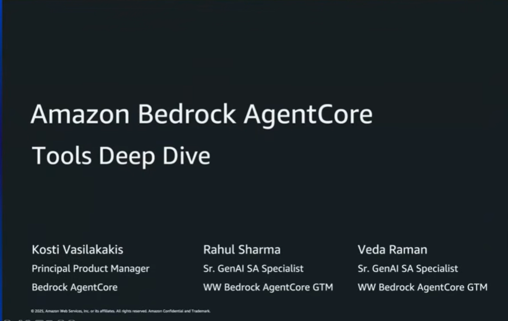

### What you are seeing

The episode's title card: *"Amazon Bedrock AgentCore — Tools Deep Dive."* The show is hosted by **Anil** (senior solutions architect, joining from Princeton, NJ) with three AgentCore specialists: **Kosti** (product team — built the runtime and tools), **Veda Raman** (GenAI SA specialist), and **Rahul Sharma** (senior specialist SA for the first-party tools).

### What the speaker explains

Anil opens the episode: *"Hello everyone, welcome to another episode of AWS Show and Tell."* — *"We are doing a deep dive series on Bedrock AgentCore. Today we are going to cover... Bedrock AgentCore Browser, Code Interpreter — we call these tools."*

### Technical explanation

"Tools" is the AgentCore term for **first-party, AWS-managed capabilities** your agent can invoke — as opposed to your own APIs (which you expose through the AgentCore Gateway, covered in Chapter 5). This episode covers exactly two of them.

### Why it matters

The whole chapter rests on this framing: agents need tools, and AWS ships two opinionated ones — one for the web, one for code.

### Key takeaway

> **AgentCore = primitives (runtime, identity, memory, observability) + tools (browser, code interpreter). Today is the tools episode.**

---

## 7.2 The Episode Agenda

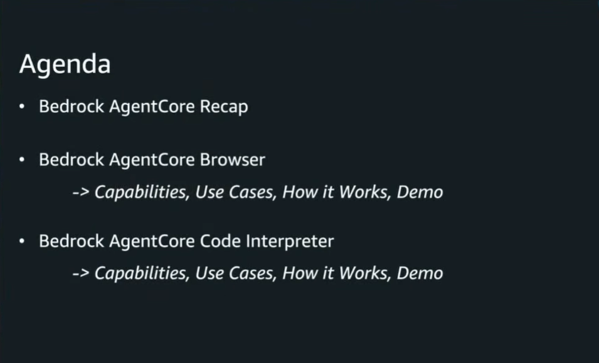

### What you are seeing

The agenda: a quick AgentCore refresher, then a deep dive into the Browser Tool and Code Interpreter — capabilities, use cases, how they work, and live demos for both.

### What the speaker explains

Kosti: *"Three main areas: a quick refresher of what Bedrock AgentCore is... then capabilities, use cases, how it works, and a demo of the tools — browser and code interpreter."*

### Technical explanation

This chapter keeps that same ordering — so when you hit a screenshot you can always ask *"which part of the agenda is this?"* and find it in the timeline.

### Key takeaway

> **Structure: AgentCore recap → Browser Tool (concept + Veda's demo) → Code Interpreter (concept + Rahul's demo) → wrap-up.**

---

## 7.3 What Is AgentCore? — the One-Slide Recap

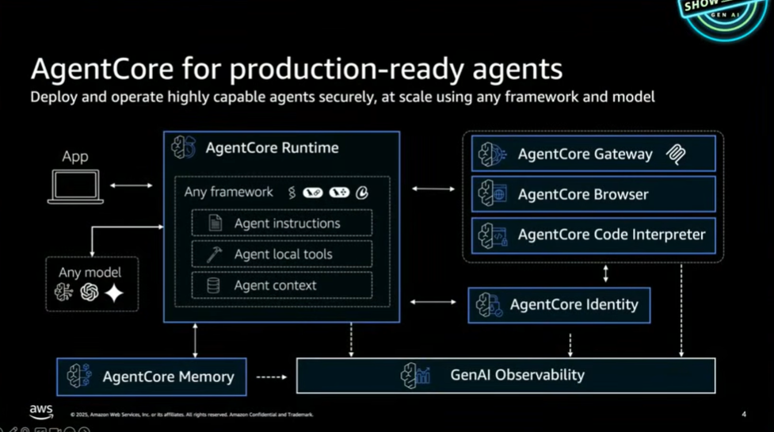

### What you are seeing

The AgentCore platform picture: **Runtime** (serverless, isolated agent hosting) surrounded by **Identity**, **Memory**, **Gateway**, **Observability** — and the **built-in tools** including Browser and Code Interpreter.

### What the speaker explains

Kosti recaps the customer journey: *"They start with an open-source framework — LangGraph, LangChain, CrewAI, Google ADK. They build agents, add tools. But then they need to productionize these agents in a more deterministic, secure and scalable way. That is why we launched AgentCore Runtime."* And : *"An agent is not just good by itself — it's actually as good as the tools that it has."*

### Technical explanation

- **Runtime** — the serverless compute where your agent actually executes (Chapter 4 covered this).
- **Gateway** — how *your* APIs become agent tools (Chapter 5).
- **Identity / Memory / Observability** — auth, short/long-term memory, and tracing (Chapters 6 and the observability course).
- **Browser + Code Interpreter** — the two *first-party* tools AWS runs for you, and the subject of this chapter.

### Why it matters

This slide positions the tools correctly: they are **not required** — everything is modular (*"you can pick and choose"*, as Kosti says) — but they solve the two hardest "real-world access" problems: the web and code execution.

### Key takeaway

> **AgentCore tools are optional, managed building blocks. Gateway brings your APIs; Browser and Code Interpreter come built-in.**

---

## 7.4 Why Do Agents Need a Browser?

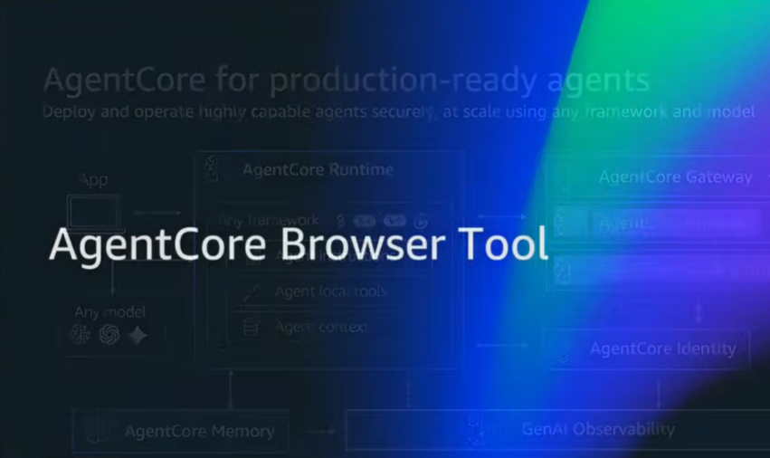

### What you are seeing

The title card marking the first half of the episode: **AgentCore Browser Tool**.

### What the speaker explains

The pivot: *"Let's dive deep on the browser piece... why do agents need browsing? Same question applies — why do humans need browsing?"*

### Key takeaway

> **Everything before this point was platform context. From here, it's tool-specific.**

---

## 7.5 The Three Reasons — Navigate, Automate, Scrape

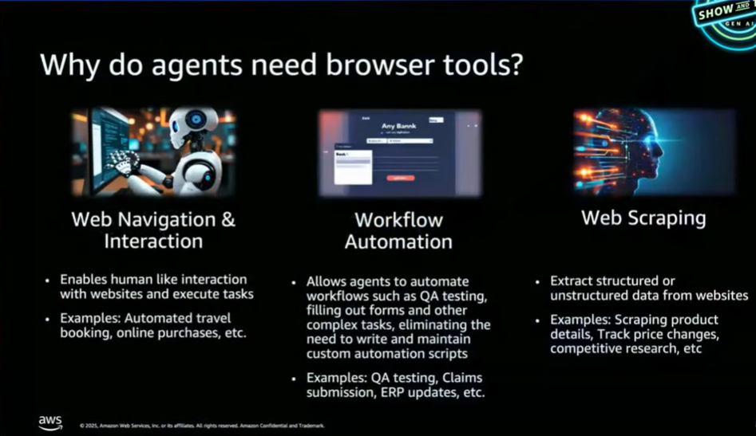

### What you are seeing

Three columns of reasons an agent might need a real browser: **web navigation & interaction** (multi-step forms, QA testing, ERPs), **workflow automation** (back-office processes), and **web scraping/analysis** (competitive research, reports).

### What the speaker explains

Kosti: *"Same reasons we as humans need browsers — we navigate the web, buy things, test that a website works, do competitive analysis on prices, read reports. Agents need it for the same reasons — multi-step forms, back-office automation, QA testing, accessing ERPs, scraping the web to produce reports."*

### Technical explanation

Most of this work has **no API** — the web interface *is* the interface. Many enterprise systems (ERPs, vendor portals) never expose clean APIs, so a browser is the only way an agent can touch them. That reframes the browser from "nice extra" to "the only integration path" for a whole class of tasks.

### Why it matters

When you design an agent, ask: *does this task have an API?* If not, the Browser Tool is the answer — not a custom scraper you maintain.

### Key takeaway

> **Agents need browsers for the same reason humans do — most of the world's workflows only exist as web UIs.**

---

## 7.6 AgentCore Browser — the Feature Sheet

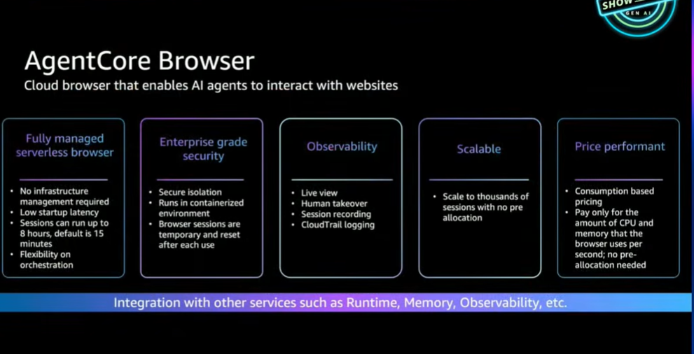

### What you are seeing

Five capability cards for the managed browser: **fully managed & serverless** (sub-second startup, sessions up to 8 hours), **enterprise-grade security** (isolated microVM per session), **observability** (live view + recorded sessions), **scalable**, and **price-performant** (per-second CPU/memory billing).

### What the speaker explains

Kosti walks the list: *"A fully managed headless browser, fully serverless... sub-second latency spin-up... deterministic or fully stochastic with an LLM deciding the next step... sessions up to eight hours... a dedicated microVM — nobody will reuse it... fully observable with a live-view endpoint, human takeover, and recording... we only charge for CPU and memory at the per-second level."*

### Technical explanation

| Feature | What it buys you |
|---|---|
| Serverless + sub-second spin-up | No fleet, no cold-start planning — the agent requests a browser when it needs one |
| Dedicated microVM per session | The browser is isolated; when the session ends, the VM is destroyed |
| Live view + recording | Watch what the agent sees; replay DOM-level actions afterward |
| Per-second CPU/memory billing | No instance sizing — you pay for exactly the resources consumed |

### Why it matters

Running browser automation yourself means managing headless Chrome fleets, browser crashes, session isolation, and recording infrastructure. This feature list is the answer to "why not just run Playwright on my own servers?"

### Key takeaway

> **A browser session is an ephemeral, isolated microVM — observable live and replayable afterward, billed per second.**

---

## 7.7 Three Terms You Need — CDP, Playwright, DCV

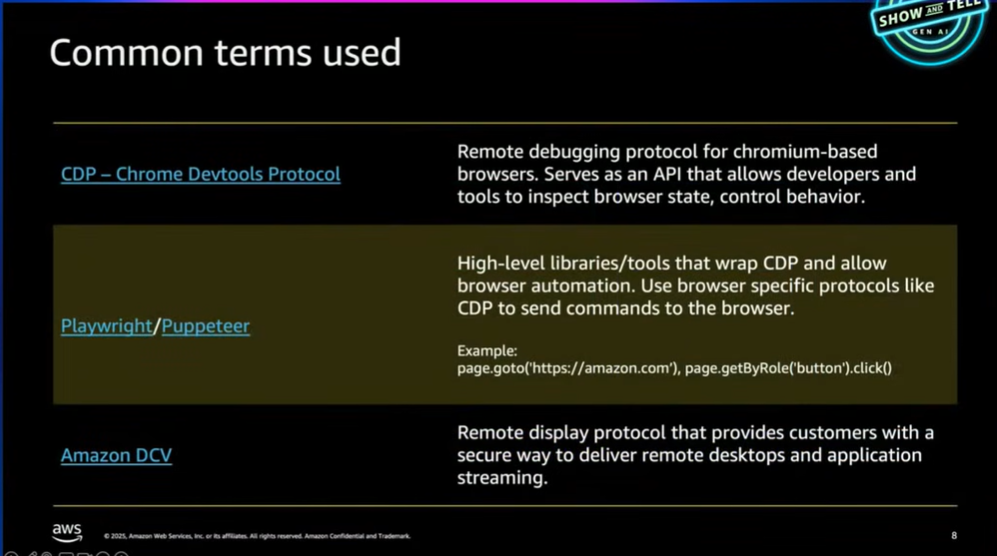

### What you are seeing

The three technologies that make the managed browser work: **CDP** (Chrome DevTools Protocol — low-level commands like navigate, dispatch key events, and domain events for page/network/runtime/input), **Playwright/Puppeteer** (popular libraries that generate CDP commands from friendly APIs), and **Amazon DCV** (high-performance streaming protocol for live view, human takeover, and recording).

### What the speaker explains

Kosti: *"The browser is Chrome-based... driven by CDP — lower-level commands like navigate, dispatch key events, domain-exposed events on page, network, runtime, input. CDP can be verbose and brittle, so open-source libraries like Playwright and Puppeteer generate those CDP commands for you. Lastly there's DCV — it captures the Chromium window, compresses it, sends it over a websocket for live view, human takeover, and it's the one recorded in real time."*

### Technical explanation


```mermaid
flowchart LR
 A["Your agent code"] -- "friendly API calls" --> B["Playwright / Puppeteer / NovaAct"]
 B -- "generates CDP commands" --> C["CDP over WebSocket"]
 C --> D["Chromium browser<br/>inside AgentCore microVM"]
 D -- "rendered frames" --> E["DCV server"]
 E -- "compressed live stream" --> F["Live view / human takeover / recording"]
```


*(The diagram above is our recreation; the original slide is kept for comparison.)*

### Why it matters

Every browser-integration decision maps to one of these three layers: **how your agent drives the browser** (Playwright-class library → CDP) and **how humans observe it** (DCV). The demo wires exactly this: NovaAct → CDP websocket → AgentCore browser; DCV → live view in the console.

### Key takeaway

> **CDP is the control channel, Playwright/Puppeteer are the ergonomic wrappers, DCV is the eyes. AgentCore hosts all three for you.**

---

## 7.8 How It Works — the Six-Step Agentic Loop

<HotspotImage src="/bedrock-deepti/screenshots/c7s08.png" title="AgentCore Browser — How it works (click each numbered step)" hotspots={[
 { "num": 1, "x": 16, "y": 66, "w": 9, "h": 9, "label": "Query", "to": "7-8-how-it-works-the-six-step-agentic-loop", "tip": "End user asks — e.g. 'search for shoes on amazon.com'" },
 { "num": 2, "x": 36, "y": 66, "w": 9, "h": 9, "label": "Invoke LLM", "to": "7-8-how-it-works-the-six-step-agentic-loop", "tip": "Agent calls the LLM with the query + current screenshot" },
 { "num": 3, "x": 56, "y": 66, "w": 9, "h": 9, "label": "Tool use", "to": "7-8-how-it-works-the-six-step-agentic-loop", "tip": "LLM picks the browser tool and the next action" },
 { "num": 4, "x": 72, "y": 40, "w": 10, "h": 10, "label": "Command Translation", "to": "7-8-how-it-works-the-six-step-agentic-loop", "tip": "Playwright/NovaAct converts the action into CDP commands" },
 { "num": 5, "x": 84, "y": 40, "w": 10, "h": 10, "label": "Execution", "to": "7-8-how-it-works-the-six-step-agentic-loop", "tip": "CDP commands run on the Chromium inside the microVM" },
 { "num": 6, "x": 72, "y": 74, "w": 10, "h": 10, "label": "Screenshot", "to": "7-8-how-it-works-the-six-step-agentic-loop", "tip": "Result screenshot returns to the LLM — the loop repeats" }
]} />

### What you are seeing

The "How it works" slide: a numbered loop where a **user query** hits the agent, the agent **invokes the LLM**, the LLM decides a **tool action**, a client library **translates it into CDP commands**, those commands **execute** in the isolated browser session, and a **screenshot** of the result flows back to the LLM — repeating until the goal is done.

### What the speaker explains

Kosti traces it with an example: *"Search for some shoes on amazon.com. The agent uses LLM-driven instructions — from NovaAct or a library like browser-use, Puppeteer, Playwright — to instruct the browser what to do. The LLM reasons based on what it sees on the screen: 'click here.' The browser executes the command, takes a screenshot, sends it back... a continuous feedback loop until the goal is achieved."*

### Technical explanation

This is the **observe → decide → act** loop that defines agentic browsing:

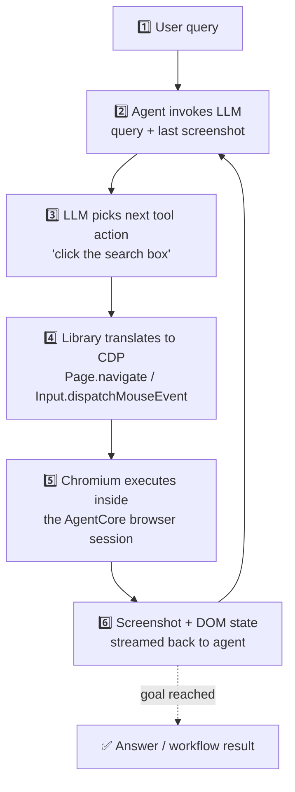
```mermaid
flowchart TD
 Q["1️⃣ User query"] --> A["2️⃣ Agent invokes LLM<br/>query + last screenshot"]
 A --> T["3️⃣ LLM picks next tool action<br/>'click the search box'"]
 T --> C["4️⃣ Library translates to CDP<br/>Page.navigate / Input.dispatchMouseEvent"]
 C --> B["5️⃣ Chromium executes inside<br/>the AgentCore browser session"]
 B --> S["6️⃣ Screenshot + DOM state<br/>streamed back to agent"]
 S --> A
 S -.->|"goal reached"| R["✅ Answer / workflow result"]
```

### Why it matters

Two details are easy to miss: the loop is **model-driven** (the LLM decides each step from pixels, not from a script — that's why it's resilient to UI changes) and **every action is a real browser event** (real clicks, real network — not an HTTP simulation).

### Key takeaway

> **The browser agent loop = screenshot → LLM decides → CDP action → new screenshot. Deterministic runs are possible too — the LLM step is a choice, not a requirement.**

---

## 7.9 Under the Hood — MicroVM, CDP Endpoint, DCV Stream

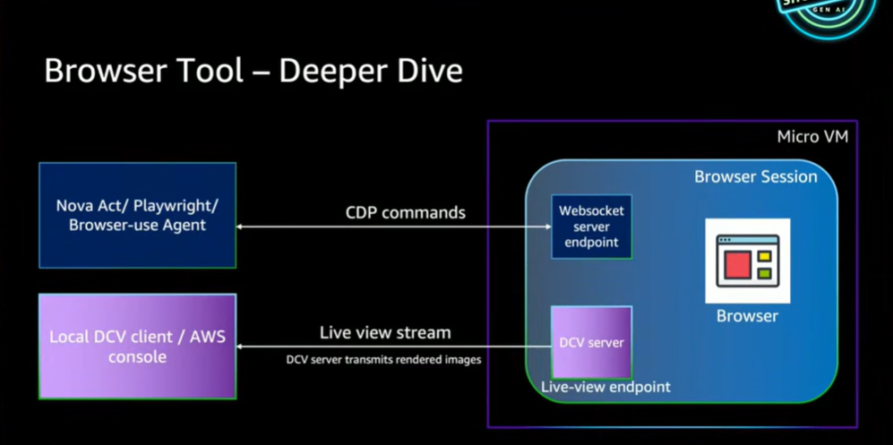

### What you are seeing

The infrastructure view: on the left, your agent (NovaAct / Playwright / Browser-use libraries) sending **CDP commands to a WebSocket endpoint**. On the right, inside an isolated **microVM**, the browser session itself — a Chromium instance plus a **DCV server** that streams rendered frames back out to the AWS console live view or your own embedded DCV client.

### What the speaker explains

Kosti: *"NovaAct or the specific library using Playwright is issuing CDP commands, which we consume through a WebSocket endpoint, perform on the browser — and through the DCV server we send a live-stream endpoint into our observability, or you can use that endpoint in your own applications."*

### Technical explanation

| Component | Role |
|---|---|
| WebSocket endpoint | Where signed CDP commands arrive — the control plane |
| Chromium in microVM | Executes commands; isolated per session, destroyed after |
| DCV server | Compresses the Chromium window → streams to live view & recording |
| Pre-signed live-view URL | Optional embed — put the live browser inside *your* app |

### Why it matters

This slide answers the production questions: *how do commands get in* (authenticated WebSocket), *how is it isolated* (per-session microVM), *how do humans watch* (DCV). The demo makes all three concrete — Veda generates signed headers for CDP and clicks a live-view URL in the console.

### Key takeaway

> **One endpoint in (CDP/WebSocket), one stream out (DCV), one isolated microVM in between.**

---

## 7.10 Two SDK Paths — Boto3 vs AgentCore SDK

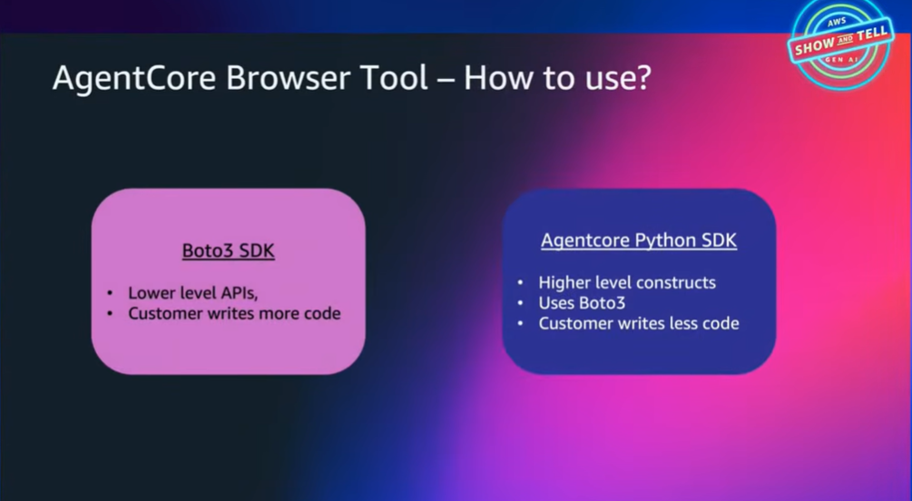

### What you are seeing

A comparison of the two ways to call the Browser Tool: **Boto3** (the general AWS Python SDK — lower-level APIs, more code) versus the **AgentCore Python SDK** (higher-level constructs built on Boto3 — less code).

### What the speaker explains

Veda: *"Two ways to get started. One is our good old Boto3 SDK — lower-level APIs: create the browser tool, start a session, and so on. We also offer the AgentCore Python SDK — higher-level constructs, so you write less code using the same set of APIs and get started faster."*

### Technical explanation

- **Boto3** — `bedrock-agentcore` control-plane calls, manual session/header handling. Maximum control.
- **AgentCore Python SDK** — `browser_session()` context managers and `BrowserClient` wrappers that handle the WebSocket URL + signed headers for you.

The demo uses the SDK path — you'll see `BrowserClient` in `test_runner.py` shortly.

### Key takeaway

> **Same underlying APIs — the AgentCore SDK is the ergonomic path; Boto3 is the escape hatch.**

---

## 7.11 The High-Level Flow — Five Steps from Resource to Stop

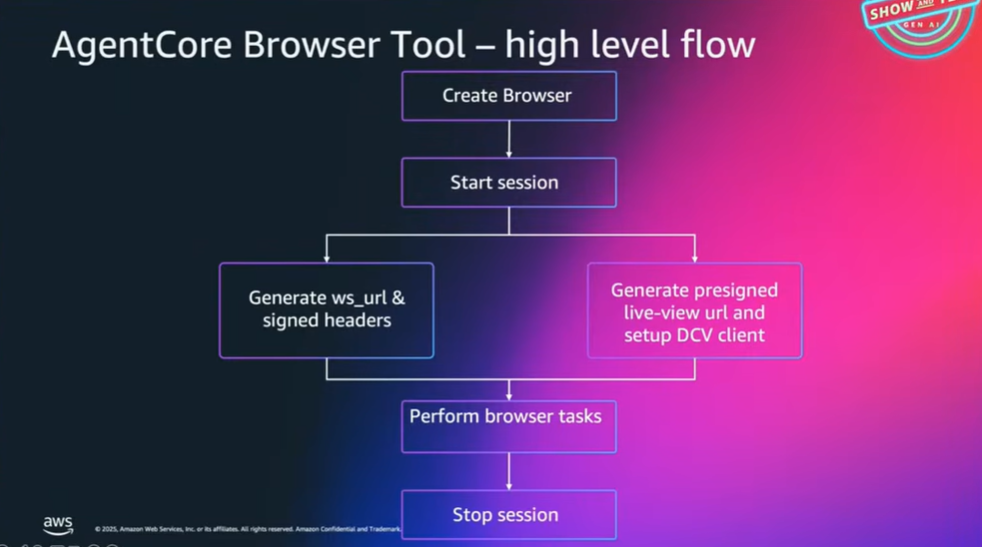

### What you are seeing

The lifecycle checklist: **① create a Browser resource** (a configuration object — network settings, S3 location for recordings), **② start a session** (the ephemeral execution environment), **③ generate the WebSocket URL + signed headers** (and optionally a pre-signed live-view URL for embedding), **④ the agent performs browser tasks**, then **⑤ stop the session** — which releases resources and ends billing.

### What the speaker explains

Veda: *"First step: create a browser resource. By default, when you go to AgentCore built-in tools, you already have one — it's a configuration resource: network settings, S3 settings for saved recordings. Then you start browser sessions — those ephemeral execution environments. In your code you generate the WebSocket URL and signed headers — required to connect over CDP. Optionally generate a pre-signed live-view URL and set up a DCV client to embed the live view in your application. Then the agent performs the browser tasks, and finally you stop the session — resources are released and you're not charged."*

### Technical explanation

Notice the **two-layer model**: the *browser resource* is durable configuration (like a template); *sessions* are disposable VMs stamped from it. The default resource exists already — you only create your own to enable recording/S3 settings.

### Why it matters

This is exactly the code path in the demo: `BrowserClient(region)` → `.start(identifier=...)` → `.generate_ws_headers()` → agent acts → `.stop()`. Every step on this slide has a line of code behind it.

### Key takeaway

> **Resource = config, session = ephemeral VM. Generate signed headers to connect, stop the session to stop paying.**

---

## 7.12 Console Tour — Where the Tools Live

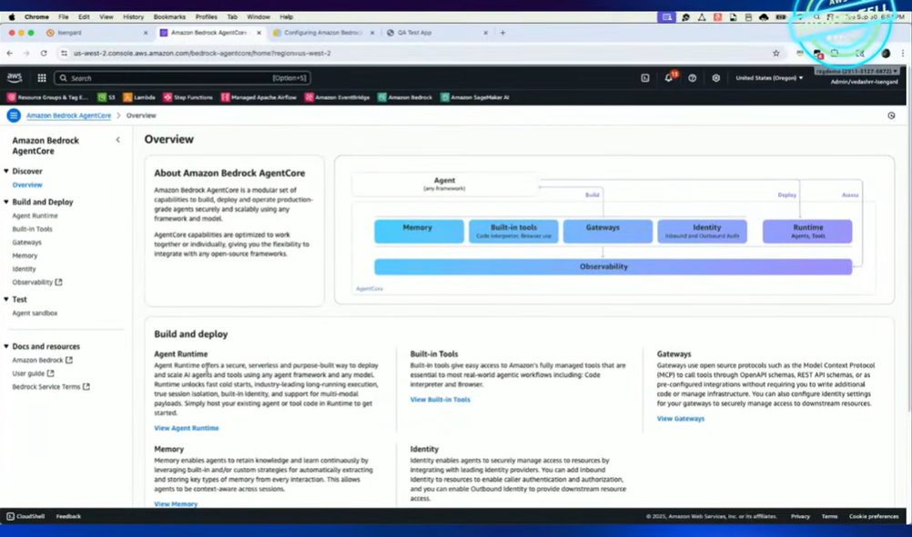

### What you are seeing

The AWS console's AgentCore overview page — the entry point to everything in this chapter.

### What the speaker explains

Veda begins the demo: *"Here I'm on the AWS console for AgentCore. If you navigate over here you have the built-in tools — and you have both the Code Interpreter and the Browser Tool here."*

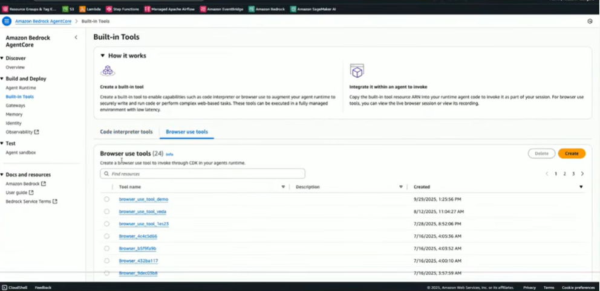

### What you are seeing

The **Built-in tools** list: browser resources already created in the account. Each resource is a configuration object — click one and you see the sessions run under it.

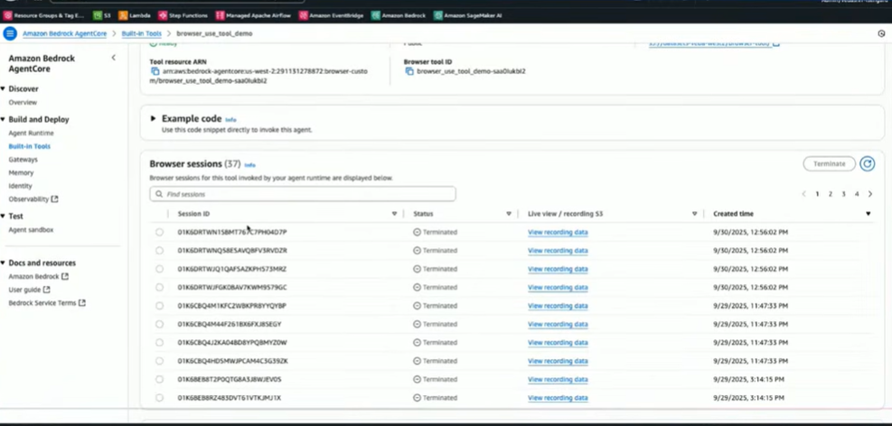

### What you are seeing

A browser resource detail page: ARN, tool ID, an **example code** snippet for connecting, and the **Browser sessions** table — 37 sessions, each terminated, each with a *"View recording data"* link (enabled because this resource has S3 recording configured).

### What the speaker explains

Veda: *"I talked about the browser resource — you specify network settings and so on. I have all these browser resources created in my account. If I click on one, you see all the browser sessions — the actual sessions with the Chrome browser opened up; these were all terminated after use. You can have multiple concurrent sessions — really useful to parallelize workflows."*

### Key takeaway

> **Resources hold configuration and history; sessions are the ephemeral runs. Recordings only exist if the resource has S3 recording configured.**

---

## 7.13 The Demo Setup — a Fake Retail App to Test

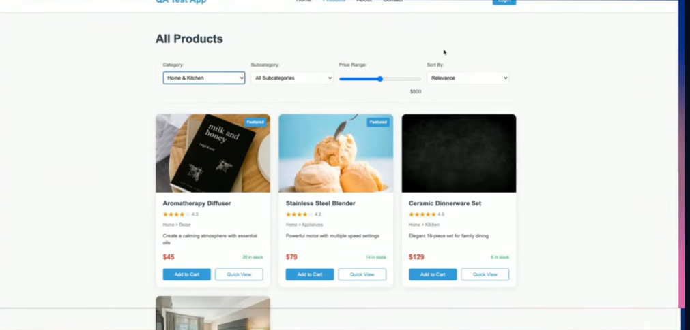

### What you are seeing

The test target: a fake retail web app ("QA Test App") hosted on S3 + CloudFront — product grid with category/subcategory filters, a price slider, ratings, stock counts, *Featured* badges, and Add to Cart buttons.

### What the speaker explains

Veda's motivation for agentic QA: *"Two reasons. One — you can test your web application from a human perspective: how would my end users actually experience it? Two — before agents, you'd write Playwright or Selenium scripts, which are brittle: when the UI changes they break and need maintenance. Now you give instructions in natural language and the agent tests from a human perspective."* Then : *"I built a fake web application — a retail website — hosted on an S3 bucket with CloudFront."*

### Technical explanation

The interesting design choice: **the test cases themselves were generated by a coding agent** — *"I used a coding agent to look at all my front-end code and generate natural-language test cases"*. The QA pipeline is agents all the way down: one agent writes the tests, another (NovaAct) executes them.

### Key takeaway

> **Natural-language tests + a vision-capable agent = QA that survives UI redesigns, because the agent looks at the page like a human does.**

---

## 7.14 The Test Suites — Natural Language as Spec

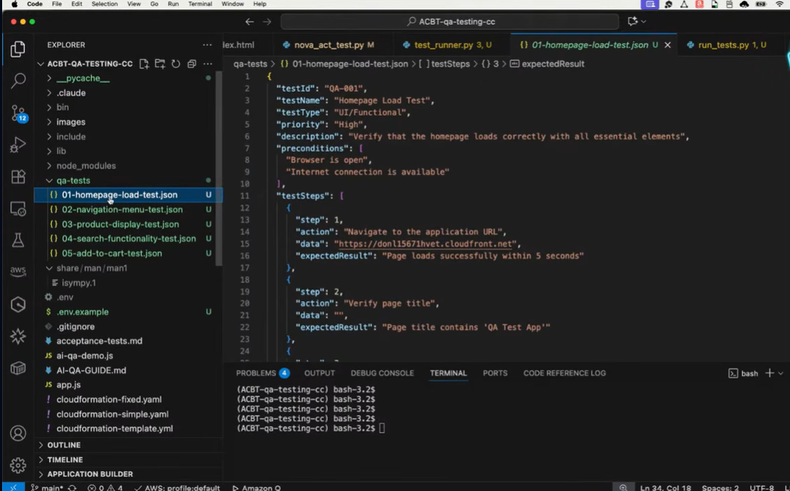

### What you are seeing

The `qa-tests/` folder with five generated suites (`01-homepage-load-test.json` through `05-add-to-cart-test.json`), and `01-homepage-load-test.json` open: a structured JSON test case where every step is an `action` in plain English plus an `expectedResult`.

### Code from this screenshot

<GitHubExplorer repo="awslabs/agentcore-samples" ref="main" expanded="true" title="qa-tests/ — the natural-language test suites shown on screen" files={[
 { "path": "qa-tests/01-homepage-load-test.json", "src": "/bedrock-deepti/code/ch7/qa-tests/01-homepage-load-test.json", "label": "01-homepage-load-test.json", "highlights": [[12, 30]], "note": "Transcribed from the on-screen file — steps 1–3 are readable; the original continues below the fold." },
 { "path": "qa-tests/02-navigation-menu-test.json", "src": "/bedrock-deepti/code/ch7/qa-tests/02-navigation-menu-test.json", "label": "02-navigation-menu-test.json", "note": "Transcribed from the on-screen file — header + first steps are readable; the original continues below the fold." },
 { "path": "qa-tests/03-product-display-test.json", "src": "/bedrock-deepti/code/ch7/qa-tests/03-product-display-test.json", "label": "03-product-display-test.json", "note": "Transcribed from the lower half shown on screen — steps 5–7 and the testData block are readable." }
]} />

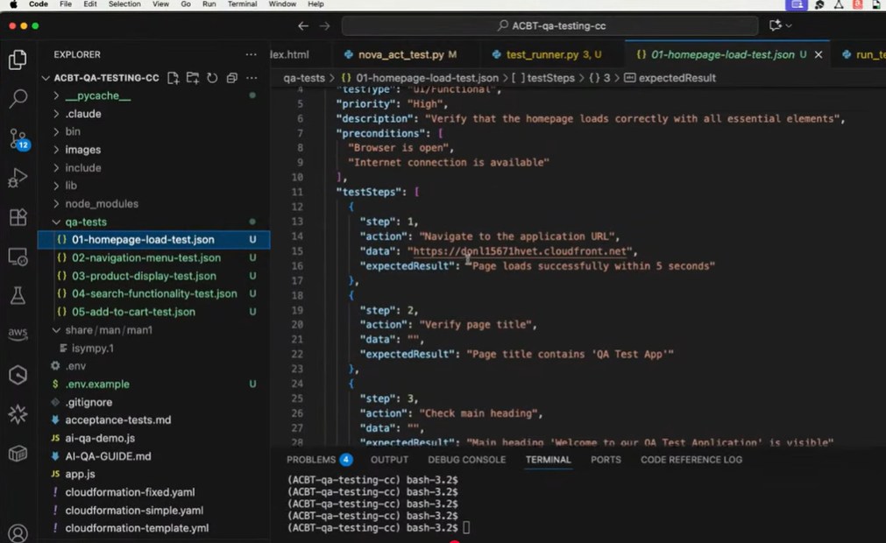

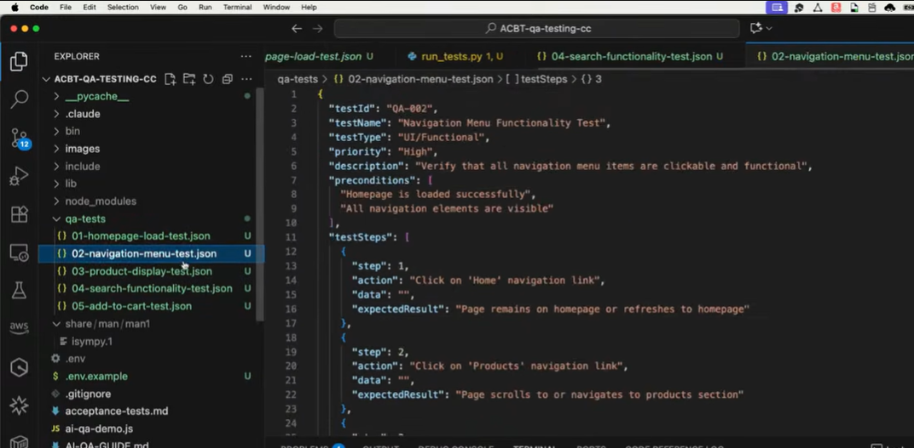

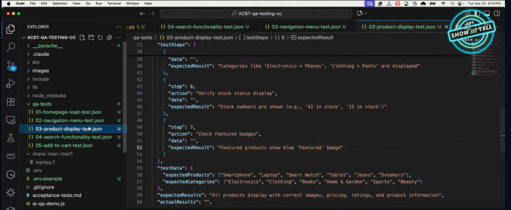

### What the speaker explains

Veda: *"I used a coding agent to look at all my front-end code and generate natural-language test cases — homepage load testing, a set of QA tests. The action is 'navigate to the application URL', and this is the expected result. The next step: verify the page title. All in natural language."*

### Technical explanation

The format is deliberately dumb: `{step, action, data, expectedResult}`. **No selectors, no XPath, no waits** — because the executor is a vision-capable agent, not a DOM script. `data` holds inputs (the URL to visit); `expectedResult` is a natural-language assertion NovaAct evaluates by *looking at the page*. The other suites follow the identical schema — the navigation test asserts menu clicks, the product-display test asserts categories, stock counts and *Featured* badges, with a `testData` block listing the expected products and categories.

### Why it matters

This is the paradigm shift in the demo: the test artifact is **English in JSON**, so product managers and coding agents can write it, and it doesn't rot when the CSS changes.

### Key takeaway

> **The JSON is a test *specification*, not a script. The agent figures out how to satisfy it.**

---

## 7.15 run_tests.py — Fan Out Four Suites in Parallel

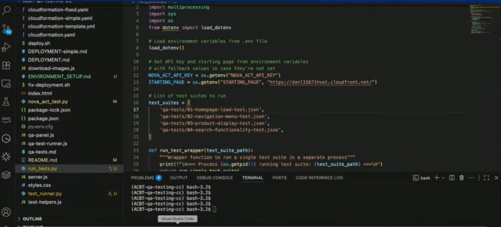

### What you are seeing

The top of `run_tests.py`: environment setup, the four test-suite paths, and `run_test_wrapper` — the function each parallel process runs.

### Code from this screenshot

<GitHubExplorer repo="awslabs/agentcore-samples" ref="main" expanded="true" title="run_tests.py — the multiprocessing test runner" files={[
 { "path": "run_tests.py", "src": "/bedrock-deepti/code/ch7/run_tests.py", "label": "run_tests.py", "highlights": [[16, 21], [38, 49]], "note": "Transcribed from the two on-screen captures — the seam between them is marked; nothing invented." }
]} />

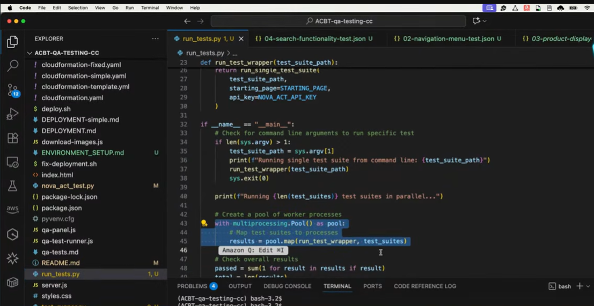

### What the speaker explains

Veda: *"This is where I'm taking all those individual test JSON files and creating multiple processes for my testing agent — NovaAct — to take the natural-language prompts and run those tests on the AgentCore browser. One process for each test suite."*

### Technical explanation

Two details worth stealing: a **single-file escape hatch** (`python run_tests.py qa-tests/01-…json` runs one suite — the `sys.argv` check), and **`multiprocessing.Pool` + `pool.map`** for the fan-out — each suite gets its own OS process, its own NovaAct instance, and its own browser session. That's why four suites finish in the time of one.

### Key takeaway

> **One process = one suite = one browser session. Parallelism is trivial because sessions are serverless and isolated.**

---

## 7.16 test_runner.py — Wiring NovaAct to the Session

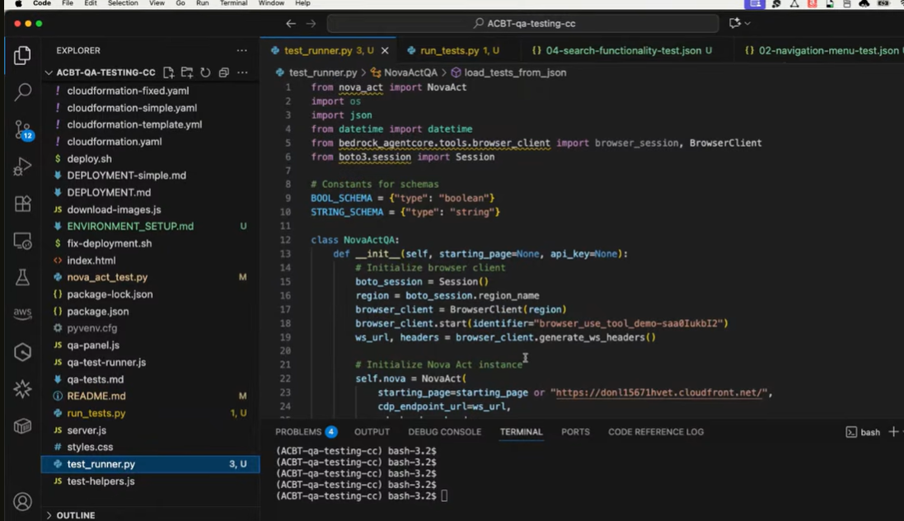

### What you are seeing

`test_runner.py`: the imports (`NovaAct`, `BrowserClient`/`browser_session` from the AgentCore SDK, boto3 `Session`), the two assertion schemas, and `NovaActQA.__init__` — which starts a browser session and hands the connection to NovaAct.

### Code from this screenshot

<GitHubExplorer repo="awslabs/agentcore-samples" ref="main" expanded="true" title="test_runner.py — the BrowserClient → NovaAct wiring Veda walks through" files={[
 { "path": "test_runner.py", "src": "/bedrock-deepti/code/ch7/test_runner.py", "label": "test_runner.py", "highlights": [[13, 20], [31, 49]], "note": "Transcribed from the on-screen captures — the seam inside the NovaAct constructor is marked; nothing invented." }
]} />

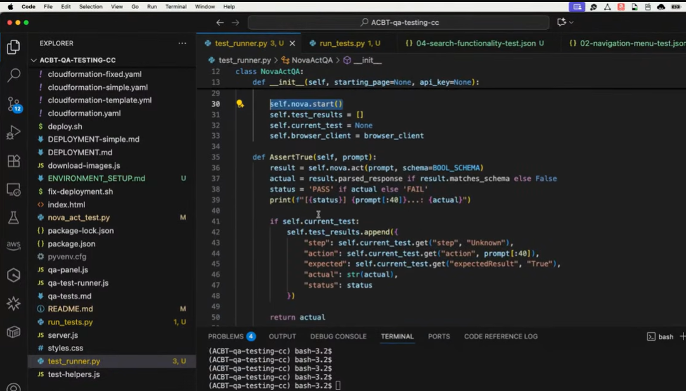

### What the speaker explains

Veda, line by line: *"I'm importing the browser client class from the bedrock-agentcore SDK… initializing a `BrowserClient` for the region… starting a browser session against the browser tool that has my network config and S3 recording settings — if you don't specify, it uses the default tool, but that has no record/replay… generating the WebSocket URL and signed headers so my agent can connect… then initializing NovaAct — an agentic SDK specialized for browser automation, Nova-based LLM, understands screenshots and works at the DOM level — passing the starting page, the CDP endpoint URL, and the signed headers."*

And on `AssertTrue`: *"For QA testing I want to assert — based on the natural-language instructions — whether it actually passes or fails. That's where we send the natural-language prompt to NovaAct, and it runs CDP commands on the AgentCore browser."*

### Technical explanation

The whole integration is **three objects**:

1. `BrowserClient(region)` → `.start(identifier=…)` creates the session inside the configured browser tool (identifier optional — default exists).
2. `.generate_ws_headers()` → the WebSocket URL + **signed** headers = authenticated CDP endpoint.
3. `NovaAct(starting_page=…, cdp_endpoint_url=ws_url, cdp_headers=…)` → the agentic SDK drives the browser through that endpoint; `nova.act(prompt, schema=BOOL_SCHEMA)` returns a parsed `True/False` for assertions.

### Why it matters

Notice what is *not* here: no Chrome install, no driver management, no proxy, no session bookkeeping. The browser is a remote, authenticated resource — your code only deals with a WebSocket.

### Key takeaway

> **`BrowserClient` handles AWS session auth; `NovaAct` handles the thinking; CDP is the wire between them.**

---

## 7.17 Watching It Run — Four Suites, Zero Waiting

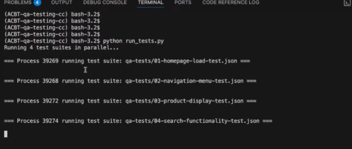

### What you are seeing

The run begins: `python run_tests.py` prints *"Running 4 test suites in parallel…"* and four processes (PIDs 39268–39274) each announce their suite.

### What the speaker explains

Veda: *"I'm just running the tests — it started four different test suites and all of them are running in parallel."*

```bash
$ python run_tests.py
```

```text
Running 4 test suites in parallel...

=== Process 39269 running test suite: qa-tests/01-homepage-load-test.json ===
=== Process 39268 running test suite: qa-tests/02-navigation-menu-test.json ===
=== Process 39272 running test suite: qa-tests/03-product-display-test.json ===
=== Process 39274 running test suite: qa-tests/04-search-functionality-test.json ===
```

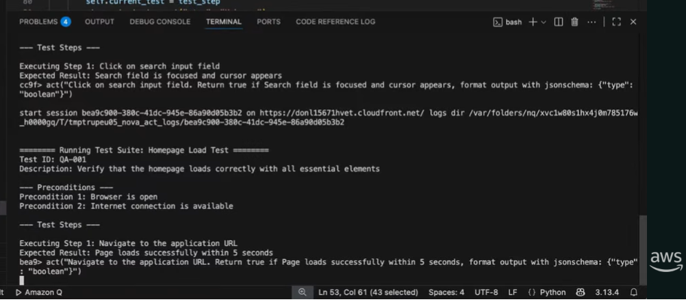

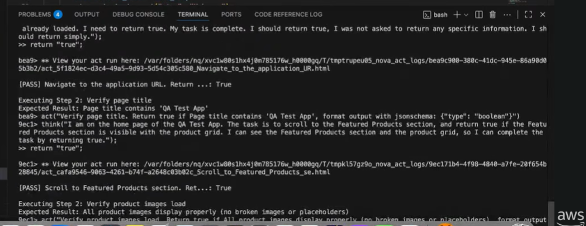

### Technical explanation

Mid-run, each process streams its own step log: `Executing Step 1: Click on search input field`, `start session bea9c9e0-…`, then verdicts `PASS Navigate to the application URL`. Four interleaved streams — that's what parallel agentic QA actually looks like.

### Key takeaway

> **The terminal output mirrors the AssertTrue helper: every natural-language step prints PASS/FAIL as the agent sees it.**

---

## 7.18 Live View — Watching the Agent Browse

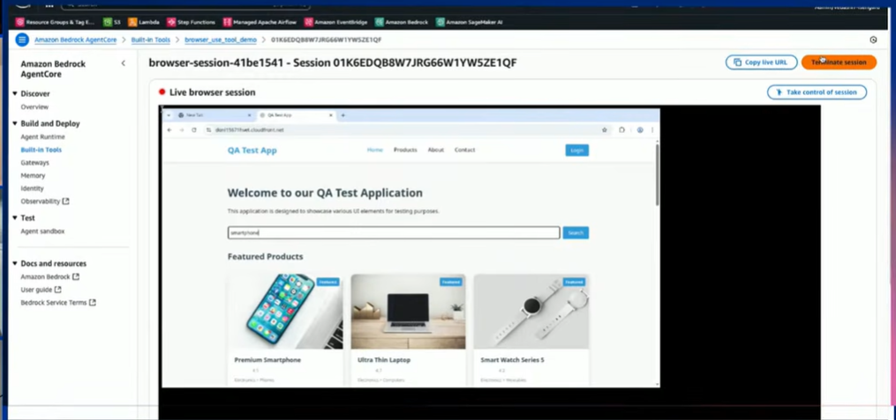

### What you are seeing

The console's **live browser session** view: the DCV stream of the actual Chromium inside the microVM — NovaAct is literally typing into the app. Note the controls: *"Take control of session"*, *"Copy live URL"*, *"Terminate session"*.

### What the speaker explains

Veda: *"Let's head to the AgentCore page — you can see four different live-view sessions have come up. When I click on this it actually shows the browser live view running on the AgentCore browser — it's typing out, this is all NovaAct typing on the agent browser, testing based on the instructions it was given."* And : *"This live view can also be embedded in your own applications — you don't have to navigate to the AWS console."*

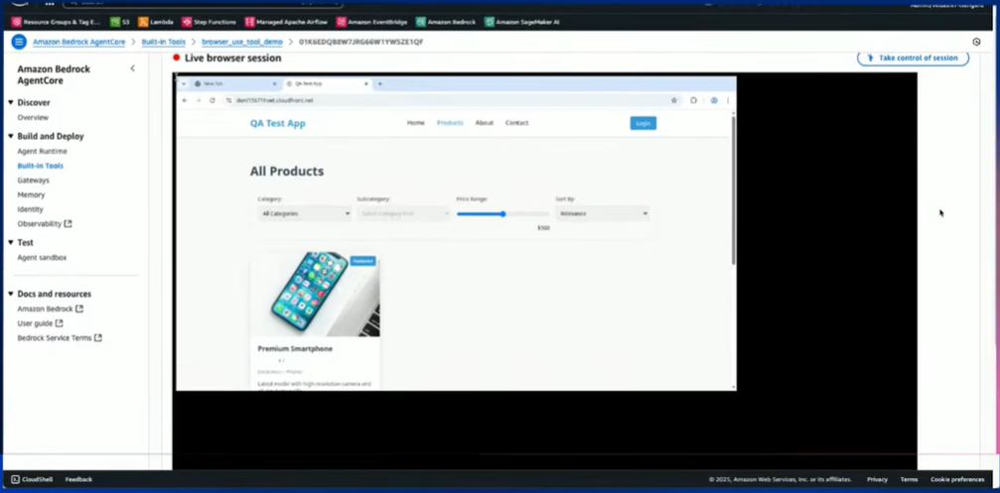

### Technical explanation

This is the **DCV server** from the architecture slide, made real: rendered frames compressed and streamed out of the microVM. *"Take control"* is human-takeover — same stream, with input routed back in.

### Key takeaway

> **Live view = DCV stream. Console today, embedded in your app tomorrow via a pre-signed URL.**

---

## 7.19 The Verdict — Two Suites Pass, Two Fail (On Purpose)

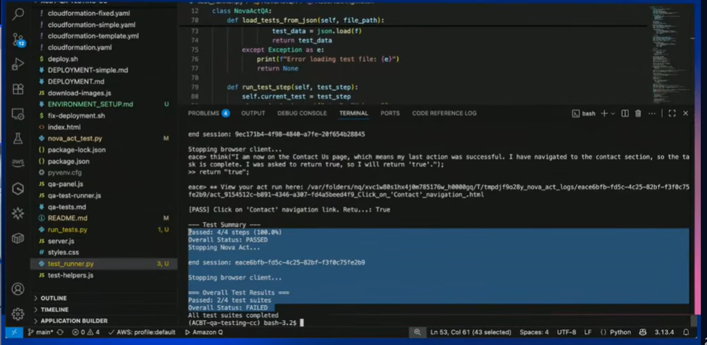

### What you are seeing

The final tally in the terminal: one suite reports `Passed: 4/4 steps (100.0%) — Overall Status: PASSED`, then the rollup: `Passed: 2/4 test suites — Overall Status: FAILED`. Above it, more `test_runner.py` code (`load_tests_from_json`, `run_test_step` — the part that records each step's verdict).

### What the speaker explains

Veda: *"It's still running — takes a few minutes. It's thinking and acting; I have some tests passing and some failing — I deliberately designed it that way. Because I parallelized, it finished fairly quickly — you could run hundreds of tests like this. Two test suites passed, two failed… and here you see the thinking steps — the agent thinks, then acts — 'click on contact navigation' — then looks at the screenshots and acts again. That's the agentic loop."*

### Technical explanation

The failed suites are the point: a QA tool that only passes things isn't testing anything. Each failure is a natural-language assertion that the agent judged false **by looking at the rendered page** — the same judgment a human QA engineer would make.

### Key takeaway

> **Failures are the product — the agent reported them the way a human tester would, with the step, the expectation, and what it saw.**

---

## 7.20 Session Replay — Not a Video, a Reconstruction

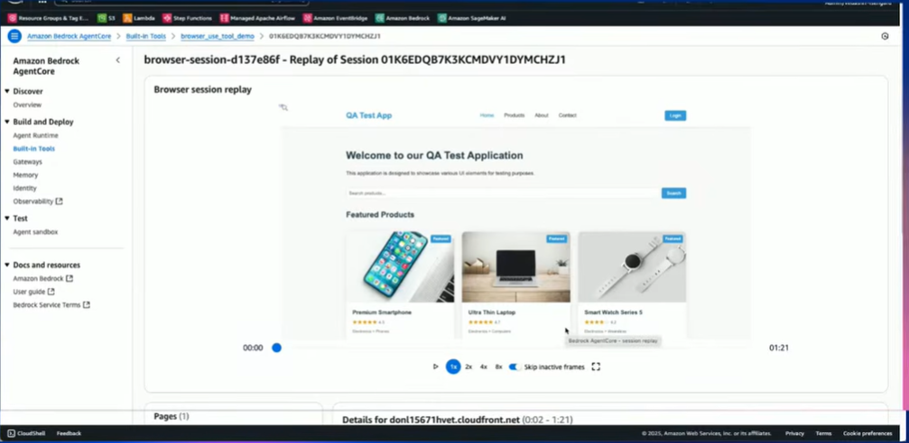

### What you are seeing

The **session replay** view: a playback UI with speed controls (2x/4x/8x), a timeline, and tabs for what the session recorded.

### What the speaker explains

Veda: *"Because I enabled recording and replay, I'm able to view the recorded session — this is observability. This is not a video recording — we captured the DOM actions and reconstructed the replay."*

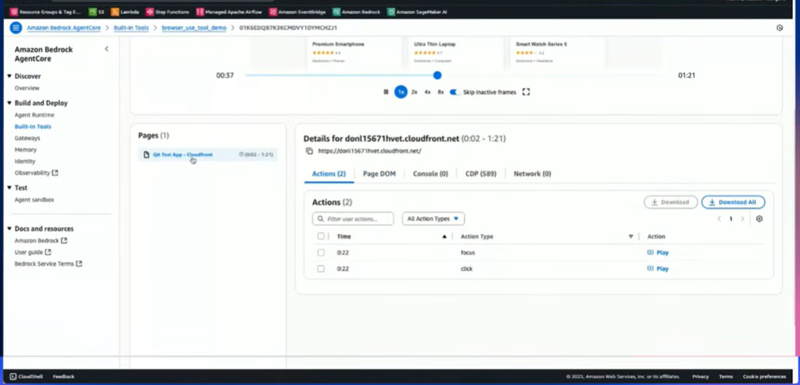

### What you are seeing

The replay inspector: **Actions(2)** lists each agent action (`focus` at 0:22, `click` at 0:22) with a ▶ button that jumps to that moment; alongside, tabs for **Page DOM**, **Console**, **CDP (589 events)**, **Network**, and agent actions.

### What the speaker explains

Veda: *"It gives page-level details — inspect the page DOM, see the actual CDP commands the browser received. Network traffic is zero because mine is a front-end-only app — a typical app shows network logs. And the agent actions — what did the agent do. I can play it, focus at that point, and see the click happen."*

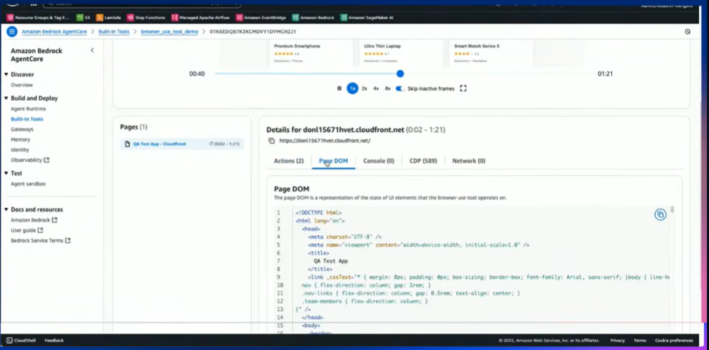

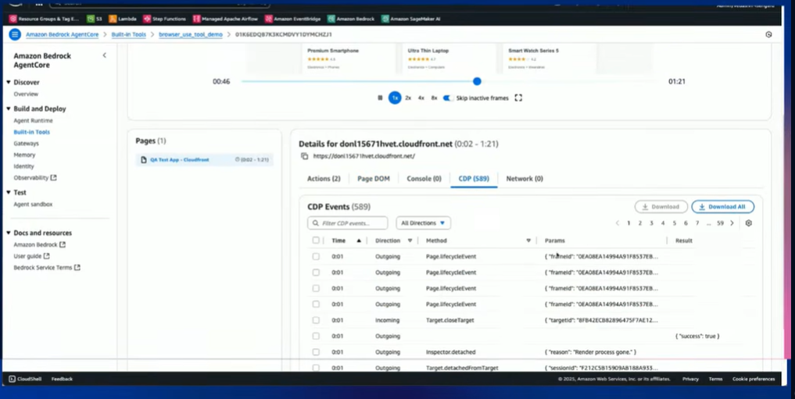

### Technical explanation

Replaying DOM events instead of video is the clever part: **every CDP command is auditable** — you can diff what the agent intended against what the browser did, and per-action Play buttons jump the reconstructed page to that instant. For compliance and debugging, this beats screen recordings entirely.

### Why it matters

Anil closes the loop: *"You can optimize paths — try different models, deconstruct the actions that took the agent to the goal."* Replay is the data source for that optimization.

### Key takeaway

> **Recording = DOM + CDP + agent actions, reconstructed — every click is inspectable, not just watchable.**

<ConceptCard title="💰 Side note — pricing, answered live">A chat question: *"Is there a free tier?"* Kosti: during preview the service is free to experiment with; once billing switched on (announced for Oct 7) it joins the AWS Free Tier ($200 credit for new accounts), then per-second CPU/memory billing applies.</ConceptCard>

---

## 7.21 Switching Gears — the Second Tool

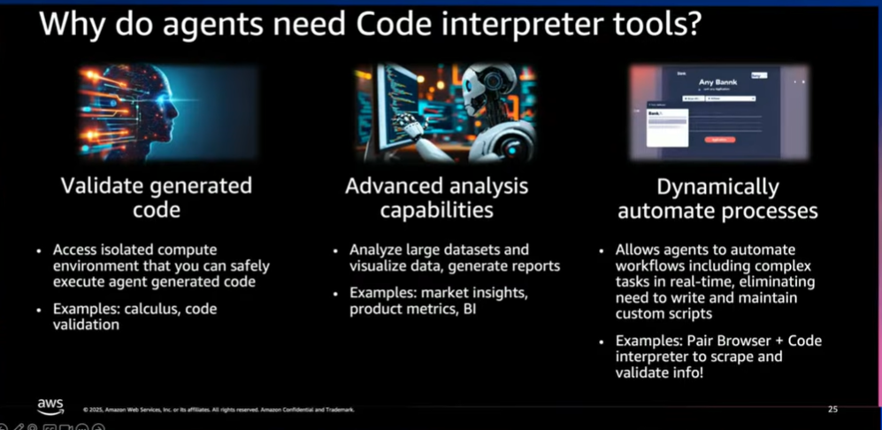

### What you are seeing

The slide that opens the second tool: *"Why do agents need Code Interpreter tools?"* — three reasons: **validate generated code**, **advanced analysis capabilities**, **dynamically automate processes**.

### What the speaker explains

Kosti: *"Agents generate all kinds of code, and once they generate that code they need somewhere to validate that it runs correctly. If they run that code in the same hosting environment the agent is hosted on, there's danger that bugs will bring down the agent. So when someone needs to validate that agent-generated code actually works, they can dynamically spin up a Code Interpreter environment — isolated, low-latency — and run the code as needed."*

### Technical explanation

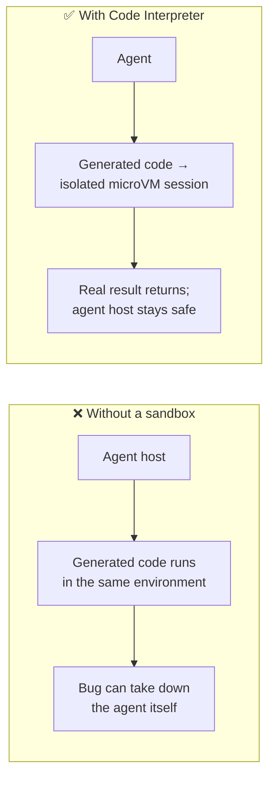
```mermaid
flowchart LR
 subgraph bad["❌ Without a sandbox"]
 A1["Agent host"] --> C1["Generated code runs<br/>in the same environment"]
 C1 --> D1["Bug can take down<br/>the agent itself"]
 end
 subgraph good["✅ With Code Interpreter"]
 A2["Agent"] --> C2["Generated code →<br/>isolated microVM session"]
 C2 --> D2["Real result returns;<br/>agent host stays safe"]
 end
```

### Why it matters

This is the same isolation argument as the Browser Tool, one layer deeper: **generated code is untrusted code**. It was written by a model, not reviewed by a human — so it belongs in a disposable environment, not on the agent's host.

### Key takeaway

> **The Code Interpreter exists because agent-generated code is untrusted and needs somewhere safe to actually run.**

---

## 7.22 The Superpowers — What Agents Gain

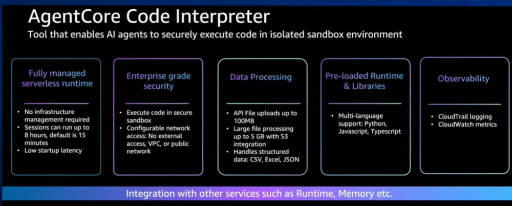

### What you are seeing

The capability sheet: **fully managed serverless** (low startup latency, sessions up to 8h, default 15 min), **enterprise-grade security** (secure sandbox; network configurable — none, VPC, or public), **data processing** (100 MB API payloads; up to 5 GB via S3; CSV/Excel/JSON), **pre-loaded runtimes** (Python, JavaScript, TypeScript + libraries), **observability** (CloudTrail logging, CloudWatch metrics) — with a note on integration with Runtime, Memory, etc.

### What the speaker explains

Kosti on the superpowers: *"Agents can become data analysts. They can reason about what code is needed, generate it, execute it, dynamically automate processes — even when there's no API or tool for the task. It's a sandbox to validate generated code, perform mathematics — portfolio math, pricing — and ensure the math isn't hallucinated but actually adds up. Advanced analytics, reports, PDFs, CSVs — all of that."*

On features: *"Fully managed and serverless… low latency… real-time and long-running executions up to eight hours… an isolated microVM every time you instantiate a session… configurable to deploy in your own VPC. Payload size is 100 MB, and you can import large files directly from S3 — up to 5 GB — so you can process Excel, CSV, JSON. Pre-built Python, JavaScript, TypeScript and a lot of libraries. And every execution has logging and CloudWatch messages associated with it."*

### Technical explanation

| Capability | Numbers / details from the episode |
|---|---|
| Session lifetime | up to **8 hours** (default 15 min) |
| Payload | **100 MB** direct; **5 GB** via S3 |
| Languages | **Python, JavaScript, TypeScript** + pre-built libraries |
| Network modes | sandbox-only / **VPC** / public |
| Observability | **CloudTrail** logging + **CloudWatch** metrics per execution |

### Why it matters

The math point deserves emphasis: an LLM *predicts* an answer; executed code *computes* it. For portfolio math, pricing, or anything a customer will act on — "the model said so" is not an acceptable provenance.

### Key takeaway

> **Code Interpreter turns an agent into a data analyst whose math actually adds up — compute, not confidence.**

---

## 7.23 Browser + Interpreter — Better Together

### What the speaker explains

Kosti: *"In the ideal case you mix and match the Browser Tool and the Code Interpreter — navigate and dynamically automate processes with both of them."*

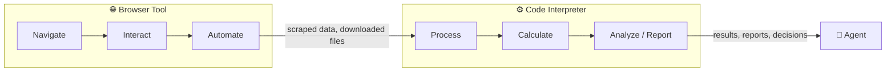
```mermaid
flowchart LR
 subgraph B["🌐 Browser Tool"]
 B1["Navigate"] --> B2["Interact"] --> B3["Automate"]
 end
 subgraph C["⚙️ Code Interpreter"]
 C1["Process"] --> C2["Calculate"] --> C3["Analyze / Report"]
 end
 B3 -- "scraped data, downloaded files" --> C1
 C3 -- "results, reports, decisions" --> A["🤖 Agent"]
```

### Technical explanation

The two tools are complementary I/O: the browser **gets data out of the web** (no API required), the interpreter **turns that data into answers** (math, analysis, files). Download a competitor's price list via browser → parse and compare via interpreter → report back as a CSV.

### Key takeaway

> **Browser = input from the web. Interpreter = computation on anything. Together: research and analysis end-to-end.**

---

## 7.24 Under the Hood — the Leap-Year Question

<FlowDiagram title="Code Interpreter — the request path (click a node for details)" theme="dark" viewBox={{ "w": 1200, "h": 420 }} nodes={[
 { "id": "user", "label": "User", "sub": "\"leap years 1957–2023?\"", "icon": "👤", "type": "client", "x": 20, "y": 150, "w": 150, "h": 80, "detail": { "description": "The end user asks a question that needs computation, not recall.", "bullets": ["Natural-language query", "No API exists for 'count leap years'", "LLM alone would likely hallucinate"] } },
 { "id": "agent", "label": "Agent", "sub": "Strands / your framework", "icon": "🤖", "type": "compute", "x": 210, "y": 150, "w": 160, "h": 80, "detail": { "description": "The agent decides it needs to compute an answer rather than guess one.", "bullets": ["Selects the Code Interpreter tool", "Never runs generated code on its own host"] } },
 { "id": "llm", "label": "LLM", "sub": "generates Python / JS / TS", "icon": "🧠", "type": "security", "x": 410, "y": 150, "w": 160, "h": 80, "detail": { "description": "The model writes the code — it does not answer the question.", "bullets": ["Generates e.g. a leap-year loop in Python", "Code is sent to the session, not run locally"] } },
 { "id": "session", "label": "CI Session (microVM)", "sub": "interpreter + filesystem + shell", "icon": "📦", "type": "storage", "x": 610, "y": 130, "w": 210, "h": 120, "detail": { "description": "The isolated per-session execution environment.", "bullets": ["Code Interpreter runtime", "Filesystem: import / read / process / write files", "Shell commands on the underlying system", "Isolated microVM — destroyed after the session"] } },
 { "id": "obs", "label": "Observability", "sub": "CloudTrail + CloudWatch", "icon": "📊", "type": "monitoring", "x": 610, "y": 300, "w": 210, "h": 70, "detail": { "description": "Every execution is logged and metered.", "bullets": ["CloudTrail log per invocation", "CloudWatch metrics"] } },
 { "id": "result", "label": "Result → Agent → User", "sub": "computed, not hallucinated", "icon": "✅", "type": "trigger", "x": 880, "y": 150, "w": 200, "h": 80, "detail": { "description": "The real computed output flows back through the agent to the user.", "bullets": ["Tool result returns to the LLM", "Agent composes the final answer"] } }
]} edges={[
 { "from": "user", "to": "agent", "label": "1. query", "animated": true },
 { "from": "agent", "to": "llm", "label": "2. invoke + tool select", "animated": true },
 { "from": "llm", "to": "session", "label": "3. generated code", "animated": true },
 { "from": "session", "to": "obs", "label": "telemetry", "dashed": true },
 { "from": "session", "to": "result", "label": "4. tool result", "animated": true }
]} />

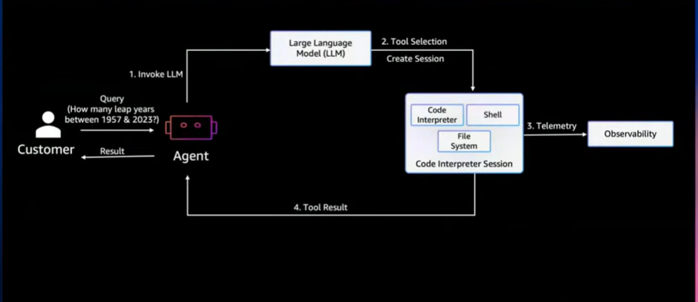

### What you are seeing

The interactive diagram above recreates the slide; the original shows: a user query *"How many leap years between 1957 & 2023"* → **agent** → `1. Invoke LLM` → **LLM** → `2. Tool selection` (create session) → the **Code Interpreter session** (interpreter + filesystem + shell inside a microVM) → `3. Telemetry` to observability → `4. Tool result` → answer back to the customer.

### What the speaker explains

Kosti: *"Imagine the end user asks the agent: how many leap years between 1957 and 2023? If the agent directly uses the LLM without code execution, it will most probably hallucinate. So the LLM generates code — Python, TypeScript or JavaScript — and you execute it in the Code Interpreter session. But the session doesn't only execute code — it lets you interact with the underlying microVM via a filesystem: import, read, process files, run shell commands, write files — on the environment and the system it's hosted on."*

### Technical explanation

Three surfaces inside the session, per the diagram: the **interpreter** (runs code), the **filesystem** (import/read/write — the demo uses this for the report), and the **shell** (system commands). The leap-year example shows the *why*: `sum(1 for y in range(1957, 2024) if y%4==0 and (y%100!=0 or y%400==0))` returns a computed 16/17 — an answer with provenance.

### Key takeaway

> **LLM writes the code; the microVM computes the answer. The agent never guesses math again.**

---

## 7.25 Pre-Built vs Custom — Two Flavors

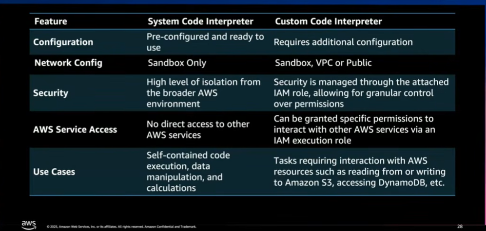

### What you are seeing

The comparison slide: **System / pre-built** interpreter vs **Custom** interpreter — across configuration effort, network options, security posture, AWS service access, and intended use cases.

### What the speaker explains

Kosti: *"There are two types. The pre-built Code Interpreter — you can very quickly instantiate a session; it's a sandbox-only environment where you can access only that microVM plus S3, and it has no access to other AWS resources — it comes with our own sandbox-only configuration. But if you want to deploy in your VPC, enable public access, or give an IAM role with permissions to other AWS resources — DynamoDB or other databases — you can do that; you just customize it with our API."*

### Technical explanation

| | **Pre-built (system)** | **Custom** |
|---|---|---|
| Setup | none — instant | create a custom resource (API/console) |
| Network | sandbox only | **your VPC**, or public access |
| AWS access | microVM + **S3 only** | IAM role → DynamoDB, databases, … |
| Best for | untrusted LLM code, quick wins | workloads needing private/Cloud resources |

The demo uses the **pre-built** interpreter — Rahul confirms: *"We're using the system Code Interpreter — absolutely no configuration; sandbox; super easy for untrusted LLM-generated code."*

### Key takeaway

> **Pre-built = zero config, sandbox + S3. Custom = your VPC + IAM role + the rest of AWS.**

---

## 7.26 The Custom Path in Eight Steps — Interactive

<HotspotImage src="/bedrock-deepti/screenshots/c7s38.png" title="Custom Code Interpreter — the 8-step request path (click each number)" hotspots={[
 { "num": 1, "x": 4, "y": 20, "w": 7, "h": 8, "label": "Query", "to": "7-26-the-custom-path-in-eight-steps-interactive", "tip": "User query arrives at the agent" },
 { "num": 2, "x": 20, "y": 20, "w": 7, "h": 8, "label": "Create Custom CI", "to": "7-26-the-custom-path-in-eight-steps-interactive", "tip": "Custom resource: IAM execution role + network config" },
 { "num": 3, "x": 38, "y": 20, "w": 7, "h": 8, "label": "CI Resource", "to": "7-26-the-custom-path-in-eight-steps-interactive", "tip": "The durable custom interpreter configuration" },
 { "num": 4, "x": 55, "y": 20, "w": 7, "h": 8, "label": "Start Session", "to": "7-26-the-custom-path-in-eight-steps-interactive", "tip": "Start a session and invoke the interpreter" },
 { "num": 5, "x": 70, "y": 40, "w": 8, "h": 9, "label": "Execution Request", "to": "7-26-the-custom-path-in-eight-steps-interactive", "tip": "Session mapping + response processing" },
 { "num": 6, "x": 82, "y": 40, "w": 8, "h": 9, "label": "Execution Response", "to": "7-26-the-custom-path-in-eight-steps-interactive", "tip": "The sandbox returns the computed result" },
 { "num": 7, "x": 70, "y": 66, "w": 8, "h": 9, "label": "Tool Result", "to": "7-26-the-custom-path-in-eight-steps-interactive", "tip": "Result flows back to the agent" },
 { "num": 8, "x": 38, "y": 66, "w": 8, "h": 9, "label": "Final Result", "to": "7-26-the-custom-path-in-eight-steps-interactive", "tip": "Agent composes the answer for the user" }
]} />

### What you are seeing

The custom-configuration path: query → **create a custom Code Interpreter** (IAM execution role + network config) → the durable **resource** → **start a session** and invoke → **execution request** (session mapping, response processing) → **execution response** → **tool result** → **final result**. Center stage: the microVM session hosting the Python/TypeScript/JavaScript interpreter plus a shell and filesystem.

### Technical explanation

Steps 1–3 are the *custom* part — the pre-built path skips straight to session start because AWS owns the resource. The IAM execution role is the whole point: it's what lets code inside the sandbox legitimately reach DynamoDB or other VPC resources.

### Key takeaway

> **Custom = your resource, your role, your network. The execution loop itself is identical to pre-built.**

---

## 7.27 Demo Time — a CloudTrail Security Analyst

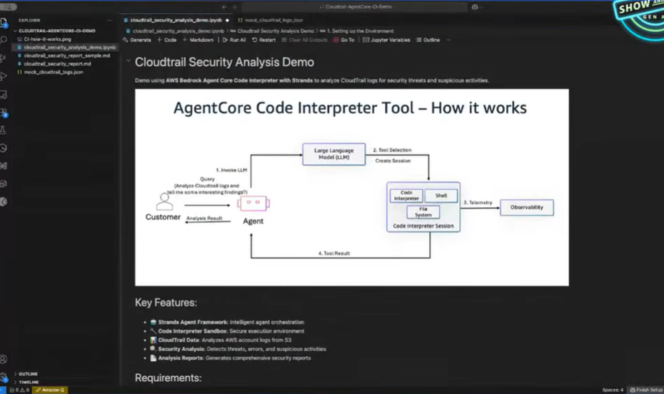

### What you are seeing

The top of Rahul's Jupyter notebook: *"CloudTrail Security Analysis Demo"* with the same under-the-hood architecture diagram embedded for reference.

### What the speaker explains

Rahul takes over: *"Let's get to the demo. Consider the use case Kosti described — data analysis. We'll analyze CloudTrail data — mock data — from an AWS account and try to find interesting activities, things you may want to double-click on — through agents."* And : *"Similar to the Browser Tool, you can use Code Interpreter with Boto3 or the AgentCore Python SDK — we're using the SDK. You can also use the tools as custom tools or, with Strands, as native tools. To show more detail we're using Code Interpreter as a custom tool."*

### Key takeaway

> **One analyst agent + one sandboxed Python runtime + 42 CloudTrail events = the whole demo.**

---

## 7.28 Cell 1–2 — Imports, Session Start, Config

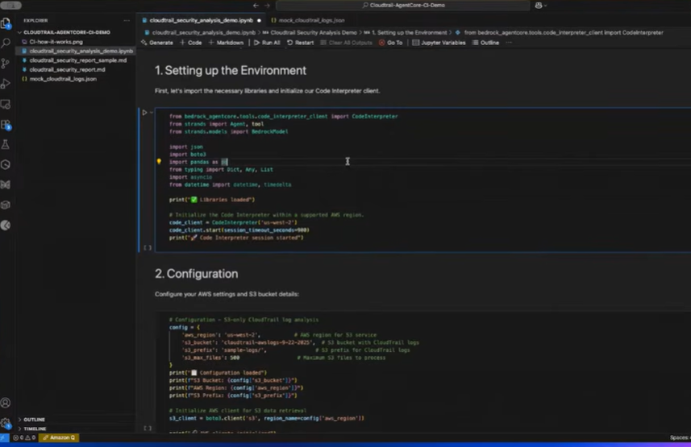

### What you are seeing

Notebook cells 1–2: imports (`CodeInterpreter` from the AgentCore SDK, `Agent`/`tool`/`BedrockModel` from Strands, boto3, pandas) + `code_client.start(session_timeout_seconds=900)`, then the config dict (region, S3 bucket `cloudtrail-awslogs-9-22-2025`, prefix `sample-logs/`, max 500 files) and the S3 client.

### Code from this screenshot

```python
from bedrock_agentcore.tools.code_interpreter_client import CodeInterpreter
from strands import Agent, tool
from strands.models import BedrockModel

code_client = CodeInterpreter('us-west-2')
code_client.start(session_timeout_seconds=900) # 15-minute session (up to 8h max)

config = {
 'aws_region': 'us-west-2',
 's3_bucket': 'cloudtrail-awslogs-9-22-2025',
 's3_prefix': 'sample-logs/',
 's3_max_files': 500
}
s3_client = boto3.client('s3', region_name=config['aws_region'])
```

### What the speaker explains

Rahul: *"We're importing the Code Interpreter from the SDK, plus Strands for the agent. To get started you specify your region and a timeout — 900 seconds here, though sessions can run up to eight hours. Super fast — the session is available and we can start using it in our agent."*

### Key takeaway

> **`CodeInterpreter(region)` + `.start(timeout)` — two calls and the isolated microVM exists.**

---

## 7.29 The Mock Data — CloudTrail Events in S3

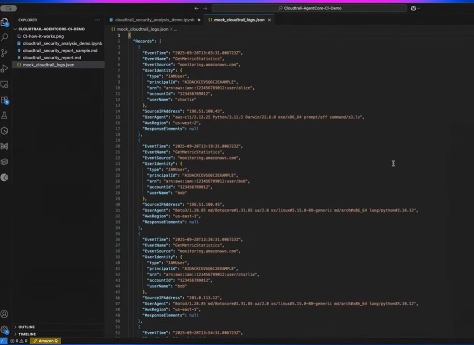

### What you are seeing

The mock dataset: a JSON `Records` array of CloudTrail-style events — `EventName: GetMetricStatistics`, `EventSource: monitoring.amazonaws.com`, IAM users `alice`/`bob`, source IPs like `198.51.100.45`, regions `us-west-2`/`us-east-1`.

### Code from this screenshot

<GitHubExplorer repo="awslabs/agentcore-samples" ref="main" expanded="true" title="mock_cloudtrail_logs.json — the sample CloudTrail events shown on screen" files={[
 { "path": "mock_cloudtrail_logs.json", "src": "/bedrock-deepti/code/ch7/mock_cloudtrail_logs.json", "label": "mock_cloudtrail_logs.json", "highlights": [[3, 13]], "note": "Transcribed from the on-screen file — two sample records are readable; the real file holds 42 events." }
]} />

### What the speaker explains

Rahul: *"These are mocked-up CloudTrail logs, slightly processed to de-identify information. Line items in JSON format that we want to analyze via the agent… 42 CloudTrail events total that we'll analyze."*

### Key takeaway

> **Real-shaped data, fake identities — the structure is what the agent analyzes, so it mirrors actual CloudTrail records.**

---

## 7.30 Cell 3–4 — Pulling the Logs Out of S3

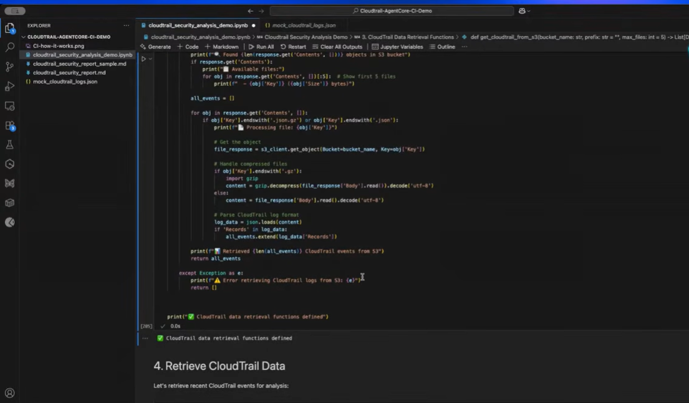

### What you are seeing

The `get_cloudtrail_from_s3` helper — lists objects under the prefix, downloads each, gunzips, `json.loads`, and collects `Records` into a flat event list.

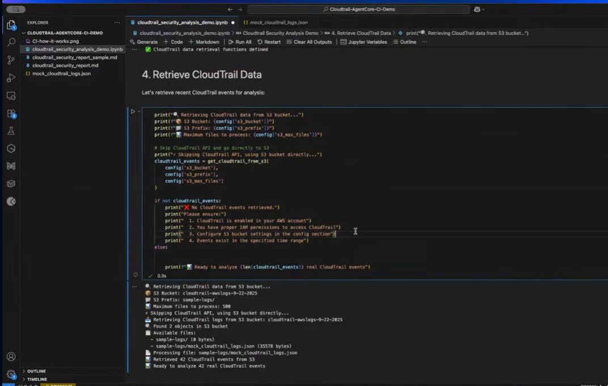

### What you are seeing

The retrieval output: `📂 Found 2 objects` → `Processing file: sample-logs/mock_cloudtrail_logs.json (35578 bytes)` → `📊 Retrieved 42 CloudTrail events from S3` → `📊 Ready to analyze 42 real CloudTrail events`.

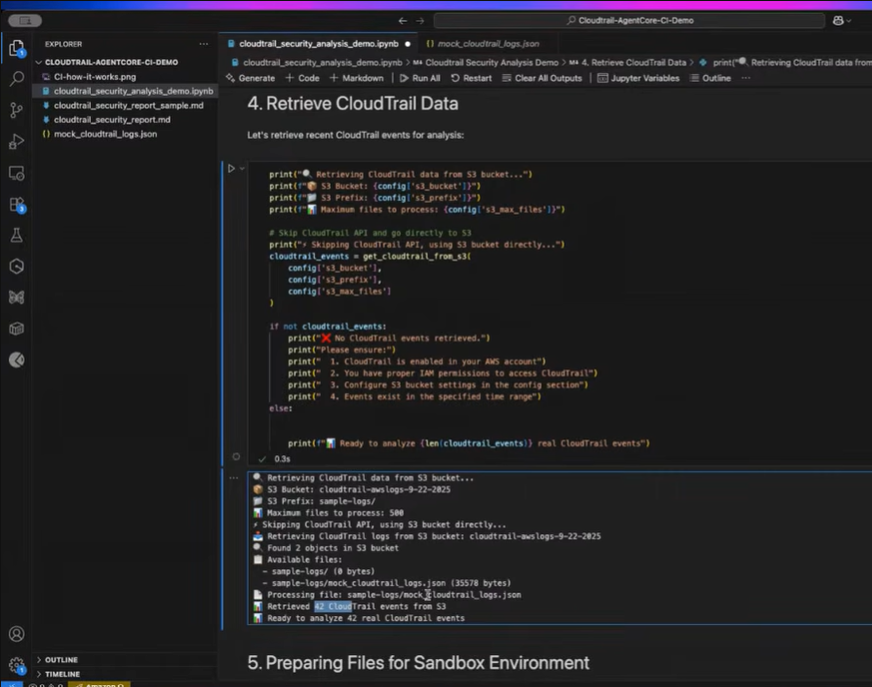

### Code from these screenshots

```python
cloudtrail_events = get_cloudtrail_from_s3(
 config['s3_bucket'], config['s3_prefix'], config['s3_max_files'])

if not cloudtrail_events:
 print("❌ No CloudTrail events retrieved.")
 # … prints the 4 remediation hints shown on screen
else:
 print(f"📊 Ready to analyze {len(cloudtrail_events)} real CloudTrail events")
```

### What the speaker explains

Rahul: *"Helper functions to identify how many logs we have and get them into a variable — retrieving the logs, doing basic diagnostics. In this S3 bucket there are 42 CloudTrail events we'll analyze."*

### Technical explanation

Important subtlety: this retrieval runs **in the notebook kernel, not in the sandbox** — the data lands in local Python memory first, and the next step pushes it into the microVM. That two-hop pattern (S3 → notebook → sandbox filesystem) is deliberate: the notebook is the orchestrator, the sandbox is the executor.

### Key takeaway

> **Data flow: S3 → notebook memory → sandbox filesystem → LLM-generated code reads it there.**

---

## 7.31 Cell 5–7 — Staging Files Into the Session

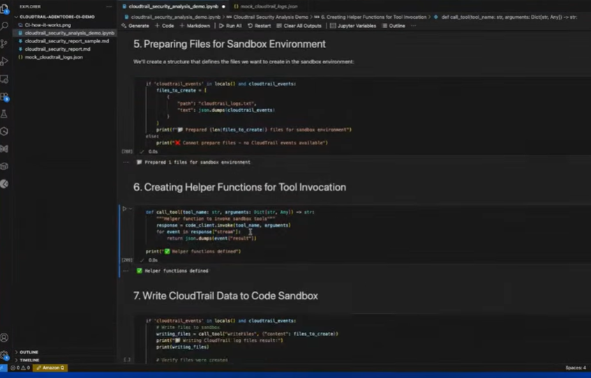

### What you are seeing

Three small cells: staging `cloudtrail_logs.txt` from the events JSON; the `call_tool` helper that wraps `code_client.invoke`; and the `writeFiles` call that pushes the file into the sandbox.

### Code from this screenshot

```python
files_to_create = [{"path": "cloudtrail_logs.txt",
 "text": json.dumps(cloudtrail_events)}]

def call_tool(tool_name: str, arguments: Dict[str, Any]) -> str:
 """Helper function to invoke sandbox tools"""
 response = code_client.invoke(tool_name, arguments)
 for event in response["stream"]:
 return json.dumps(event["result"])

writing_files = call_tool("writeFiles", {"content": files_to_create})
listing_files = call_tool("listFiles", {"path": ""})
```

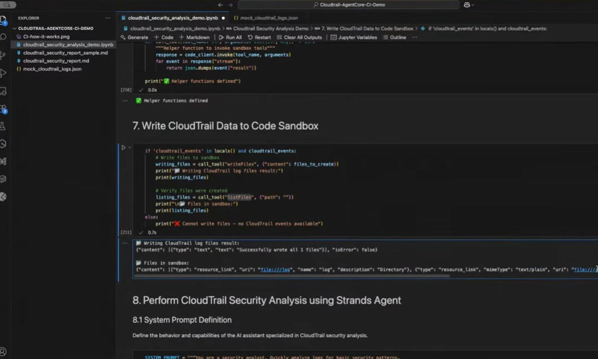

### What you are seeing

The confirmation output: `{"text": "Successfully wrote all 1 files", "isError": false}` and the `listFiles` result showing `cloudtrail_logs.txt` now inside the sandbox filesystem.

### What the speaker explains

Rahul: *"You have the ability to write directly into the Code Interpreter session — we're streaming the logs into the session's local filesystem because that's where the agent will write and execute code. `call_tool` invokes the operations the library provides; `writeFiles` puts the file in; `listFiles` confirms it was actually written."*

### Technical explanation

`writeFiles` / `listFiles` / `readFiles` are **sandbox tool operations** invoked through `code_client.invoke(name, args)` — the same channel the LLM's code will use via `executeCode`. The response is a streamed event envelope, hence the `for event in response["stream"]` unwrap.

### Key takeaway

> **The sandbox filesystem is a first-class API — write data in, read results out, all via `code_client.invoke`.**

---

## 7.32 Cell 8 — System Prompt + the execute_python Tool

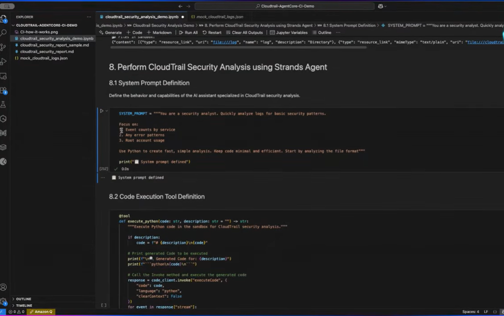

### What you are seeing

The system prompt: *"You are a security analyst. Quickly analyze logs for basic security patterns… Use Python to create fast, simple analysis. Keep code minimal and efficient. Start by analyzing the file format."* — plus the top of the `execute_python` tool.

### Code from these screenshots

```python
SYSTEM_PROMPT = """You are a security analyst. Quickly analyze logs for basic security patterns.

Focus on:
1. Event counts by service
2. Any error patterns
3. Root account usage

Use Python to create fast, simple analysis. Keep code minimal and efficient. Start by analyzing the file format"""

@tool
def execute_python(code: str, description: str = "") -> str:
 """Execute Python code in the sandbox for CloudTrail security analysis"""
 if description:
 code = f"# {description}\n{code}"
 print(f"\n🔍 Generated Code for: {description}")
 print(f"```python\n{code}\n```")
 response = code_client.invoke("executeCode", {
 "code": code, "language": "python", "clearContext": False})
 for event in response["stream"]:
 return json.dumps(event["result"])
```

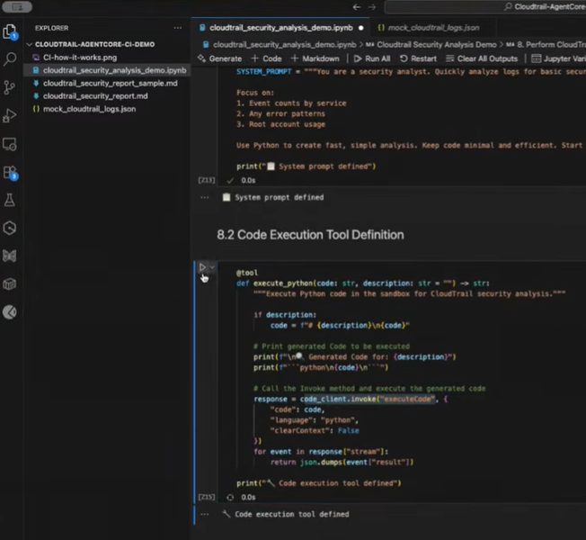

### What the speaker explains

Rahul: *"A basic system prompt optimized for speed — the model should be an analyst and give interesting findings. Then we define the tool plugged into the agent: annotate the function as `@tool` — and the most important part, we use the `invoke` method the library provides to send the code to the session for execution. This is verbose on purpose; with Strands it's one line as a native tool."*

### Technical explanation

`execute_python` is **the bridge**: the LLM emits `code`, this tool ships it to `executeCode` in the microVM, and the result comes back as the tool response — feeding the observe→decide→act loop. `clearContext=False` keeps the sandbox kernel stateful across calls, so variables persist between iterations.

### Key takeaway

> **`@tool` + `code_client.invoke("executeCode", …)` — that pair is the entire agent↔sandbox contract.**

---

## 7.33 Cell 9 — Agent Config + the Analysis Query

![Notebook — agent configuration: Claude 3.7 Sonnet, tools=[execute_python], system prompt](screenshots/c7s49.png)

### What you are seeing

Cell 8.3 output and the agent config: `BedrockModel("us.anthropic.claude-3-7-sonnet-20250219-v1:0")`, `Agent(model=…, tools=[execute_python], system_prompt=SYSTEM_PROMPT, callback_handler=None)` — then section 9 and the start of the analysis query.

### Code from this screenshot

```python
model = BedrockModel(model_id="us.anthropic.claude-3-7-sonnet-20250219-v1:0")
agent = Agent(
 model=model,
 tools=[execute_python],
 system_prompt=SYSTEM_PROMPT,
 callback_handler=None
)

query = """Analyze CloudTrail logs in 'cloudtrail_logs.txt' and create a
comprehensive security report:

ANALYSIS TASKS:
1. Count events by service and action
2. Identify any failed operations or errors
3. Look for root account usage
5. Find any critical issues
6. Generate threat summary

DELIVERABLES: …""" # continues below the fold on screen
```

### What the speaker explains

Rahul: *"We define the model — Claude 3.7 Sonnet — the tool we just defined, the system prompt, and that's it from agent configuration. Then we invoke: the query asks for top-five services, threat summaries, and a report once analysis is done."*

### Key takeaway

> **The agent is just `model + [execute_python] + system_prompt` — the sandbox does the heavy lifting.**

---

## 7.34 Cell 10 — Watch the Loop Run

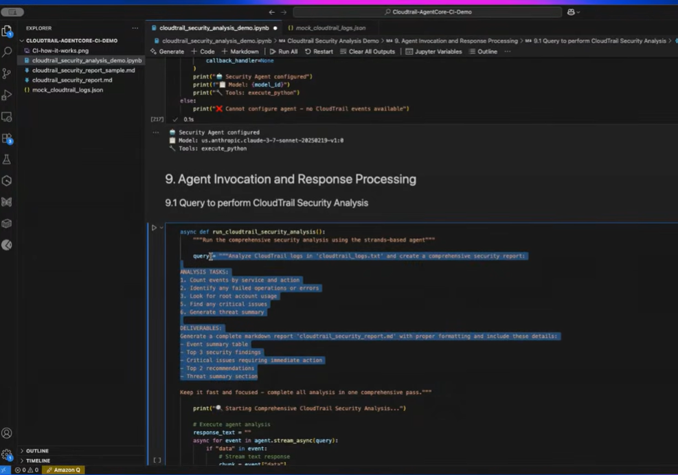

### What you are seeing

The agent invocation cell executing, with streamed output starting to appear.

### What the speaker explains

Rahul, as it runs: *"Based on the prompt it understands what's needed — I also asked it to look at the format of the logs first, then generate code. It's writing Python; the agent uses the tool to send it to the session, execute it, look at the output, give it back, and iteratively change the generated code until it achieves the goal — analyzing the logs."*

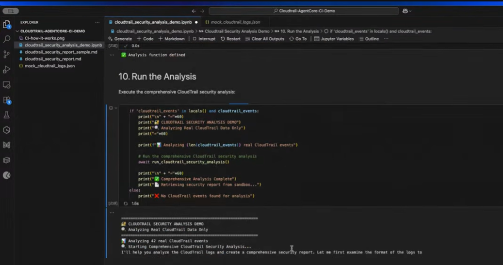

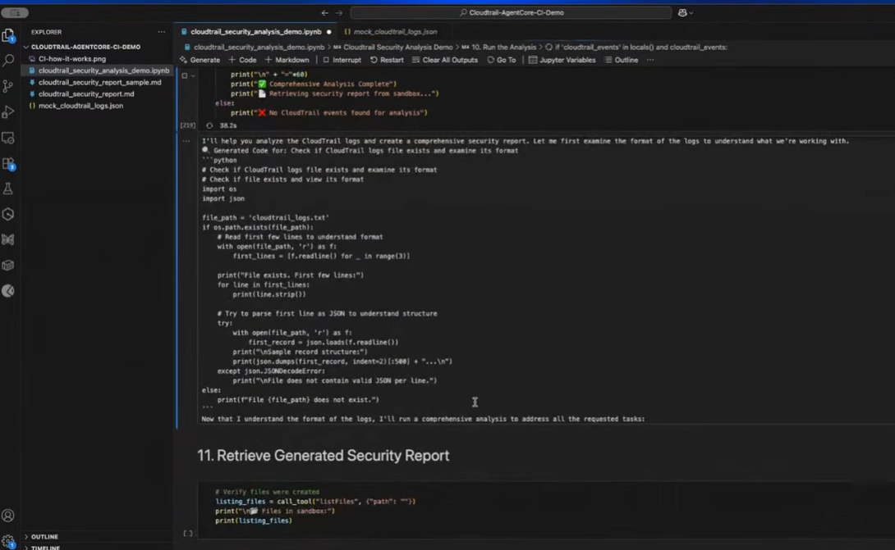

### What you are seeing

The `🔍 Generated Code for:` traces (the `print` inside `execute_python` working as designed): the LLM writes *fresh Python on every iteration* — first probing the file format, then running the actual analysis — while the sandbox executes and returns real output.

### Technical explanation

This is the leap-year loop from §7.24 doing real work: **observe** (result of last execution) → **decide** (LLM writes next code) → **act** (`executeCode` in the sandbox) → repeat until the report exists. The notebook only *prints* the loop; the loop itself lives in the agent.

### Key takeaway

> **The agent writes code iteratively inside the session — each iteration informed by the previous real output.**

---

## 7.35 Cell 11–12 — Pull the Report Back, Then Clean Up

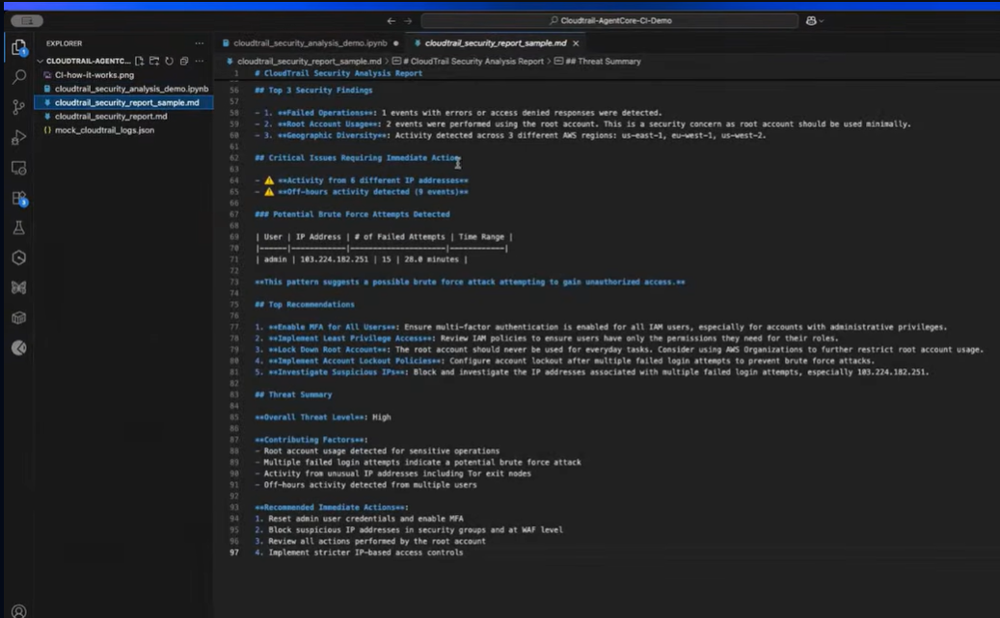

### What you are seeing

The retrieval cells: `listFiles` to verify, `readFiles` on `cloudtrail_security_report.md` (created inside the sandbox by the LLM's code), then writing it to local disk — followed by the cleanup cell (`code_client.stop()`).

### Code from this screenshot

```python
file_response = call_tool("readFiles", {"paths": ["cloudtrail_security_report.md"]})
file_data = json.loads(file_response)

with open("cloudtrail_security_report.md", "w") as f:
 f.write(file_data["content"][0]["resource"]["text"])

# Cleanup
def cleanup():
 try:
 code_client.stop()
 print("✅ Code Interpreter session stopped successfully!")
 except Exception as e:
 print(f"⚠️ Cleanup warning: {e}")
cleanup()
```

### What the speaker explains

Rahul: *"I asked it to create a report in Markdown format — it will be generated on the filesystem within the Code Interpreter environment. Using the read capabilities, you read objects back. That's what I'm doing — reading the markdown report."*

### Key takeaway

> **Files flow both ways: `writeFiles` in, `readFiles` out — the sandbox filesystem is the exchange point.**

---

## 7.36 The Generated Report — Real Analysis, Real Numbers

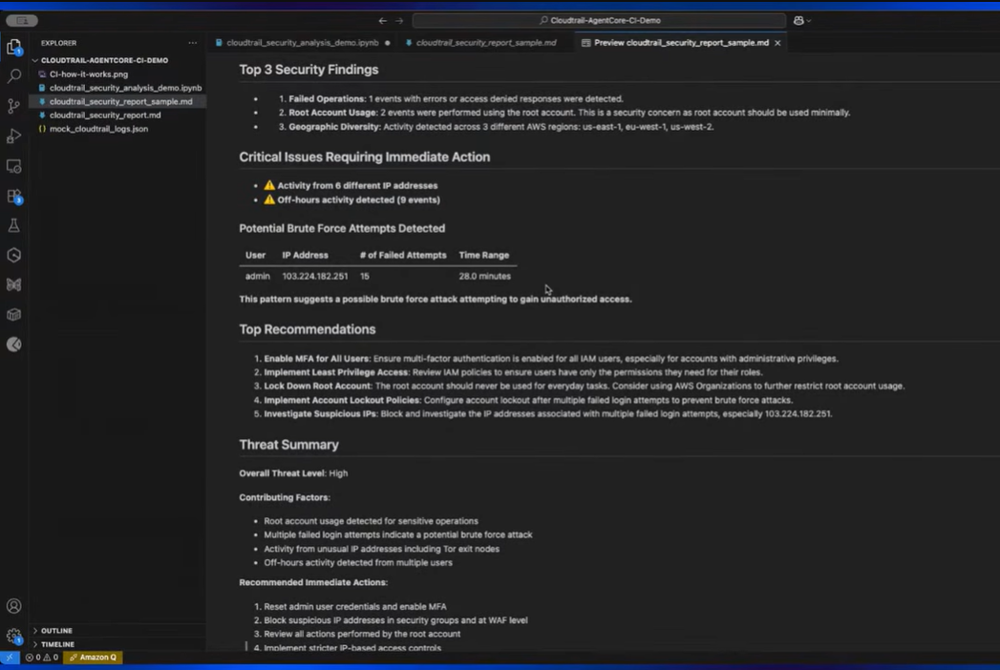

### What you are seeing

The generated Markdown report rendered: **Top 3 Security Findings**, **Critical Issues**, a **Brute Force Attempts** table, **Top Recommendations**, and a **Threat Summary** — overall threat level **High**.

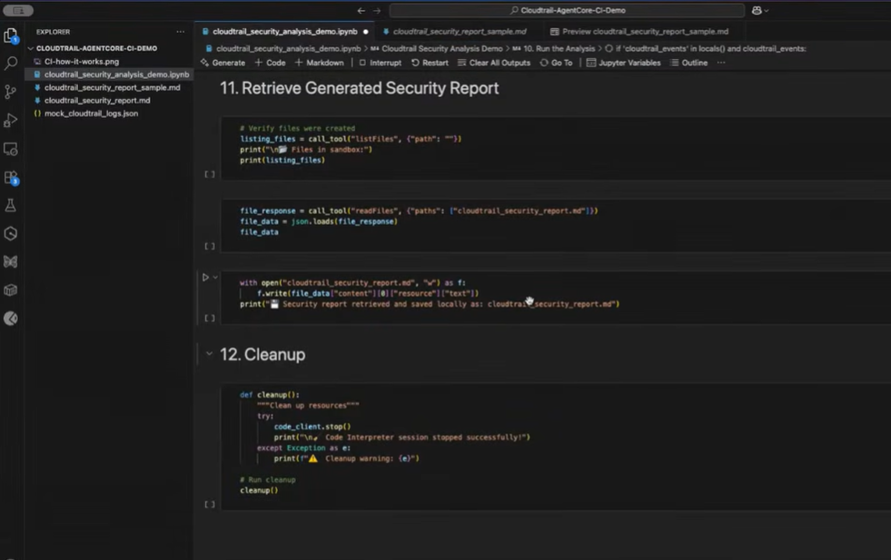

### What the speaker explains

Rahul: *"This is a very specific — and actually common — use case: Code Interpreter with an agent doing data processing. You could go further — one agent analyzing open/exposed IPs, another hunting unauthenticated calls, a supervisor synthesizing it all. Lots of possibilities."* And the reminder: *"We're using the system Code Interpreter — zero configuration, sandboxed, perfect for untrusted LLM-generated code."*

### Why it matters

Everything in that report — the event counts, the brute-force table, the threat rating — came from **executed code against real log data**, not from the model's memory. That's the entire thesis of the tool.

### Key takeaway

> **The report is trustworthy because every number in it was computed, not generated.**

### The full demo file

<GitHubExplorer repo="awslabs/agentcore-samples" ref="main" expanded="true" title="cloudtrail_security_analysis_demo.py — all notebook cells assembled (transcribed from the episode)" files={[
 { "path": "cloudtrail_security_analysis_demo.py", "src": "/bedrock-deepti/code/ch7/cloudtrail_security_analysis_demo.py", "label": "cloudtrail_security_analysis_demo.py", "highlights": [[8, 17], [88, 97], [100, 117], [120, 133], [142, 155]], "note": "All cells transcribed from the on-screen notebook — cells that ran past the bottom of the screen are marked; nothing invented." }
]} />

---

## 7.37 Wrap-Up — What the Team Wants You to Remember

### What the speaker explains

Veda on browser use cases: *"QA testing is very popular — maintaining Playwright or Selenium scripts is time-consuming and needs expertise; this is easy to start and parallelizes. Then general workflow automation — so much work happens in browsers; forms, ERPs, apps with no documented APIs — the web interface is the only way. And web scraping / getting information from the web."*

Kosti's closing point: *"Everything we described is fully modular — you don't have to use Runtime or Code Interpreter or Browser together. Pick and choose, build your solution on top of AgentCore."*

### Key takeaway

> **Two tools, one pattern: give the agent managed, isolated access to the world — the web for input, the sandbox for compute — and keep everything observable.**

<Conversation title="The Episode, As a Conversation" speakers={[{"id":"learner","name":"You","role":"Learner","side":"left","color":"#3b82f6"},{"id":"kosti","name":"Kosti","role":"AgentCore product team","side":"right","color":"#f97316"},{"id":"veda","name":"Veda","role":"GenAI SA — browser demo","side":"right","color":"#22c55e"},{"id":"rahul","name":"Rahul","role":"Specialist SA — CI demo","side":"right","color":"#a855f7"}]} messages={[{"who":"learner","text":"Why does an agent need a managed browser instead of its own Playwright scripts?"},{"who":"kosti","text":"Because most web work has no API — forms, ERPs, QA testing. We give you a headless Chromium in an isolated microVM, sub-second spin-up, sessions up to 8 hours, live view via DCV, and per-second billing."},{"who":"learner","text":"And how does the agent actually drive it?"},{"who":"veda","text":"A library like NovaAct, Playwright, or Browser-use sends CDP commands over a signed WebSocket. The loop is: screenshot in, LLM decides the next action, CDP command out. In my demo that loop ran natural-language QA suites against a retail app — four suites in parallel, two passed and two failed as designed."},{"who":"learner","text":"Then why a separate tool for code?"},{"who":"kosti","text":"Generated code is untrusted — run it on the agent's host and a bug can bring the agent down. Code Interpreter spins an isolated microVM per session: Python/JS/TS, 100 MB payloads, 5 GB from S3, CloudTrail logging."},{"who":"learner","text":"What did the demo prove?"},{"who":"rahul","text":"A Strands agent with one @tool — execute_python — analyzed 42 CloudTrail events. The LLM wrote Python, the sandbox ran it, the agent iterated, and it wrote a security report inside the sandbox that we read back out. Zero configuration — the system interpreter is sandbox-only."}]} />

## 🧠 Knowledge Check

<Quiz question="What are the three technologies under the AgentCore Browser Tool?" options={["HTTP, WebDriver, Xvfb","CDP, Playwright/Puppeteer-class libraries, and Amazon DCV","WebSocket, Selenium, VNC","Chromium, Firefox, WebKit"]} answerIndex={1} explanation="CDP is the low-level control channel, Playwright/Puppeteer/NovaAct generate CDP commands ergonomically, and DCV streams the rendered window for live view, takeover, and recording." />

<Quiz question="In Veda's QA demo, why do the natural-language test suites survive UI changes?" options={["They regenerate automatically","The agent evaluates assertions by looking at the rendered page — no brittle selectors","The tests run inside the app itself","NovaAct caches the DOM"]} answerIndex={1} explanation="The JSON steps are English ('verify the page title') — a vision-capable agent judges them against what it sees, so CSS/selector changes don't break the suite." />

<Quiz question="What does the Browser session replay actually record?" options={["A compressed video of the screen","DOM actions, CDP events, network and agent actions — reconstructed at playback","Only the LLM's decisions","Server-side screenshots every second"]} answerIndex={1} explanation="'This is not a video recording — we captured the DOM actions and reconstructed the replay' — which is why every action is inspectable with per-action Play buttons." />

<Quiz question="Why can't agent-generated code run on the agent's own host?" options={["It would be slower","A bug in untrusted generated code can bring down the agent itself","The host lacks Python","Licensing restrictions"]} answerIndex={1} explanation="Kosti's framing — generated code is unvalidated, so it gets an isolated, dynamically created microVM session instead." />

<Quiz question="In the CloudTrail demo, what does execute_python actually do?" options={["Runs Python on the notebook kernel","Sends the LLM-generated code to the sandbox via code_client.invoke('executeCode') and returns the result","Compiles the query to SQL","Writes the report file"]} answerIndex={1} explanation="The @tool-annotated bridge: LLM emits code → invoke('executeCode') in the microVM → streamed result back to the agent — feeding the observe→decide→act loop." />

<Quiz question="What's the difference between pre-built and custom Code Interpreter?" options={["Custom runs more languages","Pre-built is sandbox-only (microVM + S3); custom adds VPC placement, public access, and an IAM role reaching AWS resources","Pre-built is slower to start","Custom can't use S3"]} answerIndex={1} explanation="'Sandbox only… microVM plus S3' vs 'deploy in your VPC, enable public access, give an IAM role… like DynamoDB or other databases.'" />

## 🏁 Chapter 7 Summary

| Tool | One-liner | Proof from the episode |
|---|---|---|
| **Browser Tool** | Managed headless Chromium in a per-session microVM; CDP in, DCV out | Veda's QA demo: 4 parallel natural-language suites, live view, DOM-level replay |
| **Code Interpreter** | Per-session microVM where LLM code actually executes | Rahul's demo: S3 logs in → iterative code → security report out |
| **The shared pattern** | Untrusted world contact happens in isolated, observable, per-second-billed sandboxes | Same microVM + observability story on both tools |

## 🔗 Official AWS Resources

- 🧪 [AgentCore Samples](https://github.com/awslabs/agentcore-samples) — official AWS Labs sample code
- 🐍 [Bedrock AgentCore Python SDK](https://github.com/aws/bedrock-agentcore-sdk-python) — the SDK used in both demos
- 🌐 [Introducing the AgentCore Browser Tool](https://aws.amazon.com/blogs/machine-learning/introducing-amazon-bedrock-agentcore-browser-tool/) — companion announcement
- ⚙️ [Introducing the AgentCore Code Interpreter](https://aws.amazon.com/blogs/machine-learning/introducing-the-amazon-bedrock-agentcore-code-interpreter/) — the official announcement

### 🎬 Watch the Original Episode

<VideoSection youtubeId="z3lAJ-Nf_lk" title="AgentCore Browser Tool & Code Interpreter | AWS Show & Tell — the source episode for this chapter" />
