# AWS Bedrock Course — Chapter 8

*Amazon Bedrock AgentCore Memory — how agents stop being stateless: short-term event storage, long-term extraction strategies, namespaces, branching, and two working demos (LangGraph checkpointing + a Strands customer-support agent).*

# 🧠 AgentCore Memory — Deep Dive

> *"Imagine every time you talk to a friend and they forgot everything about your previous conversation."* — Mani Khanuja

Technically brilliant agents are still **fundamentally stateless** — every conversation starts from zero. This episode (AWS Show & Tell, hosted by Anil with **Mani Khanuja** and **Akarsha Sehwag** from the Agentic AI team) is a deep dive into **AgentCore Memory**: the managed service that gives agents short-term working memory, long-term extracted knowledge, and full control over what gets remembered — with two complete hands-on demos.

## 🎬 What This Chapter Covers

By the end of this chapter you will be able to:

- 🧩 Explain why **technical capability ≠ good experience** — stateless agents vs stateful, context-aware ones
- 🗂️ Distinguish **short-term memory** (raw events) from **long-term memory** (extracted records)
- 🆔 Use the core constructs — **memory ID, actor ID, session ID, payload, timestamp, branch**
- ⚙️ Describe the **three built-in long-term strategies** (semantic, user preferences, summary) + custom overrides
- 🌳 Organize records with **namespaces** and parallel conversation paths with **branching**
- 🔄 Trace the **asynchronous extraction pipeline** — extract → consolidate (add/update/skip) → embed & index
- 💻 Follow **two demos**: LangGraph checkpointing via `AgentCoreMemorySaver`, and a Strands customer-support agent with all three strategies

**Episode covered:** the full video — *"AgentCore Memory Deep Dive | AWS Show & Tell."*

---

## 8.1 Welcome — Meet Mani & Akarsha

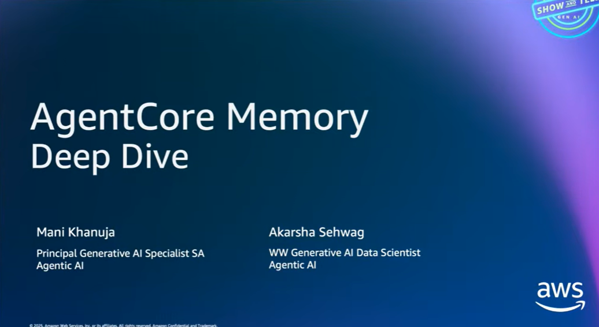

### What you are seeing

The episode's title card. Host **Anil Nadimi** (senior SA, Princeton NJ) is joined by **Mani Khanuja** (principal GenAI specialist SA, Orange County LA) and **Akarsha Sehwag** (GenAI data scientist working closely with AgentCore Memory, joining from Manhattan NYC).

### What the speaker explains

Anil: *"We are going to dive deep into AgentCore Memory. We've been doing this deep-dive series on the different suite of services AgentCore offers. Memory is a central component of agentic applications — Mani and Akarsha are going to break it down for us."*

### Technical explanation

Mani's framing of the service: *"AgentCore Memory is a service for agent memory management. It makes it easier for developers to build context-aware agents by eliminating the complex memory infrastructure management, while providing full control over what exactly the AI agent remembers."*

### Key takeaway

> **Managed memory = no infrastructure, but *you* decide what the agent remembers.**

---

## 8.2 Why Memory — Technical Capability ≠ Good Experience

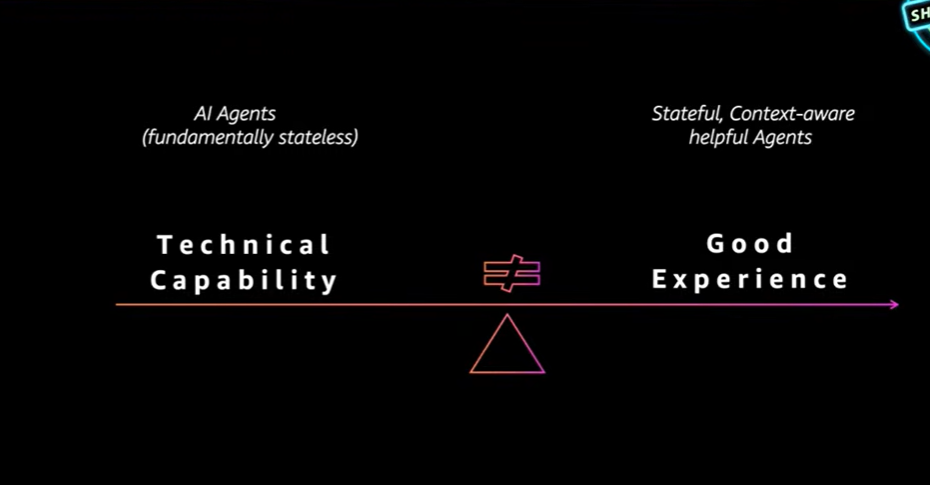

### What you are seeing

The core problem slide: a not-equal sign between **Technical Capability** (AI agents — fundamentally stateless) and **Good Experience** (stateful, context-aware, helpful agents).

### What the speaker explains

Mani: *"Till today we have focused on creating technically amazing agents — lots of tools, lots of capabilities. But however good they are at humanlike responses, they are fundamentally stateless. Imagine every time you talk to a friend and they forgot everything about your previous conversation — that would be frustrating."* — *"The ability to remember is the foundation of meaningful human relationships. We remember past conversations, learn preferences over time, build shared context — that's what deepens connections. That's what we want to replicate in our agents."*

### Technical explanation

Without memory, every session is a cold start: the agent can't learn preferences, can't resume interrupted work, and can't build the shared context that makes interactions feel personal. Statelessness is the default of an LLM call — memory is the layer that changes it.

### Why it matters

Mani's bold claim: *"2026 is going to be the year of context engineering. It's going to make a fundamental shift on everything that's agentic in nature."*

### Key takeaway

> **Tools make an agent capable. Memory makes it feel like it knows you.**

---

## 8.3 Context Engineering — the Real Failure Mode

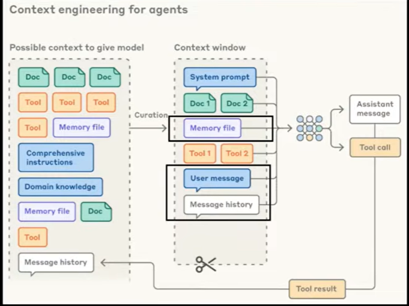

### What you are seeing

The context-engineering loop: many kinds of inputs (instructions, user messages, conversation history, tool calls, retrieved knowledge) get **curated** into the model's context window, which drives the assistant's next message or tool call.

### What the speaker explains

Akarsha: *"We have all these different kinds of context and we can engineer it so many ways — and context is the only thing that impacts whether we get a brilliant response or complete hallucinations. Agents handle complex tasks, long-running sessions for hours, and tool feedback piles up in that context window."*

The key observation: *"Most of the time when agentic systems mess up it's one of two reasons — the model itself, but honestly models are getting so much better that's less prominent now — or the context itself."*

### Technical explanation

Mani puts the obvious question on the table: *"Models handle millions of tokens — why curate context at all?"* Akarsha's answer has three parts:

1. **Misdirection** — too much or wrong context can pull the model the wrong way; *"if we want agents to perform in all corner cases, the context window must be precise, accurate and complete."*
2. **Cost** — *"imagine every call giving millions of tokens."*
3. **Caching helps only for repetition** — user messages and tool results are rarely repetitive.

### Key takeaway

> **Garbage in, garbage out still holds — no matter how smart the model gets. Curated context is the difference between brilliant and hallucinated.**

---

## 8.4 Real-World Use Cases — Where Context Explodes

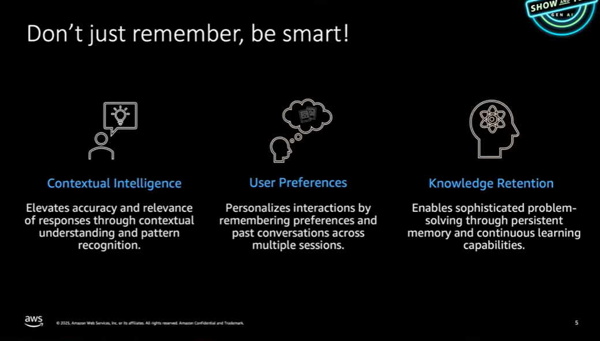

### What you are seeing

The pivot slide — it's not enough for an agent to store things; it must be *smart about what it remembers*: contextual intelligence, user preferences, knowledge retention.

### What the speaker explains

Answering a chat question, Akarsha gives two concrete cases:

- **Customer support** — the agent fetches from data APIs *and* vector stores (*"RAG is still alive — not going anywhere"*), plus personalization; context grows fast and must stay *relevant*.
- **Deep research** — long-running agents (5 minutes to over an hour) accumulate enormous context; *"you're adding extra load on the model to figure out what's relevant."*

The preference example: *"If I code in Python, that's repetitive input every time. Why can't my agent just remember I code in Python?"* — and beyond preferences, the agent should learn *how* you like answers structured across follow-ups.

### Why it matters

*"We don't have to just remember — we have to be smart about what our agents are remembering."* That line is the whole design philosophy of the service.

### Key takeaway

> **Memory isn't hoarding — it's curation. Store the signal, drop the noise.**

---

## 8.5 Short-Term vs Long-Term Memory

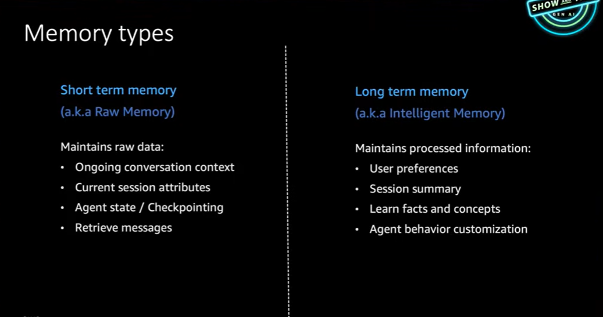

### What you are seeing

The two-layer model: **short-term memory** as the raw event store for an ongoing session, and **long-term memory** as the processed, cross-session knowledge layer.

### What the speaker explains

Akarsha on short-term: *"Think of it as raw memory — the ongoing conversation: user questions, agent responses, tool information, and most importantly the agent state — so it can resume if something goes bad, for checkpointing. Two important things: who the actor is — who these messages belong to — and we call these raw items **events**."*

On long-term: *"It maintains processed information — not just raw messages. If I say I like to code in Python, it should store that and remember across many sessions — or a summary of previous conversations so a returning user gets 'we talked about this last time.'"*

### Technical explanation — the travel-agent example

*"I'm planning a vacation Nov 5–10, I like beaches and cabins in the forest."* Those raw turns go to short-term memory; the extraction pulls out *"user prefers beaches / water activities"* into long-term memory, where it persists across all future sessions.

| | **Short-term (events)** | **Long-term (records)** |
|---|---|---|
| Contains | raw messages, tool calls, blobs, checkpoints | extracted facts, preferences, summaries |
| Scope | one session | across sessions |
| Written | synchronously, as it happens | asynchronously, by the extraction module |
| TTL | configurable **7–365 days** (`event_expiry_days`) | no TTL — delete via API |
| Backend | event store | **vector store** |

### Key takeaway

> **Short-term = the agent's scratchpad (raw, instant, per-session). Long-term = distilled knowledge (extracted, semantic, cross-session).**

---

## 8.6 AgentCore Memory — the Full Picture

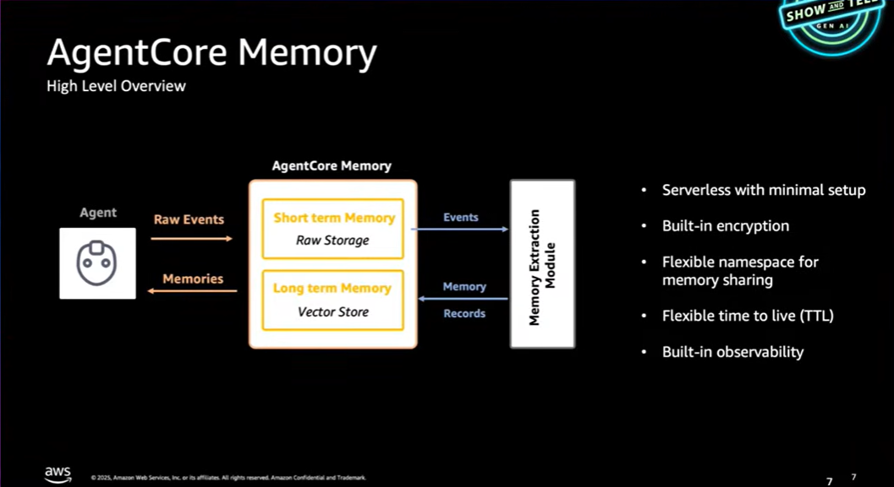

### What you are seeing

The architecture in one slide: the agent's activity lands as **raw events** in short-term storage; a **memory extraction module** processes those events into **memory records** in a long-term vector store.

### What the speaker explains

Akarsha: *"Short-term acts like the raw storage — capturing everything happening right now: user interactions, session attributes, retrievable instantly. Real-time. It's your agent's working memory. And here's where it gets powerful — these events are also processed through a memory extraction module and stored into long-term memory as memory records: learned facts or concepts, depending on how you configure it."*

Why use it: *"Completely serverless with minimal setup — literally a couple of lines of code. Built-in encryption in transit and at rest — we're dealing with user data. Flexible namespaces — define how memory is shared across agents or users. Flexible time-to-live settings. And logging to observe everything."*

### Key takeaway

> **One service, two stores: instant raw events + distilled vector memory — serverless, encrypted, namespaced, observable.**

---

## 8.7 Short-Term Memory — the Six Constructs

<HotspotImage src="/bedrock-deepti/screenshots/c8s07.png" title="Short-term memory concepts — click each construct" hotspots={[
 { "num": 1, "x": 8, "y": 28, "w": 14, "h": 12, "label": "Memory ID", "to": "8-7-short-term-memory-the-six-constructs", "tip": "The memory resource — created once; all events live inside it" },
 { "num": 2, "x": 27, "y": 28, "w": 14, "h": 12, "label": "Actor ID", "to": "8-7-short-term-memory-the-six-constructs", "tip": "Who the events belong to — user ID, agent ID, or a combination" },
 { "num": 3, "x": 46, "y": 28, "w": 14, "h": 12, "label": "Session ID", "to": "8-7-short-term-memory-the-six-constructs", "tip": "Groups related events — by conversation or time period" },
 { "num": 4, "x": 65, "y": 28, "w": 14, "h": 12, "label": "Payload", "to": "8-7-short-term-memory-the-six-constructs", "tip": "A conversational message or a blob (agent state JSON)" },
 { "num": 5, "x": 8, "y": 55, "w": 14, "h": 12, "label": "Timestamp", "to": "8-7-short-term-memory-the-six-constructs", "tip": "When the event happened — ordering & filtering" },
 { "num": 6, "x": 27, "y": 55, "w": 14, "h": 12, "label": "Branch", "to": "8-7-short-term-memory-the-six-constructs", "tip": "Alternate conversation paths within one session" }
]} />

### What you are seeing

The six constructs that define every short-term-memory event: **Memory ID**, **Actor ID**, **Session ID**, **Payload**, **Event Timestamp**, and **Branch** — plus a branching tree showing a session forking into alternate paths.

### What the speaker explains

Akarsha walks through them one by one:

- **Memory ID** — *"you create the memory resource first; it spins up the infrastructure and gives you a memory ID — the space where you write messages."*
- **Actor ID** — *"who the messages belong to — a user ID, an agent ID, or a combination; I've even seen project ID + user ID."*
- **Session ID** — *"a group of related events — define it by related events or by time period."*
- **Payload** — *"a conversation message… or just a JSON blob storing the entire agent state."*
- **Timestamp** — ordering for retrieval.
- **Branch** — *"supports alternate paths. Don't provide a branch and everything goes to `main`; provide one and you get edit-a-message, alternate conversation paths, concurrent event streams."*

### Technical explanation — branching in practice

The multi-agent example: *"Once the destination is finalized, a flight agent works the flight branch while a hotel agent works the hotel branch — parallel work on the same memory resource with a soft separation of concerns."*

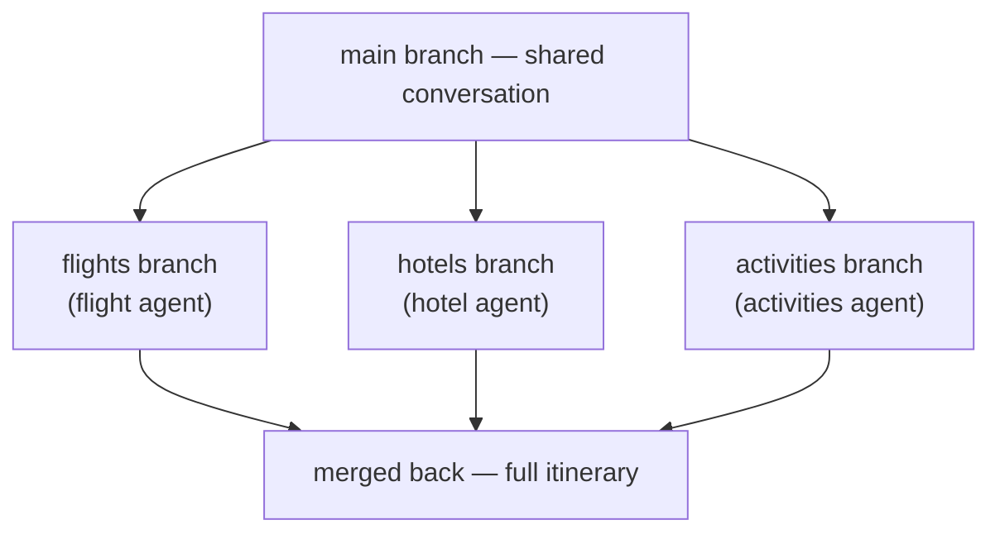
```mermaid
flowchart TD
 M["main branch — shared conversation"] --> F["flights branch<br/>(flight agent)"]
 M --> H["hotels branch<br/>(hotel agent)"]
 M --> A["activities branch<br/>(activities agent)"]
 F --> R["merged back — full itinerary"]
 H --> R
 A --> R
```

### Key takeaway

> **memory_id = the resource, actor_id = who, session_id = which conversation, payload = what, timestamp = when, branch = which parallel path.**

---

## 8.8 Events — Conversational vs Blob

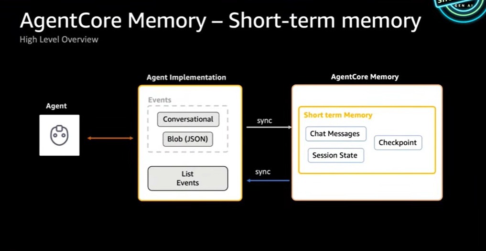

### What you are seeing

The event model: two payload kinds land in short-term memory — **conversational events** (user input, agent responses, tool messages) and **blob events** (JSON state — checkpoints and session state). `listEvents`/`getEvent` retrieve them.

### What the speaker explains

Akarsha: *"Conversational events — chat messages, user input, agent responses, tool messages — are what actually enrich your long-term memory, because that's where meaningful interaction data lies. The blob mostly stores session information — those events are *not* extracted as insights later: checkpoints and session state."*

And the clarification everyone needs: *"Checkpoints are snapshots of your application state — think fault tolerance and recovery; pick back up where you left off. Session state is user-specific data across multiple requests — session ID, agent state, that kind of thing."*

### Technical explanation

| Payload type | Feeds long-term? | Contains |
|---|---|---|
| **Conversational** | ✅ yes — extracted into records | user/assistant/tool messages |
| **Blob** | ❌ no — storage only | checkpoints, session state snapshots |

The demo makes this concrete — LangGraph checkpoints arrive as blob events (you'll see them in the Memory Browser at §8.13).

### Key takeaway

> **Only conversational events feed the long-term pipeline; blobs are state plumbing — checkpoints and session state.**

---

## 8.9 Long-Term Memory — Strategies & Namespaces

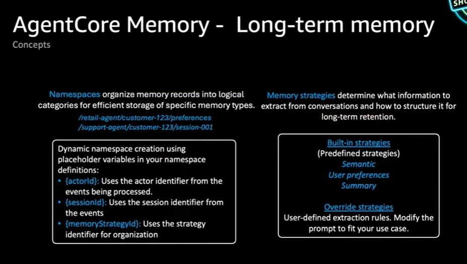

### What you are seeing

The long-term side: built-in strategies — **semantic** (facts), **user preferences**, **summary** (one rolling summary per session) — plus **override** strategies, all organized under **namespaces**.

### What the speaker explains

Akarsha: *"The strategy defines what gets fetched from short-term into long-term memory. Three built-in strategies: **semantic** — the facts in a conversation; **user preferences** — extracting what the user likes; **summary** — one per session, a rolling summary."*

On override: *"Two things come into play — the extraction logic and the consolidation logic. If a preference is already stored I don't want duplicates; if I update my preference — 'I love Python' becomes 'I like Java' — it should update. If you want to override that with your own prompts and your own model, that's the override strategy."*

On namespaces: *"A hierarchical concept — prefixes arranged hierarchically that take the IDs you provide… At runtime it resolves the actor: my preferences are only visible to me; when Akarsha uses the same agent, only hers show."* Example on the slide: `retail_agent/{customerId}/preferences` — the `{customerId}` resolves at runtime.

### Technical explanation

- **One strategy = one namespace** — each strategy's records live under its own path.
- **Namespace variables** — `{actorId}`, `{sessionId}`, `{strategyId}` resolve at write/retrieve time.
- **Runtime isolation** — the namespace pattern is *how* per-user privacy works: records are physically scoped per actor.

### Why it matters

Namespaces are the answer to "how do 10,000 users share one memory resource without leaking preferences?" — scope every record to `{actorId}` and the service enforces the boundary for you.

### Key takeaway

> **Strategy = *what* to extract. Namespace = *where* it lives and *who* can see it.**

---

## 8.10 The Complete Flow — Sync Writes, Async Extraction

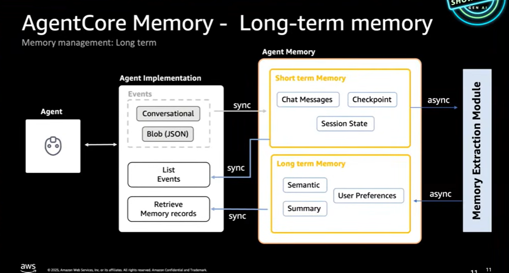

### What you are seeing

The complete data flow: the agent writes **events** to short-term memory synchronously (and reads them back via `listEvents`); meanwhile the **Memory Extraction Module** asynchronously turns events into **long-term records**, which the agent pulls via `retrieve`.

### What the speaker explains

Akarsha: *"Raw events don't just sit there — there's an asynchronous pipeline, a memory extraction module doing smart work behind the scenes. It takes in all the raw data and, depending on the strategies you configured when creating the memory resource, extracts the relevant pieces of information."*

The retrieval pattern that matters: *"A very common pattern — the last N messages via `listEvents` (say the last five), combined with relevant user preferences or the session summary from long-term memory. You compress the agent's context 60–70% and still get equally good responses as with the entire history."*

### Technical explanation

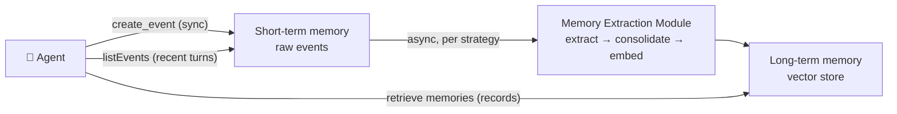
```mermaid
flowchart LR
 A["🤖 Agent"] -- "create_event (sync)" --> S["Short-term memory<br/>raw events"]
 S -- "async, per strategy" --> X["Memory Extraction Module<br/>extract → consolidate → embed"]
 X --> L["Long-term memory<br/>vector store"]
 A -- "listEvents (recent turns)" --> S
 A -- "retrieve memories (records)" --> L
```

### Why it matters

The **async boundary** is the design's superpower: writes never block the agent loop, and extraction only runs after `k` messages or `x` seconds of inactivity — long-term enrichment is essentially free at runtime.

### Key takeaway

> **Write fast (sync), distill slow (async), and serve the agent a compressed context: last-N messages + extracted records.**

---

## 8.11 Inside the Extraction Module — Extract, Consolidate, Index

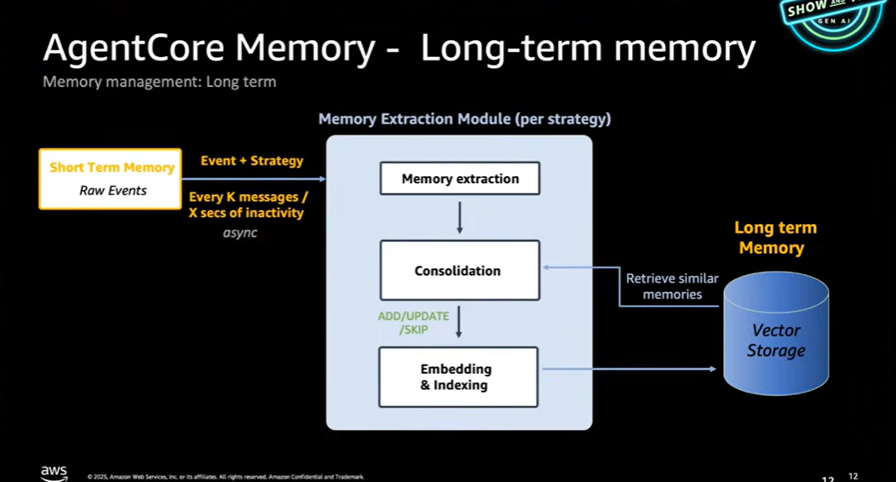

### What you are seeing

The module's three stages: **extraction** (per configured strategy, pulling only the relevant pieces — up to 100 messages per event), **consolidation** (retrieve similar existing memories, then ADD / UPDATE / SKIP), and **embed & index** into the vector store.

### What the speaker explains

Akarsha on the trigger: *"The pipeline runs asynchronously after every *k* messages or after *x* seconds of inactivity — we don't want it waiting too long."*

The consolidation example: *"The user mentioned in April they like camping spots; in October, exhausted from work, they prefer a beach vacation. This needs an *update* — not two entries, not deleting the old one: 'user preferred camping in April; prefers a beach vacation in October.' Consolidation retrieves similar memories from the existing vector store and can add, update, or skip — then embeds and indexes into long-term memory."*

### Technical explanation

| Consolidation outcome | When |
|---|---|
| **ADD** | the extracted fact doesn't exist yet |
| **UPDATE** | a related record exists but the detail changed (April → October) |
| **SKIP** | the information is already captured — don't duplicate |

### Why it matters

This is what keeps the memory **clean**: no duplicates, no contradictions, no stale preferences. The vector store stays a *current* model of the user rather than an append-only log — which is exactly what "context engineering" needs.

### Key takeaway

> **Extraction picks the signal; consolidation merges it intelligently — add, update, or skip — so memory evolves with the user.**

---

## 8.12 Deployment & Integration — Meets You Where You Are

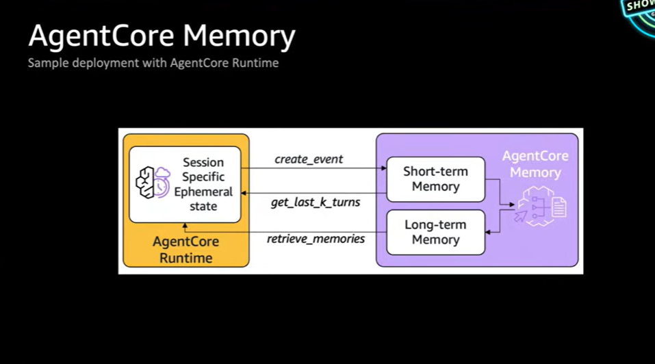

### What you are seeing

The deployment picture: an agent on **AgentCore Runtime** talking to the memory service's APIs — but the same APIs are reachable from EKS, Fargate, or anywhere else.

### What the speaker explains

Mani: *"You can deploy with Runtime — or if you already have a pipeline, on EKS or Fargate; we want to meet customers where they are."* — Akarsha: *"These are all APIs behind the scenes — based on the permissions you've defined, you can call it from anywhere, integrate with any framework, use it with any model."*

One important caveat: *"Only the override strategy's model must be a Bedrock model — because extraction and consolidation run inside the service. Your *agent* can be any model — OpenAI, Gemini, whatever."*

### Technical explanation

| Piece | Constraint |
|---|---|
| Agent framework | any — LangGraph, Strands, CrewAI… |
| Agent model | any — Bedrock or external |
| Extraction/consolidation model (override) | **must be a Bedrock model** |
| Where the agent runs | Runtime preferred; any host can call the memory APIs |

### Key takeaway

> **Memory is framework- and model-agnostic — the only Bedrock-bound piece is the internal extraction LLM.**

---

## 8.13 Show & Tell 1 — a LangGraph Math Agent with Checkpointing

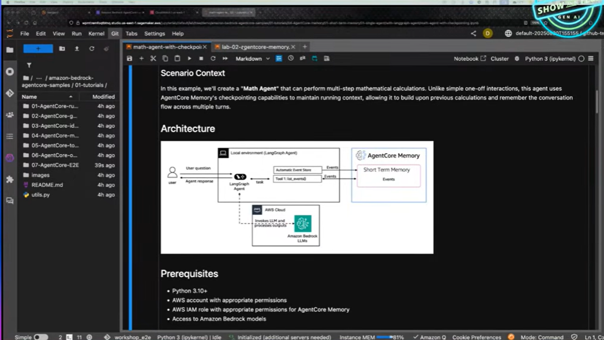

### What you are seeing

The first notebook open in JupyterLab: `math-agent-with-checkpointing.ipynb`, with the integration summary — *"Using AgentCore Memory as a checkpointer backend for LangGraph state persistence; automatic saving/loading of conversation state at each step; support for multiple concurrent sessions and actors."*

### What the speaker explains

Akarsha: *"Two examples — one with checkpointing, one with long-term memory. First, a LangGraph agent using the default AgentCore memory saver from `langgraph-checkpoint-aws` — it automatically creates checkpoints behind the scenes: an event store that saves all events in short-term memory, retrievable via `listEvents`."*

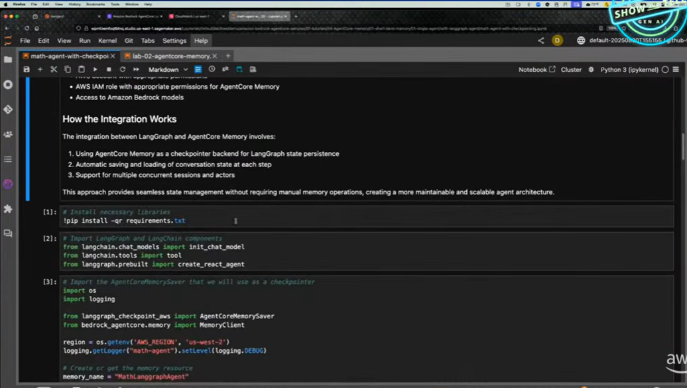

### Code from these screenshots

```python
# Import LangGraph and LangChain components
from langchain.chat_models import init_chat_model
from langchain.tools import tool
from langgraph.prebuilt import create_react_agent

# Import the AgentCoreMemorySaver that we will use as a checkpointer
from langgraph_checkpoint_aws import AgentCoreMemorySaver
from bedrock_agentcore.memory import MemoryClient
```

### Technical explanation

`AgentCoreMemorySaver` is a **drop-in LangGraph checkpointer** — you swap one object and every graph step persists to AgentCore short-term memory as blob events. No schema, no database, no wiring.

### Key takeaway

> **LangGraph checkpointing on AgentCore = change one constructor argument.**

---

## 8.14 The Checkpointer, the Model, the Tools

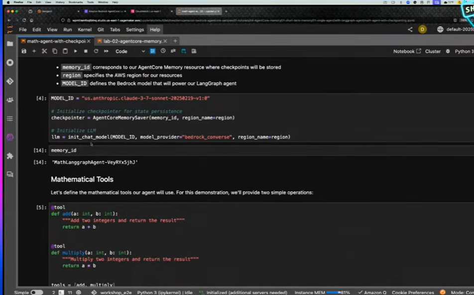

### What you are seeing

The wiring cell: `checkpointer = AgentCoreMemorySaver(memory_id, region_name=region)`, the model init via `init_chat_model(MODEL_ID, model_provider="bedrock_converse")`, the two math tools (`add`, `multiply`), and the created memory resource ID printed below — `MathLangraphAgent-VeyRYx5jhJ`.

### What the speaker explains

Akarsha: *"We import a memory client, create or get memory by name — it retrieves a memory ID — and provide that into our React agent as the checkpointer, the `AgentCoreMemorySaver` class from langgraph-aws, with the memory ID and region."*

Mani's critical clarification: *"A question we get 99% of the time — do I need to create the memory every time I initialize the agent? **No.** Creating the memory resource is a one-time activity; afterwards you only provide the memory ID. That's why the helper is called *create-or-get* — so you don't accidentally keep creating resources."*

### Key takeaway

> **`create_or_get_memory` once → store the memory ID → pass it to the checkpointer forever.**

---

## 8.15 Building the Agent — and the Two Required IDs

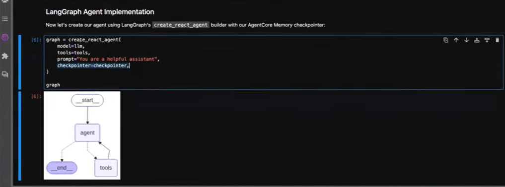

### What you are seeing

`create_react_agent(model=llm, tools=tools, prompt="You are a helpful assistant", checkpointer=checkpointer)` — and the compiled graph rendered underneath.

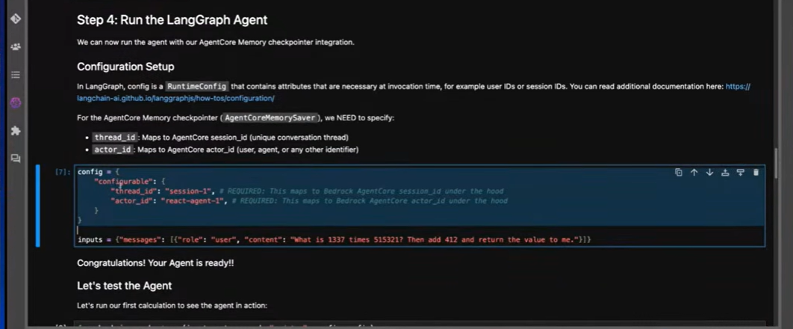

### Code from this screenshot

```python
config = {
 "configurable": {
 "thread_id": "session-1", # REQUIRED: maps to AgentCore session_id
 "actor_id": "react-agent-1", # REQUIRED: maps to AgentCore actor_id
 }
}
```

### What the speaker explains

Akarsha: *"We created a very simple graph — at runtime you provide config: two required values, the `thread_id` (which is the session ID) and the `actor_id`. The actor can be agent-level, user-level, project ID, org ID — even a shared one for everyone."*

Mani on ID hygiene: *"Provide the memory ID once at init so the agent knows where to store. Then in the config provide actor ID + session ID per conversation — in production these come from your auth layer / request payload, and the memory ID lives in an env var or SSM parameter."*

### Key takeaway

> **LangGraph `thread_id` = AgentCore `session_id`. Both ids travel in `config.configurable` — memory_id only at setup.**

---

## 8.16 Watching It Think — and Prove It Remembers

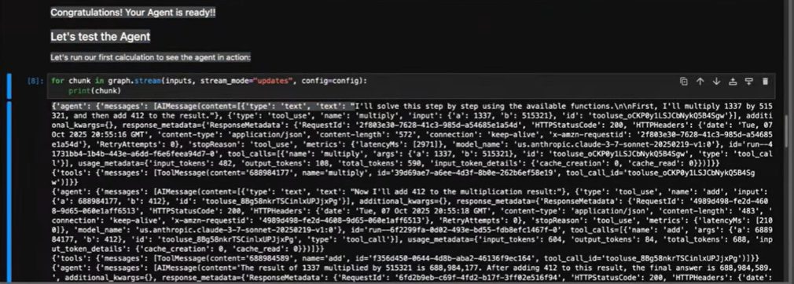

### What you are seeing

`graph.stream(inputs, stream_mode="updates", config=config)` executing: tool calls for `multiply(1337, 515321)` → `688984177`, then `add(688984177, 412)` → `688984589`.

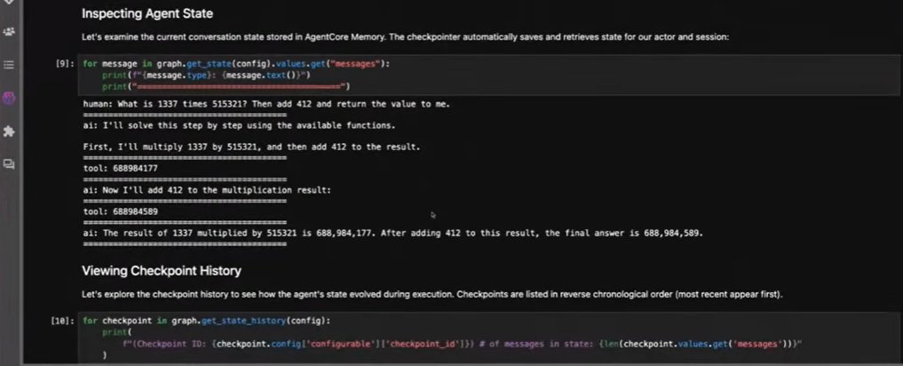

### What you are seeing

`graph.get_state(config)` printing current messages, and `get_state_history` listing **6 checkpoints** in reverse chronological order — one per graph step.

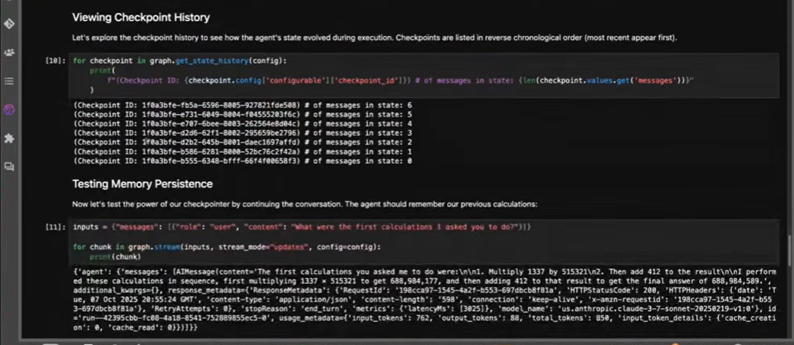

### What the speaker explains

Akarsha: *"A math agent with multiply and addition as tools — we interact continuously in multiple steps, and we can retrieve the checkpoints created at different times… LangGraph creates blob events — checkpoints — and also `writes`, which are intermediate checkpoints."*

### Why it matters

The follow-up question is the proof: the agent recalls *"multiply 1337 by 515321, then add 412"* — not because the prompt was repeated, but because the **checkpointed state** in short-term memory carried the history.

### Key takeaway

> **Checkpoints = resumable agent state — every graph step lands as a blob event you can inspect and rewind.**

### The full file, in the code viewer

Everything from screenshots 13–20 assembled into one readable file — cells that scrolled past the bottom of the screen are marked, nothing invented:

<GitHubExplorer repo="awslabs/agentcore-samples" ref="main" expanded="true" title="math_agent_checkpointing.py — all notebook cells assembled (transcribed from the episode)" files={[
 { "path": "math_agent_checkpointing.py", "src": "/bedrock-deepti/code/ch8/math_agent_checkpointing.py", "label": "math_agent_checkpointing.py", "highlights": [[13, 16], [38, 44], [47, 52]], "note": "Transcribed from the on-screen notebook — the imports, create_react_agent call, and the required thread_id/actor_id config are fully visible; scrolled-off blocks are marked with comments." }
]} />

---

## 8.17 The Memory Browser — Seeing the Events

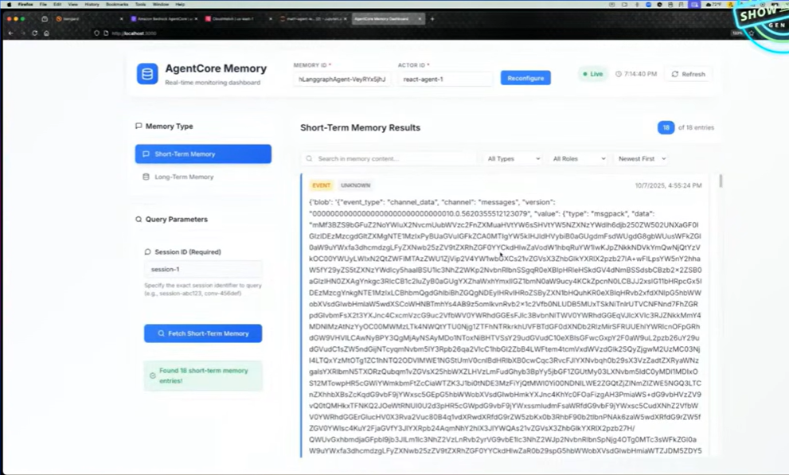

### What you are seeing

The open-source **Memory Browser** (localhost:3000): querying memory ID `MathLangraphAgent-VeyRYx5jhJ`, actor `react-agent-1`, session `session-1` returns **18 short-term-memory entries** — `EVENT/UNKNOWN`-type blob payloads containing LangGraph checkpoint msgpack data.

### What the speaker explains

Akarsha: *"A very simple memory browser we created to inspect — actor `react-agent-1`, session `session-1`. Since we have checkpoints, these are events of type blob — LangGraph creates checkpoints and `writes` (intermediate checkpoints). All this code, including the memory browser, Akarsha has shared on our GitHub — the link is provided."*

### Key takeaway

> **The Memory Browser turns the abstract event model into something you can point at — actor + session → the actual stored blobs.**

---

## 8.18 Show & Tell 2 — a Customer-Support Agent with Long-Term Memory

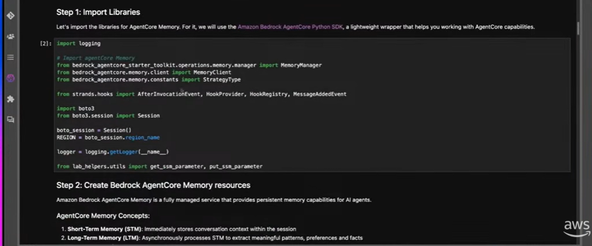

### What you are seeing

The second notebook's imports — a **Strands** agent this time, using the **starter toolkit's `MemoryManager`**, the low-level `MemoryClient`, `StrategyType` constants, Strands lifecycle hooks, and SSM-parameter helpers for the memory ID.

### Code from this screenshot

```python
from bedrock_agentcore_starter_toolkit.operations.memory.manager import MemoryManager
from bedrock_agentcore.memory.client import MemoryClient
from bedrock_agentcore.memory.constants import StrategyType
from strands.hooks import AfterInvocationEvent, HookProvider, HookRegistry, MessageAddedEvent
```

### What the speaker explains

Akarsha: *"A customer-support agent using the Strands framework — local tools, connected to AgentCore Memory. For the demo we've seeded it with previous interactions so there's context already."*

### Key takeaway

> **Demo 1 showed short-term (checkpointing). Demo 2 shows the long-term pipeline: strategies → seed events → retrieve extracted records.**

---

## 8.19 Declaring All Three Strategies

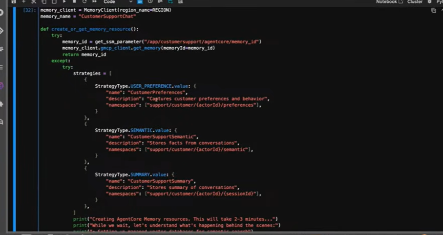

### What you are seeing

The strategy definitions inside `create_or_get_memory_resource()` — all three built-in strategies with names, descriptions, and **namespaces**:

### Code from this screenshot

```python
strategies = [
 {
 StrategyType.USER_PREFERENCE.value: {
 "name": "CustomerPreferences",
 "description": "Captures customer preferences and behavior",
 "namespaces": ["support/customer/{actorId}/preferences"],
 }
 },
 {
 StrategyType.SEMANTIC.value: {
 "name": "CustomerSupportSemantic",
 "description": "Stores facts from conversations",
 "namespaces": ["support/customer/{actorId}/semantic"],
 }
 },
 {
 StrategyType.SUMMARY.value: {
 "name": "CustomerSupportSummary",
 "description": "Stores summary of conversations",
 "namespaces": ["support/customer/{actorId}/{sessionId}"],
 }
 }
]
```

### What the speaker explains

Akarsha: *"We created all three strategies to show you. Name and description are yours to choose. The important part — namespaces take a path-like structure with variables: `{actorId}`, `{strategyId}`, `{sessionId}`. Summary gets a `sessionId` because a summary is per-session; semantic and preferences divide by actor only."*

Mani clarifies actor choice: *"For a travel agent, actor ID is mostly the user ID — but it can be a user+agent combination with branching. It depends on your use case and how you want to separate."*

### Key takeaway

> **Namespace design IS the data model: `support/customer/{actorId}/preferences` scopes each customer's preferences to them alone.**

---

## 8.20 Creating the Resource — One Time, ~2 Minutes

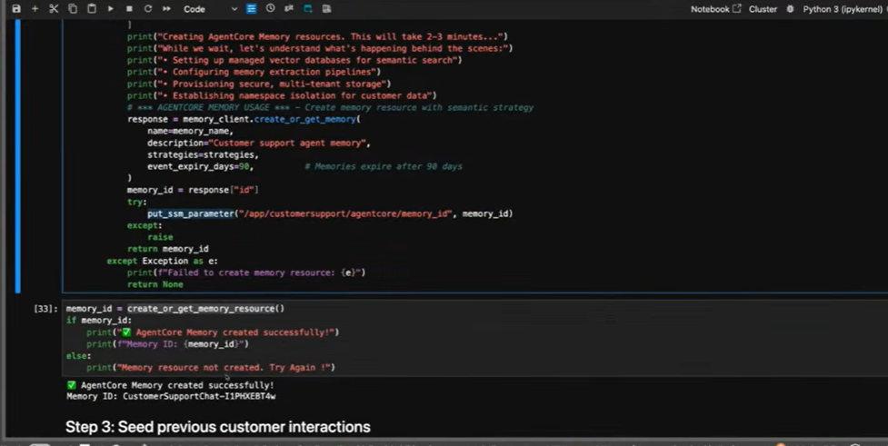

### What you are seeing

The creation call completing: `event_expiry_days=90`, the memory ID persisted to SSM (`/app/customersupport/agentcore/memory_id`), and the success output — **Memory ID: `CustomerSupportChat-I1PHXEBT4w`**.

### What the speaker explains

Akarsha: *"`create_or_get_memory` with the memory name, description, the strategies list, and event-expiry days — 7 to 365 days. This takes a couple of minutes only on first creation — not for events or retrievals."*

Mani's clarification: *"Those few minutes are only for long-term memory — we create a vector store behind the scenes; short-term is really fast. And `event_expiry_days` applies only to short-term events — long-term has no TTL; you delete records via the APIs per your business use case."*

### Key takeaway

> **Long-term memory spins up a vector store (≈2 min, once). Event TTL 7–365 days covers short-term only.**

---

## 8.21 Seeding the Customer's History

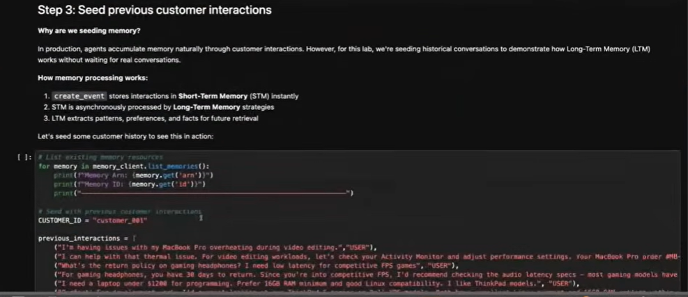

### What you are seeing

The seeding setup: `CUSTOMER_ID = "customer_001"` and `previous_interactions` — `(message, "USER"/"ASSISTANT")` tuples covering a MacBook Pro overheating issue, gaming-headphone preferences (competitive FPS), and a sub-$1200 laptop budget.

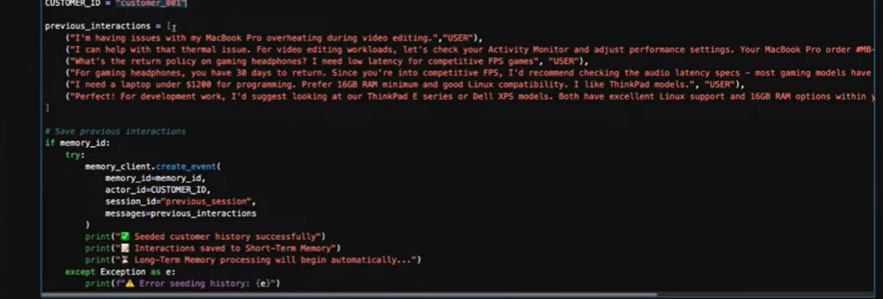

### Code from this screenshot

```python
memory_client.create_event(
 memory_id=memory_id,
 actor_id=CUSTOMER_ID,
 session_id="previous_session",
 messages=previous_interactions
)
# → ✅ Seeded customer history successfully
# 💾 Interactions saved to Short-Term Memory
# ⏳ Long-Term Memory processing will begin automatically…
```

### What the speaker explains

Akarsha: *"We seed previous interactions — batch them or send one by one — through `create_event` with memory ID, actor ID (a customer ID here), and a session ID to group them. You can send up to 100 messages in one event. It takes about 20–30 seconds to reflect in long-term memory — here it was fast."*

### Technical explanation

`create_event` is the **sync write** into short-term memory; the `⏳ Long-Term Memory processing will begin automatically` line is the async extraction pipeline kicking in — the module from §8.10–8.11 doing its work with no extra code.

### Key takeaway

> **`create_event` writes instantly; extraction happens in the background — ~20–30 s before records appear.**

---

## 8.22 Retrieving What the Agent Learned

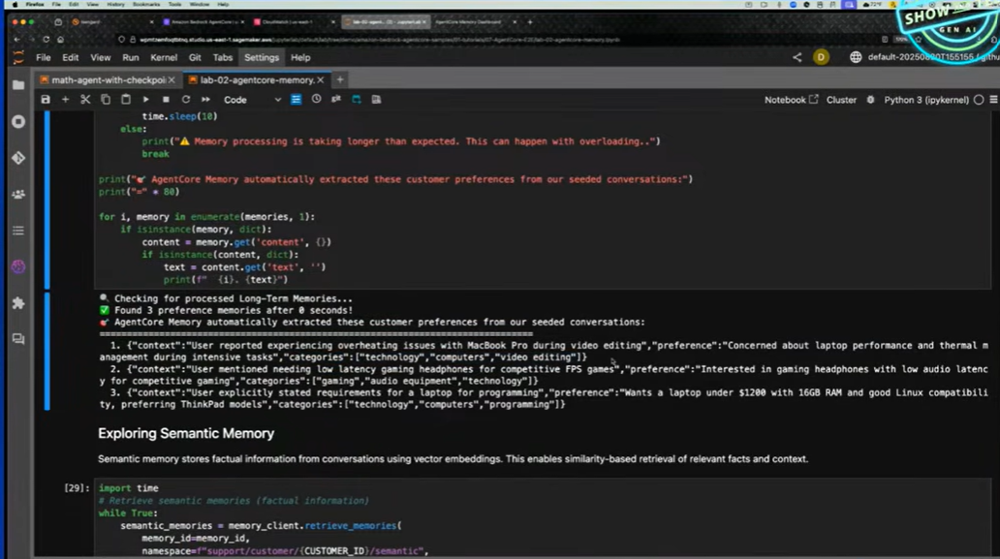

### What you are seeing

The payoff cell: `retrieve_memories` against the **preferences** namespace returns **3 extracted preference records** — concern about laptop thermal management (MacBook Pro overheating), preference for low-latency gaming headphones (competitive FPS), and a laptop budget under $1200 with 16GB RAM — then the semantic-namespace retrieval begins below.

### What the speaker explains

Akarsha: *"We created three strategies — here we retrieve from preferences via `retrieve_memories` with the namespace, filling `{actorId}` with the customer ID. Notice the extracted format: a preference, tags as categories, and the context — *why* the model extracted it — 'concern about laptop performance and thermal management during intensive tasks, because the user reported overheating issues with MacBook Pro.'"*

### Technical explanation

Two details make this production-grade:

- **Scoped retrieval** — the namespace `support/customer/{actorId}/preferences` means the query only ever sees *this* customer's records.
- **Explainability** — each record carries its extraction context, so you can audit *why* the memory exists and roll back bad ones.

### Key takeaway

> **Three raw conversations in → three clean, categorized, explainable preference records out.**

### The full file, in the code viewer

Everything from screenshots 22–27 assembled — the strategies dict, the `create_or_get_memory` call, `create_event` seeding, and the retrieval cell:

<GitHubExplorer repo="awslabs/agentcore-samples" ref="main" expanded="true" title="customer_support_memory.py — the Strands demo, all cells assembled (transcribed from the episode)" files={[
 { "path": "customer_support_memory.py", "src": "/bedrock-deepti/code/ch8/customer_support_memory.py", "label": "customer_support_memory.py", "highlights": [[28, 53], [73, 79]], "note": "Transcribed from the on-screen notebook — the three strategy definitions and the create_event call are fully visible; blocks that scrolled off are marked with comments." }
]} />

---

## 8.23 The Console View — Strategies & Observability

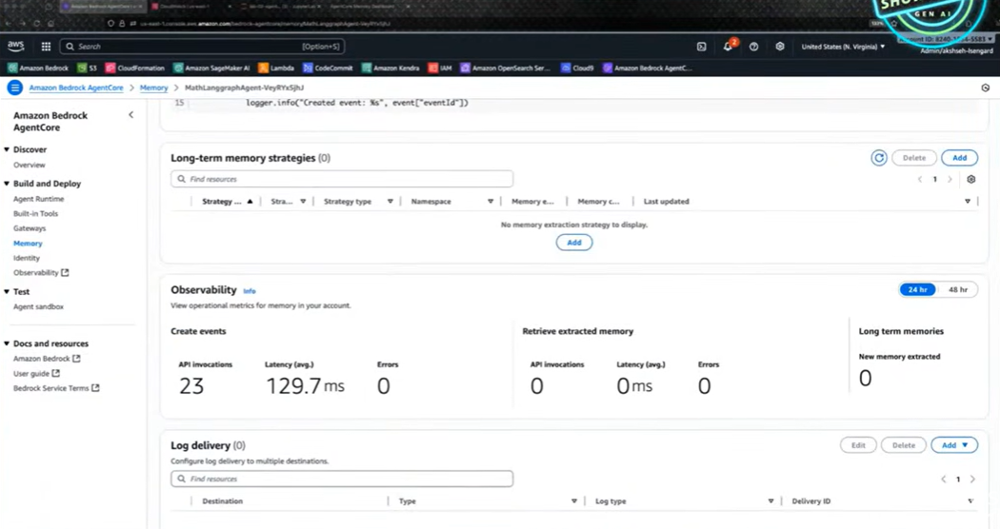

### What you are seeing

The AgentCore console's Memory view for the `MathLangraphAgent-VeyRYx5jhJ` resource: the **long-term memory strategies** section (empty here — the checkpointing demo uses short-term only), **observability** metrics (Create events: 23 invocations, ~130 ms avg latency, 0 errors; long-term counters at 0), and **log delivery** configuration.

### What the speaker explains

Mani, summarizing: *"We shared the memory browser — viewers can change the namespace and experiment themselves. Provide the memory ID, actor ID, session ID and you can inspect everything."*

### Why it matters

The console view confirms the managed-service story: the same resource you created with two lines of code shows up with metrics, log delivery, and strategy management — observability you didn't have to build.

### Key takeaway

> **Every memory resource is observable out of the box — invocations, latency, errors, and log delivery in the console.**

<Conversation title="The Episode, As a Conversation" speakers={[{"id":"learner","name":"You","role":"Learner","side":"left","color":"#3b82f6"},{"id":"mani","name":"Mani","role":"Principal GenAI SA","side":"right","color":"#f97316"},{"id":"akarsha","name":"Akarsha","role":"GenAI Data Scientist","side":"right","color":"#a855f7"}]} messages={[{"who":"learner","text":"Models handle millions of tokens now — why do we even need a memory layer?"},{"who":"akarsha","text":"Three reasons: wrong context misdirects the model, cost scales with tokens, and caching only helps for repetition. Most agent failures today are context failures, not model failures."},{"who":"learner","text":"So what does AgentCore Memory actually give me?"},{"who":"mani","text":"Two stores. Short-term memory is the raw scratchpad — messages, tool calls, blobs, checkpoints, scoped by actor + session + branch. Long-term memory is a vector store of extracted facts, preferences and summaries that survives across sessions."},{"who":"learner","text":"How do facts get from one to the other?"},{"who":"akarsha","text":"An async extraction module runs after k messages or x seconds idle — it extracts per strategy, then consolidates against existing records: add, update or skip. The travel agent example — 'camping in April, beach in October' becomes one updated preference, not two contradictory ones."},{"who":"learner","text":"And in code?"},{"who":"mani","text":"Two lines for LangGraph — swap in AgentCoreMemorySaver as the checkpointer. Or the full pipeline: create_or_get_memory once, create_event for each turn, retrieve_memories per namespace. Just remember — memory creation is one-time; afterwards you only pass the memory ID."}]} />

## 🧠 Knowledge Check

<Quiz question="What are the two layers of AgentCore Memory?" options={["RAM and disk cache","Short-term raw events and long-term extracted records","Session storage and cookies","Vector store and SQL database"]} answerIndex={1} explanation="Short-term stores raw events (messages, blobs, checkpoints) synchronously per session; long-term stores extracted records (facts, preferences, summaries) in a vector store across sessions." />

<Quiz question="Which three built-in long-term strategies ship with AgentCore Memory?" options={["Cache, index, search","Semantic, user preferences, and summary","Read, write, delete","Encrypt, compress, archive"]} answerIndex={1} explanation="Semantic captures facts, user preferences captures what the user likes, and summary produces one rolling summary per session — plus an override option for custom extraction/consolidation prompts and model." />

<Quiz question="A user liked camping in April but prefers beach vacations in October. What does the consolidation step do?" options={["Stores both as separate records","Deletes the April record","Updates the existing record — keeping the richer, merged context","Skips the new information"]} answerIndex={2} explanation="Consolidation retrieves similar memories from the vector store and can ADD, UPDATE, or SKIP — here it updates so the record reflects the full evolution rather than two contradictory facts." />

<Quiz question="In the LangGraph checkpointing demo, what do thread_id and actor_id map to?" options={["process_id and user_id","session_id and actor_id in AgentCore Memory","namespace and strategy","event_id and branch_id"]} answerIndex={1} explanation="config.configurable.thread_id maps to the AgentCore session_id; actor_id maps directly to actor_id — both required at runtime." />

<Quiz question="Do you need to create the memory resource every time the agent initializes?" options={["Yes, every run","No — create it once, then pass the existing memory ID","Only on Mondays","Only in production"]} answerIndex={1} explanation="'99% of questions' — the create_or_get helper exists precisely so you create once and reuse the memory ID (store it in an env var or SSM parameter)." />

<Quiz question="Which event payloads feed the long-term extraction pipeline?" options={["All blob payloads","Only events with timestamps","Conversational events (user/assistant/tool messages) — blobs are checkpoint/session-state storage only","Only user messages"]} answerIndex={2} explanation="Conversational events enrich long-term memory; blob events (checkpoints, session state) are stored and retrievable but never extracted as insights." />

## 🏁 Chapter 8 Summary

| Concept | What it is | Key detail |
|---|---|---|
| **Short-term memory** | Raw events — the agent's scratchpad | actor_id + session_id + branch; TTL 7–365 days; listEvents |
| **Long-term memory** | Extracted records in a vector store | semantic / preferences / summary strategies; namespaces scope per user |
| **Extraction module** | Async pipeline: extract → consolidate → embed & index | runs after k messages or x idle seconds; ADD/UPDATE/SKIP |
| **Branching** | Parallel conversation paths in one session | multi-agent separation (flights vs hotels branches) |
| **Checkpointing demo** | `AgentCoreMemorySaver` as LangGraph checkpointer | thread_id→session_id; blob events; get_state_history |
| **Customer-support demo** | Strands agent + 3 strategies + seeded history | create_event → ~20s → retrieve_memories per namespace |

## 🔗 Official AWS Resources

- 📖 [What is Amazon Bedrock AgentCore?](https://docs.aws.amazon.com/bedrock-agentcore/latest/devguide/what-is-bedrock-agentcore.html) — the service dev guide
- 🧪 [AgentCore Samples — Memory tutorials](https://github.com/awslabs/agentcore-samples/tree/main/01-tutorials/04-AgentCore-memory) — official hands-on notebooks
- 📝 [AgentCore Memory: Building Context-Aware Agents](https://aws.amazon.com/blogs/machine-learning/amazon-bedrock-agentcore-memory-building-context-aware-agents/) — the launch blog
- 🐍 [Bedrock AgentCore Python SDK](https://github.com/aws/bedrock-agentcore-sdk-python) — `MemoryClient`, `create_or_get_memory`, `create_event`, `retrieve_memories`
- 🧰 [Starter Toolkit — Memory operations](https://github.com/aws/bedrock-agentcore-starter-toolkit/blob/main/src/bedrock_agentcore_starter_toolkit/operations/memory/README.md) — `MemoryManager` used in demo 2

### 🎬 Watch the Original Episode

<VideoSection youtubeId="-N4v6-kJgwA" title="AgentCore Memory Deep Dive | AWS Show & Tell — the source episode for this chapter" />
