# AWS Bedrock Course — Chapter 9

*Amazon Bedrock AgentCore is Generally Available — the enterprise features added since preview (PrivateLink/VPC, IaC, tagging, 9 regions), Runtime's new A2A support, Memory custom strategies, Gateway MCP targets, and two full demos: a Kiro-built translator agent and a production-grade customer-support assistant running entirely inside a VPC.*

# 🚀 AgentCore Is Generally Available — The GA Deep Dive

> *"We launched AgentCore back in July at the New York Summit. The response has been amazing — yesterday we hit our GA milestone."* — Mark Roy

This episode (AWS Show & Tell, hosted by **Anil Ladinti** with **Mark Roy** (WW Tech Lead, Agentic AI), **Maira Ladeira Tanke** (WW Tech Lead, GenAI Agents) and **Eashan Kaushik** (Specialist SA, GenAI)) is the **General Availability deep dive**. The first half covers everything that shipped between the July preview and GA — enterprise networking, IaC, observability, A2A, memory strategies, gateway targets. The second half is pure show-and-tell: a zero-code translator agent built by the **AgentCore MCP server inside Kiro**, then a **full production customer-support agent** with CI/CD, CloudFormation, VPC isolation, Cognito identity and CloudWatch observability.

## 🎬 What This Chapter Covers

By the end of this chapter you will be able to:

- 🚪 Explain **prototype purgatory** — why agents stall between laptop demo and production
- 🏢 List the **GA enterprise features** — VPC + PrivateLink, infrastructure as code, tagging, and the expanded 9-region footprint
- ⚙️ Describe **Runtime's new capabilities** — native A2A (agent card + JSON-RPC), automatic IAM role creation, stop-session API, header propagation, configurable lifetimes, and MCP-server hosting
- 🧠 List **Memory's GA additions** — self-managed custom strategies, batch hydration APIs, native framework integrations, metadata filtering
- 🔌 Explain **Gateway's new targets** — MCP server as a target type and IAM for inbound authorization
- 🤖 Follow **two demos** — the Kiro MCP-server-built French→Portuguese translator, and the VPC customer-support assistant (Aurora + DynamoDB + Gateway + Identity)
- 🔭 Read the **GenAI Observability dashboards** — sessions, traces, token usage, per-span latency, gateway metrics

**Episode covered:** the full video — *"Amazon Bedrock AgentCore is Generally Available | AWS Show & Tell."*

---

## 9.1 Welcome — Meet Mark, Maira & Eashan

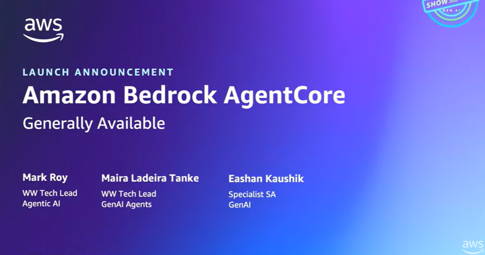

### What you are seeing

The launch-announcement title card. Host **Anil Ladinti** (senior solutions architect, enterprise customers) is joined by three members of the Agentic AI team — the same crew that built and shipped the service.

### What the speaker explains

Anil: *"We have a very special episode — it's AgentCore general availability, and we want to cover a whole lot of details. We have packed demos."* — Mark Roy jokes about the pace: *"Now with agent years, every few days is a full agent year."*

### Key takeaway

> **Three months from preview to GA** — and the gap between them is where all the enterprise hardening happened.

---

## 9.2 Prototype Purgatory — the Problem AgentCore Solves

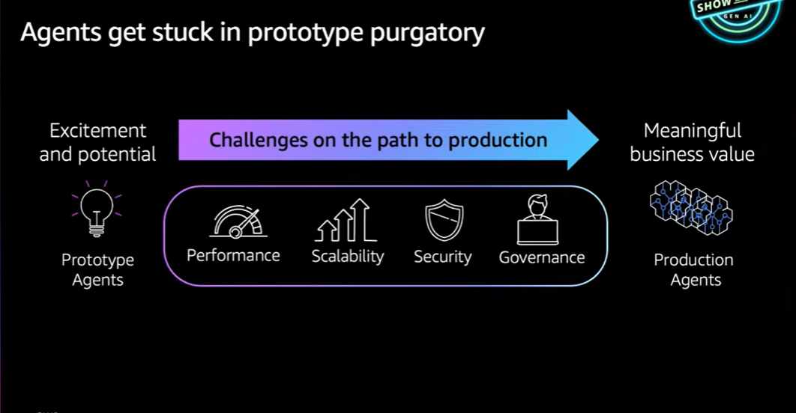

### What you are seeing

The problem slide: agents built on laptops that never reach production — trapped by the operational requirements enterprises actually need.

### What the speaker explains

Mark: *"Customers are getting trapped in prototype purgatory. Agents are living on laptops — no real business value because of all of the challenges."* — the historical parallel: *"Just like with the introduction of the cloud back in 2006, customers needed enterprise scale, enterprise security, enterprise time-to-value. With agents we need the same exact thing."*

### Technical explanation

The four pillars that make AgentCore *"a comprehensive agentic platform"*:

- **Build it the way you want** — pick your agent framework, pick your model, pick your protocols. *"We're open to using OTel for observability — meeting customers where they're at."* (Transcript note: ASR renders "OTel"/"hotel" — it means **OpenTelemetry**.)
- **Enterprise-level security** — *"you can't trust your agents unless you've got security figured out."*
- **Speed + scale + security together** — *"that's what our customers have been demanding."*

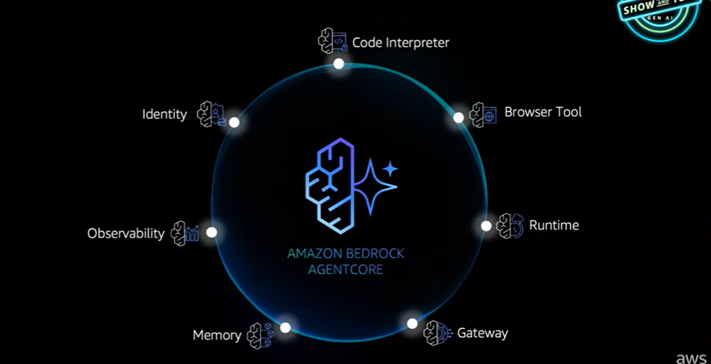

The services wheel above is the platform at a glance — every primitive around Runtime is independently consumable (you'll hear that again in §9.20).

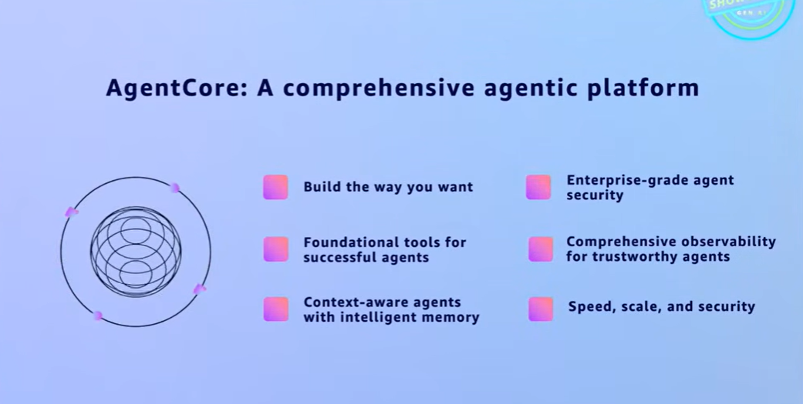

### Key takeaway

> **AgentCore's pitch: keep your framework, your model, your protocols — get enterprise plumbing in return.**

---

## 9.3 Enterprise Readiness — What GA Added

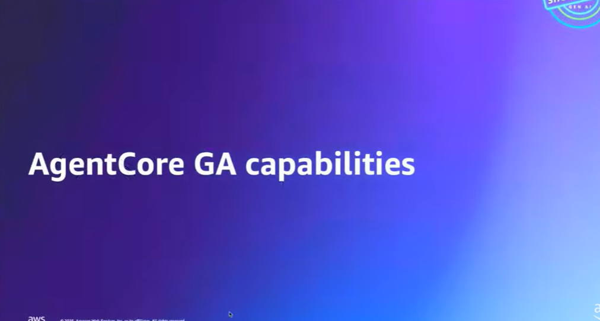

### What the speaker explains

Mark: *"The biggest focus has been introducing all the things you would expect with a GA platform — and for enterprises that tends to be more and more security."*

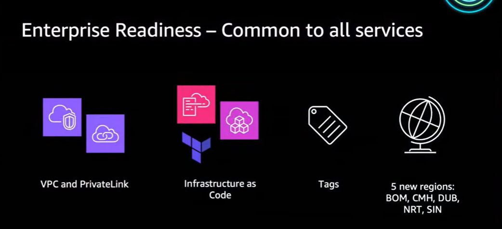

### What you are seeing

Four platform-wide additions that apply to **every** AgentCore service — not just Runtime.

### Technical explanation

| GA feature | What it means |
|---|---|
| **VPC + PrivateLink** | *"You can run all of your agents in a fully secure environment"* — traffic never crosses the public internet |
| **Infrastructure as code** | *"Repeatable deployments, repeatable creation of agents, gateways and so forth — just like any of your traditional workloads"* — CloudFormation today, CDK/Terraform samples coming |
| **Tagging** | *"Which teams are spending on which components — associate tags with all of your agent resources and manage them effectively"* — cost allocation per team/BU |
| **9 regions** | Expanded from the initial 4 — the five additions on the slide: **Mumbai (BOM), Columbus (CMH), Dublin (DUB), Tokyo (NRT), Singapore (SIN)** |

### Why it matters

These aren't features you demo — they're features that decide whether a security review says *yes*. VPC support alone is the difference between "interesting prototype" and "approved workload" for most enterprises.

### Key takeaway

> **GA = the boring stuff that makes production possible: private networking, repeatable infra, cost attribution, global footprint.**

---

## 9.4 AgentCore Runtime — New Since Preview


### What you are seeing

Six Runtime additions shipped between the July preview and GA.

### What the speaker explains

Mark calls Runtime *"the most fundamental part of the platform — the piece that really emphasizes bring-your-own agent framework, bring your agent code, pick your model — a secure, scalable, fully managed way to host your agents."*

Then the new features:

- **Automatic IAM role creation** — *"giving it least-privilege access to only the pieces that you need"* — the Starter Toolkit does it for you.
- **Stop-session API** — *"if you want to tightly manage your agents, make sure they're not going too far, we've got APIs for that."*
- **Configurable max lifetime + idle runtime** — you decide how long an agent may run.
- **Custom header propagation** — two wins: **identity-aware authorization** (*"when you call your agent, the agent knows who's calling"*) and a hook into per-user logging and per-user memory.
- **CodeBuild integration** on the Starter Toolkit — managed container builds without local Docker.

### Technical explanation — the spectrum

Maira nails the design intent: *"I love how easy it is to get started but also how much flexibility you get. It's the full spectrum — get your IAM role created automatically, enterprise-grade security — then you want to move to production, have a CI/CD pipeline, infrastructure as code… you can build up incrementally."*

And Runtime hosts **more than agents**: *"we also let you make your own MCP servers and host those using Runtime — same long-running workloads, large payloads."*

### Key takeaway

> **Runtime's GA story: same two-lines-of-code start, now with the controls enterprises need — stop sessions, bound lifetimes, propagate identity, host MCP servers.**

---

## 9.5 A2A — Native Agent-to-Agent Support

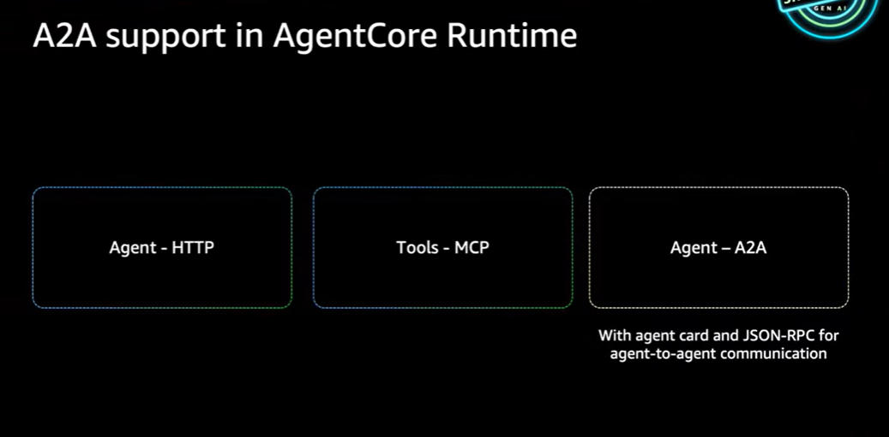

### What you are seeing

Runtime's protocol triptych: agents invoke over **HTTP**, tools connect over **MCP** — and now agents talk to *each other* over **A2A**.

### What the speaker explains

Mark: *"You've asked for A2A support and that's one of our big deliverables for GA."* — Maira on the mechanics: *"Native A2A capability — built-in agent card support, agent-to-agent communication with JSON-RPC. You can really easily take your A2A code, host it in Runtime, get all the benefits of AgentCore Runtime for those workloads, and get your interoperability."*

### Technical explanation

| Protocol | Connects | AgentCore role |
|---|---|---|
| **HTTP** | app → agent | the standard invocation path |
| **MCP** | agent → tools | hosted targets via Gateway or local/co-deployed servers |
| **A2A** | agent → agent | native support: **agent card** discovery + **JSON-RPC** messaging |

### Why it matters

A2A is the interoperability bet: a LangGraph agent built by one team can call a Strands agent built by another — same runtime, same observability, same identity story. Maira returns to this in the recap: *"one team loves LangGraph, another loves Strands, a third is a fan of CrewAI — deploy all of them on Runtime and use A2A to combine them."*

### Key takeaway

> **Agent card = discoverable identity. JSON-RPC = the wire format. Runtime = the managed host for both sides.**

---

## 9.6 AgentCore Memory — New Since Preview

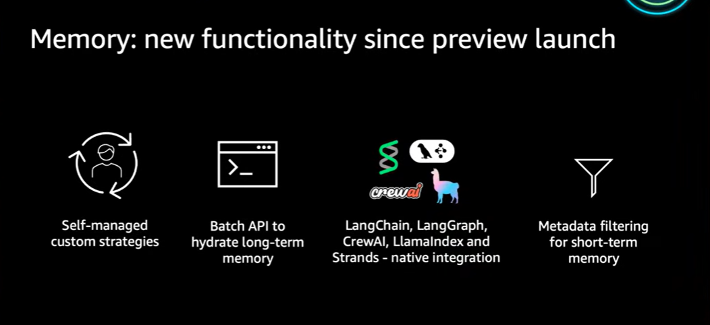

### What you are seeing

Four Memory additions on top of the Chapter-8 foundations (short-term events + the three built-in strategies).

### What the speaker explains

Mark: *"We've got fully managed short-term and long-term memory — you've asked for customizations. Now you have a fully customizable self-managed strategy. We give you built-in ones for session summaries and user preferences; if you've got your own ideas — or want migrations from other memory platforms — that's doable with custom strategies and the batch APIs to inject long-term memory."*

The integration ask: *"You want these as easy as possible to integrate with your agent framework — we've taken care of that with LangChain, LangGraph and more. And we've got metadata filtering for short-term memory."*

### Technical explanation

| GA addition | What it unlocks |
|---|---|
| **Self-managed custom strategies** | your own extraction + consolidation prompts/logic — or migrate an existing memory platform's semantics |
| **Batch API** | bulk-hydrate long-term memory (e.g. seeding years of customer history before go-live) |
| **Native framework integrations** | LangChain, LangGraph, CrewAI, LlamaIndex, Strands — memory plugs into the framework, not around it |
| **Metadata filtering (short-term)** | query events by metadata instead of paging raw history |

### Key takeaway

> **Chapter 8 gave you managed memory; GA gives you *your* memory — custom strategies, bulk hydration, framework-native.**

---

## 9.7 AgentCore Gateway — MCP Server Targets & IAM Inbound Auth

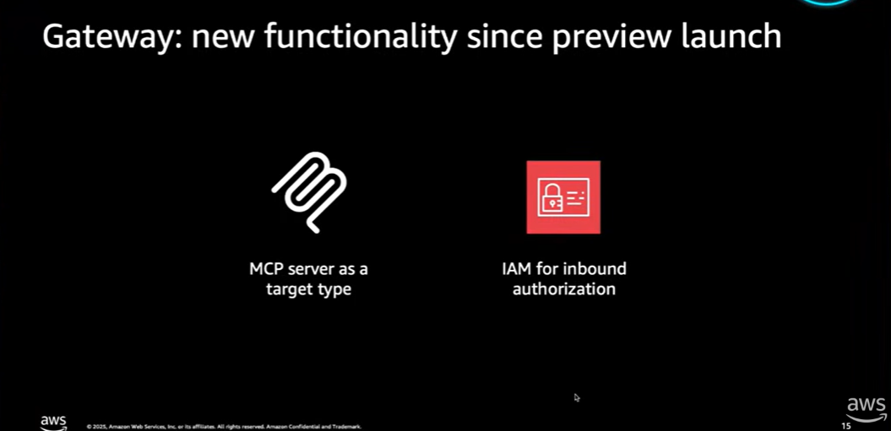

### What you are seeing

Two Gateway additions — one new target type, one new auth option.

### What the speaker explains

Mark: *"AgentCore Gateway takes all of your existing APIs and tools and exposes them as MCP — they plug right into your coding assistants, plug right into your agents. We heard you loud and clear: you wanted **MCP server as a new target type**. Now you can create gateways that add OpenAPI REST services, Lambda and existing MCP servers all within the same gateway — full security benefits, full search benefits."*

The auth ask: *"A lot of our enterprise customers have a huge investment in IAM. Although MCP has OAuth as a standard protocol, they also wanted to support MCP using IAM authorization — we've got you covered."*

### Technical explanation

| Gateway capability | Before GA | At GA |
|---|---|---|
| Target types | Lambda, OpenAPI/REST, Smithy | **+ existing MCP servers** (a gateway can front another MCP server) |
| Inbound auth | OAuth 2.0 / JWT | **+ IAM SigV4** — reuse existing AWS credentials and policies |

### Why it matters

MCP-as-target makes Gateway an **aggregator**, not just a converter — one endpoint, one auth story, one searchable tool catalog across REST, Lambda and native MCP. IAM inbound means enterprise platform teams don't have to stand up an OAuth provider just to call a tool.

### Key takeaway

> **One gateway, three target kinds, two auth modes — that's the enterprise tool-catalog story.**

---

## 9.8 MCP Servers for Your Coding Assistant

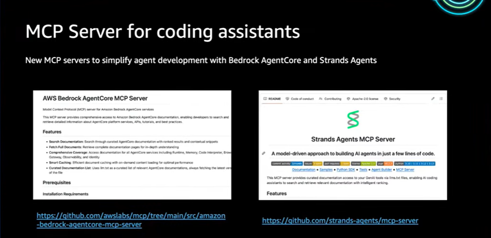

### What you are seeing

The two doc-serving MCP servers the team built so your **coding assistant** knows AgentCore and Strands without you pasting docs into prompts.

### What the speaker explains

Mark: *"We wanted to make it even easier to get started — with Strands agents, with AgentCore, and with any agent framework. So we've got a new MCP server — just drag it into whatever coding assistant you're using, and it knows about AgentCore."* — Maira: *"Even though we don't remember all the launches — they're coming every day — our MCP server does."*

### Technical explanation

These aren't agent tools — they're **developer tools**. The MCP server serves curated AgentCore documentation (search + fetch full docs) to your IDE assistant, so `ask Kiro to make this agent AgentCore-ready` produces correct, current code — as the next section demonstrates live.

| MCP server | Repo | Serves |
|---|---|---|
| **AWS Bedrock AgentCore MCP Server** | `awslabs/mcp` → `src/amazon-bedrock-agentcore-mcp-server` | AgentCore docs: Runtime, Memory, Gateway, Identity, Observability, tutorials, API refs |
| **Strands Agents MCP Server** | `strands-agents/mcp-server` | Strands SDK docs + `llms.txt` curated sources |

### Key takeaway

> **The docs MCP server is the cheat code — your assistant writes AgentCore-correct code because it reads the docs itself.**

---

## 9.9 From Prompt to Deployed Agent — the Kiro Translator

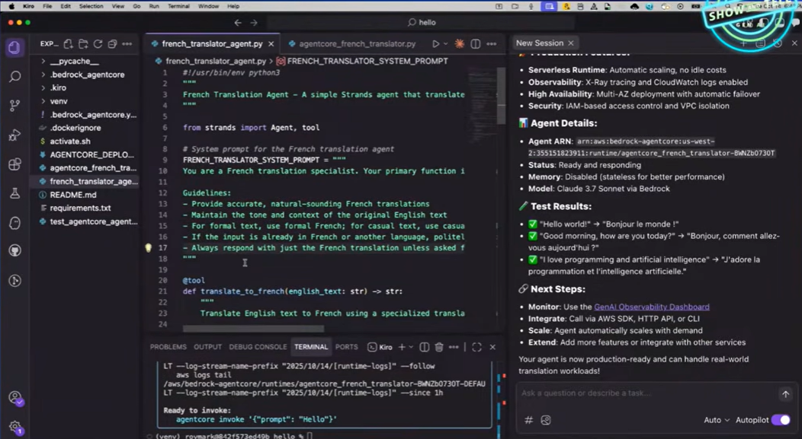

### What you are seeing

Mark's Kiro workspace: a Strands agent (`french_translator_agent.py`) on the left, and the AgentCore starter-toolkit's local test UI on the right — the `agentcore` CLI already invoked successfully.

### What the speaker explains

Mark sets up: *"Kiro is AWS's coding assistant — like Claude Code, Cursor, and more. I've added the Strands agents MCP server, and our MCP server for AgentCore — you can just pop that right in."* — the build: *"About a half hour ago I asked Kiro to make me a simple Strands agent to do English-to-French translations. It did that for me."*

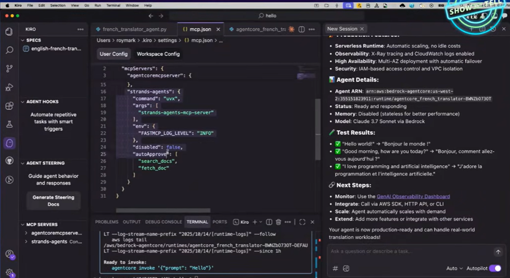

The `mcp.json` above is the entire setup: two stdio MCP servers, doc-search tools auto-approved.

### Technical explanation — local first, then cloud

The local test: typing *"hi there"* into the CLI-built agent returns *"Salut!"* (screenshot below). Then the money move: *"I asked Kiro — take that simple Strands agent and make it ready for AgentCore. It looked up all the information about AgentCore and figured out that all it really needs is two lines of code — a decorator to make an entry point, and run the app."*

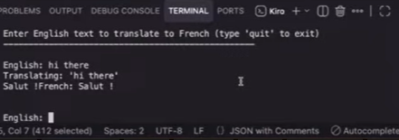

Those two lines are the whole `BedrockAgentCoreApp` contract you saw in Chapter 4:

```python
from bedrock_agentcore.runtime import BedrockAgentCoreApp

app = BedrockAgentCoreApp()

@app.entrypoint
def invoke(payload):
 # your agent logic here — return the response
 ...

app.run()
```

*"It was able to automatically configure the app, deploy it to the cloud, and then we can run that here."* — the punchline: *"All of this — I didn't write a single line of code."*

### Key takeaway

> **MCP-server-powered IDE + `agentcore` starter toolkit = prompt → deployed agent, with the only handwritten artifact being the prompt itself.**

---

## 9.10 Live Update — the Translator Learns Portuguese


### What you are seeing

The payoff shot: Kiro's edit summary (*"13 changes accepted"* — system prompts, function names `translate_to_french` → `translate_to_portuguese`, docs, test scripts), the redeployed agent's **Agent ARN** (`agentcore_french_translator`), and a live `agentcore invoke` returning Portuguese in the terminal.

### What the speaker explains

The live-test moment: *"Hey Kira, why not make this support Portuguese instead? … Please update it to translate to Portuguese."* The crowd waits through the live redeploy — *"this is what we get for doing a live demo"* — and near the episode's end the verdict: *"My hello world French translator learned a little Portuguese. Let's see how well it does — 'Good morning, how are you today?' … Not bad — and the latency is low."*

### Why it matters

Honest read of the demo: the update wasn't instant — live regeneration and redeploy took a few minutes, and the hosts joke about it on air. That's the point worth keeping: **the loop works end-to-end**, but agent iteration is still edit→build→deploy, not magic.

### Key takeaway

> **Prompt → French agent → deployed → prompt again → Portuguese agent redeployed — the whole iteration cycle without touching code.**

---

## 9.11 The Customer Support Assistant — a Real Production Architecture

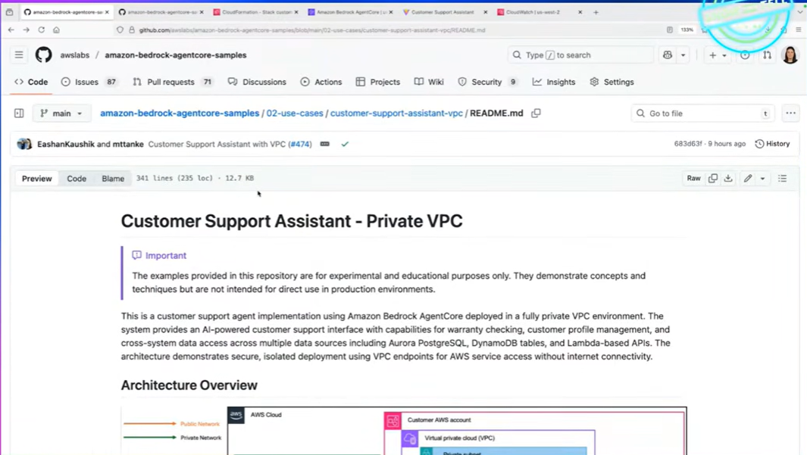

### What you are seeing

The samples repo entry for the complex demo: **Customer Support Assistant — Private VPC** under `02-use-cases`.

### What the speaker explains

Maira: *"All of these examples are available on our GitHub samples repository — quick starts and end-to-end use cases. This customer support assistant is one of my favorites that Eashan put together. We have VPC support, infrastructure as code — everything deployed with CloudFormation templates. For folks asking about CDK and Terraform — don't worry, it's also available; we just wanted to demonstrate one of them."*


### Technical explanation — the moving parts

Maira walks the diagram:

- **Agent runtime** — Strands agent *plus* a **co-deployed MCP server in the same container** (stdio transport) that can run SQL against Aurora PostgreSQL (users, products, orders)
- **Second AgentCore Runtime** — hosting a standalone **FastMCP server** for DynamoDB (reviews, products)
- **AgentCore Gateway** — exposes warranty checks and customer profiles (DynamoDB) as MCP tools
- **Everything inside the VPC** — *"runtime, everything is inside VPC, and we are using PrivateLink for the communications"*
- **CloudFormation + tagging throughout**

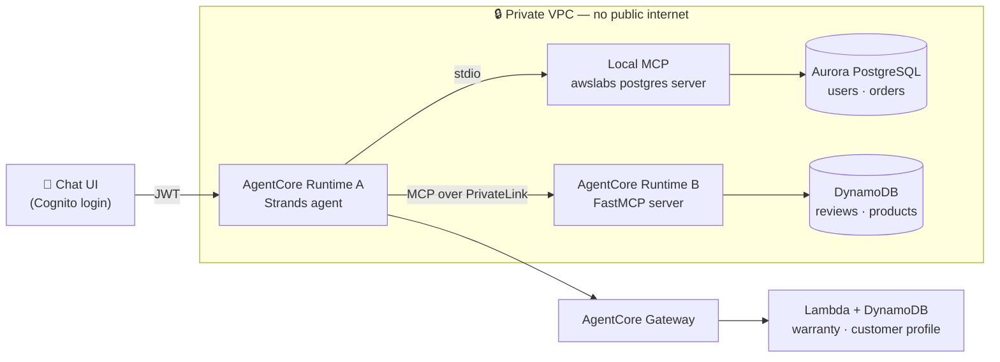
```mermaid
flowchart LR
 UI["💬 Chat UI<br/>(Cognito login)"] -->|JWT| R1["AgentCore Runtime A<br/>Strands agent"]
 subgraph VPC["🔒 Private VPC — no public internet"]
 R1 -->|stdio| M1["Local MCP<br/>awslabs postgres server"]
 M1 --> AU[("Aurora PostgreSQL<br/>users · orders")]
 R1 -->|MCP over PrivateLink| R2["AgentCore Runtime B<br/>FastMCP server"]
 R2 --> DD[("DynamoDB<br/>reviews · products")]
 end
 R1 --> GW["AgentCore Gateway"]
 GW --> L["Lambda + DynamoDB<br/>warranty · customer profile"]
```

### Why it matters

Anil asks the enterprise question: *"Why do we need all these different ways of accessing data?"* Maira's answer is the architecture lesson: *"We're talking about reusability — different teams collaborating. Warranty is super common: customer support needs it, IT support needs it — it's a tool shared between teams (that's why it's behind the Gateway). Reviews and products are more specific to this use case."* **Shared tools → Gateway. Use-case-specific tools → local/Runtime MCP.**

### Key takeaway

> **The architecture decision isn't "which tool" — it's "who else needs this tool." Shared → Gateway. Private → local or dedicated Runtime.**

---

## 9.12 The Data Layer — Three Access Patterns

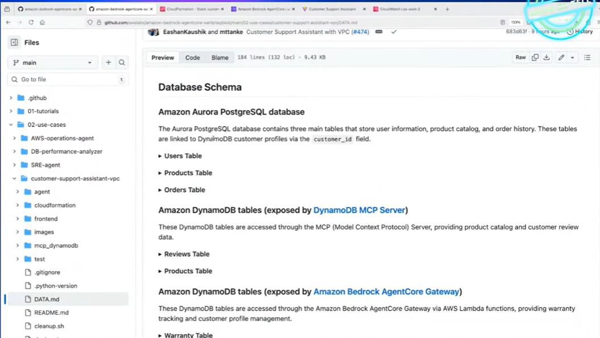

### What you are seeing

`DATA.md` — the sample's own data dictionary, mapping which store holds what and which path the agent uses to reach it.

### Technical explanation

| Data | Store | Agent reaches it via |
|---|---|---|
| Users, Orders | Aurora PostgreSQL (private subnet) | **Local MCP** — `awslabs.postgres-mcp-server`, stdio, same container |
| Reviews, Products | DynamoDB | **Runtime-hosted FastMCP** server (`mcp_dynamodb`) |
| Warranties, Customer profiles | DynamoDB | **AgentCore Gateway** target (Lambda) |

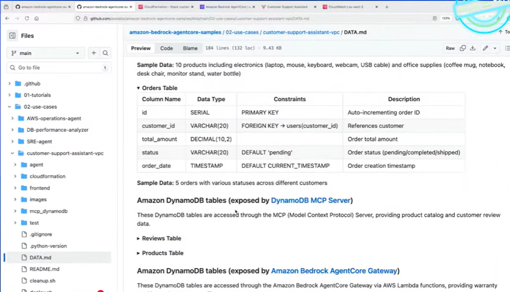

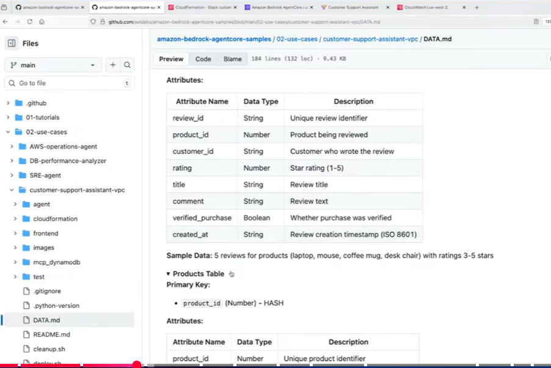

### Why it matters — the hidden teaching point

Maira leaves deliberate homework: *"We didn't expose the MCP server on the gateway — that's your homework. All the code is available; if you want to have this MCP exposed on the gateway, you can change that and build on it."* The sample is intentionally structured so you can re-route a Runtime-hosted MCP server through the Gateway's new MCP target type (§9.7).

### Key takeaway

> **One agent, three data planes — SQL via stdio MCP, NoSQL via a hosted MCP server, shared services via Gateway.**

---

## 9.13 Agent Internals — Lifespan Events & Local MCP Clients

<GitHubExplorer repo="awslabs/agentcore-samples" ref="main" expanded="true" title="customer-support-assistant-vpc/agent/main.py — MCP clients, lifespan, entrypoint" files={[
 { "path": "02-use-cases/01-conversational-agents/customer-support-assistant-vpc/agent/main.py", "label": "agent/main.py", "highlights": [[127, 182], [201, 215], [240, 277]], "note": "127–182: MCP client construction — gateway (streamable HTTP, Bearer token) + aurora (stdio postgres MCP). 201–215: the lifespan manager — yield is the serve boundary, clients are stopped on shutdown. 240–277: @app.entrypoint strands_agent_bedrock, the invocation handler." }
]} />

*Compare with the original screenshot:*

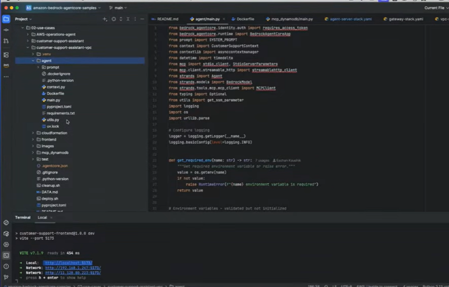

### What you are seeing

The customer-support agent's `main.py` — same skeleton as the translator (`BedrockAgentCoreApp` + `@app.entrypoint`), plus a `lifespan` block.

### What the speaker explains

Maira connects the demos: *"Mark's agent had the SDK import, the app, an entry point and run — it's the same for complex ones. You still import the AgentCore app, initiate it, mark the entry point and run."* Then asks Eashan: *"What are we doing with lifespan here?"*

Eashan: *"Lifespan events let you execute code before your server is initialized, and just before it is shut down. For example, you want to initialize connections to resources which take time — you want that to happen once. Before the server goes down you want to clean up resources or connections."* — in this sample: *"Whenever the server is initialized I create my MCP clients, start my connection; just before it shuts down I stop all of my connections."*

### Technical explanation

```python
app = BedrockAgentCoreApp()

@app.lifespan # runs once per container: init + cleanup
async def lifespan(app):
 mcp_clients = start_mcp_connections() # stdio + remote MCP clients
 yield # ← server serves invocations here
 stop_mcp_connections(mcp_clients)

@app.entrypoint
def invoke(payload, context):
 return agent(payload["prompt"])
```

Maira's framing: *"We're creating a local MCP server right inside — it depends on your code, it's flexible. You can have a bunch of different applications built with AgentCore Runtime."*

*A second zoom of the same file — the entrypoint lines from the viewer above:*

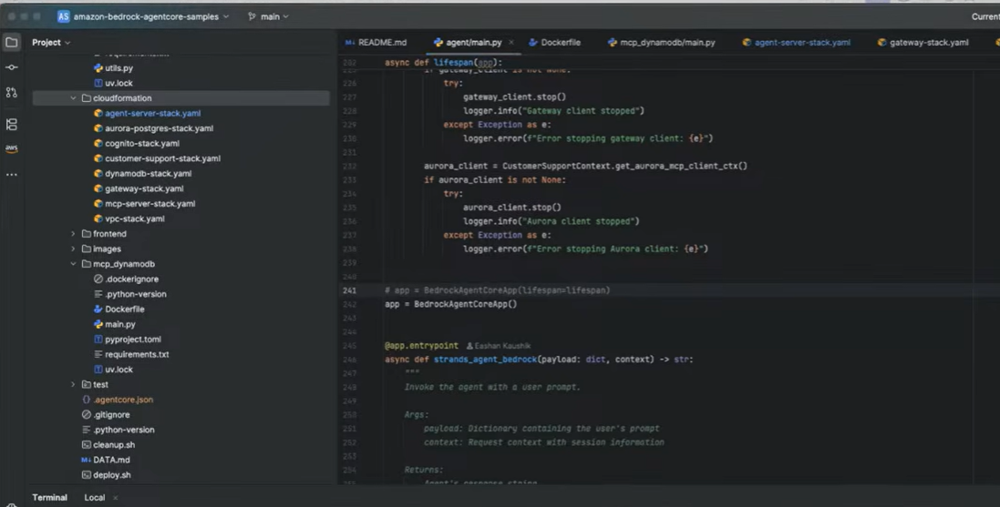

### Key takeaway

> **`lifespan` = the one-time seam: open MCP clients and load schemas at boot, close them at shutdown — invocations in between stay fast.**

---

## 9.14 Building the Container Image — VPC-Aware Tooling

<GitHubExplorer repo="awslabs/agentcore-samples" ref="main" expanded="true" title="customer-support-assistant-vpc/agent/Dockerfile — everything installed at build time" files={[
 { "path": "02-use-cases/01-conversational-agents/customer-support-assistant-vpc/agent/Dockerfile", "label": "agent/Dockerfile", "highlights": [[13, 20], [26, 28], [34, 37]], "note": "13–20: system dependencies. 26–28: requirements.txt + aws-opentelemetry-distro + awslabs-postgres-mcp-server — baked in because the VPC has no internet egress. 34–37: EXPOSE 8080/8000 and the opentelemetry-instrument CMD." }
]} />

*Compare with the original screenshot:*

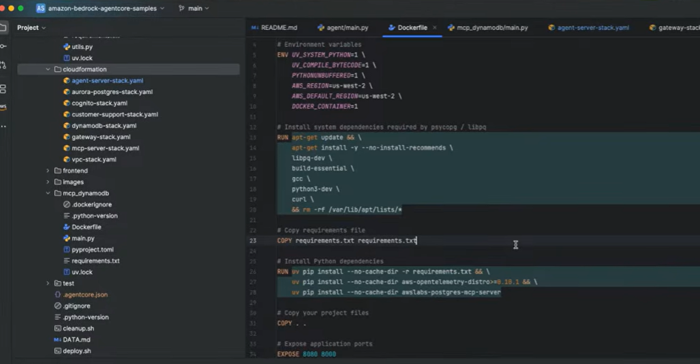

### What you are seeing

The multi-step `Dockerfile`: env vars (region `us-west-2`), `requirements.txt` (Strands SDK + tools), the **AWS OpenTelemetry distro** — *"this package alone lets me export my OTel traces to AgentCore observability"* — and `awslabs.postgres-mcp-server` installed **at image build time**.

### What the speaker explains — the VPC constraint

Eashan on why tools are baked into the image: *"Since the agent is running inside a VPC now with no internet access, I don't get to download this inside the code — I could do that using uvx, but I can't, because now it's an enterprise AgentCore Runtime. I don't have internet access. So I download it here first in the Dockerfile, then start using it inside the code."*

### Technical explanation

- **stdio transport** — the Postgres MCP server runs as a child process of the agent in the *same* container — no network hop for the hottest tool.
- **Build-time vs runtime installs** — anything fetched at runtime (uvx/pip download) fails inside a no-egress VPC; everything must arrive via the image.
- **The four ways to touch AgentCore** — basic APIs → **SDK** (abstraction) → **Starter Toolkit** (bigger abstraction, builds the image for you) → **infrastructure as code**. *"With the starter toolkit you don't need to create your Dockerfile — but when you want control, you write it yourself."*

### Key takeaway

> **Inside a PrivateLink-only VPC, the image is the supply chain — install MCP servers and the OTel distro at build, invoke over stdio at run.**

---

## 9.15 Hosting an MCP Server on Runtime — Zero Code Changes

<GitHubExplorer repo="awslabs/agentcore-samples" ref="main" expanded="true" title="customer-support-assistant-vpc/mcp_dynamodb/main.py — FastMCP + OTel middleware" files={[
 { "path": "02-use-cases/01-conversational-agents/customer-support-assistant-vpc/mcp_dynamodb/main.py", "label": "mcp_dynamodb/main.py", "highlights": [[22, 56], [58, 88], [91, 95], [99, 145]], "note": "22–56: OpenTelemetryMiddleware — spans every tool call in/out. 58–88: get_table_names resolves DynamoDB tables from SSM parameters. 91–95: FastMCP init + middleware registration. 99+: the read-only DynamoDB tools (get_reviews, get_products, …)." }
]} />

*Compare with the original screenshot:*

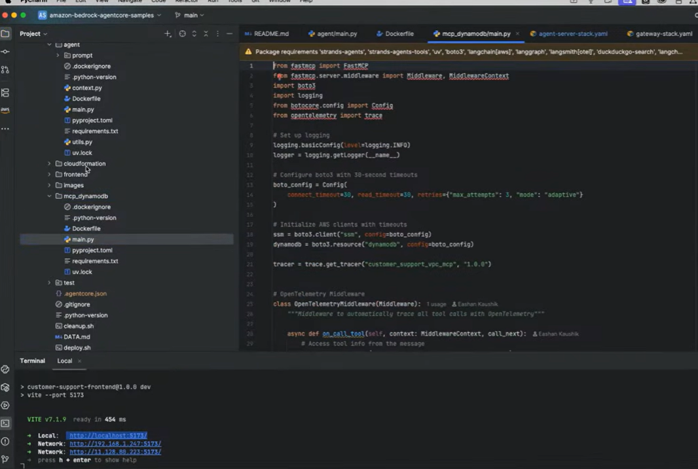

### What you are seeing

The standalone MCP server: plain **FastMCP** code — boto3 DynamoDB reads, a handful of `@mcp.tool` functions — with one addition at line ~99: a middleware that captures inbound requests and outbound responses into OTel spans.

### What the speaker explains

Eashan: *"How different is hosting an MCP server on Runtime? Not different at all. I use the FastMCP library — you must have written FastMCP code already. How do you get session isolation, enterprise-grade security and all the good stuff? Just put it into Runtime. I've not changed any line of code."*

On the middleware: *"It captures requests when they're coming in and responses when they're about to go out. All I'm doing is creating my OpenTelemetry traces so I can actually see what's going on inside my MCP server — what tool is invoked, what parameters, what responses — all part of my agent observability."*

Maira's takeaway: *"You didn't have to change any lines of code — it's your MCP server, but now on Runtime: enterprise security, scalable and available."*

*A zoom of the same file — the SSM resolution block highlighted in the viewer above:*

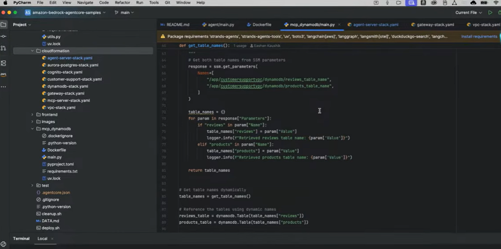

The `get_table_names` helper above is a production detail worth copying: table names come from **SSM parameters**, not hardcoded strings — the same code deploys dev/staging/prod unchanged.

### Key takeaway

> **FastMCP code → Runtime unchanged. Add an OTel middleware and your tools produce spans like a first-class service.**

---

## 9.16 Infrastructure as Code — CloudFormation for Every Component

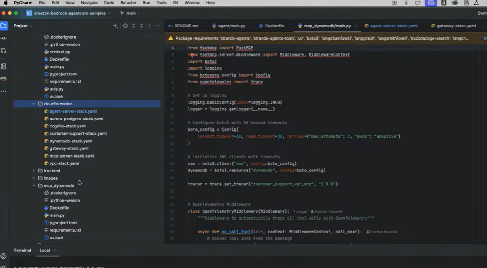

### What you are seeing

Eight purpose-scoped stacks — *"each of these stacks are repeatable… if you just want VPC, you have all the VPC setup; if you just want MCP DynamoDB, you have the MCP server stack"*.

### What the speaker explains

Maira: *"People ask if you can deploy AgentCore components as infrastructure as code — yes you can. There are new CloudFormation templates for runtime, for gateway, for AgentCore components."*

Eashan walks the runtime stack (`agent-server-stack.yaml`, screenshot below):

- **`AWS::BedrockAgentCore::Runtime` resource** — container image from ECR
- **Execution role** — *"lets me execute code inside my runtime with certain privileges — query DynamoDB, Secrets Manager, AgentCore Identity"*
- **VPC config** — security group + subnet that can reach the private Aurora instance *"without passing the public internet"*
- **Authorization configuration** — custom JWT via **Cognito OAuth 2.0** for inbound auth (*"you can use IAM if you want — here I'm using Cognito"*)
- **Environment variables** — model ID (`sonnet 4`), region, MCP ARN, provider ARN, Aurora secret ARN
- **Tags** — *"great for cost — dev, production, test environments. Definitely recommend tagging all the way."*

<GitHubExplorer repo="awslabs/agentcore-samples" ref="main" expanded="true" title="customer-support-assistant-vpc/cloudformation/agent-server-stack.yaml — the AgentRuntime resource" files={[
 { "path": "02-use-cases/01-conversational-agents/customer-support-assistant-vpc/cloudformation/agent-server-stack.yaml", "label": "agent-server-stack.yaml", "highlights": [[852, 882]], "note": "852+: AWS::BedrockAgentCore::Runtime — DependsOn CodeBuildTrigger (the CI/CD hook), NetworkMode VPC with security groups/subnets, ECR ContainerUri, CustomJWTAuthorizer (Cognito user pool + allowed clients), and MODEL_ID/MCP_* environment variables." }
]} />

*Compare with the original screenshot:*

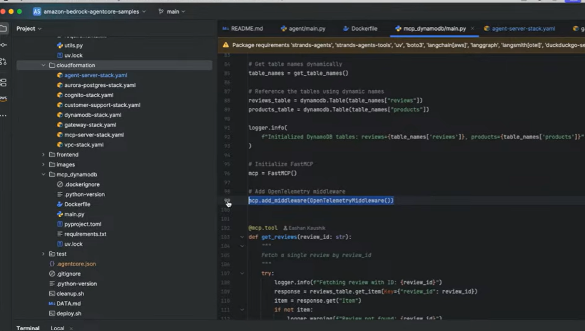

### Technical explanation — the pipeline

The CI/CD loop: *"All of this is through GitHub. Whatever is on GitHub, my CodeBuild takes, builds, puts into ECR, builds my runtime."* — trigger: *"I just push to my GitHub repository — that triggers a new version of my agent on AgentCore Runtime."* — Maira: *"That's production readiness."*

<GitHubExplorer repo="awslabs/agentcore-samples" ref="main" expanded="true" title="customer-support-assistant-vpc/deploy.sh — one script, eight stacks" files={[
 { "path": "02-use-cases/01-conversational-agents/customer-support-assistant-vpc/deploy.sh", "label": "deploy.sh", "highlights": [[23, 26], [178, 210]], "note": "23–26: the only knobs — MODEL_ID (Claude Haiku 4.5), REGION (us-west-2), admin email/password for the Cognito user. 178–210: deploy_stack() — uploads templates to the S3 bucket, validates required params, then deploys the nested CloudFormation stack." }
]} />

*Compare with the original screenshot:*

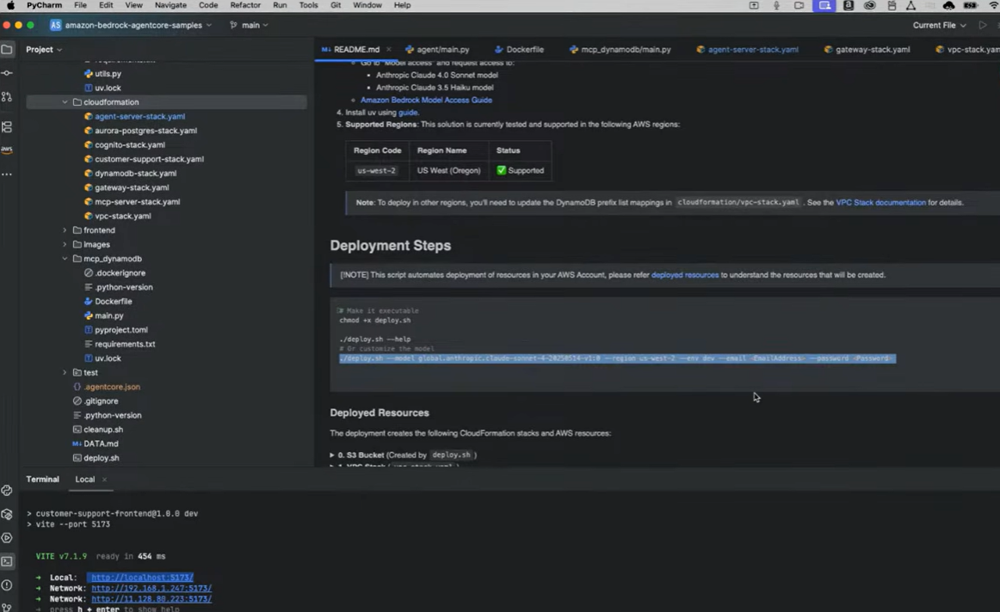

One `deploy.sh` rolls out all eight stacks end-to-end; the README documents per-stack and full deploys, testing hooks for the agent and gateway individually.

### Key takeaway

> **`git push` → CodeBuild → ECR → new Runtime version — the same pipeline muscle memory as any enterprise workload.**

---

## 9.17 Console Tour — Stacks, Runtime, Identity, and the Cognito Login

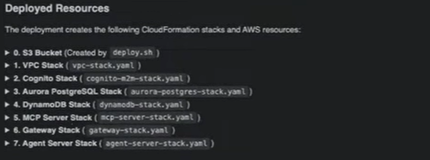

### What you are seeing

Maira in the AWS console: *"Here are all the CloudFormation templates that have been deployed — I already deployed this because it takes a bit to get everything running."* Eight nested stacks, all `CREATE_COMPLETE`.

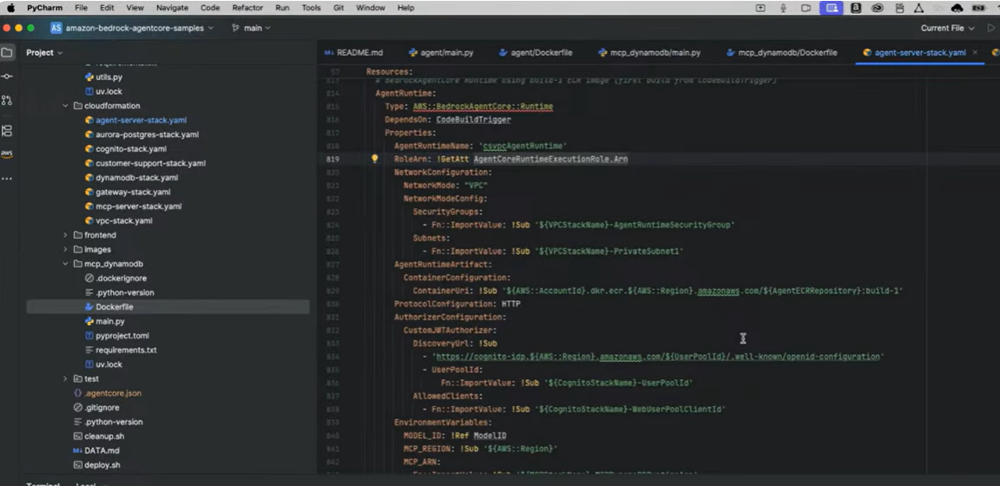

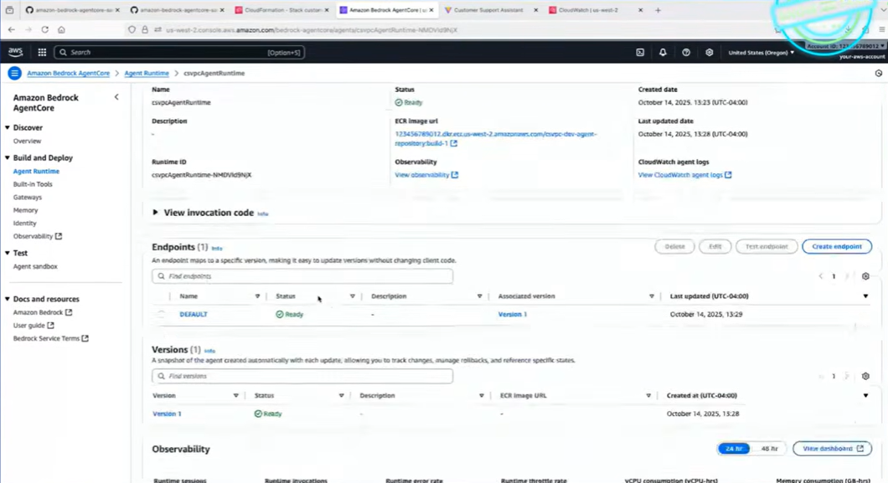

### What the speaker explains

On the runtime: *"Here's our customer support agent — I've enabled logging, enabled tracing, all of this by default. We've got a bunch of tagging as well. You can see your CloudWatch logs, your endpoints — all deployed for you."* — *"then we have our gateway — deploying our gateway, our target as a Lambda function that checks warranties, also logs enabled. And we have our identity providers — identity for our MCP server and for the gateway."*

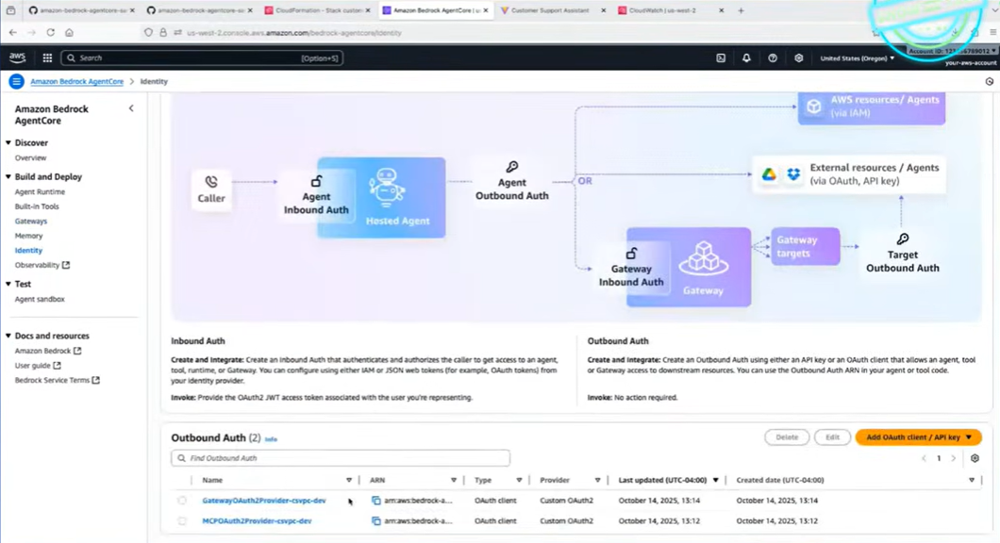

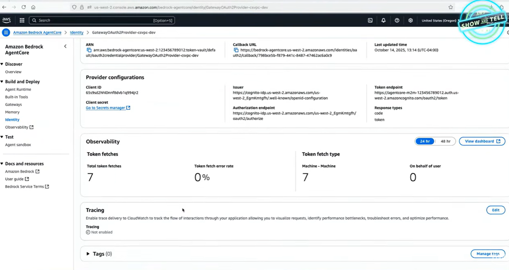

### Technical explanation — the auth chain

The demo starts with real auth: *"We've integrated identity, so we get Cognito to work here, and I need to create a token — I'm going to log in to my Cognito user."* The chat UI's login screen below is Cognito's hosted UI — the JWT it returns is what the Runtime's `customJWTAuthorizer` validates on every invoke.

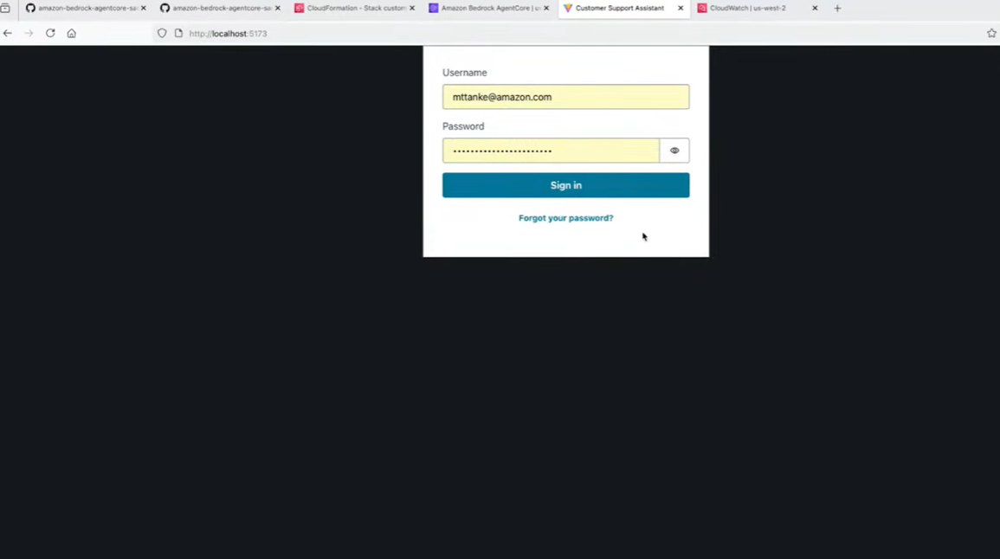

### Key takeaway

> **Inbound = Cognito JWT at the Runtime door. Outbound = AgentCore Identity's OAuth2 credential providers vending tokens to Gateway and MCP.**

---

## 9.18 Live Queries — the Agent in Action

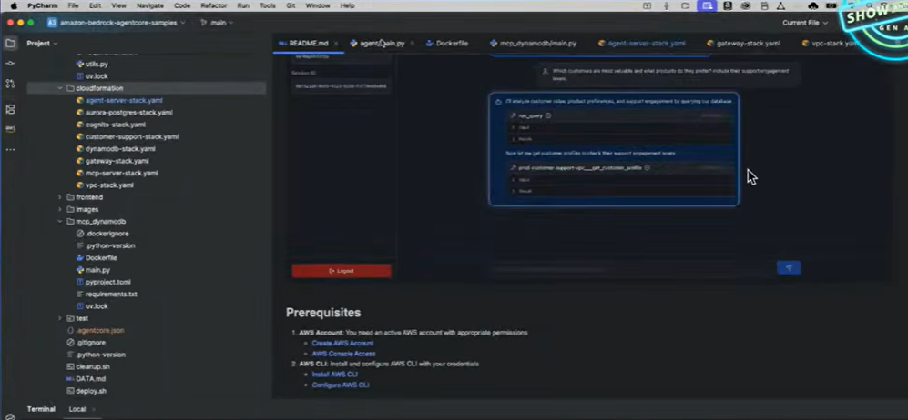

### What the speaker explains

First real query: *"Get a complete profile of a customer with customer ID, including their purchase history and details."* The trace shows the plan: **gateway** `get_customer_profile` → **local MCP** `run_query` for orders. — Eashan: *"A lot of the time everyone talks about how to do text-to-SQL — just with that MCP server installed in the Dockerfile, we're able to do text-to-SQL: converting language into SQL queries and executing them."*

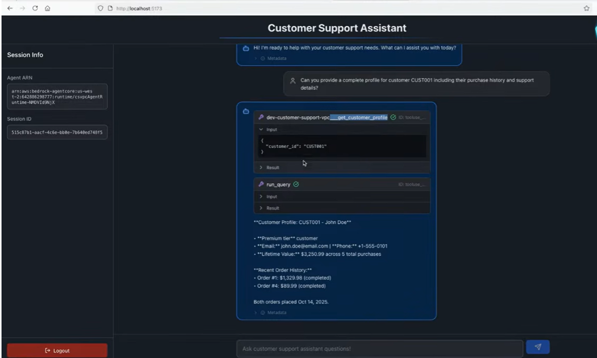

### Technical explanation — a harder query

The multi-tool query: *"customer reviews, inventory status and warranty information for this laptop's serial number."* The agent fans out — warranty via Gateway → reviews via the DynamoDB MCP → product/inventory via text-to-SQL where no dedicated tool exists (: *"we don't have APIs exactly mapping to the products table, but we do have text-to-SQL"*). — Anil spots it: *"It looked like those tools were being executed in parallel"* — *"for a few of them, yes."*

Metadata on the UI: *"you can see how many tokens it consumed — great for debugging."*

The schema trick behind the good SQL: *"My MCP server exposes `get_schema` as a tool. Using Strands, I load the schema of my Aurora database during the lifespan — so my agent is aware of what the schemas look like. That's why it writes the query once and gets a great response — it's not redoing it."*

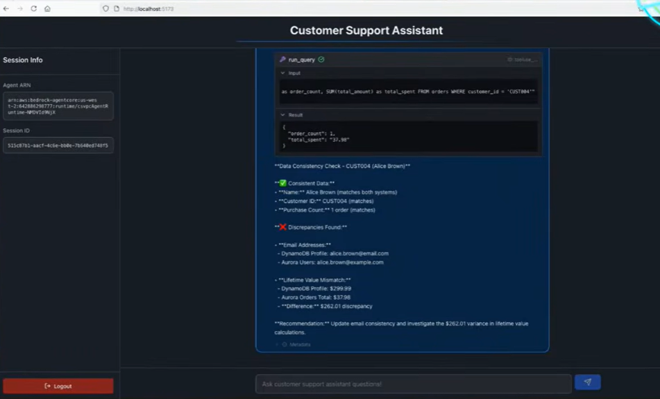

### The unexpected win — data-quality agent

The discrepancy query: *"Let's see if our agent is smart enough to find discrepancies in the database."* It is — comparing the users table against the customer profile it surfaces **two different emails and a mismatched lifetime value** for the same customer. *"Your agent can help you debug the quality of your data and find those kinds of issues."*

### Key takeaway

> **Schema-loaded-into-lifespan + text-to-SQL = one-shot correct queries; agents that cross-check systems find data bugs you'd never write a test for.**

---

## 9.19 Observability — the GenAI Dashboards in CloudWatch

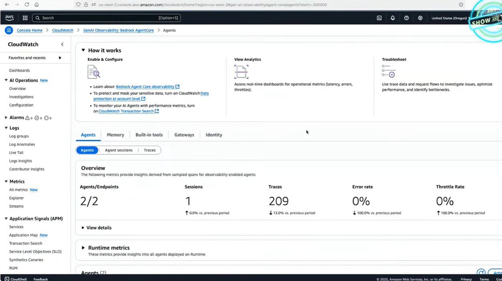

### What you are seeing

The **GenAI Observability** dashboards — *"we just ran a bunch of queries for the last five minutes; let's take a look"*. Agents overview: sessions, traces, error and throttle rates at a glance.

### What the speaker explains

*"We got a bunch of traces because everything is a trace. Two agent endpoints, our sessions, our different traces, our different agents — you can deep dive into the AgentCore one and get latency, token usage, errors, throttling."*

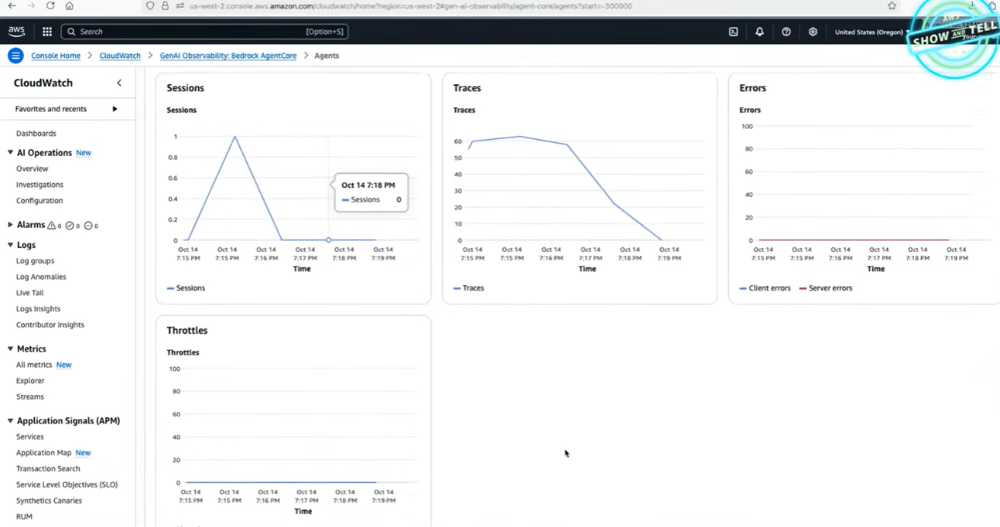

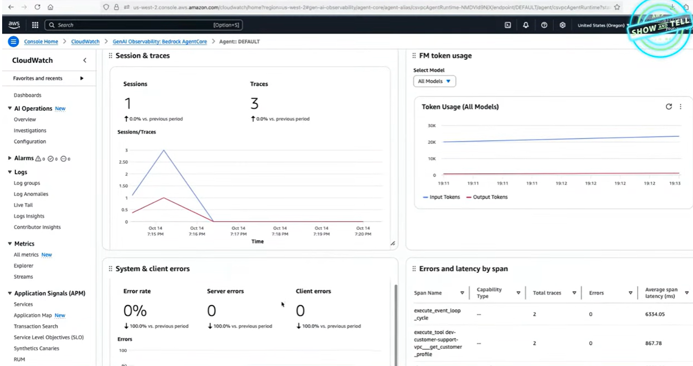

### Technical explanation — read the spans

The per-span table is where production debugging lives: `execute_event_loop_cycle` ≈ **6.3 s** end-to-end while `execute_tool … get_customer_profile` ≈ **868 ms** — most latency is model reasoning, not tool calls. That's the kind of decomposition impossible without OTel-instrumented runtimes.

And it's not just agents: *"you can also get information about a gateway — here we got two invocations, latency, all available on our observability capabilities."*

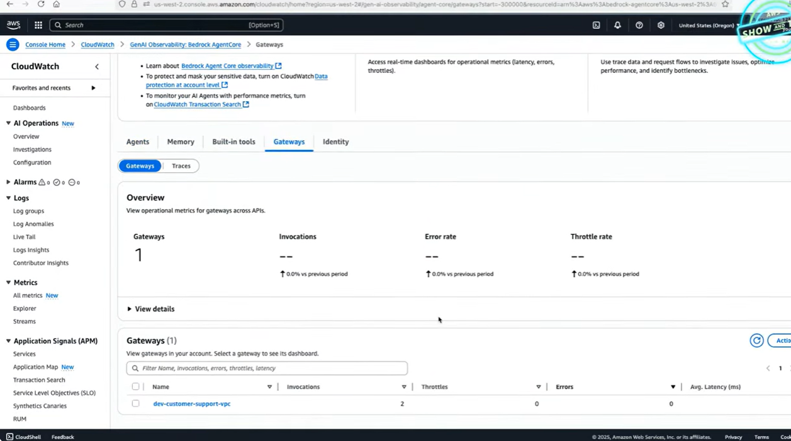

The S3/export question answered on air: *"You can have a log group on CloudWatch with all of your OTel logs saved there — with that you can export it to any third-party tool you want. We have samples on GitHub for third-party integration."*

### Key takeaway

> **One dashboard covers agents, memory, tools, gateways and identity — sessions, traces, spans, tokens, errors, throttles — and OTel export means your existing APM stack stays in the loop.**

---

## 9.20 The Full Picture — Platform Recap

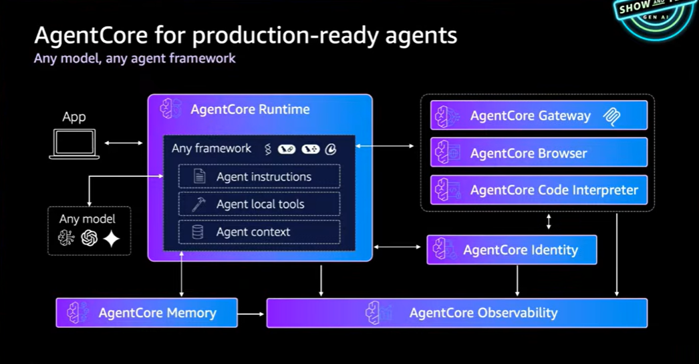

### What the speaker explains

Mark's recap: *"You're giving your agent builders the opportunity to go with whatever they've got — LangGraph, CrewAI, Strands, OpenAI agents — define your own instructions, use your own tools, host that in AgentCore Runtime."*

- **Memory** — *"make your agent more personalized by taking all those events and summarizing them — the next time they come back you take advantage of what happened in the past."*
- **Observability** — *"everything underpinned by traces, sessions, spans, metrics — end to end across agents, MCP servers, gateways, identity, memory."*
- **Identity** — *"one of the truly most difficult problems: agent identities, agent workloads, inbound authorization from users, outbound authorization to tools. Flexibly letting you use your IdPs — Ping, Okta, Microsoft Entra — plus third-party credential providers like Slack, Jira, Salesforce, ServiceNow."*
- **Gateway** — *"making every available resource more easily exposed as MCP."*

### Technical explanation — adopt à la carte

Maira: *"You can use all of it together or each piece individually. Today's demo had Runtime, Gateway, Identity — we didn't add Memory. We could have — it would make the customer support better — but we chose not to."* And multi-tenancy: separate tool catalogs per tenant via **Gateway**, tenancy context via **custom headers**, per-user memory via **actor IDs**.

### The honest number

Eashan on how long the whole VPC demo took to build: *"Two to three days. Most of the time I spent on the front end and managing my data — with AgentCore I could sit back, relax, and focus on what actually mattered: system prompts, are tools responding correctly, is my data correct."*

### Key takeaway

> **Eight primitives, one platform — take the whole stack or only the pieces you need. Even 'production-grade VPC + IaC + identity + observability' is a two-to-three-day build.**

---

## 9.21 Keep Building — the Resource Map

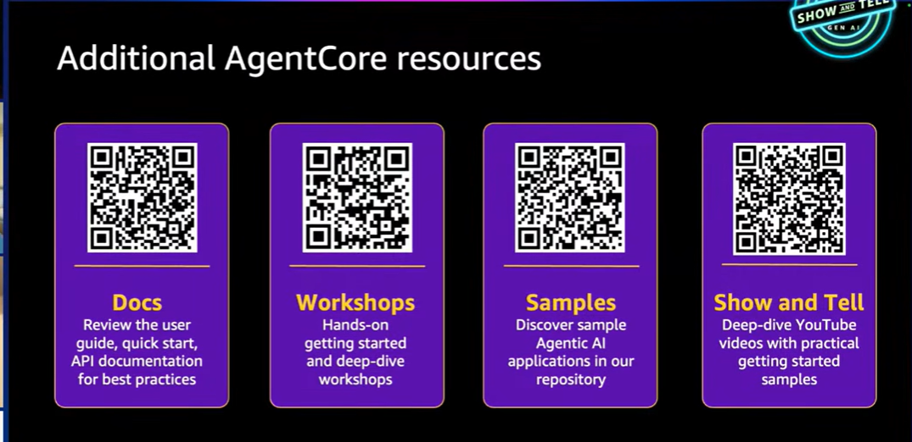

### What the speaker explains

Mark closes with the path in:

- **Docs** — *"quick starts where within five minutes you can have something fully running with Runtime, Gateway, Memory — and under 15 minutes an end-to-end example in your environment."*
- **Workshops** — *"used by many thousands of builders in just the last couple of months — a getting-started workshop and a deep-dive workshop."*
- **Samples repo** — *"tutorials, end-to-end examples, integrations — star it; we're adding more."* (Including multi-agent collaboration examples — LangGraph + Strands together.)
- **This series** — deep-dives on Runtime, Gateway, Memory, and more coming (A2A, observability, multi-agents).

<Conversation title="The Episode, As a Conversation" speakers={[{"id":"learner","name":"You","role":"Learner","side":"left","color":"#3b82f6"},{"id":"mark","name":"Mark","role":"WW Tech Lead, Agentic AI","side":"right","color":"#f97316"},{"id":"maira","name":"Maira","role":"WW Tech Lead, GenAI Agents","side":"right","color":"#a855f7"},{"id":"eashan","name":"Eashan","role":"Specialist SA, GenAI","side":"right","color":"#22c55e"}]} messages={[{"who":"learner","text":"What actually changed between the July preview and GA?"},{"who":"mark","text":"Enterprise readiness, everywhere. VPC and PrivateLink across all services, infrastructure as code, tagging for cost allocation, and we expanded from four regions to nine."},{"who":"learner","text":"And inside the services?"},{"who":"maira","text":"Runtime got native A2A — agent cards and JSON-RPC — plus auto IAM role creation, a stop-session API, header propagation and configurable lifetimes. Memory gained self-managed custom strategies, batch hydration and framework integrations. Gateway now accepts MCP servers as targets and IAM for inbound auth."},{"who":"learner","text":"The big demo had tools in three different places. Why?"},{"who":"eashan","text":"Placement follows reuse. The Aurora SQL MCP is co-deployed with the agent over stdio — fast and use-case-specific. The DynamoDB MCP runs on its own Runtime as an independent service. Warranty and customer profile are shared across teams, so they sit behind the Gateway."},{"who":"learner","text":"How hard is all of that to build?"},{"who":"eashan","text":"Two to three days for the whole VPC + IaC + identity + observability demo — most of it spent on the frontend and the data. AgentCore let me focus on what mattered: prompts, tools and data quality."}]} />

## 🧠 Knowledge Check

<Quiz question="Which GA feature lets AgentCore traffic avoid the public internet entirely?" options={["Custom header propagation","VPC + PrivateLink support","The stop-session API","Metadata filtering"]} answerIndex={1} explanation="GA added VPC + PrivateLink across all AgentCore services — agents, gateways and tools can communicate entirely inside your private network (the customer-support demo runs this way)." />

<Quiz question="What do A2A's two building blocks in AgentCore Runtime do?" options={["Agent card advertises the agent's capabilities; JSON-RPC carries the messages","Agent card stores memory; JSON-RPC encrypts traffic","Agent card is the IAM role; JSON-RPC is the MCP transport","Agent card is a Docker image; JSON-RPC is a log format"]} answerIndex={0} explanation="Native A2A support gives hosted agents a built-in agent card for discovery/capability description and JSON-RPC for agent-to-agent messaging — so agents on different frameworks interoperate inside Runtime." />

<Quiz question="In the customer-support demo, why is the warranty tool behind the Gateway while the SQL tool runs as a local MCP?" options={["Gateway is faster","Warranty is a shared tool reused by multiple teams (IT support, claims); the SQL tool is specific to this agent","DynamoDB can only be reached via Gateway","Local MCP only supports SQL"]} answerIndex={1} explanation="Maira's enterprise rule of thumb: tools shared across teams use-cases go behind the Gateway (reusability + governance); use-case-specific tools stay local/co-deployed." />

<Quiz question="Why are MCP server dependencies installed in the Dockerfile rather than fetched at runtime in this demo?" options={["It makes the image smaller","The runtime has a private VPC with no internet egress — uvx/pip downloads would fail","Docker can't run pip at runtime","FastMCP requires build-time installs"]} answerIndex={1} explanation="Inside the PrivateLink-only VPC there is no internet access, so everything the agent needs (postgres MCP server, OTel distro, requirements) is baked into the image at build time." />

<Quiz question="What did the agent need to produce correct one-shot text-to-SQL queries?" options={["Few-shot examples in the prompt","The Aurora schema loaded into Strands during the lifespan init","A fine-tuned SQL model","A dedicated SQL tool per table"]} answerIndex={1} explanation="The postgres MCP server exposes get_schema; the agent loads the full schema at startup (lifespan), so it writes the right query the first time instead of exploratory round-trips." />

<Quiz question="Which signals does the GenAI Observability dashboard expose per agent?" options={["Only error counts","Sessions, traces, token usage, error/throttle rates, and per-span latency","Only token usage","Only CloudWatch logs"]} answerIndex={1} explanation="The CloudWatch GenAI Observability view shows sessions, traces, FM token usage (input/output), error and throttle rates, and per-span latency (e.g. event-loop vs tool call) — plus equivalent views for gateways." />

## 🧪 Practical Lab — Rebuild the Architecture, Piece by Piece

### Goal

Reproduce the chapter's two demos conceptually: a starter-toolkit translator agent, then the layered customer-support architecture.

### Steps

1. **Install the pieces** — `pip install bedrock-agentcore-starter-toolkit`, add the `amazon-bedrock-agentcore-mcp-server` to your coding assistant's `mcp.json` (shown in §9.8–9.9).
2. **Generate the agent** — prompt your assistant: *"Create a Strands agent that translates English to French, then make it AgentCore-ready."* Verify it adds `BedrockAgentCoreApp`, `@app.entrypoint`, and `app.run()`.
3. **Deploy & invoke** — `agentcore configure` → `agentcore launch` → `agentcore invoke '{"prompt":"hello"}'`. Confirm the returned translation and note the agent ARN.
4. **Iterate live** — prompt *"update it to translate to Portuguese instead"*; redeploy and re-invoke. Observe which files the assistant changes.
5. **Map the big architecture** — sketch the customer-support layout from §9.11: Runtime A (agent + local MCP) → Aurora; Runtime B (FastMCP) → DynamoDB; Gateway → warranty/profile Lambda targets.
6. **Decide tool placement** — for each tool, justify shared-vs-local: which tools belong behind the Gateway (cross-team reuse) and which stay co-deployed.
7. **Add lifespan** — add MCP client init/cleanup + schema loading to a lifespan handler (§9.13) and explain why one-shot SQL follows.
8. **Inspect observability** — open the CloudWatch GenAI Observability dashboard; find sessions, traces, and the per-span latency table (§9.19). Identify which span dominates end-to-end latency.

### Success criteria

- The translator deploys and answers through `agentcore invoke`.
- You can explain why warranty goes through Gateway but SQL stays local.
- You can name at least 4 GA additions since preview (VPC/PrivateLink, IaC, A2A, custom memory strategies, MCP gateway targets, IAM inbound auth, stop-session, tagging).

## 🎤 Interview Preparation

### Q: What does "prototype purgatory" mean, and how does AgentCore address it?

**Answer**: Agents demoed on laptops that never reach production because they lack enterprise scale, security and operability. AgentCore addresses it as a platform: managed Runtime, VPC + PrivateLink, IaC, tagging, identity, observability — the same requirements cloud solved in 2006, applied to agents.

### Q: What shipped between the July preview and GA for AgentCore Runtime?

**Answer**: Native A2A support (agent card + JSON-RPC), automatic least-privilege IAM role creation in the Starter Toolkit, a stop-session API, configurable max lifetime and idle timeouts, custom header propagation (identity-aware invocations), CodeBuild integration, and the ability to host MCP servers — not just agents — on Runtime.

### Q: Explain the three data-access patterns in the customer-support demo and when to choose each.

**Answer**: (1) Local/co-deployed MCP over stdio — low-latency, use-case-specific tools (Aurora SQL). (2) MCP server hosted on its own Runtime — an independently scaled, shared tool service (DynamoDB reviews/products). (3) Gateway targets — cross-team shared services needing one auth story and discoverability (warranty, customer profile). Choose by reuse scope and isolation needs.

### Q: Your agent must reach an Aurora instance in a private subnet with no internet egress. What three things must change versus a public deployment?

**Answer**: Put the Runtime inside the VPC with security groups/subnets that can reach Aurora; bake all tool dependencies into the container image (no runtime downloads); route AgentCore control/data traffic over PrivateLink interface endpoints instead of public endpoints.

### Q: What is the lifespan handler in BedrockAgentCoreApp for? Give two concrete uses from the demo.

**Answer**: Code that runs once at container initialization and once before shutdown. Uses shown: opening/closing MCP client connections, and loading the Aurora schema into the Strands agent so text-to-SQL is accurate on the first attempt.

### Q: How does AgentCore Memory's GA release extend the built-in strategies?

**Answer**: Self-managed custom strategies (your own extraction/consolidation logic or migrations from other memory platforms), a batch API to hydrate long-term memory, native framework integrations (LangChain, LangGraph, CrewAI, LlamaIndex, Strands), and metadata filtering on short-term memory.

### Q: A stakeholder asks: "Can we authenticate to our MCP tools with IAM instead of standing up an OAuth provider?" Answer with the GA feature.

**Answer**: Yes — AgentCore Gateway added IAM for inbound authorization at GA. Gateways still support OAuth 2.0/JWT, but enterprises with deep IAM investment can authorize MCP calls with SigV4 credentials and IAM policies.

### Q: The demo agent found inconsistent customer data across two stores. Explain how, and what design decision enabled it.

**Answer**: Given tools spanning Aurora (users/orders via local MCP SQL) and DynamoDB (profiles via Gateway), the agent cross-referenced the same customer ID across both systems and surfaced mismatched email/lifetime-value fields. The enabling decision: broad, composable tool access — the agent could query both data planes in one reasoning loop rather than a fixed pipeline.

### Q: How would you debug "agent answers are slow" in this architecture?

**Answer**: Open the GenAI Observability dashboard → per-span latency. In the demo, `execute_event_loop_cycle` was ~6.3 s while `get_customer_profile` was ~868 ms — meaning latency is dominated by model reasoning, not tools. If a tool span dominated, you'd optimize that tool (stdio co-deployment, indexing). Everything is a trace; OTel logs can also export to third-party APM via CloudWatch log groups.

### Q: What's the recommended way to go from prompt to deployed agent fastest, and what are its limits?

**Answer**: Starter Toolkit + the AgentCore MCP server inside a coding assistant — the demo produced and deployed a working agent with zero hand-written code. Limits: for complex apps (custom Dockerfiles, VPC placement, multi-service topologies) you drop down to the SDK or IaC — the demo's customer-support agent uses CloudFormation + a custom image + CI/CD for exactly that reason.

## 🏁 Chapter 9 Summary

| Concept | What it is | Key detail |
|---|---|---|
| **GA milestone** | AgentCore generally available ~3 months after the July preview | focus: enterprise security + operability |
| **Enterprise readiness** | VPC + PrivateLink, IaC, tagging, 9 regions | applies to *all* AgentCore services |
| **Runtime new** | A2A native, auto IAM roles, stop-session, header propagation, lifetimes, CodeBuild | hosts agents **and** MCP servers |
| **Memory new** | custom strategies, batch hydration, framework integrations, metadata filtering | builds on Ch.8 short/long-term model |
| **Gateway new** | MCP server target type + IAM inbound auth | one gateway aggregating REST + Lambda + MCP |
| **Dev-tools MCP** | AgentCore + Strands doc servers for coding assistants | powers prompt→deployed-agent workflows |
| **Kiro demo** | translator agent with zero hand-written code | `BedrockAgentCoreApp` + `@app.entrypoint` + `app.run()` |
| **VPC demo** | customer-support assistant: Runtime×2 + local MCP + Gateway + Cognito + Aurora + DynamoDB | 8 CloudFormation stacks; ~2–3 days to build |
| **Lifespan** | init/cleanup seam (MCP clients, schema load) | enables one-shot text-to-SQL |
| **Observability** | CloudWatch GenAI dashboards: sessions, traces, tokens, per-span latency; OTel export | `execute_event_loop_cycle` vs tool spans |

## 🔗 Official AWS Resources

- 📰 [Amazon Bedrock AgentCore is now Generally Available](https://aws.amazon.com/blogs/machine-learning/amazon-bedrock-agentcore-is-now-generally-available/) — the GA launch blog
- 🐍 [bedrock-agentcore-sdk-python](https://github.com/aws/bedrock-agentcore-sdk-python) — `BedrockAgentCoreApp`, `@app.entrypoint`, `lifespan`
- 🧰 [bedrock-agentcore-starter-toolkit](https://github.com/aws/bedrock-agentcore-starter-toolkit) — `agentcore configure/launch/invoke`, auto IAM roles, CodeBuild integration
- 🧪 [awslabs/agentcore-samples](https://github.com/awslabs/agentcore-samples) — quick starts + the `customer-support-assistant-vpc` use case from this chapter
- 🔌 [awslabs/mcp — amazon-bedrock-agentcore-mcp-server](https://github.com/awslabs/mcp/tree/main/src/amazon-bedrock-agentcore-mcp-server) — docs MCP server for coding assistants
- 🧬 [strands-agents/mcp-server](https://github.com/strands-agents/mcp-server) — Strands docs MCP server

### 🎬 Watch the Original Episode

<VideoSection youtubeId="WyGK8UcAxKo" title="Amazon Bedrock AgentCore is Generally Available | AWS Show & Tell — the source episode for this chapter" />
