# AWS Bedrock Course — Chapter 10

*Amazon Bedrock AgentCore Observability — the deep dive on tracing, debugging and monitoring agents in production: OpenTelemetry auto-instrumentation, Transaction Search, the GenAI Observability dashboards, distributed tracing across runtimes and frameworks, baggage propagation, PII masking, custom spans, latency analysis and CloudWatch alarms.*

# 🔭 AgentCore Observability — Monitor & Debug AI Agents in Production

> *"When agents become complex at production scale, you need to understand what the agent is doing — not just that it returned an answer."* — Anil Ninti

This episode (AWS Show & Tell, hosted by **Anil Ninti** from Princeton, New Jersey with **Pete Alfonso** near AWS HQ2 in Washington, DC) brings in two observability specialists — **Rajes** (AgentCore) and **Madu** (observability/GenAI specialist) — to walk through **AgentCore Observability**: why agent observability is different from classic APM, how it is built entirely on **OpenTelemetry** open standards, how to instrument a local agent in minutes, and how one trace ID stitches together a multi-agent system spanning three runtimes and two frameworks.

## 🎬 What This Chapter Covers

By the end of this chapter you will be able to:

- 🎯 Explain **why agents need observability** — non-deterministic behavior, hidden reasoning loops, tool-call chains
- 📊 Describe the **three telemetry sources** AgentCore collects — agent/framework spans, service-emitted telemetry (Runtime, Memory, Gateway), and custom metrics
- 🔧 **Instrument any agent** — ADOT auto-instrumentation, the environment variables, and CloudWatch Transaction Search
- 🧩 Read a **trace** — trace ID, span hierarchy, baggage, and how context propagates across HTTP/gRPC/Kafka boundaries
- 🛡️ Protect sensitive data — **CloudWatch data protection policies** and **Bedrock Guardrails** for PII masking
- 🌐 Trace **multi-agent, multi-runtime, multi-framework** systems — Strands orchestrator + LangGraph sub-agent in one trace
- 📈 Turn telemetry into action — **CloudWatch metrics, custom dashboards, alarms, and Logs Insights** on the `aws/spans` log group
- ✅ Connect observability to **AgentCore Evaluations** — automated quality scoring built on the same data

**Episode timeline covered:** the full video — *"AgentCore Observability: Monitor and debug AI Agents with OpenTelemetry | AWS Show & Tell."*

---

## 10.1 Welcome — Meet the Observability Specialists

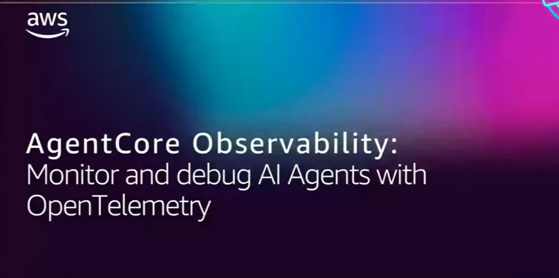

### What you are seeing

The episode title card. Host **Anil Ninti** opens from Princeton, New Jersey, with **Pete Alfonso** joining from near AWS HQ2. The guests are **Rajes** (AgentCore observability specialist) and **Madu** (GenAI observability specialist) — the engineers behind what you're about to see.

### What the speaker explains

Anil frames the entire episode around one idea: agents become genuinely complex at production scale — chained model calls, tool invocations, memory reads, gateway hops — and operators need visibility into **what the agent is doing**, not just the final answer. This session covers what AgentCore Observability is, why it matters, how to set it up, and a deep dive into the OpenTelemetry mechanics underneath.

### Key takeaway

> **This is the observability episode — the "how do I know what my agent is doing" answer, from the team that built it.**

---

## 10.2 Why Agent Observability Matters

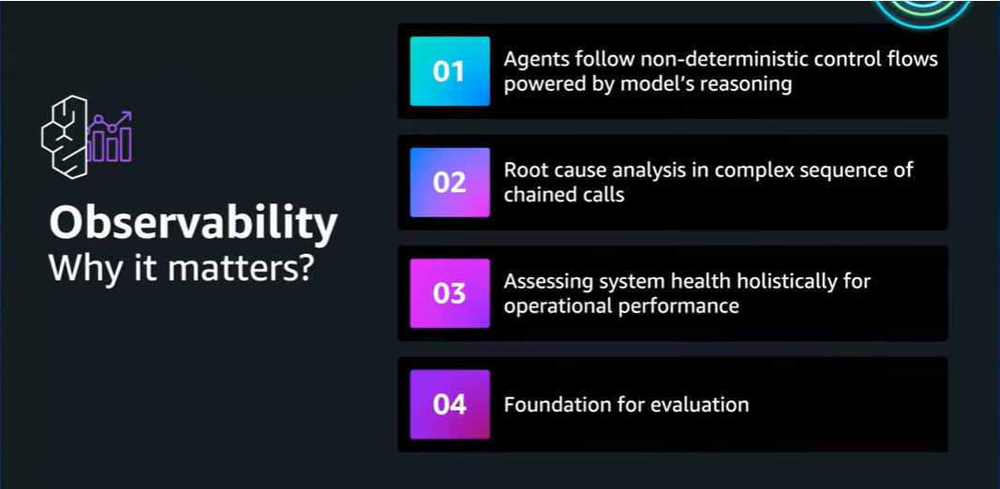

### What you are seeing

Four reasons observability is a first-class requirement for agents — not an afterthought bolted on after launch.

### What the speaker explains

The specialists lay out the drivers:

| Driver | Why it's different for agents |
|---|---|
| **Non-determinism** | The same prompt can take a different reasoning path every run — you can't predict behavior, you must observe it |
| **Complexity at scale** | An "agent" is really an orchestration of model calls, tools, memory, gateways and sub-agents |
| **Debugging opacity** | Without traces, a wrong answer gives no hint which step failed |
| **Stakeholder trust** | Business users need to see *how* a decision was reached, not just the output |

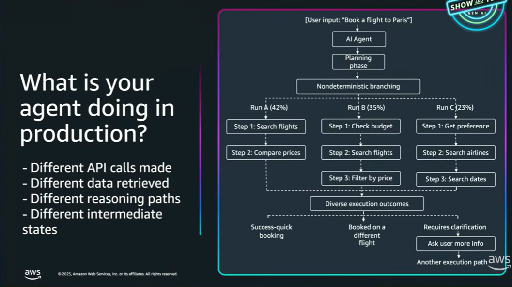

### Technical explanation

The diagram above is the mental model for the whole chapter. One request — *"Book a flight to Paris"* — branches differently each execution: maybe the agent searches flights first, maybe it checks the weather, maybe it calls a hotel API. Which path it took, how long each hop took, and what data flowed through is **invisible without telemetry**. Traditional logs tell you a function ran; agent observability tells you *the reasoning trajectory*.

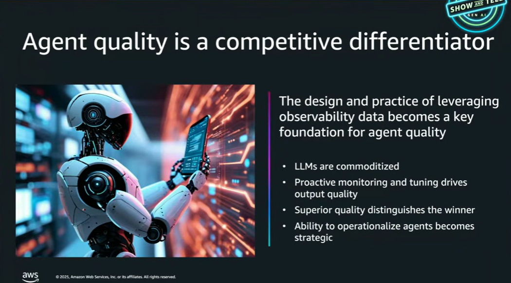

### Why it matters

The strategic framing: in a world where every competitor can call the same foundation models, **agent quality is the differentiator** — and quality is unmeasurable without observability. You can't improve latency, cost, correctness or safety you can't see.

### Key takeaway

> **Agents are non-deterministic — observability isn't optional plumbing, it's how you *know* your product.**

---

## 10.3 What Is AgentCore Observability

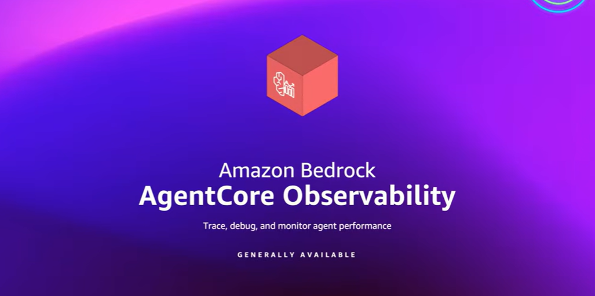

### What you are seeing

The feature announcement slide — Observability is GA alongside the rest of the AgentCore platform (Chapter 9 covered the GA milestone; this episode is the focused deep dive).

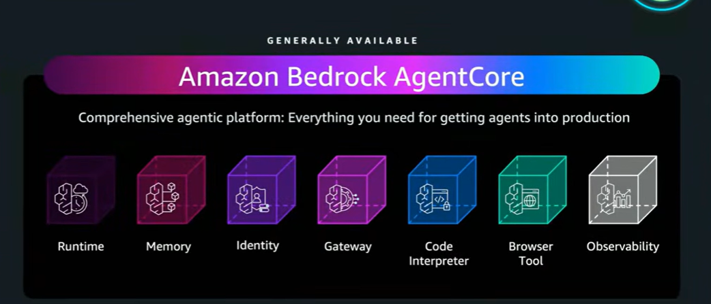

### What the speaker explains

AgentCore Observability is a **purpose-built observability layer for agents**, powered by CloudWatch. Three headline capabilities on the next slides:

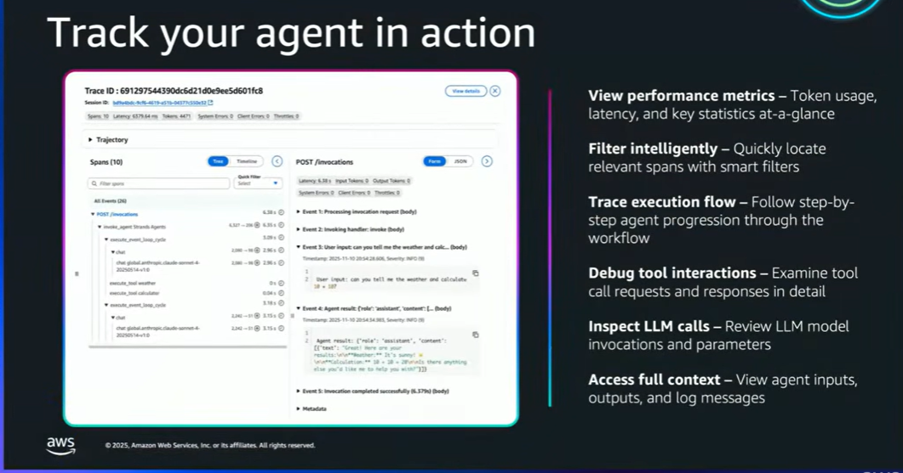

- **Trajectory view** — the step-by-step execution path: each model call, each tool invocation, each sub-agent handoff rendered as an explorable trace
- **Metrics & filters** — sessions, traces, token usage, error and throttle rates, per-span latency — filterable at the trace level *and* within a trace
- **Full context** — events, attributes and baggage on every span, so you see *what the model saw* at each step

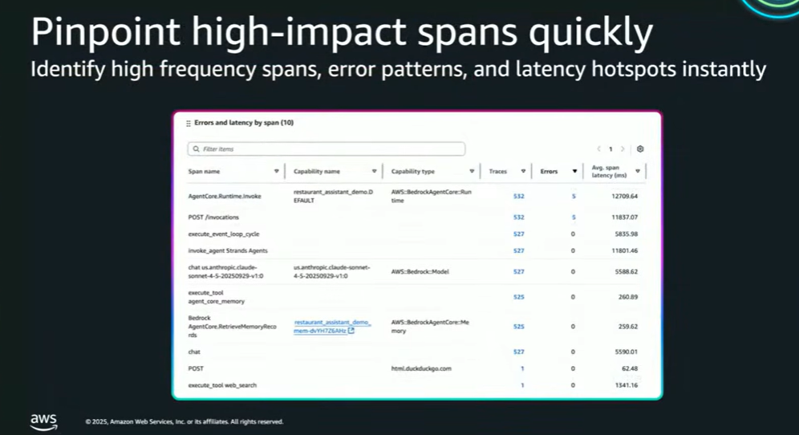

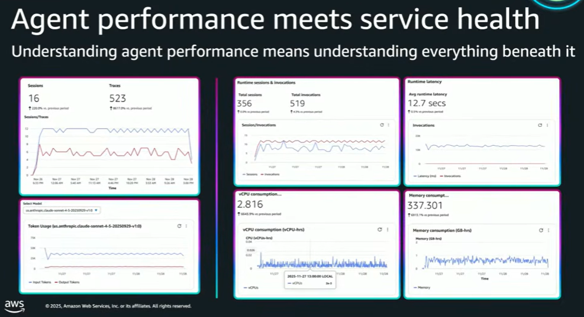

### Technical explanation

Two dashboards work together: **agent telemetry** (what the framework emitted — spans for model calls, tools, the agent loop) and **service telemetry** (what AgentCore itself emitted — runtime invocations, microVM sessions, memory operations, gateway calls). The same session viewed from both sides answers both *"why was the agent slow?"* and *"was the platform healthy?"*

### Key takeaway

> **AgentCore Observability = agent-level traces + service-level health, unified in CloudWatch GenAI Observability.**

---

## 10.4 Built on Open Standards — OpenTelemetry End to End

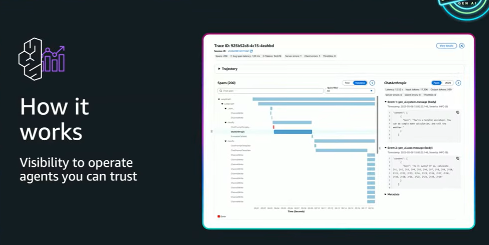

### What the speaker explains

The architectural commitment: **everything is built on OpenTelemetry (OTel)** — the CNCF open standard for telemetry. No proprietary format, no lock-in: the spans your framework emits, the propagation headers, the data model are all stock OTel.

### Technical explanation

What "built on OTel" buys you concretely:

| Capability | Comes from |
|---|---|
| Span/trace data model | OTel specification |
| Cross-service propagation | W3C `traceparent`/`tracestate` headers, injected by OTel instrumentation |
| Auto-instrumentation | `opentelemetry-instrument` + the **AWS Distro for OpenTelemetry (ADOT)** |
| Export flexibility | OTLP — send to CloudWatch *or* a third-party observability platform |
| Custom context | OTel **baggage** — your own key/value pairs carried in headers |

Because the plumbing is standard, a LangGraph agent on EKS, a Strands agent on AgentCore Runtime, and an MCP server on a third host can all contribute spans to **one trace** — as the advanced scenario in §10.14 shows.

### Why it matters

Pete's point: you are *not* locked into CloudWatch. Run the ADOT wrapper and point the OTLP exporter at Langfuse, Datadog, or any OTel-compatible backend; or use ADOT for CloudWatch. AgentCore Observability also **vends metrics separately** for its managed services, independent of what your framework emits.

### Key takeaway

> **Open standards all the way down — OTel data model, W3C propagation, OTLP export. CloudWatch is the default destination, not a requirement.**

---

## 10.5 Getting Started — Prerequisites & Environment Variables

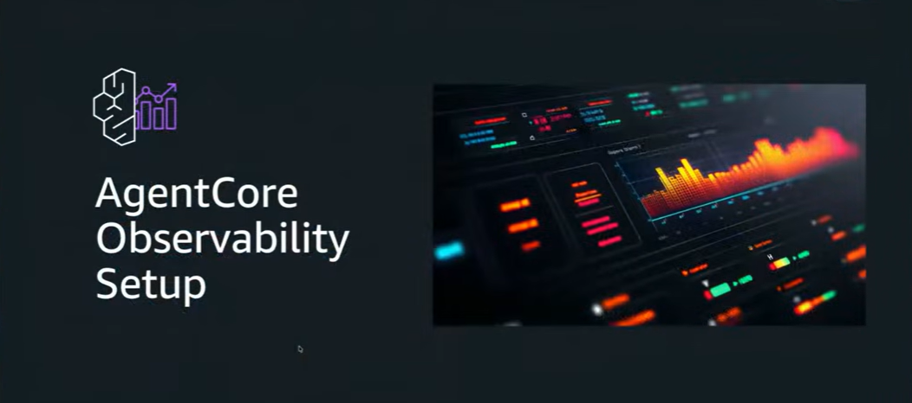

### What the speaker explains

The setup checklist for a **locally hosted or custom-hosted agent** (not on AgentCore Runtime):

1. **Enable CloudWatch Transaction Search** — the X-Ray/CloudWatch feature that ingests OTLP spans into the `aws/spans` log group. One-time, per account/region.
2. **Install the ADOT Python distribution** — `aws-opentelemetry-distro` plus your framework's OTel extension.
3. **Ensure the framework emits OTel traces** — e.g. Strands with its OTel package, LangGraph via `openinference`/`langsmith` instrumentation.
4. **Set the environment variables** — tell ADOT where to send telemetry and what to call your agent.
5. **Run under `opentelemetry-instrument`** — the wrapper auto-instruments HTTP, boto3, and framework calls.

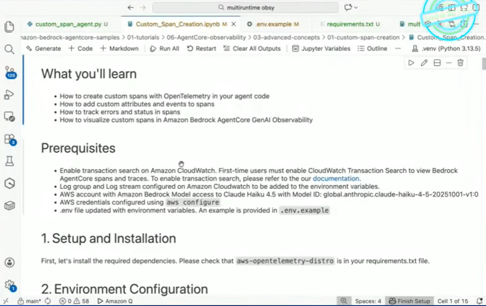

### Technical explanation — the environment contract

The environment variables shown on screen (and in the sample's `.env.example`):

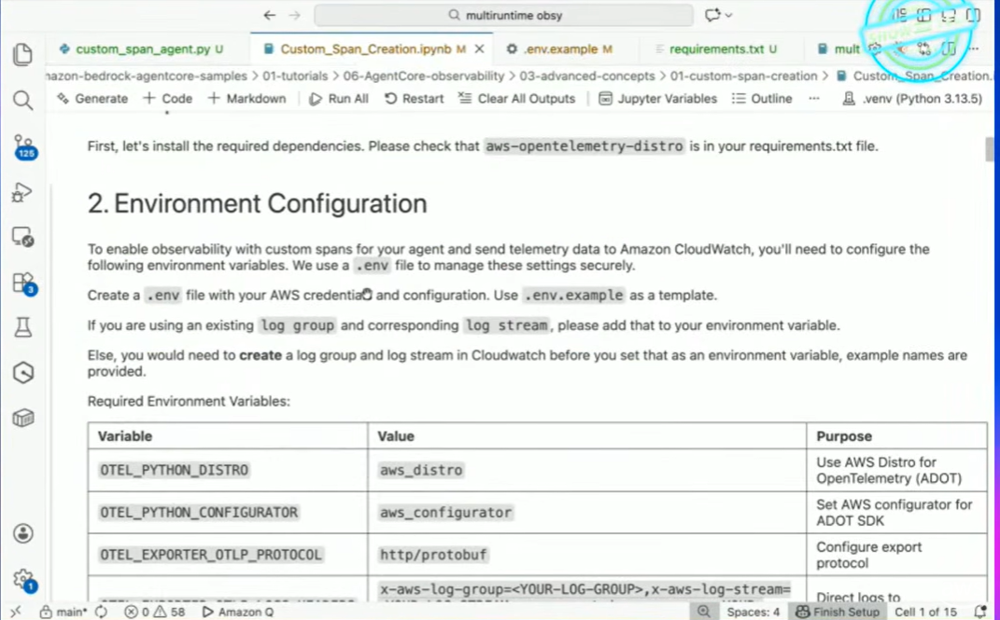

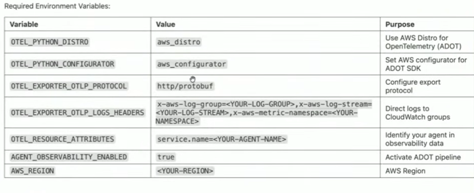

| Variable | Purpose |
|---|---|
| `OTEL_PYTHON_DISTRO=aws_distro` | Use the AWS OpenTelemetry distribution (routes to CloudWatch) |
| `OTEL_PYTHON_CONFIGURATOR=aws_configurator` | ADOT's auto-configuration hooks |
| `OTEL_EXPORTER_OTLP_PROTOCOL=http/protobuf` | OTLP wire protocol |
| `OTEL_EXPORTER_OTLP_LOGS_HEADERS` | `x-aws-log-group`, `x-aws-log-stream`, `x-aws-metric-namespace` — the CloudWatch destination |
| `OTEL_RESOURCE_ATTRIBUTES=service.name=…` | **The name your agent appears as** in the GenAI Observability dashboard |
| `AGENT_OBSERVABILITY_ENABLED=true` | Turns the AgentCore-specific processing on |

Here's the real `.env.example` from the observability sample — explore it, then compare with the screenshots:

<GitHubExplorer repo="awslabs/agentcore-samples" ref="main" expanded="true" title="01-features/06-observe-evaluate-optimize-your-agent/01-observe/.env.example — the ADOT environment contract" files={[{"path":"01-features/06-observe-evaluate-optimize-your-agent/01-observe/.env.example","label":".env.example","highlights":[[1,17]],"note":"Every variable the episode lists: aws_distro + aws_configurator select ADOT, the OTLP headers name the CloudWatch log group/stream/metric namespace, service.name is what appears in the dashboard, AGENT_OBSERVABILITY_ENABLED turns on the feature."}]} />

### Why it matters

Notice what's **not** here: no code changes, no SDK calls in the agent, no collector to run. The contract is *environment variables + a wrapper command* — which is why a local agent becomes observable in minutes.

### Key takeaway

> **Transaction Search + ADOT env vars + `opentelemetry-instrument` = observability without touching agent code.**

---

## 10.6 Runtime Path — Same Agent, Zero Config

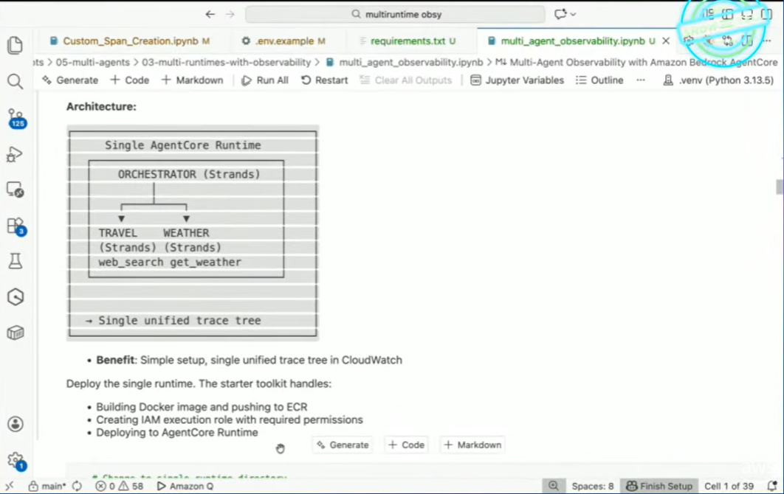

### What the speaker explains

When the agent runs on **AgentCore Runtime**, the environment contract collapses: the starter toolkit bakes the OTEL instrumentation into the deployment — no env vars, no wrapper command to manage yourself.

![requirements.txt — strands-agents[otel], bedrock-agentcore, ddgs, aws-opentelemetry-distro](screenshots/c10s17.png)

### What you are seeing

The demo agent's `requirements.txt`. The two lines that matter: `strands-agents[otel]` (the framework's OTel extension) and `aws-opentelemetry-distro` (ADOT itself).

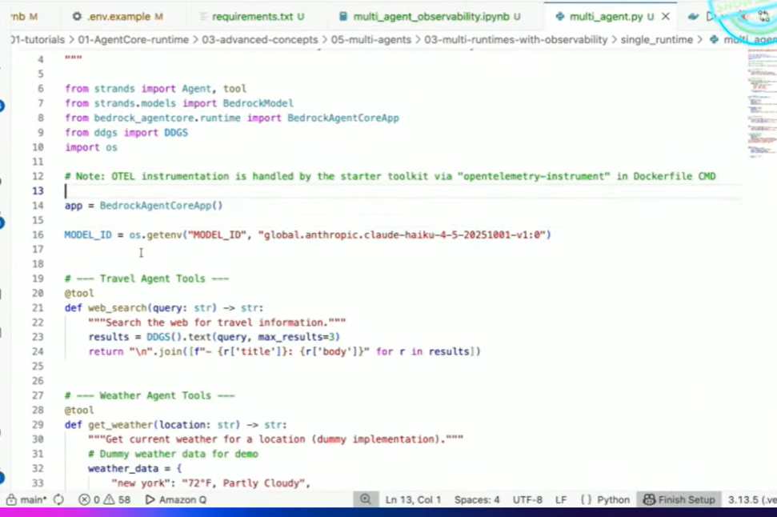

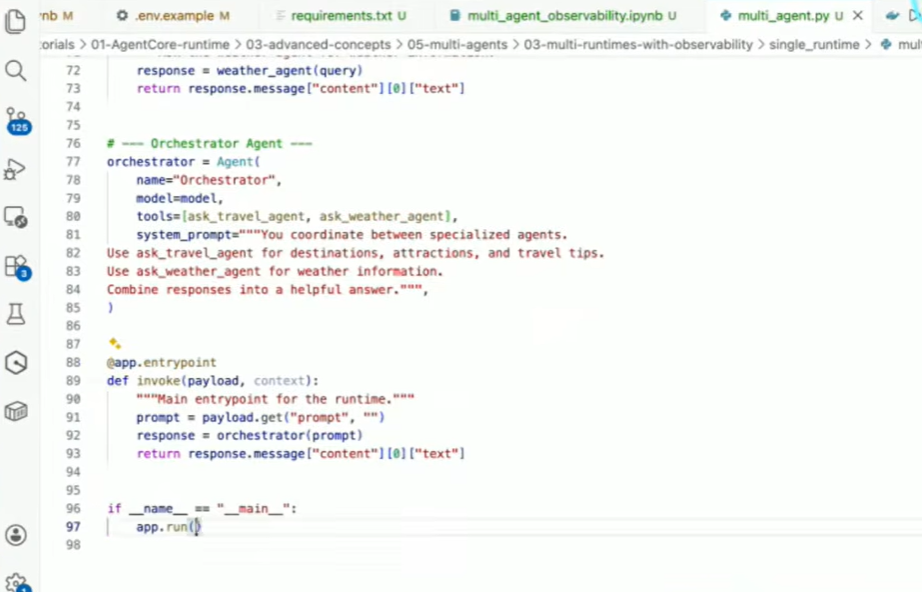

### Technical explanation

Adapting a local agent for Runtime is the same `BedrockAgentCoreApp` + `@app.entrypoint` + `app.run()` pattern from Chapters 8–9. The observability difference is that **the starter toolkit's generated Dockerfile already wraps the start command in `opentelemetry-instrument`**:

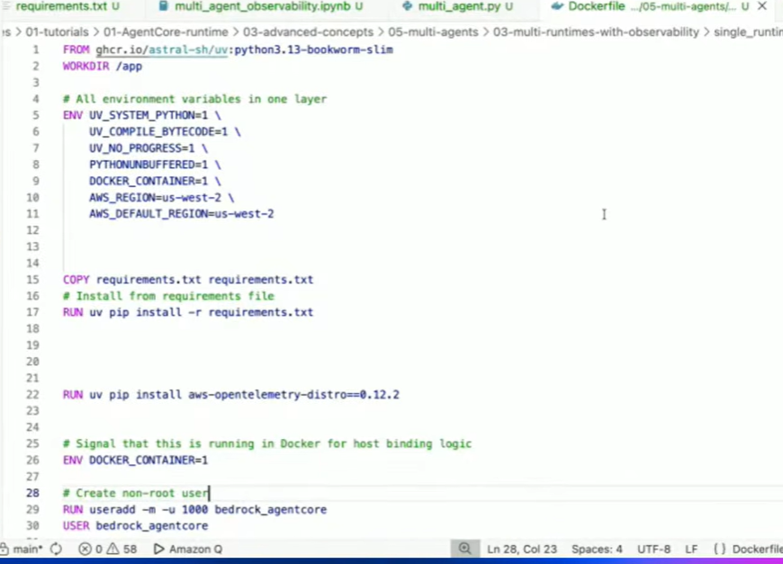

Here is the equivalent real agent file from the `observability-with-strands` sample — the same shape as the demo:

<GitHubExplorer repo="awslabs/agentcore-samples" ref="main" expanded="true" title="04-observability-with-strands/utils/travel_agent.py — a Runtime agent that's observable by default" files={[{"path":"01-features/02-host-your-agent/01-runtime/01-hosting-agents/04-observability-with-strands/utils/travel_agent.py","label":"travel_agent.py","highlights":[[15,23],[56,80],[86,98]],"note":"Line 15–23: BedrockAgentCoreApp() — the Runtime wrapper. 56–80: the Strands agent with trace_attributes (service.name becomes the dashboard identity). 86–98: @app.entrypoint + app.run(). No OTel code in the file — the starter toolkit's opentelemetry-instrument wrapper does the instrumentation."}]} />

### Why it matters

Two paths, one destination: **self-hosted** agents configure OTel via env vars; **Runtime** agents get it from the deployment tooling. Either way the spans land in the same GenAI Observability dashboard — which is exactly what the multi-runtime scenario in §10.14 exploits.

### Key takeaway

> **On Runtime, observability is deployment-time configuration — the starter toolkit wires `opentelemetry-instrument` into the container for you.**

---

## 10.7 Enabling Service Telemetry in the Console

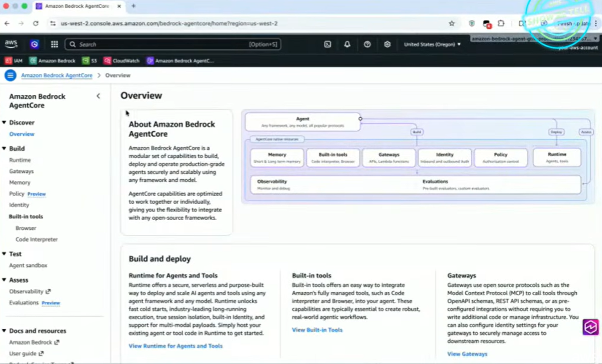

### What the speaker explains

Agent/framework spans are only half the picture. The **managed services themselves** — Runtime, Memory, Gateway — emit their own telemetry, enabled per-resource in the console.

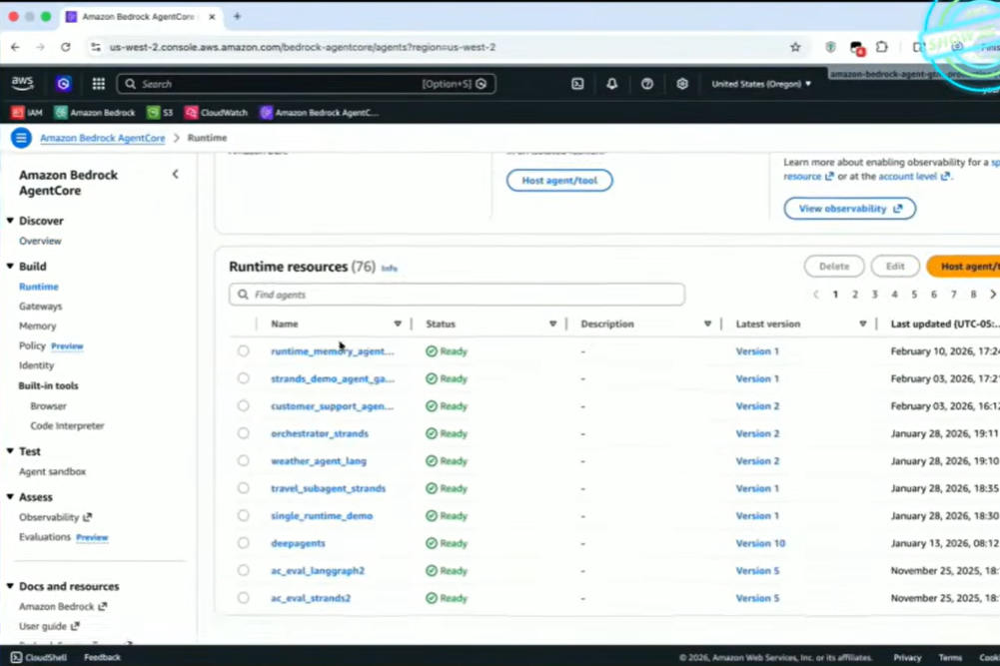

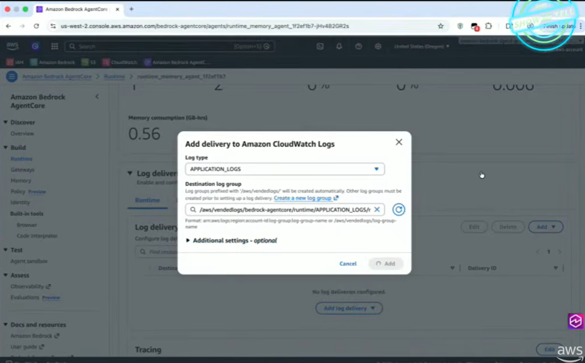

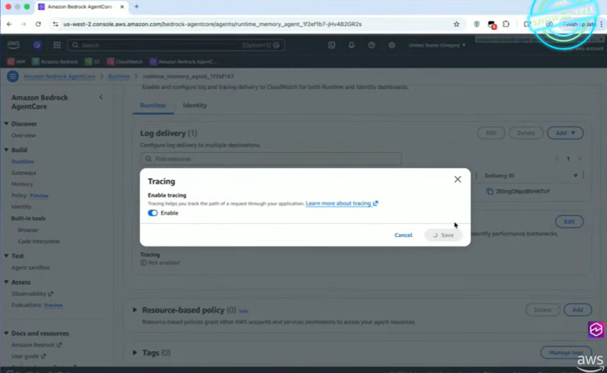

### Technical explanation

Two independent switches per resource:

| Switch | What it turns on | Destination |
|---|---|---|
| **Log delivery** | The service's own application logs | A vended CloudWatch log group (`/aws/vendedlogs/bedrock-agentcore/…`) |
| **Tracing** | Service-emitted spans (invoke operations, health) | `aws/spans` — merged with your framework spans by trace ID |

The distinction Rajes draws:

| | Framework-emitted | Service-emitted |
|---|---|---|
| **Source** | Your agent's OTel instrumentation (Strands, LangGraph…) | AgentCore's own services (Runtime, Memory, Gateway) |
| **Contents** | Agent loop, model calls, tool spans, custom spans | Invocation operations, service-health metrics |
| **Enabled by** | `opentelemetry-instrument` + ADOT | The console toggles above |
| **Appears as** | `invoke_agent`, `chat`, `execute_tool` spans | `Bedrock AgentCore.InvokeAgentRuntime` spans |

### Why it matters

Latency is rarely purely "the agent's fault." Without service telemetry, a slow Memory `create_event` or a Gateway round-trip is invisible — you'd tune prompts while the platform hop was the bottleneck. Both streams join in the same trace.

### Key takeaway

> **Flip both switches: framework instrumentation shows *your* code; service telemetry shows *the platform's* work — together they cover the whole request path.**

---

## 10.8 Inside the Dashboards — Agents, Sessions, Traces, Memory, Gateways

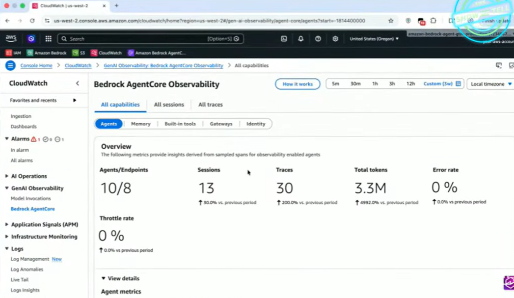

### What you are seeing

The **GenAI Observability → Bedrock AgentCore** landing dashboard in CloudWatch. Top line: agent count, sessions, traces, total tokens, error and throttle rates. Tabs cover each AgentCore surface.

### What the speaker explains — the tour

The walkthrough proceeds tab by tab:

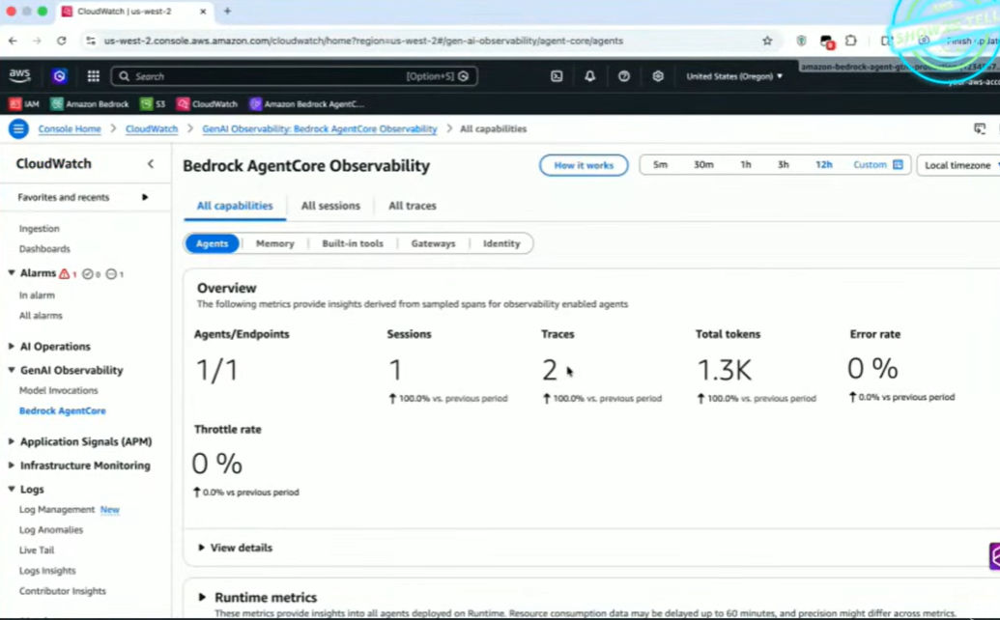

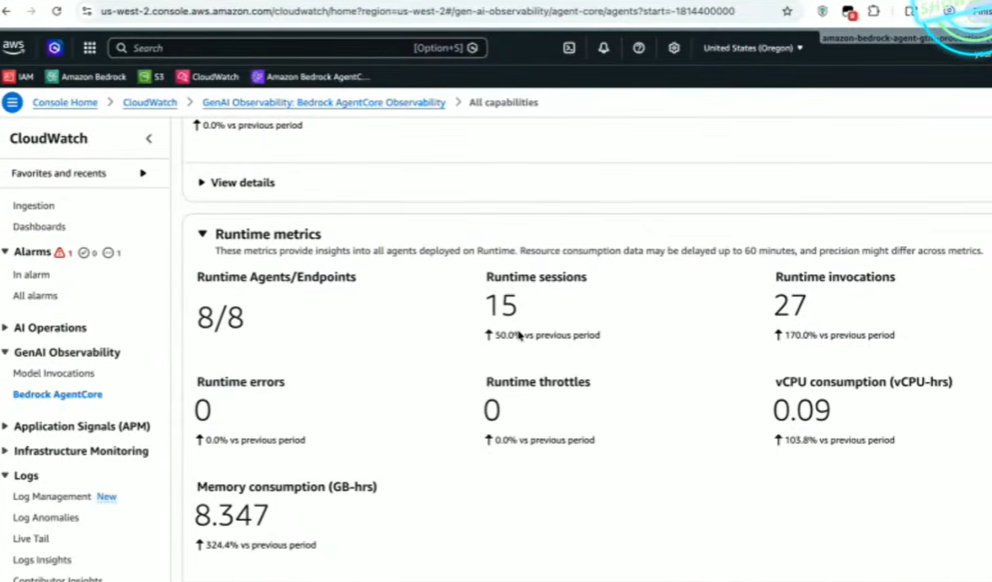

| Tab | What it answers |
|---|---|
| **Agents** | Per-agent sessions, traces, tokens, error %, throttle % — drill into one agent's spans |
| **Runtime** | Invocation counts, microVM **session IDs**, vCPU/memory consumption — service health |
| **Memory** | `create_event` / `retrieve` API calls, extracted records, latency, error % |
| **Built-in tools** | Code Interpreter / Browser sessions, invocations, consumption |
| **Gateways** | Invocations, error rate, throttle rate per gateway |

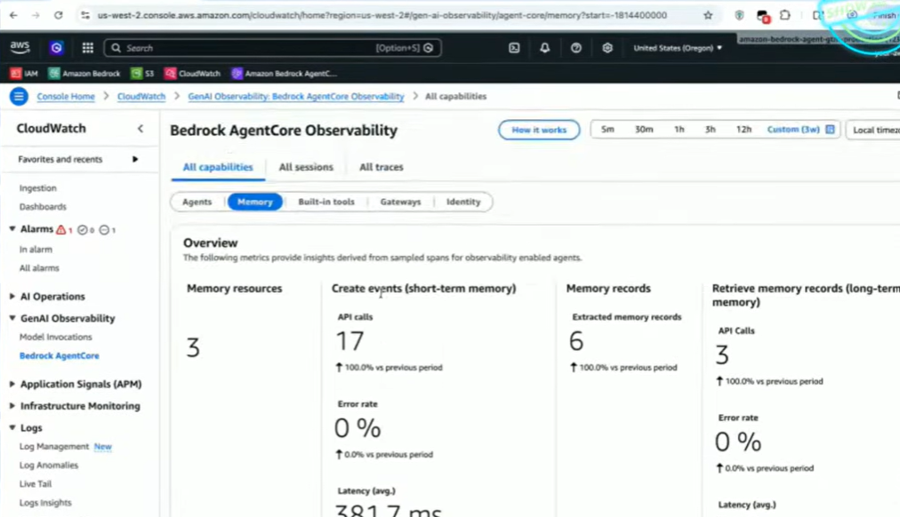

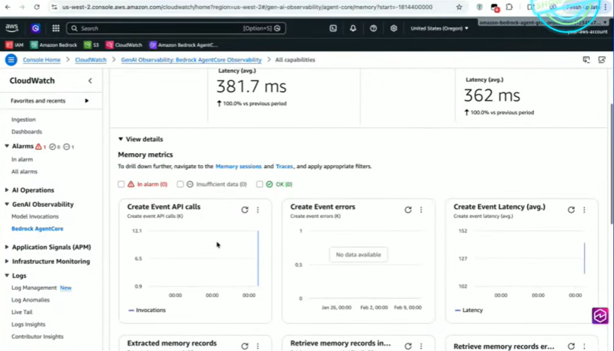

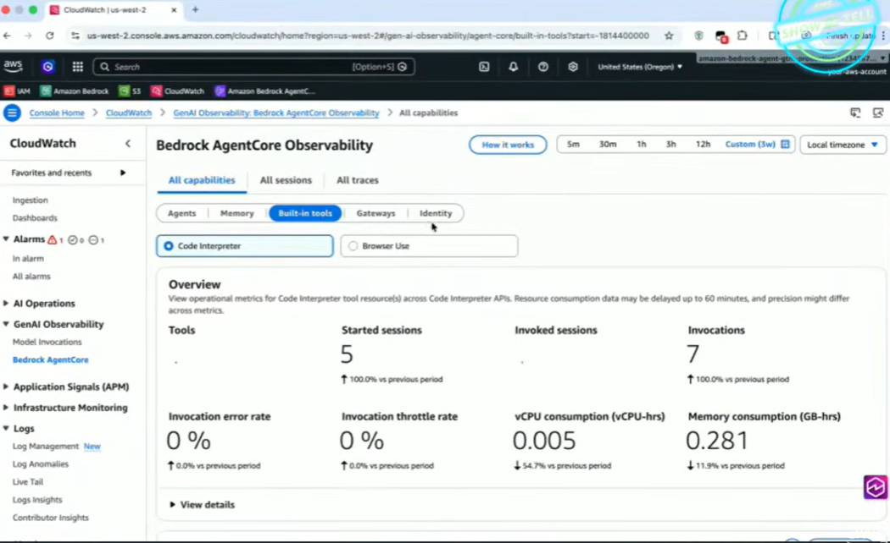

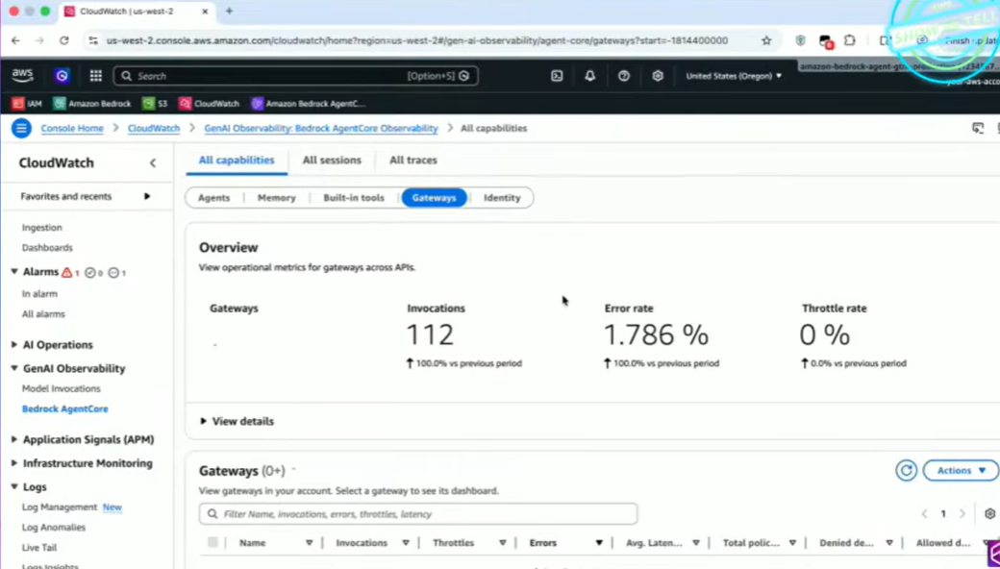

### The two kinds of "session"

A sharp question from the hosts about two different session counts. The answer, worth memorizing:

- **Runtime session IDs** — AgentCore Runtime's microVM isolation boundary (§9.x covered microVM-per-session)
- **OTel session ID** — *your* application-level session, propagated via baggage (§10.11)

Same word, different layer: one is platform tenancy, the other is your conversation.

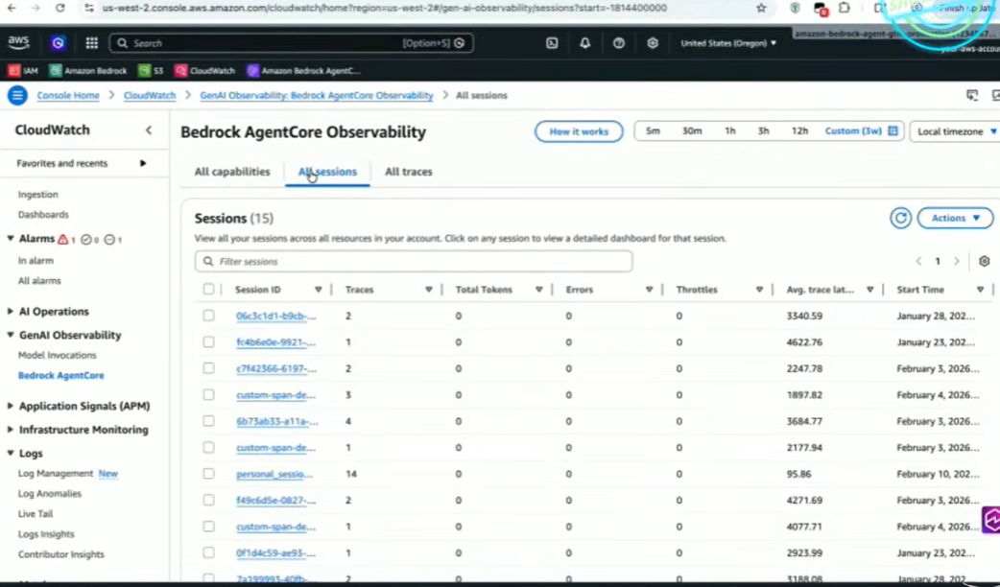

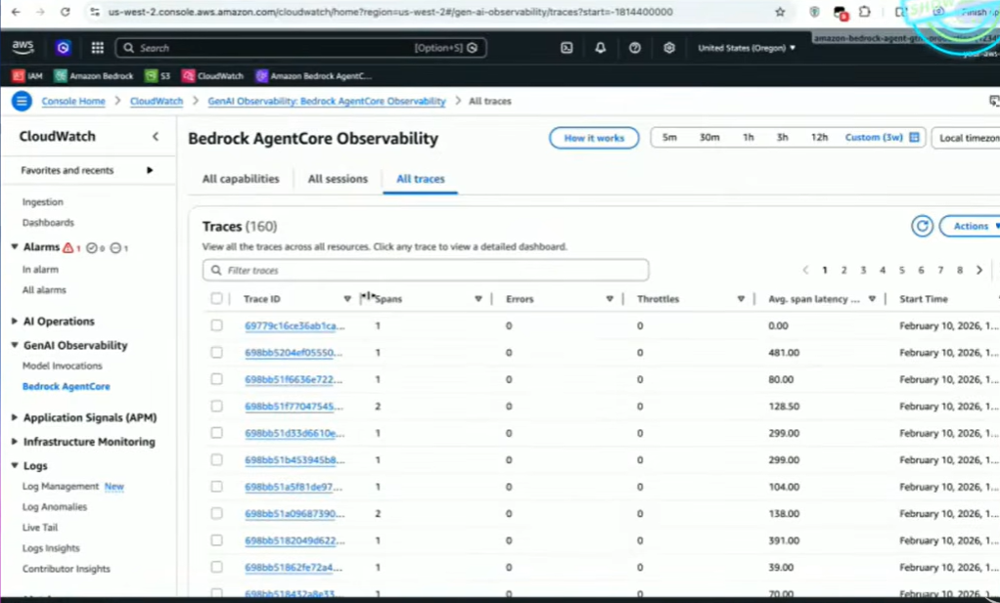

### Key takeaway

> **One dashboard, two layers: application sessions (your conversations) and runtime sessions (microVMs) — plus per-resource health for Memory, Gateways and built-in tools.**

---

## 10.9 Trace Anatomy — Sessions, Spans and the Three Pillars

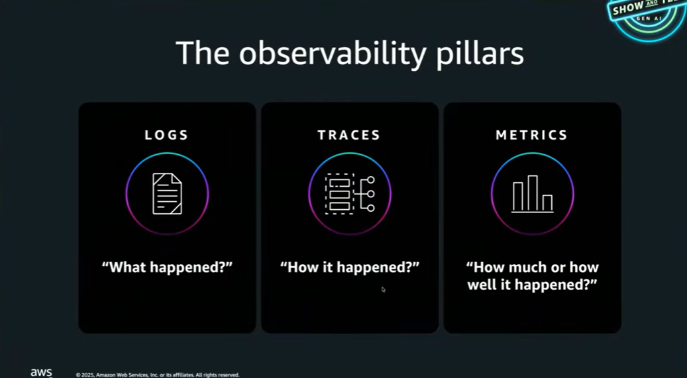

### What the speaker explains

The vocabulary reset. The three pillars aren't interchangeable:

- **Logs** — *what happened*: discrete events with payloads
- **Traces** — *how it happened*: the causal chain of operations
- **Metrics** — *how much/how well*: aggregated numbers you alarm on

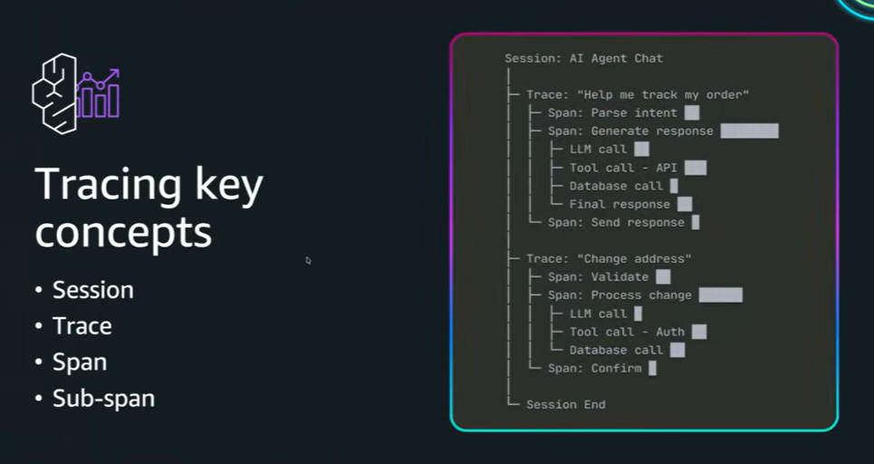

### Technical explanation — the span document

Every operation emits a **span**: a JSON document with `traceId` (which tree it belongs to), `spanId` + `parentId` (the hierarchy), `duration`, `events` (things that happened inside it), `attributes` (metadata like model ID or token counts) and `baggage` (your propagated context).

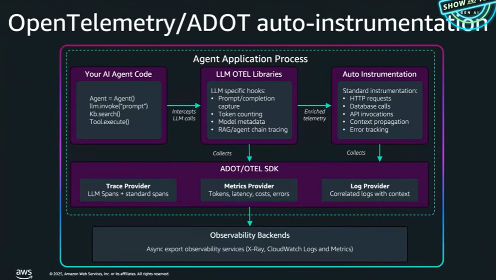

### The hierarchy

The nesting model:

| Level | Meaning | Example |
|---|---|---|
| **Session** | A user conversation | "customer-support session #15" |
| **Trace** | One end-to-end request within the session | "answer this prompt" |
| **Span** | One operation inside the trace | `invoke_agent`, `chat`, `execute_tool` |
| **Sub-span** | Nested work inside a span | the HTTP call inside a tool execution |

### Why it matters

This hierarchy is why dashboards can roll up and drill down: sum span durations for per-agent latency, group spans by trace for the waterfall, or filter all traces in a session — all from the same span documents.

### Key takeaway

> **A trace is just a tree of spans sharing a `traceId`; sessions group traces; metrics are spans aggregated. Learn those three relationships and every dashboard reads itself.**

---

## 10.10 OpenTelemetry Plumbing — How the Data Actually Flows

### What you are seeing

The end-to-end pipeline Rajes draws: **two instrumentation layers** feed the OTel SDK, which exports to backends.

### Technical explanation — who emits what

| Layer | Emits | How it gets instrumented |
|---|---|---|
| **Framework/LLM libraries** | Prompt/completion content, token counts, model metadata, agent-loop spans | The framework's own OTel extension (e.g. `strands-agents[otel]`, `openinference` for LangGraph) |
| **Auto-instrumentation** | HTTP calls, DB calls, API calls, errors, **context propagation headers** | `opentelemetry-instrument` wrapper + ADOT |
| **OTel SDK (ADOT)** | Collects both, adds resource attributes, batches + exports | Providers for traces/metrics/logs → OTLP → CloudWatch `aws/spans` + log groups |

The key insight about **different libraries, same standard**: Strands' OTel extension, LangGraph's `openinference`, CrewAI's instrumentation all emit *semantically similar but differently-named* attributes. AgentCore Observability does the **attribute mapping/normalization** for the popular libraries, so you pick your framework's natural telemetry library and the dashboard still interprets it — you don't hand-translate formats.

### Why it matters

This is the "no lock-in" story made concrete: standard OTel in, CloudWatch (or any OTLP backend) out, normalization handled for you.

### Key takeaway

> **Framework extensions capture agent semantics; auto-instrumentation captures everything else; ADOT ships both to the backend. AgentCore maps the per-library attribute differences for you.**

---

## 10.11 Context Propagation — Trace IDs, Headers and Baggage

### What the speaker explains

The distributed-tracing mechanism, explained simply: the **originator creates a trace ID**; OTel injects it into request headers; every receiving system that's OTel-aware reads the same ID and emits spans carrying it. All spans land in the same backend (`aws/spans`) — so the system reassembles the **end-to-end view across processes, hosts and even different runtimes**.

And it's not limited to HTTP: OTel propagation works over **gRPC, Kafka queues, database calls** — the instrumentation hooks each transport.

### Technical explanation — baggage

**baggage** is OTel's user-defined context: arbitrary key/value pairs (`session.id`, `tenant.id`, `conversation.id`, a billing unit) attached to the context and propagated in headers alongside the trace ID. Every downstream span inherits it — which is how a `session.id` set once in the orchestrator shows up on a LangGraph sub-agent's spans three services away.

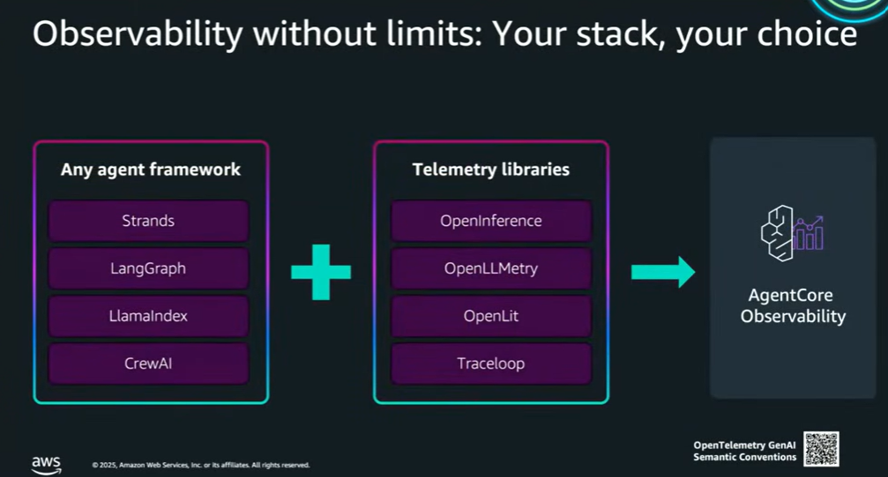

### What it looks like in code

In the demo, the orchestrator sets baggage before invoking sub-agents. The real sample shows the pattern — baggage set once, propagated automatically:

<GitHubExplorer repo="awslabs/agentcore-samples" ref="main" expanded="true" title="01-observe/baggage_context.py — BaggageSpanProcessor propagates context to every span" files={[{"path":"01-features/06-observe-evaluate-optimize-your-agent/01-observe/baggage_context.py","label":"baggage_context.py","highlights":[[55,73],[79,96]],"note":"55–73: BaggageSpanProcessor copies all baggage to every span's attributes at export — no per-span set_attribute() needed. The DISABLE_ADOT_OBSERVABILITY toggle shows the no-lock-in path: swap ADOT for a third-party OTLP endpoint via env vars. 79–96: set session.id + tenant.id + environment once — they ride every child span."}]} />

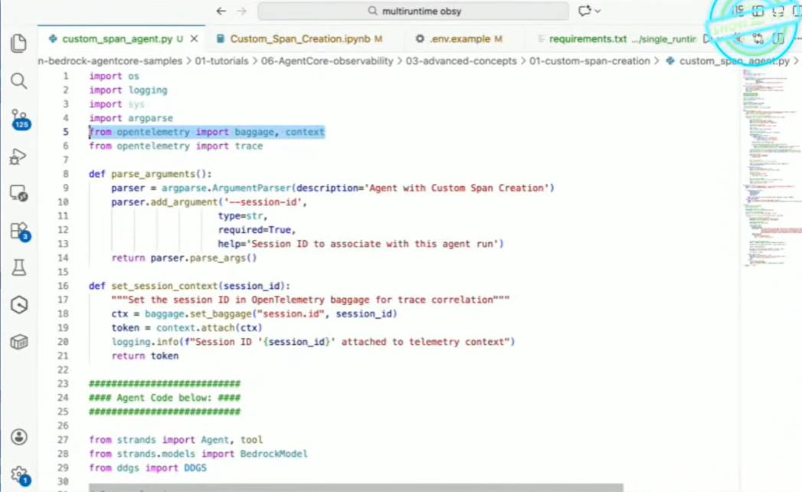

### Key takeaway

> **Trace ID says *which request*; baggage says *whose request* — set it once at the edge and every span everywhere inherits it.**

---

## 10.12 Custom Spans — Instrumenting What the Framework Can't See

### What the speaker explains

Auto-instrumentation covers HTTP/model/tool calls, but **your business logic** (a session boundary, a specific step, a business attribute) needs explicit spans. The sample's `custom_span_agent.py` shows both moves: create a span with `tracer.start_as_current_span(...)`, and attach attributes via the Strands `trace_attributes` dict.

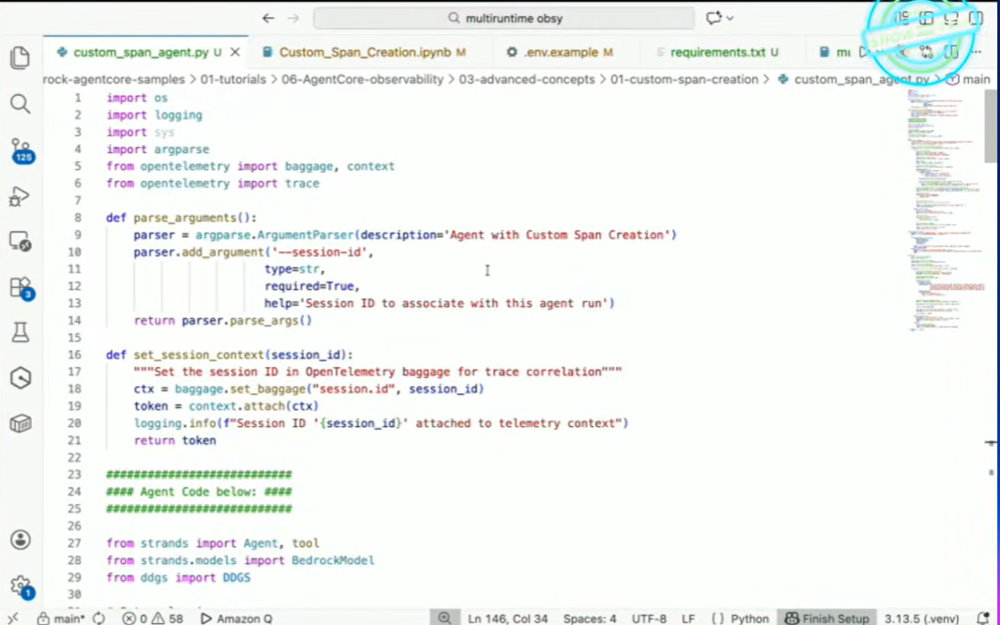

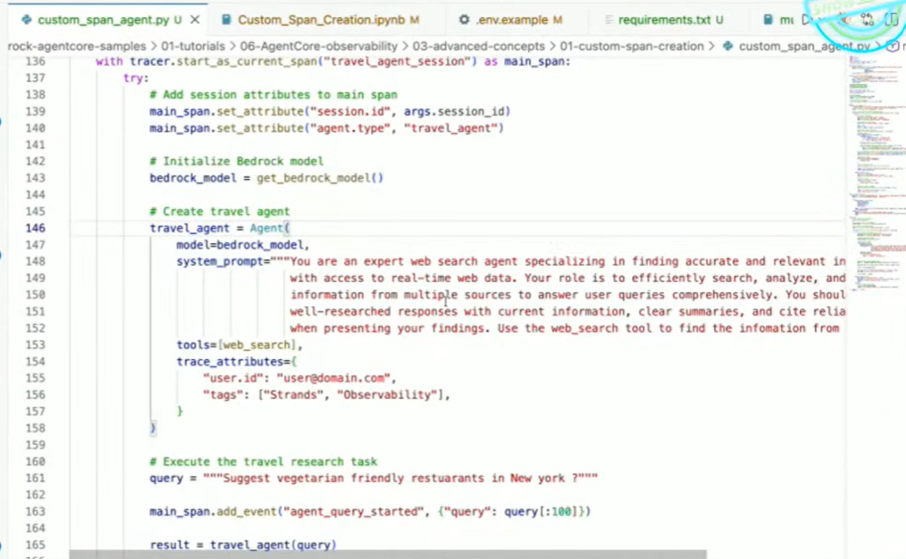

### The real file — explore it

<GitHubExplorer repo="awslabs/agentcore-samples" ref="main" expanded="true" title="01-observe/custom_span_creation.py — custom session span + baggage + trace_attributes" files={[{"path":"01-features/06-observe-evaluate-optimize-your-agent/01-observe/custom_span_creation.py","label":"custom_span_creation.py","highlights":[[51,55],[70,75],[134,171]],"note":"51–55: set_session_context() attaches session.id to OTel baggage. 70–75: a custom span around web_search with tool attributes. 134–171: the session-level span (travel_agent_session) with session.id/agent.type/agent.framework attributes, plus trace_attributes passed to the Strands Agent — the pattern from the on-screen file."}]} />

### Key takeaway

> **Wrap your own operations in `start_as_current_span` and they'll appear in the trajectory next to model and tool spans — with attributes you can later filter and alarm on.**

---

## 10.13 Performance, PII and Guardrails

### What the speaker explains

The overhead question every team asks: OTel batching means the exporter flushes asynchronously (default interval ~2s, tunable) — tracing adds minimal per-request latency, and there's a deliberate trade-off between flush frequency and overhead.

Then the security question: *what about PII inside spans and logs?* Two layers of answer:

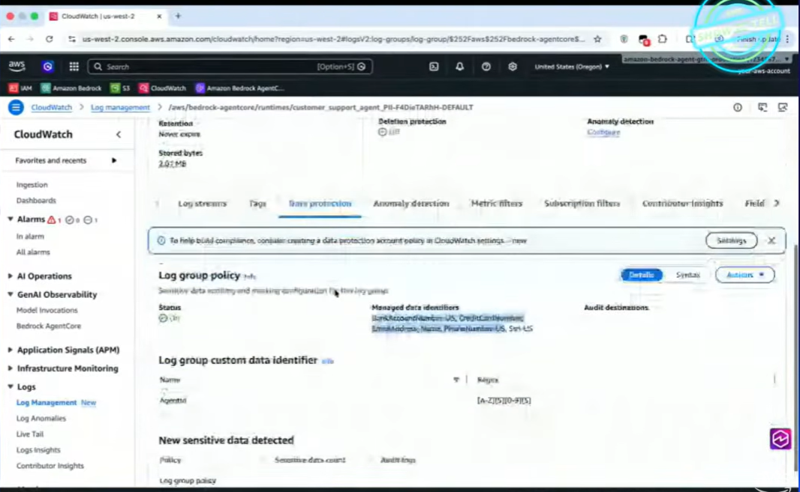

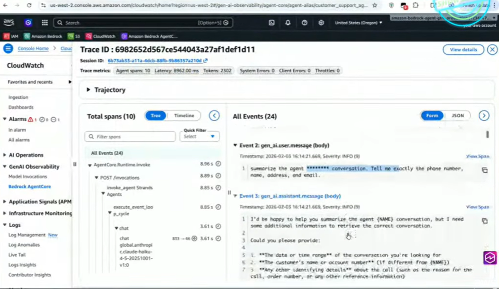

1. **CloudWatch Logs data protection policies** — attach a policy to the log group; managed identifiers (email, phone, SSN, name…) or custom regexes get **masked automatically** (`Jane Smith` → `{NAME}`, `555-…` → `*******`). Applies to vended runtime logs *and* your custom application log groups — mature AWS log-privacy machinery, no agent-specific reinvention.

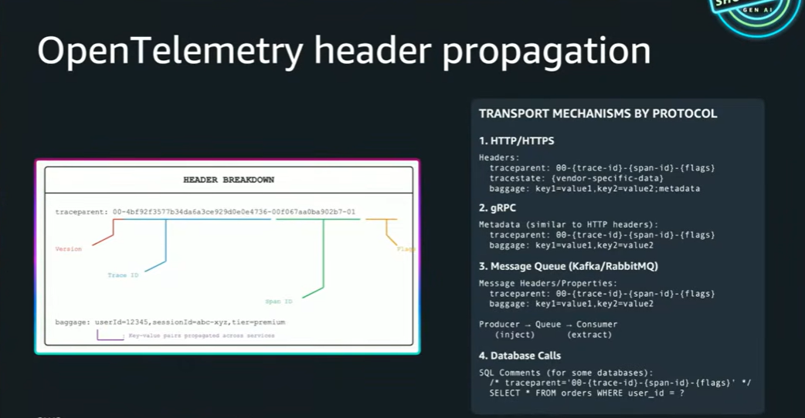

2. **Bedrock Guardrails** — content-level protection applied *at the model call*, so PII handling, denied topics and filters apply before data ever reaches logs. Defense in depth: guardrails protect the interaction; data protection policies protect the storage.

### The real data-protection pipeline — explore it

<GitHubExplorer repo="awslabs/agentcore-samples" ref="main" expanded="true" title="01-observe/data_protection.py — guardrail + CloudWatch data-protection policy end to end" files={[{"path":"01-features/06-observe-evaluate-optimize-your-agent/01-observe/data_protection.py","label":"data_protection.py","highlights":[[77,116],[318,359]],"note":"77–116: create_guardrail() builds a PII-anonymizing Bedrock guardrail. 318–359: CW_DATA_PROTECTION_POLICY — an Audit statement (find PII) plus a Deidentify statement (mask it) using managed data identifiers, applied to the runtime's /aws/bedrock-agentcore/runtimes/<id>-DEFAULT log group via put_data_protection_policy."}]} />

### Why it matters

The episode's honest framing: *don't build agent-specific privacy plumbing*. CloudWatch data protection and Bedrock Guardrails are battle-tested; use them at the log group and the model layer and your traces stay useful without leaking PII.

### Key takeaway

> **Two layers, zero custom code: guardrails at the model boundary, data protection policies at the log group — PII masked in the same dashboards you're already reading.**

---

## 10.14 The Advanced Scenario — Three Runtimes, Two Frameworks, One Trace

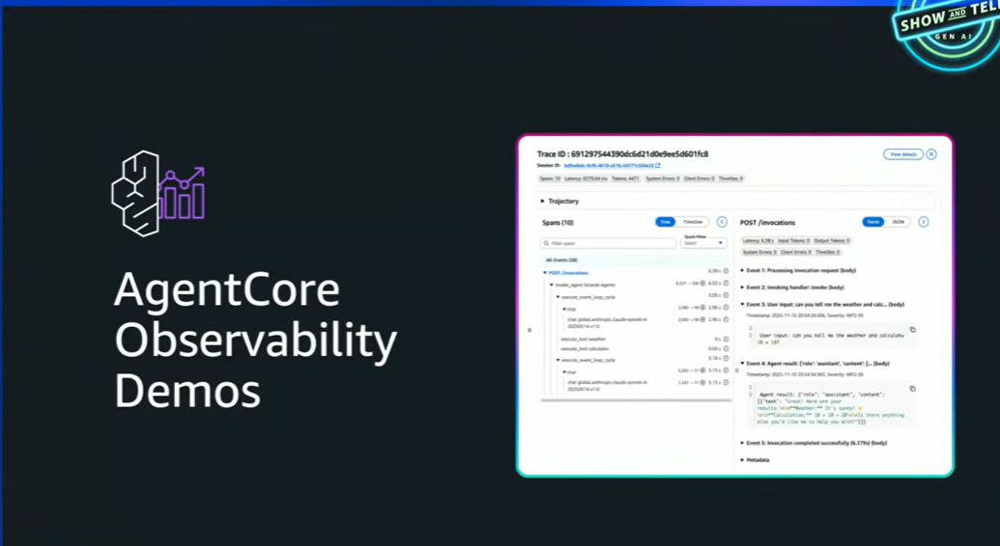

### What the speaker explains

Madu's advanced scenario is the strongest proof of the open-standards story: a **hierarchical multi-agent pattern** where different teams own different agents on **different runtimes**, connected by OTel distributed tracing.

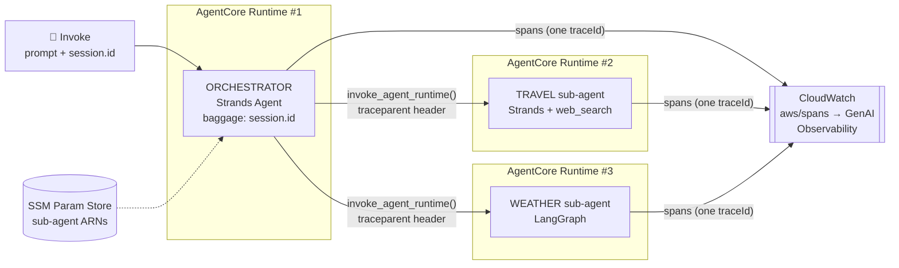
```mermaid
flowchart LR
 U["🧑 Invoke<br/>prompt + session.id"] --> ORCH

 subgraph R1["AgentCore Runtime #1"]
 ORCH["ORCHESTRATOR<br/>Strands Agent<br/>baggage: session.id"]
 end

 subgraph R2["AgentCore Runtime #2"]
 TRAVEL["TRAVEL sub-agent<br/>Strands + web_search"]
 end

 subgraph R3["AgentCore Runtime #3"]
 WEATHER["WEATHER sub-agent<br/>LangGraph"]
 end

 ORCH -- "invoke_agent_runtime()<br/>traceparent header" --> TRAVEL
 ORCH -- "invoke_agent_runtime()<br/>traceparent header" --> WEATHER
 SSM[("SSM Param Store<br/>sub-agent ARNs")] -.-> ORCH

 ORCH & TRAVEL & WEATHER -- "spans (one traceId)" --> CW[["CloudWatch<br/>aws/spans → GenAI<br/>Observability"]]
```

### Technical explanation — how they connect

- **Runtime #1** — orchestrator agent (Strands): sets `session.id` in **OTel baggage**, then calls sub-agents via `invoke_agent_runtime()`
- **Runtime #2** — travel sub-agent (Strands + `web_search` tool)
- **Runtime #3** — weather sub-agent (**LangGraph** — a different framework entirely)
- **SSM Parameter Store** — holds the sub-agent ARNs so the orchestrator discovers them
- **Baggage propagation** — the mechanism carrying the trace across runtime boundaries

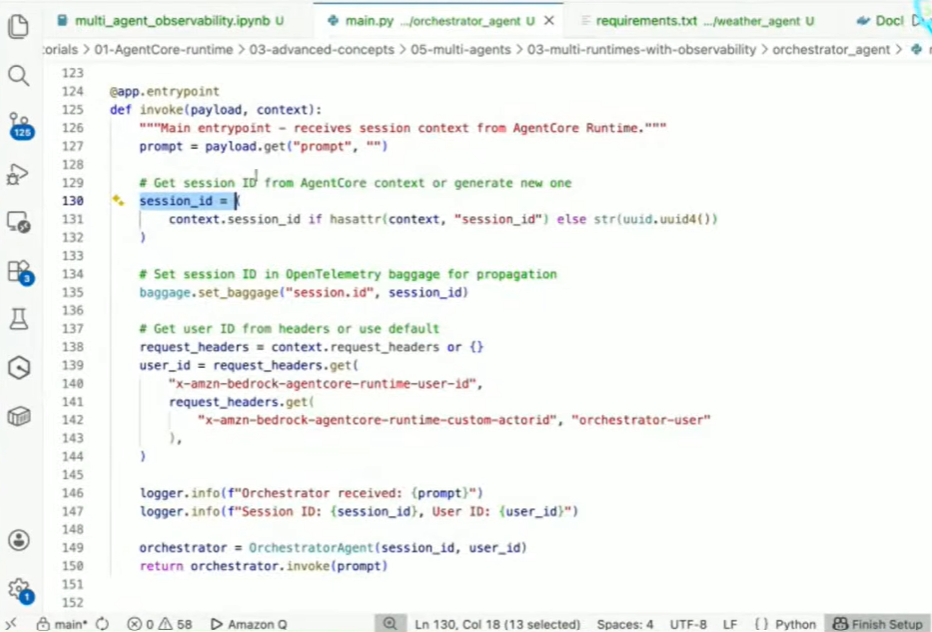

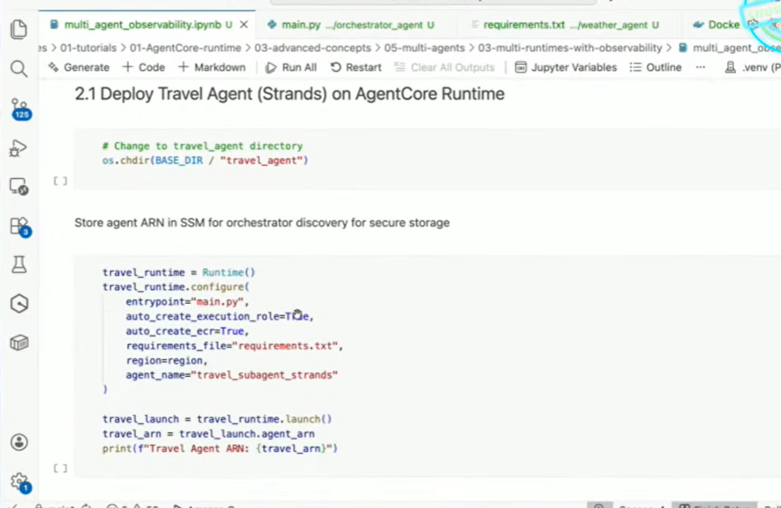

### The agents list — including a non-Runtime agent

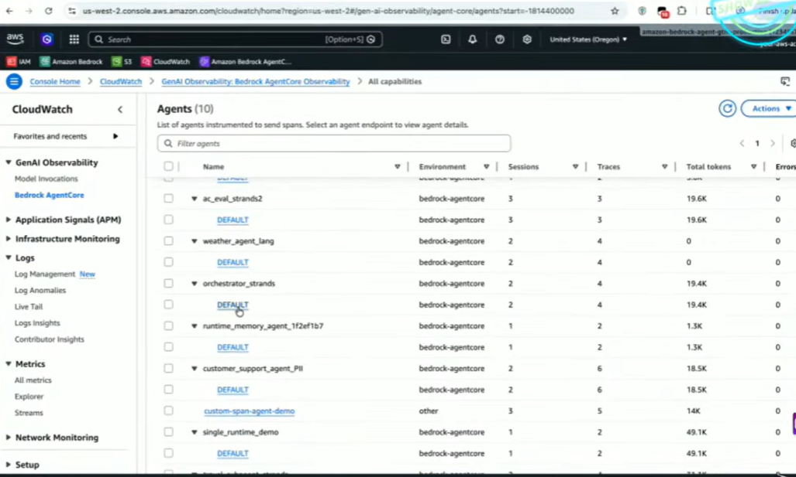

Look closely at `custom-span-agent-demo`: its environment is **"other"** — the §10.5 locally-instrumented agent appearing side by side with Runtime-hosted agents. That one row proves the whole thesis: *hosted anywhere, observed in one place.*

### Reading the stitched trace

Drilling into one trace:

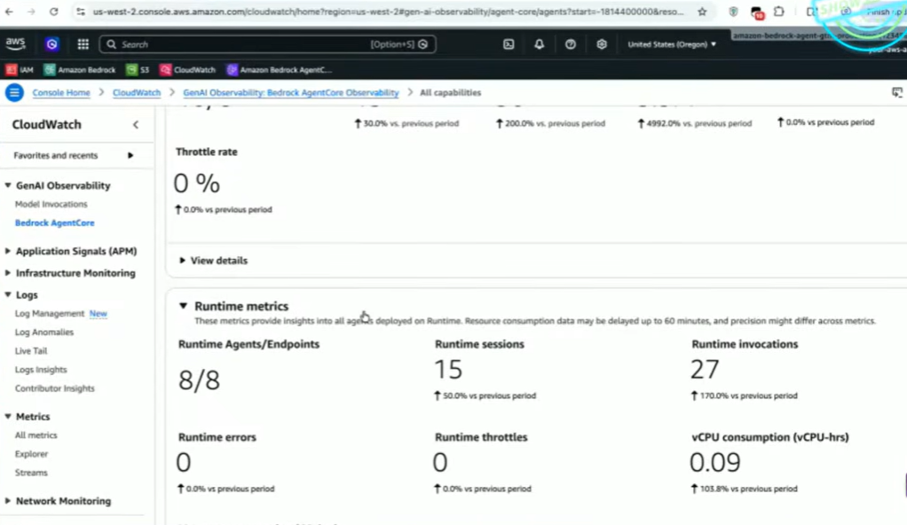

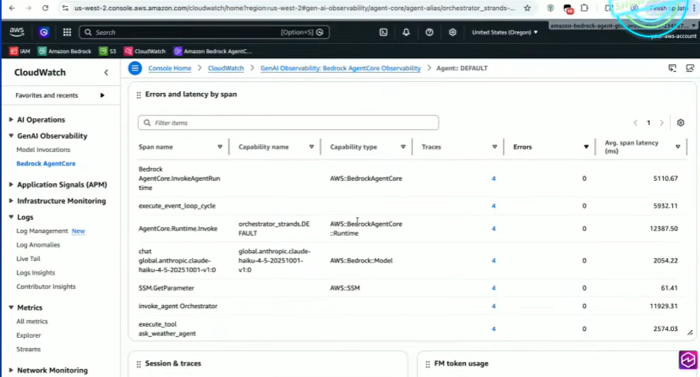

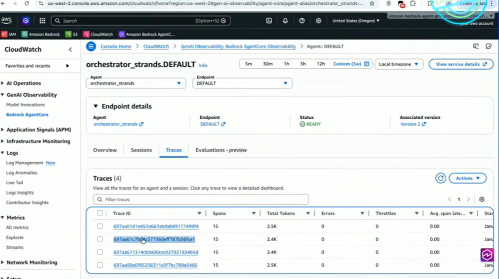

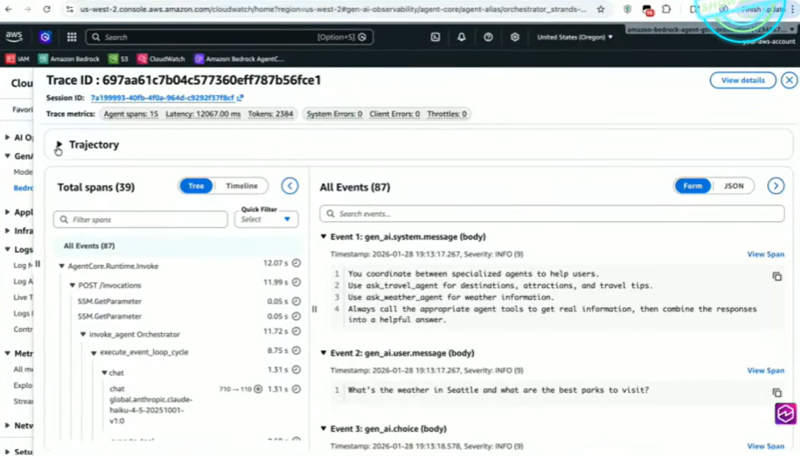

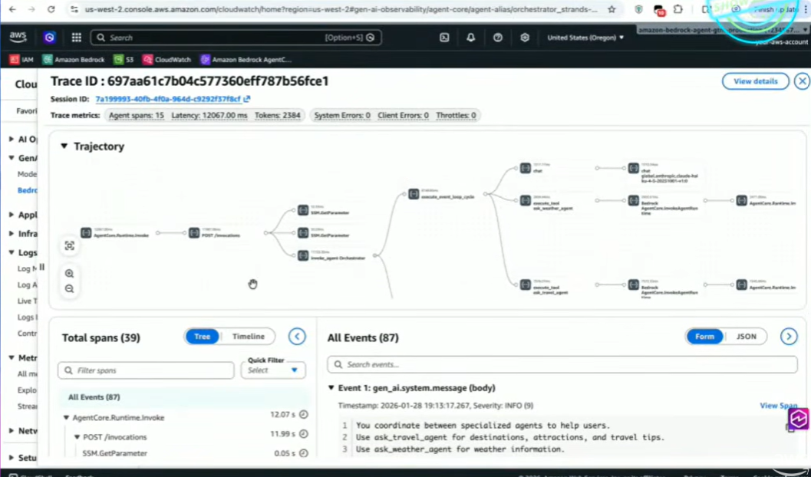

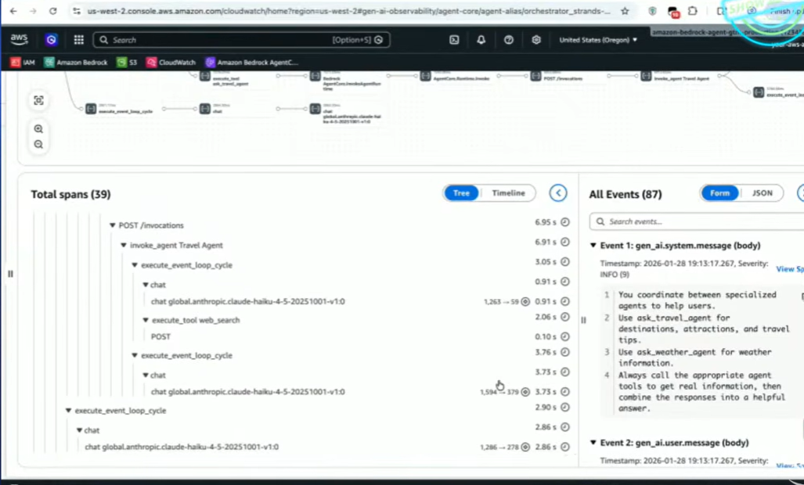

What to notice: **one trace ID** contains the orchestrator's Strands spans (agentic loop, `execute_event_loop_cycle`), the Runtime's service-emitted `InvokeAgentRuntime` spans, *and* the LangGraph sub-agent's spans from a different runtime. 15 spans on the orchestrator side, 13 on the LangGraph side — stitched end to end.

### Why it matters

Pete's stakeholder-trust point: this is the answer to the *"agents are a black box"* objection. You can walk a business user through the trajectory view and show each step, each tool, each handoff — instead of raw logs.

### Key takeaway

> **Distributed tracing is what makes multi-agent systems operable: three runtimes, two frameworks, one trace ID — plus a locally hosted agent in the same dashboard.**

---

## 10.15 From Telemetry to Action — Metrics, Dashboards and Alarms

### What the speaker explains

The last mile: turning spans into **operational signals**. Because everything flows through CloudWatch, all the standard machinery applies.

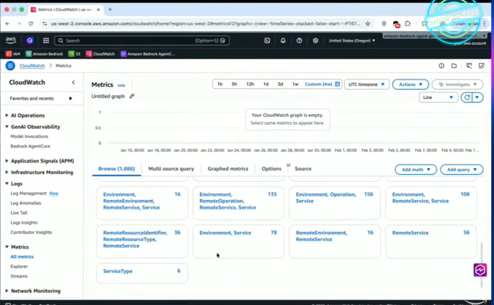

### Technical explanation — the four routes to an answer

| Route | When to use it |
|---|---|
| **Dashboards** | "Is the fleet healthy?" — aggregate metrics per agent/resource |
| **Trace detail + timeline** | "Why was *this* request slow?" — the waterfall pinpoints the span |
| **Metrics over time** | "Is this a systemic pattern or a one-off?" — establish baselines |
| **Logs Insights on `aws/spans`** | "Find me every span where X" — query spans like log records |

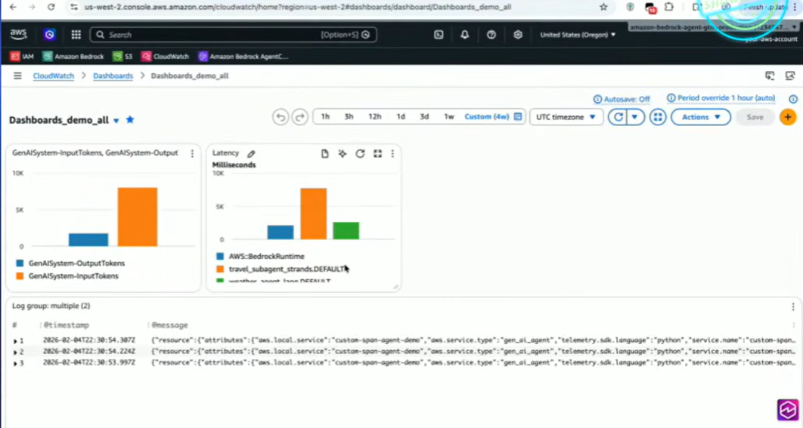

The latency dashboard above compares the three agents side by side: orchestrator, travel sub-agent, weather sub-agent — plus input/output token counts. This is the *"all the agents seem slow today"* investigation made visual: **which agent, which span, which hop**.

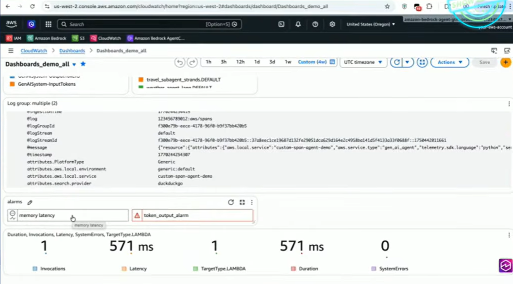

### Baggage → queryable attributes

The payoff of §10.11: custom baggage attributes (like `search.provider=duckduckgo` here) become **queryable fields** in Logs Insights — so you can ask questions like *"which web-search provider answers fastest?"* or *"which tenant is burning tokens?"*

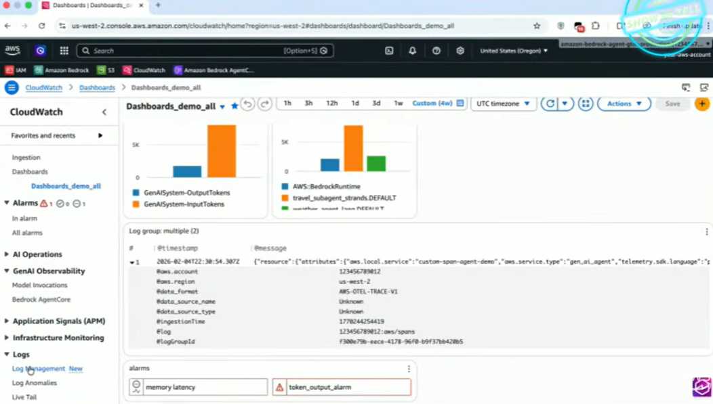

### Alarms

CloudWatch alarms on any emitted metric: a memory resource taking too long, token usage spiking from one agent ARN, error rate climbing. The demo shows `memory latency` (OK) and `token_output_alarm` (firing on `GenAISystem-OutputTokens > 100`).

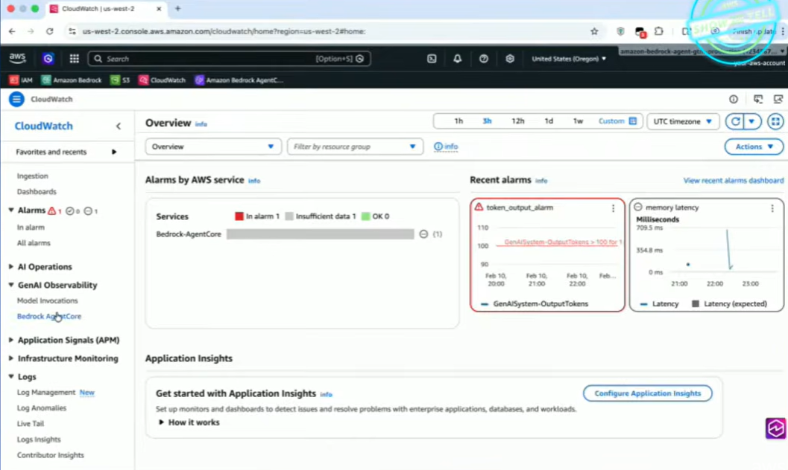

### Key takeaway

> **Telemetry is only as good as the action it triggers: dashboards for patterns, timelines for single requests, Logs Insights for needle-in-haystack searches, alarms for paging.**

---

## 10.16 Where It All Converges — Unified Telemetry and Evaluations

### What the speaker explains

The synthesis slide ties the chapter together: **three telemetry sources** — your agent's framework spans, the managed services' own telemetry, and tool-level data — all normalized into one system. — and crucially, **latency isn't just a framework problem**: runtime hops, gateway calls and memory operations all contribute, which is why the unified view exists.

The data also **powers AgentCore Evaluations**: at production scale with thousands of agent instances, you can't eyeball traces — evaluations run automated quality scoring on the same telemetry, surfacing correctness/helpfulness regressions continuously. (The next episode is the evaluations deep dive.)

### Why it matters

This is the closing argument for "observability-first": the same data that debugs a single bad answer also feeds automated quality monitoring at fleet scale.

### Key takeaway

> **Observability data isn't just for debugging — it's the substrate evaluations run on. Instrument once, get debugging AND continuous quality scoring.**

---

## 10.17 Wrap-Up — Start Building

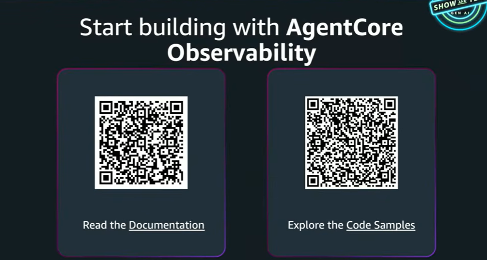

### What the speaker explains

Rajes' closing: *"The data that you collect makes or breaks your agent quality"* — and everything shown is production-ready today, built on open standards. The docs and samples are live; the same observability extends to the rest of the AgentCore services (Memory, Gateway, Identity, built-in tools).

<Conversation title="The Episode, As a Conversation" speakers={[{"id":"learner","name":"You","role":"Learner","side":"left","color":"#3b82f6"},{"id":"rajes","name":"Rajes","role":"AgentCore Observability","side":"right","color":"#f97316"},{"id":"madu","name":"Madu","role":"GenAI Observability","side":"right","color":"#22c55e"},{"id":"pete","name":"Pete","role":"Host","side":"right","color":"#a855f7"}]} messages={[{"who":"learner","text":"What do I actually need to make my local agent observable?"},{"who":"rajes","text":"Four things: enable CloudWatch Transaction Search, install the AWS OTel distro plus your framework's OTel extension, set the environment variables (log group, service.name, AGENT_OBSERVABILITY_ENABLED), then run under opentelemetry-instrument. No code changes."},{"who":"learner","text":"And if my agent runs on AgentCore Runtime instead?"},{"who":"madu","text":"Even less work — the starter toolkit wraps the container's start command in opentelemetry-instrument for you. Separately, flip on log delivery and tracing per resource in the console to get the service-emitted telemetry: runtime invocations, memory ops, gateway calls."},{"who":"learner","text":"How do spans from a LangGraph agent end up in the same trace as my Strands orchestrator?"},{"who":"rajes","text":"Trace ID propagation. The originator creates the trace ID; OTel injects it into headers on every call — HTTP, gRPC, Kafka, databases. Every OTel-aware receiver emits child spans with the same ID. All spans land in aws/spans, so the system reassembles the end-to-end view across runtimes and frameworks."},{"who":"learner","text":"What about PII in all those spans?"},{"who":"madu","text":"Two layers. Bedrock Guardrails protect the model interaction itself; CloudWatch data protection policies mask managed identifiers or custom regex matches at the log group — including the vended runtime logs. Use the mature AWS machinery, don't reinvent it for agents."},{"who":"learner","text":"What's the thing people miss about sessions?"},{"who":"pete","text":"There are two. Runtime session IDs are the microVM isolation boundary — platform tenancy. Your OTel session.id is application context you propagate through baggage. Same word, different layer — the dashboards show both."},{"who":"learner","text":"So what does all this data buy me long term?"},{"who":"rajes","text":"Debugging today, quality at scale tomorrow. The same telemetry feeds AgentCore Evaluations — automated scoring across correctness and quality criteria. Data collection is what makes or breaks agent quality; everything else builds on it."}]} />

---

## 🧠 Knowledge Check

<Quiz question="Your locally hosted agent shows no spans in the GenAI Observability dashboard, though the code runs fine. What is the most likely missing prerequisite?" options={["The agent lacks a Bedrock Guardrail","CloudWatch Transaction Search is not enabled","The agent must be deployed to AgentCore Runtime first","The model does not support tool use"]} answerIndex={1} explanation="Transaction Search is the one-time account/region prerequisite that ingests OTLP spans into the aws/spans log group. Without it, even a perfectly instrumented agent's spans have nowhere to land. Runtime hosting is NOT required — the demo shows a locally hosted agent (Environment: other) in the same dashboard." />

<Quiz question="In the dashboards you see two different 'session' counts — one in the agent view and one in runtime metrics. What distinguishes them?" options={["They are the same metric with different aggregation windows","Runtime session IDs mark microVM isolation boundaries; the OTel session.id is application-level context you propagate via baggage","One counts successful sessions, the other failed","Runtime sessions only apply to LangGraph agents"]} answerIndex={1} explanation="The episode calls this out explicitly: Runtime session IDs reflect AgentCore's per-session microVM isolation (platform tenancy), while session.id in spans is your own conversation identifier propagated via OTel baggage. Same word, different layer." />

<Quiz question="How do spans from a LangGraph sub-agent on Runtime #3 end up in the same trace as the Strands orchestrator on Runtime #1?" options={["They share a VPC so CloudWatch merges them","The orchestrator manually copies span data into its logs","The originator's trace ID propagates via OTel context headers across runtimes; all spans share that trace ID","The starter toolkit merges traces at deploy time"]} answerIndex={2} explanation="OTel injects the originating trace ID into request headers (HTTP, gRPC, Kafka, DB calls). Every OTel-aware receiver emits child spans carrying the same ID, and since all spans land in aws/spans, the system reassembles the end-to-end view — across runtimes AND frameworks." />

<Quiz question="An engineer proposes writing a custom sanitizer to strip PII from agent spans before export. What does the episode recommend instead?" options={["Disable tracing on any agent that touches PII","CloudWatch data protection policies on the log group plus Bedrock Guardrails at the model layer","Encrypt the spans with KMS before export","Route logs through a Lambda redactor"]} answerIndex={1} explanation="The guidance is to use mature AWS machinery, not reinvent it: Guardrails protect the interaction at the model call, and CloudWatch Logs data protection policies mask managed identifiers (email, phone, name) or custom regexes at the log group — including vended runtime logs." />

<Quiz question="Which combination produces the unified per-request view in AgentCore Observability?" options={["Only framework-emitted spans — service logs are a separate product","Only service-emitted telemetry from the console toggles","Framework-emitted spans (agent loop, tools, model calls) joined with service-emitted telemetry (Runtime invocations, Memory ops, Gateway calls) via the shared trace ID","CloudWatch RUM client events plus X-Ray sampling"]} answerIndex={2} explanation="Two streams merge on one trace ID: your framework's OTel spans (invoke_agent, chat, execute_tool) and the platform's service-emitted spans (InvokeAgentRuntime, memory create_event, gateway calls) — which is why the demo trace shows both execute_event_loop_cycle and InvokeAgentRuntime spans together." />

<Quiz question="Why would you set a business key like tenant.id in OTel baggage rather than as a span attribute?" options={["Baggage is encrypted; attributes are not","Baggage propagates automatically to every downstream span and service, and becomes a queryable field — attributes apply to one span only","Baggage reduces CloudWatch costs","Attributes can't hold custom keys"]} answerIndex={1} explanation="Baggage rides in request headers alongside the trace context, so a value set once at the edge appears on every child span — including spans emitted by other services and frameworks. In CloudWatch it surfaces as a queryable attribute, enabling questions like 'which tenant is consuming the most tokens?'" />

---

## 🧪 Practical Lab — Instrument an Agent End to End

### Goal

Take a Strands agent from zero telemetry to a fully traced, alarmed deployment — reproducing the chapter's two paths (local ADOT instrumentation and Runtime hosting).

### Steps

1. **Enable the backend** — in CloudWatch → X-Ray, turn on **Transaction Search** for your account/region. Note the `aws/spans` log group it creates.
2. **Clone the observability sample** — get `awslabs/agentcore-samples` → `01-features/06-observe-evaluate-optimize-your-agent/01-observe/` (the modern home of the tutorial folder from the episode).
3. **Set the environment contract** — copy `.env.example`: `OTEL_PYTHON_DISTRO=aws_distro`, `OTEL_EXPORTER_OTLP_LOGS_HEADERS` with your log group/stream/metric namespace, `OTEL_RESOURCE_ATTRIBUTES=service.name=<your-agent>`, `AGENT_OBSERVABILITY_ENABLED=true`.
4. **Run locally under ADOT** — `opentelemetry-instrument python custom_span_creation.py --session-id demo-001`. In the dashboard, find your agent (Environment: `other`), open its trace, and confirm the custom `travel_agent_session` span wraps model/tool child spans.
5. **Add baggage** — run `baggage_context.py` with `--tenant-id`; then query `aws/spans` in Logs Insights for spans carrying `attributes."tenant.id"`.
6. **Deploy to Runtime** — use the starter toolkit (`agentcore configure`/`launch`) on `travel_agent.py`. Verify the generated Dockerfile wraps the start command in `opentelemetry-instrument`, then flip on **log delivery** and **tracing** for the runtime resource in the console.
7. **Correlate the two layers** — invoke the runtime agent and find the trace containing both `invoke_agent`/framework spans *and* the service-emitted `InvokeAgentRuntime` span.
8. **Protect the data** — apply a CloudWatch data protection policy (managed PII identifiers) to the runtime's `/aws/bedrock-agentcore/runtimes/<id>-DEFAULT` log group; re-invoke with a PII-bearing prompt and confirm masking.
9. **Alarm on it** — create a CloudWatch alarm on a GenAI metric (e.g. output tokens or latency for your agent ARN); trigger it, then find the offending span in the trace timeline.

### Success criteria

- A locally instrumented agent appears in the GenAI Observability dashboard (Environment: `other`) with correct `service.name`.
- One trace ID shows both framework spans and service-emitted spans.
- `session.id`/`tenant.id` baggage is queryable in Logs Insights.
- PII in logs is masked by the data protection policy.
- At least one alarm fires and you can trace the cause to a specific span.

---

## 🎤 Interview Preparation

### Q: Why does agent observability differ from traditional APM?

**Answer**: Agents are non-deterministic — the same prompt can take a different reasoning path per run (different tools, different loops, different sub-agents). Classic APM tells you a function ran; agent observability must capture the *trajectory*: which model calls, which tools, what the model saw at each step. That is why the trace — not the log line — is the atomic unit.

### Q: Walk me through instrumenting a self-hosted agent for AgentCore Observability.

**Answer**: Four steps: (1) enable CloudWatch Transaction Search (one-time, per account/region — creates the `aws/spans` ingestion path); (2) install `aws-opentelemetry-distro` plus the framework's OTel extension (e.g. `strands-agents[otel]`); (3) set the env vars — `OTEL_PYTHON_DISTRO=aws_distro`, `OTEL_EXPORTER_OTLP_LOGS_HEADERS` (log group/stream/metric namespace), `OTEL_RESOURCE_ATTRIBUTES=service.name`, `AGENT_OBSERVABILITY_ENABLED=true`; (4) launch under `opentelemetry-instrument`. No application code changes.

### Q: What changes when the agent runs on AgentCore Runtime instead?

**Answer**: The starter toolkit bakes instrumentation into deployment — the generated Dockerfile wraps the start command in `opentelemetry-instrument`, so no env-var wiring is needed. Separately you enable the service-emitted telemetry: log delivery and tracing toggles per resource (runtime, memory, gateway) in the console.

### Q: Explain the two telemetry sources and why both matter for diagnosing latency.

**Answer**: Framework-emitted spans cover agent semantics — the agentic loop, model calls, tool executions, custom spans. Service-emitted telemetry covers the platform — `InvokeAgentRuntime`, memory `create_event`, gateway calls, microVM sessions. Latency can live in either: a slow memory operation or gateway hop is invisible in framework spans alone. Both share the trace ID, so one trace shows the total.

### Q: How does a trace span multiple runtimes and frameworks?

**Answer**: OTel context propagation. The originator creates a trace ID and OTel injects it into transport headers — HTTP, gRPC, Kafka, DB calls. Each OTel-aware receiver emits child spans carrying the same trace ID; all spans land in `aws/spans` and are reassembled into the end-to-end view. The demo stitches a Strands orchestrator, a Strands sub-agent and a LangGraph sub-agent — three runtimes, two frameworks, one trace.

### Q: What is OTel baggage and give two concrete uses.

**Answer**: User-defined key/value pairs propagated in headers with the trace context. Set once at the edge, inherited by every downstream span. Uses: `session.id` correlating all spans in a conversation (the demo's core pattern), and business attributes like `tenant.id` for per-tenant filtering/cost analysis — they become queryable fields in Logs Insights.

### Q: Two layers protect sensitive data in traces/logs. Name them and when each applies.

**Answer**: Bedrock Guardrails — applied at the model call; anonymizes/blocks PII and enforces content policy *before* data enters logs. CloudWatch Logs data protection policies — attached to a log group; managed identifiers (email, phone, name, SSN) or custom regexes are masked at write time, covering vended runtime logs and your own application logs. Defense in depth: interaction layer and storage layer.

### Q: A stakeholder says "agents are a black box." What do you show them?

**Answer**: The trajectory view in GenAI Observability — a rendered DAG of the actual execution path: model calls, tool invocations, sub-agent handoffs, per-span latency and the events/attributes on each step. Walk one trace end to end; it reads like a flow diagram of what the agent did, not raw logs.

### Q: "All agents seem slow today." How do you localize the cause?

**Answer**: Four paths the episode lays out: custom dashboards comparing per-agent latency and token metrics (is it one agent or fleet-wide?); the trace timeline to find the specific slow span within a request; metrics-over-time to separate systemic regression from a one-off spike; and Logs Insights on `aws/spans` filtered by attributes (agent ARN, baggage keys) to hunt specific patterns. Alarms on GenAI metrics catch the next one automatically.

### Q: How does observability relate to AgentCore Evaluations?

**Answer**: Evaluations consume the same telemetry — traces, spans, and their attributes — to score agent behavior automatically (correctness, quality criteria) at fleet scale. Observability is the data substrate; evaluations turn it into continuous quality monitoring so you don't eyeball thousands of traces.

---

## 🏁 Chapter 10 Summary

| Concept | What it is | Key detail |
|---|---|---|
| **Why observability** | Agents are non-deterministic — trajectories, not just answers | quality is the competitive differentiator |
| **Architecture** | Purpose-built agent observability on CloudWatch, all OTel | open standard, no lock-in, OTLP export anywhere |
| **Local setup** | Transaction Search + ADOT env vars + `opentelemetry-instrument` | zero code changes; `service.name` = dashboard identity |
| **Runtime path** | Starter toolkit wraps the container CMD in `opentelemetry-instrument` | env contract handled for you |
| **Service telemetry** | Per-resource console toggles: log delivery + tracing | Runtime/Memory/Gateway emit their own spans & metrics |
| **Span model** | traceId + spanId/parentId + events + attributes + baggage | sessions→traces→spans→sub-spans |
| **Propagation** | Trace ID in W3C headers; works over HTTP/gRPC/Kafka/DB | one trace across runtimes & frameworks |
| **Baggage** | Custom context (`session.id`, `tenant.id`) riding the headers | set once, lands on every span, queryable |
| **Two sessions** | Runtime session = microVM tenancy; OTel session.id = your app context | same word, different layer |
| **PII** | Guardrails at the model + CW data protection on log groups | managed identifiers + custom regex masking |
| **Dashboards** | Agents, Sessions, Traces, Memory, Tools, Gateways tabs | trajectory + tree views, per-span latency |
| **Action layer** | Custom dashboards, Logs Insights on `aws/spans`, CW alarms | alarms on GenAI metrics (tokens, latency) |
| **Evaluations** | Automated quality scoring on the same telemetry | data collection makes or breaks agent quality |

## 🔗 Official AWS Resources

- 📘 [Get started with AgentCore Observability](https://docs.aws.amazon.com/bedrock-agentcore/latest/devguide/observability-get-started.html) — the setup guide (Transaction Search, ADOT env vars)
- ⚙️ [Configure AgentCore Observability](https://docs.aws.amazon.com/bedrock-agentcore/latest/devguide/observability-configure.html) — dashboards, log delivery, tracing toggles
- 🧪 [awslabs/agentcore-samples — observability tutorials](https://github.com/awslabs/agentcore-samples/tree/main/01-tutorials/06-AgentCore-observability) — the sample set from this episode *(note: the repo has since been restructured — the same samples now live under `01-features/06-observe-evaluate-optimize-your-agent/01-observe/` and `01-features/02-host-your-agent/01-runtime/01-hosting-agents/04-observability-with-strands/`; the chapter's explorers point at the current paths)*
- 🌐 [AWS Distro for OpenTelemetry](https://aws-otel.github.io/) — the ADOT distribution used throughout
- 🧪 [agentcore-samples — repository root](https://github.com/awslabs/agentcore-samples) — all AgentCore sample code
- 📺 **Same episode, second treatment** — the `aws-agentcore` composite course also covers this video as *EP 09 — Observability* (`doc_agentcore_observability/`, 3 chapters: OTel spans/traces, the CloudWatch GenAI dashboard, third-party APM export)

### 🎬 Watch the Original Episode

<VideoSection youtubeId="wWQgawUPr1k" title="AgentCore Observability: Monitor and debug AI Agents with OpenTelemetry | AWS Show & Tell — the source episode for this chapter" />
