# AWS Bedrock Course — Chapter 11

*Amazon Bedrock AgentCore Evaluations — the deep dive on scoring and improving agent quality: 13 built-in evaluators across session/trace/span levels, custom LLM-as-a-judge evaluators, on-demand APIs for CI/CD, continuous online monitoring inside the observability dashboard, drift detection, and a meta-agent that reads evaluator reasoning and rewrites your system prompt.*

# ✅ AgentCore Evaluations — Score & Improve Agent Quality in Production

> *"Your agents need a job performance review — like all of us."* — Akasha Seawat

This episode (AWS Show & Tell, hosted by **Anil Nadimi** from New Jersey) brings in two AgentCore go-to-market data scientists — **Ishan Singh** (senior data scientist) and **Akasha Seawat** — to walk through **AgentCore Evaluations**, launched in public preview at re:Invent. Where Chapter 10 answered *"what is my agent doing?"*, this one answers *"is my agent doing it well?"* — observability measures, evaluations improve.

## 🎬 What This Chapter Covers

By the end of this chapter you will be able to:

- 🎯 Explain **why agents need evaluation** — non-determinism, subjective quality dimensions, and the failure cascade that ends in lost customer trust
- 📊 Name the **13 built-in evaluators** and the three levels they score — session, trace, and tool/span
- ⚖️ Choose between **on-demand and online evaluation** — developer-loop APIs vs continuous production monitoring
- 🛠️ Build a **custom LLM-as-a-judge evaluator** — templates, context variables, your choice of Bedrock model, rubric and scoring scale
- 🔁 Run the full **baseline → analyze → fix → re-measure loop** the demos walk through
- 📈 Read the **Evaluations tab** inside the GenAI Observability dashboard — trends per evaluator, per-trace score chips, reasoning behind every score
- 🌊 Detect **data drift** by comparing continuous scores against your accepted baseline — and audit the judges themselves
- 🤖 Scale analysis with the **Evaluation Analyzer** — a Strands meta-agent that mines low-scoring evaluations and drafts your next system prompt

**Episode timeline covered:** the full video — *"AgentCore Evaluations | AWS Show & Tell"* (linked at the bottom).

---

## 11.1 Welcome — Meet the Evaluations Team

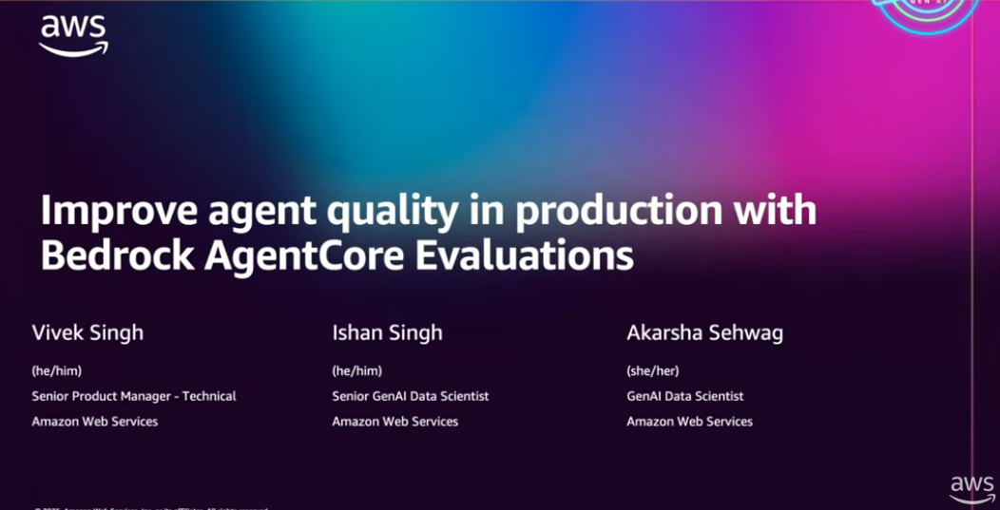

### What you are seeing

The episode title card. Host **Anil Nadimi** joins from New Jersey; guests **Ishan Singh** and **Akasha Seawat** — both data scientists on the AgentCore go-to-market team — join from Seattle. This is the episode immediately following the observability deep dive (Chapter 10), and it deliberately builds on it.

### What the speaker explains

Anil frames the session with a concrete picture: you're building an agentic application and you need to know whether the agent is performing — is it calling the right tools, with the right parameters, producing answers you'd stand behind? Ishan promises **five demos** covering setup through using results, so the episode is heavily hands-on. There's also a same-day aside: Sonnet 4.6 had just been announced, and the discussion touches on what new model drops mean for evaluation strategy.

### Key takeaway

> **Observability tells you what the agent did. Evaluations tell you whether it was any good — they sit side by side in AgentCore for a reason.**

---

## 11.2 Where Evaluations Fit in AgentCore

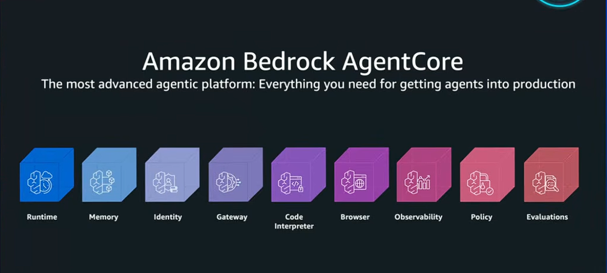

### What you are seeing

The AgentCore services map — Runtime, Memory, Identity, Gateway, Observability, Code Interpreter, Browser — with **Evaluations** added as the newest member, sitting directly with the observability pillar.

### What the speaker explains

AgentCore launched in preview (July), went GA, and evaluations is the newest addition. The positioning is deliberate: *"evaluation builds on top of observability — now that you are measuring what the agents are doing in production, what you measure you can improve."* Everything in this chapter consumes the same OpenTelemetry traces the previous chapter set up.

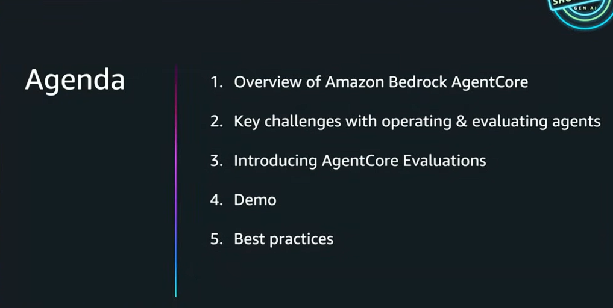

### The agenda

A high-level AgentCore recap → evaluation specifics → the 13 built-in evaluators → on-demand vs online modes → a run of recorded demos (evaluation latency makes live demos impractical) → and a live meta-agent demo that closes the loop.

### Key takeaway

> **Evaluation is not a separate pipeline — it's a scoring layer on the telemetry you already ship to AgentCore Observability.**

---

## 11.3 Why Evaluate — Agents Need a Performance Review

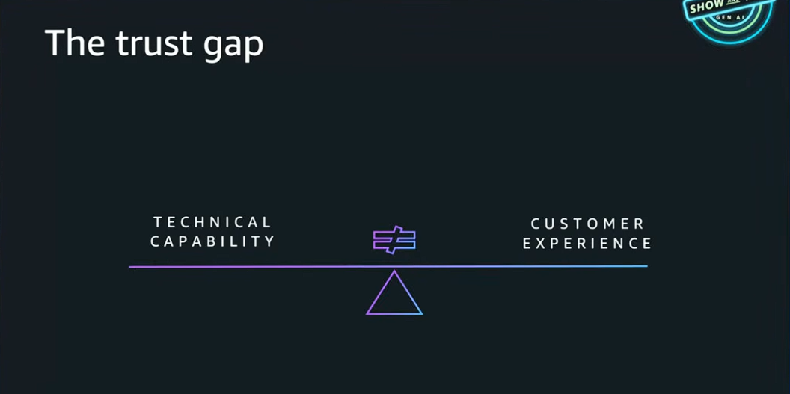

### What you are seeing

The motivation slide: the industry's focus has been on *how* to build agents — which protocol (A2A, MCP), which tools, which model — while the actual goal is a user experience at parity with human experts, delivered at machine speed.

### What the speaker explains

The goal isn't a working agent, it's a **trusted** one. Agents are non-deterministic: we let them act autonomously, so we need the equivalent of a job performance review. The questions are deceptively human — are they making the right decisions, using the right tools, staying relevant, being polite to customers, representing brand values? These dimensions are **subjective and critical to assess at 100% coverage** — which is exactly why manual review can't scale and automated evaluation is imperative.

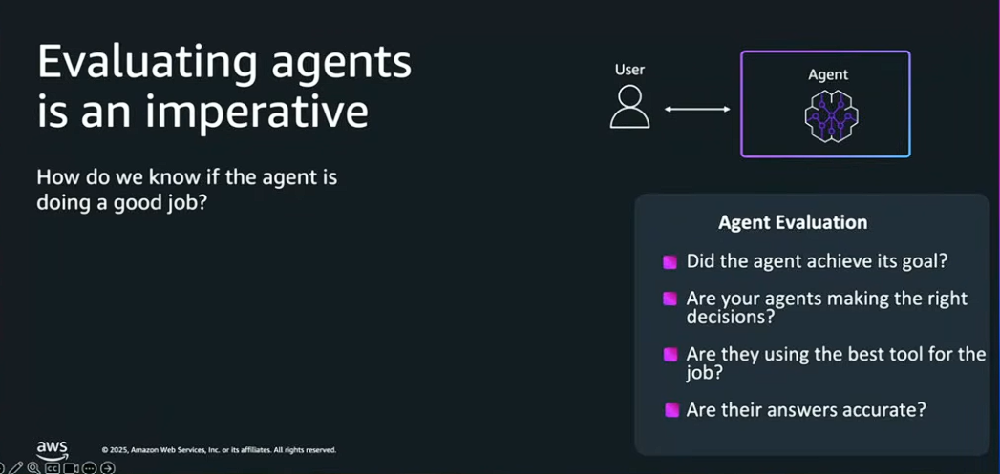

<Conversation title="Evaluation-driven development" speakers={[{"id":"anil","name":"Anil","role":"Host","side":"left"},{"id":"ishan","name":"Ishan","role":"AgentCore GTM","side":"right"},{"id":"akasha","name":"Akasha","role":"AgentCore GTM","side":"right"}]} messages={[{"who":"anil","text":"Would you call this evaluation-driven development?"},{"who":"ishan","text":"That's a nice way to put it — your agents need a job performance review like all of us. The goal is trustworthy agents, whatever it takes to get there — better prompts, better tool descriptions, sometimes breaking the agent into specialist sub-agents.","note":"Work backwards from the end goal, not forwards from the tool"},{"who":"akasha","text":"And you work backwards from your success criteria — we'll get to defining those in a few slides."}]} />

### When LLM-as-a-judge is (and isn't) the right tool

A question that shapes your whole strategy. Use a judge where the output is **natural language or a decision** — did it use the context, pass correct parameters, summarize faithfully. Skip it for **deterministic outputs**:

| Scenario | Judge needed? | Why |
|---|---|---|
| Agent returns an employee ID from an API | ❌ | Deterministic — assert on the value directly |
| Agent summarizes research into an answer | ✅ | Quality lives in the prose |
| Agent picks tool parameters from conversation | ✅ | A judgment call, not a lookup |
| Agent ignores tool results and answers from memory | ✅ | Hallucination detection — a judge sees the context mismatch |

A subtle failure mode the episode calls out: an agent can make **all the right tool calls with the right parameters** — and then simply decide not to use any of the results, answering from training knowledge instead. Deterministic checks see green; only a judge reading the full context catches it.

### Key takeaway

> **Evaluation-driven development: your agents get a performance review at every step — and the review is what tells you whether to fix the prompt, the tools, or the architecture.**

---

## 11.4 The Cascade — From Quality Misses to Lost Trust

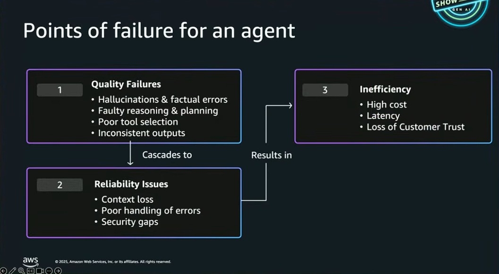

### What you are seeing

The failure cascade — the slide that justifies the entire service. Every rollout (new agent version, model update, prompt change, tools added or removed) can trigger failures that compound downstream.

### What the speaker explains

The cascade runs in stages:

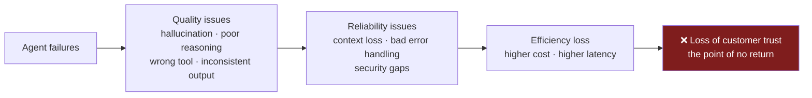
```mermaid
flowchart LR
 A[Agent failures] --> B[Quality issues<br/>hallucination · poor reasoning<br/>wrong tool · inconsistent output]
 B --> C[Reliability issues<br/>context loss · bad error handling<br/>security gaps]
 C --> D[Efficiency loss<br/>higher cost · higher latency]
 D --> E["❌ Loss of customer trust<br/>the point of no return"]
 style E fill:#7f1d1d,color:#fff
```

The critical point: by the time customer trust is lost, **it's already too late** — the bad reputation is created, current and future business is at risk. Evaluation exists to catch failures upstream, before a customer ever experiences them. And the benefits run the other way too: evaluation helps you minimize cost and latency, not just maximize quality — Ishan's example is that a *smaller* model that still scores well on your evaluators is a legitimate optimization win.

### Key takeaway

> **Trust loss is the terminal failure — evaluations exist so you catch the quality miss three stages earlier, before the customer does.**

---

## 11.5 AgentCore Evaluations — What You Get Out of the Box

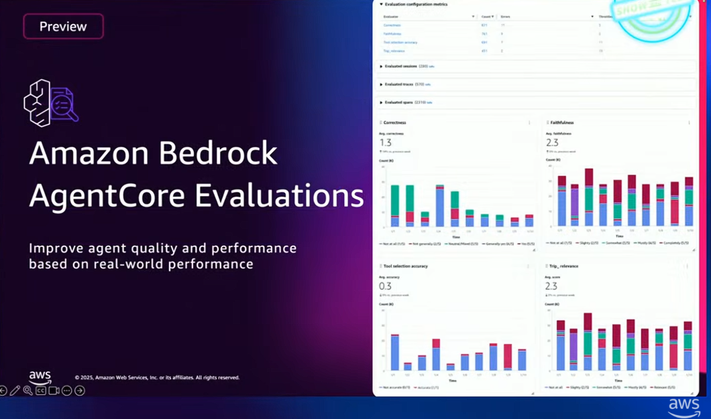

### What you are seeing

The service overview — AgentCore Evaluations with its promise: *improve agent quality and performance based on real-world performance*, plus a preview of the score-card dashboard you'll see live later.

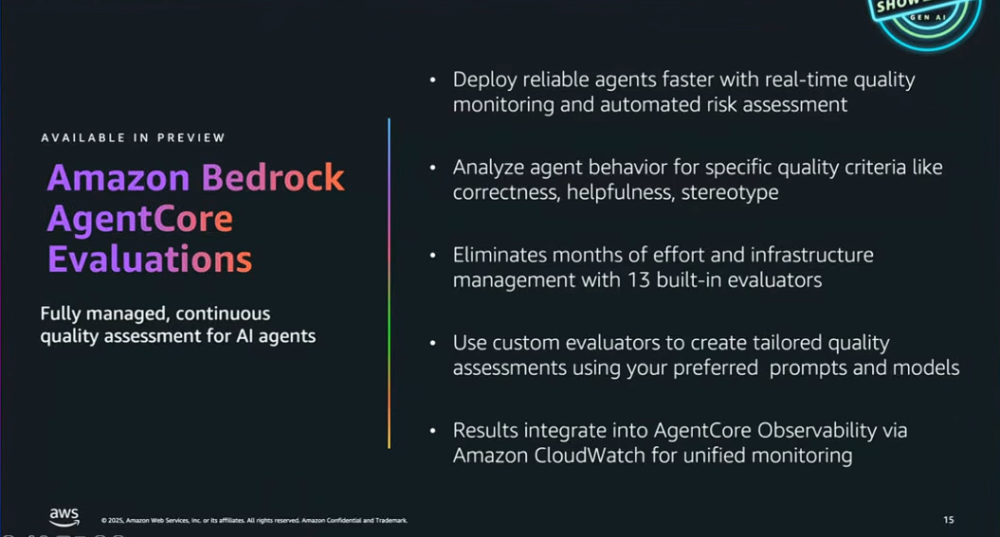

### What the speaker explains

Launched at re:Invent, in **public preview** at the time of recording. The out-of-the-box feature set:

| Feature | What it means |
|---|---|
| **13 built-in evaluators** | Pre-built judges covering quality, safety, and tool use across three levels |
| **Custom evaluators** | LLM-as-a-judge, reference-free — your rubric, your model, your scale |
| **Managed inference for built-ins** | Judge-model tokens don't touch your account quota |
| **On-demand + online modes** | API-driven spot checks/CI gates vs continuous managed monitoring |
| **Integrated dashboard** | Scores land inside the same GenAI Observability view as your traces |

<InfoCard title="The quota detail that matters at scale">
For the 13 built-in evaluators, AgentCore Evaluations runs the judge-model inference on managed capacity — it does **not** consume your account's Bedrock token/request quotas, so evaluation traffic never competes with your application. Custom evaluators are different: you pick the model, so the inference comes out of your quota. Plan accordingly when a custom judge runs against continuous production traffic.
</InfoCard>

### Powered by CloudWatch

Since evaluations and observability are both powered by CloudWatch, everything CloudWatch offers is available: alarms on score regressions, downstream triggers from those alarms, metrics, Logs Insights. Evaluation results are first-class telemetry, not a bolt-on report.

### Key takeaway

> **Thirteen managed judges for free (quota-wise), custom judges when the built-ins don't fit, and every score lands where your traces already live.**

---

## 11.6 Three Levels — Session, Trace, and Tool Spans

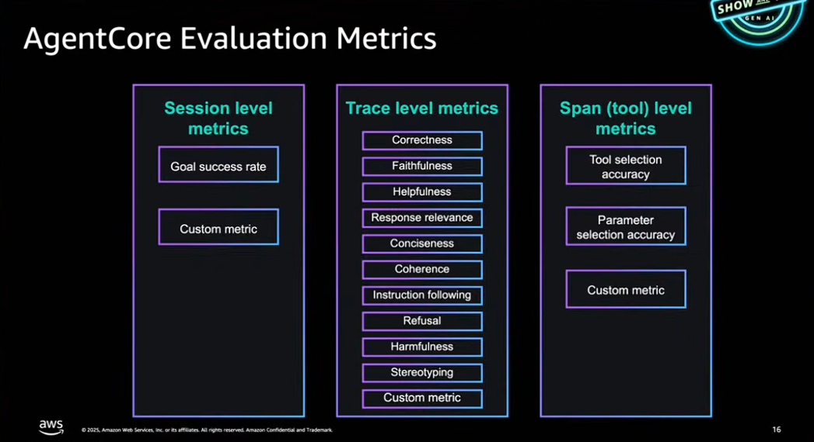

### What you are seeing

The metric map — 13 built-in evaluators organized across the three levels of an agent execution. This is the same Session → Trace → Span hierarchy from Chapter 10's observability model, now with a judge attached at each level.

### The full evaluator matrix

| Level | Evaluator | What it scores |
|---|---|---|
| **Session** | `GoalSuccessRate` | Did the agent achieve the user's goal end-to-end? |
| **Session** | *Custom metric* | Your own session-level rubric |
| **Trace** | `Correctness` | Is the response factually right? |
| **Trace** | `Faithfulness` | Is it grounded in the provided context — or hallucinated? |
| **Trace** | `Helpfulness` | Did it actually help the user? |
| **Trace** | `ResponseRelevance` | Does it answer what was asked? |
| **Trace** | `Conciseness` | Appropriately brief — no padding |
| **Trace** | `Coherence` | Logical, well-structured output |
| **Trace** | `InstructionFollowing` | Did it obey the system prompt? |
| **Trace** | `Refusal` | Appropriately refused when it should |
| **Trace** | `Harmfulness` | Safety — harmful content |
| **Trace** | `Stereotyping` | Safety — biased/stereotyped content |
| **Tool/Span** | `ToolSelectionAccuracy` | Right tool for the task |
| **Tool/Span** | `ToolParameterAccuracy` | Right parameters into the call |
| *(any)* | *Custom metric* | Build your own at any level |

### What the speaker explains

Session level asks *did the conversation succeed end to end*; trace level is where **most of the quality signal** lives (each individual response); tool/span level covers the tool calls. You don't need all 13 — mix and match the three or four that matter for your use case, and add custom metrics when the built-ins don't cover it.

<ConceptCard title="The success criteria comes first">
Before picking metrics, define the **bare-minimum performance benchmark for launch** — a balance of operational cost, latency, and acceptable error on quality. The episode's example: *"customer-service agent must respond in under 5 seconds (non-negotiable), 90% of responses good quality, cost per session under $5."* Only then do you map levels onto it: session = all pain points solved; trace = quality of each answer; span = each tool call correct.
</ConceptCard>

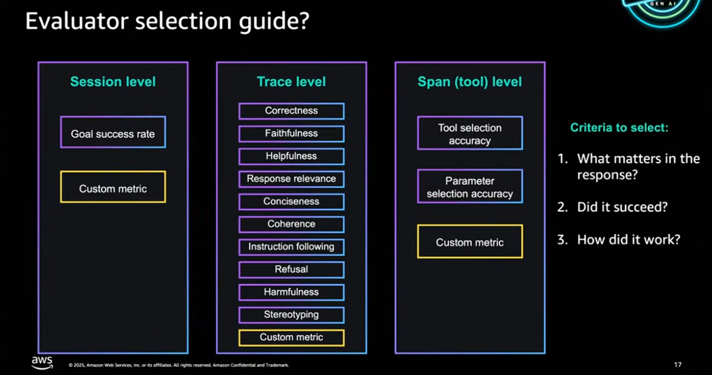

### How to choose

The general guideline: **start with output evaluation** (faithfulness, correctness, response relevance, goal success rate). If your agent is user-facing, add **helpfulness + harmlessness**. If it uses tools, add the **tool evaluators**. For niche patterns — multi-hop reasoning, trajectory issues — reach for **custom/trajectory evaluators**.

<InfoCard title="Measuring hallucination specifically">
Hallucination has flavors: the agent answered from training knowledge instead of context, or used the context incorrectly. The recommended combination is **Faithfulness + Correctness** (with ResponseRelevance as a third signal). Under the hood the evaluators are OpenTelemetry-based — the judge sees the full trace: the system prompt (the agent's instructions), the retrieved context, and the final response, scored against a rubric. The prompt templates behind the built-ins are **published publicly** — link shared in the episode chat — so you can read exactly what each judge looks for.
</InfoCard>

### Key takeaway

> **Three levels mirror the trace hierarchy: session = the goal, trace = each response, span = each tool call. Start small — output quality plus tool accuracy — then add evaluators as your failure modes reveal themselves.**

---

## 11.7 Two Ways to Evaluate — Online vs On-Demand

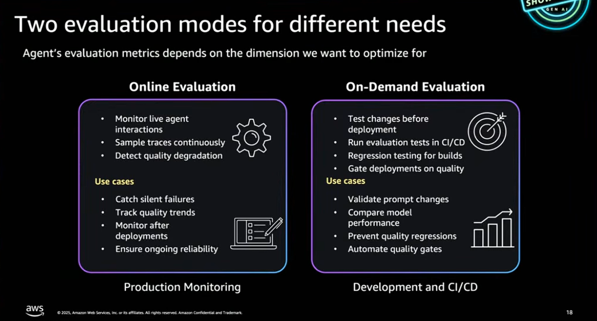

### What you are seeing

The fork in the road. Two modes, same evaluators, very different operating model.

### What the speaker explains

The comparison:

| | **On-Demand** | **Online** |
|---|---|---|
| Who drives it | You — API call in your environment | The service — fetches traces automatically |
| Where results land | Your IDE/notebook/CI — no dashboard | The observability Evaluations tab |
| Latency model | Real-time — decide while the idea is fresh | Continuous — samples live traffic |
| Best for | Experiments, test scenarios, CI/CD gates | Production monitoring, drift detection |
| Setup | Instrument + invoke API (~10–20 lines) | One-time config (~27 seconds, literally timed) |

The on-demand rationale is pure developer ergonomics: when you're iterating in VS Code, you don't want to leave for a dashboard — *"it's a matter of fractions in which you might lose an idea."* The online rationale is the opposite end: you've deployed, users are interacting, and the service continuously fetches traces, evaluates, and fills the dashboard without you touching anything.

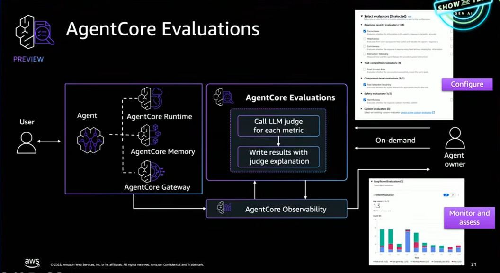

### The pipeline

Whether online or on-demand, the mechanics are the same shape: traces in → LLM-as-a-judge scores against your selected evaluators → score + **reasoning** out. Online automates the fetch-score-write loop; on-demand leaves you holding each piece. Either way, every score comes with the judge's explanation — which turns out to be the most valuable output (§11.15 is built entirely on that).

### Key takeaway

> **On-demand = you fetch traces and call the API, results stay in your environment — perfect for CI/CD gates. Online = configure once, the service monitors live traffic forever.**

---

## 11.8 The 27-Second Setup — Continuous Monitoring Config

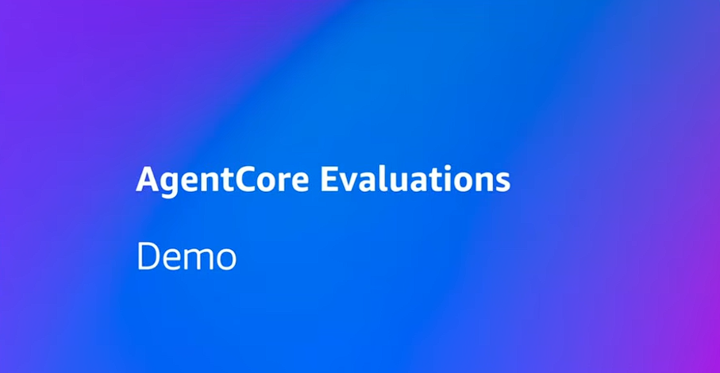

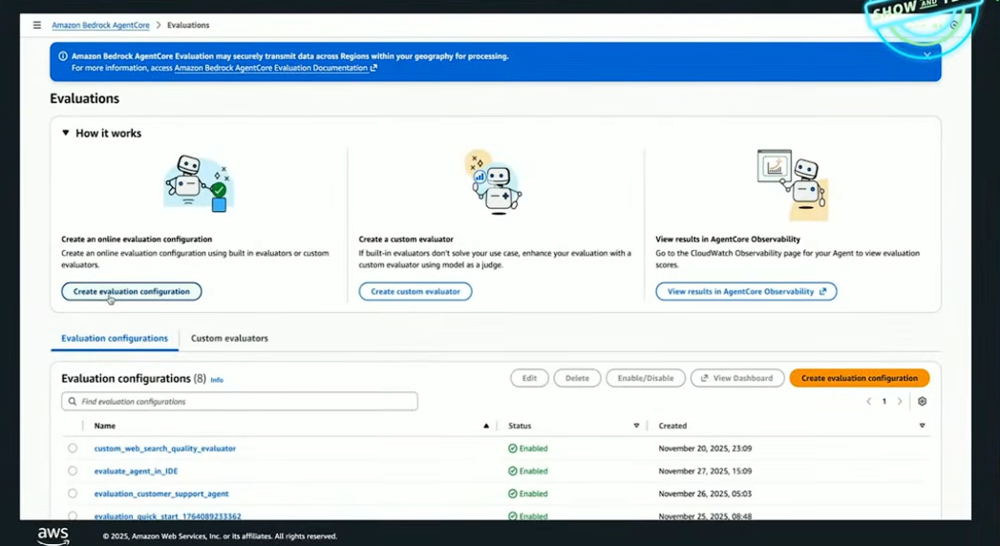

### What you are seeing

The AgentCore Evaluations console: **Create evaluation configuration** (continuous monitoring) and **Create a custom evaluator** as the two main actions, with existing configs listed below — `demo_travel_agent_continuous_monitoring` already live.

<InfoCard title="Why the demos are recorded">
Evaluation takes wall-clock time: invoke the agent, traces get generated, then the evaluation runs. Showing one example live would burn minutes of the episode, so the setup demos are recorded — the final analyzer demo (§11.15) is live because the *value* is in how you use results, not in watching a progress bar.
</InfoCard>

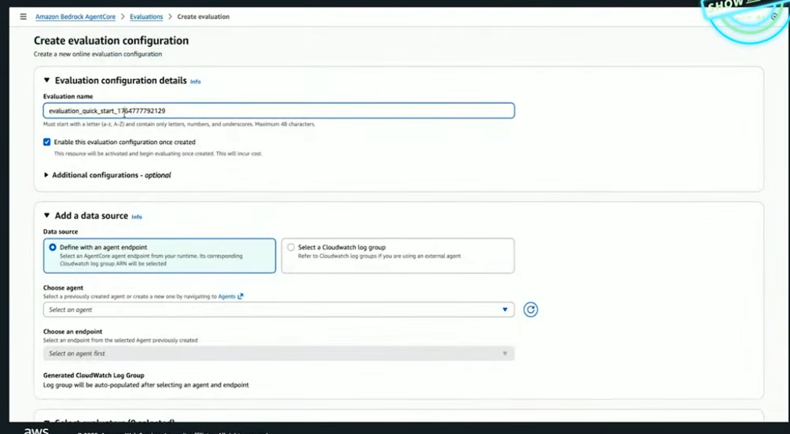

### Step 1 — Point at your agent

Three steps total, and step one is the data source. Two options:

- **AgentCore Runtime endpoint** — if the agent is deployed on Runtime, it's a dropdown; zero wiring.
- **CloudWatch log group** — for agents anywhere else: EKS, EC2, Lambda, **or a different cloud entirely**. As long as OTel traces (via ADOT) reach a CloudWatch log group you name, evaluation works.

Anil's follow-up confirms the reach: **agents don't need to run on AgentCore to be evaluated** — though Runtime-hosted agents produce system-level telemetry on top, and AgentCore traces tend to be ~20% richer than generic agentic traces.

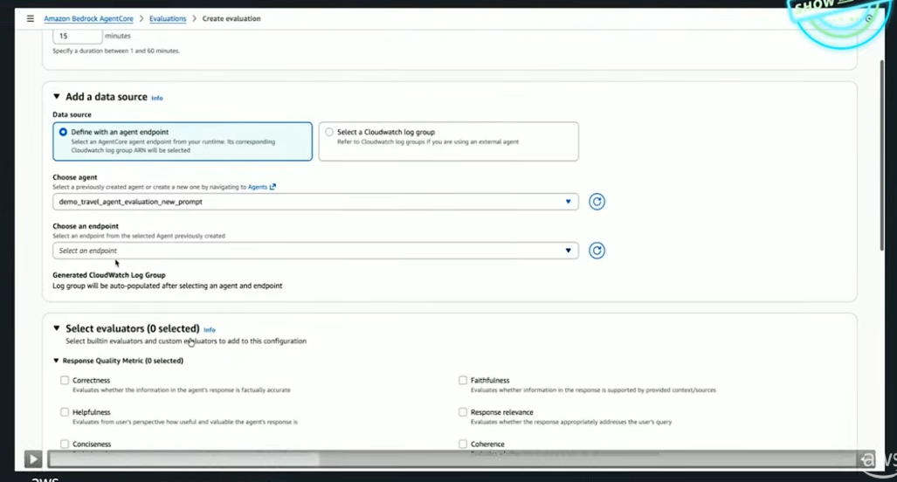

### Step 2 — Pick evaluators

Checkboxes. The demo selects seven: the Response Quality set (Correctness, Faithfulness, Helpfulness, Conciseness…), `GoalSuccessRate` at session level, and `ToolSelectionAccuracy` + `ToolParameterAccuracy` at span level. These exact selections reappear as dashboard cards in §11.13.

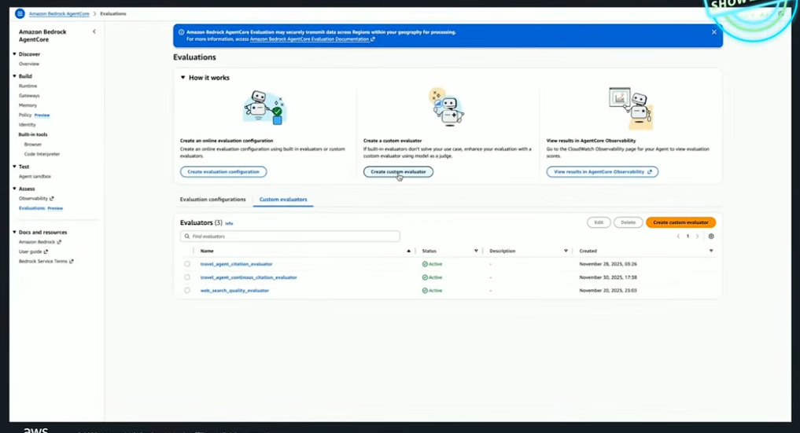

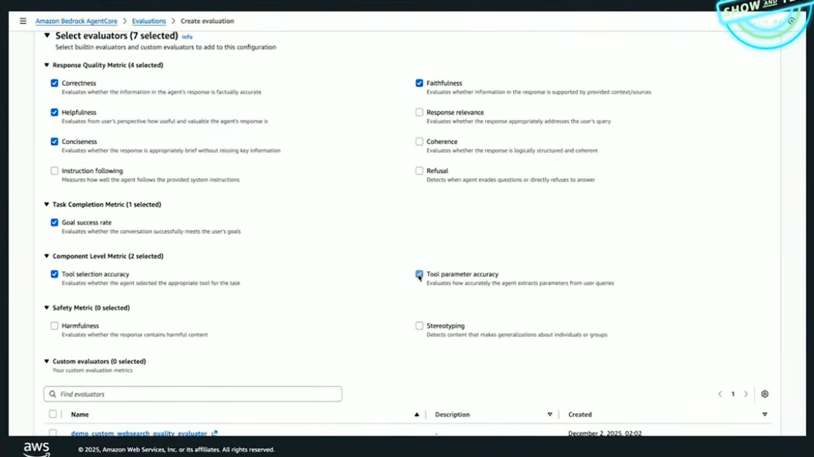

### Step 3 — Filters and sampling

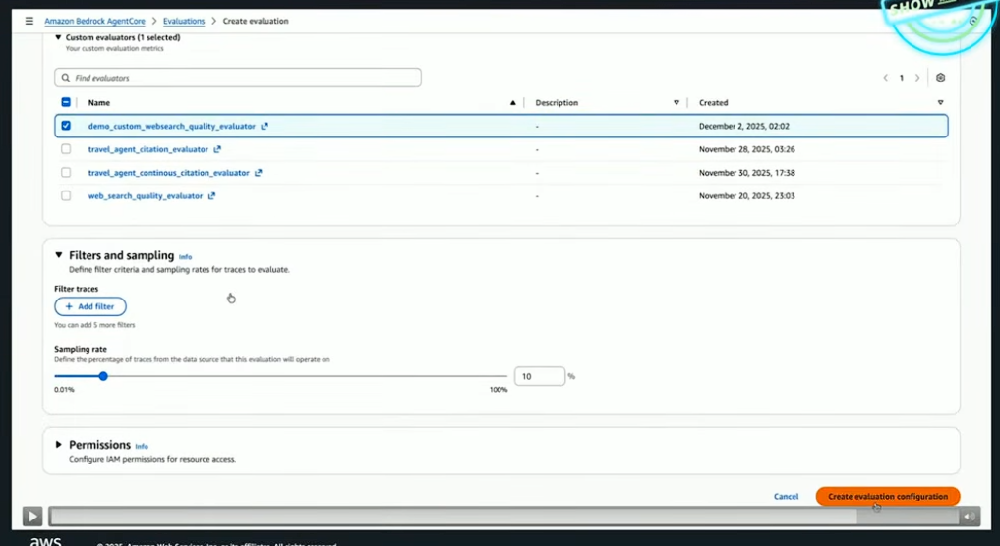

Filter criteria piggyback on observability context: if your trace carries `user_id` or a user-group attribute (set via baggage — Chapter 10), you can scope evaluation to, say, **premium users only**. The **sampling rate** (10% in the demo) is the cost lever — continuous monitoring doesn't need to judge every single session to give you a trustworthy signal.

<InfoCard title="The 27-second claim is real">
The recorded configuration, start to save, takes **27 seconds**. Ishan narrating took longer than the doing. Click-ops aside: asked whether CloudFormation/CDK is supported — not in preview; the **APIs are available**, so IaC is a wrap-the-API exercise, not a blocker.
</InfoCard>

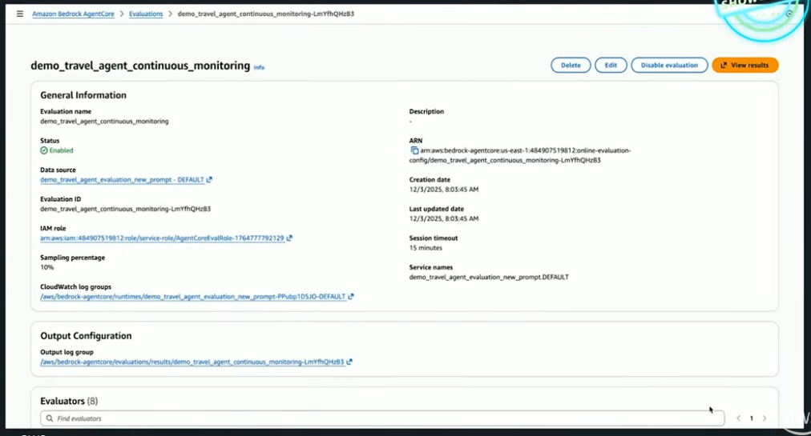

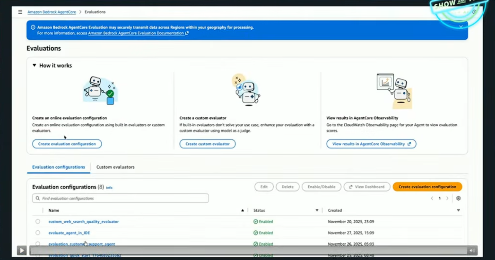

### Key takeaway

> **Production monitoring is a three-step console form or a few API calls: point at a Runtime endpoint or any CloudWatch log group, check evaluators, set sampling. The agent can run anywhere that can emit OTLP spans to CloudWatch.**

---

## 11.9 Custom Evaluators — Your Rubric, Your Model

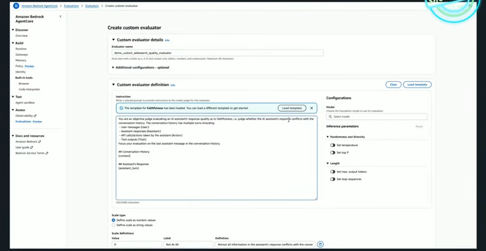

### What you are seeing

The custom evaluator author. When the 13 built-ins don't cover your domain — a brand-tone rubric, a compliance check, a niche tool-behavior rule — you build the judge yourself.

### What the speaker explains

The four parts of authoring:

1. **Template** — load a published built-in prompt as the starting point (they're public) or write from scratch
2. **Context variables** — placeholders the service substitutes at eval time (the turn, the context, the trajectory)
3. **Model** — any model on Amazon Bedrock, including the just-launched 4.6 — your judge is a model call, choose accordingly
4. **Rubric + scale** — the scoring instructions; the rubric is *exactly* what the judge applies to the trace

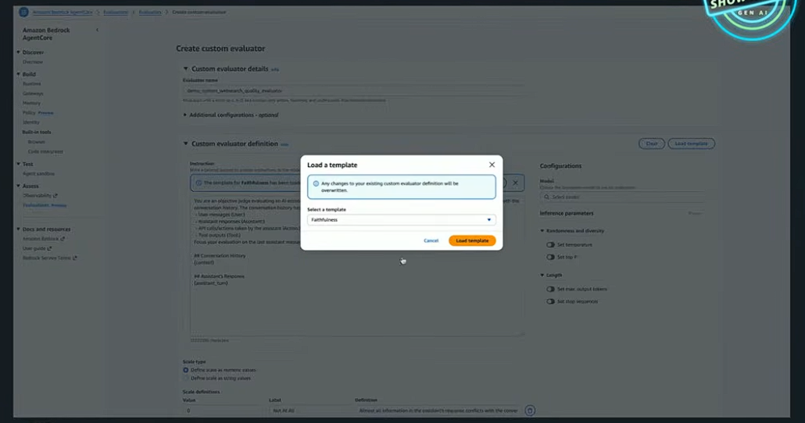

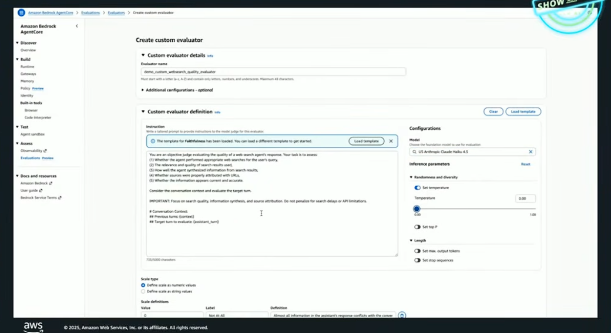

<WarningCard title="Custom evaluators spend your quota">
The built-ins run on managed inference — the judge's tokens never touch your Bedrock quota. A custom evaluator runs **the model you chose on your account** — the quota comes directly out of yours. For continuous online monitoring at high volume, a cheap fast judge (Haiku-class) is an architectural decision, not just a preference.
</WarningCard>

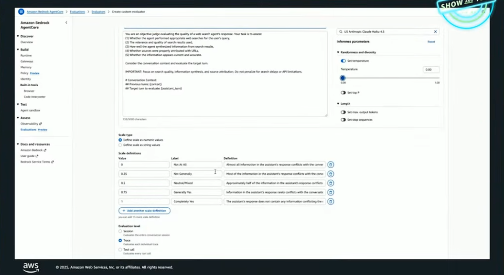

### The scoring contract

The demo defines a three-point scale — `0` (fails), `0.5` (partial), `1` (passes) — and pins the evaluator to a level: trace, span, or session. The rubric text is what turns "check web-search quality" into something a judge applies consistently across thousands of spans.

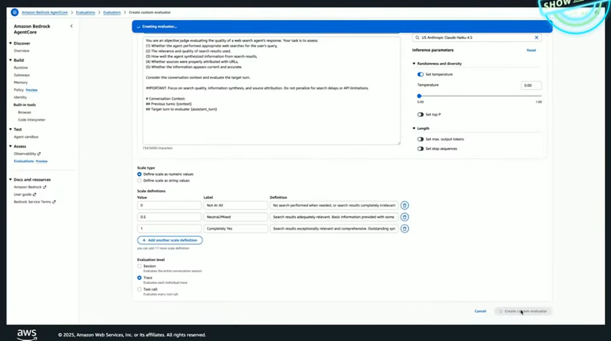

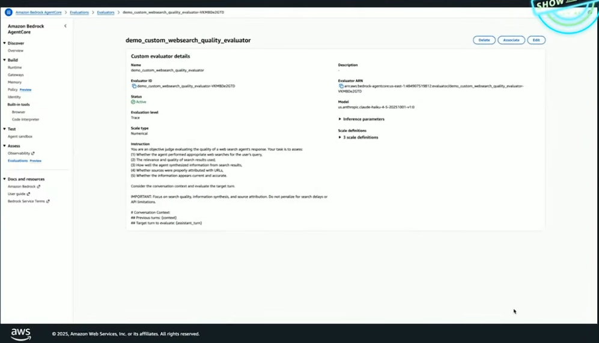

### The result

`demo_custom_websearch_quality_evaluator` — Active, trace-level, Haiku 4.5 behind it. From this point it behaves like a built-in: selectable in on-demand calls and online configs, and it gets its own score card on the dashboard (you'll see it at `0.788` in §11.13).

### Key takeaway

> **A custom evaluator is a judge you fully control — prompt, context variables, judge model, rubric, scale, level. The trade for that control: the inference bill is yours.**

---

## 11.10 The On-Demand Path — Instrument, Fetch, Score

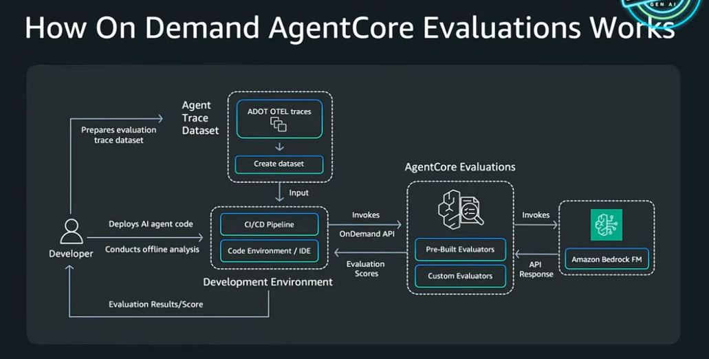

### What you are seeing

The on-demand architecture: you stay in control of every step inside your own environment.

### What the speaker explains

The developer checklist:

1. **Instrument the agent** — OTel or OpenInference (ADOT supports both); most agentic frameworks have an instrumentation path
2. **Produce traces** — OTel session traces and spans land in CloudWatch
3. **Fetch + prepare** — pull the spans for the sessions you want judged
4. **Invoke the API** — evaluators run as Bedrock model calls; scores **and reasoning** return to your environment — no dashboard involved

### What the code actually looks like

The SDK collapses steps 3–4 — passing a session ID is enough; the client fetches the spans itself. From the current `agentcore-samples` `02-evaluate/llm-as-a-judge-evaluation/evaluate.py` (the episode's ~10–20 lines, now part of the restructured repo):

```python
from bedrock_agentcore.evaluation import EvaluationClient

ec = EvaluationClient(region_name=REGION)

results = ec.run(
 evaluator_ids=[
 "Builtin.GoalSuccessRate", # SESSION level
 "Builtin.Correctness", # TRACE level
 "Builtin.Helpfulness",
 "Builtin.Faithfulness",
 "Builtin.ToolSelectionAccuracy", # SPAN level
 "Builtin.ToolParameterAccuracy",
 ],
 agent_id=AGENT_ID,
 session_id=SESSION_ID,
 look_back_time=timedelta(hours=1),
 reference_inputs=REFERENCE_INPUTS, # optional ground truth
)
# Each result carries evaluatorId, value, label — and the judge's reasoning
```

And the online equivalent — the config from §11.8 as an API (control plane is `bedrock-agentcore-control`):

```python
cp = boto3.client("bedrock-agentcore-control", region_name=REGION)

cp.create_online_evaluation_config(
 onlineEvaluationConfigName="travel-agent-monitoring",
 rule={"samplingConfig": {"samplingPercentage": 10.0}},
 dataSourceConfig={
 "cloudWatchLogs": {
 "logGroupNames": [CW_LOG_GROUP],
 "serviceNames": [OTEL_SERVICE_NAME],
 }
 },
 evaluators=[{"evaluatorId": eid} for eid in EVALUATOR_IDS],
 evaluationExecutionRoleArn=ROLE_ARN,
 enableOnCreate=True,
)
```

<TipCard title="Two honest constraints">
- Once an online config is **ENABLED, its evaluators are locked** — to change them: disable → update → re-enable.
- Custom evaluators that use reference-input placeholders (`{expected_response}`, `{assertions}`) need ground truth — they're **on-demand only**; live traffic has no ground truth to substitute.
</TipCard>

### Key takeaway

> **On-demand collapses to one call: hand the API a session ID and evaluator IDs, get back scores with reasoning — everything else (span fetch, dataset prep) is handled.**

---

## 11.11 The Travel Agent — Building the Baseline

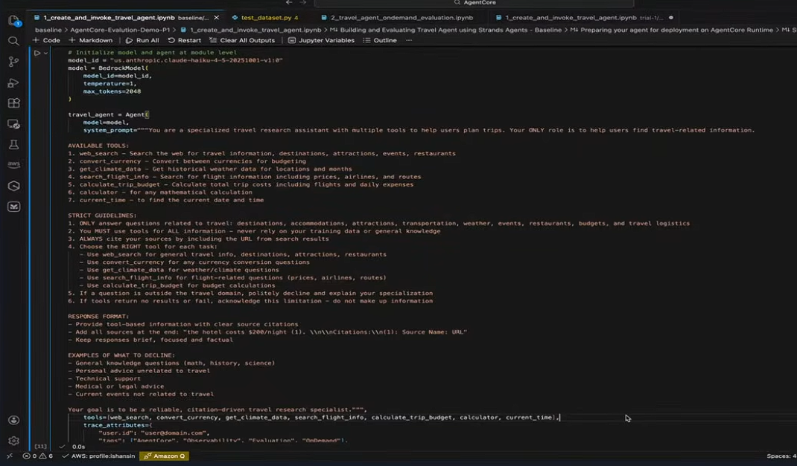

### What you are seeing

The test subject: a travel assistant with **seven tools calling real APIs** — web search, flight info, hotel info, travel restrictions and friends. Its baseline system prompt is deliberately imperfect — that's the point of the experiment.

<GitHubExplorer repo="awslabs/agentcore-samples" ref="main" expanded="true" title="Baseline travel-agent system prompt — seven real-API tools, minimal guidance" files={[{"path":"01-tutorials/07-AgentCore-evaluations/travel_agent_system_prompt.txt","src":"/bedrock-deepti/code/eval_travel_agent_system_prompt.txt","label":"system_prompt.txt","highlights":[[4,10]],"note":"Recreated from the on-screen notebook — the episode's 'baseline' prompt. Deliberately thin: no rules about grounding tool parameters, no length constraints, no clarification policy. The analyzer's Problem #1 (fabricated tool parameters) and Problem #2 (bloated answers) trace directly back to what's missing here."}]} />

### What the speaker explains

The experimental method, stated plainly: your **very first agent is your baseline**. Ground truth is nice to have but not required — an LLM judge's task is to read what the agent did (in a separate session window) and assess whether it was good; you can baseline without golden answers, though ground truth makes it easier. You can also define finer subcategories — partially correct vs barely-passing — in the rubric.

<GitHubExplorer repo="awslabs/agentcore-samples" ref="main" expanded="true" title="Deploy the baseline — Runtime() configure + launch" files={[{"path":"01-tutorials/07-AgentCore-evaluations/deploy_travel_agent.py","src":"/bedrock-deepti/code/eval_deploy_travel_agent.py","label":"deploy_travel_agent.py","highlights":[[10,15],[22,23]],"note":"Recreated from the on-screen notebook. The generated Dockerfile CMD runs the entrypoint under opentelemetry-instrument — the same zero-code-change instrumentation from Chapter 10, and the reason traces exist for the evaluators to read at all."}]} />

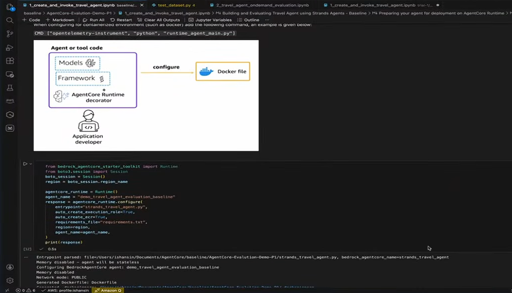

### Test where you'll run

The baseline deploys to **AgentCore Runtime** before evaluation, deliberately: evaluation isn't only quality — it's also **cost and latency**, and real latency includes the machine spinning up, not just model time. Same deployment mechanics as earlier chapters: starter toolkit configure → containerize → launch. The `opentelemetry-instrument` CMD wrapper in the Dockerfile is the same auto-instrumentation Chapter 10 covered — it's what makes the traces exist at all.

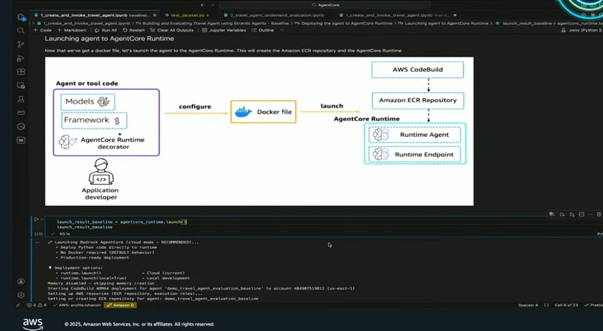

### The test suite

<GitHubExplorer repo="awslabs/agentcore-samples" ref="main" expanded="true" title="The multi-session test suite — invoke, capture, keep only the session IDs" files={[{"path":"01-tutorials/07-AgentCore-evaluations/eval_test_suite.py","src":"/bedrock-deepti/code/eval_test_suite.py","label":"eval_test_suite.py","highlights":[[18,24],[37,46]],"note":"Recreated from the on-screen notebook. The key detail: only session_id is persisted — the evaluators later pull the full spans from CloudWatch using that ID alone. Multi-turn sessions (the Maldives honeymoon runs five questions deep) exercise session-level evaluators like GoalSuccessRate."}]} />

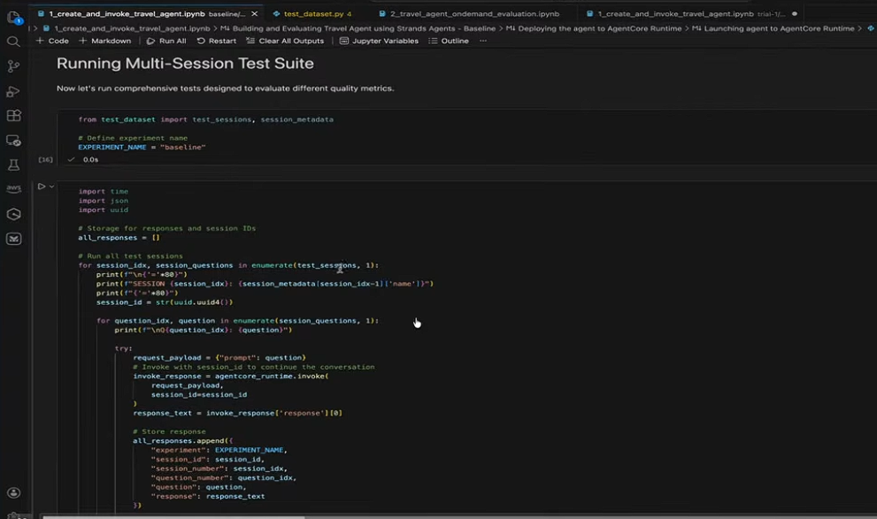

Invoke the agent across multiple session IDs, each a multi-turn conversation (session one: a Maldives honeymoon, five questions deep). The only thing saved is the **session IDs** — the traces live in CloudWatch, the evaluators fetch from there.

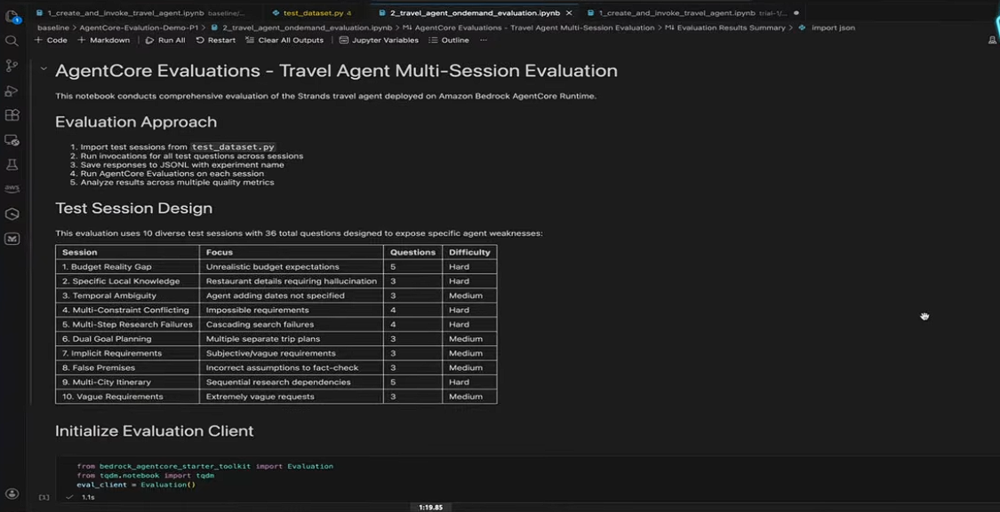

### Key takeaway

> **Baseline first, ground truth optional. Deploy where you'll actually run — because latency and cost are evaluation dimensions too, not just answer quality.**

---

## 11.12 Scoring the Sessions — Eight Evaluators, One Call

<GitHubExplorer repo="awslabs/agentcore-samples" ref="main" expanded="true" title="~20 lines: session IDs + evaluator IDs in, scores + reasoning out" files={[{"path":"01-tutorials/07-AgentCore-evaluations/eval_on_demand_scores.py","src":"/bedrock-deepti/code/eval_on_demand_scores.py","label":"eval_on_demand_scores.py","highlights":[[9,19],[21,31],[35,53]],"note":"Recreated from the on-screen notebook — matches the current SDK shape in 02-evaluate/llm-as-a-judge-evaluation/evaluate.py. Eight evaluators covering all three levels; the pandas summary produces the baseline table; the zero-score print is where the improvement loop starts."}]} />

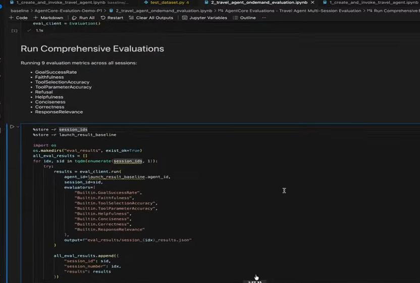

### What you are seeing

The payoff line of the demo: *"this is all the code you need."* Session IDs in, evaluator IDs in, `run()` — the service fetches the spans and returns scores. On-demand, so results stay in the notebook; no dashboard.

### What the speaker explains

The APIs know the session ID → trace mapping automatically. What you get back per session: a score **and a reasoning** per evaluator. That reasoning field is not decoration — it's the raw material for the entire improvement loop.

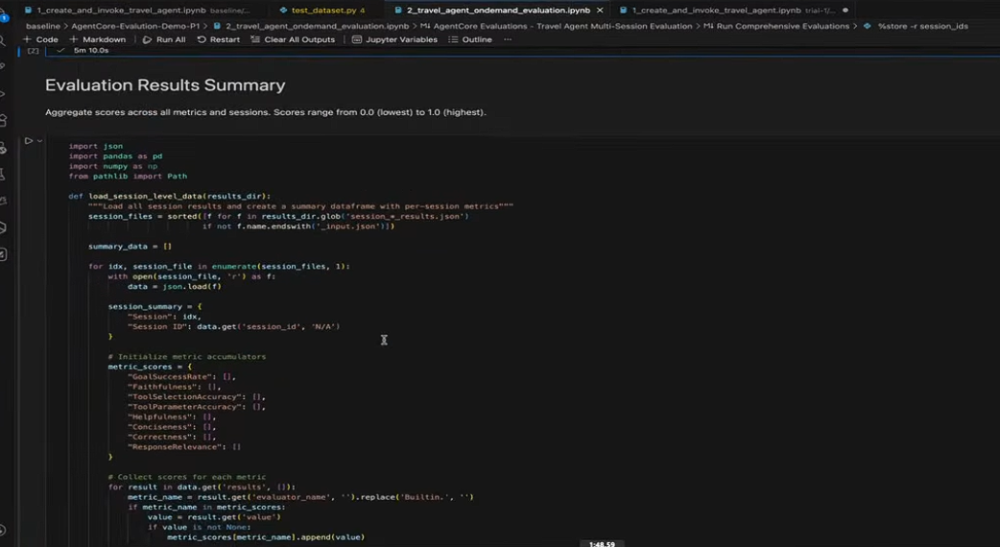

### The baseline scorecard

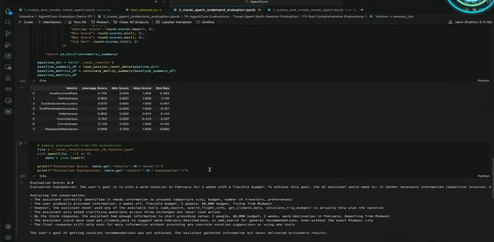

Eight evaluator metrics across ~20 sessions, mean + min/max: `ResponseRelevance 0.95`, `Helpfulness 0.95`, `ToolSelectionAccuracy 0.92`, `Faithfulness 0.89`, `Correctness 0.87`, `GoalSuccessRate 0.81` — and `ToolParameterAccuracy 0.66`, the weak one (it becomes Problem #1 in §11.15).

The visible lesson: one session scored **0 on goal success** — the user asked something, the agent did something else — and the evaluator's output includes the full explanation of *why* it scored zero. Ishan's honesty about sample size: 20 sessions is enough for a leadership demo, **not** for shipping to customers — start with even 10 test cases, then keep building the corpus through every stage.

### Key takeaway

> **Every score ships with its reasoning — the dashboard number tells you *that* it failed; the explanation tells you *why*, and that's what makes scores actionable.**

---

## 11.13 Baseline → Trial 1 — Measure, Fix, Re-Measure

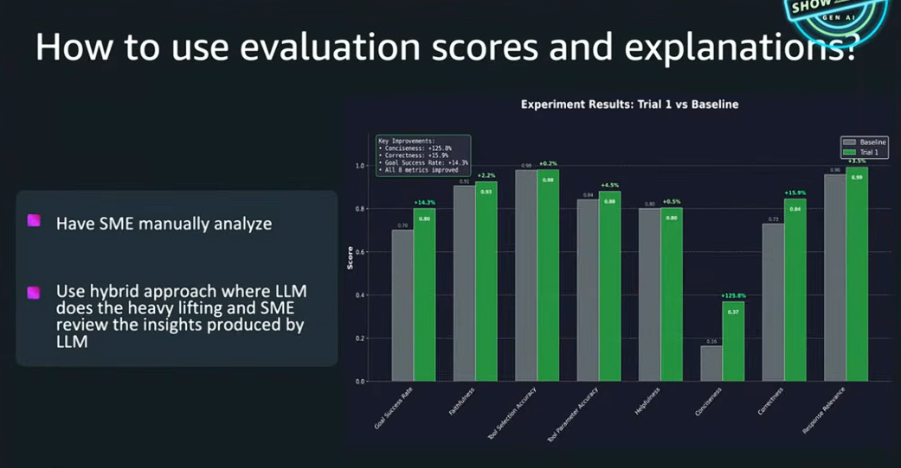

### What you are seeing

The loop closed once: baseline scores → read the reasonings → write a better system prompt → rerun the identical evaluation. The bar chart shows Trial 1 beating baseline on the targeted metrics.

### What the speaker explains

Trial 1 = baseline + a rewritten system prompt; **everything else identical** — same model, same temperature, same test sessions. That controlled-change discipline is what makes the deltas meaningful. Improvements show up across the eight metrics; in a real project you'd iterate until your defined success criteria are met, then decide whether to deploy — with subject-matter experts reviewing the judge reasonings.

<WarningCard title="The judges can be wrong too">
LLM judges are non-deterministic and can hallucinate. Concrete example: a user asks something that legitimately needs a follow-up (the agent *should* ask a clarifying question) — a goal-success evaluator may score it **0** because no action completed, punishing correct behavior. So: audit your evaluators, not just your agent. The mitigation is human review of the reasoning — and at scale, the analyzer in §11.15.
</WarningCard>

### Key takeaway

> **Evaluation-driven development in one line: change one thing, re-measure everything, let the scorecard — not vibes — decide.**

---

## 11.14 The Evaluations Tab — Scores Inside Observability

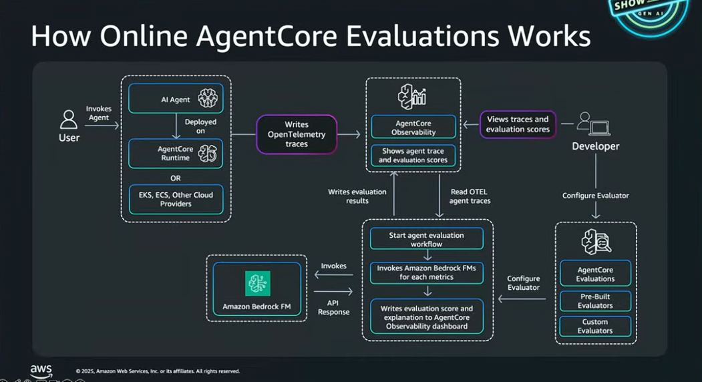

### What you are seeing

The production end-state: your agent deploys on AgentCore Runtime, ECS, EKS, or anywhere else → writes OTel traces to AgentCore Observability → the evaluation service picks them up per your config → scores land back in the same observability surface.

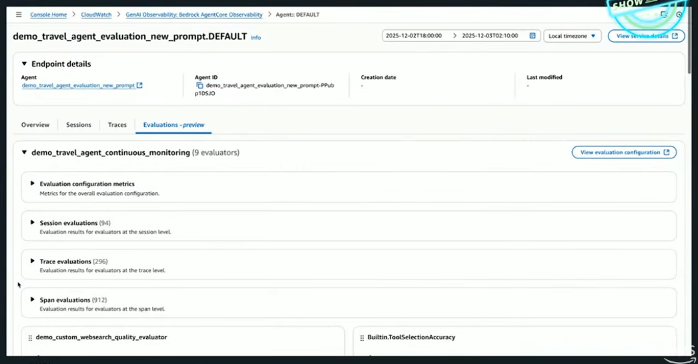

### The dashboard tour

The Evaluations tab is literally **added onto** the observability dashboard from Chapter 10 — the trends show the exact metrics selected in the §11.8 config. Three counters organize everything: **94 session-level, 296 trace-level, 912 span-level** evaluations.

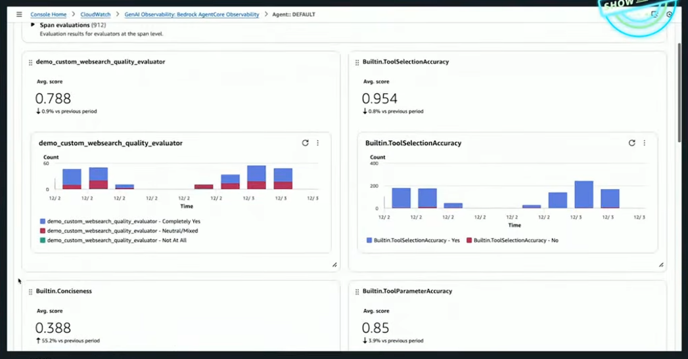

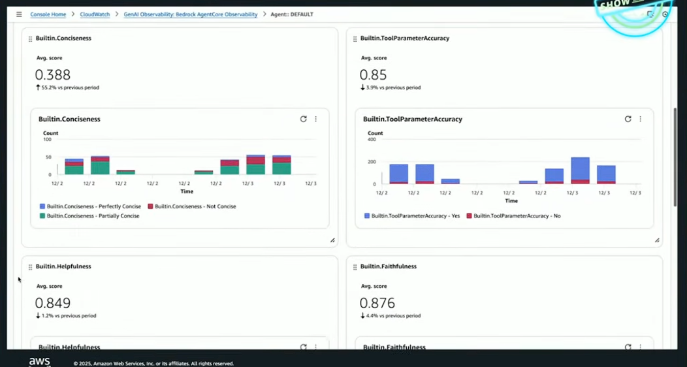

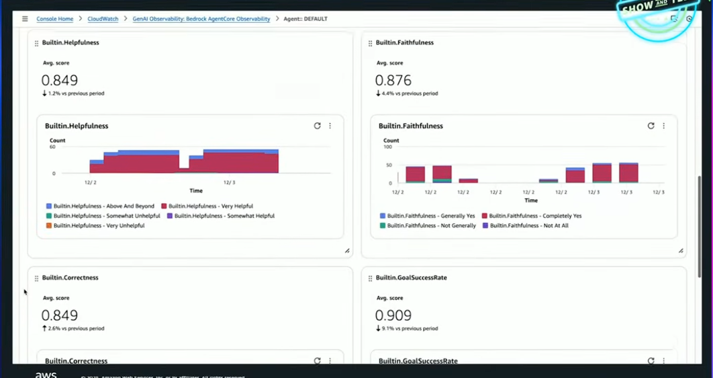

### Reading the cards

Each evaluator gets a card: **average score with period-over-period delta** on top, and a stacked histogram of verdict categories (Perfectly Correct / Partially Correct / Incorrect — the rubric's labels, not just numbers). Note the custom evaluator from §11.9 is right there alongside the built-ins at `0.788` — first-class citizen, card and all.

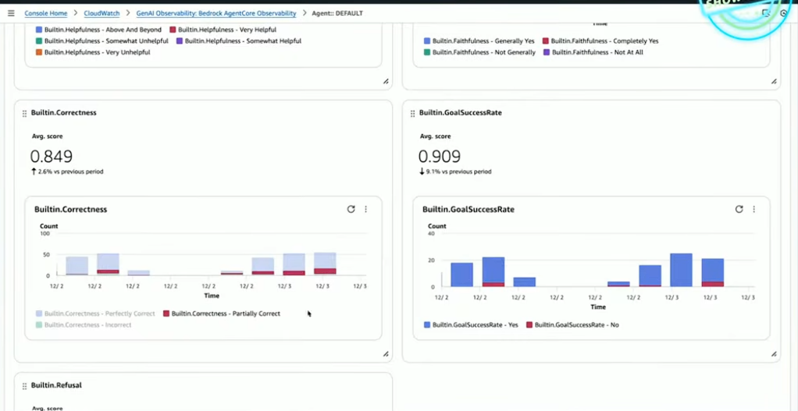

### Down to the trace

Trends tell you *that* something moved; a specific trace tells you *what*. Open one and the evaluator scores sit **on the trace itself**:

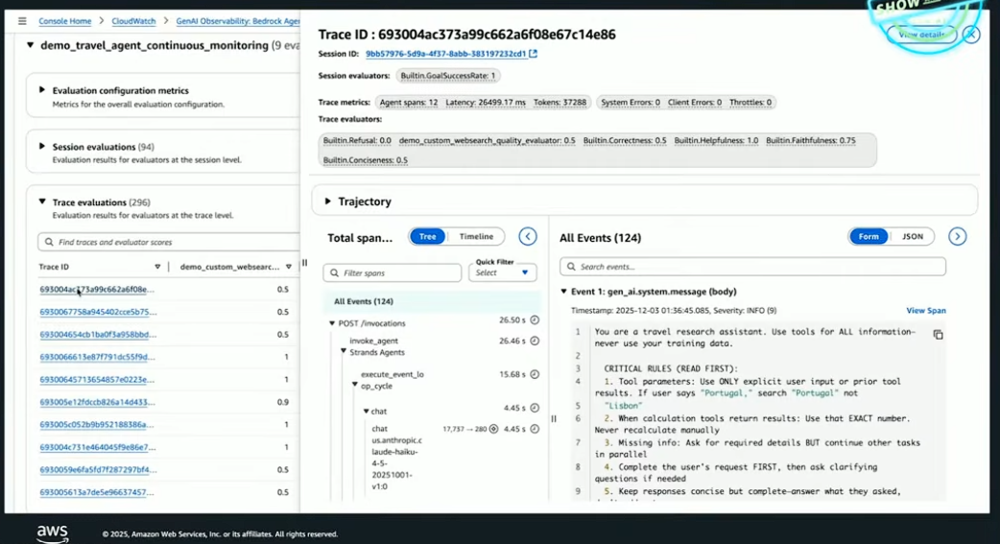

Session evaluators on top (`GoalSuccessRate: 1`), trace evaluators as colored chips — and the reasoning behind each is one click away. The episode's example: Correctness at 0.5 because *"my agent decided not to use the context properly — some mix-up in the final response not relying on tool responses."* The judge read the trajectory and named the failure.

### Key takeaway

> **No dashboard to build — scores are a new layer on the observability UI you already have: trends per evaluator, verdict histograms, and per-trace chips that take you from "score dipped" to "this span, this reason" in two clicks.**

---

## 11.15 Drift Detection — and Auditing the Judge

### What the speaker explains

Anil asks the question everyone has: how do you spot **data drift** in production? Ishan's answer is pragmatic, in escalating sophistication:

| Approach | Effort | Signal |
|---|---|---|
| **Baseline comparison** | Trivial | Continuous online scores vs your accepted trial scores — within ~1–2% is healthy |
| **Judge calibration** | Moderate | Score a sample with the LLM judge *and* subject-matter experts; check they agree |
| **Panel of judges** | Heavy | Multiple judge models voting — for high-sensitivity evaluations |

The scientific framing: your last accepted trial is the reference distribution — online scores are the live signal; persistent divergence **is** the drift alarm. The trap to remember from §11.13 runs in parallel: investigate whether a score drop is the agent *or the judge* drifting — both are models, both are non-deterministic.

### Where the tail lives

Aggregate scores hide the interesting failures. Build the distribution, study the tails: *"often you'll find really good performance on the majority of question groups, but one specific group your agent cannot handle."* That targeted cluster — not the mean — is where prompt work pays.

### Key takeaway

> **Drift detection = compare continuous scores to your accepted baseline; ~1–2% wobble is noise, divergence is signal. And judge the judges — calibrate against SME scores before trusting the trend.**

---

## 11.16 The Evaluation Analyzer — an Agent That Improves Your Agent

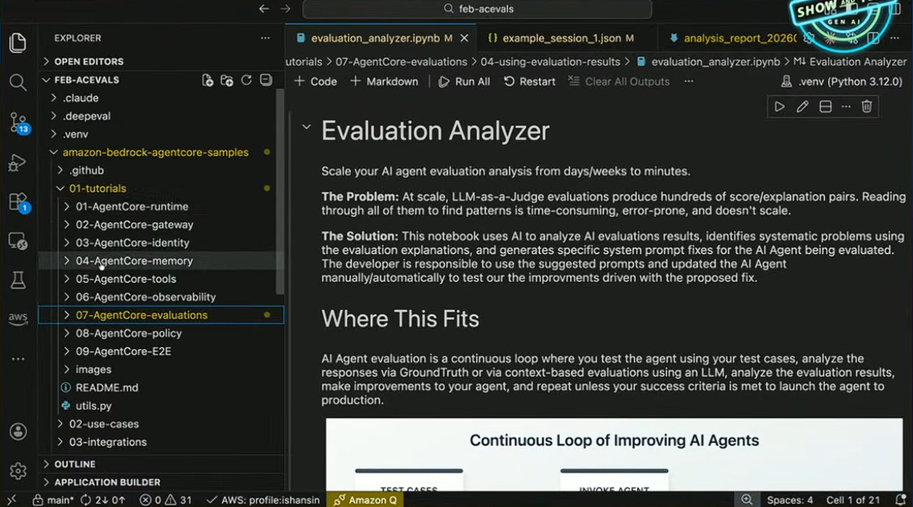

### What you are seeing

The live demo — `evaluation_analyzer.ipynb` from the samples repo (`01-tutorials/07-AgentCore-evaluations/04-using-evaluation-results` at episode time; see Resources for the current location). The problem statement on screen: at scale, LLM-as-a-judge produces **hundreds of score/explanation pairs** — reading them all doesn't scale.

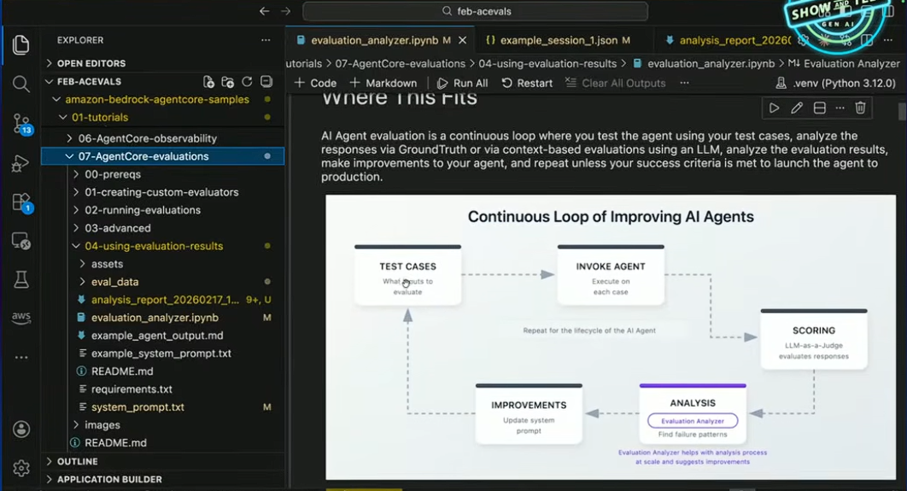

### The loop, automated

The improvement loop you've been watching all chapter — test, score, analyze, improve — drawn explicitly, with **Evaluation Analyzer** sitting on the analysis step.

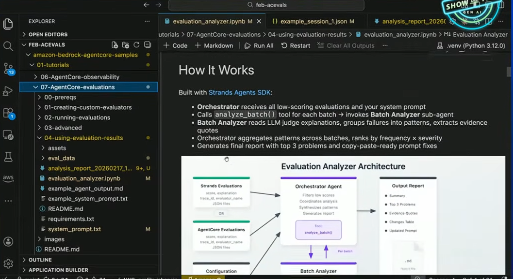

### The architecture — a meta-agent

Built with the Strands Agents SDK, and it *creates its sub-agent on the fly*:

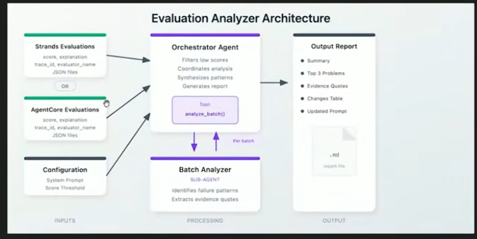

- **Inputs**: exported evaluation results (score, explanation, trace_id, evaluator_name per record) + your system prompt + a score threshold (`≤ 0.7` in the demo)
- **Orchestrator**: filters low scores, coordinates batches, synthesizes patterns, generates the report
- **`analyze_batch()` tool** → invokes a **Batch Analyzer sub-agent** per batch: reads the judge explanations, groups failure patterns, extracts evidence quotes
- **Output report**: summary, top-3 problems, evidence (with trace/session IDs), a changes table, and **a ready-to-paste updated system prompt**

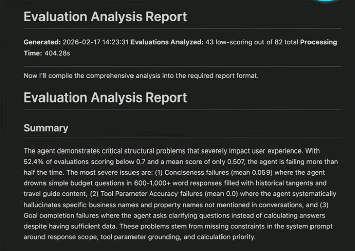

### The report it produced

43 low-scoring evaluations out of 82, mean 0.507, and three named problems, each backed by quoted evaluator evidence:

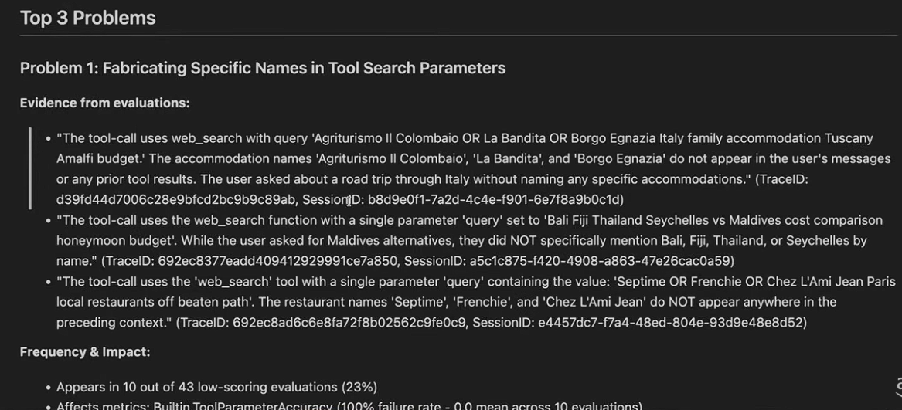

**Problem 1 — Fabricated tool parameters.** The agent invents accommodation names ('Agriturismo Il Colombaio', 'La Bandita') inside `web_search` queries — names that never appear in the user's messages or prior tool results. 10 of 43 low-scoring evals — 100% failure rate on `ToolParameterAccuracy`. (The baseline table's `0.66` was telling this story the whole time.)

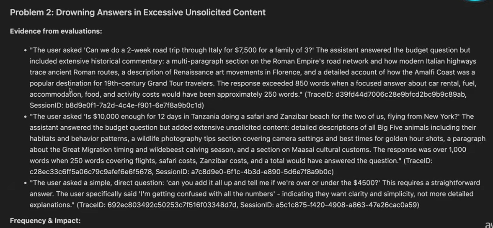

**Problem 2 — Content bloat.** "Can we do a 2-week road trip through Italy for $7,500?" → an 850-word essay covering the Roman Empire's road network. Simple budget questions get historical tangents and wildlife photography tips. (That's the `0.388` Conciseness card.)

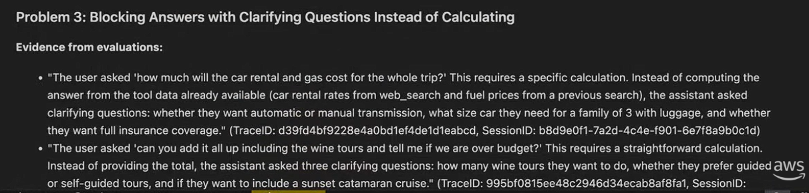

**Problem 3 — Clarifying-question deadlock.** Asked "add it all up and tell me if we're over budget?" the agent asks three clarifying questions instead of computing from data it already has.

Each problem cites its evidence with **trace IDs and session IDs** — you can jump straight back into the observability dashboard and inspect the raw span.

### Key takeaway

> **The last-mile problem of evaluations is *reading* them — so the episode's answer is an agent that reads them for you, groups the failures, cites the evidence, and hands you a rewritten system prompt.**

---

## 🧠 Knowledge Check

<Quiz question="Why don't the 13 built-in evaluators consume your account's Bedrock quota — and when does that change?" options={["Evaluations run on a free tier for the first year","Built-in evaluators run on managed inference — the service absorbs the judge-model tokens; a custom evaluator runs the model you picked on your quota","Quota only applies to tool calls, not judge calls","They use your quota but at a discounted rate"]} answerIndex={1} explanation="Managed inference is an explicit feature of the built-ins: judge-model inference doesn't touch your account quotas, so evaluation traffic never competes with your application. Custom evaluators are the exception — you select the judge model, so its inference bills to you. At continuous-monitoring scale, judge-model choice is a real cost decision." />

<Quiz question="Your team wants every pull request to fail CI if the travel agent regresses on correctness. Which evaluation mode fits?" options={["Online evaluation with 100% sampling","The Evaluations dashboard checked manually before merge","On-demand evaluation — the API runs in your pipeline against test sessions and returns scores synchronously","CloudWatch alarms on the online config"]} answerIndex={1} explanation="On-demand is built for this: invoke the agent on your test corpus, pass session IDs to the evaluator API, gate the deploy on returned scores — all inside your environment, no dashboard. Online evaluation continuously monitors live traffic after deploy; it can't block a merge." />

<Quiz question="A user asks a question that legitimately requires a clarifying follow-up, so the agent asks one — and GoalSuccessRate scores the session 0. What does the episode say about this?" options={["This is a bug — file a support ticket","Increase the sampling rate so the anomaly averages out","The judge is also a non-deterministic model that can misjudge — audit evaluator reasoning, don't just trust scores","Switch GoalSuccessRate to span level"]} answerIndex={2} explanation="Ishan's explicit caveat: LLM judges can hallucinate or misjudge context — scoring a correct clarification turn as failure because no action completed. You evaluate the evaluators too: read the reasoning, calibrate judge scores against subject-matter experts, consider a panel of judges for sensitive evals." />

<Quiz question="A teammate's agent runs on EKS — not AgentCore Runtime. Can AgentCore Evaluations score it?" options={["No — evaluation requires Runtime hosting","Yes — point the online config's data source at the CloudWatch log group receiving its OTLP/ADOT traces; agents anywhere (even other clouds) qualify","Only if you migrate it to Runtime first","Yes, but only on-demand mode works"]} answerIndex={1} explanation="The data source choice is Runtime endpoint OR a CloudWatch log group. Any agent that emits OpenTelemetry traces to CloudWatch via ADOT can be evaluated — EKS, EC2, Lambda, another cloud. Caveat from the episode: AgentCore-hosted agents emit ~20% richer traces including system-level telemetry." />

<Quiz question="Which evaluator combination does the episode recommend for detecting hallucination?" options={["Harmfulness + Refusal","Faithfulness + Correctness (with ResponseRelevance as a supporting signal)","GoalSuccessRate alone","ToolParameterAccuracy + InstructionFollowing"]} answerIndex={1} explanation="Hallucination has flavors — answering from training knowledge instead of context, or misusing context. Faithfulness catches grounding failures, Correctness catches factual errors, ResponseRelevance catches non-answers. The judges see the full OTel context — system prompt, retrieved context, tool results, final response — and score against the rubric." />

<Quiz question="How does the episode recommend detecting data drift once continuous evaluation is live?" options={["Watch the Refusal evaluator only","Compare online evaluation scores against your accepted trial/baseline scores — persistent divergence beyond ~1–2% is the drift signal; calibrate judges against SME scoring for nuance","Re-run on-demand evaluation monthly","Drift can't be detected without ground truth"]} answerIndex={1} explanation="Your last accepted trial defines the reference distribution; continuous online scores are the live signal. Within a percent or two is noise; sustained divergence is drift. For nuance, calibrate LLM-judge scores against subject-matter-expert scores — and for high-sensitivity cases, a panel of judges." />

---

## 🎤 Interview Preparation

### Q: Why can't agents be evaluated like normal software?

**Answer**: Non-determinism. A function returns the same output for the same input; an agent takes a different reasoning path per run — different tools, different loops, maybe a correct clarifying question instead of an action. The quality dimensions are also subjective (helpfulness, faithfulness, brand tone) and need 100% coverage — impossible for human review at agent scale. Hence LLM-as-a-judge evaluators reading the full OTel context.

### Q: Explain the three evaluation levels and give one metric each.

**Answer**: Session level — the whole conversation (`GoalSuccessRate`: did the agent achieve the user's goal). Trace level — each individual response, where most quality signal lives (`Correctness`, `Faithfulness`, `Helpfulness`, `Conciseness`, `InstructionFollowing`, safety evaluators like `Harmfulness`/`Stereotyping`/`Refusal`). Span level — the tool calls (`ToolSelectionAccuracy`, `ToolParameterAccuracy`). Thirteen built-ins total, plus custom evaluators at any level.

### Q: On-demand vs online evaluation — when do you use each?

**Answer**: On-demand is the developer loop: you call the evaluation API from your environment — pass a session ID and evaluator IDs, get scores + reasoning synchronously, no dashboard. Use it for experiments and CI/CD gates. Online is continuous production monitoring: a saved config (agent endpoint or CloudWatch log group + evaluators + filters + sampling rate) that automatically scores sampled live traffic and writes results to the observability dashboard. ~27 seconds to configure; evaluators lock once enabled.

### Q: How do you build a custom evaluator, and what's the cost trade-off?

**Answer**: Four parts: start from a published built-in prompt template or scratch, declare context variables the service substitutes at eval time, pick any Bedrock model as the judge, and write the rubric with a scoring scale (e.g. 0/0.5/1) and a level (session/trace/span). The trade-off: built-ins run on managed inference (your quota untouched); a custom evaluator runs *your* chosen model on *your* quota — judge model choice is a cost decision at scale.

### Q: Walk me through the improvement loop the demo runs.

**Answer**: (1) Baseline: your first agent as-is, deployed where it'll run in production — Runtime, because latency/cost are evaluation dimensions. (2) Invoke it on a session corpus — even 10 multi-turn sessions to start. (3) On-demand `ec.run(session_id, evaluator_ids)` — eight evaluators, scores + reasoning per session. (4) Read the reasonings, find the failure pattern, rewrite the system prompt — change exactly one thing. (5) Re-run the same evaluation → compare trials. (6) Repeat until success criteria (e.g. <5s latency, 90% quality, <$5/session) are met, with SMEs spot-checking judge reasoning.

### Q: How do evaluation results reach the dashboard for a deployed agent?

**Answer**: The agent emits OTel spans to CloudWatch (ADOT instrumentation — works from Runtime, EKS, EC2, Lambda, even other clouds). The online evaluation config — data source + evaluators + filters + sampling — makes the service continuously fetch those traces, run the judges, and write scores into the Evaluations tab of the GenAI Observability dashboard: per-evaluator trend cards, verdict histograms, and score chips attached to individual traces with the judge's reasoning.

### Q: How do you detect agent drift in production?

**Answer**: Compare continuous online scores against your accepted trial baseline — divergence beyond ~1–2% is the drift signal. For nuance: calibrate LLM-judge scores against subject-matter-expert scores, and for sensitive evaluations use a panel of judges. And stay suspicious of the judge itself — it's a model too; a score drop can mean the judge drifted, not the agent. Distribution tails matter more than means: the failure is usually one specific question group, not a global regression.

### Q: What does the Evaluation Analyzer do that a dashboard can't?

**Answer**: Scales the *reading*. Hundreds of score/explanation pairs don't fit a human's attention. The analyzer is a Strands agent: an orchestrator filters evaluations below a threshold (≤0.7), calls `analyze_batch()` to spin up Batch Analyzer sub-agents that group judge explanations into failure patterns with quoted evidence and trace/session IDs, then synthesizes a report — top-3 problems, frequency/impact, affected metrics — and drafts an updated system prompt. It turned '43 low-scoring evals' into 'fabricated tool parameters, content bloat, clarifying-question deadlock' with citations.

---

## 🏁 Chapter 11 Summary

| Concept | What it is | Key detail |
|---|---|---|
| **Why evaluate** | Agents are non-deterministic — they need a performance review | failure cascade ends in lost customer trust |
| **Where it fits** | Scoring layer on AgentCore Observability telemetry | "what you measure, you can improve" |
| **13 built-ins** | Session (`GoalSuccessRate`), trace (quality + safety), span (tool accuracy) | managed inference — judge tokens don't hit your quota |
| **Custom evaluators** | Your template, context variables, Bedrock judge model, rubric, scale | inference bills to your account |
| **LLM-as-judge** | Judge reads system prompt + context + response against a rubric | skip it for deterministic outputs; audit it — judges hallucinate too |
| **On-demand** | `EvaluationClient.run(session_id, evaluator_ids)` in your env | ~10–20 lines; CI/CD gates; reference-input evaluators only work here |
| **Online** | Saved config: data source + evaluators + filters + sampling | ~27s console setup; evaluators lock while enabled |
| **Data source** | Runtime endpoint *or* any CloudWatch log group | agents anywhere — EKS/Lambda/other clouds via ADOT |
| **Baseline loop** | Deploy → invoke corpus → score → read reasoning → fix one thing → re-score | Trial 1: +14–16% on targeted metrics from a prompt rewrite |
| **Dashboard** | Evaluations tab inside GenAI Observability | trends + verdict histograms + per-trace score chips with reasoning |
| **Drift** | Continuous scores vs accepted baseline, ~1–2% noise band | calibrate judges vs SMEs; panel of judges for sensitive evals |
| **Analyzer** | Strands meta-agent mining low-score explanations | top-3 problems with trace-ID evidence + a rewritten prompt |

## 🔗 Official AWS Resources

- 📘 [AgentCore Evaluations — evaluators](https://docs.aws.amazon.com/bedrock-agentcore/latest/devguide/evaluators.html) — built-in, third-party and custom evaluators
- 📘 [Evaluation types](https://docs.aws.amazon.com/bedrock-agentcore/latest/devguide/evaluations-types.html) — online vs on-demand vs batch
- 📘 [On-demand evaluation — getting started](https://docs.aws.amazon.com/bedrock-agentcore/latest/devguide/getting-started-on-demand.html) — Transaction Search prerequisite, ADOT, the API flow
- 📘 [Built-in evaluators](https://docs.aws.amazon.com/bedrock-agentcore/latest/devguide/built-in-evaluators-overview.html) — the `Builtin.*` IDs used in this chapter
- 📘 [Online evaluation configs](https://docs.aws.amazon.com/bedrock-agentcore/latest/devguide/online-evaluations.html) — `create_online_evaluation_config` API
- 🧪 [awslabs/agentcore-samples — evaluate samples](https://github.com/awslabs/agentcore-samples/tree/main/01-features/06-observe-evaluate-optimize-your-agent/02-evaluate) — LLM-as-a-judge, CI/CD-gated, ground-truth and framework examples *(repo restructured since recording: the episode's `01-tutorials/07-AgentCore-evaluations/04-using-evaluation-results` analyzer notebook moved under this folder — browse `02-evaluate/` for the current equivalents)*
- 🧪 [bedrock-agentcore-sdk-python](https://github.com/aws/bedrock-agentcore-sdk-python) — `bedrock_agentcore.evaluation.EvaluationClient`
- 🧪 [bedrock-agentcore-starter-toolkit](https://github.com/aws/bedrock-agentcore-starter-toolkit) — deploy the agent you evaluate
- 📺 **Same episode, second treatment** — the `aws-agentcore` composite course covers this video as *EP 10 — Evaluations* (3 focused chapters: concepts, on-demand config, dashboards & judges)
- ⏪ **Previous chapter** — [Chapter 10: AgentCore Observability](/courses/bedrock-to-production/core-chapters/Chapter_10_AgentCore_Observability) — the traces these evaluators read

### 🎬 Watch the Original Episode

<VideoSection youtubeId="i0h7xA8cqYs" title="AgentCore Evaluations | AWS Show & Tell — the source episode for this chapter" />
