# 🛡️ AgentCore Policy — Govern, Audit, and Trust What Your Agents *Do*

> *An interactive deep-dive into the AWS Show & Tell episode "Policy in Amazon Bedrock AgentCore" — covering why externalized, deterministic authorization beats in-code checks and prompt instructions, how a policy engine attached to AgentCore Gateway intercepts every tool call in real time, authoring policies in natural language that compile to Cedar, deny-by-default and validation modes, identity-aware conditions on JWT claims, enforcement vs log-only modes, and the complete policy audit trail in CloudWatch.*
>
> **🎥 Source video:** [AWS Show & Tell — Policy in AgentCore](https://www.youtube.com/watch?v=q_9htaugcgI&list=PLhr1KZpdzukfZdp5SGgm2yBPglHNHn-Ig&index=11)
> **📦 Sample code:** [`agentcore-samples` — `02-policy` feature samples](https://github.com/awslabs/agentcore-samples/tree/main/01-features/07-centralize-and-govern-your-ai-infrastructure/02-policy) (restructured since the episode; the episode's `01-tutorials/08-AgentCore-policy` material now lives here)

---

## 📖 About This Chapter

| | |
|---|---|
| **📚 Course** | AWS Bedrock to Production — Interactive Deep Dive |
| **🔖 Chapter** | 12 — AgentCore Policy |
| **🎙️ Host** | Anil Nadimi (AWS) |
| **👤 Guest** | Barati — AWS Generative AI Data Scientist, Responsible AI & governance |
| **⏱️ Runtime** | ~58 minutes of episode distilled into interactive modules |
| **🛠️ Focus** | AgentCore Policy — deterministic Cedar authorization enforced at AgentCore Gateway |

**What you'll learn:** why agents that touch real tools need an external, deterministic control plane (system prompts and inline checks aren't enough); how a **policy engine** attaches to an **AgentCore Gateway** and evaluates `ListTools`, `InvokeTool`, and `SearchTools` calls before they run; how the console turns plain-English rules into **Cedar** policies and flags overly-permissive ones; how enforcement modes work (**deny-by-default**, **log-only/shadow**, **enforce**); how JWT claims become `principal` conditions; and how every decision lands in CloudWatch for a full audit trail.

:::danger The question this chapter answers
> Your agent can call tools that spend money, change data, and touch other systems. The LLM is probabilistic. **Where do you put a hard, deterministic line between "the agent wants to do this" and "the agent is allowed to do this" — and who owns that line?**
:::

---

## 12.1 🚧 Welcome — Agents Without Boundaries

The episode opens on the uncomfortable truth about tool-using agents: giving an LLM the ability to *act* means it will sometimes act in ways you never intended.

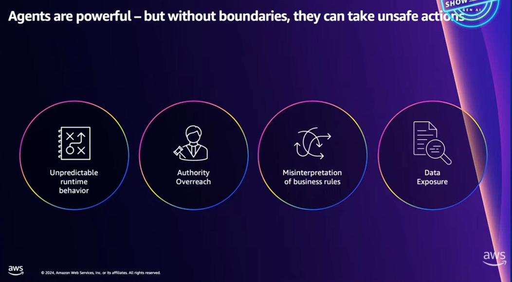
*⬆️ The opening slide — "Agents are powerful — but without boundaries, they can take unsafe actions." Four risk categories: unpredictable runtime behavior, authority overreach, misinterpretation of business rules, and data exposure.*

**👀 What you're seeing:** Four risk tiles that set the problem space — unpredictable runtime behavior, authority overreach (acting beyond intended privileges), misinterpretation of business rules, and data exposure.

**🔍 What the speakers explain:** Agents that connect to MCP servers, tools, and other agents may perform hundreds of operations on behalf of users or systems. The failure modes on this slide aren't hypothetical:

- **Misinterpreted business rules** — the episode's running example is a calendar reminder that says "remind me to reimburse Bob," and the agent interprets the word "reimburse" as *an instruction to actually process a reimbursement* — confusing data with command.
- **Overly permissive access** — the agent can reach tools it was never meant to touch.
- **Slow or ad-hoc decisions** — hardcoded checks buried in each tool or agent loop are brittle, hard to audit, and easy to bypass.

:::tip 💡 Core framing from this episode
> **Session isolation** controls *where* your agent runs. **Identity** controls *who* it is. **Policy** controls *what it can do*. **Observability** shows *what it did*. They answer different questions — you need all four.
:::

> **🎯 Key Takeaway:** The risks of agents aren't LLM hallucinations alone — they're *authorization* failures. Governance is the missing layer between a capable agent and a trustworthy one.

---

## 12.2 🧠 Why the System Prompt Isn't Enough

Before introducing Policy, the episode dismantles the two places teams *usually* put their rules — and explains why neither is a control plane.

### Prompt instructions vs policy

| Approach | Why it fails as enforcement |
|---|---|
| 📝 Rules in the system prompt | Probabilistic — the model *usually* follows them. Prompt the agent to "be helpful" and "don't process refunds over $5,000" in the same breath, and the two instructions fight each other inside a non-deterministic system. |
| 🔧 Checks inside each tool | Scattered — every tool developer re-implements authorization slightly differently; audit teams can't see the rules without reading every repo. |
| 💻 Checks inside agent code | Bypassable — a different agent framework, a new agent, or a modified prompt path skips the check entirely. And updating it means shipping code. |
| 🛡️ **External policy at the gateway** | Deterministic — evaluated on every call regardless of agent behavior, bugs, or prompt manipulation. Security teams own it; agents can't talk their way around it. |

:::info Externalization is the point
> When rules live *outside* the application, security and audit teams can read, version, and change them without touching agent code — and the rules apply even when the agent misbehaves, gets manipulated, or a tool's own logic has a bug.
:::

> **🎯 Key Takeaway:** A system prompt is a *suggestion*. A tool-side check is *self-enforcement*. Only an externalized policy is a *guarantee*.

---

## 12.3 🛡️ Introducing Policy in Amazon Bedrock AgentCore

With the problem framed, the episode introduces the service: **Policy in AgentCore** — deterministic, centralized authorization for agent-to-tool traffic.

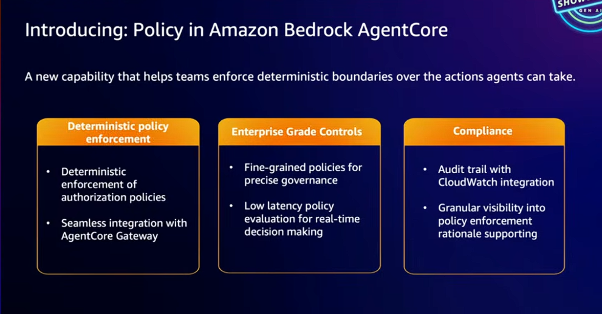
*⬆️ The capability slide — three pillars: deterministic policy enforcement, enterprise-grade controls (fine-grained, low-latency), and compliance (CloudWatch audit trail, granular visibility).*

**👀 What you're seeing:** Three cards describing the feature — deterministic enforcement of agent-to-tool interactions, fine-grained low-latency evaluation for real-time decisions, and an audit trail integrated with CloudWatch for granular visibility into enforcement rationale.

**🔍 What the speakers explain:**

- **Deterministic** is the headline — policy decisions don't depend on the model's mood. A rule that says "deny this" denies it, every time.
- **Real-time** — evaluation happens inline on every tool call with low latency, so it can sit on the request path without degrading the agent.
- **Auditable** — every decision (allow *or* deny) is logged with *which policy* made it, feeding the compliance story in CloudWatch.

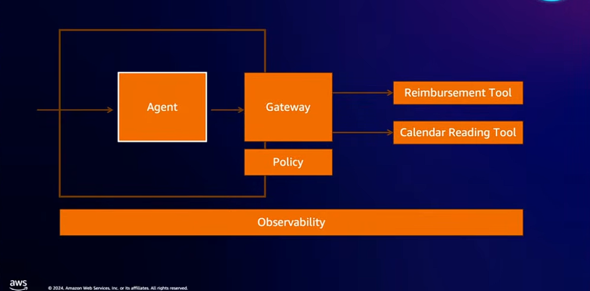
*⬆️ The first architecture slide — the Agent calls tools through the Gateway; Policy sits beneath the Gateway as the enforcement layer; Observability underlies everything.*

**👀 What you're seeing:** The AgentCore building-block diagram — an agent on top reaching a Reimbursement Tool and a Calendar Reading Tool through the Gateway, a **Policy** bar under the gateway, and **Observability** spanning the whole stack.

**🔍 What the speakers explain:** The placement is the design. The agent doesn't talk to tools directly — every invocation passes through the Gateway, so the Gateway is the natural chokepoint to intercept and evaluate. Policy doesn't live in the agent, the model, or the tool; it lives on the *path between them*.

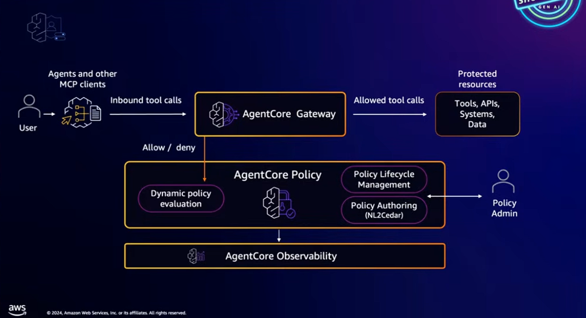
*⬆️ The detailed architecture — inbound tool calls from agents/MCP clients hit the AgentCore Policy engine (policy lifecycle management, NL→Cedar authoring, dynamic evaluation) attached to the Gateway; only allowed calls reach protected resources, and decisions stream to AgentCore Observability.*

**👀 What you're seeing:** The expanded AgentCore Policy box showing three internal capabilities — **policy authoring** (natural-language-to-Cedar), **policy lifecycle management**, and **dynamic policy evaluation** — with a policy admin persona on the right. Inbound tool calls from agents/MCP clients are evaluated; allowed calls proceed to protected resources; every decision flows to Observability.

**🔍 What the speakers explain:** This is the full control-loop story:

1. A **policy admin** writes rules — in natural language, converted to Cedar — and manages their lifecycle (create, validate, associate, update).
2. The engine performs **dynamic evaluation** on each inbound call in the request path.
3. **Observability** captures every outcome for audit.

:::note "Regardless of where the agent is hosted"
> One subtlety called out in the episode: enforcement happens at the **Gateway**, not the agent — so the same policies apply whether your agent runs on AgentCore Runtime, on-prem, or anywhere else. If its tool calls go through the gateway, the policies apply.
:::

> **🎯 Key Takeaway:** Policy in AgentCore = Cedar rules + a lifecycle for managing them + real-time evaluation on the gateway path + CloudWatch audit. Four pieces, one control plane.

---

## 12.4 🖥️ Where Policy Lives in the Console

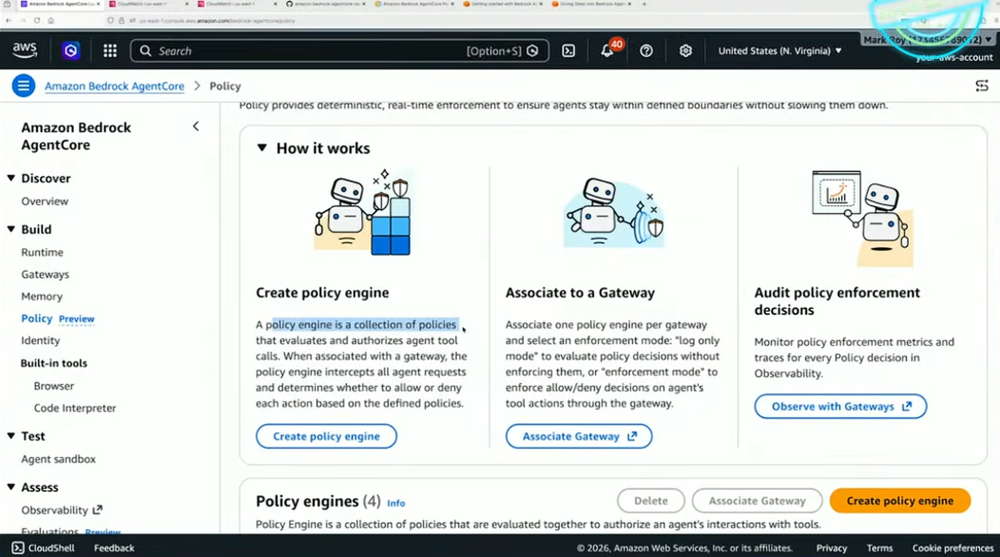
*⬆️ The demo divider — "Policy in AgentCore Demo" — marking the handoff from concepts to the live console walkthrough.*

The demo begins by orienting us in the AWS console — Policy appears as a first-class capability in the AgentCore experience.

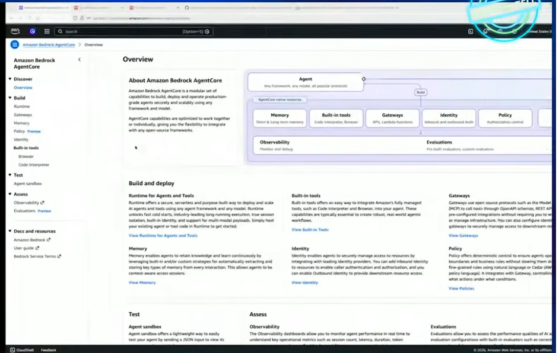
*⬆️ The AgentCore console overview — Policy appears under Build in the left nav (marked Preview) alongside Runtime, Gateways, Memory, Identity, Built-in tools, Browser, and Code Interpreter.*

**👀 What you're seeing:** The AgentCore console landing page — the left navigation lists all the building blocks, and **Policy** sits in the Build section tagged as a Preview feature.

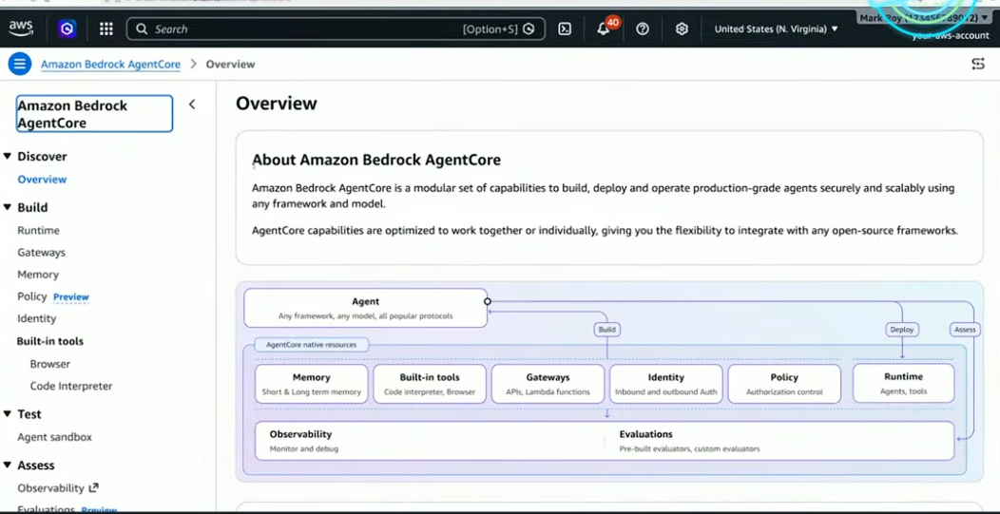
*⬆️ Zoomed in — the capability cards: Policy is "authorization control" for agent actions, sitting alongside Evaluations under the governance umbrella.*

**👀 What you're seeing:** The feature cards on the overview page, including the **Policy** card describing authorization control over agent-tool interactions.

**🔍 What the speakers explain:** Policy is positioned as a peer of the runtime/building blocks — not a bolt-on. It pairs naturally with **Evaluations** (Chapter 11) under AgentCore's governance story: evaluations measure *how well* the agent performs; policy controls *what it's allowed to do*.

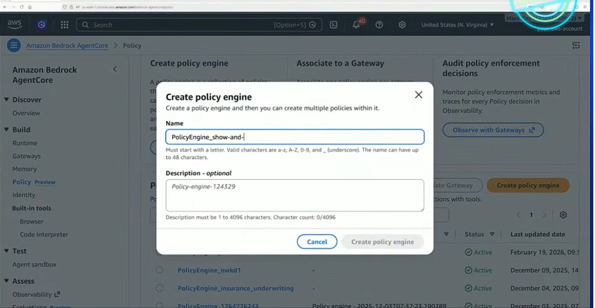
*⬆️ The Policy console page — the "How it works" flow has three steps: create a policy engine, associate it to a gateway, then audit enforcement decisions via Observability. Below, the policy engines list.*

**👀 What you're seeing:** The Policy page's built-in workflow: **① Create policy engine → ② Associate to a Gateway → ③ Audit policy enforcement decisions** (Observe with Gateways). Underneath, the list of existing policy engines in the account.

**🔍 What the speakers explain:** This three-step flow is the entire lifecycle: the engine is the *container* for policies, the gateway association is what puts policies *on the traffic path*, and CloudWatch is where you *see* the decisions. Notably, an unassociated engine evaluates nothing — policies only matter once attached to a gateway.

> **🎯 Key Takeaway:** Policy engine = a governed collection of Cedar policies. It does nothing until associated with a gateway — association is what arms it.

---

## 12.5 ⚙️ Creating the Policy Engine

Step one of the console flow: stand up the engine itself.

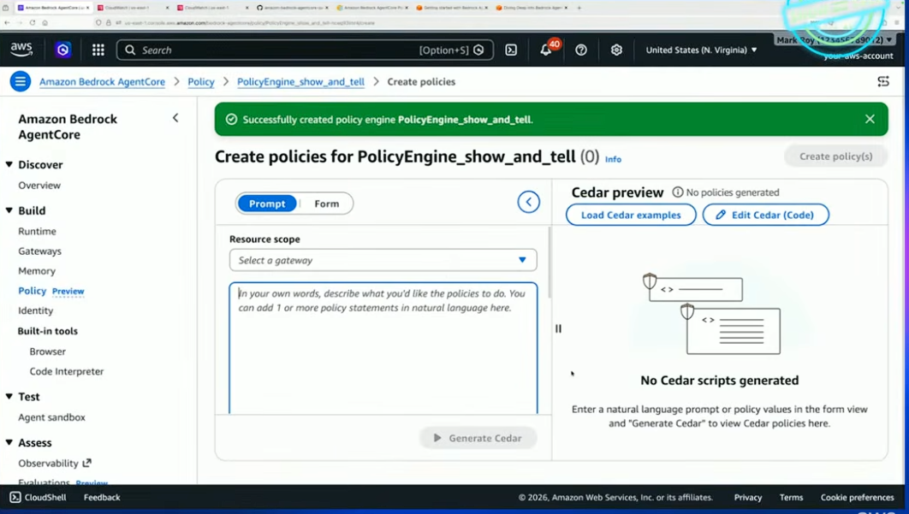
*⬆️ The "Create policy engine" dialog — just a name (`PolicyEngine_show-and-…`) and an optional description. The engine is a container; the rules come next.*

**👀 What you're seeing:** A minimal creation dialog — a policy engine name, optional description, create button.

**🔍 What the speakers explain:** Deliberately lightweight — creating the engine doesn't bind it to any traffic or bake in any rules. You get an ARN, an Active status, and an empty shell.

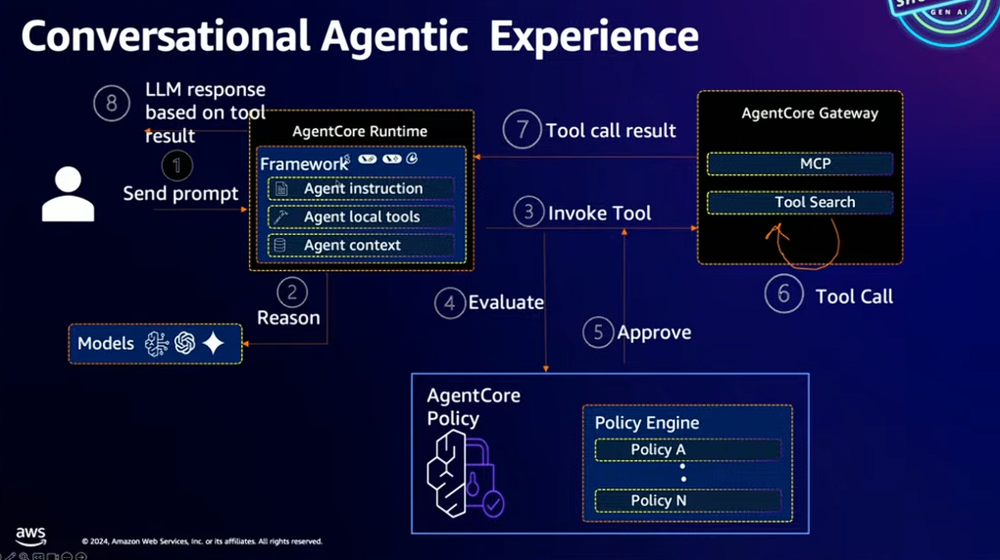
*⬆️ The new engine's detail page — Status: **Active**, Associated gateways: **0**, Policies: **0**.*

**👀 What you're seeing:** The `PolicyEngine_show_and_tell` detail page — Active with its ARN, zero associated gateways, zero policies.

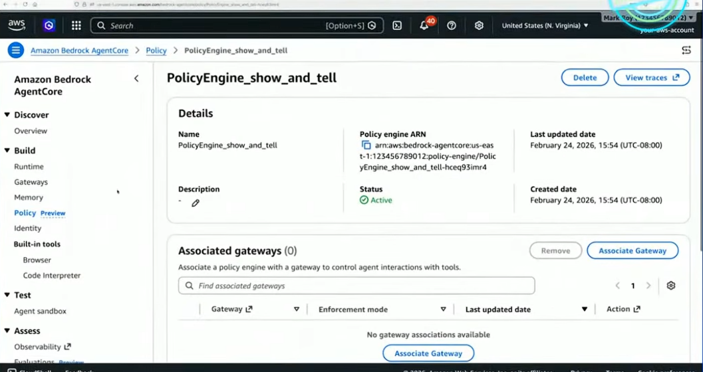
*⬆️ Same engine, scrolled to the Associated gateways panel — "No gateway associations available." The engine exists but governs nothing yet.*

**👀 What you're seeing:** The Associated gateways section with the empty-state message and the **Associate Gateway** button — the reminder that the engine is inert until bound.

**🔍 What the speakers explain:** Two independent empty states to fill — *policies* (the rules) and *gateway associations* (where they apply). The demo fills them in that order: author policies first, associate second.

> **🎯 Key Takeaway:** The engine is instant to create precisely because it's inert — all the safety semantics come from the policies and associations you layer on next.

---

## 12.6 🔄 The Denied Path — Where Evaluation Intercepts

Before building the use case, the episode shows the conceptual loop — specifically the path when a policy says *no*.

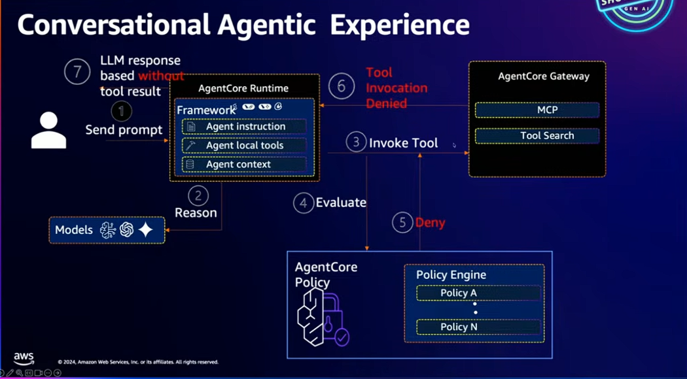
*⬆️ The "Conversational Agentic Experience" diagram — numbered flow: ① send prompt → ② reason → ③ invoke tool → ④ evaluate → ⑤ **Deny** → ⑥ tool invocation denied → ⑦ LLM responds based on the denial, without a tool result.*

**👀 What you're seeing:** The full request loop with the policy evaluation step highlighted. The AgentCore Runtime box (framework, agent instruction, local tools, agent context) sends an Invoke Tool request toward the Gateway (MCP, Tool Search); AgentCore Policy evaluates it; on this slide the outcome is **Deny** — the tool call never executes, and the model has to respond without a tool result.

**🔍 What the speakers explain:** The critical insight is *where* in the loop evaluation lands — **after the model decides to call a tool, before the tool runs**. On the allowed path the flow continues into an actual tool call whose result comes back to the model; on this denied path, the denial itself becomes the information the model works with. The agent isn't killed or reset — it's told "you can't do that" and reasons onward, typically explaining the denial to the user instead of silently failing.

:::tip Why this beats in-agent checks
> The denial happens at the gateway, so it applies *even if the model was manipulated into attempting the call*. The model proposes; policy disposes.
:::

> **🎯 Key Takeaway:** Evaluation is a synchronous gate on step ③→④. Denied calls produce a structured denial the agent can react to — not a crash, not a silent drop.

---

## 12.7 🏢 The Use Case — An Insurance Underwriting Gateway

The demo scenario: a Strands agent fronting an **Insurance-Underwriting** gateway with three tools — an application intake tool, a risk model, and an approval tool.

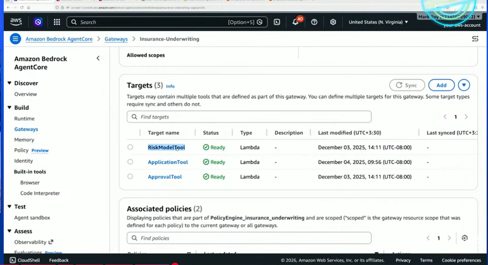
*⬆️ The gateway's targets — three tools: `RiskModelTool`, `ApplicationTool`, and `ApprovalTool`, plus an Associated policies section already showing two attached policies.*

**👀 What you're seeing:** The `Insurance-Underwriting` gateway's **Targets (3)**: `RiskModelTool`, `ApplicationTool`, `ApprovalTool` — and below, **Associated policies (2)**.

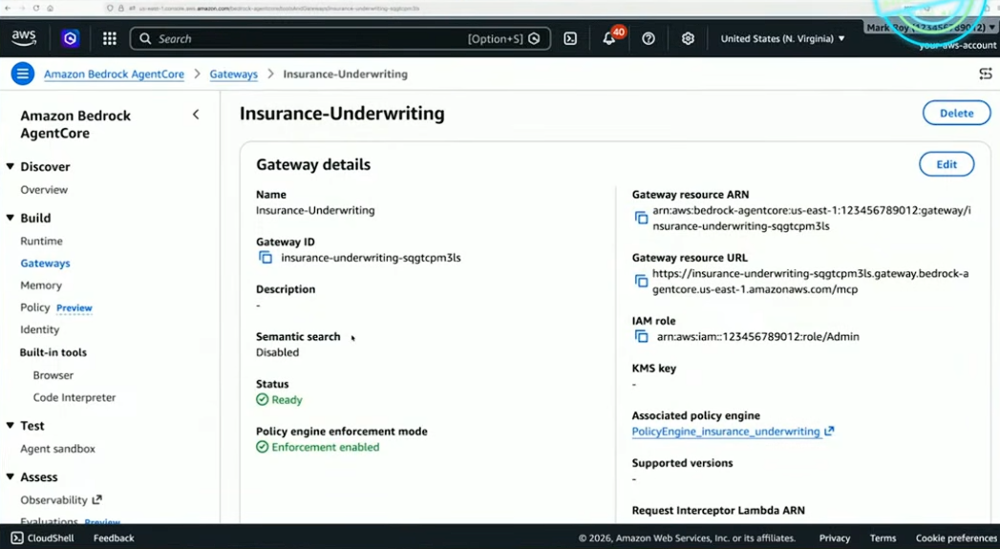
*⬆️ Gateway details — the gateway has a policy engine associated and enforcement enabled.*

**👀 What you're seeing:** The gateway detail view showing its associated policy engine and enforcement state — this gateway is governed.

**🔍 What the speakers explain:** Three tools with very different risk profiles:

| Tool | What it does | Why it needs governing |
|---|---|---|
| `ApplicationTool` → `create_application` | Creates an insurance application with a coverage amount | A $10M policy shouldn't be creatable by just anyone |
| `RiskModelTool` → `invoke_risk_model` | Runs risk scoring with API classification + governance flags | Sensitive model — should be restricted by team |
| `ApprovalTool` | Approves applications | The dangerous one — a self-serve user must *never* reach it (approve your own application = fraud) |

The episode's point: an ungoverned agent connected to this gateway could be prompted (or manipulated) into calling the approval tool directly. Policy is what makes that structurally impossible.

### The tool schemas the policies will reason about

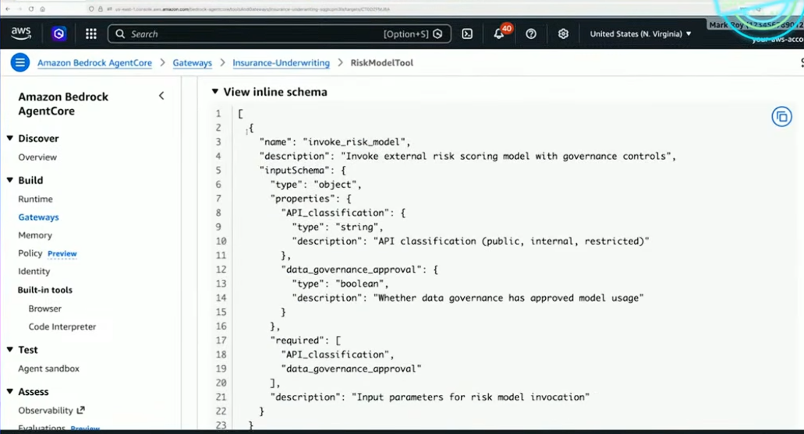
*⬆️ `RiskModelTool` inline schema — `invoke_risk_model` takes `API_classification` (enum: public/internal/confidential/restricted) and `data_governance_approval` (boolean).*

**👀 What you're seeing:** The OpenAPI-style inline schema for the risk model tool — its two parameters, including the enum-constrained classification and a governance-approval flag.

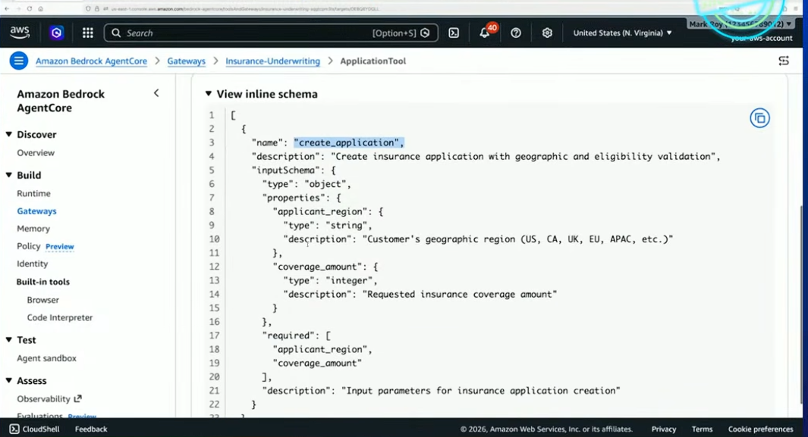
*⬆️ `ApplicationTool` schema — `create_application` takes `applicant_region` (string) and `coverage_amount` (integer).*

**👀 What you're seeing:** The application tool's schema — the `coverage_amount` integer that the flagship policy will condition on.

**🔍 What the speakers explain:** These schemas matter because policies can read **every parameter the agent sends**. The tool contract (what a call *looks* like) becomes the vocabulary for policy conditions — `coverage_amount`, `API_classification`, `applicant_region` are all evaluable inputs, not opaque payloads.

> **🎯 Key Takeaway:** Because enforcement sits at the gateway, policies see structured tool parameters — governance can be as granular as "coverage_amount < 5,000,000," not just "tool allowed or not."

---

## 12.8 ✍️ Authoring Policies — Natural Language to Cedar

Now the flagship capability: write what you want in plain English, and the console generates the Cedar policy — with a live preview and validation.

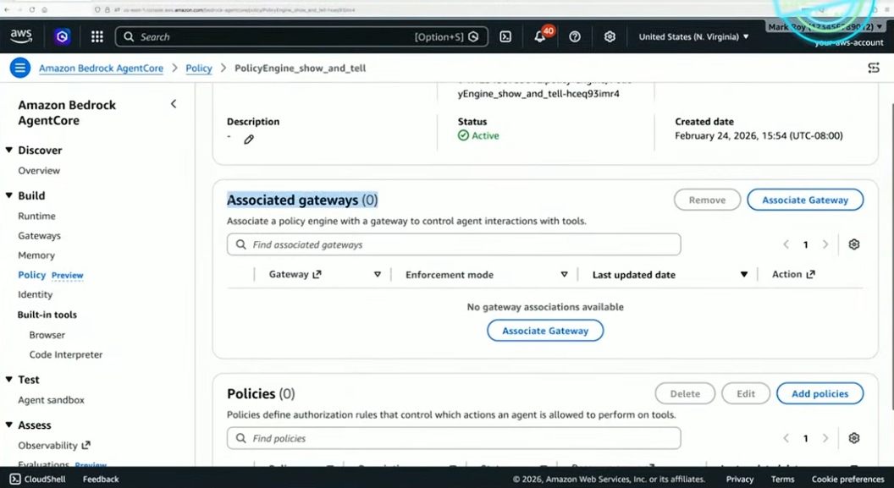
*⬆️ The "Create policies" page — a Prompt tab for natural-language input, a Form tab for structured authoring, a Resource scope selector (which gateway's tools), and an empty Cedar preview with a Generate button.*

**👀 What you're seeing:** The two authoring modes — **Prompt** (natural language) and **Form** (guided fields) — plus the Cedar preview pane showing "No policies generated" and the Generate Cedar button.

**🔍 What the speakers explain:** Cedar is the underlying language — AWS's open-source authorization language — but you don't have to write it. The natural-language path lowers the barrier for security teams who know the *rule* but not the *syntax*, while the generated Cedar is still inspectable and verifiable.

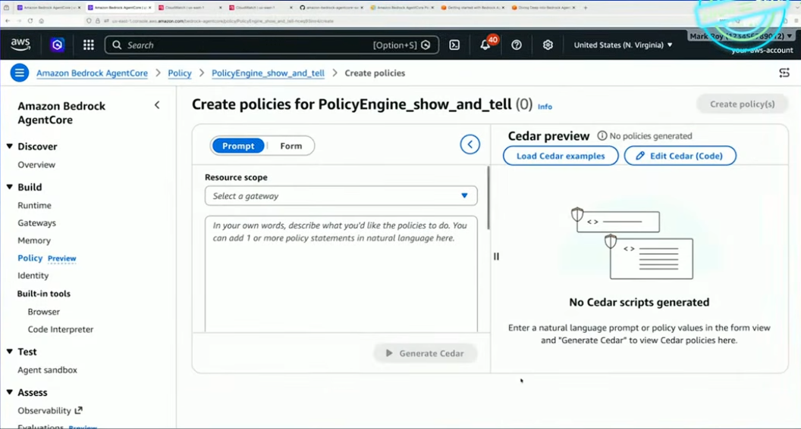
*⬆️ The create-policies page again — resource scope points at the insurance gateway so the generator knows which tools/actions exist.*

**👀 What you're seeing:** The prompt box with the gateway selected as resource scope — scoping generation to the tools actually deployed on that gateway.

**🔍 What the speakers explain:** Resource scope is how generated policies get real, verifiable action names — the generator maps your intent onto the actual `ToolName___operation` action identifiers from the selected gateway instead of guessing.

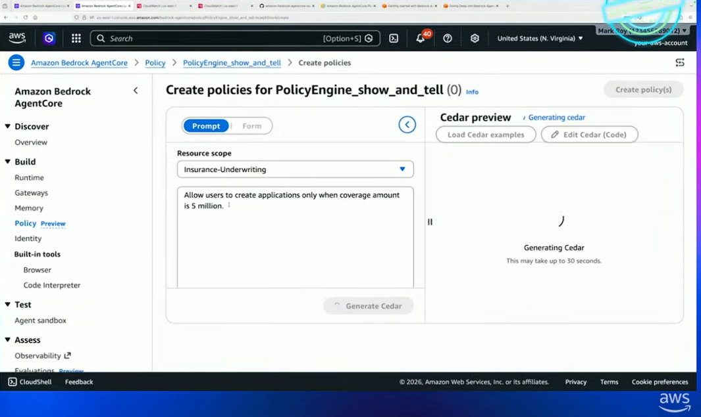
*⬆️ The natural-language rule typed in: "Allow users to create applications only when coverage amount is [under] 5 million" — and the UI shows "Generating Cedar policy…".*

**👀 What you're seeing:** The intent expressed in one sentence of English, with the generation spinner running (the episode notes generation takes ~30 seconds).

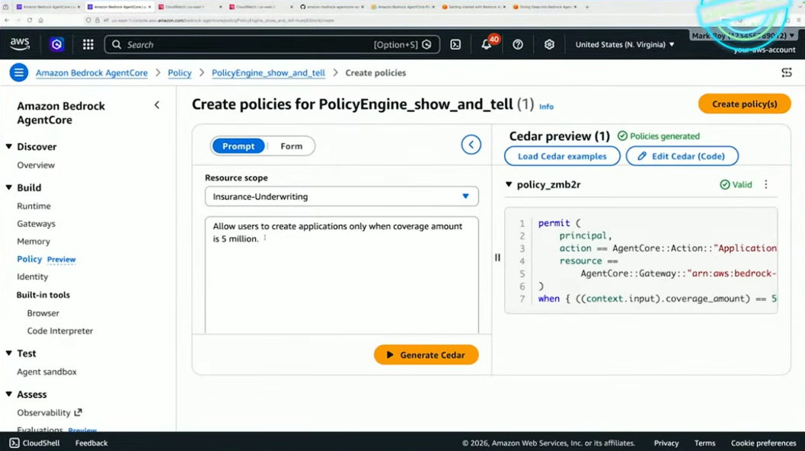
*⬆️ The generated Cedar — a `permit` on `ApplicationTool___create_application` with a `when` clause on `context.input.coverage_amount`, marked **Valid**.*

**👀 What you're seeing:** The Cedar preview filled in — a syntactically valid permit statement scoped to the gateway ARN, conditioned on the coverage amount input parameter.

**Explore the generated policy** (recreated from the on-screen Cedar — the actual policy conditions on `< 5000000`; the console preview shows the same structure):

<GitHubExplorer repo="awslabs/agentcore-samples" ref="main" expanded="true" title="Generated Cedar — the coverage-amount policy" files={[{"path":"01-features/07-centralize-and-govern-your-ai-infrastructure/02-policy/policy_application_tool.cedar","src":"/bedrock-deepti/code/policy_application_tool.cedar","label":"policy_application_tool.cedar","highlights":[[3,8]],"note":"Recreated from the Cedar generated on screen. principal = the authenticated caller (from the gateway's OAuth identity), action = the specific tool operation, resource = the gateway ARN, and the when clause reads the tool's input parameter — policy conditions can see inside the request payload, not just the call name."}]} />

**🔍 What the speakers explain — the Cedar anatomy:**

| Element | Meaning | In this policy |
|---|---|---|
| `permit` / `forbid` | Allow or deny the interaction | `permit` |
| `principal` | Who is acting — the OAuth/JWT identity at the gateway | Any authenticated principal |
| `action` | What's being done — gateway tool operation | `ApplicationTool___create_application` |
| `resource` | What it's done on | The gateway ARN |
| `when { context.input.* }` | Conditions on the request's tool parameters | `coverage_amount < 5000000` |

:::tip The `context.input` superpower
> Policies don't just see *which* tool is called — they see the *arguments*. That's what turns "is this allowed?" into "is this call, with these parameters, from this identity, allowed?" — the difference between a firewall and a business rule.
:::

> **🎯 Key Takeaway:** Natural language → Cedar isn't a toy translation: it produces real, inspectable authorization code bound to actual gateway actions, with the generated policy validated before you ever save it.

---

## 12.9 🚫 Safety Rails — Overly-Permissive Detection and Validation Modes

What happens when you write a *bad* policy? The episode deliberately tries the most dangerous one: "allow all users to call all tools."

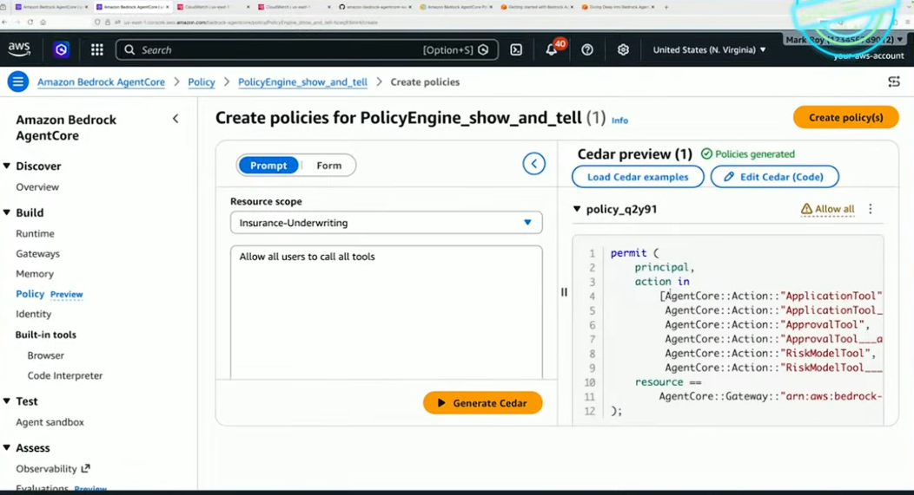
*⬆️ "Allow all users to call all tools" — the generated Cedar lists every action, and the console flags it: **Allow all** — overly permissive, permitting all actions for all principals.*

**👀 What you're seeing:** The generated permit-all policy — an action list containing every tool operation — and the warning banner flagging it as overly permissive, advising you to confirm unrestricted access is intended.

**🔍 What the speakers explain:** In the insurance scenario this is exactly wrong — it would let the end user call the *approval* tool and approve their own application. The validation catches it: the policy is flagged as permitting all actions for all principals, with a warning to confirm the intent before applying.

**Explore the permit-all policy** the console generated:

<GitHubExplorer repo="awslabs/agentcore-samples" ref="main" expanded="true" title="Generated Cedar — the dangerous permit-all" files={[{"path":"01-features/07-centralize-and-govern-your-ai-infrastructure/02-policy/policy_permit_all.cedar","src":"/bedrock-deepti/code/policy_permit_all.cedar","label":"policy_permit_all.cedar","highlights":[[5,15]],"note":"Recreated from the on-screen generation. Every action in the gateway's namespace — including ApprovalTool — permitted to every principal, with no when clause. This is what the validation layer exists to catch: technically valid Cedar, catastrophically wrong intent."}]} />

### Validation modes — the console's seatbelt

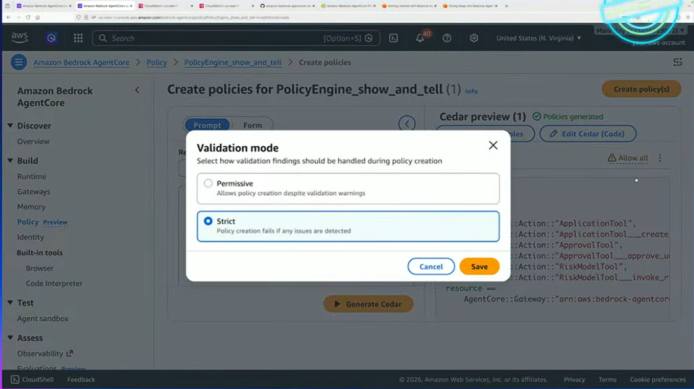
*⬆️ The Validation mode dialog — **Strict** selected: policy creation fails if issues are detected in the generated Cedar.*

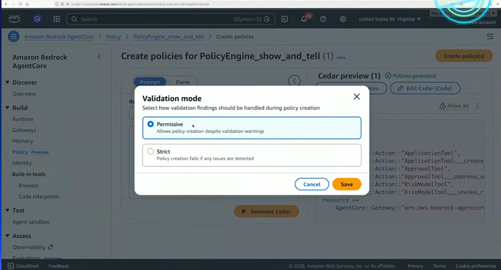
*⬆️ The same dialog with **Permissive** selected — warnings surface, but creation proceeds.*

**👀 What you're seeing:** The two validation modes — Strict (fail on detected issues) and Permissive (allow despite warnings).

**🔍 What the speakers explain:** In **Strict** mode, the permit-all policy simply cannot be created — the attempt fails. Switching to **Permissive** requires deliberate extra clicks, which is the point: the console makes you *prove* you mean it. The SDK flow differs — generation and creation are separate steps there, and this validation-mode seatbelt is a console-specific protection against mistakes slipping through the natural-language path.

### Deny by default — the safety box

The episode's deepest design property deserves emphasis:

:::danger The default posture
> The moment you attach a policy engine to a gateway, **everything is denied unless explicitly permitted**. The agent is blocked from the outside world until you start poking deliberate holes in the box. And when a `permit` and a `forbid` both match, **forbid wins** — so an explicit deny always overrides a permit. That's how you get "allow everything except the approval tool" safely.
:::

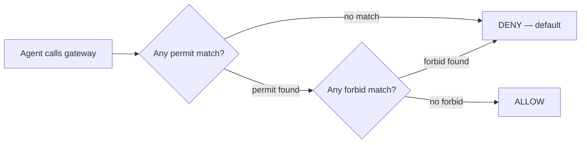
```mermaid
flowchart LR
    A["Agent calls gateway"] --> B{"Any permit match?"}
    B -->|no match| C["DENY — default"]
    B -->|permit found| D{"Any forbid match?"}
    D -->|forbid found| C
    D -->|no forbid| E["ALLOW"]
```

> **🎯 Key Takeaway:** Three safety layers stack: deny-by-default baseline, explicit forbid-wins semantics, and console validation that catches overly-permissive policies before they ship.

---

## 12.10 🔗 Associating and Arming — Enforcement Modes

A policy that isn't associated evaluates nothing. The demo now binds the engine to the gateway and picks a mode.

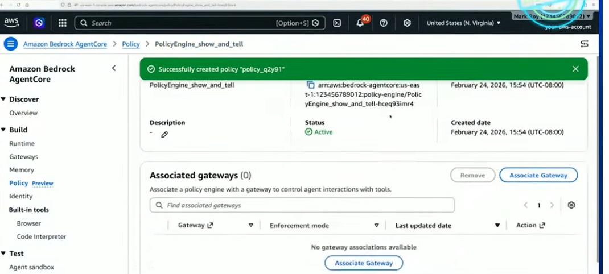
*⬆️ "Successfully created policy" — the engine is Active with a new policy, still zero associated gateways.*

**👀 What you're seeing:** The green success banner for policy creation on the Active engine — policies exist now, but the Associated gateways count is still 0.

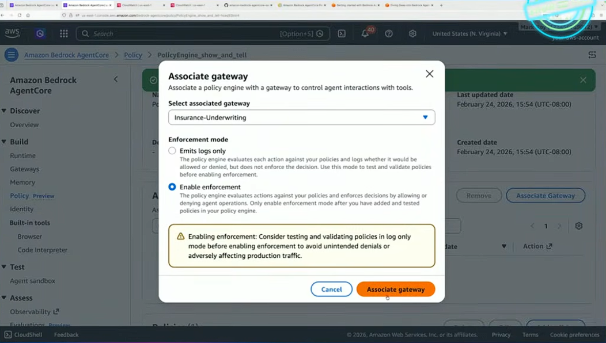
*⬆️ The "Associate gateway" dialog — Insurance-Underwriting selected, with the enforcement-mode choice: **Emits logs only** (shadow) or **Enable enforcement** (live).*

**👀 What you're seeing:** The association dialog's two modes — log-only shadow operation vs live enforcement — with a warning that live mode will actively block/allow interactions.

**🔍 What the speakers explain — the two modes:**

| Mode | What it does | When to use it |
|---|---|---|
| **Emits logs only** (shadow/monitor) | Evaluates every call and *logs* the would-be decision — nothing is blocked | New policies, before you trust them: see what *would* have been denied without impacting production |
| **Enable enforcement** | Actively allows/denies every interaction in real time | Once shadow-mode evidence shows policies match intent |

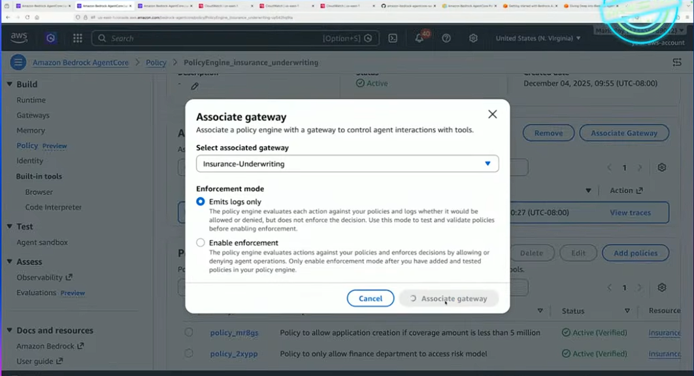
*⬆️ The same dialog flipped to **Emits logs only** — the monitor-mode path the episode recommends for new policies.*

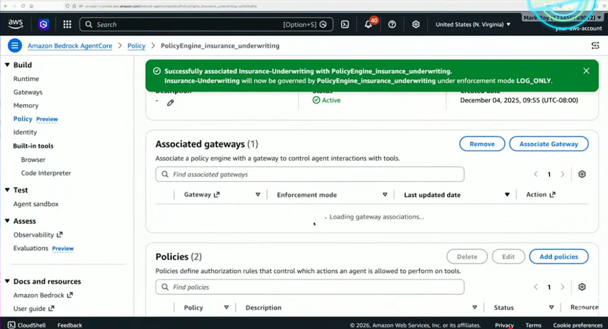
*⬆️ "Successfully associated Insurance-Underwriting with PolicyEngine_insurance_underwriting… under enforcement mode **LOG_ONLY**" — the association is live in shadow mode, with the two policies listed.*

**👀 What you're seeing:** The success banner confirming the gateway association under LOG_ONLY mode, the Associated gateways table filling in, and the Policies list showing the two rules.

**🔍 What the speakers explain:** This is the recommended rollout pattern: author → associate in log-only → watch the decisions in CloudWatch → flip to enforcement. In log-only, a $10M application attempt is *logged as denied* but proceeds — perfect for discovering that your policies catch the right things without breaking real traffic.

> **🎯 Key Takeaway:** Association is a two-step commit — bind the gateway, then choose shadow vs live. Shadow mode is the "prove it before you enforce it" stage every new policy should spend time in.

---

## 12.11 🪪 Identity-Aware Policies — Conditions on JWT Claims

The second policy shows conditions aren't limited to tool inputs — they can read *who the caller is* from the identity token.

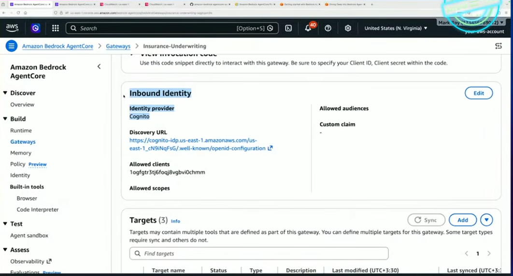
*⬆️ The gateway's inbound identity configuration — Cognito as the OAuth IDP, with discovery URL, allowed clients, and token scopes.*

**👀 What you're seeing:** The gateway's inbound identity section — Cognito configured as the identity provider with its discovery URL and allowed clients/scopes, so every request arrives carrying a JWT.

**🔍 What the speakers explain:** The caller's JWT flows through the gateway into policy evaluation. The IDP's claims — like a custom `department_name` claim (finance vs engineering) — become `principal` attributes the policy can test. In the demo, Cognito is the inbound IDP, configured via AgentCore Identity on the gateway.

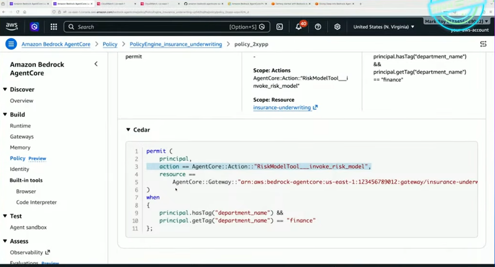
*⬆️ `policy_2xypp` — the generated Cedar permitting `RiskModelTool___invoke_risk_model` only when `principal` has `department_name == "finance"`.*

**👀 What you're seeing:** The policy detail page showing the permit condition — the principal's tag `department_name` must equal "finance" for the risk-model action to be allowed.

**Explore the identity-conditioned policy:**

<GitHubExplorer repo="awslabs/agentcore-samples" ref="main" expanded="true" title="Generated Cedar — the finance-department policy" files={[{"path":"01-features/07-centralize-and-govern-your-ai-infrastructure/02-policy/policy_risk_model.cedar","src":"/bedrock-deepti/code/policy_risk_model.cedar","label":"policy_risk_model.cedar","highlights":[[7,10]],"note":"Recreated from the on-screen Cedar. The condition reads principal.hasTag + getTag on department_name — attributes extracted from the caller's JWT claims. Engineering users can't even see this tool; finance users can. Same gateway, same agent code — different visible capability set per identity."}]} />

**🔍 What the speakers explain:** The policy reads claims *directly from the JWT* — the agent code doesn't check departments; the policy engine does. Combined with the coverage-amount policy:

| Policy | Condition | Effect |
|---|---|---|
| `policy_mr8gs` | `context.input.coverage_amount < 5000000` | Anyone can create applications under $5M |
| `policy_2xypp` | `principal.getTag("department_name") == "finance"` | Only finance users can invoke the risk model |
| *(implicit)* | deny-by-default | **Nobody** can call `ApprovalTool` — no permit exists |

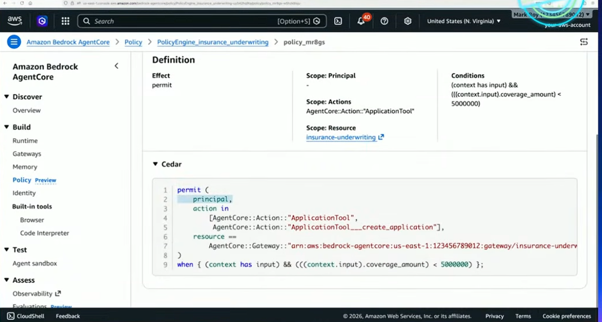
*⬆️ `policy_mr8gs` — the coverage-amount policy with its full generated Cedar (permit + when clause on `context.input.coverage_amount < 5000000`).*

**👀 What you're seeing:** The first policy's detail — the same structure as the earlier preview, now persisted with a policy ID, permit statement, gateway resource, and the input-parameter condition.

> **🎯 Key Takeaway:** Two condition axes, one policy model: `context.input` for *what's being requested*, `principal` tags/claims for *who's requesting*. Deny-by-default covers everything you didn't permit.

---

## 12.12 ▶️ Policy in Action — The Live Agent

Now the payoff: a Strands agent connected to the governed gateway, run interactively with a real Cognito identity.

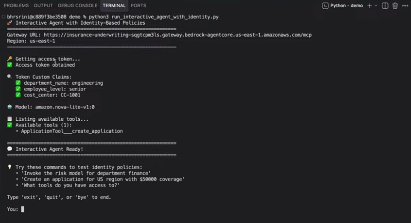
*⬆️ The agent startup — `run_interactive_agent_with_identity.py` fetches a Cognito access token, prints the decoded claims (`department_name: engineering`), lists available tools — and shows exactly **one**: `ApplicationTool___create_application`.*

**👀 What you're seeing:** Terminal output — the gateway URL, the Cognito token acquisition, the JWT's custom claims (engineering department, employee level, cost center), the model (`amazon.nova-lite`), and the tool list: only `ApplicationTool___create_application`.

**The agent code behind this run:**

<GitHubExplorer repo="awslabs/agentcore-samples" ref="main" expanded="true" title="The Strands agent connected to the governed gateway" files={[{"path":"01-features/07-centralize-and-govern-your-ai-infrastructure/02-policy/01-tool-access-with-policy/utils/agent_with_tools.py","label":"agent_with_tools.py","highlights":[[1,10]],"note":"Real file from the agentcore-samples repo — the relocated version of this episode's demo (same Insurance-Underwriting tools). The Strands agent authenticates with Cognito, connects to the gateway, and asks it for tools — the gateway returns only what policy permits this identity to see."}]} />

**🔍 What the speakers explain — the two things this output proves:**

1. **ListTools is governed too.** The agent sees *one* tool, not three — the approval tool has no permit at all, and the risk model requires `department_name == finance` while this caller is in **engineering**. Policy filters the *discovery* API, not just invocation.
2. The agent genuinely can't see the forbidden tools — it's not "sees but can't call"; they're absent from its worldview entirely.

:::info Why governing ListTools matters
> If you only filter invocations, the model still knows the dangerous tools exist — it can waste tokens attempting them or leak their existence to users. Filtering discovery means the agent's reachable action space *is* its authorized action space.
:::

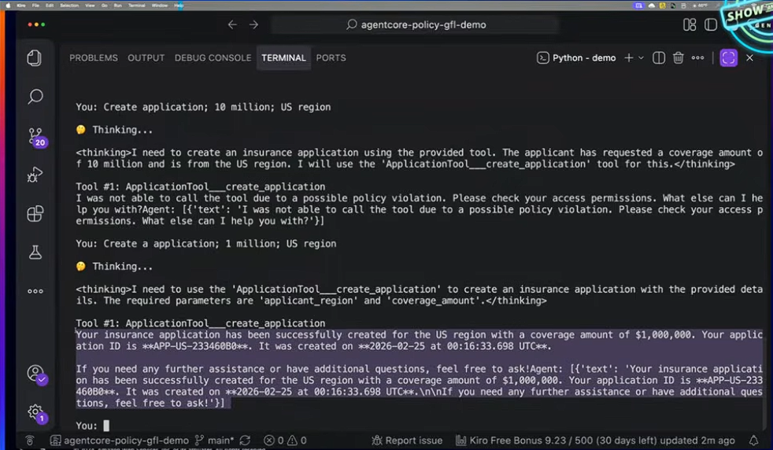
*⬆️ The coverage-amount test — a $10M application request fails with a policy-violation response; a $1M request succeeds (`APP-US-233460B0` created).*

**👀 What you're seeing:** Two interactions — the agent can't call the tool for the $10M request ("not able to call the tool due to a possible policy violation — please check access"), then the $1M request goes through and the Lambda-backed tool confirms creation.

**🔍 What the speakers explain:**

- The $10M attempt hits `coverage_amount < 5000000` and is denied — the gateway returns an error the agent turns into a graceful explanation (the episode notes the "policy violation" phrasing is *agent-configured* response text, not a raw exception).
- The $1M request satisfies the condition — policy allows, tool executes, application created.
- **The policy evaluated the parameter, not the prompt** — the user just asked for an amount; the deterministic check on `context.input` decided the outcome.

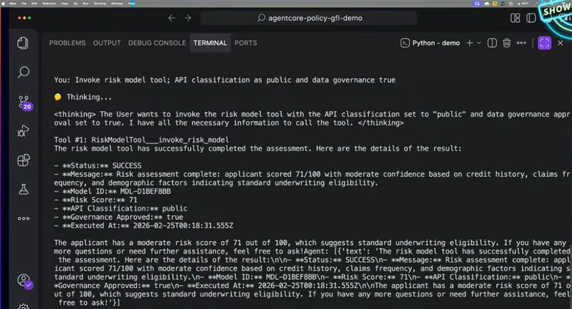
*⬆️ The finance switch — after updating the Cognito claims to `department_name: finance`, the risk model tool appears and invokes successfully (score 71/100, classification `public`, governance approved).*

**👀 What you're seeing:** The terminal run post-switch — the decoded claims now show the finance department, `RiskModelTool___invoke_risk_model` appears in available tools, and a real invocation returns a risk score.

**🔍 What the speakers explain:** The demo uses helper scripts to modify the Cognito custom claims — same user, different department. The moment the JWT carries `department_name: finance`, the *same gateway, same agent* now sees and can invoke the risk model — because the policy's `principal` condition reads live claims, not cached config. No redeploy, no code change.

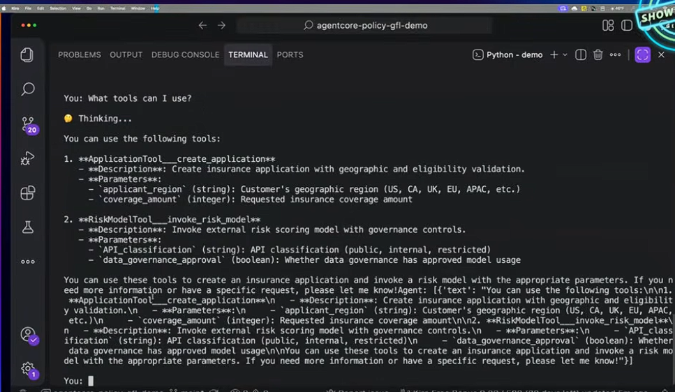
*⬆️ Answering a user question from chat — "what tools can I use?" returns both tools with their parameter signatures (`create_application`'s coverage_amount + applicant_region; `invoke_risk_model`'s API_classification + governance flag).*

**👀 What you're seeing:** The agent enumerating its *policy-filtered* tool inventory — it can honestly tell the user what it's allowed to use because the tool list itself is the filtered set.

**🔍 What the speakers explain:** This answers a live-stream question — since `ListTools` is filtered by policy, asking the agent "what can you use" is a real-time readout of the effective policy surface for this identity. The LLM just reports what the gateway told it.

**Bonus — A2A governance:** Another chat question asked whether this extends to agent-to-agent traffic. The answer: attach the *callee agent* as a gateway target, and the same policy evaluation applies — "don't call the research-assistant agent under these conditions" is expressible the same way, since A2A is just a protocol and the gateway remains the chokepoint.

> **🎯 Key Takeaway:** The demo's three moments — engineering sees 1 tool, $10M denied while $1M allowed, finance sees + calls the risk model — are the entire policy thesis enacted: identity-conditioned, parameter-conditioned, deterministic.

---

## 12.13 📊 Policy Observability — Every Decision in CloudWatch

Enforcement without visibility isn't governance. The final piece: the audit trail.

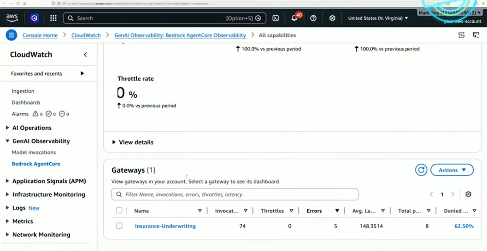
*⬆️ CloudWatch GenAI Observability — the Gateways tab: `Insurance-Underwriting` with 74 invocations, throttle/error counts, and the policy-decision metrics (deny ratio visible in the decision breakdown).*

**👀 What you're seeing:** The observability dashboard's gateway summary — invocation totals plus **policy evaluation** metrics showing allowed vs denied decision counts for this gateway.

**🔍 What the speakers explain:** Policy decisions are first-class telemetry — you see allow/deny counts over time, per policy. And it captures *every* evaluation, including the `ListTools` calls each agent startup makes — the dashboard counts those policy decisions too, not just tool invocations.

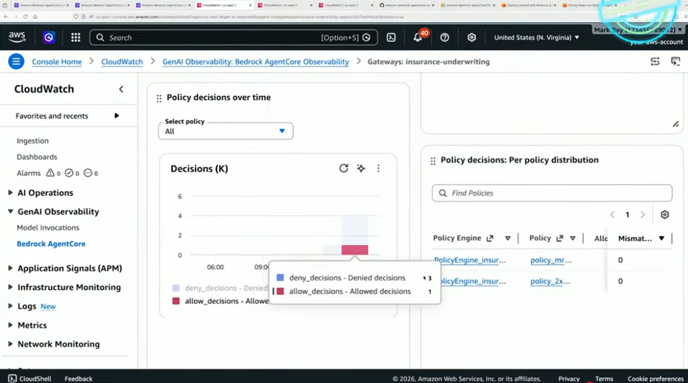
*⬆️ Policy decisions over time — the stacked deny/allow chart and the per-policy distribution table (`policy_mr8…`, `policy_2x…` with mismatch counts).*

**👀 What you're seeing:** The decision-over-time visualization with allow vs deny bars and the per-policy distribution — each policy engine's rules with their allow/deny volumes and a **Mismatched policies** column.

**🔍 What the speakers explain — the hidden feature: policy drift tracking.**

- **Mismatched policies** flag when a policy references tools or parameters that no longer match — e.g., developers rename a tool or change `coverage_amount`'s schema, and the policy that conditioned on it silently stops matching.
- You can wire CloudWatch alarms on the mismatch metric — "a drifted policy fired, go check whether your rules still cover the tool surface."
- This is the governance answer to "the agent moved, did the guardrail move with it?"

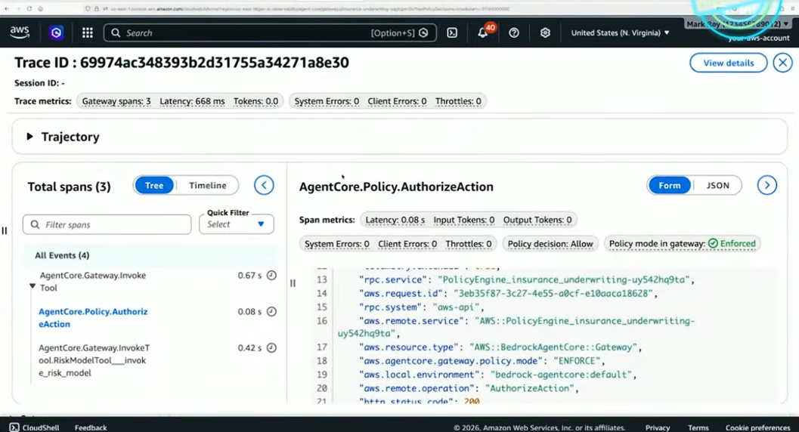
*⬆️ Inside a trace — the `AgentCore.Policy.AuthorizeAction` span: **Policy decision: Allow**, policy mode **Enforced**, and the span attributes naming the determining policy and gateway.*

**👀 What you're seeing:** The trace detail for a single call — a `AuthorizeAction` span (0.08 s) carrying `Policy decision: Allow` and `Policy mode in gateway: Enforced`, with attributes including the policy engine service, gateway mode `ENFORCE`, and the AuthorizeAction operation.

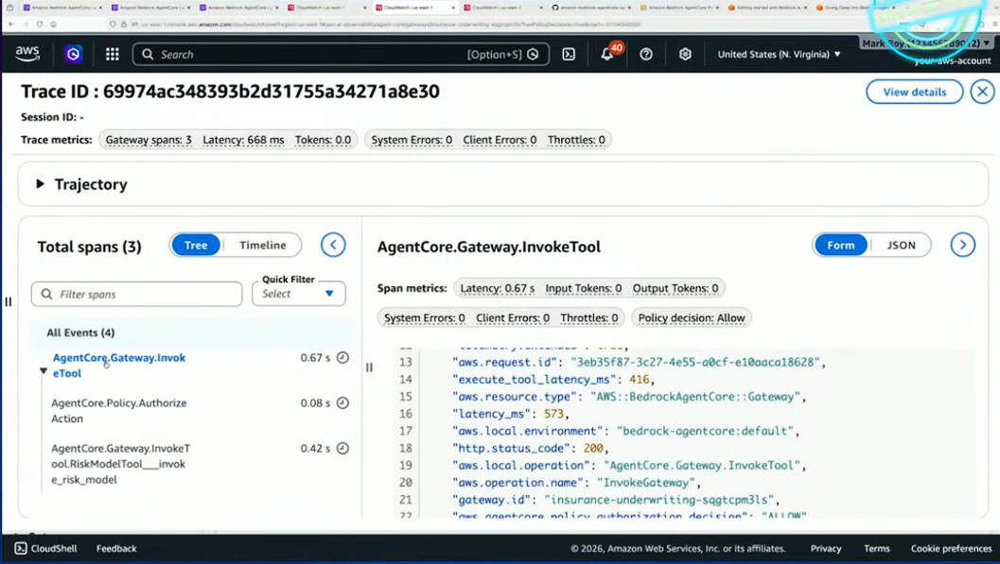
*⬆️ The parent `AgentCore.Gateway.InvokeTool` span — status 200, `Policy decision: Allow`, with `gateway.id` and the tool-invocation attributes.*

**👀 What you're seeing:** The root span of the same trace — the gateway's InvokeTool operation wrapping the authorization span, carrying the same allow decision in its attributes.

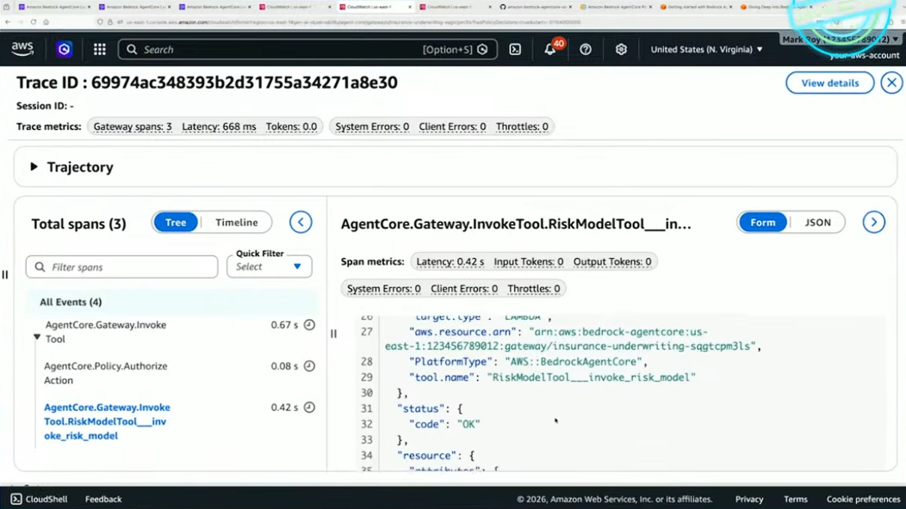
*⬆️ The leaf span — `InvokeTool.RiskModelTool___invoke_risk_model` — the actual tool execution after the allow, with `tool.name` and `status: OK`.*

**👀 What you're seeing:** The third span — the tool invocation itself, namespaced with the tool name, completing OK.

**🔍 What the speakers explain:** The trace anatomy is the governance story in miniature — **invoke → authorize → execute**, three spans, and the authorize span names *which policy* produced the decision. That's the audit primitive: every action an agent took is traceable back to the specific rule that permitted it, and every denial carries the determining policy too — you can trace a decision back to a rule and update the rule.

> **🎯 Key Takeaway:** Span-level authorization events + decision-over-time metrics + per-policy distribution + drift detection = a complete audit loop. You can answer "why was this allowed?" with a named policy, not a shrug.

---

## 12.14 🧱 Guardrails vs Policy — and Closing

The episode closes by disambiguating two services that sound similar but govern different surfaces.

| | **Bedrock Guardrails** | **AgentCore Policy** |
|---|---|---|
| **Governs** | What the agent *can say* | What the agent *can do* |
| **Sits between** | User ↔ LLM | Agent ↔ tools |
| **Protects against** | Bad prompts in, bad responses out | Unauthorized tool calls, over-privileged actions |
| **Mechanism** | Content filters, topic denial, PII redaction, grounding checks | Cedar policies evaluated at the gateway |
| **Decision basis** | Content semantics | Identity + action + resource + input parameters |

:::tip The one-liner
> **Guardrails control what the agent can *say*. Policy controls what it can *do*.** You typically want both — they're complements, not alternatives.
:::

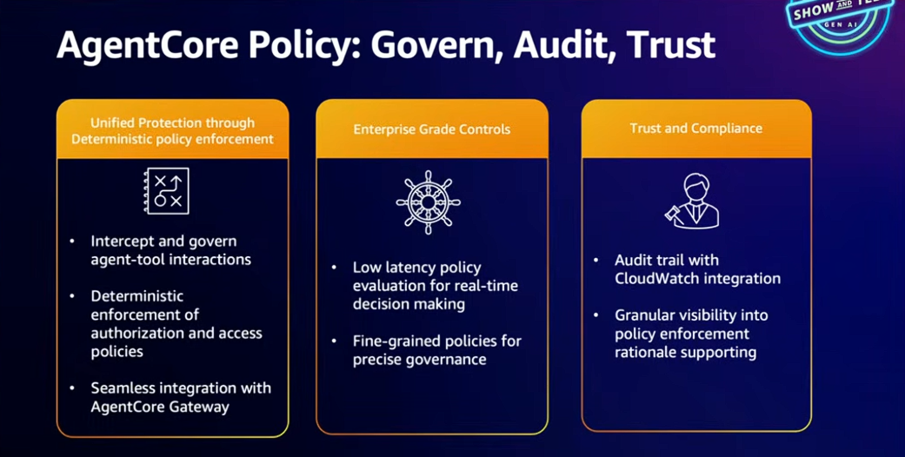
*⬆️ The closing slide — "AgentCore Policy: Govern, Audit, Trust" — deterministic enforcement, enterprise-grade controls, and CloudWatch-integrated trust.*

**👀 What you're seeing:** The recap — unified protection through deterministic policy enforcement, fine-grained low-latency controls, and the CloudWatch audit trail for trust and compliance.

**🔍 What the speakers explain — the takeaways:**

- **Govern** — intercept and govern every agent-tool interaction at the gateway with deterministic Cedar policies.
- **Audit** — every decision (allow and deny) lands in CloudWatch with the determining policy attached.
- **Trust** — the combination of deny-by-default, validation modes, shadow-mode rollout, and identity-aware conditions is how you earn the right to let agents act in production.
- The recommended adoption path: **author → associate in log-only → watch decisions → enable enforcement.**

---

## 🧠 Knowledge Check

<Quiz question="An agent connected to a policy-governed gateway sees only one of the gateway's three tools. Where did the filtering happen?" options={["The model chose to hide them","The policy engine filtered the ListTools response","The tools were uninstalled","The agent framework cached an old tool list"]} answer={1} explanation="Policy evaluates the ListTools call too — tools with no matching permit don't appear in the agent's tool inventory at all. It's not 'see but can't call'; the tools are absent from the agent's worldview." />

<Quiz question="A user asks the agent to create a $10M insurance application. A permit policy conditions on coverage_amount < 5000000. What happens?" options={["The tool executes but logs a warning","The call is denied — the when clause evaluates context.input","The agent asks for confirmation","The policy is bypassed since the user is authenticated"]} answer={1} explanation="Policies can read the tool's input parameters via context.input — the deterministic check on coverage_amount denies the call before the tool ever runs, and the agent receives a denial it can explain to the user." />

<Quiz question="You attach a policy engine to a gateway but haven't created any policies yet. What can the agent do?" options={["Everything — no policies means no restrictions","Nothing — deny by default","Only read-only tools","Only previously used tools"]} answer={1} explanation="The moment a policy engine is attached, the posture is deny-by-default: only interactions with an explicit permit are allowed. This is the 'tight safety box' design — you deliberately open what you want." />

<Quiz question="A permit policy allows all actions, and a forbid policy denies the approval tool. Both match a call to the approval tool. Result?" options={["Allowed — permits beat forbids","Denied — forbid takes precedence","Error — conflicting policies","Depends on creation order"]} answer={1} explanation="Cedar semantics: forbid always wins. This is what makes 'allow everything except X' safe — the explicit deny overrides any permit, even overly broad ones." />

<Quiz question="Why does the console offer a 'log only' enforcement mode when associating a policy engine?" options={["To save compute","Shadow mode lets you see what would be denied before blocking real traffic","Logging is required by Cedar","To debug the gateway"]} answer={1} explanation="Log-only evaluates every call and records the would-be decision without acting on it — the recommended rollout path for new policies: prove the rules catch the right things, then flip to enforcement." />

<Quiz question="The 'mismatched policies' metric in CloudWatch exists because:" options={["Policies sometimes generate invalid Cedar","Tool schemas can drift — renamed tools or changed parameters silently un-match existing policies","Policies expire after 30 days","Different policy engines can conflict"]} answer={1} explanation="When developers change tool names or parameters, policies written against the old contract stop matching. The mismatch metric + CloudWatch alarms let you catch drifted governance before it leaves gaps." />

<Quiz question="A JWT's custom claim (department_name=finance) is used to allow the risk model tool. In Cedar terms, where does this condition live?" options={["In the resource clause","On the principal — claims become principal attributes/tags evaluated in the when clause","In the action clause","In the gateway config, not the policy"]} answer={1} explanation="Inbound identity claims flow into evaluation as principal attributes — the policy's when clause tests principal.getTag('department_name'), so authorization depends on who the caller is, not just what they're calling." />

<Quiz question="Bedrock Guardrails and AgentCore Policy both sound like governance. What's the clean distinction?" options={["They're the same service","Guardrails governs what agents can say; Policy governs what agents can do","Guardrails is for images; Policy for text","Policy is free; Guardrails is paid"]} answer={1} explanation="Guardrails sits between the user and the LLM (content safety); Policy sits between the agent and tools (action authorization). Complementary controls on different surfaces." />

---

## 🎤 Interview Prep

<InterviewQA q="Why can't you enforce agent safety through the system prompt?">
Prompts are probabilistic instructions to a non-deterministic system — the model usually follows them until it doesn't, gets manipulated, or faces conflicting instructions ("be helpful" vs "don't refund over $5K"). AgentCore Policy provides deterministic enforcement external to the model: Cedar rules evaluated at the gateway on every call, regardless of agent behavior, framework, or prompt content. The model proposes; policy disposes.
</InterviewQA>

<InterviewQA q="Walk me through the AgentCore Policy architecture.">
A policy engine — a collection of Cedar policies with a lifecycle (author, validate, associate) — attaches to an AgentCore Gateway. Because all agent-to-tool traffic routes through the gateway, the engine intercepts every ListTools, InvokeTool, and SearchTools call, evaluates it in the request path with low latency, and returns allow/deny. Decisions stream to CloudWatch for audit. Enforcement happens at the gateway, so it applies to any agent regardless of where it's hosted.
</InterviewQA>

<InterviewQA q="What can a Cedar policy condition on in AgentCore?">
Four axes: principal (the caller's identity — JWT claims like department become principal tags), action (which gateway tool operation), resource (the gateway itself), and context.input (the actual tool-call parameters — enabling rules like 'coverage_amount < 5M'). That's the jump from coarse 'may call tool' checks to fine-grained business rules on arguments and identity.
</InterviewQA>

<InterviewQA q="Explain deny-by-default and forbid-precedence in this model.">
Attaching a policy engine closes the world: everything is denied until a permit explicitly allows it — you deliberately poke holes in a tight safety box. And when permit and forbid both match, forbid wins — so 'allow everything except the approval tool' stays safe even against overly broad permits. Both properties exist to make mistakes fail closed, not open.
</InterviewQA>

<InterviewQA q="How would you roll out a new policy safely in production?">
Author it (natural language → Cedar, or SDK), review the generated Cedar, associate the engine in log-only mode, and watch CloudWatch: decision counts per policy, which rules fire, mismatches. Once the shadow decisions match intent, flip the association to enforce mode. The validation layer also helps — strict mode refuses to create policies flagged as overly permissive.
</InterviewQA>

<InterviewQA q="How do policies apply to tool discovery, and why does that matter?">
ListTools is itself a governed action — the agent only sees tools with a matching permit. In the demo, an engineering-department caller saw exactly one of three tools: no permit existed for approval, and the risk model required a finance claim. This keeps forbidden tools out of the agent's reasoning entirely — better than filtering at invocation, where the model can still attempt (or leak knowledge of) forbidden calls.
</InterviewQA>

<InterviewQA q="What's the audit story when a decision needs to be explained?">
Every evaluation emits telemetry: dashboard metrics show allow/deny over time and per-policy distribution; per-invocation traces contain an AgentCore.Policy.AuthorizeAction span naming the decision, enforcement mode, and the determining policy. So 'why was this allowed?' resolves to a specific rule you can inspect and update — plus the mismatch metric flags policies that silently stopped matching after tool changes.
</InterviewQA>

<InterviewQA q="Does this governance extend to agent-to-agent (A2A) traffic?">
Yes — by making the callee agent a gateway target. A2A is just a protocol; once the target agent sits behind the gateway, the same evaluation applies: 'call the research assistant only under these conditions' is expressible in Cedar like any tool rule. The gateway remains the single chokepoint for any structured interaction.
</InterviewQA>

<InterviewQA q="Guardrails vs AgentCore Policy — when do you use which?">
Both, usually: Guardrails sits between user and LLM — content filtering, topic denial, PII redaction — governing what the agent can say. Policy sits between agent and tools — Cedar authorization — governing what the agent can do. Different threat surfaces; layered together they cover conversation and action.
</InterviewQA>

---

## 📚 Official Resources

| 📖 Resource | 🔗 Link |
|---|---|
| **AgentCore Policy — Developer Guide** | [docs.aws.amazon.com/bedrock-agentcore/latest/devguide/policy.html](https://docs.aws.amazon.com/bedrock-agentcore/latest/devguide/policy.html) |
| **Launch Blog — Evaluations + Policy** | [aws.amazon.com/blogs/aws/amazon-bedrock-agentcore-adds-quality-evaluations-and-policy-controls](https://aws.amazon.com/blogs/aws/amazon-bedrock-agentcore-adds-quality-evaluations-and-policy-controls-for-deploying-trusted-ai-agents/) |
| **Episode Samples (relocated)** | [`02-policy/` — tool-access, guardrails-in-policy, temporal policies](https://github.com/awslabs/agentcore-samples/tree/main/01-features/07-centralize-and-govern-your-ai-infrastructure/02-policy) |
| **All AgentCore Samples** | [github.com/awslabs/agentcore-samples](https://github.com/awslabs/agentcore-samples) |
| **Workshop — Getting Started** | [catalog.workshops.aws/agentcore-getting-started](https://catalog.workshops.aws/agentcore-getting-started/en-US) |
| **Workshop — Deep Dive** | [catalog.workshops.aws/agentcore-deep-dive](https://catalog.workshops.aws/agentcore-deep-dive/en-US) |
| **Cedar Policy Language** | [cedarpolicy.com](https://www.cedarpolicy.com/) |

:::warning Note on the sample repo
> The episode references `01-tutorials/08-AgentCore-policy`. The repo restructured — that material now lives under `01-features/07-centralize-and-govern-your-ai-infrastructure/02-policy/` (`01-tool-access-with-policy` is the same Insurance-Underwriting demo: application, risk-model, and approval tools). The Cedar files in this chapter are recreated from what the console generated on screen; the Python agent file is real repo code.
:::

### Related Chapters

- **Chapter 8 — AgentCore Gateway**: the chokepoint where policy enforcement happens — targets, inbound identity (Cognito), and tool schemas are all gateway concepts that this chapter's policies build on
- **Chapter 9 — AgentCore Identity**: how Cognito/IDP configuration produces the JWT claims that `principal` conditions evaluate
- **Chapter 10 — AgentCore Observability**: the tracing/logging foundation that the `AuthorizeAction` spans and decision dashboards ride on
- **Chapter 11 — AgentCore Evaluations**: the quality-measurement complement — policy governs actions, evaluations govern quality
- **EP 10 — Evaluations**: the parallel treatment of the evaluation side of the governance story

---

## 🎬 Watch the Full Episode

<VideoSection youtubeId="q_9htaugcgI" title="AWS Show & Tell — Policy in Amazon Bedrock AgentCore (deep dive with Anil Nadimi and Barati)" />

---

## 🎯 Summary

| Concept | What you learned |
|---|---|
| 🚧 **The problem** | Tool-using agents fail through authorization — authority overreach, misread business rules, data exposure — and prompts + inline checks can't fix it deterministically |
| 🛡️ **The control plane** | Policy engine (Cedar policies + lifecycle) attached to AgentCore Gateway — intercepts every ListTools/InvokeTool call in real time |
| ✍️ **Authoring** | Natural language → generated Cedar with validation; conditions on principal claims, action, resource, and `context.input` tool parameters |
| 🚫 **Safety semantics** | Deny-by-default on attach, forbid-beats-permit, overly-permissive detection, strict/permissive validation modes |
| 🔗 **Rollout** | Associate → log-only shadow mode → watch decisions in CloudWatch → flip to enforce |
| 🪪 **Identity-aware rules** | JWT claims become `principal` attributes — "finance dept only" is a policy condition, not app code |
| 📊 **Audit** | Decision metrics per policy + `AuthorizeAction` spans naming the determining policy + drift detection via mismatched policies |
| 🧱 **Placement** | Guardrails = what agents *say*; Policy = what agents *do*; session isolation + identity + observability complete the picture |

> *"Guardrails help you control what the agent can say. Policy helps you control what the agent can do." — the episode's closing line, and the cleanest mental model for the entire feature.*

:::tip 🚀 Next up
> **Chapter 13** continues the production journey — check the episode playlist for what follows governance. And revisit **Chapters 8–11** if you want the gateway, identity, observability, and evaluation foundations this policy layer builds on.
:::
