# 🧠 AgentCore Episodic Memory — Agents That Learn From Experience

> *An interactive deep-dive into the AWS Show & Tell episode "Episodic Memory and Patterns for Production Agents" — covering why production agents need more than semantic memory, the three pillars of agent user experience, the four components of self-learning agents, the episodic extraction pipeline (turns → episodes → reflections), a live incident-response demo showing real efficiency gains, memory streaming to Kinesis for custom dashboards, and the three layers of memory scoping for production.*
>
> **🎥 Source video:** [AWS Show & Tell — Episodic Memory in AgentCore](https://www.youtube.com/watch?v=1EEIGsKIjGA&list=PLhr1KZpdzukfZdp5SGgm2yBPglHNHn-Ig&index=12)
> **📦 Sample code:** [`agentcore-samples` — Memory feature samples](https://github.com/awslabs/agentcore-samples/tree/main/01-features/04-manage-context-of-your-agent/memory) (restructured since the episode; the episode's `01-tutorials/04-AgentCore-memory` material now lives here)

---

## 📖 About This Chapter

| | |
|---|---|
| **📚 Course** | AWS Bedrock to Production — Interactive Deep Dive |
| **🔖 Chapter** | 13 — AgentCore Episodic Memory |
| **🎙️ Host** | Anil Nadimi (AWS Senior Solutions Architect) |
| **👤 Guest** | Akarsha Sehwag — AWS GenAI Data Scientist, AgentCore Memory team |
| **⏱️ Runtime** | ~59 minutes of episode distilled into interactive modules |
| **🛠️ Focus** | Episodic memory — how agents learn from past episodes and generalize them into reflections |

**What you'll learn:** why production agents need to learn from experience (not just remember facts); the **episodic memory strategy** — how raw conversation turns become structured **episodes** and cross-episode **reflections**; how retrieval injects situation-specific *hints* instead of generic instructions; a live incident-response demo where memory cut tool calls **5 → 3** and made resolutions more complete; streaming memory records to **Kinesis** for custom dashboards; and the three production scoping layers — actor/session isolation, namespaces, and IAM.

:::danger The question this chapter answers
> Your agent solved this exact problem last month — brilliantly. **Why is it solving it from scratch again today, making the same trial-and-error detours?**
:::

---

## 13.1 🎬 Welcome — Agents That Get Promoted, Not Just Deployed

The episode reframes the whole AgentCore journey: we've built agents, productionized them, given them memory, observability, evaluations, and governance. Now — how do they *learn*?

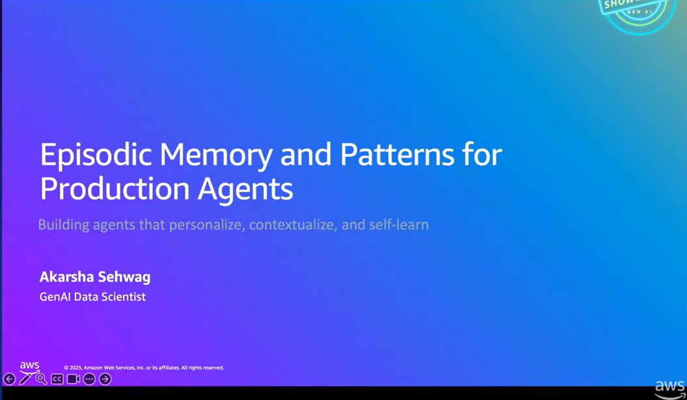
*⬆️ The title slide — "Episodic Memory and Patterns for Production Agents" with Akarsha Sehwag, GenAI Data Scientist on the AgentCore Memory team.*

**👀 What you're seeing:** The episode's title framing — episodic memory positioned explicitly as a *production agents* topic, not a research concept.

**🔍 What the speakers explain:** The industry maturation arc sets the stage — teams spent 2024–2025 getting from POCs to production; now that agents are *in* production, the question shifts to how they **evolve and learn over time** from real user interactions. The analogy Akarsha offers is parenting: no matter how well you nurture a kid (or test an agent), the real world teaches differently than the book — and a good agent, like a good engineer, gets *better* with every experience. As Anil puts it: agents never graduate — but they can get promoted.

:::tip 💡 The core idea in one sentence
> Episodic memory lets the agent talk to **its future self** — "next time I do this, I should be smarter than the last time."
:::

> **🎯 Key Takeaway:** Semantic memory stores *what* the agent knows. Episodic memory captures *how it got there* — the goal, the reasoning, the actions, the outcome, and the lesson.

---

## 13.2 🧩 Technical Capability ≠ User Experience

Before the mechanism, the motivation — the three things that separate a technically capable agent from one users actually trust.

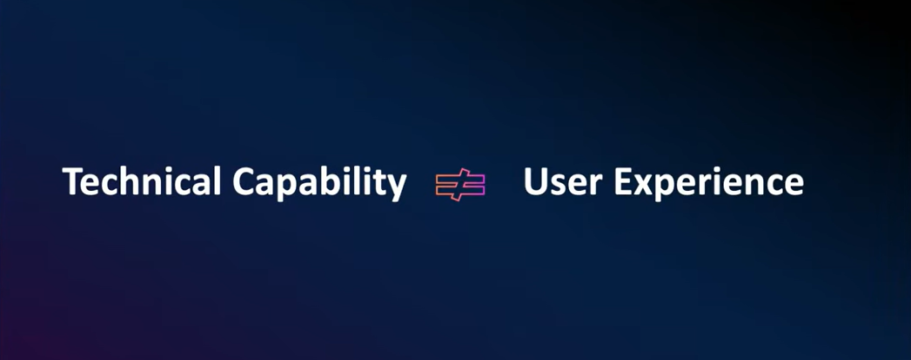
*⬆️ "Technical Capability ≠ User Experience" — you can nail tool use, planning, and protocols and still deliver an agent that feels tone-deaf.*

**👀 What you're seeing:** The slide separating engineering capability (tool use, planning, API calls, standardized protocols, databases) from what users actually judge — whether the agent *understood* them.

**🔍 What the speakers explain:** All the multi-step workflow engineering in the world doesn't help when the real user query lands — because production users have different preferences, styles, and history with your agent than your test cases did. Two levels of the problem:

- **Level 1 — real-world experience:** users say things your test suite never covered. The agent has to keep improving from *live* interactions.
- **Level 2 — per-user adaptation:** humans adapt to each other (you talk differently to a new manager than an old friend). Users expect the same from agents.

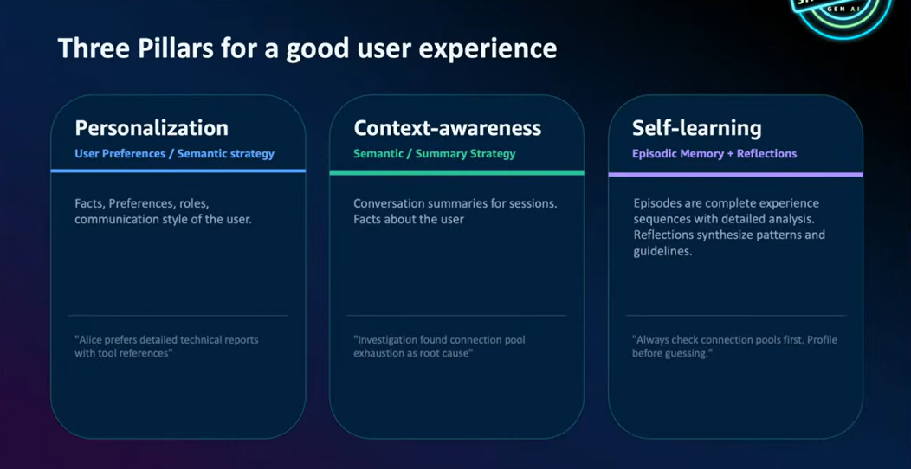
*⬆️ The three pillars — Personalization (user preferences + semantic memory), Context-awareness (semantic + summaries), Self-learning (episodic memory + reflections), each with a concrete example.*

**👀 What you're seeing:** The pillar slide mapping each UX pillar to the memory strategies that serve it — personalization fed by user-preference and semantic records, context-awareness by summaries and semantic facts, and self-learning by episodic memory and reflections.

**🔍 What the speakers explain — the three pillars:**

| Pillar | What it means | Episode example |
|---|---|---|
| 🎨 **Personalization** | Learn facts, preferences, role, and communication style over time | Alice (engineer) wants detailed technical reports with references; Carol (director) wants a one-line "did you solve it?" — same incident, different response |
| 🧠 **Context awareness** | Carry prior conversations forward — session summaries and facts | "Last time you had this issue — hope it resolved; anything else?" instead of making the user repeat themselves |
| 🔄 **Self-learning** | Learn from *episodes* — detailed analyses of what happened, root cause, tools used, outcome — then generalize into reflections | "Six months in, you remember a similar January incident; three years in, you start from the likely root cause, not the manual" |

:::info The seniority analogy
> Day-one engineer: does everything by the book. Six months: "this looks like the January 4th incident." Three years: starts from pattern recognition instead of the manual. **Episodes are the junior engineer's memory; reflections are the senior engineer's instincts.**
:::

> **🎯 Key Takeaway:** Episodic memory exists to serve pillar three — but it builds on the same long-term-memory substrate as the other two. One pipeline, three UX outcomes.

---

## 13.3 🔁 The Four Components of Self-Learning Agents

What does "self-learning" mechanically require? The episode breaks it into four components.

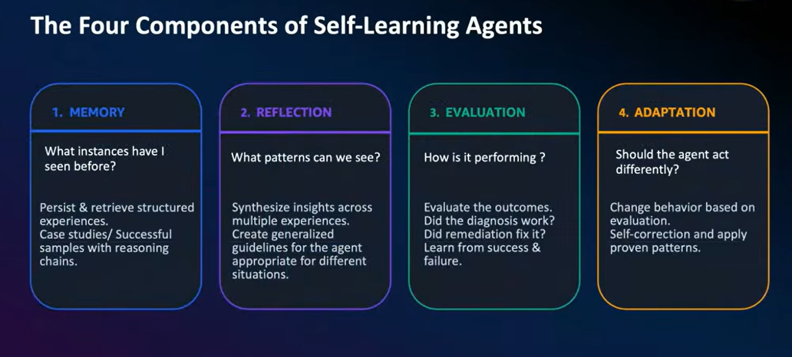
*⬆️ "The Four Components of Self-Learning Agents" — Memory, Reflection, Evaluation, Adaptation.*

**👀 What you're seeing:** Four boxes — **Memory** (recall prior episodes, successful and unsuccessful), **Reflection** (generalize experiences into patterns/guidelines), **Evaluation** (assess how episodes and reflections performed), **Adaptation** (behave differently next time, situation-specifically).

**🔍 What the speakers explain:**

1. **Memory** — recall what happened before: the successful *and* unsuccessful episodes, not just summaries.
2. **Reflection** — synthesize patterns: "mostly, this is how you solve this class of issue." Guidelines, not transcripts.
3. **Evaluation** — the agent assesses its own episodes and reflections: was the approach right? Was the user happy? Crucially, episodes should also capture **user feedback** (thumbs up/down) so evaluation has signal.
4. **Adaptation** — the payoff: *situation-specific* behavior change, not one generic system prompt — "if this kind of situation occurs, behave this way."

:::warning Self-evaluation needs supervision
> The speakers are explicit: production agents *should* self-evaluate (you can't supervise every interaction) — but like a parent checking report cards, you still need **external metrics, observability, and sometimes manual evaluation** alongside. Self-learning is not unsupervised learning.
:::

> **🎯 Key Takeaway:** Self-learning = episodes (memory) → reflections (generalization) → evaluation (did it work?) → adaptation (act differently next time). Episodic memory implements the first three; your observability stack keeps the loop honest.

---

## 13.4 🎡 The AgentCore Flywheel — Memory, Observability, Evaluations

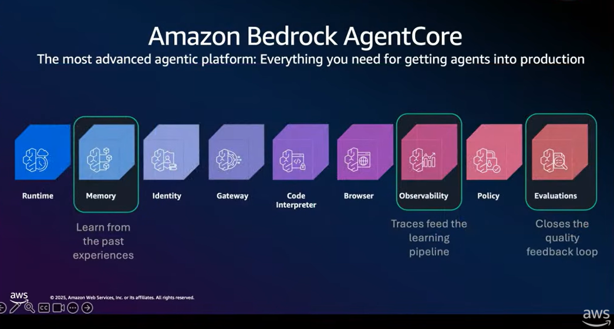
*⬆️ The AgentCore capability map with three hexagons highlighted — Memory ("learn from past"), Observability ("traces feed the learning pipeline"), and Evaluations ("closes the quality loop").*

**👀 What you're seeing:** The familiar AgentCore honeycomb with Memory, Observability, and Evaluations marked as the quality flywheel.

**🔍 What the speakers explain — the flywheel quote of the episode:**

> *"What you cannot see, you cannot measure; what you cannot measure, you cannot improve."*

- **Observability** traces (Chapter 10) feed the learning pipeline — you can't improve what you can't see.
- **Evaluations** (Chapter 11) supply the metrics — the measurement layer.
- **Memory** — and specifically episodic memory — is the improvement substrate: the lessons learned get *stored and retrieved*, not just measured.

This is also where the model/framework-agnostic point lands: AgentCore works with Strands, LangGraph, CrewAI, LangChain, any model provider — and every AgentCore service, Memory included, **works standalone** via its APIs, from any runtime or compute. You don't need Runtime or Gateway to use it.

> **🎯 Key Takeaway:** Memory alone is storage. Memory + traces + evaluations is a learning system — that's the flywheel the last three chapters build toward.

---

## 13.5 🏗️ How AgentCore Memory Is Built

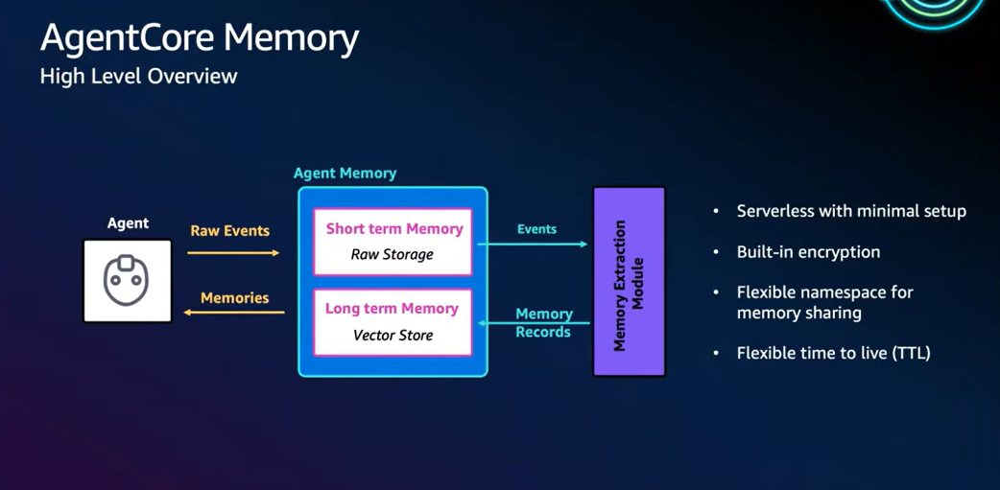
*⬆️ The memory architecture — raw events land in short-term memory; configured strategies route them through a memory-extraction module into long-term memory records, retrievable back into the conversation.*

**👀 What you're seeing:** The two-tier pipeline — **raw events** (messages, checkpoints, agent state) → **short-term memory** (raw store) → **memory extraction module** (processing pipeline, driven by your configured strategies) → **long-term memory** records → retrieval back into the agent's context.

**🔍 What the speakers explain:**

- **Short-term memory** is a raw store — anything you want to keep as-is (messages, checkpoints, agent state). Despite the name it can live up to **365 days**. Scoped by memory ID + actor ID + session ID.
- **Long-term memory** is *derived* — you configure strategies, the extraction module processes events asynchronously against them, and produces structured memory records you retrieve later.
- **You control what gets extracted:** "Carol is flying to Paris" isn't a preference unless she signals she *enjoys* Paris — extraction is relevance-filtered by the strategy, not a dump of everything said.
- Retrieval then injects relevant records back into context — episodes and preferences from previous conversations.

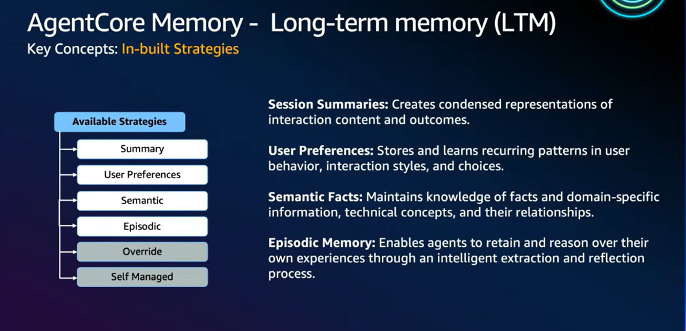
*⬆️ The service properties — fully serverless, encryption in transit and at rest, flexible namespaces for sharing or isolating memory, no vector-store capacity planning, pay-as-you-go, usable standalone from any runtime.*

**👀 What you're seeing:** The operational slide — managed/serverless, built-in encryption, flexible namespaces (share or isolate memory by design), no vector-store sizing, independent API access.

**🔍 What the speakers explain:** The production details that matter — no infrastructure to pre-provision ("don't pay for 10 GB up front — pay for what you use"), namespaces let you decide memory sharing vs per-agent isolation, and the APIs work from **any** compute — AgentCore Runtime, Lambda, EC2, or outside AWS entirely.

> **🎯 Key Takeaway:** STM = raw, synchronous, session-scoped. LTM = extracted, asynchronous, strategy-driven. Episodic memory is one of the LTM strategies — the one that preserves *experiences* rather than facts.

---

## 13.6 📚 The Four Long-Term Strategies

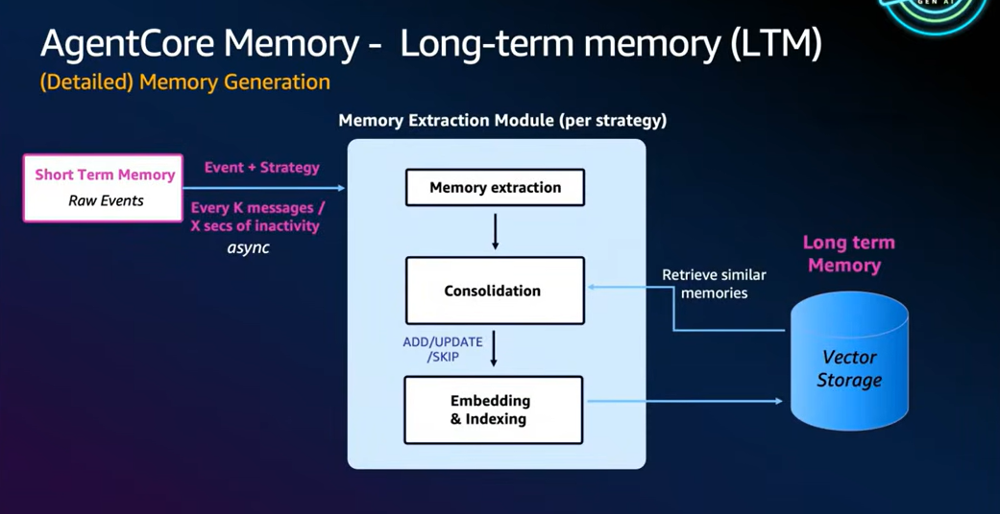
*⬆️ The built-in LTM strategies — Summary, User Preferences, Semantic, and Episodic — plus escape hatches: override prompts/models, or a fully self-managed custom pipeline.*

**👀 What you're seeing:** Four built-in strategy tiles plus the two customization paths (prompt/model override, fully custom self-managed pipeline).

**🔍 What the speakers explain:**

| Strategy | What it extracts | Serves |
|---|---|---|
| **Summary** | Topic-wise condensed representation of sessions | Context awareness |
| **User Preferences** | Behavior, interaction style, choices, likes/dislikes | Personalization |
| **Semantic** | Factual and domain-specific information | Personalization + context |
| **Episodic** | Full experiences — goal, actions, outcome, assessment, reflection | Self-learning |

And the escape hatches: the extraction **prompts are public** (linked in the docs — you can override the prompts or the models behind them), or you can build an entirely self-managed pipeline if built-ins don't fit.

**The episodic strategy in real code** — from `agentcore-samples`:

<GitHubExplorer repo="awslabs/agentcore-samples" ref="main" expanded="true" title="Configuring the episodic memory strategy" files={[{"path":"01-features/04-manage-context-of-your-agent/memory/02-long-term-memory/01-built-in-strategies/episodic.py","label":"episodic.py","highlights":[[1,15]],"note":"Real sample — the memory resource declares its strategies (episodic alongside summary/user-preference/semantic), each with a namespace pattern. The namespace template is where Layer-2 scoping happens: it decides which episodes an actor can ever see."}]} />

> **🎯 Key Takeaway:** Pick strategies by UX pillar, not by fashion — preferences/semantic → personalization, summaries → context, episodic → self-learning. And every strategy's extraction logic is overridable.

---

## 13.7 ⚙️ The Extraction Pipeline — How Events Become Memories

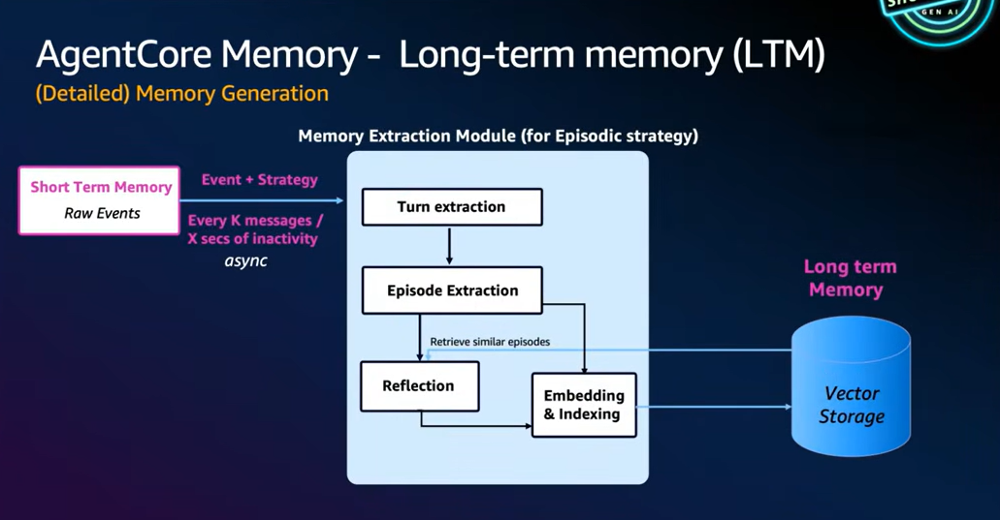
*⬆️ The detailed pipeline — extraction → consolidation (ADD / UPDATE / SKIP decisions against existing records) → embed & index → vector store.*

**👀 What you're seeing:** The inside of the "memory extraction" black box: an extraction step, a **consolidation** step that compares candidates against existing records and chooses add / update / skip, then embedding and indexing into the vector store.

**🔍 What the speakers explain — the async pipeline mechanics:**

- **Trigger:** after `k` messages or `x` seconds of inactivity, an **asynchronous** pipeline runs — the live conversation is never blocked by extraction.
- **Extraction:** pulls the strategy-relevant signal out of the raw events ("Carol *enjoys* going to Paris" → preference candidate).
- **Consolidation** — the smart part — compares against existing records and picks one of three operations:
  - **ADD** — genuinely new information
  - **UPDATE** — contradicts or extends existing memory ("didn't like Paris 5 years ago → loves it now," or generalizes "France" → "Paris specifically")
  - **SKIP** — already known (searching for the same flight again adds nothing)
- **Embed & index** — records land in the vector store for semantic retrieval.

:::tip Why consolidation matters
> Without update/skip logic, memory rots — contradictions pile up and duplicates drown retrieval. Consolidation is what turns an event log into a *maintained* knowledge base.
:::

> **🎯 Key Takeaway:** The generic pipeline is extract → consolidate (add/update/skip) → embed. Episodic keeps this shape but adds stages — that's the next slide.

---

## 13.8 🎞️ The Episodic Pipeline — Turns → Episodes → Reflections

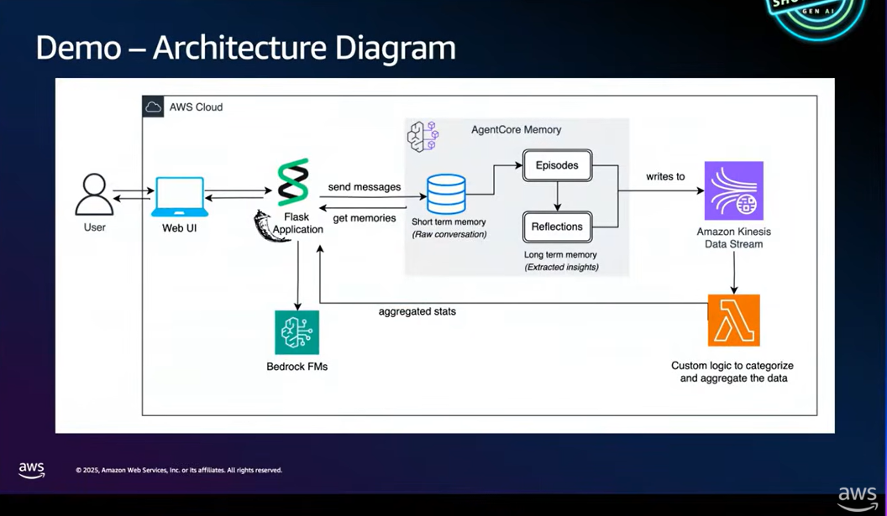
*⬆️ The episodic-specific pipeline — turn extraction (per agent turn: action, assessment, tools), episode extraction (goal-complete synthesis), then reflection across episodes — before the same embed/index/vector-store finish.*

**👀 What you're seeing:** Three extraction stages instead of one — **Turn extraction** (every agent turn analyzed: actions taken, tools called, how it went), **Episode extraction** (triggered when the agent's goal completes — a whole-task view), and **Reflection** (cross-episode pattern synthesis).

**🔍 What the speakers explain:**

1. **Turn extraction** — per-turn granularity: what was the action, what tools were called, how did it go. Like taking notes *during* the meeting.
2. **Episode extraction** — fires when the agent's goal completes: the full-task synthesis — what was the agent tasked to do, what it actually did, plus a **self-assessment**. The post-meeting summary built from the notes.
3. **Reflection** — retrieves *similar past episodes* and generalizes across them: recurring patterns distilled into **guidelines plus relevance scope** — "when this kind of situation occurs, do this."

:::info The anatomy of a retrieved record
> Episodes carry situation/intent/actions/assessment structure; reflections carry a **topic**, **hints** (what to do), and **use cases** (when it applies). That's what makes them injectable — a reflection is a *dynamic system-prompt fragment scoped to situations*, not a fact.
:::

This is also the answer to "aren't reflections just more system prompt?" — they are the *same kind of thing* (situation-specific behavioral guidance) except generated from **what actually happened to your agent**, and retrieved **only when relevant**, instead of a human pre-guessing every scenario into a static prompt.

> **🎯 Key Takeaway:** Episodes are granular experiences; reflections are generalized, situation-scoped instincts. Two-level extraction is what separates episodic memory from every other strategy.

---

## 13.9 🖥️ The Demo Architecture — Memory + Streaming + Dashboard

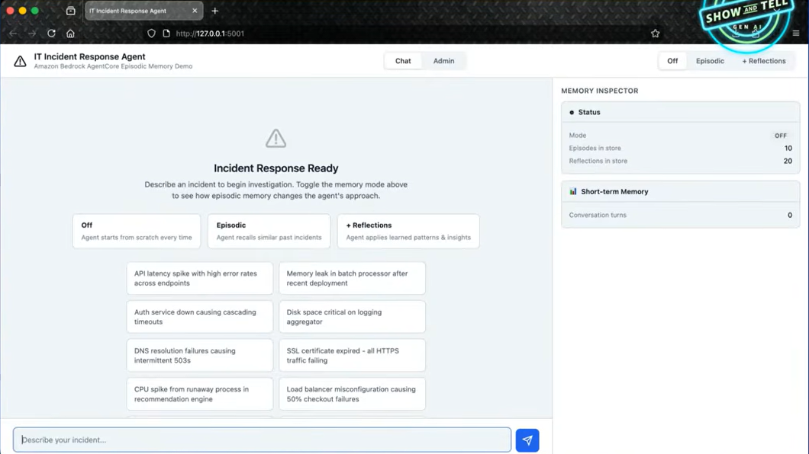
*⬆️ The demo architecture — Web UI → Flask app running Strands agents → AgentCore Memory via hooks (STM → episodes → reflections) → records streamed to Amazon Kinesis → Lambda → aggregated stats back to the app's admin dashboard; Amazon Bedrock FMs power the reasoning.*

**👀 What you're seeing:** The full demo topology — an IT incident-response agent in a Flask app, Strands agents wired to AgentCore Memory through **hooks** (events flow into short-term memory; episodes and reflections come back), and a side channel: memory records **streamed to Kinesis**, consumed by Lambda, aggregated into a dashboard served back through Flask.

**🔍 What the speakers explain — two flows worth separating:**

- **The memory loop:** Strands memory hooks ship conversation events (including **tool calls and user feedback** — you must send these explicitly; memory can only process what it receives) into STM; the async pipeline produces episodes and reflections the agent retrieves on future runs.
- **The streaming loop** — *recently launched*: memory record create/update/delete events can stream to **Kinesis** — full records or metadata-only. Use cases: human-in-the-loop review of every new reflection, analytics, aggregation — the demo uses it to categorize incidents and power the admin dashboard.

**The Strands hook pattern in real code:**

<GitHubExplorer repo="awslabs/agentcore-samples" ref="main" expanded="true" title="Wiring a Strands agent to AgentCore Memory with hooks" files={[{"path":"01-features/04-manage-context-of-your-agent/memory/02-long-term-memory/examples/single-agent/with-strands-agent/01-built-in-hook/meeting-notes-assistant-using-episodic/meeting-notes-assistant.py","label":"meeting-notes-assistant.py","highlights":[[1,20]],"note":"Real sample — the MemoryHookProvider pattern the episode's demo uses: hooks automatically persist turns to short-term memory and retrieve relevant long-term records into context. Swap the strategy config to episodic and the same hook surfaces episodes + reflections."}]} />

> **🎯 Key Takeaway:** The demo shows both sides of the new capability — episodic memory making the agent smarter *and* record streaming making the whole memory system observable and extensible.

---

## 13.10 🚨 The Demo — An IT Incident-Response Agent

The demo agent receives incident reports ("API latency spiked to 5s across all endpoints, error rate 15%, started 30 minutes ago — solve it") and produces a root-cause + resolution report. It can run in three modes: **memory off**, **episodic**, and **+ reflections** — and the memory store is pre-hydrated with 10 past incidents.

### Baseline — no memory

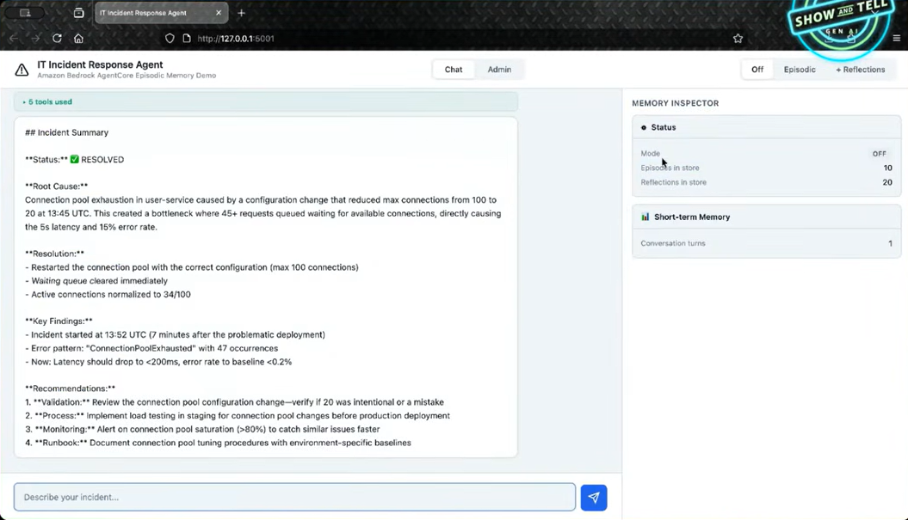
*⬆️ Memory **OFF** — the agent burns **5 tool calls** to solve a connection-pool incident; Memory Inspector shows Mode: OFF, 10 episodes and 20 reflections sitting unused in the store.*

**👀 What you're seeing:** The incident report — status RESOLVED, root cause (connection pool exhaustion: a deployment cut max connections 100 → 20 at 13:45 UTC, queueing 45+ requests → 5s latency / 15% errors), resolution steps, findings, and recommendations. Top-left: **5 tools used**. Right: Memory Inspector in OFF mode with the pre-loaded store (10 episodes, 20 reflections) — irrelevant while off.

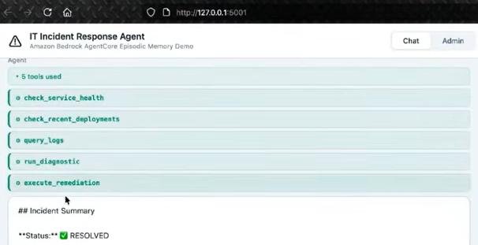
*⬆️ The five tools it needed without memory — `check_service_health`, `check_recent_deployments`, `query_logs`, `run_diagnostic`, `execute_remediation`.*

**👀 What you're seeing:** The expanded tool list — the full trial-and-error chain: health check → deployment check → log query → diagnostic → remediation.

### With episodic memory + reflections

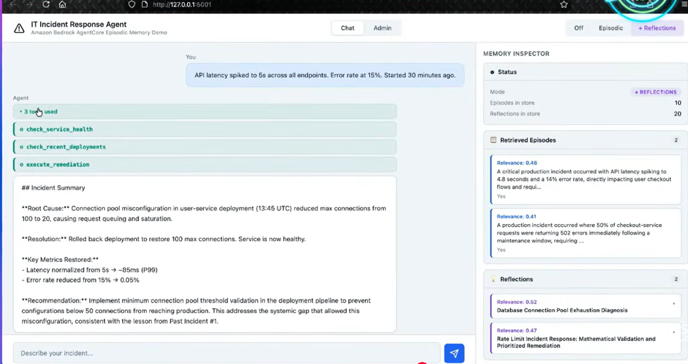
*⬆️ Same incident, **+Reflections** mode — only **3 tools** (`check_service_health`, `check_recent_deployments`, `execute_remediation`), a sharper resolution (rollback to 100 connections), a recommendation explicitly citing "the lesson from Past Incident #1," and the inspector now showing 2 retrieved episodes (relevance 0.46, 0.41) + 2 reflections (0.52, 0.47).*

**👀 What you're seeing:** Three simultaneous proofs — fewer tools, a better answer (the recommendation references the *learned lesson*: enforce minimum pool thresholds in the deployment pipeline), and the retrieval trace visible in the inspector.

**🔍 What the speakers explain:** The efficiency gain is the headline — **3 tools instead of 5** for the identical query: the reflection hinted at the likely failure class, so the agent skipped `query_logs` and `run_diagnostic`. Less trial and error, faster resolution — and the response *cites* the past incident it learned from.

:::tip Read the inspector like a receipt
> Every retrieved episode/reflection carries a **relevance score** (0.46, 0.52…) — you can threshold it. And notice: the store held 10 episodes + 20 reflections, but only the *2 most relevant of each* were injected. Retrieval is selective, not exhaustive.
:::

### Anatomy of an episode and a reflection

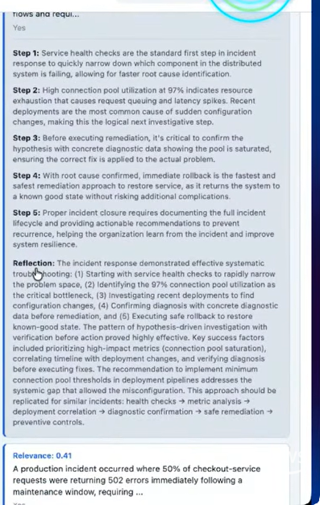
*⬆️ Inside a retrieved episode — five step-by-step annotations (health checks first → 97% pool utilization as the bottleneck hypothesis → confirm before remediating → rollback as fastest safe path → document for prevention) plus the episode-level **Reflection** summarizing the systematic troubleshooting pattern.*

**👀 What you're seeing:** The episode detail — per-turn reasoning annotations and a closing reflection: "health checks → metric analysis → deployment correlation → diagnostic confirmation → safe remediation → preventive controls."

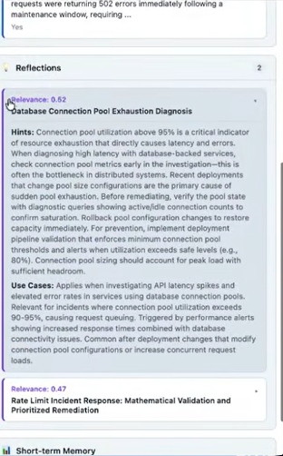
*⬆️ Inside a reflection — "Database Connection Pool Exhaustion Diagnosis" (relevance 0.52): **Hints** (95%+ pool utilization is a critical indicator; check recent deployments for config changes; enforce pipeline validation; alert at 80%; size for peak load) and **Use Cases** (when investigating API latency + elevated errors on DB-backed services).*

**👀 What you're seeing:** The reflection structure — topic, actionable hints, and applicability scope. Exactly the "situation-scoped system prompt fragment" idea from the pipeline slide.

**🔍 What the speakers explain:** Note the asymmetry — **more reflections (20) than episodes (10)** in the store. Reflections are topic-based: one incident can yield several insights (pre-incident assessment + post-incident documentation), and reflections also aggregate *across* episodes ("across these five incidents, the general pattern is…"). There's no fixed ratio — a travel agent conversation produces few reflections; diverse incident scenarios produce many.

### Second scenario — SSL certificate failure

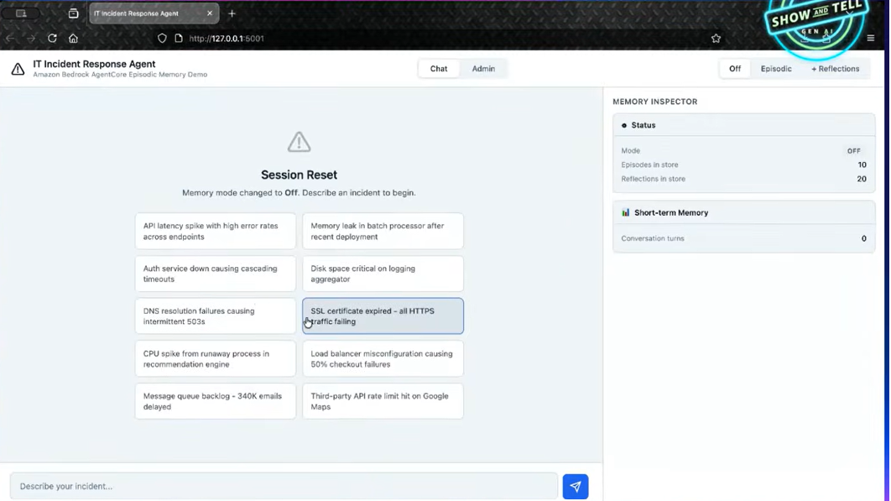
*⬆️ The mode toggle — **Off / Episodic / +Reflections** — the three-way comparison switch built into the demo UI.*

**👀 What you're seeing:** The top-bar mode selector that flips the same agent between no-memory, episodic-only, and episodic+reflections behavior.

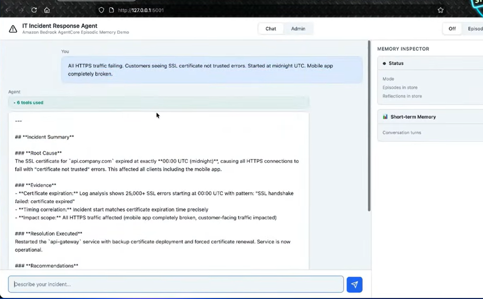
*⬆️ HTTPS-failure incident **without** memory — **6 tools** used; root cause found (expired certificate), resolution: restarted the API gateway with a backup certificate.*

**👀 What you're seeing:** The no-memory baseline for the second scenario — more tools (6), a narrower fix (backup cert restart), and recommendations that don't include the managed-certificate path.

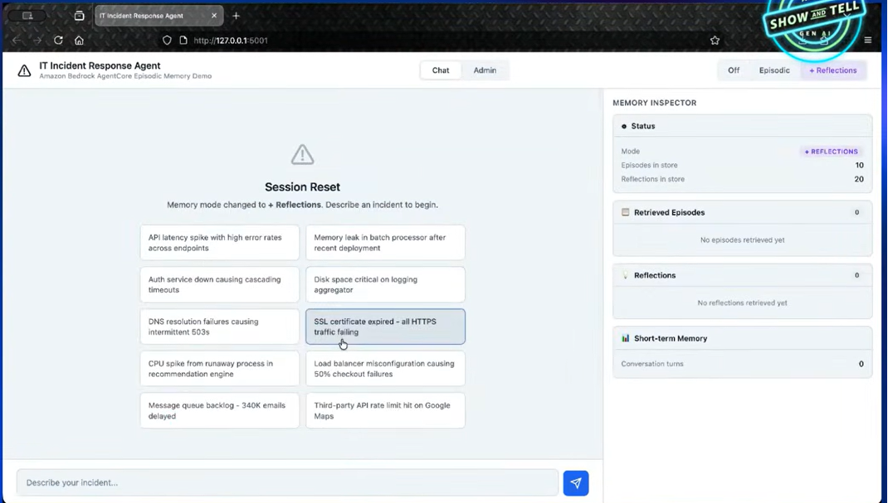
*⬆️ Switched to **+Reflections** and reset the session — the inspector's Retrieved Episodes / Reflections panels empty, ready for the rerun.*

**👀 What you're seeing:** The session-reset state — same store, fresh retrieval panes.

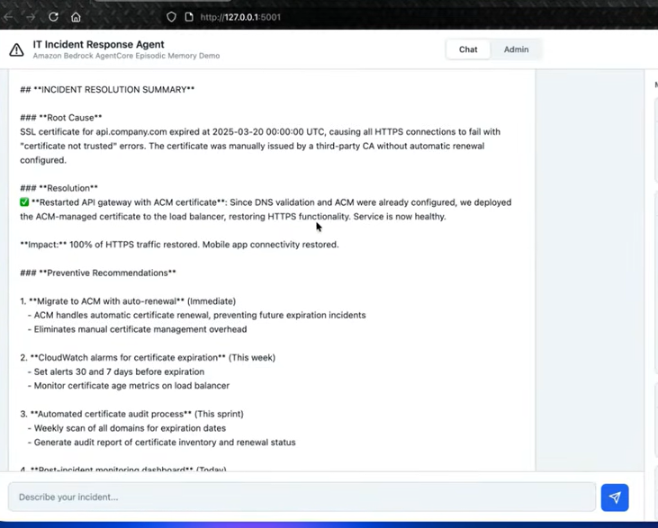
*⬆️ Same incident **with** memory — fewer tools, and a more **exhaustive** resolution: deployed an **ACM-managed certificate** to the load balancer (DNS validation already configured), plus preventive recommendations (migrate to ACM, CloudWatch expiry alarms, certificate audits, post-incident dashboard).*

**👀 What you're seeing:** The memory-assisted rerun — not just fewer tools but a *better fix*: ACM deployment rather than a backup restart, and prevention items the no-memory run never suggested.

**🔍 What the speakers explain:** Two distinct improvements from memory — **efficiency** (fewer tool calls, less trial-and-error) and **completeness** (the resolution covered DNS validation and the ACM path because past episodes showed that pattern works). Better *and* faster — not a trade-off.

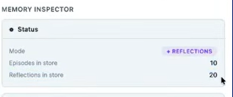
*⬆️ Memory Inspector status — Mode: +REFLECTIONS, 10 episodes, 20 reflections in store.*

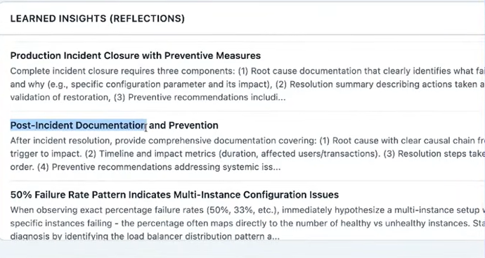
*⬆️ Learned insights in the store — "Production Incident Closure with Preventive Measures," "Post-Incident Documentation and Prevention," "50% Failure Rate Pattern Indicates Multi-Instance Configuration Issues."*

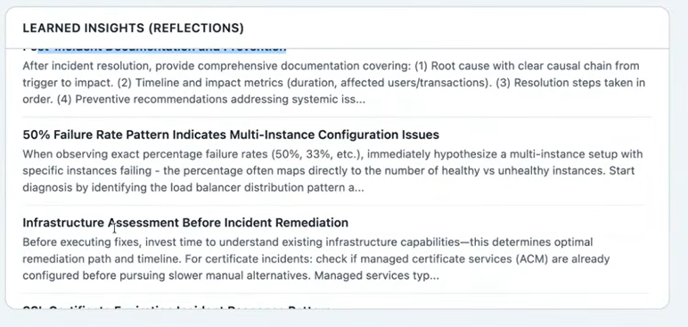
*⬆️ More reflections — the multi-instance failure pattern and "Infrastructure Assessment Before Incident Remediation" (check whether a managed cert service like ACM is already configured before slower manual alternatives).*

**👀 What you're seeing:** The reflection inventory — meta-skills, not just fixes: *how to close incidents*, *how to document*, *check managed services first*, *a 50% failure rate smells like a multi-instance config issue*.

**🔍 What the speakers explain:** This is the "dynamic guidelines" value — these hints aren't about one incident; they're derived instincts ("infrastructure assessment *before* remediation") that apply across future situations. And the DevOps tie-in Anil raises: customers want AI troubleshooting *before* the on-call engineer — reflections are exactly the "here's what we did in the last five similar incidents" briefing.

> **🎯 Key Takeaway:** The demo's measurable result: identical incidents, **5→3 and 6→fewer tool calls**, plus materially more complete resolutions — because retrieved reflections steered the agent to the proven playbook instead of the full search space.

---

## 13.11 📊 The Admin Dashboard — Streaming Memory Records

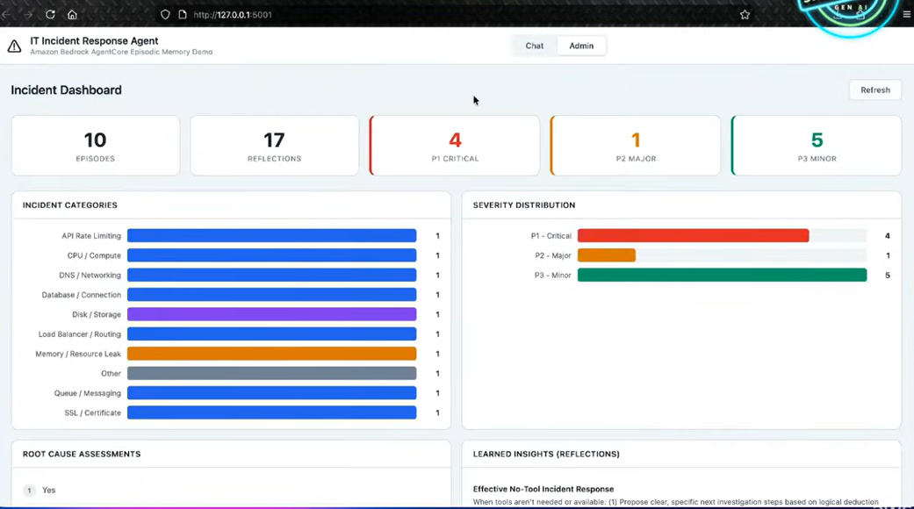
*⬆️ The Admin Incident Dashboard — 10 episodes, 17 reflections, severity distribution (4 P1, 1 P2, 5 P3), category distribution, root-cause assessments, and learned insights — all populated via the Kinesis stream.*

**👀 What you're seeing:** The aggregated view — incident classification by severity (P1/P2/P3) and category, recent root-cause assessments, and the learned-insights feed. (The dashboard shows 17 reflections vs the inspector's 20 — the stream counts what landed via Kinesis in this demo run.)

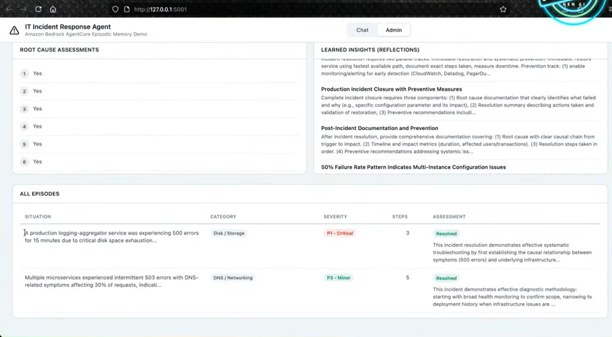
*⬆️ Dashboard detail — per-episode root-cause assessments, the learned-insights cards, and the ALL EPISODES table with category/severity/steps/assessment columns.*

**👀 What you're seeing:** The drill-down — each episode's severity and assessment, plus the reflections list usable for human review.

**🔍 What the speakers explain:** The streaming feature turns memory into an event source:

- Records (or just their metadata) stream to Kinesis on **create/update/delete** — real-time, no polling.
- The demo's Lambda consumer categorizes incidents and writes aggregates for the dashboard — but the pattern generalizes: **human-in-the-loop reflection review** ("I want to eyeball every new reflection before it guides the agent"), analytics, compliance archiving, anything that wants a feed of "what the agent learned."
- And it's bidirectional: you can also **write back** into AgentCore Memory — curate, correct, or expand records directly.

> **🎯 Key Takeaway:** Streaming closes the governance loop on self-learning — the agent learns autonomously, but every lesson it writes is an observable, reviewable, downstream-consumable event.

---

## 13.12 🔐 Scoping Memory for Production — Three Layers

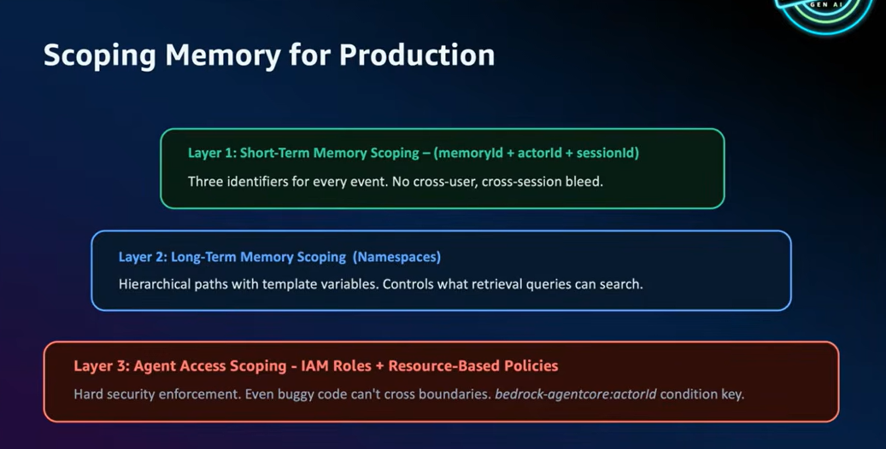
*⬆️ The closing slide — "Scoping Memory for Production": Layer 1 short-term scoping (memoryId + actorId + sessionId), Layer 2 long-term namespaces, Layer 3 IAM enforcement (roles with `bedrock-agentcore:actorId` condition keys + resource-based policies).*

**👀 What you're seeing:** Three stacked layers — STM isolation keys, LTM namespace hierarchy (strategy/actor/session variables), and hard IAM enforcement.

**🔍 What the speakers explain — the layers bottom-up:**

| Layer | Scope | What it prevents |
|---|---|---|
| **1 — Short-term scoping** | `memoryId` + `actorId` + `sessionId` on every event | Cross-session/cross-user bleed — Alice never sees Carol's turns |
| **2 — LTM namespaces** | Hierarchical paths built from strategy ID, actor ID, session ID — as granular or broad as you design | Controls the *blast radius* — which records can be retrieved where; shared team memory vs strict per-user isolation is a namespace decision |
| **3 — IAM enforcement** | IAM roles with `bedrock-agentcore:actorId` condition keys + **resource-based policies** (recently launched) identifying *which agent* can access a memory | Hard boundary — actors and agents can't cross memory resources even if code tries |

:::warning Design the blast radius deliberately
> Layer 2 is a *decision*, not a default: namespace granularity decides whether agents share institutional knowledge or stay siloed. Combined with Layer 3, a compromised or misbehaving agent physically cannot reach memories outside its grant — the guardrails the last chapter's Policy episode applies to tools, applied here to memory itself. (The dedicated AgentCore Memory episode — linked in the chat/resources — goes deeper on namespace design.)
:::

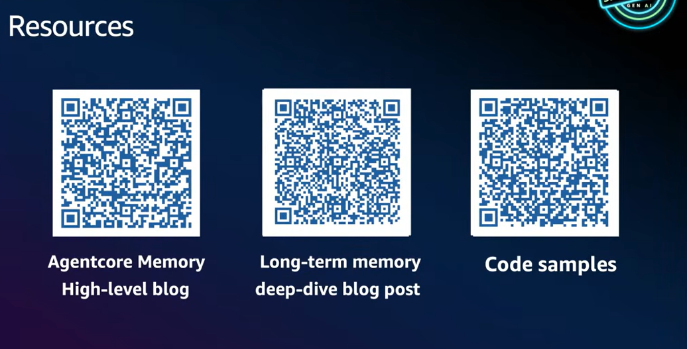
*⬆️ The resources slide — QR codes for the AgentCore Memory high-level blog, the long-term-memory deep-dive blog post, and the code samples repo.*

**👀 What you're seeing:** Three scannable resources — high-level memory blog, the deep-dive post (with the detailed pipeline diagrams and appendix examples the speakers recommend), and the samples.

> **🎯 Key Takeaway:** Memory scoping mirrors the rest of the production story — identity isolation at ingest, namespace design at storage, IAM at enforcement. Self-learning agents need all three before they touch real users.

---

## 🧠 Knowledge Check

<Quiz question="What fundamentally distinguishes episodic memory from semantic memory?" options={["Episodic is faster to retrieve","Episodic captures how the agent solved problems — goals, actions, outcomes, and lessons — not just facts","Semantic memory is encrypted; episodic is not","Episodic only works with Strands agents"]} answer={1} explanation="Semantic memory stores facts and domain knowledge — what the agent knows. Episodic memory stores experiences: what it was tasked to do, what it did, how it went, and the reflection on whether it worked — how it got there." />

<Quiz question="In the episodic pipeline, what triggers episode extraction?" options={["Every user message","k messages or x seconds of inactivity trigger the pipeline; episode extraction fires when the agent's goal completes","Only on errors","A scheduled nightly job"]} answer={1} explanation="The async pipeline batches on message count or inactivity, but episode extraction specifically waits for goal completion — turns are analyzed continuously, the episode is synthesized once the task finishes." />

<Quiz question="A reflection record contains a topic, hints, and use cases. What is it functionally?" options={["A conversation summary","A situation-scoped behavioral guideline — retrieved only when relevant","A cached tool response","A user preference"]} answer={1} explanation="Reflections generalize across episodes into 'when this kind of situation occurs, do this' — dynamic, situation-scoped system-prompt fragments generated from real experience rather than hand-written." />

<Quiz question="In the incident demo, enabling episodic memory + reflections changed the run how?" options={["Same tools, longer response","Fewer tool calls AND a more complete resolution","Faster but less accurate","It only changed the UI"]} answer={1} explanation="The agent dropped from 5 tools to 3 (skipping log queries and diagnostics the reflection made unnecessary) AND produced a more exhaustive fix — citing past-incident lessons and covering the ACM/managed-certificate path the no-memory run missed." />

<Quiz question="Why did the store contain MORE reflections (20) than episodes (10)?" options={["A bug in extraction","Reflections are topic-based — one episode can yield multiple insights, and reflections aggregate across episodes","Episodes expire faster","Reflections are pre-seeded"]} answer={1} explanation="There's no fixed ratio: a single episode can produce several topical insights (pre-incident assessment + post-incident documentation), and cross-episode reflections span multiple episodes entirely. Diverse scenarios → more reflections." />

<Quiz question="What does streaming memory records to Kinesis enable that retrieval doesn't?" options={["Faster retrieval","Real-time event-driven reactions to record create/update/delete — dashboards, human review, analytics","Encryption at rest","Cheaper storage"]} answer={1} explanation="Streaming turns memory into an event source: fire on every new/updated/deleted record (full payload or metadata-only) for dashboards, human-in-the-loop reflection review, aggregation — no polling needed." />

<Quiz question="Your agent must capture tool calls and user thumbs-up/down in episodic memory. What do you need to do?" options={["Nothing — automatic","Explicitly send tool events and feedback events to short-term memory — it can only process what it receives","Enable verbose logging","Use a different strategy"]} answer={1} explanation="The application owns what lands in STM. If you don't send tool-call events and user feedback, the pipeline never sees them — episodes and reflections will be built on incomplete experience." />

<Quiz question="Which combination enforces that a specific agent can only reach its own memory?" options={["Namespaces alone","STM scoping alone","IAM roles with actorId condition keys + resource-based policies on the memory","TLS encryption"]} answer={2} explanation="Layer 3 is hard enforcement: actorId condition keys bind memory access to the caller's identity, and resource-based policies identify which agent/resource may access the memory — namespaces shape visibility, IAM makes the boundary uncrossable." />

---

## 🎤 Interview Prep

<InterviewQA q="Explain episodic memory vs the other AgentCore Memory strategies.">
Summary, user-preference, and semantic strategies extract knowledge — condensed sessions, user traits, facts. Episodic memory extracts experience: turn-level analysis (actions, tools, assessments) consolidated into goal-level episodes, then generalized across episodes into reflections — situation-scoped hints with applicability conditions. The first three serve personalization and context-awareness; episodic serves self-learning.
</InterviewQA>

<InterviewQA q="Walk me through the episodic pipeline.">
Raw events land in short-term memory. An asynchronous pipeline (triggered on k messages or inactivity) performs turn extraction — per-turn actions, tool calls, outcomes. When the agent's goal completes, episode extraction synthesizes the whole task plus a self-assessment. Then reflection retrieves similar past episodes and generalizes: recurring patterns become hints + use-case scoping. Everything is embedded, indexed, and consolidated (add/update/skip) into the vector store.
</InterviewQA>

<InterviewQA q="How do reflections improve an agent at runtime?">
At invocation, the most relevant episodes and reflections are retrieved by similarity score and injected as context — e.g., 'Database Connection Pool Exhaustion Diagnosis: check recent deployments for config changes; 95%+ pool utilization is a critical indicator.' The agent gets situation-specific guidance generated from its own history instead of a static prompt — in the demo, that cut tool calls 5→3 and produced more complete resolutions.
</InterviewQA>

<InterviewQA q="Why can reflection count exceed episode count?">
Reflections are topic-scoped, not episode-scoped: one incident can yield several distinct insights (diagnostic approach + documentation practice + infra-assessment habit), and reflections also aggregate across episodes. Conversation diversity drives the ratio — varied incident scenarios produce many reflections; narrow chat domains produce few.
</InterviewQA>

<InterviewQA q="How would you keep a self-learning agent governable in production?">
Three layers: (1) observability + evaluations as the external check — self-evaluation is necessary but must be supervised, like a parent reviewing report cards; (2) record streaming to Kinesis for human-in-the-loop review of every new reflection, plus write-back curation; (3) scoping — STM actor/session keys, LTM namespaces to control blast radius, and IAM actorId condition keys + resource-based policies as the hard boundary.
</InterviewQA>

<InterviewQA q="What did the demo actually prove about value?">
Same incident-response agent, same queries, three modes. Memory off: 5–6 tool calls of full trial-and-error. With episodes + reflections retrieved: 3 tools, faster resolution, and a more exhaustive fix (ACM managed certificate + preventive recommendations) that cited the learned lesson. Memory made the agent both more efficient and more thorough — the 'senior engineer starting from pattern recognition' effect.
</InterviewQA>

<InterviewQA q="What must the application send to memory for episodes to be useful?">
Everything that constitutes the experience — not just messages but tool calls and user feedback signals (thumbs up/down). The service can only extract from what lands in short-term memory; omit tool events and episodes lose the action layer; omit feedback and evaluation loses its quality signal.
</InterviewQA>

<InterviewQA q="How does AgentCore Memory fit with agents not running on AgentCore Runtime?">
Every AgentCore service is independently usable — Memory exposes APIs callable from any compute (Lambda, EC2, on-prem, any framework: Strands, LangGraph, CrewAI). Runtime/Gateway integration adds convenience (e.g., Strands memory hooks), not a requirement.
</InterviewQA>

<InterviewQA q="When would you choose a custom/self-managed memory pipeline over built-in strategies?">
When none of the four strategies matches your extraction semantics — e.g., domain-specific episode definitions or unusual consolidation rules. The middle ground first: the built-in extraction prompts and models are public and overridable, so you can tune behavior without rebuilding the pipeline. Fully self-managed is the last resort for fundamentally different memory shapes.
</InterviewQA>

---

## 📚 Official Resources

| 📖 Resource | 🔗 Link |
|---|---|
| **Episodic Memory — Deep-Dive Blog** (the one the speakers recommend, with examples + appendix) | [Build agents to learn from experiences using AgentCore episodic memory](https://aws.amazon.com/blogs/machine-learning/build-agents-to-learn-from-experiences-using-amazon-bedrock-agentcore-episodic-memory/) |
| **AgentCore Memory — High-Level Blog** | [Building context-aware agents](https://aws.amazon.com/blogs/machine-learning/amazon-bedrock-agentcore-memory-building-context-aware-agents/) |
| **Long-Term Memory Deep Dive** | [Building smarter AI agents](https://aws.amazon.com/blogs/machine-learning/building-smarter-ai-agents-agentcore-long-term-memory-deep-dive/) |
| **Episodic Strategy — Developer Guide** | [docs.aws.amazon.com/bedrock-agentcore/latest/devguide/episodic-memory-strategy.html](https://docs.aws.amazon.com/bedrock-agentcore/latest/devguide/episodic-memory-strategy.html) |
| **Episode Samples (relocated)** | [`memory/` — built-in strategies, hooks, multi-agent examples](https://github.com/awslabs/agentcore-samples/tree/main/01-features/04-manage-context-of-your-agent/memory) |
| **AgentCore SDK** | [github.com/aws/bedrock-agentcore-sdk-python](https://github.com/aws/bedrock-agentcore-sdk-python) |
| **Starter Toolkit** | [github.com/aws/bedrock-agentcore-starter-toolkit](https://github.com/aws/bedrock-agentcore-starter-toolkit) |
| **Namespace Design Patterns** | [Organizing agents' memory at scale](https://aws.amazon.com/blogs/machine-learning/organizing-agents-memory-at-scale-namespace-design-patterns-in-agentcore-memory/) |

:::warning Note on the sample repo
> The episode references `01-tutorials/04-AgentCore-memory`. The repo restructured — memory samples now live under `01-features/04-manage-context-of-your-agent/memory/` (with `02-long-term-memory/` holding the episodic strategy examples, Strands/LangGraph/Claude-SDK hook examples, and multi-agent patterns).
:::

### Related Chapters

- **Chapter 8 — AgentCore Memory**: the foundational memory deep dive — STM/LTM, namespaces, hooks, and the actor/session scoping this chapter builds on
- **Chapter 10 — AgentCore Observability**: traces are the "what you cannot see" layer of the flywheel — they feed the learning pipeline
- **Chapter 11 — AgentCore Evaluations**: the measurement layer — episode self-assessment plus external evaluators close the quality loop
- **Chapter 12 — AgentCore Policy**: the enforcement sibling — Policy governs what the agent can *do*; memory scoping governs what it can *remember*
- **EP 11 — Episodic Memory**: the parallel standalone treatment if available in the AgentCore EP series

---

## 🎬 Watch the Full Episode

<VideoSection youtubeId="1EEIGsKIjGA" title="AWS Show & Tell — Episodic Memory and Patterns for Production Agents (with Anil Nadimi and Akarsha Sehwag)" />

---

## 🎯 Summary

| Concept | What you learned |
|---|---|
| 🧩 **The gap** | Technical capability ≠ user experience — production needs personalization, context awareness, *and* self-learning |
| 🔁 **Self-learning** | Four components: episodes (memory) → reflections (generalization) → evaluation (incl. user feedback) → adaptation — with external supervision |
| 🎞️ **The pipeline** | Turn extraction → episode extraction on goal completion → cross-episode reflection → embed/index; async, add/update/skip consolidation |
| 💡 **Reflections** | Situation-scoped hints + use cases — dynamic, retrieved-when-relevant system-prompt fragments learned from real experience |
| 📉 **The demo** | Same incidents: 5→3 and 6→fewer tool calls *and* more exhaustive resolutions — efficiency and quality together |
| 📊 **Streaming** | Kinesis record streams → Lambda → custom dashboards/HITL review; memory becomes an event source, not just a store |
| 🔐 **Scoping** | STM keys (actor/session) → LTM namespaces (blast radius) → IAM condition keys + resource policies (hard boundary) |
| 🎡 **The flywheel** | Observability (see) + Evaluations (measure) + Memory (improve) — the three-chapter arc that makes agents genuinely production-mature |

> *"Episodes are the junior engineer's memory; reflections are the senior engineer's instincts. Agents never graduate — but they get promoted."*

:::tip 🚀 Next up
> **Chapter 14** continues the series — check the playlist for the next episode. Revisit **Chapter 8** for the memory foundations and **Chapters 10–12** for the observability/evaluation/policy layers that complete the production loop.
:::
