# AWS Bedrock Course — Chapter 2

*From laptop prototype to production in one chapter — based on the AWS Show & Tell episode "Building your first production-ready AI agent with Amazon Bedrock AgentCore" featuring Mark Roy (Agentic AI Tech Lead) and Ishan Kaushik — EK (Solutions Architect).*

# 🤖 Amazon Bedrock AgentCore — Building & Deploying Production-Ready AI Agents

## 🎯 Learning Objectives

By the end of this chapter, the learner will be able to:

- Explain **what Amazon Bedrock AgentCore is** and the problem it solves
- Describe the **major AgentCore building blocks**: Runtime, Gateway, Memory, Identity, Observability, Browser and Code Interpreter
- Explain how **AgentCore Runtime** hosts agents securely at scale
- Convert a local **Strands agent** into a production deployment with the AgentCore SDK
- Use the **`agentcore` CLI** to configure, launch and invoke agents
- Understand how **Gateway** exposes existing APIs and Lambda functions as MCP tools
- Explain how **Memory** provides short-term and long-term context via Actor ID
- Describe how **Identity** handles OAuth authentication for first-party and third-party tools
- Use **Observability** in CloudWatch to trace agent behavior end to end
- Assemble all components into a **production Customer Support Assistant**

---

## 2.1 🤔 Why Is Getting Agents to Production So Hard?

2025 is being called **the year of agents** — everyone wants to build and deploy AI agents. And building a *prototype* is genuinely easy:

```
Download any agent framework ──► Write a few lines on your laptop ──► Impressive demo for the C-suite ✅
```

But getting that prototype into **production** is where teams struggle. An agent that only runs on a laptop produces **zero business value** — it is just an exciting demo.

> [!IMPORTANT]
> **The Production Gap**: If you don't get your agents into production, you've produced no business value — only demos. Customers need agents that are secure, scalable, observable and trustworthy.

The transcript calls this the **"undifferentiated heavy lifting"** of agentic AI — work that every team has to redo, that has nothing to do with the agent's actual business logic:

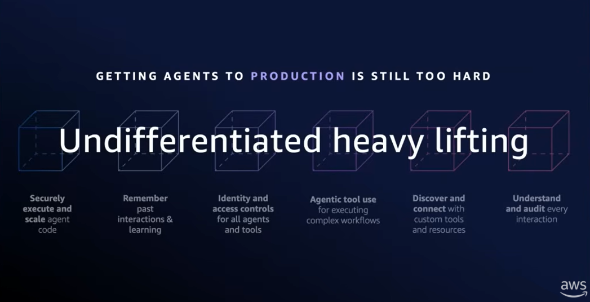

*Every team re-builds the same six things before an agent can go live.*

| Production Challenge | What it means in practice |
| :--- | :--- |
| 🔐 **Security** | Who can invoke the agent? What can the agent access? How are credentials handled end to end? |
| 📈 **Scalability** | One user on a laptop → thousands of concurrent sessions in the cloud |
| 🔌 **Interoperability** | Agents, tools and other agents must talk to each other across frameworks |
| 📦 **Large payloads** | Real workloads carry big inputs — documents, images, long histories |
| ⏱️ **Long-running agents** | Deep research or multi-step automations can run for hours, not seconds |
| 👁️ **Observability** | "What is my agent actually doing?" — you can't trust what you can't see |

> [!TIP]
> 💡 **Think About It**: Businesses are betting big on agents — these will be **mission-critical workloads** that people depend on every day. You cannot bet the business on an agent you can't secure, audit or observe.

---

## 2.2 ☁️ What is Amazon Bedrock AgentCore?

> [!NOTE]
> **Amazon Bedrock AgentCore** is a set of composable building blocks for **deploying and operating agents at scale, securely** — with **any framework and any model**. It launched in public preview to close the prototype-to-production gap.

Three headline benefits, straight from the episode:

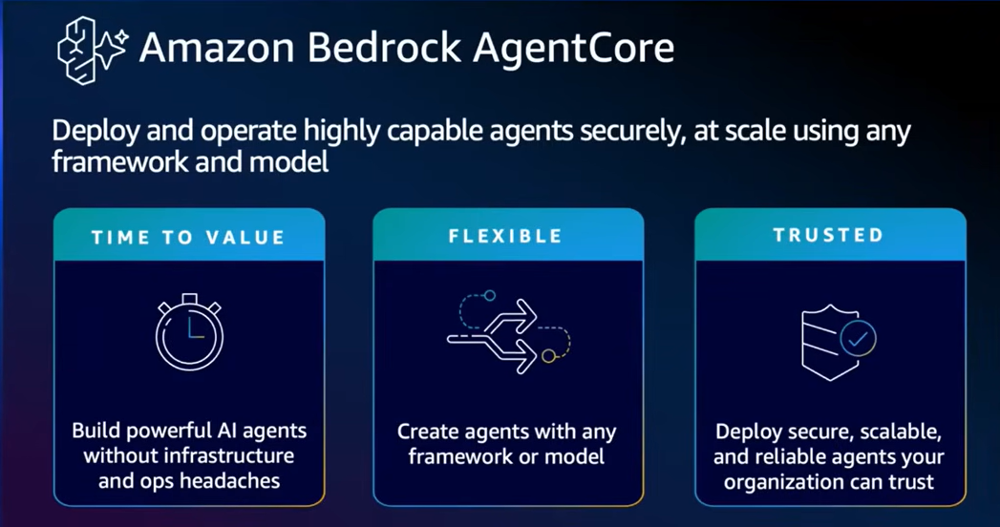

- ⏱️ **Time to Value** — build powerful AI agents without infrastructure and ops headaches; the goal isn't time-to-*prototype*, it's time-to-*production*
- 🔄 **Flexible** — **any framework, any model**: Strands, LangGraph, CrewAI, LangChain… and models from Amazon Bedrock, SageMaker, OpenAI, Gemini or your own open-source models. Protocol flexibility too — **MCP** and **A2A**
- 🛡️ **Trusted** — deploy secure, scalable, reliable agents your organization can actually trust and audit

### Any Framework. Any Model.

Your agent is just code: **instructions + local tools + context + a model**. AgentCore hosts it without forcing you to rewrite to a proprietary framework:

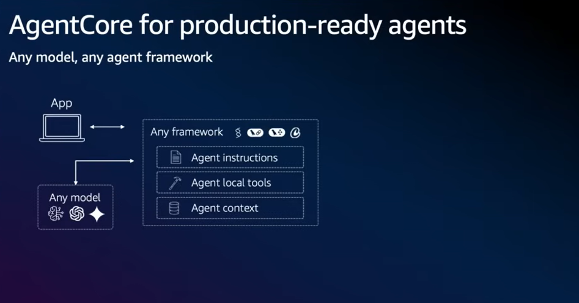

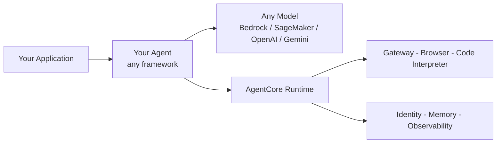
```mermaid
flowchart LR
    App["Your Application"] --> Agent["Your Agent<br/>any framework"]
    Agent --> Model["Any Model<br/>Bedrock / SageMaker / OpenAI / Gemini"]
    Agent --> RT["AgentCore Runtime"]
    RT --> Tools["Gateway - Browser - Code Interpreter"]
    RT --> Core["Identity - Memory - Observability"]
```

> [!NOTE]
> **Demo frameworks used in the episode**: mostly **Strands** (AWS's open-source agent SDK for production-ready multi-agent systems in a few lines of code) — but everything shown works identically with LangGraph, CrewAI or LangChain.

---

## 2.3 🧩 The AgentCore Building Blocks

AgentCore is **composable** — take the pieces you need. First, managed tools alongside your runtime:

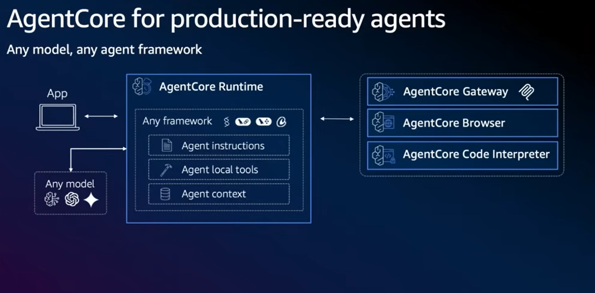

Then the security, memory and observability layer completes the picture:

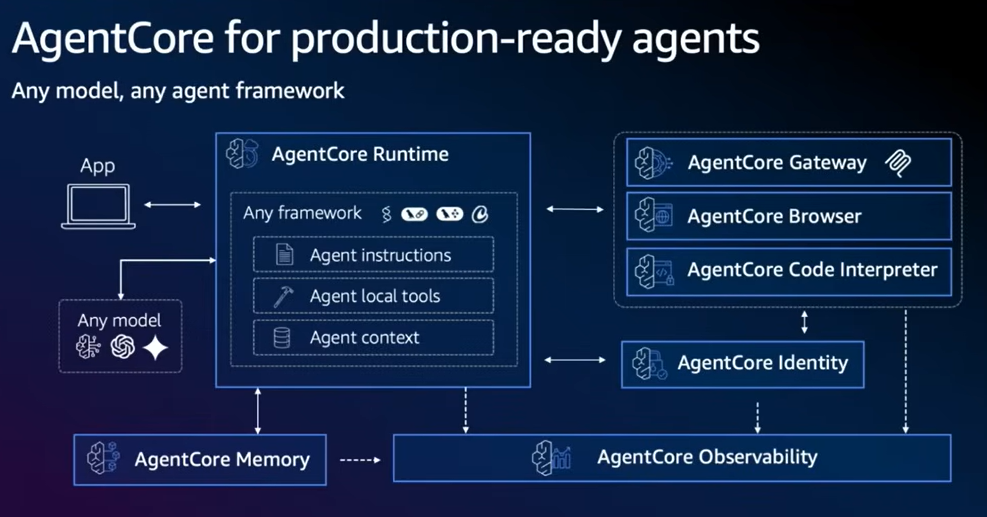

| Building Block | What it does (from the transcript) |
| :--- | :--- |
| ⚙️ **Runtime** | Secure, scalable, flexible hosting for agents — and even tools or MCP servers |
| 🌐 **Gateway** | Takes your **existing APIs** and exposes them as **MCP** so they plug into any agent framework or coding assistant |
| 🔐 **Identity** | End-to-end authentication & authorization: user → agent, agent → agent, agent → first-party and third-party tools |
| 🧠 **Memory** | Ongoing conversation memory **plus** fully managed long-term memory — user preferences, session summaries, facts |
| 📊 **Observability** | The end-to-end picture: what is the agent doing? Sessions, traces, tokens, errors, latency |
| 🌍 **Browser** | Managed, secure browser automation — perfect for legacy systems and manual business processes |
| 💻 **Code Interpreter** | Secure sandbox to run agent-generated code — data analysis and other workloads |

> [!TIP]
> 💡 **Why "composable" matters**: these are loosely coupled building blocks. Different teams can own different pieces, update tools in Gateway without touching agent code, and reuse the same infrastructure across many agents.

---

## 2.4 🛠️ The Main Use Case — Customer Support Assistant

The entire episode builds one real thing: **a production Customer Support Assistant**. Not a toy — an agent wired into real enterprise resources:

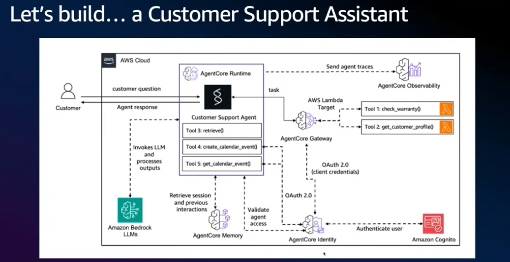

The resources already deployed in the demo account:

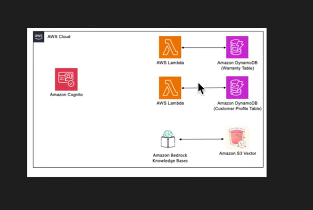

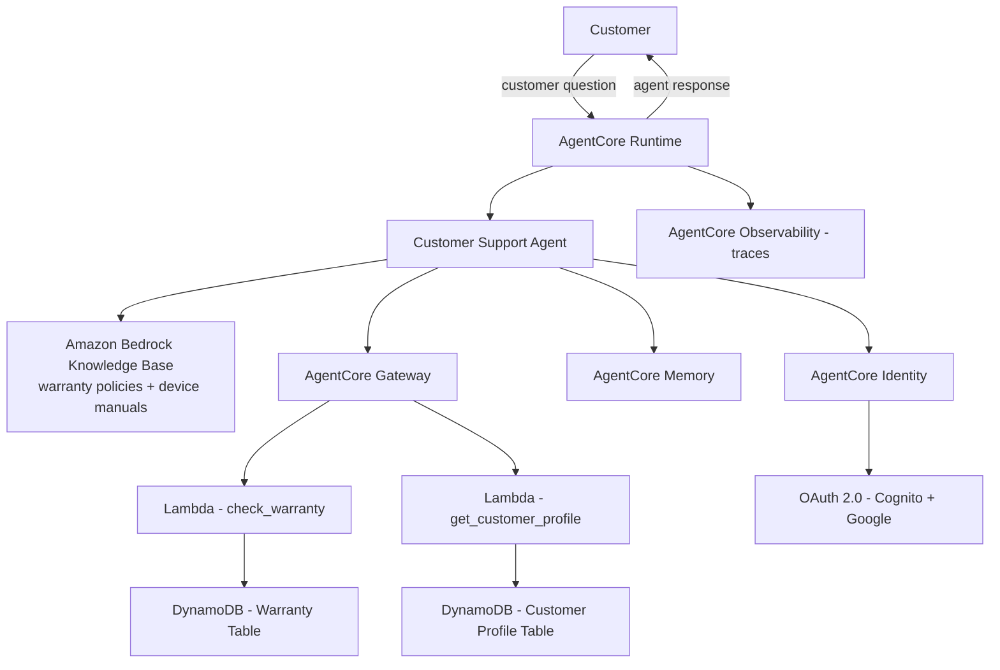
```mermaid
flowchart TD
    Customer["Customer"] -->|customer question| Runtime["AgentCore Runtime"]
    Runtime -->|agent response| Customer
    Runtime --> Agent["Customer Support Agent"]
    Agent --> KB["Amazon Bedrock Knowledge Base<br/>warranty policies + device manuals"]
    Agent --> GW["AgentCore Gateway"]
    GW --> L1["Lambda - check_warranty"]
    GW --> L2["Lambda - get_customer_profile"]
    L1 --> DB1["DynamoDB - Warranty Table"]
    L2 --> DB2["DynamoDB - Customer Profile Table"]
    Agent --> MEM["AgentCore Memory"]
    Agent --> IDP["AgentCore Identity"]
    IDP --> OAuth["OAuth 2.0 - Cognito + Google"]
    Runtime --> OBS["AgentCore Observability - traces"]
```

### The numbered flow (as shown in the episode)

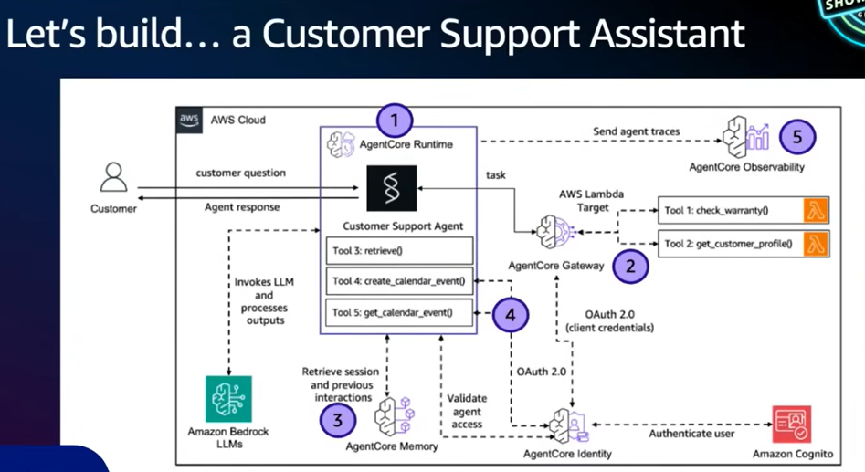

1. **Customer question** arrives at the **AgentCore Runtime** endpoint, authenticated via **Amazon Cognito**
2. The agent calls **Gateway tools** (`check_warranty`, `get_customer_profile`) backed by **Lambda → DynamoDB**
3. **AgentCore Memory** retrieves the session and previous interactions for that user
4. **AgentCore Identity** validates agent access and brokers **OAuth 2.0** credentials for third-party tools (like Google Calendar)
5. Every step emits **agent traces** to **AgentCore Observability** in CloudWatch

> [!NOTE]
> The agent also uses **local tools** (`current_time`, `retrieve` against a Bedrock Knowledge Base of warranty policies and device manuals) — Gateway is for tools that *aren't* baked into the agent.

---

## 2.5 ⚙️ AgentCore Runtime — Deep Dive

Runtime is the first building block deployed in the demo. From the episode slide:

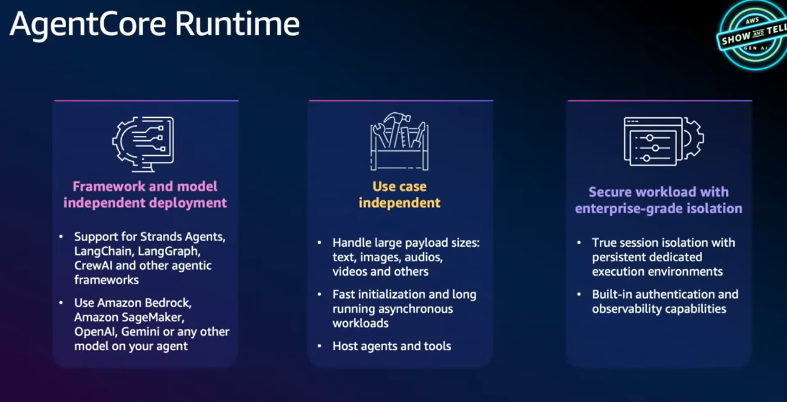

**Three headline capabilities:**

- 🧩 **Framework & model independent deployment** — Strands, LangChain, LangGraph, CrewAI… Bedrock, SageMaker, OpenAI, Gemini… your code, your choices
- 📦 **Use-case independent** — large payloads up to **100 MB** (text, images, audio, video), fast cold starts, and **long-running asynchronous workloads up to 8 hours** (with ways to go even longer)
- 🔒 **Secure workload with enterprise-grade isolation** — true **session isolation** with persistent dedicated execution environments, plus built-in authentication and observability

> [!IMPORTANT]
> **Session isolation** is the security headline: each session runs completely independently — no leftover information in memory or filesystem can leak from one customer's session into another's. As agents get more *agency* to act autonomously, this guarantee matters enormously.

### What `configure` → `launch` → `invoke` actually does

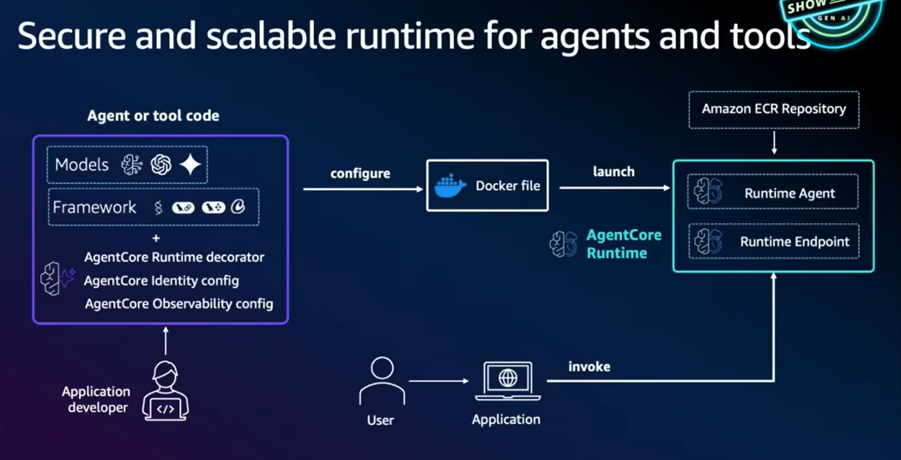

```
Your agent code + AgentCore Runtime decorator + Identity/Observability config
        │
        ▼  agentcore configure
   Dockerfile generated
        │
        ▼  agentcore launch
   Code zipped → S3 → CodeBuild → Docker image → Amazon ECR
        │
        ▼
   AgentCore Runtime: Runtime Agent + Runtime Endpoint
        │
        ▼  invoke
   User / Application → streaming responses
```

> [!TIP]
> 💡 **Only two commands to remember**: `agentcore configure` and `agentcore launch`. All the backend plumbing — S3 artifacts, CodeBuild, ECR, endpoints — is handled by the SDK. That's the undifferentiated heavy lifting *removed*.

---

## 2.6 🛠️ Building the Agent — From Local Strands to AgentCore

### Step A — the plain local agent (life *before* AgentCore)

```python
import os
from strands import Agent
from strands_tools import current_time, retrieve

MODEL_ID = "us.anthropic.claude-sonnet-4-20250514-v1:0"

def create_agent():
    return Agent(
        model=MODEL_ID,
        tools=[current_time, retrieve],   # retrieve → Amazon Bedrock Knowledge Base
    )

agent = create_agent()
# Knowledge Base is wired via env var:
#   KNOWLEDGE_BASE_ID=<your kb id>
```

Asked *"What are the warranty support guidelines?"*, this agent calls the `retrieve` tool against a Bedrock Knowledge Base (warranty policies + device manuals) and streams a grounded answer. Great demo — still a laptop PoC.

### Step B — the same agent, production-ready (the only code added)

```python
import os
from bedrock_agentcore.runtime import BedrockAgentCoreApp
from strands import Agent
from strands_tools import current_time, retrieve

MODEL_ID = "us.anthropic.claude-sonnet-4-20250514-v1:0"
app = BedrockAgentCoreApp()

agent = None  # global for demo clarity — use context vars in production

@app.entrypoint
async def invoke(payload, context):
    global agent
    if agent is None:
        agent = create_agent()

    # payload  → user input (prompts, images, files)
    # context  → session_id, and later actor_id (who the user is)
    user_prompt = payload.get("prompt", "")
    async for event in agent.stream_async(user_prompt):
        yield event                       # streamed straight back to the caller
```

> [!NOTE]
> **The whole migration is**: wrap the app, define one `@app.entrypoint` function that receives `payload` + `context`, and stream the response. Any framework drops into the same shape — LangGraph or CrewAI instead of Strands.

---

## 2.7 ⚙️ Configure the Agent — `agentcore configure`

The starter-kit CLI walks through deployment configuration interactively. From the demo:

```bash
agentcore configure --entrypoint main.py --name customer-support-demo
```

| Prompt in the wizard | What the demo used | Why it matters |
| :--- | :--- | :--- |
| **Entry point** | `main.py` | File containing your `@app.entrypoint` function |
| **Execution role** | IAM role ARN | What the running agent is allowed to do in AWS |
| **ECR repository** | Create new | `launch` builds an image and pushes it here |
| **requirements.txt** | auto-detected | Dependencies baked into the container |
| **Authorization** | Amazon Cognito | Inbound auth — who may invoke your agent (IAM is the alternative) |
| **Discovery URL** | Cognito user-pool URL | Where the runtime validates tokens |
| **Client ID** | Cognito app client | Which app clients are allowed |
| **Audience** | client id | Token audience validation |

> [!TIP]
> 💡 The model ID (`claude-sonnet-4` in the demo) is just code/config — hardcode it, or pass it as an **environment variable** at launch time for flexibility.

---

## 2.8 🧪 Practical Lab — Test Locally Before Deploying

A favorite feature of the SDK: **launch locally first** — same code, running on localhost, perfect for debugging before touching the cloud.

### Step 1 — Start the local runtime

```bash
agentcore launch --local
```

Expected output — the agent boots on localhost:

```text
Agent server running on http://localhost:8080
Ready to accept invocations.
```

### Step 2 — Ask the warranty question

```bash
agentcore invoke --local '{"prompt": "What are the warranty support guidelines?"}'
```

```text
I'll search information about warranty support guidelines.
[agent invokes the retrieve tool → Bedrock Knowledge Base]
… streamed response: warranty terms, coverage periods, claim process …
```

### Step 3 — Debug like a developer

```bash
# Tail the runtime's CloudWatch logs to see what the agent is doing
aws logs tail /aws/bedrock-agentcore/runtimes/<agent-id> --follow
```

> [!TIP]
> 💡 **Why local-first matters**: you exercise the *same* entry point, payload handling and streaming path that production uses — so "works on my machine" actually means something here.

---

## 2.9 🚀 Deploy — `agentcore launch`

```bash
agentcore launch
```

```text
Uploading project to S3…
CodeBuild: building container image…
Pushing image to Amazon ECR…
Creating AgentCore Runtime…
✅ Deployment complete — endpoint ready
CloudWatch logs: /aws/bedrock-agentcore/runtimes/<agent-id>
```

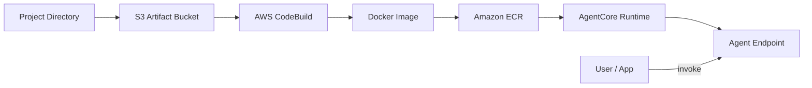
```mermaid
flowchart LR
    Proj["Project Directory"] --> S3["S3 Artifact Bucket"]
    S3 --> CB["AWS CodeBuild"]
    CB --> Img["Docker Image"]
    Img --> ECR["Amazon ECR"]
    ECR --> RT["AgentCore Runtime"]
    RT --> EP["Agent Endpoint"]
    User["User / App"] -->|invoke| EP
```

From the demo: the project directory is zipped → uploaded to an S3 artifact bucket → **CodeBuild** builds the Docker image → pushed to **ECR** → the **Runtime Agent** process starts and an **endpoint** is established. Multiple users can now hit it concurrently — *secure and scalable, all the joys of AgentCore*.

---

## 2.10 📡 Invoking the Deployed Agent

The CLI is for debugging; production calls the endpoint over HTTPS — exactly what a frontend UI would do:

```python
import requests

AGENT_ARN = "arn:aws:bedrock-agentcore:us-east-1:<acct>:runtime/customer-support-demo"
INVOKE_URL = (
    "https://bedrock-agentcore.us-east-1.amazonaws.com"
    f"/runtimes/{AGENT_ARN}/invocations/"
)

def invoke_agent(prompt: str, access_token: str, session_id: str):
    headers = {
        "Authorization": f"Bearer {access_token}",   # Cognito JWT
        "X-Amzn-Bedrock-AgentCore-Runtime-Session-Id": session_id,
    }
    resp = requests.post(INVOKE_URL, headers=headers,
                         json={"prompt": prompt}, stream=True)
    for chunk in resp.iter_content(chunk_size=None):
        print(chunk.decode(), end="")                 # streamed response
```

- 🔑 **Bearer token** — obtained by signing in to the Cognito IdP (the demo opens the Cognito hosted UI, authenticates, caches the access token)
- 🧵 **Session ID** — each conversation gets its own isolated session (remember: session isolation!)
- 🌊 **`stream=True`** — tokens stream back to the caller; wire the same response into a chat UI

> [!NOTE]
> The demo ends with exactly this: a **Streamlit** chat front end (`localhost:8501`) talking to the deployed agent — same invoke path, prettier UI.

---

## 2.11 🌐 AgentCore Gateway + MCP — Unified, Agent-Ready Tools

Agents are only useful with **tools**. And today, everything speaks **MCP** — agent frameworks and coding assistants support it natively: *plug in a URL and you instantly get a standard toolbox*.

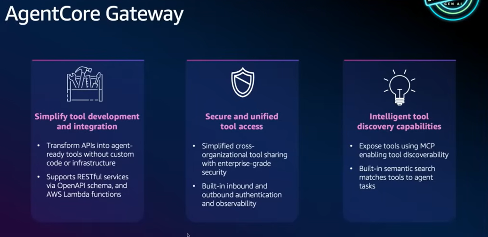

**What Gateway does** (from the episode):

- 🧰 **Simplifies tool development** — transforms existing APIs into agent-ready tools with no custom code or infrastructure; supports **REST services via OpenAPI schema** and **AWS Lambda functions**
- 🔐 **Secure & unified access** — cross-organizational tool sharing with enterprise-grade security; built-in **inbound and outbound authentication**
- 🔍 **Intelligent discovery** — tools are exposed via **MCP**, plus built-in **semantic search** that matches tools to the task at hand

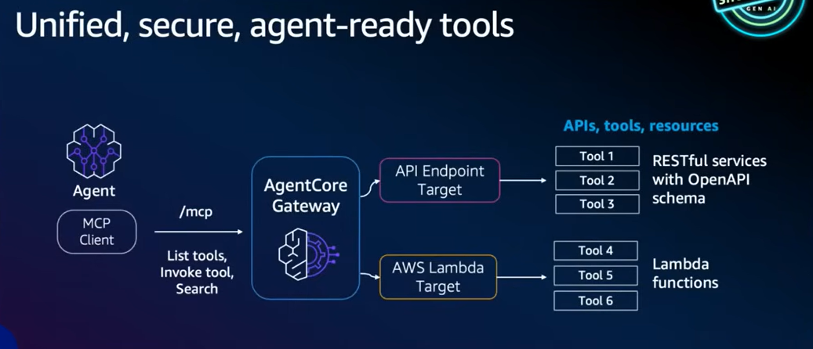

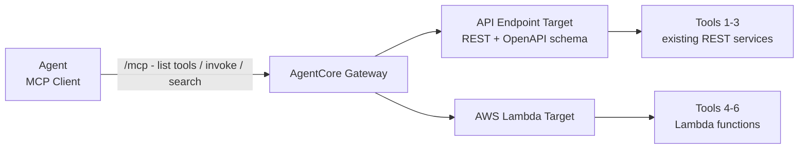
```mermaid
flowchart LR
    Agent["Agent<br/>MCP Client"] -->|"/mcp - list tools / invoke / search"| GW["AgentCore Gateway"]
    GW --> APIT["API Endpoint Target<br/>REST + OpenAPI schema"]
    GW --> LT["AWS Lambda Target"]
    APIT --> T123["Tools 1-3<br/>existing REST services"]
    LT --> T456["Tools 4-6<br/>Lambda functions"]
```

### Demo tools — real enterprise resources

| Gateway tool | Backing target | Data |
| :--- | :--- | :--- |
| `check_warranty` | AWS Lambda | DynamoDB — Warranty table |
| `get_customer_profile` | AWS Lambda | DynamoDB — Customer Profile table |

### Built-in semantic search — the freebie

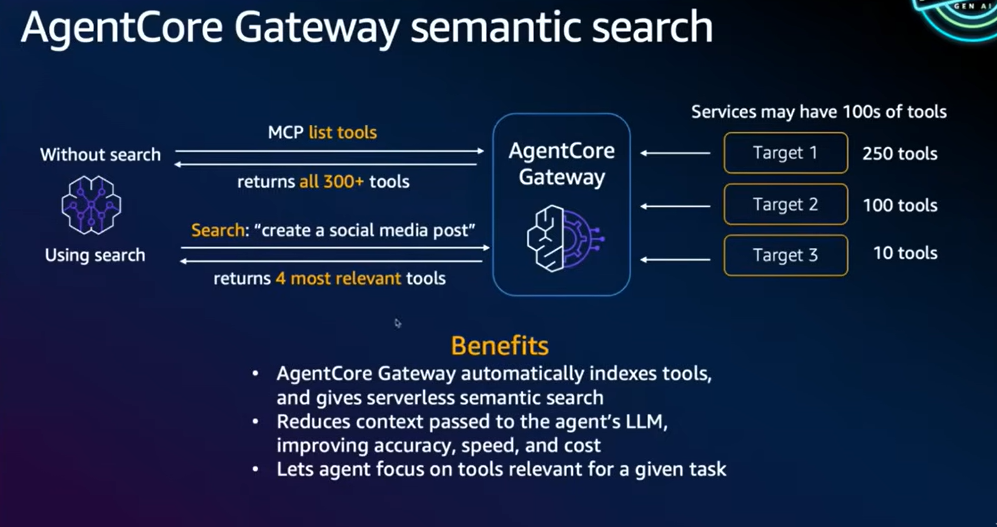

Without search, `list_tools` on a large gateway returns **hundreds of tools** — expensive, slow, and it kills accuracy. With Gateway's built-in search, a query like *"create a social media post"* returns **just the 4 most relevant tools**.

> [!IMPORTANT]
> **The killer feature from the demo**: tools can be added or updated in **Gateway without changing agent code**. EK added `get_customer_profile` to the existing target, re-asked the question — and the *same deployed agent* immediately used the new tool. Loosely coupled = teams ship tools independently.

---

## 2.12 🔬 Practical Lab — Wire Up Gateway Tools

Goal: expose two Lambda-backed tools through Gateway and give the deployed agent access via an MCP client.

### Step 1 — Define the target & auth config

```python
target_config = {
    "lambdaArn": "arn:aws:lambda:us-east-1:<acct>:function:check_warranty",
    "toolSchema": {                      # what the tool does + its parameters
        "name": "check_warranty",
        "description": "Check warranty status for a device serial number",
        "parameters": {"serial_number": "string"},
    },
}

auth_config = {                          # inbound auth — managed by Identity
    "allowedClients": ["<cognito-client-id>"],
    "discoveryUrl": "<cognito-discovery-url>",
}
```

### Step 2 — Create the Gateway and attach the Lambda target

```python
gateway = client.create_gateway(name="support-gateway",
                                roleArn=EXECUTION_ROLE,
                                authorizerConfig=auth_config)

client.create_gateway_target(gatewayId=gateway["gatewayId"],
                             targetConfiguration=target_config)

GATEWAY_URL = gateway["gatewayUrl"]      # …or fetch from SSM Parameter Store
```

### Step 3 — Get an access token (machine-to-machine OAuth)

```python
from bedrock_agentcore.identity import requires_access_token

@requires_access_token(provider_name="cognito-provider",
                       scopes=["openid"], auth_flow="M2M")
def get_access_token(access_token=None):
    global ACCESS_TOKEN
    ACCESS_TOKEN = access_token          # injected by the decorator
```

### Step 4 — Plug the Gateway into the Strands agent

```python
from strands.tools.mcp import MCPClient
from mcp.client.streamable_http import streamablehttp_client

mcp_client = MCPClient(
    lambda: streamablehttp_client(
        GATEWAY_URL,
        headers={"Authorization": f"Bearer {ACCESS_TOKEN}"}),
)

mcp_client.start()
tools = mcp_client.list_tools_sync()     # gateway tools, standardized
agent = Agent(model=MODEL_ID,
              system_prompt=SUPPORT_PROMPT,   # richer prompt = better tool use
              tools=[current_time, retrieve] + tools)
```

### Step 5 — Test the tool through the agent

```bash
agentcore invoke '{"prompt": "What is my warranty status?"}'
```

```text
Agent → check_warranty → Lambda → DynamoDB
"Your warranty expired 254 days ago." 😬   # good news: Gateway works!
```

### Step 6 — The magic: add a tool *without touching agent code*

```bash
# Update the existing gateway target with a second tool
python update_target.py --add get_customer_profile
agentcore invoke '{"prompt": "Get the customer profile for customer ID 123."}'
```

```text
"Here is the customer profile…"   # same deployed agent, brand-new tool ✅
```

---

## 2.13 🧠 AgentCore Memory — Short-Term & Long-Term

Tools + runtime make agents useful; **memory makes them powerful**. Two flavors:

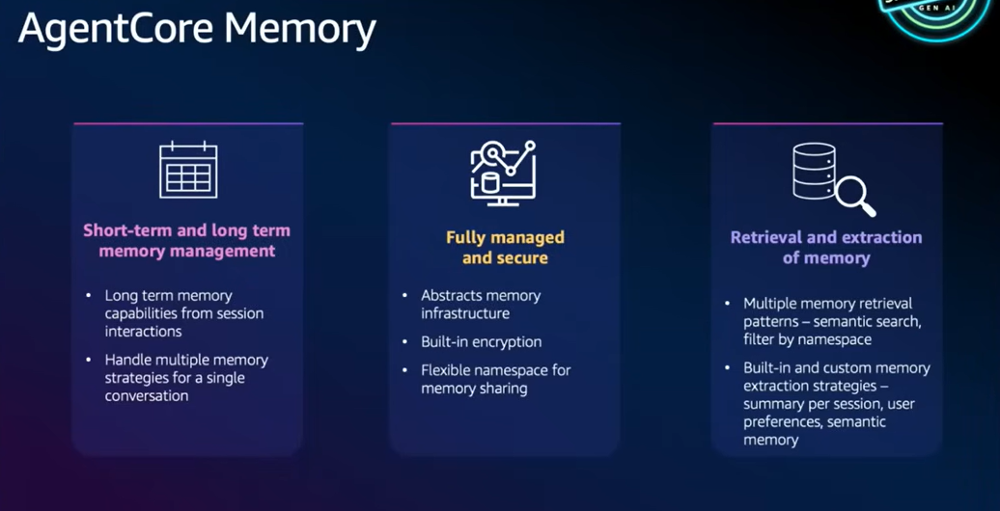

| | **Short-Term Memory** | **Long-Term Memory** |
| :--- | :--- | :--- |
| Scope | Current conversation | Across sessions, per user |
| Content | Chat messages, session state, events | User preferences, facts, conversation summaries |
| How written | Agent posts events synchronously | Automatic, asynchronous extraction |
| Retrieval | List events | Semantic search, keyword, namespace filters |

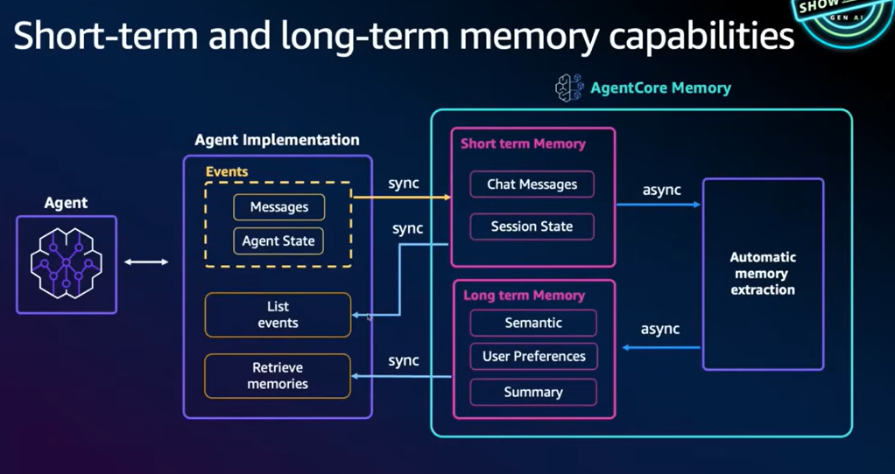

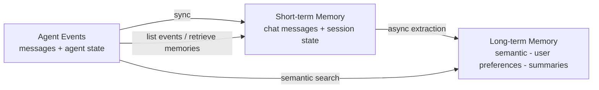
```mermaid
flowchart LR
    Agent["Agent Events<br/>messages + agent state"] -->|sync| STM["Short-term Memory<br/>chat messages + session state"]
    Agent -->|list events / retrieve memories| STM
    STM -->|async extraction| LTM["Long-term Memory<br/>semantic - user preferences - summaries"]
    Agent -->|semantic search| LTM
```

### Actor ID — why memory is per-user

Long-term memory is namespaced by **Actor ID** (the user's identity — name, email, Cognito sub). One user's preferences never bleed into another's. That's how the same agent serves thousands of users *personally*.

### Wiring it up — Strands hooks (from the demo)

```python
from bedrock_agentcore.memory import MemoryClient, hooks

memory_client = MemoryClient(region="us-east-1")
memory_hook = hooks.MemoryHook(
    memory_client=memory_client,
    memory_id="customer-support-mem",
    actor_id=actor_id,          # ← the user this memory belongs to
    session_id=session_id,
)

#  on_agent_initiate → preload past preferences/facts/summaries into context
#  on_message_add    → every user/agent message saved to short-term memory;
#                      long-term extraction happens asynchronously

def create_agent(actor_id, session_id):
    return Agent(model=MODEL_ID, tools=tools,
                 hooks=[memory_hook])
```

> [!NOTE]
> Not a Strands user? LangGraph and CrewAI expose equivalent hooks/middleware — same idea: on agent start, inject memories; on each message, save events.

---

## 2.14 🧪 Memory in Action

The demo's proof, played across **two separate sessions**:

```text
Session 1 (earlier, different sessionId)
👤 User:  "My favorite device is Gaming Console Pro."
          → stored via on_message_add → extracted to long-term memory
             as a user preference for actor_id = EK

Session 2 (brand-new sessionId, same actor)
👤 User:  "What is my favorite device?"
🤖 Agent: "Your favorite device is the Gaming Console Pro."
          → on_agent_initiate pulled the preference from long-term memory
```

> [!TIP]
> 💡 **The user experience win**: nobody wants to re-explain their problem to a chatbot every session. A few lines of hook code → a hyper-personalized agent that remembers.

---

## 2.15 🔐 AgentCore Identity — Third-Party Services

Internal tools aren't enough — great agents also reach **third-party services**: Google Drive/Calendar/Gmail, Salesforce, Jira. Identity brokers that access **securely, with user consent**.

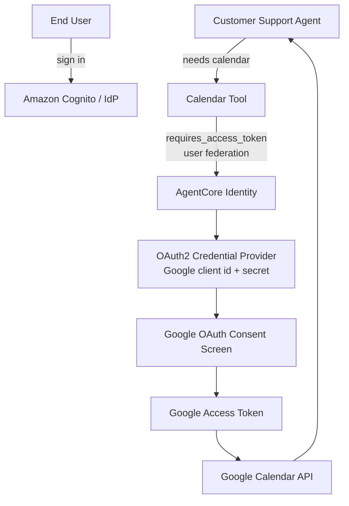
```mermaid
flowchart TD
    User["End User"] -->|sign in| Cognito["Amazon Cognito / IdP"]
    Agent["Customer Support Agent"] -->|needs calendar| Tool["Calendar Tool"]
    Tool -->|requires_access_token<br/>user federation| IDP["AgentCore Identity"]
    IDP --> Cred["OAuth2 Credential Provider<br/>Google client id + secret"]
    Cred --> Consent["Google OAuth Consent Screen"]
    Consent --> Token["Google Access Token"]
    Token --> GCal["Google Calendar API"]
    GCal --> Agent
```

**How it works in code (from the demo):**

```python
# 1) One-time setup: create an OAuth2 credential provider in Identity
#    → holds your Google OAuth client id + client secret

# 2) In the tool, ask Identity for the user's Google token
@requires_access_token(provider_name="google-provider",
                       scopes=["https://www.googleapis.com/auth/calendar"],
                       auth_flow="USER_FEDERATION")
def get_calendar_events(access_token=None):
    # access_token → THIS user's Google credentials, obtained with consent
    return calendar_api.list_events(access_token)
```

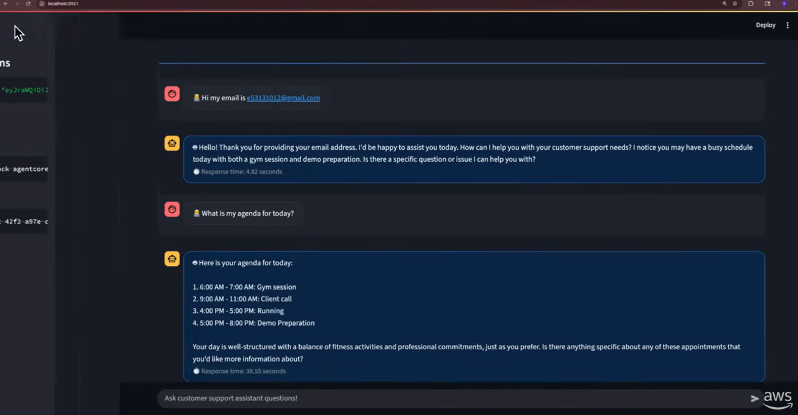

*The Streamlit demo: user asks "What is my agenda for today?" → agent returns the real calendar — gym session, client call, running, demo prep — via Identity-brokered OAuth.*

> [!IMPORTANT]
> **Consent is explicit**: the end user sees the Google authorization URL and approves the exact scopes. If *you* run the agent, it can only see *your* calendar; if the customer runs it, theirs. That's the whole point of Identity.

---

## 2.16 📊 AgentCore Observability — "What Is My Agent Actually Doing?"

The #1 pre-AgentCore customer complaint: agents were black boxes. The fix is live today as the **GenAI Observability dashboard in CloudWatch** (Bedrock AgentCore section).

**Dashboard metrics per agent:**

| Metric | What it tells you |
| :--- | :--- |
| 🧵 **Sessions** | How many isolated user sessions ran (demo: 5) |
| 🔍 **Traces** | Every step of each invocation (demo: 19 traces) |
| 🪙 **Token usage** | Model consumption & cost drivers |
| ❌ **Errors / exceptions** | Failures surfaced immediately |
| ⏱️ **Latency** | Response-time distribution |
| 🚦 **Throttling** | Rate-limit events |

**Inside a trace** — the agent's *trajectory*: `InvokeAgentRuntime` → the Strands execution loop → Anthropic model calls → tool calls → response. Exactly the breadcrumb trail you need to audit, debug and trust an autonomous agent.

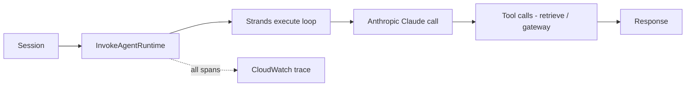
```mermaid
flowchart LR
    S["Session"] --> I["InvokeAgentRuntime"]
    I --> L["Strands execute loop"]
    L --> M["Anthropic Claude call"]
    M --> T["Tool calls - retrieve / gateway"]
    T --> R["Response"]
    I -.->|all spans| CW["CloudWatch trace"]
```

> [!TIP]
> 💡 **Trusted agents = observable agents.** Autonomous is fine — as long as it's secure, under control, and auditable. Observability is the end-to-end picture that makes that real.

---

## 2.17 🏗️ Complete Production Architecture — Putting It All Together

Everything from the demo, one picture:

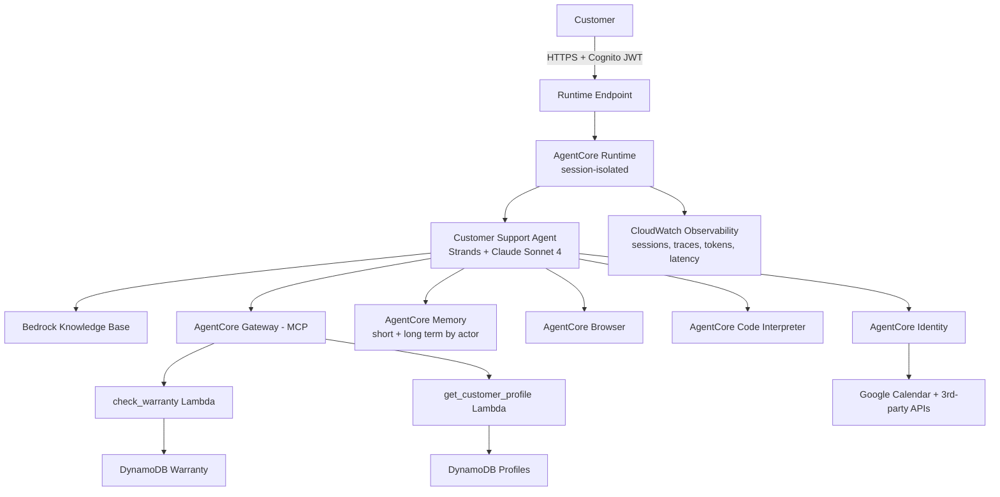
```mermaid
flowchart TD
    User["Customer"] -->|HTTPS + Cognito JWT| EP["Runtime Endpoint"]
    EP --> RT["AgentCore Runtime<br/>session-isolated"]
    RT --> Agent["Customer Support Agent<br/>Strands + Claude Sonnet 4"]
    Agent --> KB["Bedrock Knowledge Base"]
    Agent --> GW["AgentCore Gateway - MCP"]
    GW --> L1["check_warranty Lambda"]
    GW --> L2["get_customer_profile Lambda"]
    L1 --> D1["DynamoDB Warranty"]
    L2 --> D2["DynamoDB Profiles"]
    Agent --> MEM["AgentCore Memory<br/>short + long term by actor"]
    Agent --> BRW["AgentCore Browser"]
    Agent --> CI["AgentCore Code Interpreter"]
    Agent --> IDP["AgentCore Identity"]
    IDP --> GGL["Google Calendar + 3rd-party APIs"]
    RT --> OBS["CloudWatch Observability<br/>sessions, traces, tokens, latency"]
```

> [!NOTE]
> **Any framework, any model** — Strands + Claude today; LangGraph + Gemini tomorrow. Runtime doesn't care. And if you already built agents on Bedrock Agents, the new **import capability** can generate Strands + AgentCore code for you.

### Watch the original episode

<VideoSection youtubeId="wzIQDPFQx30" title="AWS Show & Tell — Building your first production-ready AI agent with Amazon Bedrock AgentCore" />

---

## 2.18 🧠 Knowledge Check

Q1: What is the main purpose of AgentCore Runtime?
- A) To train foundation models from scratch
- B) Secure, scalable hosting for agents and tools with session isolation (Correct)
- C) To replace all agent frameworks with a single AWS framework
- D) To store vector embeddings for knowledge bases

**Explanation**: Runtime hosts any framework's agents (and even tools/MCP servers) at scale, with fast cold starts, 100MB payloads, 8-hour runs and full session isolation.

Q2: Why is session isolation important?
- A) It makes cold starts faster
- B) It guarantees no information leaks between different users' sessions (Correct)
- C) It increases the payload limit to 100MB
- D) It enables MCP support

**Explanation**: Dedicated execution environments per session mean no leftover memory or filesystem state can leak between sessions — critical for multi-customer workloads.

Q3: What problem does AgentCore Gateway solve?
- A) It routes HTTP traffic to EC2 instances
- B) It exposes existing APIs and Lambda functions as standard MCP tools (Correct)
- C) It stores agent conversation history
- D) It builds Docker images

**Explanation**: Gateway turns REST services (OpenAPI) and Lambda functions into MCP tools that plug into any agent framework or coding assistant.

Q4: Why is MCP useful for AI agents?
- A) It is a faster model inference protocol
- B) It is a standard "USB plug-in" way for agents to discover and call tools (Correct)
- C) It encrypts agent traffic
- D) It replaces OAuth authentication

**Explanation**: Agent frameworks and coding assistants natively support MCP — plug in a URL, get the whole toolbox in a standard way.

Q5: What is the difference between short-term and long-term memory?
- A) Short-term is faster hardware; long-term is cheaper
- B) Short-term covers the current session's events; long-term extracts preferences, facts and summaries across sessions (Correct)
- C) They are identical — just different namespaces
- D) Long-term memory only works with Strands agents

**Explanation**: Short-term keeps chat messages/session state synchronously; long-term asynchronously extracts durable knowledge retrievable via semantic search.

Q6: Why is Actor ID important?
- A) It encrypts the agent's code
- B) It namespaces long-term memory per user so each user has their own preferences and facts (Correct)
- C) It sets the Docker image name
- D) It controls token pricing

**Explanation**: Long-term memories are associated with an actor — one user's preferences never leak into another user's context.

Q7: What does AgentCore Identity provide?
- A) Only inbound username/password checks
- B) End-to-end authentication and authorization for users, agents and tools — including OAuth to third-party services (Correct)
- C) DNS registration for agent endpoints
- D) Model evaluation scores

**Explanation**: Identity secures user→agent, agent→agent and agent→tool flows, and brokers OAuth credentials for services like Google Calendar with explicit user consent.

Q8: What information does AgentCore Observability provide?
- A) Only billing data
- B) Sessions, traces, token usage, errors, latency and throttling — the agent's full trajectory (Correct)
- C) Source-code diffs between deployments
- D) Cognito user counts

**Explanation**: The CloudWatch GenAI dashboard shows per-agent sessions/traces and drills into each trace to reveal the agent's execution path.

Q9: Can Gateway tools be updated without modifying agent code?
- A) No — the agent must be rebuilt and relaunched
- B) Yes — Gateway is loosely coupled; adding a target tool is picked up by the running agent (Correct)
- C) Only during a maintenance window
- D) Only for REST targets, not Lambda

**Explanation**: In the demo, `get_customer_profile` was added to the existing gateway target and the *same deployed agent* used it immediately — zero code changes.

Q10: What does `agentcore configure` do?
- A) Launches the agent into production
- B) Collects deployment settings — entrypoint, execution role, ECR, requirements file, and auth config (Correct)
- C) Creates a Bedrock Knowledge Base
- D) Opens the CloudWatch dashboard

**Explanation**: `configure` is the interactive setup step; `launch` performs the actual build-and-deploy.

Q11: What happens when you run `agentcore launch`?
- A) The agent code runs only on localhost
- B) The project is zipped to S3, CodeBuild builds a Docker image to ECR, and the Runtime endpoint is created (Correct)
- C) It deletes the existing runtime
- D) It only prints configuration

**Explanation**: Launch drives the full deployment pipeline — S3 artifact, CodeBuild image build, ECR push, runtime agent + endpoint.

---

## 🔧 Troubleshooting & Common Issues

### Agent can't see a new tool

The tool was added to the Gateway target but the agent still says "I don't have access". Confirm the MCP client connection is established before `list_tools_sync()`, and that the bearer token is still valid — expired tokens silently return empty tool lists.

### Authentication failed when invoking

The runtime was configured with Cognito authorization — invoke calls must carry a valid `Authorization: Bearer <jwt>` header from the Cognito IdP, plus a session ID header. Check the discovery URL, client ID and audience values used at `agentcore configure` time.

### Memory returns nothing in a new session

Long-term extraction is **asynchronous** — a brand-new session may precede extraction completing. Also verify `actor_id` matches the earlier session's actor; memories are namespaced per actor, not per session.

### Launch succeeds but the endpoint times out

Check the CloudWatch log group for the runtime (`aws logs tail … --follow`) — dependency issues in `requirements.txt` and missing IAM permissions on the execution role are the usual suspects.

---

## 🔬 Practical Lab — Build a Production-Ready Customer Support Agent

**Objective**: take the demo's journey end-to-end — local Strands agent → AgentCore Runtime → Gateway tools → Memory → Identity → Observability.

**Prerequisites**: AWS account + credentials, AgentCore starter kit/SDK installed, a Bedrock Knowledge Base with warranty docs, two Lambda functions (`check_warranty`, `get_customer_profile`) reading DynamoDB tables, a Cognito user pool.

### Step 1 — Build and test the local agent

Create `main.py` with the Strands agent (`current_time` + `retrieve` tools, `KNOWLEDGE_BASE_ID` env var). Run it locally and ask *"What are the warranty support guidelines?"* — verify a KB-grounded streamed answer.

### Step 2 — AgentCore-ify the code

Wrap with `BedrockAgentCoreApp`, add the `@app.entrypoint` invoke function using `payload` + `context.session_id`, and stream events back.

### Step 3 — Configure and launch

```bash
agentcore configure --entrypoint main.py --name customer-support-demo
agentcore launch --local        # smoke-test on localhost first
agentcore launch                # deploy: S3 → CodeBuild → ECR → Runtime endpoint
```

### Step 4 — Invoke the deployed agent

Get a Cognito access token, then POST to the runtime invocations URL with the bearer token + a session ID. Confirm streaming responses from the cloud endpoint.

### Step 5 — Create the Gateway and add Lambda targets

Create the gateway with the OAuth inbound-auth config, add the `check_warranty` Lambda target with its tool schema, connect via an MCP client, and ask *"What is my warranty status?"* Then add `get_customer_profile` to the target and verify — **no agent code change**.

### Step 6 — Add memory

Create an AgentCore memory, wire the Strands `MemoryHook` (`on_agent_initiate` + `on_message_add`) with `actor_id` + `session_id`. In session 1 teach a preference ("My favorite device is Gaming Console Pro"); in a new session ask *"What is my favorite device?"*

### Step 7 — Add a third-party tool via Identity

Create a Google OAuth2 credential provider, annotate the calendar tool with `@requires_access_token` (user federation flow), run the consent flow once, then ask *"What is my agenda for today?"*

### Step 8 — Observe everything

Open the CloudWatch GenAI dashboard → Bedrock AgentCore → your agent: sessions, traces, token usage, errors, latency, throttling. Drill into a trace and follow the trajectory.

### ✅ Verification Checklist

- Local agent answers warranty questions via the Knowledge Base
- `agentcore launch` completes and the endpoint streams responses
- `check_warranty` and `get_customer_profile` work through Gateway — the second added *without* redeploying
- New session recalls the user's favorite device via long-term memory
- Google agenda returned after OAuth consent
- CloudWatch shows sessions, traces and metrics for the agent

---

## 🏆 Chapter 2 Summary

In this chapter, we learned:

- **The production gap**: prototypes are easy — security, scale, interoperability, payload size, long runs and observability are the hard parts. AgentCore removes that undifferentiated heavy lifting.
- **AgentCore Runtime**: deploy and run agents — any framework, any model — with session isolation, 100MB payloads and up to 8-hour workloads. Two commands: `agentcore configure`, `agentcore launch`.
- **AgentCore Gateway**: connect existing APIs and Lambda functions to agents through MCP — with OAuth security and built-in semantic tool search. Update tools without touching agent code.
- **AgentCore Memory**: maintain short-term session context and long-term knowledge — preferences, facts, summaries — namespaced by Actor ID and retrieved semantically.
- **AgentCore Identity**: secure authentication and authorization end to end — Cognito for inbound calls, OAuth credential providers for third-party services like Google Calendar.
- **AgentCore Observability**: understand and monitor agent behavior in CloudWatch — sessions, traces, tokens, errors, latency and the full execution trajectory.
- **Browser & Code Interpreter**: managed tools for automating web/legacy workflows and safely running agent-generated code.
- **The big picture**: Runtime + Gateway + Memory + Identity + Observability = a production Customer Support Assistant that is secure, scalable, personalized and fully auditable.
