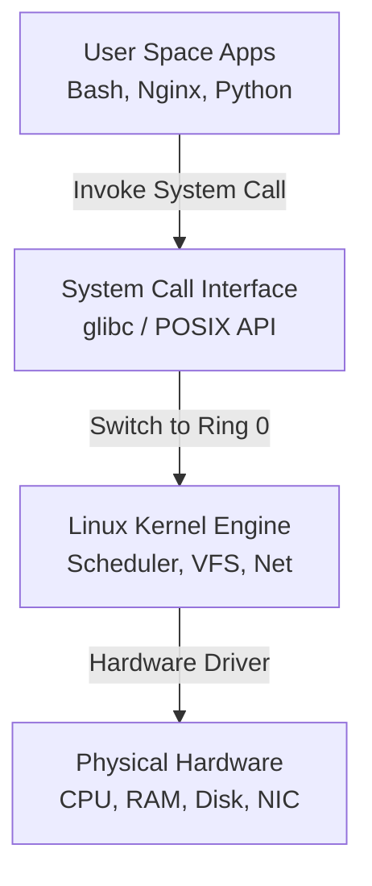
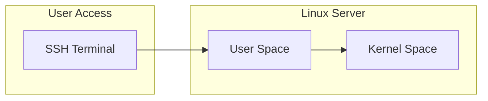

# Chapter 01: History of Unix & Linux — Foundations & Architecture

---

## 1. Service Overview


> [!TIP]
> **Video Tutorial:** [Click here to watch the complete step-by-step practical demonstration on YouTube](#)
### What is Unix and Linux?
Unix is a pioneer, multi-user, multi-tasking operating system created in 1969 at AT&T Bell Labs. Linux, created in 1991 by Linus Torvalds, is a monolithic open-source kernel modeled after POSIX (Portable Operating System Interface) standards. 

### Why Linux Exists & Linux vs Kernel vs Distribution
- **Linux Kernel**: The core engine managing hardware abstraction, memory allocation, process scheduling, and device drivers.
- **GNU System Utilities**: The shell (Bash), compilers (GCC), core utility commands (`ls`, `grep`, `cp`), and core libraries (`glibc`).
- **Linux Distribution**: The complete, enterprise-ready operating system (Kernel + GNU Tools + Package Manager + Service Manager) packaged by vendors like Red Hat, Canonical, or Amazon.

### Business Problem It Solves
- **Licensing Overhead**: Eliminates expensive per-core proprietary OS licenses.
- **Enterprise Resilience**: Guarantees multi-year uptime without mandatory system restarts.
- **Cloud Standardization**: Serves as the universal foundation for cloud infrastructure (AWS EC2, Docker, Kubernetes).

### Evolution Timeline
- **1969**: Unix created at AT&T Bell Labs by Ken Thompson and Dennis Ritchie in C.
- **1983**: Richard Stallman launches the GNU Project and GPL license.
- **1991**: Linus Torvalds releases Linux Kernel v0.01 under GPLv2.
- **Present**: Linux powers 100% of top 500 supercomputers, 90%+ of cloud workloads, and all Android devices.

### Key Terminology
- **Kernel**: Core hardware manager operating in privileged ring 0.
- **User Space**: Unprivileged execution environment for applications in ring 3.
- **POSIX**: Standard defining operating system API compatibility.

---

## 2. Learning Objectives
1. **Differentiate** between the Linux Kernel, GNU operating tools, and enterprise Distributions.
2. **Execute** baseline system identification commands in the terminal (`uname`, `os-release`, `hostnamectl`).
3. **Analyze** historical design choices (plain-text config, Unix philosophy, file abstraction) in modern SysAdmin workflows.
4. **Triage** unidentified legacy Linux hosts in a production environment.

---

## 3. Prerequisites
- Basic familiarity with computers and cloud hosting concepts.
- Access to a Linux terminal environment.

---

## 4. Real-world Analogy
Think of an operating system like an automobile:
- **Unix (1969)**: The original high-performance engine blueprint.
- **GNU Project (1983)**: The steering wheel, brakes, dashboard, and body panels built for everyone to use freely.
- **Linux Kernel (1991)**: The powerful free engine built by Linus Torvalds.
- **GNU/Linux Distribution**: The complete turn-key car (Red Hat Enterprise Linux, Ubuntu, Amazon Linux) delivered by manufacturers with full safety warranties and maintenance services.

---

## 5. Business Use Cases
- **Cloud Infrastructure**: Hosting elastic microservices on AWS EC2.
- **Enterprise Databases**: High-throughput Oracle and PostgreSQL deployments on RHEL.
- **Edge & IoT**: Lightweight embedded Linux running smart gateway devices.

---

## 6. Core Concepts: Foundations & Architecture

### Kernel vs User Space Architecture
Linux enforces a strict separation between application code and hardware control:
1. **User Space (Ring 3)**: Applications, Bash shell, web servers, and user utilities execute here with restricted privileges.
2. **System Call Interface (POSIX)**: The bridge enabling applications to request kernel services (`read()`, `write()`, `fork()`, `execve()`).
3. **Kernel Space (Ring 0)**: Unrestricted direct hardware access managing RAM, CPU scheduling, storage I/O, and networking interfaces.

---

## 7. Internal Architecture



- **Request Lifecycle**: An application executes in user space, triggers a software interrupt via a system call, context-switches to kernel space, executes hardware operations, and returns the result to user space.

---

## 8. System Components
- **Process Scheduler**: Controls CPU time distribution across active threads.
- **Virtual File System (VFS)**: Provides unified filesystem access regardless of underlying storage device or filesystem type.
- **Memory Manager**: Allocates virtual memory address spaces and enforces paging.

---

## 9. Configuration
Modern Linux systems store distribution metadata in human-readable plain text files:
- `/etc/os-release`: Universal standard distribution metadata file.
- `/etc/redhat-release` or `/etc/debian_version`: Legacy vendor distribution tags.

---

## 10. Hands-on Labs


### Lab Setup
> **Lab Environment**: Make sure your local Linux virtual machine (Ubuntu 22.04 or RHEL 9) is booted and you are connected via SSH as the 
oot or a sudo enabled user.
> **Terminal Required**: Open your Linux terminal and type each command yourself. Never copy-paste blindly!
### Lab 1: System Identification & Triage
Execute basic identification commands to determine OS identity, kernel version, and architecture.

```bash
# 1. Check running kernel version
uname -r

# 2. Inspect full system parameters
uname -a

# 3. Read OS distribution metadata
cat /etc/os-release

# 4. View unified system identity
hostnamectl
```

#### Progressive Hint System
- **Level 1 (Clue)**: Use commands that query kernel metrics and `/etc` configuration files.
- **Level 2 (Direction)**: Look for the command starting with `u` for kernel info and `cat` to read system release files under `/etc/`.
- **Level 3 (Concept)**: `uname -a` displays kernel version and architecture; `cat /etc/os-release` exposes distro details.

---


#### Progressive Hint System

<details>
<summary>Hint 1: Conceptual Approach</summary>
Before running commands, always identify what state the system is currently in. Think about what command shows service or filesystem status.
</details>

<details>
<summary>Hint 2: Relevant Commands</summary>
You might want to use `systemctl status`, `cat /etc/*`, or standard diagnostic commands like `ls -la` and `stat`.
</details>

<details>
<summary>Hint 3: Full Solution</summary>

```bash
# Execute the relevant diagnostic command for this topic
systemctl status <service_name>
# Or
ls -la /relevant/path
```
</details>

## 11. Code Examples

### Shell Script: Automated Host Identifier
```bash
#!/usr/bin/env bash
# Description: Production Host Identification Triage Script
set -euo pipefail

echo "=========================================="
echo "          SYSTEM TRIAGE REPORT            "
echo "=========================================="
echo "Hostname:    $(hostname)"
echo "Kernel:      $(uname -r)"
echo "Arch:        $(uname -m)"
if [ -f /etc/os-release ]; source /etc/os-release; echo "Distro:      $PRETTY_NAME"; fi
echo "=========================================="
```

---

## 12. Security Deep Dive
- **Ring Isolation**: Ring 3 user space isolation prevents corrupted application memory from crashing kernel memory space.
- **GPL Compliance**: Open source licensing ensures full transparency into source code vulnerabilities.

---

## 13. Monitoring & Observability
- **Kernel Logs**: Inspected via `dmesg -T` or `journalctl -k`.
- **Uptime Metrics**: Verified via `uptime` and `/proc/uptime`.

---

## 14. Performance & Cost Optimization
- **Zero License Fees**: Operating Linux reduces OS licensing overhead to $0 per node.
- **Lean Footprint**: Running headless server installations frees RAM for database caching.

---

## 15. Enterprise Integration
Linux integrates seamlessly into enterprise security (SSO/Active Directory via SSSD), monitoring (Datadog/Prometheus), and automation (Ansible/Terraform).

---

## 16. Real Industry Use Cases
1. **E-commerce Platform**: Running microservices across auto-scaled Amazon Linux 2023 nodes.
2. **Banking Core**: Running transactional databases on Red Hat Enterprise Linux with FIPS compliance.

---

## 17. Architecture Patterns



---

## 18. Production Incident War Room

### Incident INC-1001: Unidentified Legacy Linux Host Triage
- **Severity**: P2 / High | **Service Affected**: Server Management
- **Symptom**: Monitoring system alerts on an unmapped server IP `10.0.4.15` responding to SSH. SysAdmins need to identify OS release and kernel version immediately without rebooting.
- **Root Cause Analysis**: Server was provisioned manually without configuration management tags.
- **Remediation Script**:
```bash
# Execute remote triage
ssh admin@10.0.4.15 "uname -a && cat /etc/os-release && hostnamectl"
```
- **Prevention**: Enforce automated CMDB registration during server bootstrap.

---

## 19. Production Best Practices
- Never use non-LTS (Long Term Support) Linux releases in production.
- Standardize on 1–2 enterprise distributions across the organization.

---

## 20. Migration Strategies
Adopt the **Lift and Shift with Modernization** pattern when migrating legacy Unix workloads (Solaris/AIX) to Linux.

---

## 21. CI/CD Integration
Automate host verification in GitHub Actions pipelines using `uname -a` and `cat /etc/os-release`.

---

## 22. Practical Projects

### Beginner Project: Host Information Audit Tool
Write a Bash script that collects OS details and exports them to a JSON payload.

### Intermediate Project: Multi-Distro Detector
Extend the script to detect RHEL, Ubuntu, Alpine, and Amazon Linux package managers automatically.

### Advanced Project: Infrastructure Inventory Collector
Build a Python script using `boto3` and SSH to collect kernel versions across 100 AWS EC2 instances.

### Enterprise Project: Automated Compliance Triage Pipeline
Deploy an automated Ansible playbook verifying kernel patch compliance across enterprise nodes.

---

## 23. Interview Preparation

### Sample Questions & Answers
#### Q1: What is the core difference between the Linux Kernel and a Linux Distribution?
**Answer**: The Linux Kernel is strictly the core driver and resource management engine. A Distribution is a complete operating system combining the kernel, GNU utilities, systemd, package manager, and default configurations.

---

## 24. Certification Practice
**Question**: Which file contains standard distribution vendor details across modern systemd-based Linux systems?
- A) `/etc/kernel`
- B) `/etc/os-release` **(Correct)**
- C) `/proc/distro`
- D) `/sys/os`

---

## 25. Knowledge Check
1. **Interactive Quiz**: Which kernel command displays the detailed hardware architecture along with release string? (`uname -a`).

---

## 26. Cheat Sheet
| Command | Purpose |
| :--- | :--- |
| `uname -r` | Print running kernel version |
| `uname -a` | Print all kernel, hostname, and CPU arch details |
| `cat /etc/os-release` | Display distribution name and release version |
| `hostnamectl` | Display host identity, kernel, and virtualization status |

---

## 27. Chapter Summary
Understanding Linux history highlights the separation of kernel from distribution and user space from kernel space. Mastering basic identification commands (`uname`, `/etc/os-release`) is the essential first step for any System Administrator.

---

## 28. Further Learning
- [Kernel.org Official Archives](https://www.kernel.org)
- [GNU Operating System Documentation](https://www.gnu.org)
