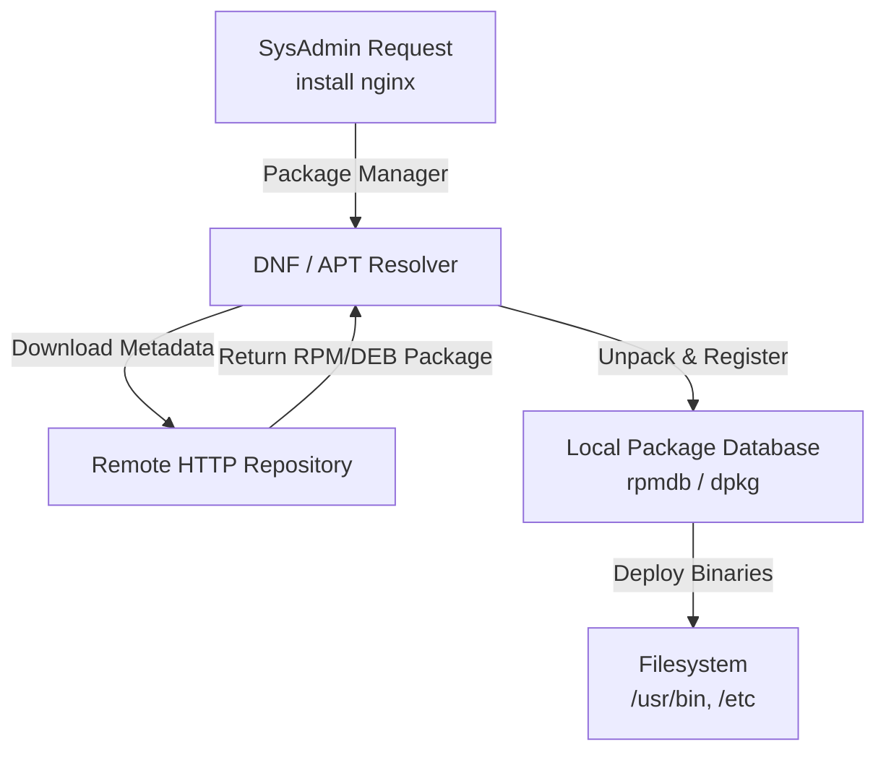
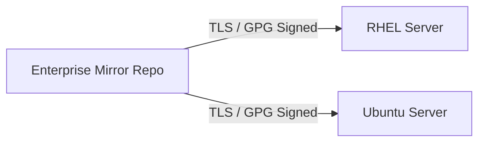

# Chapter 02: Linux Distributions & Ecosystem — Enterprise Selection

---

## 1. Service Overview


> [!TIP]
> **Video Tutorial:** [Click here to watch the complete step-by-step practical demonstration on YouTube](#)
### What is a Linux Distribution?
A Linux Distribution (distro) is an integrated operating system stack containing the Linux Kernel, GNU system tools, package management software, systemd init daemon, and pre-configured default settings tailored for specific use cases.

### Enterprise Distros vs Specialized Distros
- **Enterprise Standard (RHEL, Ubuntu LTS, Amazon Linux 2023)**: Backed by multi-year support cycles, security SLAs, FIPS compliance, and stability.
- **Specialized / Desktop / Edge (Debian, Fedora, Alpine, Arch, Kali)**: Tailored for rapid feature adoption, penetration testing, or lightweight containers.

### Business Problem It Solves
- **Enterprise Support & Compliance**: Enterprise distributions provide guaranteed security patches, regulatory compliance (PCI-DSS, HIPAA), and 24/7 vendor SLA support.
- **Dependency Management**: Package managers (`dnf`, `apt`) solve "dependency hell" by automatically resolving and installing software libraries.

---

## 2. Learning Objectives
1. **Evaluate** enterprise Linux distributions based on stability, support lifecycle, and cloud compatibility.
2. **Execute** package manager queries across RPM (`dnf`/`yum`) and Debian (`apt`) package systems.
3. **Recommend** the correct Linux distribution for specific business requirements (Startup, Banking, Cloud Native).

---

## 3. Prerequisites
- Completion of Chapter 01 (Linux History & Kernel Basics).

---

## 4. Real-world Analogy
Choosing a Linux Distribution is like choosing an enterprise vehicle fleet:
- **Red Hat Enterprise Linux (RHEL)**: An armored commercial transport truck — heavy, ultra-reliable, comes with a 10-year service contract.
- **Ubuntu LTS**: A versatile fleet sedan — popular, easy to maintain, supported everywhere.
- **Amazon Linux 2023**: A custom delivery van engineered specifically for Amazon's highways (AWS).

---

## 5. Business Use Cases — "Choose the Right Distro" Decision Matrix

| Business Scenario | Recommended Distro | Primary Rationale |
| :--- | :--- | :--- |
| **Banking / Core Finance** | RHEL | 10-year support lifecycle, FIPS security certification, vendor SLA |
| **High-Growth Tech Startup** | Ubuntu LTS | Massive developer ecosystem, latest package availability, cloud AMI ubiquity |
| **AWS Cloud Native App** | Amazon Linux 2023 | Zero extra licensing cost, optimized AWS driver integration, minimal attack surface |
| **Edge / Container Microservice**| Alpine Linux | Microscopic image size (5MB), fast boot times, low memory overhead |

---

## 6. Core Concepts: Enterprise Selection

### Package Management Ecosystem
Linux distros are fundamentally categorized by their package management formats:
1. **Red Hat Family (RHEL, Fedora, Rocky, Alma, Amazon Linux)**: Uses `.rpm` packages managed by `dnf` / `yum`.
2. **Debian Family (Debian, Ubuntu, Mint)**: Uses `.deb` packages managed by `apt` / `dpkg`.

---

## 7. Internal Architecture



---

## 8. System Components
- **Package Manager Engine (`dnf` / `apt`)**: Resolves library dependencies and validates cryptographic signatures.
- **Repository List (`/etc/yum.repos.d/` or `/etc/apt/sources.list`)**: Defines trusted remote HTTP software mirrors.

---

## 9. Configuration
Repository configuration files store mirror URLs and GPG key verification settings:
- `/etc/yum.repos.d/fedora.repo` (RPM systems)
- `/etc/apt/sources.list` (Debian systems)

---

## 10. Hands-on Labs


### Lab Setup
> **Lab Environment**: Make sure your local Linux virtual machine (Ubuntu 22.04 or RHEL 9) is booted and you are connected via SSH as the 
oot or a sudo enabled user.
> **Terminal Required**: Open your Linux terminal and type each command yourself. Never copy-paste blindly!
### Lab 1: OS Identification & Package Manager Triage
Determine OS family and query installed package information using native tools.

```bash
# 1. Identify Distro Family
cat /etc/os-release

# 2. Query Installed Package Count on RPM-based systems
rpm -qa | wc -l

# 3. Search for a package (RPM vs Debian)
which dnf && dnf search nginx || apt-cache search nginx
```

#### Progressive Hint System
- **Level 1 (Clue)**: Check `/etc/os-release` to find `ID_LIKE` family string.
- **Level 2 (Direction)**: Use `rpm -qa` on RHEL/Fedora/Amazon Linux or `dpkg -l` on Ubuntu/Debian.
- **Level 3 (Concept)**: Package managers maintain local databases recording all installed files.

---


#### Progressive Hint System

<details>
<summary>Hint 1: Conceptual Approach</summary>
Before running commands, always identify what state the system is currently in. Think about what command shows service or filesystem status.
</details>

<details>
<summary>Hint 2: Relevant Commands</summary>
You might want to use `systemctl status`, `cat /etc/*`, or standard diagnostic commands like `ls -la` and `stat`.
</details>

<details>
<summary>Hint 3: Full Solution</summary>

```bash
# Execute the relevant diagnostic command for this topic
systemctl status <service_name>
# Or
ls -la /relevant/path
```
</details>

## 11. Code Examples

### Shell Script: Distro-Agnostic Package Installer
```bash
#!/usr/bin/env bash
# Description: Detects OS family and installs HTTP server safely
set -euo pipefail

if [ -f /etc/os-release ]; then
    source /etc/os-release
    case "$ID_LIKE" in
        *rhel*|*fedora*)
            echo "Installing via DNF..."
            sudo dnf install -y httpd
            ;;
        *debian*)
            echo "Installing via APT..."
            sudo apt-get update && sudo apt-get install -y nginx
            ;;
        *)
            echo "Unsupported OS family: $ID"
            exit 1
            ;;
    esac
fi
```

---

## 12. Security Deep Dive
- **GPG Package Signing**: Repositories sign `.rpm` and `.deb` packages with cryptographic GPG keys to prevent man-in-the-middle package poisoning.

---

## 13. Monitoring & Observability
- **Package Audit Logs**: Inspected at `/var/log/dnf.log` or `/var/log/dpkg.log`.

---

## 14. Performance & Cost Optimization
- Use local repository mirrors inside enterprise VPCs to eliminate external bandwidth costs and speed up server provisioning.

---

## 15. Enterprise Integration
Integrates with Red Hat Satellite, Canonical Landscape, or AWS Systems Manager (SSM) Patch Manager for automated fleet patching.

---

## 16. Real Industry Use Cases
1. **Financial Trading Platform**: Standardizing on RHEL 9 with realtime kernel patches.
2. **Containerized Kubernetes Cluster**: Utilizing Amazon Linux 2023 EKS-optimized AMIs.

---

## 17. Architecture Patterns



---

## 18. Production Incident War Room

### Incident INC-1002: Distro EOL & Broken Repository Mirrors
- **Severity**: P2 / High | **Service Affected**: Package Deployment
- **Symptom**: `dnf update` fails across web servers with `404 Not Found` errors when fetching metadata.
- **Root Cause Analysis**: Distro reached End-of-Life (EOL), and upstream vendor moved repositories to vault mirrors.
- **Remediation Script**:
```bash
# Update repository URLs to vault mirrors on legacy CentOS
sudo sed -i 's/mirrorlist/#mirrorlist/g' /etc/yum.repos.d/CentOS-*
sudo sed -i 's|#baseurl=http://mirror.centos.org|baseurl=http://vault.centos.org|g' /etc/yum.repos.d/CentOS-*
sudo dnf clean all && sudo dnf makecache
```

---

## 19. Production Best Practices
- Disable unverified third-party software repositories.
- Enforce automated GPG key checking (`gpgcheck=1`).

---

## 20. Migration Strategies
Migrate legacy CentOS 7 workloads to Rocky Linux 9 or RHEL 9 using official `convert2rhel` migration tools.

---

## 21. CI/CD Integration
Automate package vulnerability scanning in CI pipelines using Trivy or Grype.

---

## 22. Practical Projects

### Beginner Project: Distro Selection Matrix Builder
Create a documentation matrix evaluating RHEL, Ubuntu, and Amazon Linux for your company.

### Intermediate Project: Local YUM Repository Mirror
Setup an Nginx server hosting a local RPM package repository mirror.

---

## 23. Interview Preparation
#### Q1: What is the main difference between RHEL and Fedora?
**Answer**: Fedora is a rapid-innovation upstream distribution featuring the latest technology. RHEL is downstream, taking stabilized Fedora features and hardening them for enterprise stability with 10-year support contracts.

---

## 24. Certification Practice
**Question**: Which command is used to query installed packages on an Amazon Linux 2023 host?
- A) `apt list --installed`
- B) `rpm -qa` **(Correct)**
- C) `dpkg -l`
- D) `pacman -Q`

---

## 25. Knowledge Check
1. **Interactive Quiz**: Which package manager format is natively used by Ubuntu? (`.deb` / `apt`).

---

## 26. Cheat Sheet
| Family | Distros | Package Manager | Format |
| :--- | :--- | :--- | :--- |
| **Red Hat** | RHEL, Fedora, Amazon Linux | `dnf` / `yum` | `.rpm` |
| **Debian** | Debian, Ubuntu | `apt` / `dpkg` | `.deb` |

---

## 27. Chapter Summary
Enterprise Linux selection centers around support contracts, security compliance, and package management stability. Understanding RHEL, Ubuntu, and Amazon Linux guarantees informed architectural choices.

---

## 28. Further Learning
- [Red Hat Enterprise Linux Lifecycle](https://access.redhat.com/support/policy/updates/errata)
- [Ubuntu Releases & Support](https://ubuntu.com/about/release-cycle)
