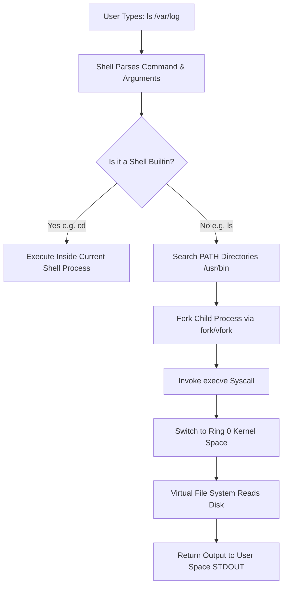
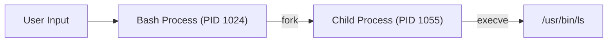

# Chapter 03: Linux Architecture & Kernel Fundamentals — Execution Flow

---

## 1. Service Overview


> [!TIP]
> **Video Tutorial:** [Click here to watch the complete step-by-step practical demonstration on YouTube](#)
### What Happens When You Run a Command?
When a user types a command in the Linux terminal (e.g. `ls -la /var/log`), a precise cascade of events occurs across shell parsing, binary lookup, process creation via system calls, kernel privilege transition, VFS interaction, and hardware execution.

### User Space vs Kernel Space Interaction
- **User Space**: Applications run safely here. They cannot directly access RAM or hard drives.
- **System Call (`syscall`)**: The controlled gatekeeper function (`read()`, `write()`, `execve()`, `open()`) switching execution into ring 0 kernel space.
- **Kernel Space**: Performs hardware operations and returns control to user space.

### Business Problem It Solves
- **System Stability**: Prevents application crashes or rogue scripts from corrupting host operating system memory.
- **Resource Management**: Ensures fair CPU time and memory allocation across multi-tenant workloads.

---

## 2. Learning Objectives
1. **Trace** the complete execution path of a Linux command from shell input to hardware execution.
2. **Differentiate** between Shell Builtin commands (`cd`, `pwd`, `echo`) and External Binaries (`ls`, `grep`).
3. **Utilize** `type`, `which`, and `strace` to inspect process system call interactions.

---

## 3. Prerequisites
- Completion of Chapters 01 & 02.

---

## 4. Real-world Analogy
Think of command execution like ordering at a restaurant:
- **User Space (Customer)**: You decide what you want, but you are not allowed inside the kitchen.
- **Shell Parser (Waiter)**: Takes your order (`ls /var/log`), verifies the items exist on the menu.
- **System Call (Kitchen Door)**: The waiter passes the order through the service window.
- **Kernel (Chef)**: Prepares the food (queries hardware/storage) and returns the result back to your table.

---

## 5. Business Use Cases
- **Performance Troubleshooting**: Identifying why an application has high CPU usage (`sys` vs `user` time).
- **Security Auditing**: Monitoring rogue system calls triggered by compromised binaries.

---

## 6. Core Concepts: Execution Flow

### Shell Builtins vs External Binaries
- **Shell Builtin**: A command built directly into the Bash shell process (`cd`, `pwd`, `exit`, `alias`). It executes instantly without creating a new process.
- **External Binary**: An executable file stored on disk (e.g., `/usr/bin/ls`). The shell must fork a child process and execute the binary file via the `execve()` system call.

---

## 7. Internal Architecture — Command Execution Lifecycle



---

## 8. System Components
- **Shell (Bash)**: Interactively reads STDIN, performs variable expansion, and executes commands.
- **PATH Variable**: Environment variable (`PATH=/usr/bin:/bin`) defining lookup directories.
- **System Call Interface (`glibc`)**: C library providing standard wrappers for Linux syscalls.

---

## 9. Configuration
Environment PATH variable configuration:
- `echo $PATH`
- Global environment paths configured in `/etc/environment` and `/etc/profile`.

---

## 10. Hands-on Labs


### Lab Setup
> **Lab Environment**: Make sure your local Linux virtual machine (Ubuntu 22.04 or RHEL 9) is booted and you are connected via SSH as the 
oot or a sudo enabled user.
> **Terminal Required**: Open your Linux terminal and type each command yourself. Never copy-paste blindly!
### Lab 1: Builtin vs External Binary Inspection
Use `type`, `which`, and `strace` to inspect command execution mechanics.

```bash
# 1. Inspect if 'cd' is a builtin or binary
type cd

# 2. Inspect 'ls' location
type ls
which ls

# 3. Trace system calls triggered by 'ls'
strace -c ls /var/log
```

#### Progressive Hint System
- **Level 1 (Clue)**: Use `type` to determine command classification.
- **Level 2 (Direction)**: `type cd` shows `cd is a shell builtin`; `type ls` shows path `/usr/bin/ls`.
- **Level 3 (Concept)**: Builtins run in-process; external binaries trigger `fork()` and `execve()`.

---


#### Progressive Hint System

<details>
<summary>Hint 1: Conceptual Approach</summary>
Before running commands, always identify what state the system is currently in. Think about what command shows service or filesystem status.
</details>

<details>
<summary>Hint 2: Relevant Commands</summary>
You might want to use `systemctl status`, `cat /etc/*`, or standard diagnostic commands like `ls -la` and `stat`.
</details>

<details>
<summary>Hint 3: Full Solution</summary>

```bash
# Execute the relevant diagnostic command for this topic
systemctl status <service_name>
# Or
ls -la /relevant/path
```
</details>

## 11. Code Examples

### Shell Script: Command Type Detector
```bash
#!/usr/bin/env bash
# Description: Detects whether a command is a builtin or external binary
set -euo pipefail

CMD="${1:-ls}"

if help "$CMD" >/dev/null 2>&1; then
    echo "'$CMD' is a Shell Builtin (Executes in-process)"
else
    LOCATION=$(which "$CMD" 2>/dev/null || echo "NOT FOUND")
    echo "'$CMD' is an External Binary at: $LOCATION"
fi
```

---

## 12. Security Deep Dive
- **PATH Hijacking**: If `.` (current directory) is placed at the start of `$PATH`, malicious binaries can override standard system commands like `ls`.

---

## 13. Monitoring & Observability
- **System Call Auditing**: `strace -p <PID>` attaches to running processes to observe syscalls in real time.

---

## 14. Performance & Cost Optimization
- Excessive process creation (`fork()` overhead in loops) slows scripts down. Use shell builtins or `awk` instead of looping external commands.

---

## 15. Enterprise Integration
Integrates with audit tools (`auditd`) to log suspicious system calls (`execve`) executed by unauthorized users.

---

## 16. Real Industry Use Cases
1. **Application Optimization**: Tracing file I/O latency using `strace -T -e openat,read`.

---

## 17. Architecture Patterns



---

## 18. Production Incident War Room

### Incident INC-1003: High System Call CPU Overhead (Sys CPU Spike)
- **Severity**: P1 / Critical | **Service Affected**: Web Server Node
- **Symptom**: CPU utilization reaches 100%, with `top` showing 80% `sy` (system CPU) and only 20% `us` (user CPU).
- **Root Cause Analysis**: Application script was running an unbuffered `open()` / `close()` system call inside a tight loop 100,000 times per second.
- **Remediation Script**:
```bash
# Identify top process causing syscall overhead
top -b -n 1 | head -n 20

# Trace syscall frequency on problematic process PID
sudo strace -cw -p <PID>
```

---

## 19. Production Best Practices
- Never include relative paths or `.` in production root PATH variables.

---

## 20. Migration Strategies
When porting scripts from Bash to POSIX `sh`, replace Bash-specific builtins with standard POSIX syntax.

---

## 21. CI/CD Integration
Include `shellcheck` in CI pipelines to flag inefficient external binary loops.

---

## 22. Practical Projects
- **Mini Project**: Write a script measuring execution speed difference between shell builtin loops vs external binary loops.

---

## 23. Interview Preparation
#### Q1: What is the main difference between `cd` and `ls` in how Linux executes them?
**Answer**: `cd` is a shell builtin because it must change the current working directory of the shell process itself. `ls` is an external binary stored at `/usr/bin/ls` executed in a child process created via `fork()` and `execve()`.

---

## 24. Certification Practice
**Question**: Which system call is used by Linux to execute a new binary executable file?
- A) `fork()`
- B) `execve()` **(Correct)**
- C) `open()`
- D) `signal()`

---

## 25. Knowledge Check
1. **Interactive Quiz**: Which command reveals whether a command is a shell builtin or executable file? (`type`).

---

## 26. Cheat Sheet
| Tool | Purpose |
| :--- | :--- |
| `type <cmd>` | Identify if command is builtin, alias, or file |
| `which <cmd>` | Locate external binary file in `$PATH` |
| `strace <cmd>` | Trace system calls and signals |

---

## 27. Chapter Summary
Command execution follows a clear path: Shell parsing -> Builtin check -> PATH lookup -> `fork()` -> `execve()` syscall -> Kernel execution. Understanding this flow enables rapid troubleshooting of CPU overhead and path hijacking risks.

---

## 28. Further Learning
- [Linux Man Page: Syscalls(2)](https://man7.org/linux/man-pages/man2/syscalls.2.html)
