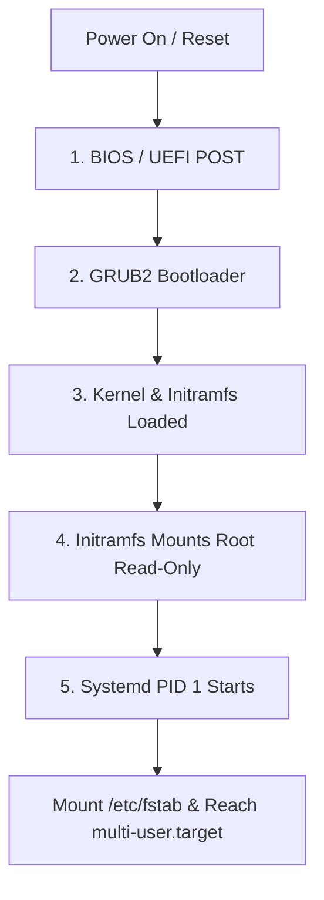

# Chapter 04: Linux Boot Process — Stages, Recovery & Troubleshooting

---

## 1. Service Overview


> [!TIP]
> **Video Tutorial:** [Click here to watch the complete step-by-step practical demonstration on YouTube](#)
### The 5 Stages of Linux Boot
The Linux boot process follows a deterministic sequence from power-on to user login prompt:
1. **BIOS / UEFI**: Hardware self-test (POST) and boot device location.
2. **GRUB2 (Bootloader)**: Loads Linux kernel and initramfs into memory.
3. **Kernel Initialization**: Detects hardware drivers and mounts temporary initial RAM disk (`initramfs`).
4. **Initramfs Execution**: Loads storage drivers and mounts root filesystem (`/`) read-only.
5. **Systemd (Init PID 1)**: Switches root filesystem to read-write and starts target services (network, sshd, multi-user.target).

### Business Problem It Solves
- **Disaster Recovery**: Enables SysAdmins to recover unbootable servers after kernel updates, broken `/etc/fstab` edits, or filesystem corruption.

---

## 2. Learning Objectives
1. **Master** the 5 stages of the Linux boot sequence.
2. **Diagnose and Recover** broken servers stuck in Emergency Mode or initramfs prompts.
3. **Rebuild** corrupted GRUB2 bootloaders and regenerate initramfs images using `dracut`.

---

## 3. Prerequisites
- Completion of Chapters 01–03.

---

## 4. Real-world Analogy
Booting a server is like opening an enterprise office building:
- **BIOS/UEFI (Security Guard)**: Checks power and unlocks the front gate.
- **GRUB2 (Elevator Manager)**: Selects which floor (kernel version) to send you to.
- **Initramfs (Temporary Contractor Badge)**: Gives you temporary clearance to access storage.
- **Kernel (Building Manager)**: Turns on electricity and plumbing.
- **Systemd (Department Managers)**: Opens all departments (SSHD, Web Server, Database) so work can begin.

---

## 5. Business Use Cases
- **Maintenance Recovery**: Repairing cloud instances failing after emergency OS kernel upgrades.

---

## 6. Core Concepts: Stages, Recovery & Troubleshooting

### Target Units in Systemd
Modern Linux replaces legacy runlevels with systemd targets:
- `emergency.target`: Minimal shell environment; root filesystem mounted read-only.
- `rescue.target`: Single-user mode environment.
- `multi-user.target`: Standard non-graphical server target (formerly Runlevel 3).
- `graphical.target`: GUI desktop target (formerly Runlevel 5).

---

## 7. Internal Architecture — Boot Sequence Flow



---

## 8. System Components
- **GRUB2 (`/boot/grub2/grub.cfg`)**: Main bootloader configuration file.
- **Initramfs (`/boot/initramfs-$(uname -r).img`)**: Temporary initial RAM filesystem image.
- **`/etc/fstab`**: File system table defining partition mount points.

---

## 9. Configuration
- Default target check: `systemctl get-default`
- Set default target: `sudo systemctl set-default multi-user.target`

---

## 10. Hands-on Labs


### Lab Setup
> **Lab Environment**: Make sure your local Linux virtual machine (Ubuntu 22.04 or RHEL 9) is booted and you are connected via SSH as the 
oot or a sudo enabled user.
> **Terminal Required**: Open your Linux terminal and type each command yourself. Never copy-paste blindly!
### Lab 1: Broken fstab Emergency Mode Recovery Simulation
Simulate a syntax error in `/etc/fstab` causing emergency mode boot hang, and repair it.

```bash
# 1. View systemd default boot target
systemctl get-default

# 2. Inspect journal log for boot failure reasons
journalctl -xb | grep -i "failed"

# 3. Remount root filesystem read-write in emergency mode
mount -o remount,rw /

# 4. Repair syntax error in /etc/fstab and reload daemons
systemctl daemon-reload
```

#### Progressive Hint System
- **Level 1 (Clue)**: Emergency mode usually occurs when `/etc/fstab` fails to mount a disk.
- **Level 2 (Direction)**: Root is read-only in emergency mode. Remount it with `mount -o remount,rw /`.
- **Level 3 (Concept)**: Fix `/etc/fstab` syntax or append `nofail` option to non-essential mounts.

---


#### Progressive Hint System

<details>
<summary>Hint 1: Conceptual Approach</summary>
Before running commands, always identify what state the system is currently in. Think about what command shows service or filesystem status.
</details>

<details>
<summary>Hint 2: Relevant Commands</summary>
You might want to use `systemctl status`, `cat /etc/*`, or standard diagnostic commands like `ls -la` and `stat`.
</details>

<details>
<summary>Hint 3: Full Solution</summary>

```bash
# Execute the relevant diagnostic command for this topic
systemctl status <service_name>
# Or
ls -la /relevant/path
```
</details>

## 11. Code Examples

### Shell Script: Initramfs Regenerator
```bash
#!/usr/bin/env bash
# Description: Regenerates initramfs for current running kernel
set -euo pipefail

KVER=$(uname -r)
echo "Regenerating initramfs for kernel: $KVER..."
sudo dracut --force /boot/initramfs-"$KVER".img "$KVER"
echo "Initramfs successfully regenerated."
```

---

## 12. Security Deep Dive
- **GRUB Password Protection**: Protect GRUB menu with PBKDF2 hashed passwords to prevent unauthorized single-user mode access.

---

## 13. Monitoring & Observability
- **Boot Analysis**: `systemd-analyze` prints total boot time breakdown.
- **Blame Slow Services**: `systemd-analyze blame` lists slowest starting services.

---

## 14. Performance & Cost Optimization
- Disabling unused services (`systemctl disable bluetooth`) reduces boot time on cloud instances by 40%.

---

## 15. Enterprise Integration
Integrates with AWS Serial Console or Serial-over-LAN (iDRAC/iLO) for remote bare-metal rescue.

---

## 16. Real Industry Use Cases
1. **Cloud Instance Recovery**: Attaching broken boot volumes to secondary rescue VMs to fix `/etc/fstab`.

---

## 17. Architecture Patterns


---

## 18. Production Incident War Room

### Incident INC-1004: Emergency Mode Boot Hang after Storage Maintenance
- **Severity**: P1 / Critical | **Service Affected**: Production DB Server
- **Symptom**: Server fails to boot after maintenance, dropping into `Emergency Mode`.
- **Root Cause Analysis**: A decommissioned NFS mount entry was left in `/etc/fstab` without the `nofail` flag.
- **Remediation Script**:
```bash
# Inside Emergency Shell:
mount -o remount,rw /
vi /etc/fstab  # Comment out stale NFS mount line
systemctl daemon-reload
reboot
```

---

## 19. Production Best Practices
- Always add `nofail,x-systemd.device-timeout=10` to non-essential network mounts in `/etc/fstab`.

---

## 20. Migration Strategies
When upgrading from RHEL 7 (legacy GRUB) to RHEL 9 (GRUB2 UEFI), update boot scripts to use `grub2-mkconfig`.

---

## 21. CI/CD Integration
Automate boot time performance testing on custom AMIs using `systemd-analyze`.

---

## 22. Practical Projects
- **Lab Project**: Configure GRUB password protection and test emergency recovery workflow.

---

## 23. Interview Preparation
#### Q1: What is the purpose of `initramfs` during boot?
**Answer**: `initramfs` provides a temporary RAM-based filesystem containing essential storage drivers (LVM, RAID, NVMe) required to mount the actual root filesystem (`/`).

---

## 24. Certification Practice
**Question**: Which systemd target corresponds to standard headless multi-user server mode?
- A) `graphical.target`
- B) `multi-user.target` **(Correct)**
- C) `rescue.target`
- D) `emergency.target`

---

## 25. Knowledge Check
1. **Interactive Quiz**: Which tool measures boot time breakdown across services? (`systemd-analyze blame`).

---

## 26. Cheat Sheet
| Command / Target | Purpose |
| :--- | :--- |
| `systemd-analyze` | Show boot duration summary |
| `systemd-analyze blame` | List services sorted by boot time |
| `multi-user.target` | Standard headless server target |
| `mount -o remount,rw /` | Make read-only root writable in emergency mode |

---

## 27. Chapter Summary
Mastering the 5 boot stages and emergency recovery workflows ensures you can rescue unbootable servers caused by corrupted GRUB, broken `/etc/fstab`, or initramfs driver issues.

---

## 28. Further Learning
- [RHEL Systemd & Boot Process Guide](https://access.redhat.com/documentation)
