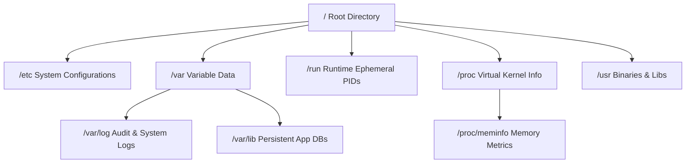
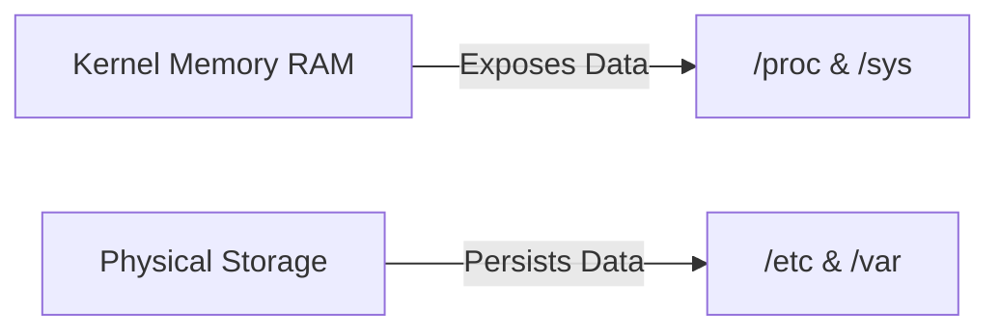

# Chapter 05: Filesystem Hierarchy Standard — The Linux Server Map

---

## 1. Service Overview


> [!TIP]
> **Video Tutorial:** [Click here to watch the complete step-by-step practical demonstration on YouTube](#)
### The Filesystem Hierarchy Standard (FHS)
Linux organizes all directories under a single unified root directory (`/`). The Filesystem Hierarchy Standard (FHS) defines the exact purpose and contents of primary directories to ensure software portability and operational predictability across distributions.

### Primary Directories — The Linux Server Map
- `/etc`: System configuration files (plain text configuration center).
- `/var`: Variable data (logs in `/var/log`, databases in `/var/lib`, spools in `/var/spool`).
- `/run`: Ephemeral runtime state data (PIDs, lock files, Unix sockets).
- `/proc` & `/sys`: Virtual pseudo-filesystems exposing kernel parameters and hardware devices.
- `/usr`: Read-only user binaries and documentation (`/usr/bin`, `/usr/sbin`).

### Business Problem It Solves
- **Rapid Troubleshooting**: Enables SysAdmins to instantly locate logs (`/var/log`), configs (`/etc`), and locks (`/run`) during live production outages without searching blindly.

---

## 2. Learning Objectives
1. **Navigate** the Linux directory layout according to FHS specifications.
2. **Execute** "Where Would You Look?" diagnostic investigations for SSH failures, full disks, and service locks.
3. **Analyze** virtual filesystems (`/proc`, `/sys`) to inspect hardware and kernel parameters.

---

## 3. Prerequisites
- Completion of Chapters 01–04.

---

## 4. Real-world Analogy
Think of the Linux Filesystem as an enterprise office building:
- `/` (Building Entrance): The single main lobby leading to every department.
- `/etc` (Electrical & Blueprint Room): Contains building wiring diagrams and configuration settings.
- `/var` (Filing Cabinets & Mailroom): Stores daily incoming mail, audit logs, and dynamic records.
- `/run` (Security Sign-in Desk): Tracks who is currently inside the building (active PID lock files).
- `/proc` (Building Control Sensor Panel): Displays real-time elevator speed and room temperatures.

---

## 5. Business Use Cases — "Where Would You Look?" Matrix

| Incident / Task | Target Directory | File Path / Log |
| :--- | :--- | :--- |
| **SSH Login Failure** | `/var/log` & `/etc/ssh` | `/var/log/secure` & `/etc/ssh/sshd_config` |
| **Disk Full Emergency** | `/var` | `/var/log` or `/var/lib/mysql` |
| **Service Restart Blocked** | `/run` | `/run/nginx.pid` or `/run/lock` |
| **CPU / RAM Audit** | `/proc` | `/proc/cpuinfo` & `/proc/meminfo` |

---

## 6. Core Concepts: The Linux Server Map

### Pseudo Filesystems (`/proc` and `/sys`)
`/proc` and `/sys` do not occupy physical hard drive space. They are virtual filesystems generated dynamically by the Linux Kernel in RAM to expose internal kernel parameters.

---

## 7. Internal Architecture — FHS Directory Tree



---

## 8. System Components
- `/etc/sysctl.conf`: Kernel parameter configuration.
- `/var/log/messages` or `/var/log/syslog`: System audit logs.
- `/run/lock`: Subsystem locking directory preventing duplicate executions.

---

## 9. Configuration
Primary system configuration files:
- Network: `/etc/sysconfig/network-scripts/` or `/etc/netplan/`
- Storage: `/etc/fstab`

---


### Log Naming Differences
> **Note:** RHEL-based systems typically log to `/var/log/messages` and `/var/log/secure`, whereas Debian/Ubuntu systems log to `/var/log/syslog` and `/var/log/auth.log`.

## 10. Hands-on Labs


### Lab Setup
> **Lab Environment**: Make sure your local Linux virtual machine (Ubuntu 22.04 or RHEL 9) is booted and you are connected via SSH as the 
oot or a sudo enabled user.
> **Terminal Required**: Open your Linux terminal and type each command yourself. Never copy-paste blindly!
### Lab 1: "Where Would You Look?" Diagnostic Triage
Investigate real system parameters using FHS locations.

```bash
# 1. Inspect CPU specifications via /proc
cat /proc/cpuinfo | grep "model name" | head -n 1

# 2. Inspect available RAM via /proc
cat /proc/meminfo | head -n 5

# 3. Inspect active service PID locks in /run
ls -la /run/*.pid 2>/dev/null || ls -la /var/run/*.pid
```

#### Progressive Hint System
- **Level 1 (Clue)**: Hardware specs are in `/proc`; system logs are in `/var/log`.
- **Level 2 (Direction)**: Read `/proc/cpuinfo` for CPU specs and `/proc/meminfo` for memory specs.
- **Level 3 (Concept)**: `/proc` contains kernel runtime metrics; `/etc` contains plain text configs.

---


#### Progressive Hint System

<details>
<summary>Hint 1: Conceptual Approach</summary>
Before running commands, always identify what state the system is currently in. Think about what command shows service or filesystem status.
</details>

<details>
<summary>Hint 2: Relevant Commands</summary>
You might want to use `systemctl status`, `cat /etc/*`, or standard diagnostic commands like `ls -la` and `stat`.
</details>

<details>
<summary>Hint 3: Full Solution</summary>

```bash
# Execute the relevant diagnostic command for this topic
systemctl status <service_name>
# Or
ls -la /relevant/path
```
</details>

## 11. Code Examples

### Shell Script: FHS Health Checker
```bash
#!/usr/bin/env bash
# Description: Verifies essential FHS directory health and space
set -euo pipefail

echo "=== FHS Directory Usage Summary ==="
df -h / /var /tmp /etc
echo ""
echo "=== Top Log Files in /var/log ==="
du -ah /var/log | sort -rh | head -n 5
```

---

## 12. Security Deep Dive
- `/etc/shadow`: Contains encrypted user password hashes, restricted strictly to `root` (`000` or `400` permissions).

---

## 13. Monitoring & Observability
- Monitor disk usage across `/var/log` partitions to prevent log exhaustion outages.

---

## 14. Performance & Cost Optimization
- Mounting `/tmp` and `/run` as `tmpfs` (RAM disks) accelerates temporary file I/O and reduces SSD write wear.

---

## 15. Enterprise Integration
Centralized logging daemons (Rsyslog, Fluentd) collect logs from `/var/log` and ship them to Elasticsearch or AWS CloudWatch.

---

## 16. Real Industry Use Cases
1. **Security Audit**: Scanning `/etc/passwd` and `/etc/sudoers` for unauthorized privilege escalation.

---

## 17. Architecture Patterns



---

## 18. Production Incident War Room

### Incident INC-1005: Stale PID Lock File Blocking Daemon Restart
- **Severity**: P2 / High | **Service Affected**: Web Daemon (`httpd`)
- **Symptom**: `systemctl start httpd` fails stating service is already running, but `ps aux` shows no active process.
- **Root Cause Analysis**: Server crashed dirty, leaving a stale PID lock file behind at `/run/httpd/httpd.pid`.
- **Remediation Script**:
```bash
# 1. Verify no process is using the PID
cat /run/httpd/httpd.pid | xargs ps -p

# 2. Remove stale PID lock file and restart service
sudo rm -f /run/httpd/httpd.pid
sudo systemctl start httpd
```

---

## 19. Production Best Practices
- Never store application user data in `/etc` or binaries in `/root`. Follow FHS standards.

---

## 20. Migration Strategies
When packaging custom software, place binaries in `/usr/local/bin` and configs in `/etc/opt/`.

---

## 21. CI/CD Integration
Validate FHS path compliance in deployment scripts using `shellcheck`.

---

## 22. Practical Projects
- **Lab Project**: Write a script that checks permissions on critical FHS files (`/etc/shadow`, `/etc/passwd`).

---

## 23. Interview Preparation
#### Q1: What is the difference between `/etc`, `/var`, and `/run`?
**Answer**: `/etc` contains static plain-text system configuration files. `/var` contains dynamic persistent variable data like logs and databases. `/run` contains ephemeral runtime data (PIDs, sockets) valid only for the current boot session.

---

## 24. Certification Practice
**Question**: Which directory contains virtual files exposing real-time kernel and CPU parameters?
- A) `/etc`
- B) `/var`
- C) `/proc` **(Correct)**
- D) `/opt`

---

## 25. Knowledge Check
1. **Interactive Quiz**: Where are standard system log files located in FHS? (`/var/log`).

---

## 26. Cheat Sheet
| Path | Purpose | Key Files |
| :--- | :--- | :--- |
| `/etc` | Plain text configs | `fstab`, `hosts`, `passwd` |
| `/var` | Variable data & logs | `/var/log/messages` |
| `/run` | Runtime PID locks | `/run/nginx.pid` |
| `/proc` | Pseudo kernel metrics | `/proc/cpuinfo` |

---

## 27. Chapter Summary
The FHS provides a standardized map of Linux. Knowing that `/etc` holds configs, `/var` holds logs/data, and `/run` holds process PIDs enables rapid enterprise troubleshooting.

---

## 28. Further Learning
- [Filesystem Hierarchy Standard Specification](https://refspecs.linuxfoundation.org/FHS_3.0/fhs-3.0.html)
