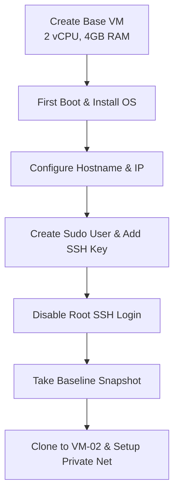
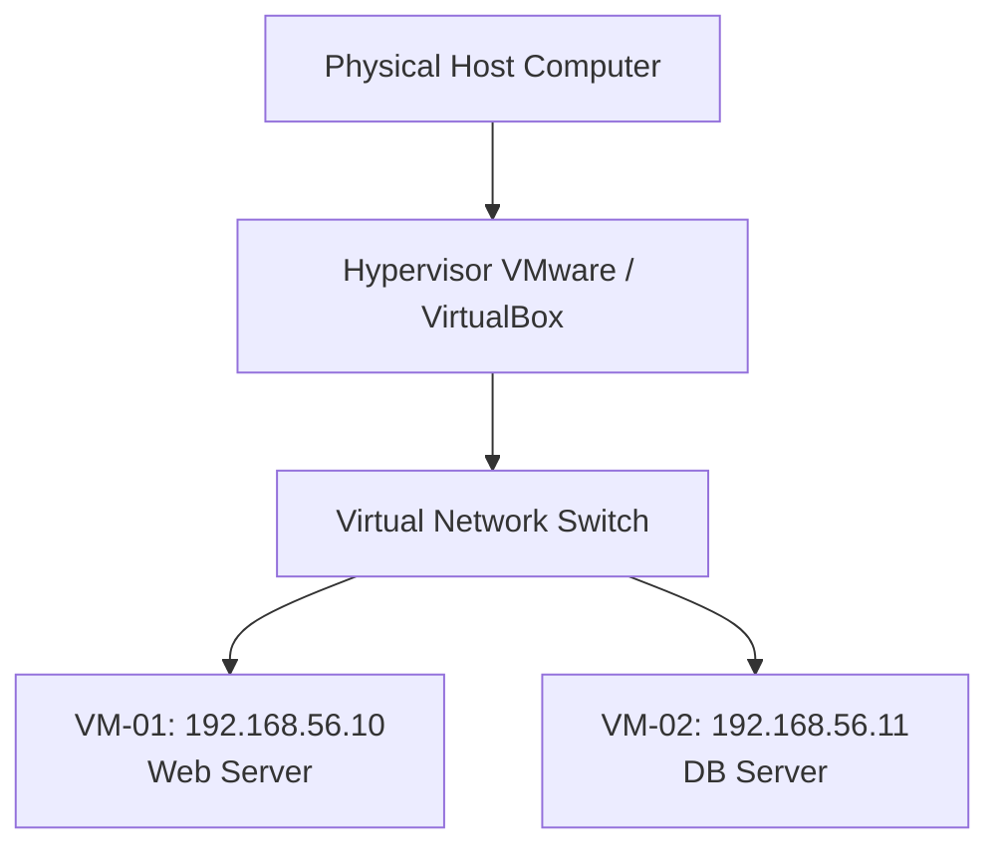

# Chapter 06: Installing Linux & Building Your Enterprise Lab

---

## 1. Service Overview

### Building Your Own Linux Lab

> [!TIP]
> **Video Tutorial:** [Click here to watch the complete step-by-step installation guide on YouTube](#)

Establishing a robust local virtual laboratory is the foundation for mastering enterprise Linux. By using type-2 hypervisors (VMware Workstation Pro / Player or Oracle VM VirtualBox), administrators can build isolated, multi-node networks mirroring production environments without incurring cloud costs. The ultimate goal is not merely running an installer wizard, but establishing a manageable multi-VM enterprise lab environment with SSH remote access, custom networking, sudo users, and snapshot rollbacks.

### Key Workflows Covered
- Hypervisor Installation & VM Specs Allocation (2 vCPU, 4GB RAM, 20GB Disk).
- First Login & Network Configuration.
- Creating Administrative Sudo Users & Disabling Direct Root SSH Login.
- SSH Public Key Authentication Setup.
- Multi-VM Private Networking & VM Snapshot Baselines.

### Business Problem It Solves
- **Safe Sandboxing**: Enables engineers to test destructive changes, kernel patches, and complex network configurations in isolated VM environments without risking production outages.

---

## 2. Learning Objectives
1. **Provision** a Linux virtual machine on VMware/VirtualBox with proper resource allocations.
2. **Configure** static IP networking, hostname, and SSH key-based authentication.
3. **Establish** a multi-VM lab environment (VM-01 and VM-02) with private network communication.
4. **Manage** VM snapshots to create instant recovery points before testing configuration changes.

---

## 3. Prerequisites
- Completion of Chapters 01–05.

---

## 4. Real-world Analogy
Building a Linux virtual lab is like building a miniature corporate branch office on your desk:
- **Hypervisor (VirtualBox/VMware)**: The office building providing space and power.
- **VM-01 (Main Server)**: The primary application server in the office.
- **VM-02 (Backup Server)**: The secondary server connected via an internal hallway (Private Virtual Network).
- **VM Snapshot**: Taking a high-resolution photo of the server state before maintenance. If something breaks, you instantly restore the server back to the photo.

---

## 5. Business Use Cases — Enterprise Lab Workflow



---

## 6. Core Concepts: Core Theory

### Virtual Networking Modes
- **NAT (Network Address Translation)**: VM shares host IP to access the internet; host cannot SSH directly into VM unless port forwarding is configured.
- **Bridged Networking**: VM receives a dedicated IP address directly on your physical home/office local network.
- **Host-Only / Private Network**: Isolated network between host and VMs or between multiple VMs; no external internet access.

---

## 7. Internal Architecture



---

## 8. System Components
- **`sshd_config` (`/etc/ssh/sshd_config`)**: Configuration governing SSH remote access security.
- **`/etc/sudoers` & `/etc/sudoers.d/`**: Defines administrative privilege escalation rules.
- **NetworkManager (`nmcli` / `nmtui`)**: Controls network interfaces and static IP assignments.

---

## 9. Configuration
Primary SSH and Network files:
- `/etc/ssh/sshd_config`
- `/etc/hostname`

---


### Hardware Compatibility
> **Note:** Modern Apple Silicon (M1/M2/M3) and other ARM-based systems cannot natively run x86_64 VMs without emulation. Ensure you download ARM-compatible ISOs if you are on Apple Silicon.

## 10. Hands-on Labs


### Lab Setup
> **Lab Environment**: Make sure your local Linux virtual machine (Ubuntu 22.04 or RHEL 9) is booted and you are connected via SSH as the 
oot or a sudo enabled user.
> **Terminal Required**: Open your Linux terminal and type each command yourself. Never copy-paste blindly!
### Lab 1: Multi-VM Private Network & SSH Key Exchange Lab
Set up SSH key authentication between VM-01 (`192.168.56.10`) and VM-02 (`192.168.56.11`).

```bash
# 1. On VM-01: Generate SSH Key pair
ssh-keygen -t ed25519 -C "admin@vm01" -N "" -f ~/.ssh/id_ed25519

# 2. Copy public key to VM-02
ssh-copy-id -i ~/.ssh/id_ed25519.pub sysadmin@192.168.56.11

# 3. Verify passwordless SSH login from VM-01 to VM-02
ssh sysadmin@192.168.56.11 "hostname && ip a"
```

#### Progressive Hint System
- **Level 1 (Clue)**: Generate keys with `ssh-keygen` and transfer them using `ssh-copy-id`.
- **Level 2 (Direction)**: `-t ed25519` specifies modern elliptic curve keys; `ssh-copy-id user@ip` installs public key in target `~/.ssh/authorized_keys`.
- **Level 3 (Concept)**: Public key authenticates user without transmitting raw passwords over the network.

---


#### Progressive Hint System

<details>
<summary>Hint 1: Conceptual Approach</summary>
Before running commands, always identify what state the system is currently in. Think about what command shows service or filesystem status.
</details>

<details>
<summary>Hint 2: Relevant Commands</summary>
You might want to use `systemctl status`, `cat /etc/*`, or standard diagnostic commands like `ls -la` and `stat`.
</details>

<details>
<summary>Hint 3: Full Solution</summary>

```bash
# Execute the relevant diagnostic command for this topic
systemctl status <service_name>
# Or
ls -la /relevant/path
```
</details>

## 11. Code Examples

### Shell Script: Automated Server Hardening Baseline
```bash
#!/usr/bin/env bash
# Description: Hardens new VM after initial login
set -euo pipefail

echo "=== Hardening Server Access ==="
sudo hostnamectl set-hostname "srv-lab-01"

# Create administrative user if not exists
if ! id "sysadmin" &>/dev/null; then
    sudo useradd -m -s /bin/bash -G wheel sysadmin
    echo "sysadmin created and added to wheel group."
fi

# Disable Root SSH Login
sudo sed -i 's/^#\?PermitRootLogin.*/PermitRootLogin no/' /etc/ssh/sshd_config
sudo systemctl reload sshd || sudo systemctl reload ssh
echo "Root SSH login disabled successfully."
```

---

## 12. Security Deep Dive
- **Disabling Root SSH Login**: Setting `PermitRootLogin no` forces all administrators to log in using individual user accounts, ensuring full audit accountability.

---

## 13. Monitoring & Observability
- **Virtual Network Connectivity**: Verified via `ping -c 4 192.168.56.11` and `nc -zv 192.168.56.11 22`.

---

## 14. Performance & Cost Optimization
- Allocate 2 vCPU / 2GB RAM for headless Linux VMs; unnecessary GUI desktop environments waste 1.5GB RAM.

---

## 15. Enterprise Integration
Integrates with Vagrant or Terraform VirtualBox/VMware providers for automated local lab provisioning.

---

## 16. Real Industry Use Cases
1. **Staging Environment**: Running a 2-node VM staging cluster matching cloud production topology.

---

## 17. Architecture Patterns


---

## 18. Production Incident War Room

### Incident INC-1006: Virtual Network Adapter Misconfiguration & Duplicate IP
- **Severity**: P2 / High | **Service Affected**: Virtual Lab Network
- **Symptom**: VM-02 loses network connectivity immediately after cloning VM-01.
- **Root Cause Analysis**: Cloning copied the exact static IP address and MAC address of VM-01, causing an IP and MAC collision.
- **Remediation Script**:
```bash
# 1. Regenerate MAC address in Hypervisor VM settings
# 2. Update hostname and network interface configuration on VM-02
sudo hostnamectl set-hostname srv-lab-02
sudo nmcli connection modify eth0 ipv4.addresses "192.168.56.11/24"
sudo nmcli connection up eth0
```

---

## 19. Production Best Practices
- Always take a VM snapshot prior to updating system packages or editing core configurations.

---

## 20. Migration Strategies
Export local VirtualBox/VMware images as standard `.OVA` / `.OVF` packages for deployment into enterprise vSphere.

---

## 21. CI/CD Integration
Use Packer to build automated, pre-hardened VM templates.

---

## 22. Practical Projects
- **Lab Project**: Build a 2-node lab with VM-01 as Nginx load balancer and VM-02 as backend web app.

---

## 23. Interview Preparation
#### Q1: Why is it important to disable direct Root SSH login on a production server?
**Answer**: Disabling direct root SSH forces engineers to log in with personalized accounts (e.g. `john.doe`), creating an immutable audit trail in `/var/log/secure` showing who accessed the server before escalating via `sudo`.

---

## 24. Certification Practice
**Question**: Which SSH directive in `/etc/ssh/sshd_config` disables direct administrative root logins?
- A) `AllowRootLogin off`
- B) `PermitRootLogin no` **(Correct)**
- C) `DisableRootSSH true`
- D) `RootAccess false`

---

## 25. Knowledge Check
1. **Interactive Quiz**: Which tool transfers your public SSH key to a remote server? (`ssh-copy-id`).

---

## 26. Cheat Sheet
| Task | Command |
| :--- | :--- |
| Generate SSH Key | `ssh-keygen -t ed25519` |
| Copy Public Key | `ssh-copy-id user@192.168.56.11` |
| Reload SSH Service | `sudo systemctl reload sshd` |
| Set Hostname | `sudo hostnamectl set-hostname srv-node` |

---

## 27. Chapter Summary
Building a lab involves VM creation, static network configuration, administrative sudo user creation, SSH key exchange, and snapshot baseline creation.

---

## 28. Further Learning
- [OpenSSH Official Security Guidelines](https://www.openssh.com)
