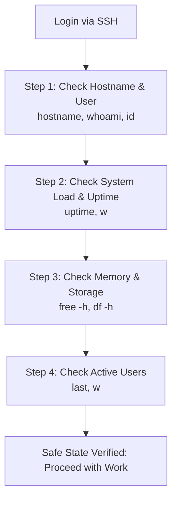
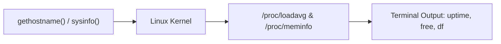
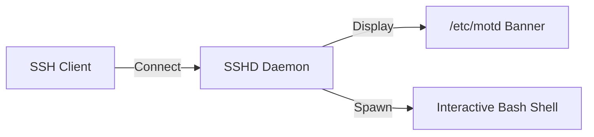

# Chapter 07: First Login & Terminal Basics — First 60 Seconds Workflow

---

## 1. Service Overview


> [!TIP]
> **Video Tutorial:** [Click here to watch the complete step-by-step practical demonstration on YouTube](#)
### The "First 60 Seconds on a Server" Triage Workflow
When a System Administrator logs into a production server for the first time—especially during an active incident—there is a standard professional workflow to assess health, identity, active users, and system resource availability before making any changes.

### The 4 Pillars of Server Triage
1. **Identity**: Who am I? What host is this? (`hostname`, `whoami`, `id`, `sudo -l`).
2. **System Health**: Is the system under heavy load? (`uptime`, `top`, `w`).
3. **Resource Availability**: Is memory or disk exhausted? (`free -h`, `df -h`).
4. **Active Sessions**: Who else is logged in? (`w`, `who`, `last`).

### Business Problem It Solves
- **Accidental Outage Prevention**: Prevents engineers from rebooting or executing commands on the WRONG host (e.g., mistaking `prod-db-01` for `test-db-01`).

---

## 2. Learning Objectives
1. **Execute** the "First 60 Seconds on a Server" triage workflow.
2. **Audit** host identity, active user sessions, memory utilization, and disk availability.
3. **Verify** administrative privilege boundaries using `id` and `sudo -l`.

---

## 3. Prerequisites
- Completion of Chapters 01–06.

---

## 4. Real-world Analogy
First login on a production server is like an ER doctor stepping into a trauma room:
- Before performing surgery (editing configs or restarting services), you check vital signs: Heart rate (`uptime`/load average), Blood pressure (`free -h` memory), Oxygen level (`df -h` disk space), and Patient ID (`hostname`).

---

## 5. Business Use Cases — Triage Checklist



---

## 6. Core Concepts: First 60 Seconds Workflow

### Understanding Uptime & Load Averages
The `uptime` command outputs three numbers representing average process load over **1 minute, 5 minutes, and 15 minutes**:
- Load Average `1.00` on a **1-CPU** server means 100% capacity.
- Load Average `4.00` on a **4-CPU** server means 100% capacity.
- Load Average higher than total CPU cores indicates CPU/IO queue congestion.

---

## 7. Internal Architecture



---

## 8. System Components
- `/proc/loadavg`: Kernel source for system load metrics.
- `/var/run/utmp` & `/var/log/wtmp`: Tracks currently logged-in users and historical login logs.

---

## 9. Configuration
Customizing the first login banner (Message of the Day):
- `/etc/motd`: Static login message displayed upon SSH connection.
- `/etc/issue`: Pre-login banner displayed before authentication.

---


### Accessing Remote Servers via SSH
```bash
ssh user@192.168.1.100
```
*(Note: 192.168.1.100 is an example IP address. Replace it with your server's actual IP.)*

## 10. Hands-on Labs


### Lab Setup
> **Lab Environment**: Make sure your local Linux virtual machine (Ubuntu 22.04 or RHEL 9) is booted and you are connected via SSH as the 
oot or a sudo enabled user.
> **Terminal Required**: Open your Linux terminal and type each command yourself. Never copy-paste blindly!
### Lab 1: First 60 Seconds Server Triage Audit
Execute the standard 4-pillar triage sequence.

```bash
# 1. Pillar 1: Verify Host & User Identity
hostname && whoami && id

# 2. Pillar 2: Audit System Uptime & Load Averages
uptime

# 3. Pillar 3: Audit Free RAM and Disk Space
free -h && df -h /

# 4. Pillar 4: Audit Active Users
w
```

#### Progressive Hint System
- **Level 1 (Clue)**: Use `hostname` for host ID, `uptime` for load, `free` for RAM, `df` for disk.
- **Level 2 (Direction)**: Add `-h` flag to `free` and `df` for human-readable gigabyte/megabyte formatting.
- **Level 3 (Concept)**: `w` shows logged-in users and their currently running processes simultaneously.

---


#### Progressive Hint System

<details>
<summary>Hint 1: Conceptual Approach</summary>
Before running commands, always identify what state the system is currently in. Think about what command shows service or filesystem status.
</details>

<details>
<summary>Hint 2: Relevant Commands</summary>
You might want to use `systemctl status`, `cat /etc/*`, or standard diagnostic commands like `ls -la` and `stat`.
</details>

<details>
<summary>Hint 3: Full Solution</summary>

```bash
# Execute the relevant diagnostic command for this topic
systemctl status <service_name>
# Or
ls -la /relevant/path
```
</details>

## 11. Code Examples

### Shell Script: 60-Second Server Health Assessor
```bash
#!/usr/bin/env bash
# Description: Automated First 60 Seconds Health Triage Report
set -euo pipefail

echo "=========================================="
echo "    FIRST 60 SECONDS SERVER HEALTH REPORT "
echo "=========================================="
echo "Host:        $(hostname)"
echo "User:        $(whoami) (UID: $(id -u))"
echo "Uptime/Load: $(uptime | awk -F'load average:' '{ print $2 }')"
echo "Memory Free: $(free -h | awk '/Mem:/ { print $4 " available out of " $2 }')"
echo "Disk Free:   $(df -h / | awk 'NR==2 { print $4 " available (" $5 " used)" }')"
echo "Active Users:$(w -h | wc -l) session(s)"
echo "=========================================="
```

---

## 12. Security Deep Dive
- Inspect `sudo -l` immediately upon login to verify which commands your account is explicitly authorized to execute with root privileges.

---

## 13. Monitoring & Observability
- Historical login audits are retrieved via `last -n 10` or `journalctl -u sshd`.

---

## 14. Performance & Cost Optimization
- Running quick health scripts upon SSH login detects runaway processes before executing heavy administrative operations.

---

## 15. Enterprise Integration
Integrates with PAM (Pluggable Authentication Modules) to display automated MOTD dynamic system metrics upon login.

---

## 16. Real Industry Use Cases
1. **Incident Response**: Performing immediate host verification during P1 outages to confirm server role.

---

## 17. Architecture Patterns



---

## 18. Production Incident War Room

### Incident INC-1007: Unauthorized Active SSH Session Detected
- **Severity**: P1 / Critical | **Service Affected**: Production Bastion Host
- **Symptom**: Security alert triggers indicating an unknown IP `198.51.100.55` is logged in as `admin`.
- **Root Cause Analysis**: Compromised credentials used to initiate unauthorized session.
- **Remediation Script**:
```bash
# 1. Identify unauthorized user session TTY and PID
w

# 2. Terminate the unauthorized session forcibly
sudo pkill -kill -t pts/1

# 3. Lock compromised account password immediately
sudo usermod -L admin
```

---

## 19. Production Best Practices
- ALWAYS double-check `hostname` before executing destructive commands like `rm`, `systemctl stop`, or `reboot`.

---

## 20. Migration Strategies
Standardize MOTD scripts across multi-cloud infrastructure to display environment badges (`PROD`, `STAGING`, `DEV`).

---

## 21. CI/CD Integration
Automate host health verification checks prior to triggering deployment agents.

---

## 22. Practical Projects
- **Lab Project**: Write a custom MOTD script displaying CPU load, memory usage, and pending security updates upon SSH login.

---

## 23. Interview Preparation
#### Q1: How do you interpret a 1-minute load average of `4.50` on a 2-CPU server versus an 8-CPU server?
**Answer**: On a 2-CPU server, a load average of `4.50` means the system is severely overloaded (225% capacity), with processes queued waiting for CPU. On an 8-CPU server, `4.50` means the system is operating comfortably at 56% CPU capacity.

---

## 24. Certification Practice
**Question**: Which command displays logged-in users along with their current running processes and system load averages?
- A) `who`
- B) `w` **(Correct)**
- C) `last`
- D) `id`

---

## 25. Knowledge Check
1. **Interactive Quiz**: Which flag makes `df` and `free` display values in MB/GB instead of raw bytes? (`-h`).

---

## 26. Cheat Sheet
| Command | Purpose |
| :--- | :--- |
| `hostname` | Show host identity |
| `uptime` | Show uptime and 1/5/15 min load average |
| `free -h` | Show total, used, and available RAM |
| `df -h /` | Show disk partition capacity |
| `w` | Show active users and running tasks |
| `sudo -l` | List permitted sudo commands |

---

## 27. Chapter Summary
Performing the 4-pillar triage (`hostname`, `uptime`, `free -h`, `w`) during your first 60 seconds on a server ensures complete situational awareness before executing changes.

---

## 28. Further Learning
- [Linux SysAdmin Triage Best Practices](https://wiki.linuxfoundation.org)
