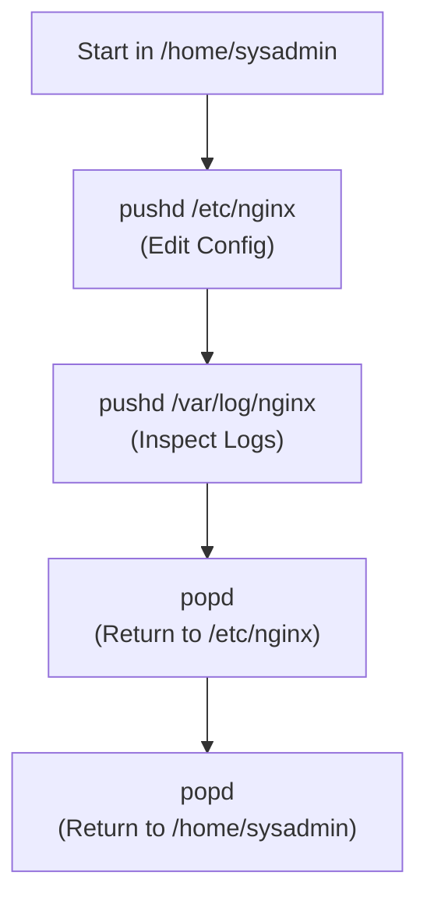
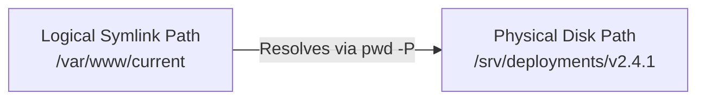

# Chapter 08: Navigating the Linux Filesystem — Speed & Accuracy Drills

---

## 1. Service Overview


> [!TIP]
> **Video Tutorial:** [Click here to watch the complete step-by-step practical demonstration on YouTube](#)
### Navigation Mastery for System Administrators
Efficient terminal navigation is not about memorizing commands—it is about speed, precision, and error-free path manipulation. This chapter focuses on relative vs. absolute paths, rapid directory switching (`cd -`, `pushd`, `popd`), resolving physical paths (`pwd -P`), and completing maze-style navigation challenges without getting lost.

### Key Navigation Tools
- `cd -`: Toggles back to the previous working directory instantly.
- `pushd /path` & `popd`: Manages a directory stack for multi-location tasks.
- `pwd -P`: Resolves physical filesystem paths, stripping out symbolic links.
- Tab Autocompletion: Eliminates path typing mistakes.

### Business Problem It Solves
- **Operational Speed**: Enables SysAdmins to navigate complex multi-nested log and configuration directories 5x faster during emergency incident response.

---

## 2. Learning Objectives
1. **Differentiate** between absolute paths (`/var/log`) and relative paths (`../log`).
2. **Execute** rapid directory switching using `cd -`, `pushd`, and `popd`.
3. **Resolve** symbolic links to verify physical paths using `pwd -P`.
4. **Complete** time-trial navigation challenges without path errors.

---

## 3. Prerequisites
- Completion of Chapters 01–07.

---

## 4. Real-world Analogy
Terminal navigation is like driving using a GPS:
- **Absolute Path (`/etc/ssh/sshd_config`)**: Full address including state, city, street, and house number. Works from anywhere in the world.
- **Relative Path (`../ssh/sshd_config`)**: Directions relative to your current location ("Turn left at the next intersection").
- `cd -` (Back Button): Pressing the recall button on your TV remote to flip back to the previous channel.
- `pushd` / `popd` (Breadcrumb Trail): Leaving a trail of breadcrumbs so you can instantly return to your starting point.

---

## 5. Business Use Cases — Navigation Drills



---

## 6. Core Concepts: Speed & Accuracy Drills

### Absolute vs Relative Paths
- **Absolute Path**: Starts with a leading slash `/` and references the location relative to the root directory. Example: `/var/log/nginx/access.log`.
- **Relative Path**: Does NOT start with `/`. References location relative to the current working directory. Example: `../../log/nginx`.

---

## 7. Internal Architecture



---

## 8. System Components
- `OLDPWD`: Environment variable storing the previous directory path used by `cd -`.
- `DIRSTACK`: Internal shell array storing directories managed by `pushd` and `popd`.

---

## 9. Configuration
- Customizing shell prompt `PS1` to show full path (`\w`) vs short basename (`\W`).

---


### Advanced Navigation Shortcuts
- `pushd /path`: Saves current directory to a stack and changes to `/path`.
- `popd`: Returns to the directory saved by `pushd`.
- `cd`: Without any arguments, `cd` always returns you to your home directory.

### Helpful Aliases
> **Note:** Many distributions automatically alias `ls` to include colors for better readability: `alias ls='ls --color=auto'`.

## 10. Hands-on Labs


### Lab Setup
> **Lab Environment**: Make sure your local Linux virtual machine (Ubuntu 22.04 or RHEL 9) is booted and you are connected via SSH as the 
oot or a sudo enabled user.
> **Terminal Required**: Open your Linux terminal and type each command yourself. Never copy-paste blindly!
### Lab 1: Maze-Style Navigation Speed Challenge
Execute directory switching drills without path errors.

```bash
# 1. Navigate to /etc/ssh
cd /etc/ssh

# 2. Jump to /var/log using pushd
pushd /var/log

# 3. Toggle back to /etc/ssh using cd -
cd -

# 4. Return to previous directory using popd
popd

# 5. Resolve physical path of /var/run (which is a symlink to /run)
cd /var/run && pwd -P
```

#### Progressive Hint System
- **Level 1 (Clue)**: Use `cd -` to flip back to previous location; use `pushd` to stack locations.
- **Level 2 (Direction)**: `pwd -P` displays the real physical path ignoring symbolic links.
- **Level 3 (Concept)**: `pushd` adds a directory to the top of the stack; `popd` removes it and returns you there.

---


#### Progressive Hint System

<details>
<summary>Hint 1: Conceptual Approach</summary>
Before running commands, always identify what state the system is currently in. Think about what command shows service or filesystem status.
</details>

<details>
<summary>Hint 2: Relevant Commands</summary>
You might want to use `systemctl status`, `cat /etc/*`, or standard diagnostic commands like `ls -la` and `stat`.
</details>

<details>
<summary>Hint 3: Full Solution</summary>

```bash
# Execute the relevant diagnostic command for this topic
systemctl status <service_name>
# Or
ls -la /relevant/path
```
</details>

## 11. Code Examples

### Shell Script: Navigation Stack Tester
```bash
#!/usr/bin/env bash
# Description: Demonstrates directory stack navigation
set -euo pipefail

echo "Current Directory: $(pwd)"
pushd /etc >/dev/null
echo "Pushed /etc: $(pwd)"
pushd /var/log >/dev/null
echo "Pushed /var/log: $(pwd)"

echo "Popping stack..."
popd >/dev/null
echo "After 1st pop: $(pwd)"
popd >/dev/null
echo "Back to start: $(pwd)"
```

---

## 12. Security Deep Dive
- Always verify physical path (`pwd -P`) before executing wildcard deletions (`rm -rf *`) in directories reached via symbolic links.

---

## 13. Monitoring & Observability
- Verify current shell working directory using `ls -ld .` or `pwd`.

---

## 14. Performance & Cost Optimization
- Using Tab autocompletion prevents typos that cause failed command execution cycles.

---

## 15. Enterprise Integration
Integrates into automated deployment scripts to navigate release directories safely.

---

## 16. Real Industry Use Cases
1. **Deployment Rollbacks**: Navigating between release symlinks (`/var/www/current` -> `/var/www/releases/2026-07-20`).

---

## 17. Architecture Patterns


---

## 18. Production Incident War Room

### Incident INC-1008: Symlink Recursion Loop in Automated Audit Script
- **Severity**: P2 / High | **Service Affected**: Audit Logging Agent
- **Symptom**: File crawler script hangs infinitely consuming 100% CPU.
- **Root Cause Analysis**: A circular symbolic link was created inside a subdirectory pointing back to its parent directory (`link -> ..`).
- **Remediation Script**:
```bash
# Detect symbolic links pointing recursively
find /var/log -type l -exec ls -l {} +

# Break circular symbolic link
sudo rm -f /var/log/recursive_link
```

---

## 19. Production Best Practices
- Use `cd -` to return to your work directory after inspecting logs.
- Use `pwd -P` to confirm physical path before running `rm -rf`.

---

## 20. Migration Strategies
When restructuring application directories, update absolute path references in `/etc/systemd/system/` unit files.

---

## 21. CI/CD Integration
Validate absolute vs relative path declarations in Ansible playbooks.

---

## 22. Practical Projects
- **Lab Project**: Complete a 10-step navigation obstacle maze using terminal commands only.

---

## 23. Interview Preparation
#### Q1: What is the difference between `pwd` and `pwd -P`?
**Answer**: `pwd` displays the logical working directory path, which may include symbolic links (e.g. `/var/run`). `pwd -P` resolves all symbolic links and displays the actual physical path on disk (e.g. `/run`).

---

## 24. Certification Practice
**Question**: Which command instantly switches your working directory back to the previously active directory?
- A) `cd ..`
- B) `cd -` **(Correct)**
- C) `cd ~`
- D) `cd /`

---

## 25. Knowledge Check
1. **Interactive Quiz**: Which environment variable stores the previous directory path? (`$OLDPWD`).

---

## 26. Cheat Sheet
| Command | Purpose |
| :--- | :--- |
| `cd -` | Toggle to previous working directory |
| `cd ~` or `cd` | Return to user home directory |
| `pushd /path` | Change directory and push to stack |
| `popd` | Pop directory from stack and return there |
| `pwd -P` | Display physical path resolving symlinks |

---

## 27. Chapter Summary
Mastering relative vs. absolute paths, `cd -`, `pushd`/`popd`, and `pwd -P` ensures rapid, error-free filesystem navigation.

---

## 28. Further Learning
- [GNU Bash Reference: Directory Stack Builtins](https://www.gnu.org/software/bash/manual/)
