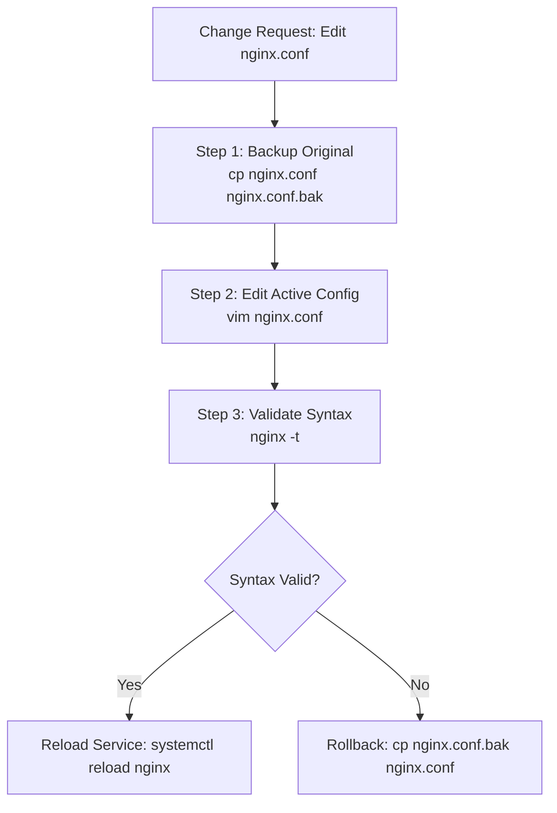
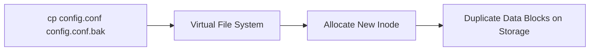
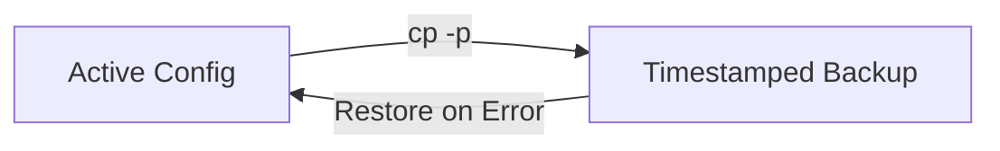

# Chapter 09: File & Directory Operations — Safe Change Management

---

## 1. Service Overview


> [!TIP]
> **Video Tutorial:** [Click here to watch the complete step-by-step practical demonstration on YouTube](#)
### Safe Change Management Philosophy
Executing file operations (`cp`, `mv`, `rm`, `mkdir`) on production servers carries operational risk. A single misplaced space in `rm -rf / tmp/` can destroy an entire operating system. This chapter focuses on **Safe Change Management**: creating pre-edit backup copies, validating destructive commands before execution, using update flags (`cp -u`), and performing safe rollbacks.

### The 4 Rules of Production File Safety
1. **Backup First**: Always `cp file.conf file.conf.bak_$(date +%Y%m%m)` before editing.
2. **Predict Before Deleting**: Run `ls *.log` to verify file lists BEFORE running `rm *.log`.
3. **Use Safe Copying (`cp -u`)**: Copy only when the source file is newer than the destination.
4. **Avoid Unvalidated Script Variables**: Never execute `rm -rf /$VAR/` without validating `$VAR` is non-empty.

### Business Problem It Solves
- **Production Disaster Prevention**: Prevents human errors and catastrophic data loss during routine configuration edits and log cleanup.

---

## 2. Learning Objectives
1. **Apply** safe file operations and change management workflows (`cp`, `mv`, `rm`, `mkdir -p`).
2. **Execute** dry-run verification before running destructive deletion commands.
3. **Implement** automated pre-edit backup and rollback procedures.

---

## 3. Prerequisites
- Completion of Chapters 01–08.

---

## 4. Real-world Analogy
Executing file operations in production is like editing a company's legal contract:
- **`cp file file.bak`**: Photocopying the contract before taking a red pen to it.
- **Dry-run Verification (`ls *.log` before `rm *.log`)**: Reading out loud what lines you are about to erase before shredding the paper.
- **Rollback (`cp file.bak file`)**: Throwing away the marked-up draft and restoring the original untouched photocopy.

---

## 5. Business Use Cases — Safe Change Management



---

## 6. Core Concepts: Safe Change Management

### Safe Deletion Simulator & Dry-Run
Never run wildcards with `rm` directly. 
- **Step 1 (Dry Run)**: `ls -la /var/log/app/*.tmp`
- **Step 2 (Verify List)**: Confirm every output file is safe to remove.
- **Step 3 (Execute)**: `rm /var/log/app/*.tmp`

---

## 7. Internal Architecture



---

## 8. System Components
- `cp -p`: Preserves mode, ownership, and timestamps.
- `cp -u`: Copies only when source is newer than destination or destination is missing.
- `mkdir -p`: Creates parent directories recursively without error if they exist.

---

## 9. Configuration
Setting defensive aliases in `~/.bashrc`:
- `alias rm='rm -i'`
- `alias cp='cp -i'`
- `alias mv='mv -i'`

---


### Updating Files (`cp -u`)
Use `cp -u` to update the destination only if the source file is newer than the destination file or if the destination file is missing.

### Safety Warning
> [!CAUTION]
> **Never** use `rm -rf` with unvalidated variables in shell scripts (e.g., `rm -rf /$VAR/`). If the variable is empty, this command becomes `rm -rf /` and destroys the operating system.

## 10. Hands-on Labs


### Lab Setup
> **Lab Environment**: Make sure your local Linux virtual machine (Ubuntu 22.04 or RHEL 9) is booted and you are connected via SSH as the 
oot or a sudo enabled user.
> **Terminal Required**: Open your Linux terminal and type each command yourself. Never copy-paste blindly!
### Lab 1: Safe Pre-Edit Backup & Rollback Drill
Create a backup, simulate a broken edit, and execute a rollback.

```bash
# 1. Create a dummy production config file
echo "port=8080" > /tmp/app.conf

# 2. Step 1: Create timestamped pre-edit backup
cp -p /tmp/app.conf /tmp/app.conf.bak_$(date +%Y%m%d_%H%M%S)

# 3. Step 2: Corrupt the active config
echo "port=BROKEN_VALUE" > /tmp/app.conf

# 4. Step 3: Execute Emergency Rollback from backup
cp -p /tmp/app.conf.bak_* /tmp/app.conf
cat /tmp/app.conf
```

#### Progressive Hint System
- **Level 1 (Clue)**: Use `cp -p` to preserve file attributes during backup creation.
- **Level 2 (Direction)**: Use subshell `$(date +%Y%m%d)` to generate unique timestamp suffixes.
- **Level 3 (Concept)**: Rollback overwrites the broken active file with the preserved backup copy.

---


#### Progressive Hint System

<details>
<summary>Hint 1: Conceptual Approach</summary>
Before running commands, always identify what state the system is currently in. Think about what command shows service or filesystem status.
</details>

<details>
<summary>Hint 2: Relevant Commands</summary>
You might want to use `systemctl status`, `cat /etc/*`, or standard diagnostic commands like `ls -la` and `stat`.
</details>

<details>
<summary>Hint 3: Full Solution</summary>

```bash
# Execute the relevant diagnostic command for this topic
systemctl status <service_name>
# Or
ls -la /relevant/path
```
</details>

## 11. Code Examples

### Shell Script: Defensive Deletion Guardrail
```bash
#!/usr/bin/env bash
# Description: Safely deletes files with variable validation
set -euo pipefail

TARGET_DIR="${1:-}"

# Guardrail: Check variable is not empty or root
if [ -z "$TARGET_DIR" ] || [ "$TARGET_DIR" = "/" ]; then
    echo "ERROR: Refusing to delete empty or root target path!" >&2
    exit 1
fi

echo "Dry run - files to be deleted in $TARGET_DIR:"
ls -la "$TARGET_DIR"/*.log 2>/dev/null || echo "No .log files found."

read -p "Proceed with deletion? (y/N): " CONFIRM
if [ "$CONFIRM" = "y" ]; then
    rm -f "$TARGET_DIR"/*.log
    echo "Deletion complete."
fi
```

---

## 12. Security Deep Dive
- **Preventing `rm -rf /$VAR/` Crashing**: Always check `if [ -n "$VAR" ]` before issuing recursive directory removals in shell scripts.

---

## 13. Monitoring & Observability
- Audit file modifications via `auditctl -w /etc/passwd -p wa -k identity_changes`.

---

## 14. Performance & Cost Optimization
- Using `cp -u` in deployment scripts avoids unnecessary disk writes when files have not changed.

---

## 15. Enterprise Integration
Integrates with Git configuration management to track config history and enable instant `git checkout` rollbacks.

---

## 16. Real Industry Use Cases
1. **Config Patching**: Backing up `/etc/sysctl.conf` before tuning kernel networking parameters.

---

## 17. Architecture Patterns



---

## 18. Production Incident War Room

### Incident INC-1009: Accidental Production Config Deletion & Recovery
- **Severity**: P1 / Critical | **Service Affected**: Payment Gateway
- **Symptom**: Junior engineer ran `rm *.conf` in `/etc/nginx/conf.d/` deleting payment routing rules.
- **Root Cause Analysis**: Deletion executed without prior backup or dry-run verification.
- **Remediation Script**:
```bash
# 1. Restore configuration from automated backup directory /var/backups/nginx/
sudo cp -rp /var/backups/nginx/conf.d/*.conf /etc/nginx/conf.d/

# 2. Test syntax and reload
sudo nginx -t && sudo systemctl reload nginx
```

---

## 19. Production Best Practices
- Never use `rm -rf *` without first running `pwd -P` and `ls *`.
- Always create timestamped backup files (`.bak_YYYYMMDD`) before editing.

---

## 20. Migration Strategies
When migrating legacy file scripts, replace raw `rm` calls with moving files to a temporary holding directory (`/tmp/trash/`).

---

## 21. CI/CD Integration
Enforce automated backup creation steps in deployment scripts prior to file replacement.

---

## 22. Practical Projects
- **Lab Project**: Write a script that backs up `/etc` to `/var/backups/etc_daily.tar.gz` and prunes backups older than 7 days.

---

## 23. Interview Preparation
#### Q1: What is the purpose of the `cp -u` and `cp -p` flags?
**Answer**: `cp -p` preserves original file permissions, ownership, and timestamps. `cp -u` (update) copies files only if the source is newer than the destination or if the destination file is missing.

---

## 24. Certification Practice
**Question**: Which flag on `mkdir` creates nested parent directories without throwing an error if they exist?
- A) `mkdir -f`
- B) `mkdir -p` **(Correct)**
- C) `mkdir -r`
- D) `mkdir -a`

---

## 25. Knowledge Check
1. **Interactive Quiz**: Which flag makes `cp` preserve file permissions and timestamps? (`-p`).

---

## 26. Cheat Sheet
| Command | Purpose |
| :--- | :--- |
| `cp -p file file.bak` | Backup preserving permissions & timestamps |
| `cp -u src dest` | Copy only if source is newer than dest |
| `mkdir -p /path/to/dir` | Create directory tree recursively |
| `rm -i file` | Prompt before deletion |

---

## 27. Chapter Summary
Safe change management requires backing up before editing (`cp -p`), verifying file lists before deleting (`ls` before `rm`), and using update flags (`cp -u`).

---

## 28. Further Learning
- [GNU Coreutils: File Operations](https://www.gnu.org/software/coreutils/)
