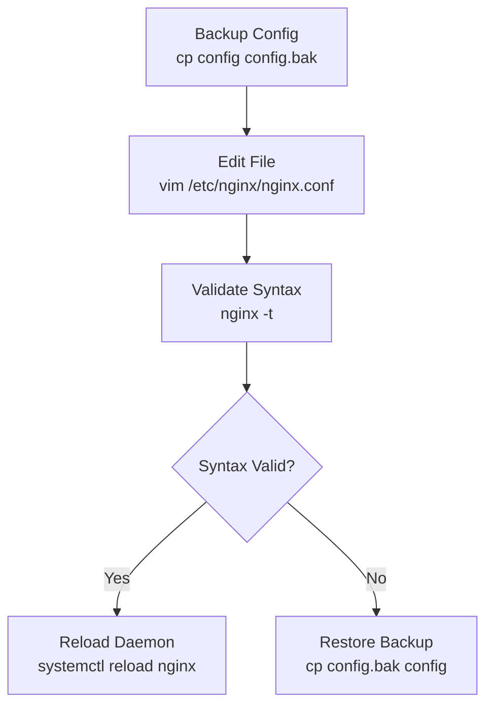
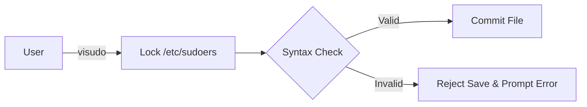

# Chapter 10: Text Editors (Vim & Nano) — Edit, Validate & Rollback

---

## 1. Service Overview


> [!TIP]
> **Video Tutorial:** [Click here to watch the complete step-by-step practical demonstration on YouTube](#)
### Production Text Editing Philosophy
Editing configuration files on a headless Linux server requires mastering command-line text editors (Vim and Nano). However, professional SysAdmin text editing is not about memorizing complex editor hotkeys—it centers on the **"Edit → Validate Syntax → Reload → Rollback"** workflow.

### The 4-Step Editing Workflow
1. **Edit Config**: Open and edit configuration using Vim (`vim /etc/nginx/nginx.conf`) or Nano.
2. **Validate Syntax**: Test file syntax BEFORE restarting services (`nginx -t`, `visudo -c`, `apachectl configtest`).
3. **Reload Service**: Apply changes gracefully (`systemctl reload service`).
4. **Rollback on Error**: Instantly restore pre-edit backup if syntax validation fails.

### Business Problem It Solves
- **Preventing Outages**: Ensures syntax errors in `/etc/sudoers` or web server configs are caught BEFORE services crash.

---

## 2. Learning Objectives
1. **Navigate and Edit** files using both Vim and Nano.
2. **Execute** the "Edit → Validate → Reload → Rollback" workflow for production service configs.
3. **Utilize** specialized editing tools (`visudo`, `sudoedit`) to edit administrative configurations safely.

---

## 3. Prerequisites
- Completion of Chapters 01–09.

---

## 4. Real-world Analogy
Editing production server configs is like editing live electrical wiring in a building:
- **Opening Vim**: Putting on safety gloves.
- **Editing Lines**: Splicing wires.
- **Syntax Validation (`nginx -t` / `visudo -c`)**: Using a voltage meter to test the connection BEFORE flipping the main breaker.
- **Reloading Service**: Flipping the breaker once you know the wiring is 100% safe.

---

## 5. Business Use Cases — Editing Workflow



---

## 6. Core Concepts: Edit, Validate & Rollback

### Vim Modes & Essential Navigation
Vim operates in distinct modes:
- **Normal Mode (Default)**: Navigation (`h,j,k,l`), deletion (`dd`, `dw`), undo (`u`), copy (`yy`), paste (`p`).
- **Insert Mode (Press `i`)**: Typing text. Return to Normal Mode with `Esc`.
- **Command-Line Mode (Press `:`)**: Save (`:w`), Quit (`:q`), Save & Exit (`:wq`), Force Quit (`:q!`).
- **Visual Block Mode (Press `Ctrl + v`)**: Mass column indentation and block editing.

---

## 7. Internal Architecture


---

## 8. System Components
- `visudo`: Dedicated wrapper for editing `/etc/sudoers` with built-in syntax locking.
- `sudoedit` (`sudo -e`): Allows unprivileged users to edit root files safely using their preferred editor.
- `.swp` swap files: Temporary Vim crash recovery buffers.

---

## 9. Configuration
Vim configuration file:
- `~/.vimrc`: Customizes line numbers (`set number`), syntax highlighting (`syntax on`), and tab indentation (`set tabstop=4`).

---


### Advanced Vim Operations
- **Visual Block Mode (`Ctrl + v`)**: Allows you to select rectangular blocks of text. Useful for indenting multiple lines or mass-editing columns.
- **`dw`**: Delete word (from cursor to the end of the word).
- **`cw`**: Change word (deletes the word and drops you into insert mode).

## 10. Hands-on Labs


### Lab Setup
> **Lab Environment**: Make sure your local Linux virtual machine (Ubuntu 22.04 or RHEL 9) is booted and you are connected via SSH as the 
oot or a sudo enabled user.
> **Terminal Required**: Open your Linux terminal and type each command yourself. Never copy-paste blindly!
### Lab 1: Safe Config Editing & Syntax Validation Lab
Edit a web configuration, perform syntax testing, and validate reload.

```bash
# 1. Edit sudoers configuration SAFELY using visudo
sudo visudo -c  # Check syntax first

# 2. Use Vim to edit a test configuration
vim /tmp/test_config.conf

# Essential Vim Commands to Practice:
# - Press 'i' to enter Insert mode, type text.
# - Press 'Esc' to exit Insert mode.
# - Type ':wq' and press Enter to save and quit.
```

#### Progressive Hint System
- **Level 1 (Clue)**: Press `i` to type in Vim; press `Esc` then `:wq` to save and exit.
- **Level 2 (Direction)**: Use `visudo` instead of raw `vim /etc/sudoers` to prevent lockouts.
- **Level 3 (Concept)**: Syntax validators check file structure before systemd applies changes.

---


#### Progressive Hint System

<details>
<summary>Hint 1: Conceptual Approach</summary>
Before running commands, always identify what state the system is currently in. Think about what command shows service or filesystem status.
</details>

<details>
<summary>Hint 2: Relevant Commands</summary>
You might want to use `systemctl status`, `cat /etc/*`, or standard diagnostic commands like `ls -la` and `stat`.
</details>

<details>
<summary>Hint 3: Full Solution</summary>

```bash
# Execute the relevant diagnostic command for this topic
systemctl status <service_name>
# Or
ls -la /relevant/path
```
</details>

## 11. Code Examples

### Shell Script: Syntax-Validated Config Updater
```bash
#!/usr/bin/env bash
# Description: Edits Nginx config with automatic syntax validation and rollback
set -euo pipefail

CONFIG="/etc/nginx/conf.d/app.conf"
BACKUP="/etc/nginx/conf.d/app.conf.bak"

# 1. Create backup
sudo cp -p "$CONFIG" "$BACKUP"

# 2. Open editor
sudo vim "$CONFIG"

# 3. Validate Nginx syntax
if sudo nginx -t; then
    echo "Syntax validation PASSED. Reloading Nginx..."
    sudo systemctl reload nginx
else
    echo "ERROR: Syntax validation FAILED! Rolling back..." >&2
    sudo cp -p "$BACKUP" "$CONFIG"
    exit 1
fi
```

---

## 12. Security Deep Dive
- **Never edit `/etc/sudoers` with raw Vim!** Always use `visudo`. `visudo` locks the file and validates syntax upon saving, preventing syntax errors that lock all administrators out of `sudo`.

---

## 13. Monitoring & Observability
- Vim swap files (`.file.swp`) indicate an active editing session or a crashed terminal session. Recover via `vim -r file`.

---

## 14. Performance & Cost Optimization
- Mastering Vim keyboard shortcuts (`gg` top, `G` bottom, `/pattern` search) reduces configuration editing time by 50%.

---

## 15. Enterprise Integration
Integrates with Git repository hooks (`pre-commit`) to run linter validation prior to committing config changes.

---

## 16. Real Industry Use Cases
1. **Emergency Patching**: Editing `/etc/hosts` or network configs during datacenter migrations.

---

## 17. Architecture Patterns



---

## 18. Production Incident War Room

### Incident INC-1010: Syntax Error in /etc/sudoers Locks Sudo Access
- **Severity**: P1 / Critical | **Service Affected**: All Admin Escalation
- **Symptom**: All administrators get `parse error in /etc/sudoers near line 25` and cannot run any `sudo` commands.
- **Root Cause Analysis**: An admin edited `/etc/sudoers` using raw `nano` without syntax validation, introducing a typo.
- **Remediation Script**:
```bash
# 1. Boot or authenticate via root shell / pkexec
pkexec visudo

# 2. Fix syntax typo on line 25 and save via visudo
# 3. Verify sudo works again
sudo -v
```

---

## 19. Production Best Practices
- Always use `visudo` for sudoers edits and `sudoedit` for root files.
- Always run syntax validators (`nginx -t`, `apachectl configtest`, `named-checkconf`) before reloading services.

---

## 20. Migration Strategies
Set `export EDITOR=vim` in `/etc/profile` to enforce standard editor defaults across team engineers.

---

## 21. CI/CD Integration
Incorporate `ansible-lint` or `yamllint` in CI/CD pipelines to validate YAML configs before deployment.

---

## 22. Practical Projects
- **Lab Project**: Configure `~/.vimrc` with custom tabs, line numbers, and search highlighting.

---

## 23. Interview Preparation
#### Q1: Why should you always use `visudo` instead of `vim /etc/sudoers`?
**Answer**: `visudo` performs file locking to prevent concurrent edit conflicts and automatically executes a strict syntax check before committing changes. If a syntax error exists, `visudo` refuses to save, preventing administrators from locking themselves out of `sudo`.

---

## 24. Certification Practice
**Question**: Which key combination in Vim switches from Insert mode back to Normal command mode?
- A) `Ctrl + C`
- B) `Esc` **(Correct)**
- C) `Enter`
- D) `:q`

---

## 25. Knowledge Check
1. **Interactive Quiz**: Which Nginx command validates configuration syntax without restarting the daemon? (`nginx -t`).

---

## 26. Cheat Sheet
| Action | Vim (Normal Mode) | Nano |
| :--- | :--- | :--- |
| Enter Insert Mode | `i` | (Default) |
| Save File | `:w` | `Ctrl + O` |
| Exit Editor | `:q` | `Ctrl + X` |
| Save & Exit | `:wq` or `ZZ` | `Ctrl + O` then `Ctrl + X` |
| Undo Last Action | `u` | `Alt + U` |
| Search Pattern | `/pattern` | `Ctrl + W` |

---

## 27. Chapter Summary
Professional SysAdmin editing follows **Edit → Validate Syntax → Reload → Rollback**. Using `visudo` and syntax testing prevents catastrophic production outages.

---

## 28. Further Learning
- [Vim Official Interactive Tutor (`vimtutor`)](https://www.vim.org)
