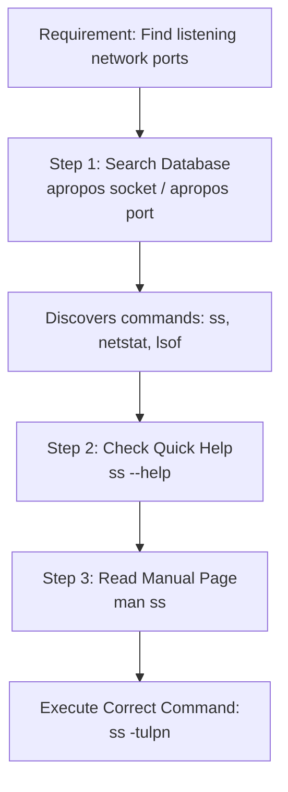
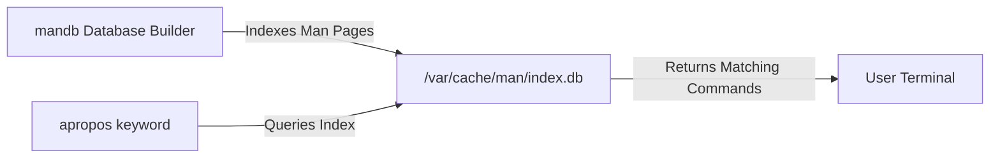

# Chapter 12: Help System & Documentation — Self-Learning Workflow

---

## 1. Service Overview


> [!TIP]
> **Video Tutorial:** [Click here to watch the complete step-by-step practical demonstration on YouTube](#)
### The "You Don't Know the Command" Workflow
Great System Administrators do not memorize thousands of command syntax flags. Instead, they master the Linux documentation ecosystem (`man`, `apropos`, `info`, `--help`, `help`) to discover commands, options, and usage examples independently.

### The 4 Pillars of On-System Help
1. **`apropos <keyword>`**: Searches the manual page description database when you do not know the command name.
2. **`man <command>`**: Displays the full system manual page (press `/` to search, `q` to quit).
3. **`command --help`**: Displays quick syntax summaries for external binaries.
4. **`help <builtin>`**: Displays documentation for Bash shell builtins (`help cd`, `help pwd`).

### Business Problem It Solves
- **Self-Sufficiency**: Enables engineers to solve unknown technical requirements in air-gapped or restricted production environments without internet access.

---

## 2. Learning Objectives
1. **Discover** unknown commands using `apropos` and `whatis`.
2. **Navigate** system manual pages (`man`) using search keys (`/`, `n`, `N`, `q`).
3. **Extract** CLI flags and usage syntax using `--help` and `help`.

---

## 3. Prerequisites
- Completion of Chapters 01–11.

---

## 4. Real-world Analogy
Using the Linux Help System is like using a library:
- **`apropos "disk space"` (Library Catalog Search)**: You type in a topic, and the catalog gives you book titles (`df`, `du`, `fdisk`).
- **`man df` (Opening the Book)**: You open the book to read detailed chapters.
- **`df --help` (Table of Contents / Quick Reference)**: Looking at a quick cheat sheet on the back cover.

---

## 5. Business Use Cases — Command Discovery Workflow



---

## 6. Core Concepts: Self-Learning Workflow

### Man Page Section Numbers
Manual pages are organized into 8 standardized sections:
- **Section 1**: Executable programs and user commands (`ls`, `grep`).
- **Section 5**: File formats and conventions (`/etc/passwd`, `fstab`).
- **Section 8**: System administration commands (`fdisk`, `systemctl`, `iptables`).

---

## 7. Internal Architecture



---

## 8. System Components
- `mandb` / `makewhatis`: Database index generator for `apropos`.
- `LESS`: Default pager used by `man` to display text.

---

## 9. Configuration
Manual page path definition:
- `/etc/man_db.conf`

---


### Alternative Documentation
- `info <command>`: The GNU info system often provides more detailed, hypertext-style documentation than standard man pages.

### apropos vs whatis
- `apropos <keyword>`: Searches both the command names and their descriptions in the manual page database.
- `whatis <command>`: Provides a concise, one-line description of what a command does by searching strictly the command names.

## 10. Hands-on Labs


### Lab Setup
> **Lab Environment**: Make sure your local Linux virtual machine (Ubuntu 22.04 or RHEL 9) is booted and you are connected via SSH as the 
oot or a sudo enabled user.
> **Terminal Required**: Open your Linux terminal and type each command yourself. Never copy-paste blindly!
### Lab 1: "You Don't Know the Command" Discovery Lab
Discover the correct command to view memory usage without using search engines.

```bash
# 1. Step 1: Search man page database for 'memory'
apropos "memory"

# 2. Step 2: Query concise one-line summary
whatis free

# 3. Step 3: Inspect free command syntax
free --help

# 4. Step 4: Open man page and search for human-readable flag
# Inside 'man free', type '-h' and press Enter to search
man free
```

#### Progressive Hint System
- **Level 1 (Clue)**: Use `apropos` to search keywords when you do not know the command name.
- **Level 2 (Direction)**: Run `apropos memory` or `apropos "disk space"`.
- **Level 3 (Concept)**: Inside `man`, press `/` followed by search term, `n` for next match, and `q` to quit.

---


#### Progressive Hint System

<details>
<summary>Hint 1: Conceptual Approach</summary>
Before running commands, always identify what state the system is currently in. Think about what command shows service or filesystem status.
</details>

<details>
<summary>Hint 2: Relevant Commands</summary>
You might want to use `systemctl status`, `cat /etc/*`, or standard diagnostic commands like `ls -la` and `stat`.
</details>

<details>
<summary>Hint 3: Full Solution</summary>

```bash
# Execute the relevant diagnostic command for this topic
systemctl status <service_name>
# Or
ls -la /relevant/path
```
</details>

## 11. Code Examples

### Shell Script: Automated Man Page Searcher
```bash
#!/usr/bin/env bash
# Description: Helper script to discover commands by topic
set -euo pipefail

TOPIC="${1:-disk}"

echo "=== Searching Linux Documentation for: $TOPIC ==="
apropos "$TOPIC" | head -n 10
```

---

## 12. Security Deep Dive
- Man pages in Section 5 (`man 5 shadow`) document security permissions required for critical files.

---

## 13. Monitoring & Observability
- If `apropos` returns `nothing appropriate`, update the database index using `sudo mandb`.

---

## 14. Performance & Cost Optimization
- Using `--help` provides immediate syntax confirmation in 1 second compared to browsing external web pages.

---

## 15. Enterprise Integration
Essential for air-gapped high-security financial/defense environments with zero internet connectivity.

---

## 16. Real Industry Use Cases
1. **Air-Gapped Maintenance**: Discovering tar compression flags during offline server migrations.

---

## 17. Architecture Patterns


---

## 18. Production Incident War Room

### Incident INC-1012: Air-Gapped Server Command Parameter Discovery
- **Severity**: P2 / High | **Service Affected**: Offline Data Vault
- **Symptom**: Engineer needs to format an NVMe partition on a high-security air-gapped server but forgets exact `mkfs` flags. Internet access is blocked.
- **Root Cause Analysis**: Lack of local documentation access due to un-indexed man pages.
- **Remediation Script**:
```bash
# 1. Update local man database index
sudo mandb

# 2. Discover filesystem creation commands
apropos "create filesystem"

# 3. Read specific man page for mkfs.ext4
man mkfs.ext4
```

---

## 19. Production Best Practices
- Use `man 5 <file>` to view configuration file format specifications (e.g. `man 5 fstab`).

---

## 20. Migration Strategies
When installing minimal OS packages, ensure `man-pages` package is installed (`dnf install -y man-pages`).

---

## 21. CI/CD Integration
Include `man-db` updates in custom base container images.

---

## 22. Practical Projects
- **Lab Project**: Use `apropos` and `man` to discover 3 different commands that list PCI, USB, and CPU hardware details (`lspci`, `lsusb`, `lscpu`).

---

## 23. Interview Preparation
#### Q1: What is the difference between `apropos` and `whatis`?
**Answer**: `apropos` searches both command names and their full description strings for a keyword match. `whatis` searches strictly the command names and returns a concise one-line description.

---

## 24. Certification Practice
**Question**: Which manual section covers system administration commands such as `fdisk` and `iptables`?
- A) Section 1
- B) Section 5
- C) Section 8 **(Correct)**
- D) Section 3

---

## 25. Knowledge Check
1. **Interactive Quiz**: Which key quits out of a `man` page view? (`q`).

---

## 26. Cheat Sheet
| Tool | Purpose | Key Shortcut |
| :--- | :--- | :--- |
| `apropos <keyword>` | Search documentation index | - |
| `whatis <cmd>` | One-line command summary | - |
| `man <cmd>` | Full manual page | `/pattern` search, `q` quit |
| `cmd --help` | Quick CLI flag summary | - |
| `help <builtin>` | Help for shell builtins | - |

---

## 27. Chapter Summary
Mastering `apropos`, `man`, and `--help` provides complete technical self-sufficiency in any air-gapped or cloud production environment.

---

## 28. Further Learning
- [Linux Man-Pages Project](https://man7.org/linux/man-pages/)
