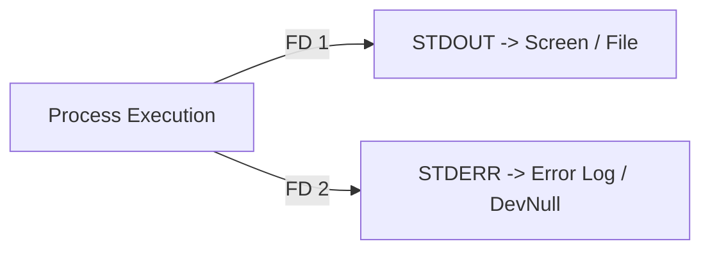

# Chapter 13: I/O Redirection, Pipes & Wildcards — Stream Processing

---

## 1. Service Overview


> [!TIP]
> **Video Tutorial:** [Click here to watch the complete step-by-step practical demonstration on YouTube](#)
### The Unix Pipeline & I/O Redirection
In Linux, every process opens three standard Data Streams:
1. **Standard Input (STDIN - File Descriptor 0)**: Keyboard input.
2. **Standard Output (STDOUT - File Descriptor 1)**: Default screen output.
3. **Standard Error (STDERR - File Descriptor 2)**: Error log output.

Redirection operators (`>`, `>>`, `2>`, `&>`) and Pipes (`|`) allow SysAdmins to connect process streams together, capturing command output into files or feeding it as input to other processing tools.

### Key Redirection Operators
- `>`: Overwrites target file with STDOUT.
- `>>`: Appends STDOUT to target file.
- `2>`: Redirects STDERR only.
- `&>` or `>&`: Redirects BOTH STDOUT and STDERR simultaneously.
- `|`: Connects STDOUT of command 1 to STDIN of command 2.
- `|&`: Connects BOTH STDOUT and STDERR to next command.

### Business Problem It Solves
- **Silent Script Failure Prevention**: Capturing error streams (`2>`) prevents automated cron jobs from failing silently without logging diagnostic errors.

---

## 2. Learning Objectives
1. **Manipulate** STDIN (0), STDOUT (1), and STDERR (2) streams using redirection operators.
2. **Construct** multi-stage command pipelines using `|` and `|&`.
3. **Implement** `set -o pipefail` in shell scripts to ensure pipeline failure propagation.

---

## 3. Prerequisites
- Completion of Chapters 01–12.

---

## 4. Real-world Analogy
I/O Streams are like plumbing pipes in a building:
- **STDOUT (Clean Water Line - FD 1)**: Normal clean water flowing to your faucet.
- **STDERR (Drain Line - FD 2)**: Separate drain pipe for dirty wastewater.
- **`>` (Diverter Valve)**: Diverting clean water into a storage bucket (file).
- **`|` (Connecting Pipe)**: Connecting output from a water filter directly into a heater.

---

## 5. Business Use Cases — Telemetry Redirection Pipeline

```mermaid
flowchart LR
    Cmd1[dmesg Hardware Log] -->|STDOUT & STDERR &>| LogFile["/var/log/boot_telemetry.log"]
    Cmd2[cat access.log] -->|Pipe STDOUT \|| Filter[grep ERROR]
    Filter -->|Pipe STDOUT \|| Save[tee /tmp/errors.log]
```

---

## 6. Core Concepts: Stream Processing

### Scripting Safety: `set -o pipefail`
By default, Bash evaluates a pipeline's exit status based strictly on the LAST command in the chain. If `command1` fails but `command2` succeeds, Bash considers the whole pipeline successful (`exit 0`). 
Adding `set -o pipefail` forces the pipeline to fail if ANY command within the chain returns a non-zero exit code.

---

## 7. Internal Architecture


---

## 8. System Components
- `/dev/null`: The bit bucket / black hole (discards all data written to it).
- `tee`: Duplicates STDOUT to both screen and file simultaneously (`cmd | tee file.log`).

---

## 9. Configuration
Script safety header:
- `set -euo pipefail`

---


### Advanced Piping
- `|&`: In modern Bash, this pipes both standard output (stdout) AND standard error (stderr) to the next command simultaneously.

### Scripting Best Practice: `set -o pipefail`
By default, a pipeline's exit status is the exit status of its *last* command. If you run `command1 | command2` and `command1` fails but `command2` succeeds, the script thinks the whole pipeline succeeded. Adding `set -o pipefail` at the top of a script forces the pipeline to fail if *any* command within it fails.

## 10. Hands-on Labs


### Lab Setup
> **Lab Environment**: Make sure your local Linux virtual machine (Ubuntu 22.04 or RHEL 9) is booted and you are connected via SSH as the 
oot or a sudo enabled user.
> **Terminal Required**: Open your Linux terminal and type each command yourself. Never copy-paste blindly!
### Lab 1: Telemetry Stream Capture & Redirection
Capture error streams separately from normal output.

```bash
# 1. Redirect STDOUT to file and STDERR to separate file
ls -l /etc/passwd /path/does/not/exist > /tmp/stdout.log 2> /tmp/stderr.log

# 2. Redirect BOTH STDOUT and STDERR to single log file
ls -l /etc/passwd /path/does/not/exist &> /tmp/combined.log

# 3. Suppress error messages using /dev/null
ls -l /path/does/not/exist 2> /dev/null || true

# 4. Duplicate pipeline output to screen AND file using tee
df -h | tee /tmp/disk_report.txt
```

#### Progressive Hint System
- **Level 1 (Clue)**: Use `2>` for error redirection; use `/dev/null` to discard errors.
- **Level 2 (Direction)**: `&>` redirects both streams; `tee` writes to screen and file simultaneously.
- **Level 3 (Concept)**: File descriptor 1 is STDOUT; File descriptor 2 is STDERR.

---


#### Progressive Hint System

<details>
<summary>Hint 1: Conceptual Approach</summary>
Before running commands, always identify what state the system is currently in. Think about what command shows service or filesystem status.
</details>

<details>
<summary>Hint 2: Relevant Commands</summary>
You might want to use `systemctl status`, `cat /etc/*`, or standard diagnostic commands like `ls -la` and `stat`.
</details>

<details>
<summary>Hint 3: Full Solution</summary>

```bash
# Execute the relevant diagnostic command for this topic
systemctl status <service_name>
# Or
ls -la /relevant/path
```
</details>

## 11. Code Examples

### Shell Script: Robust Pipeline Guardrail
```bash
#!/usr/bin/env bash
# Description: Demonstrates pipefail error detection
set -euo pipefail

echo "Executing safe pipeline..."

# 'grep' will fail if pattern not found, triggering pipefail
if cat /etc/passwd | grep "nonexistent_user" > /tmp/out.txt; then
    echo "User found."
else
    echo "Pipeline failed safely due to pipefail enforcement!"
fi
```

---

## 12. Security Deep Dive
- Discard sensitive password errors or trace dumps in production cron jobs using `2> /dev/null`.

---

## 13. Monitoring & Observability
- Inspect pipeline exit status array in Bash via `echo "${PIPESTATUS[@]}"`.

---

## 14. Performance & Cost Optimization
- Avoid `cat file | grep pattern`; use `grep pattern file` directly to save 1 process creation cycle.

---

## 15. Enterprise Integration
Integrates into automated cron jobs (`/etc/cron.d/`) to redirect output to log vaults (`> /var/log/cron.log 2>&1`).

---

## 16. Real Industry Use Cases
1. **Automated Backup Scripts**: Redirecting database dump errors to alert logs (`pg_dump db 2> /var/log/db_backup.err`).

---

## 17. Architecture Patterns



---

## 18. Production Incident War Room

### Incident INC-1013: Silent Pipeline Failure in Automated Cron Backup
- **Severity**: P1 / Critical | **Service Affected**: Nightly Data Backup
- **Symptom**: Cron backup script reports `SUCCESS`, but backup archives are corrupt 0-byte files.
- **Root Cause Analysis**: The backup command failed, but `gzip` succeeded on empty input. Without `set -o pipefail`, the script evaluated exit status based on `gzip` (success).
- **Remediation Script**:
```bash
# Update cron script header to enforce pipefail
cat << 'EOF' > /usr/local/bin/backup.sh
#!/usr/bin/env bash
set -euo pipefail
tar -cf - /var/www/html | gzip > /backups/site.tar.gz
EOF
```

---

## 19. Production Best Practices
- ALWAYS include `set -o pipefail` at the top of production Bash scripts.
- Use `tee -a` to append to log files rather than overwriting.

---

## 20. Migration Strategies
When porting sh scripts to Bash, update `cmd > log 2>&1` syntax to modern `cmd &> log`.

---

## 21. CI/CD Integration
Validate pipeline error handling in GitHub Actions steps.

---

## 22. Practical Projects
- **Lab Project**: Write a log harvester that extracts system errors and emails a report using `tee` and `|&`.

---

## 23. Interview Preparation
#### Q1: What does `set -o pipefail` do in a Bash script?
**Answer**: By default, Bash sets a pipeline's exit status to the exit status of the LAST command. `set -o pipefail` causes the pipeline to return a failure status if ANY command in the pipeline fails, preventing silent script errors.

---

## 24. Certification Practice
**Question**: Which operator redirects both STDOUT and STDERR to a file simultaneously in modern Bash?
- A) `1>`
- B) `2>`
- C) `&>` **(Correct)**
- D) `>>`

---

## 25. Knowledge Check
1. **Interactive Quiz**: What is the file descriptor number for Standard Error (STDERR)? (`2`).

---

## 26. Cheat Sheet
| Stream / Operator | Purpose |
| :--- | :--- |
| **FD 0** | STDIN (Standard Input) |
| **FD 1** | STDOUT (Standard Output) |
| **FD 2** | STDERR (Standard Error) |
| `>` / `>>` | Overwrite / Append STDOUT |
| `2>` | Redirect STDERR |
| `&>` | Redirect STDOUT and STDERR |
| `tee file` | Output to screen AND file |

---

## 27. Chapter Summary
Redirection operators (`>`, `2>`, `&>`) and pipes (`|`) control data streams. Enforcing `set -o pipefail` ensures reliable automated production scripting.

---

## 28. Further Learning
- [GNU Bash Manual: Redirection](https://www.gnu.org/software/bash/manual/html_node/Redirections.html)
