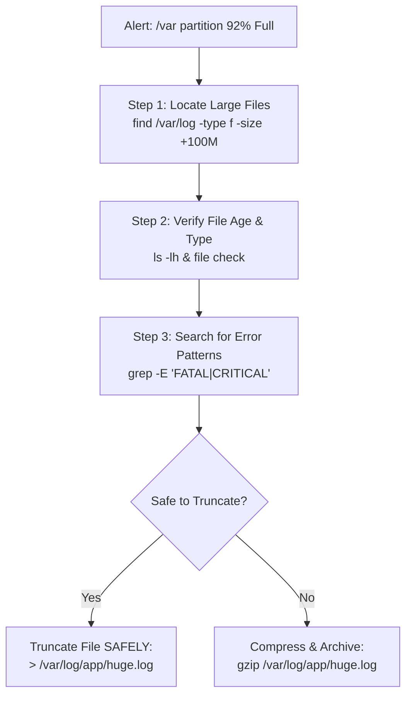

# Chapter 14: Searching Files & Pattern Matching — Incident Forensics

---

## 1. Service Overview


> [!TIP]
> **Video Tutorial:** [Click here to watch the complete step-by-step practical demonstration on YouTube](#)
### Advanced Pattern Matching & Search (`find`, `grep`, `regex`)
System Administrators rely on `find` (filesystem search) and `grep` (content search) to perform incident forensics, locate security vulnerabilities, and resolve disk space emergencies. Connecting `find + grep + regex` enables rapid identification of large, stale, or compromised files across massive storage arrays.

### Primary Forensic Tools
- `find /path -type f -size +100M -mtime +30`: Locates files larger than 100MB modified over 30 days ago.
- `grep -E "pattern1|pattern2"`: Extended regular expression matching (OR logic).
- `grep -rnI "pattern" /path`: Recursive text search ignoring binary files with line numbers.

### Business Problem It Solves
- **Disk Full Outage Mitigation**: Resolves 90%+ disk utilization emergencies by isolating large un-rotated log files safely without deleting active database files.

---

## 2. Learning Objectives
1. **Execute** complex filesystem searches using `find` by size, modification time, and permissions.
2. **Perform** content searches using `grep` extended regular expressions (`-E`, `-r`, `-n`, `-I`).
3. **Implement** safe verification steps before executing automated file prunings.

---

## 3. Prerequisites
- Completion of Chapters 01–13.

---

## 4. Real-world Analogy
File searching is like an airport security audit:
- **`find /var/log -size +100M` (Luggage Scale Check)**: Searching the airport for any bags weighing over 50 pounds.
- **`grep -r "CRITICAL"` (X-Ray Scanner)**: Looking inside every bag for forbidden items (error patterns).
- **Dry-run Verification**: Checking bag tags out loud before putting them on the cargo plane.

---

## 5. Business Use Cases — Disk Emergency Cleanup Flow



---

## 6. Core Concepts: Incident Forensics

### Preventing Accidental Destructive Deletion
Never pass raw `rm` directly to `find -exec rm {} +` without running a dry-run first!
- **Step 1 (Dry Run)**: `find /var/log -name "*.tmp" -type f`
- **Step 2 (Verify File Count)**: Confirm every output file is valid for deletion.
- **Step 3 (Execute Safe Delete)**: `find /var/log -name "*.tmp" -type f -delete`

---

## 7. Internal Architecture


---

## 8. System Components
- `find`: Searches filesystem directory trees using file metadata (inodes).
- `grep` / `ripgrep`: Searches file contents using string matching or regular expressions.

---

## 9. Configuration
Limit search depth to prevent crawling network storage mounts:
- `find /var -maxdepth 3 -type f`

---


### Advanced Search Techniques
- `find . -maxdepth 2`: Limits the search to the current directory and its immediate subdirectories. Prevents `find` from crawling massive, deeply nested filesystems.
- `grep -o "pattern"`: Prints *only* the matching portion of the string, rather than the entire line.
- `grep -E "pattern1|pattern2"`: Enables extended regular expressions, allowing you to search for multiple patterns simultaneously (OR logic).

## 10. Hands-on Labs


### Lab Setup
> **Lab Environment**: Make sure your local Linux virtual machine (Ubuntu 22.04 or RHEL 9) is booted and you are connected via SSH as the 
oot or a sudo enabled user.
> **Terminal Required**: Open your Linux terminal and type each command yourself. Never copy-paste blindly!
### Lab 1: "Server Disk 92% Full" Emergency Incident Lab
Locate files larger than 10MB modified over 7 days ago, search for error strings, and truncate safely.

```bash
# 1. Step 1: Find files larger than 10MB under /var/log
find /var/log -type f -size +10M 2>/dev/null || echo "No files >10M found."

# 2. Step 2: Search recursively for 'CRITICAL' errors ignoring binary files
grep -rnI -E "CRITICAL|FATAL" /var/log/ 2>/dev/null | head -n 10 || true

# 3. Step 3: Safely truncate a large log file without breaking file handles
# (DO NOT use 'rm' on active log files being written by daemons!)
cat /dev/null > /tmp/sample_large.log
```

#### Progressive Hint System
- **Level 1 (Clue)**: Use `find /path -size +10M` for size filtering; use `grep -rnI` for content search.
- **Level 2 (Direction)**: Add `-maxdepth 3` to `find` to limit crawling depth.
- **Level 3 (Concept)**: Truncating (`> log`) preserves open file handles; deleting (`rm log`) while a daemon is writing causes invisible disk space leaks.

---


#### Progressive Hint System

<details>
<summary>Hint 1: Conceptual Approach</summary>
Before running commands, always identify what state the system is currently in. Think about what command shows service or filesystem status.
</details>

<details>
<summary>Hint 2: Relevant Commands</summary>
You might want to use `systemctl status`, `cat /etc/*`, or standard diagnostic commands like `ls -la` and `stat`.
</details>

<details>
<summary>Hint 3: Full Solution</summary>

```bash
# Execute the relevant diagnostic command for this topic
systemctl status <service_name>
# Or
ls -la /relevant/path
```
</details>

## 11. Code Examples

### Shell Script: Automated Large File Purger
```bash
#!/usr/bin/env bash
# Description: Safely identifies and reports large stale log files
set -euo pipefail

TARGET_DIR="${1:-/var/log}"

echo "=== TOP 10 LARGEST FILES IN $TARGET_DIR ==="
find "$TARGET_DIR" -type f -exec du -h {} + 2>/dev/null | sort -rh | head -n 10

echo ""
echo "=== STALE FILES OLDER THAN 30 DAYS ==="
find "$TARGET_DIR" -type f -mtime +30 2>/dev/null | head -n 5 || echo "None found."
```

---

## 12. Security Deep Dive
- **Searching for SUID Files**: Attackers leave SUID binaries for backdoor privilege escalation. Scan for them using `find / -perm -4000 -type f 2>/dev/null`.

---

## 13. Monitoring & Observability
- Combine `find` with `xargs` or `-exec` to calculate total disk space consumed by specific log types (`find /var/log -name "*.log" -exec du -ch {} + | tail -n 1`).

---

## 14. Performance & Cost Optimization
- Use `-I` (ignore binary files) in `grep` to avoid hanging when searching through binary database files.

---

## 15. Enterprise Integration
Integrates into automated disk cleanup cron jobs to prevent cloud storage volume auto-expansion costs.

---

## 16. Real Industry Use Cases
1. **PCI-DSS Compliance Audit**: Searching filesystems for unencrypted credit card numbers using `grep -rE "[0-9]{4}-[0-9]{4}-[0-9]{4}-[0-9]{4}"`.

---

## 17. Architecture Patterns


---

## 18. Production Incident War Room

### Incident INC-1014: High Disk Space Utilization Alert on /var
- **Severity**: P1 / Critical | **Service Affected**: Core Production Cluster
- **Symptom**: Monitoring triggers `P1: /var partition at 95% capacity`. Server unable to write session data.
- **Root Cause Analysis**: An application debug flag was left enabled, producing a 15GB `debug.log` file in `/var/log/app/`.
- **Remediation Script**:
```bash
# 1. Locate the large file
find /var/log -type f -size +1G

# 2. Truncate active log file without restarting application daemon
sudo truncate -s 0 /var/log/app/debug.log

# 3. Disable debug flag in /etc/app/config.json and reload
sudo systemctl reload app-daemon
```

---

## 19. Production Best Practices
- NEVER use `rm` on active log files written by running daemons; use `truncate -s 0 file` or `> file` to preserve open file descriptors.
- Always execute a dry-run `find` query before appending `-delete`.

---

## 20. Migration Strategies
When upgrading scripts, replace slow `find ... -exec rm {} \;` (spawns 1 `rm` per file) with `find ... -delete` or `find ... -exec rm {} +` (batches arguments).

---

## 21. CI/CD Integration
Incorporate secret scanning in CI pipelines using `grep -rnI -E "AKIA[0-9A-Z]{16}" .` (AWS Access Key pattern).

---

## 22. Practical Projects
- **Lab Project**: Write a security compliance script that scans `/tmp` and `/var/tmp` for executable files owned by non-root users.

---

## 23. Interview Preparation
#### Q1: Why should you truncate (`> file.log`) an active log file instead of using `rm file.log` when disk space is full?
**Answer**: If a running daemon has an open file handle on `file.log`, deleting it with `rm` removes the directory entry, but the disk space remains allocated until the daemon process is restarted. Truncating (`> file.log` or `truncate -s 0 file.log`) clears the disk space instantly while keeping the file descriptor intact.

---

## 24. Certification Practice
**Question**: Which `grep` flag enables Extended Regular Expressions allowing OR logic (`pattern1|pattern2`)?
- A) `-i`
- B) `-E` **(Correct)**
- C) `-v`
- D) `-l`

---

## 25. Knowledge Check
1. **Interactive Quiz**: Which command finds files modified more than 30 days ago? (`find /path -mtime +30`).

---

## 26. Cheat Sheet
| Command | Purpose |
| :--- | :--- |
| `find /var -size +100M` | Find files larger than 100MB |
| `find /var -mtime +30` | Find files modified over 30 days ago |
| `find / -perm -4000` | Find SUID privilege escalation files |
| `grep -rnI "ERROR" /path` | Recursive line search ignoring binaries |
| `grep -E "ERR\|FATAL"` | Extended regex OR search |
| `truncate -s 0 file.log` | Truncate active log safely |

---

## 27. Chapter Summary
Using `find` for metadata searches and `grep -E` for content patterns allows rapid resolution of disk emergencies and security audits.

---

## 28. Further Learning
- [GNU Findutils Documentation](https://www.gnu.org/software/findutils/)
