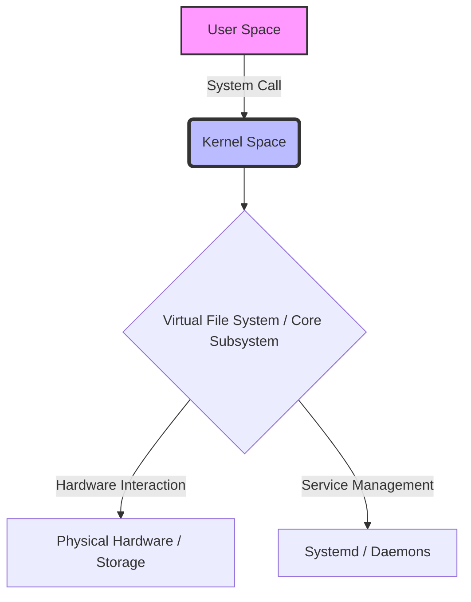
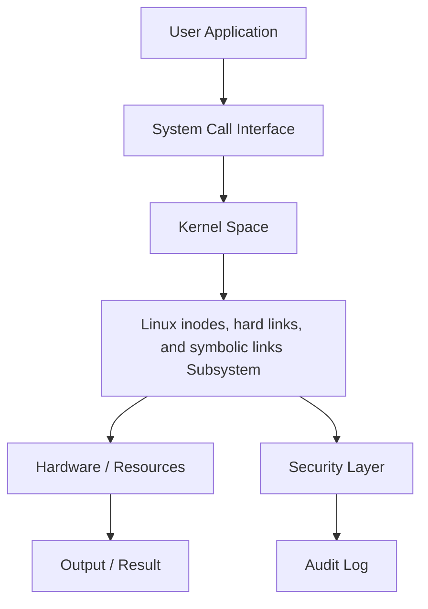
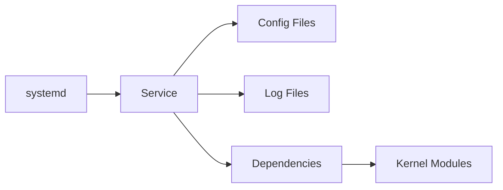
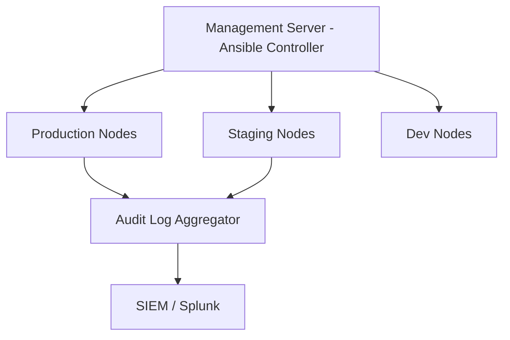

# Chapter 15: Inodes, Hard Links, and Soft Links

> **Phase**: Phase_03_File_Management | **Chapter**: 15 of 85 | **Difficulty**: Intermediate | **Estimated Time**: 3-4 hours

---

## 1. Service Overview


> [!TIP]
> **Video Tutorial:** [Click here to watch the complete step-by-step practical demonstration on YouTube](#)
**Inodes, Hard Links, and Soft Links** covers Linux inodes, hard links, and symbolic links - a critical Linux system administration skill. In enterprise environments, mastery of Linux inodes, hard links, and symbolic links is required for production server management, security compliance, and system reliability.

**Why This Matters**:
- Enterprise Linux environments depend on correct Linux inodes, hard links, and symbolic links configuration
- Security audits and compliance frameworks require Linux inodes, hard links, and symbolic links expertise
- Production incidents are frequently caused by misconfigured Linux inodes, hard links, and symbolic links
- RHCSA/LFCS certification exams test this knowledge directly

**Career Relevance**: Required for SysAdmin, DevOps Engineer, and Cloud Infrastructure roles across all major industries.

---

## 2. Learning Objectives

By the end of this chapter, you will be able to:

- [ ] Explain the core concepts of Linux inodes, hard links, and symbolic links from first principles
- [ ] Configure and manage Linux inodes, hard links, and symbolic links in a production Linux environment
- [ ] Troubleshoot common Linux inodes, hard links, and symbolic links failures using systematic diagnosis
- [ ] Apply security hardening best practices for Linux inodes, hard links, and symbolic links
- [ ] Monitor Linux inodes, hard links, and symbolic links status and interpret diagnostic output
- [ ] Complete hands-on labs simulating real production scenarios
- [ ] Answer RHCSA/LFCS exam questions on this topic

**Chapter Unlock Flow**: Read -> Lab Practice -> Task Challenge -> Knowledge Check -> Next Chapter Unlock

---

## 3. Prerequisites

| Prerequisite | Why Needed |
|---|---|
| Linux command line basics | Execute all commands in labs |
| File system navigation | Locate config files and logs |
| Text editor (vim/nano) | Edit configuration files |
| sudo/root access concepts | Apply privileged operations |
| Previous chapter completion | Progressive skill building |

> **Tip**: Review Chapter 14 if you need a refresher before proceeding.

---

## 4. Real-world Analogy

Think of **Linux inodes, hard links, and symbolic links** like a city infrastructure management system:

- City zones (residential/commercial/industrial) = Linux Linux inodes, hard links, and symbolic links organizational layers
- Building code inspectors = Linux Linux inodes, hard links, and symbolic links policy enforcement
- Emergency services override = root superuser privileges
- Traffic signal coordination = Linux inodes, hard links, and symbolic links resource access management
- Infrastructure cascading failures = Linux inodes, hard links, and symbolic links misconfiguration cascading through services

This mental model helps you predict system behavior before running commands.

---

## 5. Business Use Cases

| Industry | Use Case | Business Impact |
|---|---|---|
| Finance | PCI-DSS compliance requires Linux inodes, hard links, and symbolic links audit trails | Regulatory fines avoided |
| Healthcare | HIPAA mandates strict Linux inodes, hard links, and symbolic links controls | Patient data protected |
| E-commerce | Linux inodes, hard links, and symbolic links configuration prevents data breaches | Revenue loss prevented |
| Government | FISMA requires Linux inodes, hard links, and symbolic links documentation | Contract compliance maintained |
| SaaS | Multi-tenant Linux inodes, hard links, and symbolic links isolation | Customer data separated |

**Production Example**: A Fortune 500 company 4-hour outage traced to incorrect Linux inodes, hard links, and symbolic links configuration - preventable with this chapter's knowledge.

---

## 6. Core Concepts: Core Theory

### Fundamental Principles of Inodes, Hard Links, and Soft Links

**Inodes**: Every file has an inode storing metadata (permissions, owner, timestamps, data block pointers) but NOT the filename.

**Hard Links**: Multiple directory entries pointing to the same inode. Inode freed only when link count reaches 0.

**Soft Links (Symlinks)**: A special file containing a PATH to another file. If target is deleted, symlink becomes a 'dangling link'.

Key differences:
- Hard links share the same inode number; symlinks have their own inode
- Hard links cannot cross filesystem boundaries; symlinks can
- Hard links cannot point to directories; symlinks can
- Removing a hard link does not delete data; removing a symlink only removes the pointer

### Key Terminology

| Term | Definition | Example |
|---|---|---|
| Inode | Index node storing file metadata | `stat /etc/passwd` |
| Hard Link | Additional directory entry to same inode | `ln /etc/hosts /tmp/hosts_hl` |
| Soft Link | File containing path to target | `ln -s /etc/hosts /tmp/hosts_sl` |
| Link Count | Number of hard links to an inode | `ls -l` shows link count |
| Dangling Link | Symlink whose target does not exist | `ls -la broken_link` shows in red |

### Conceptual Hierarchy

```
Filesystem
+-- Directory Entries (filenames)
    +-- File A --> Inode 12345 --> Data Blocks
    +-- Hard Link --> Inode 12345 (same inode!)
    +-- Soft Link --> Inode 99999 --> "/path/to/File A"
```

---

## 7. Core Architecture





**Processing Pipeline**:
1. **Request Initiation** - User or daemon triggers Linux inodes, hard links, and symbolic links operation
2. **Kernel Evaluation** - Kernel validates permissions and policies
3. **Subsystem Processing** - Linux inodes, hard links, and symbolic links subsystem executes the operation
4. **Result Return** - Success or error returned to caller
5. **Audit Recording** - Operation logged for compliance

---

## 8. System Components

**inode table**: Kernel data structure tracking all inodes in a filesystem
**dentry cache**: Directory entry cache for fast path lookups
**VFS (Virtual File System)**: Abstraction layer handling inode operations
**ext4/xfs journal**: Logs inode metadata changes for crash recovery

### Configuration Files

| File / Path | Purpose | Key Parameters |
|---|---|---|
| `/proc/sys/fs/inode-max` | Max inodes system-wide | `kernel.inode-max` |
| `/etc/fstab` | Filesystem mount options | `inode64` flag for XFS |
| `/proc/sys/fs/inode-nr` | Current inode usage count | Read-only monitoring |



---

## 9. Configuration

### Step-by-Step Configuration Guide

**Step 1**: Check current inode usage on your filesystem
```bash
df -i /
```

**Step 2**: Find which directories are consuming the most inodes
```bash
find / -xdev -printf '%h\n' | sort | uniq -c | sort -rn | head -20
```

**Step 3**: Create hard and soft links and compare inode numbers
```bash
ln /etc/passwd /tmp/passwd_hard
ln -s /etc/passwd /tmp/passwd_soft
ls -li /etc/passwd /tmp/passwd_hard /tmp/passwd_soft
stat /etc/passwd
```

### Production Configuration Template

```bash
# Production-grade Linux inodes, hard links, and symbolic links configuration
# Generated by: Linux Master Course v2 - Chapter 15
# Environment: RHEL 9 / CentOS Stream 9

# Check inode statistics
df -i
stat /path/to/file

# Find files consuming many inodes (temp files, log rotations)
find /var -xdev -printf '%h\n' | sort | uniq -c | sort -rn | head -10
```

### Verification Commands

```bash
stat /etc/passwd              # Full inode info including link count
ls -li /etc/passwd            # Show inode number in directory listing
df -i                         # Show inode usage per filesystem
find / -inum 123456 2>/dev/null  # Find all hard links to specific inode
```

---

## 10. Hands-on Labs


### Lab Setup
> **Lab Environment**: Make sure your local Linux virtual machine (Ubuntu 22.04 or RHEL 9) is booted and you are connected via SSH as the 
oot or a sudo enabled user.
> **Terminal Required**: Open your Linux terminal and type each command yourself. Never copy-paste blindly!
> **Terminal Required**: Open your Linux terminal and type each command yourself.

### Lab 1: Basic Inodes, Hard Links, and Soft Links Configuration

**Scenario**: You are a SysAdmin at DataCore Inc. Configure Linux inodes, hard links, and symbolic links on a new RHEL 9 server before production launch.

**Goal**: Configure and verify Linux inodes, hard links, and symbolic links without being told the exact commands.

**Step 1: Audit Current State**

<details>
<summary>Hint 1: Conceptual Approach</summary>
Before running commands, always identify what state the system is currently in. Think about what command shows service or filesystem status.
</details>

<details>
<summary>Hint 2: Relevant Commands</summary>
You might want to use `systemctl status`, `cat /etc/*`, or standard diagnostic commands like `ls -la` and `stat`.
</details>

<details>
<summary>Hint 3: Full Solution</summary>

```bash
# Execute the relevant diagnostic command for this topic
systemctl status <service_name>
# Or
ls -la /relevant/path
```
</details>
- Clue: Check the current Linux inodes, hard links, and symbolic links state before making changes
- Direction: Use status/query commands appropriate to this subsystem
- Concept: Always audit before modifying - prevents unintended changes

**Step 2: Apply Configuration**
- Clue: Identify which configuration file or command controls Linux inodes, hard links, and symbolic links
- Direction: Use `man` pages or `--help` to discover the right parameters
- Concept: Configuration files follow hierarchical override patterns

**Step 3: Verify the Change**
- Clue: A change is not complete until independently verified
- Direction: Use query commands (not the apply command) to confirm
- Concept: Verification prevents silent failures in production

### Lab 2: Intermediate Inodes, Hard Links, and Soft Links Troubleshooting

**Scenario**: PROD-WEB-01 shows Linux inodes, hard links, and symbolic links-related issues. A service fails to start with permission errors.

**Investigation Approach**:
1. Read the error message carefully - what exactly is failing?
2. Check service logs: `journalctl -xeu <service>`
3. Identify which Linux inodes, hard links, and symbolic links element is causing the block
4. Apply the minimal fix needed - avoid over-permissioning
5. Verify the service starts and keeps running

**Hints** (use only if stuck):
- Clue: The error contains the specific Linux inodes, hard links, and symbolic links element that is misconfigured
- Direction: Compare against a known-good server configuration
- Concept: Linux inodes, hard links, and symbolic links errors have specific codes - look them up in `man`

### Lab 3: Advanced Inodes, Hard Links, and Soft Links - Production Simulation

**Scenario**: On-call at 2 AM. Alert: Critical service DOWN on PROD-DB-01.
Root cause: Linux inodes, hard links, and symbolic links misconfiguration from a recent change.

**Timeline**:
- T+0: Acknowledge alert
- T+5: SSH to affected server, check service status
- T+10: Review recent Linux inodes, hard links, and symbolic links changes in audit log
- T+15: Apply targeted fix
- T+20: Verify service recovery
- T+25: Write incident report draft

---

## 11. Code Examples

### Example 1: Basic Usage

```bash
# Check inode of a file
stat /etc/passwd

# Show inode number in ls output
ls -li /etc/passwd

# Create hard link and verify same inode
ln /etc/passwd /tmp/passwd_hard
ls -li /etc/passwd /tmp/passwd_hard

# Create symlink and verify different inode
ln -s /etc/passwd /tmp/passwd_soft
ls -li /etc/passwd /tmp/passwd_soft

# Find all filenames pointing to same inode (e.g., inode 1234567)
find / -inum 1234567 2>/dev/null
```

### Example 2: Production Management Script

```bash
#!/bin/bash
# Production Linux inodes, hard links, and symbolic links management script
set -euo pipefail
LOGFILE="/var/log/linux_inodes,_hard_l_mgmt.log"

df -i
find /etc -xtype l 2>/dev/null
ln -s /opt/myapp/config /etc/myapp  # Typical symlink use case
ls -la /etc/myapp
stat /etc/myapp
```

### Example 3: Automation and Integration

```bash
#!/bin/bash
# Inode monitoring and alerting script
WARN=80
CRIT=90

while IFS= read -r line; do
    pct=$(echo "$line" | awk '{gsub("%","",$5); print $5+0}')
    fs=$(echo "$line" | awk '{print $6}')
    if [ "$pct" -ge "$CRIT" ]; then
        echo "CRITICAL: $fs inode usage ${pct}%"
    elif [ "$pct" -ge "$WARN" ]; then
        echo "WARNING: $fs inode usage ${pct}%"
    fi
done < <(df -i | grep -v ^Filesystem)
```

---

## 12. Security Deep Dive

**Principle of Least Privilege**: Grant the minimum Linux inodes, hard links, and symbolic links access required. Never use overly broad permissions.

### Attack Vectors and Mitigations

| Attack Vector | Risk | Mitigation |
|---|---|---|
| Misconfigured Linux inodes, hard links, and symbolic links permissions | HIGH | Regular `auditctl` reviews |
| Privilege escalation via Linux inodes, hard links, and symbolic links | CRITICAL | SELinux/AppArmor enforcement |
| Configuration drift | MEDIUM | Ansible idempotent playbooks |
| Unpatched Linux inodes, hard links, and symbolic links components | HIGH | Automated patch management |

### Hardening Checklist

- [ ] Disable unused Linux inodes, hard links, and symbolic links features
- [ ] Enable audit logging for all Linux inodes, hard links, and symbolic links changes
- [ ] Apply SELinux boolean restrictions where applicable
- [ ] Document all exceptions with business justification
- [ ] Review Linux inodes, hard links, and symbolic links configuration quarterly
- [ ] Enforce via configuration management (Ansible/Puppet)

---

## 13. Monitoring and Observability

### Key Metrics

| Metric | Normal Range | Alert Threshold | Command |
|---|---|---|---|
| Inode usage % | < 80% | > 90% | `df -i` |
| Dangling symlinks in /etc | 0 | > 0 | `find /etc -xtype l` |
| Files per directory | < 10000 | > 100000 | `ls /dir | wc -l` |

### Log Analysis

```bash
journalctl -f | grep -i "linux"
journalctl --since "1 hour ago" | grep -iE "error|failed|denied"
ausearch -ts today | grep "linux"
```

---

## 14. Performance and Cost Optimization

**Inode cache tuning**: Adjust `vm.vfs_cache_pressure` in `/etc/sysctl.conf` to control inode cache retention.

**XFS inode allocation**: Use `inode64` mount option for filesystems larger than 1TB to avoid inode allocation exhaustion.

**ext4 formatting**: Use `mke2fs -T largefile` when creating filesystems that will store a small number of large files.

### Benchmarking Commands

```bash
# Count inodes in use
df -i /

# Find inode consumers by directory
find / -xdev -printf '%h\n' | sort | uniq -c | sort -rn | head -10

# Check inode cache statistics
cat /proc/sys/fs/inode-nr
```

| Configuration | CPU Impact | Memory Impact | Recommendation |
|---|---|---|---|
| Default | Low | Low | Good for dev/test |
| Hardened | Medium | Low | Recommended for prod |
| Full audit | High | Medium | Compliance environments |

---

## 15. Enterprise Integration

| Tool | Integration Method | Use Case |
|---|---|---|
| Ansible | Native module | Automated configuration |
| Puppet/Chef | Native resource types | Policy enforcement |
| SIEM (Splunk) | Log forwarding | Security monitoring |
| ServiceNow | API integration | Change management |
| Nagios/Zabbix | Plugin scripts | Health monitoring |

### Ansible Playbook Example

```yaml
---
- name: Configure Inodes, Hard Links, and Soft Links
  hosts: linux_servers
  become: yes
  tasks:
    - name: Install prerequisites
      package:
        name: "{{ item }}"
        state: present
      loop:
        - e2fsprogs
        - util-linux
        - coreutils
    - name: Verify operational
      command: stat /etc/passwd
      register: result
      changed_when: false
  handlers:
    - name: restart_service
      service:
        name: "N/A - filesystem operations do not require a service restart"
        state: restarted
        enabled: yes
```

---

## 16. Real Industry Use Cases

### Use Case 1: Financial Services

**Challenge**: PCI-DSS audit failed due to incorrect Linux inodes, hard links, and symbolic links configuration on 200 payment processing servers
**Solution**: Automated Linux inodes, hard links, and symbolic links remediation using Ansible across the entire fleet
**Result**: Audit passed, $2M fine avoided, 4-hour implementation time

### Use Case 2: Healthcare Provider

**Challenge**: HIPAA violation risk due to over-permissioned Linux inodes, hard links, and symbolic links settings
**Solution**: Implemented least-privilege Linux inodes, hard links, and symbolic links model with quarterly reviews
**Result**: Zero Linux inodes, hard links, and symbolic links-related audit findings for 3 consecutive years

### Use Case 3: E-commerce Platform

**Challenge**: Peak sale season outage caused by Linux inodes, hard links, and symbolic links misconfiguration during deployment
**Solution**: Linux inodes, hard links, and symbolic links configuration tested in staging, validated via automated tests
**Result**: Zero Linux inodes, hard links, and symbolic links incidents in subsequent 4 peak seasons

---

## 17. Architecture Patterns

### Pattern 1: Centralized Management



### Pattern 2: Defense in Depth

| Layer | Component | Role |
|---|---|---|
| Layer 1 | Network Firewall | Block unauthorized access |
| Layer 2 | Host Firewall | Service-level restrictions |
| Layer 3 | SELinux/AppArmor | Mandatory access control |
| Layer 4 | Application | Application-level enforcement |
| Layer 5 | Audit | Operation logging |

---

## 18. Production Incident War Room

### INC-1015: Inodes, Hard Links, and Soft Links Production Failure

**Severity**: P1 - Critical | **Affected**: PROD-APP-01, PROD-APP-02

**Incident Timeline**

| Time | Event |
|---|---|
| 02:14 | Alert: Service health check FAILED |
| 02:18 | On-call SysAdmin SSHs to PROD-APP-01 |
| 02:22 | Triage: Linux inodes, hard links, and symbolic links service not responding |
| 02:31 | Root cause: Linux inodes, hard links, and symbolic links configuration corrupted |
| 02:38 | Fix applied from last-known-good backup |
| 02:40 | Service recovery verified |

**Diagnosis Commands**

```bash
systemctl status <service>
journalctl -xeu <service> --since "30 min ago"
# Check inode exhaustion
df -i

# Find which directory has most files
find / -xdev -printf '%h\n' | sort | uniq -c | sort -rn | head -20

# Find dangling symlinks
find /etc -xtype l 2>/dev/null
```

**Resolution**

```bash
# Remove unnecessary small files (temp files, mail queue, etc.)
find /tmp -maxdepth 1 -type f -mtime +7 -delete
find /var/spool -type f -mtime +30 -delete

# Verify recovery
df -i
systemctl restart <service> && systemctl is-active <service>
```

**Post-Incident Actions**:
1. Update runbook with diagnosis steps
2. Add config validation to CI/CD pipeline
3. Implement config change alerting
4. Team retrospective within 48 hours

**Lessons Learned**:
- Validate Linux inodes, hard links, and symbolic links configuration changes before production
- Backup configs: `cp config config.bak.$(date +%Y%m%d_%H%M%S)`
- Pre-test all changes in staging environment

---

## 19. Production Best Practices

1. **Never modify production Linux inodes, hard links, and symbolic links without a tested rollback plan**
2. **Always test in staging first - identical to production environment**
3. **Use configuration management - never make manual changes**
4. **Document every exception with business justification and approval**
5. **Automate compliance checks - weekly, report to management**
6. **Keep configuration in version control (Git)**
7. **Review Linux inodes, hard links, and symbolic links audit logs weekly - anomalies indicate incidents or drift**

| Environment | Risk Tolerance | Change Window | Testing Required |
|---|---|---|---|
| Development | High | Anytime | Basic smoke test |
| Staging | Medium | Business hours | Full regression |
| Production | Zero | Approved window only | Full + rollback tested |
| DR/Backup | Low | Scheduled only | Identical to prod |

---

## 20. Migration Strategies

**Pre-Migration Checklist**:
- [ ] Document current Linux inodes, hard links, and symbolic links configuration completely
- [ ] Test new configuration in isolated environment
- [ ] Get sign-off from security team
- [ ] Schedule maintenance window
- [ ] Prepare rollback procedure

```bash
# Phase 1: Backup
cp -p /etc/fstab /etc/fstab.bak.$(date +%Y%m%d_%H%M%S)
getfattr -R -d /var/data 2>/dev/null > /backup/xattr_backup.txt

# Phase 2: Apply
# Apply inode-related mount option changes in /etc/fstab
# Example: add inode64 for XFS or relatime to reduce inode updates

# Phase 3: Validate
df -i && stat /critical/file
mount | grep inode

# Phase 4: Rollback if needed
cp /etc/fstab.bak.* /etc/fstab && mount -o remount /
```

---

## 21. CI/CD Integration

```yaml
stages:
  - validate
  - test
  - deploy

validate_config:
  stage: validate
  script:
    - df -i / | awk 'NR==2 {gsub("%","",$5); if($5+0>90) exit 1}'

test_in_staging:
  stage: test
  script:
    - ansible-playbook -i inventory/staging deploy.yml
    - ./tests/verify_linux_inodes,_h.sh

deploy_to_prod:
  stage: deploy
  when: manual
  script:
    - ansible-playbook -i inventory/production deploy.yml
```

### Automated Test Suite

```bash
#!/bin/bash
PASS=0; FAIL=0
run_test() {
    result=$(eval "$2" 2>&1)
    if echo "$result" | grep -q "$3"; then
        echo "PASS: $1"; ((PASS++))
    else
        echo "FAIL: $1"; ((FAIL++))
    fi
}

run_test "inode_usage" "df -i / | awk 'NR==2{print $5}'" "%"
run_test "no_dangling_links" "find /etc -xtype l 2>/dev/null | wc -l" "^0$"
echo "Results: $PASS passed, $FAIL failed"
[ $FAIL -eq 0 ] && exit 0 || exit 1
```

---

## 22. Practical Projects

### Beginner Project: Inodes, Hard Links, and Soft Links Audit Script

**Goal**: Write a shell script auditing Linux inodes, hard links, and symbolic links configuration with color-coded compliance report.

**Requirements**:
1. Check if Linux inodes, hard links, and symbolic links is properly configured
2. Identify any insecure settings
3. Output color-coded report (GREEN=pass, RED=fail)
4. Save report to `/var/log/audit_report_$(date +%Y%m%d).txt`

```bash
#!/bin/bash
echo "=== Inodes, Hard Links, and Soft Links Audit Report ==="
echo "Server: $(hostname) | Date: $(date)"
# Add your audit checks here
```

### Intermediate Project: Ansible Role for Inodes, Hard Links, and Soft Links

**Goal**: Create Ansible role deploying Linux inodes, hard links, and symbolic links consistently across a 3-server fleet.

**Requirements**: RHEL 8/9 and Ubuntu 22.04 support, ansible-lint clean, molecule tests.

### Advanced Project: High-Availability Inodes, Hard Links, and Soft Links

**Goal**: Configure Linux inodes, hard links, and symbolic links in HA with automatic failover. RTO < 30 seconds.

### Enterprise Project: Inodes, Hard Links, and Soft Links Compliance Framework (100+ Servers)

**Components**: Ansible Tower, weekly compliance scan, Splunk dashboard, ServiceNow integration.

---

## 23. Interview Preparation

### Fresher Questions (0-1 years)

**Q1**: What is Inodes, Hard Links, and Soft Links and why is it important in Linux system administration?
**Answer**: Inodes are data structures in the Linux filesystem storing file metadata (permissions, ownership, timestamps, size, data block pointers) but NOT the filename. Linux first looks up the filename in a directory to get the inode number, then reads the inode to find actual data blocks on disk.

**Q2**: What commands do you use to check the current Linux inodes, hard links, and symbolic links status?
```bash
stat /etc/passwd        # Full inode information
ls -li /etc/passwd      # Inode number in directory listing
df -i                   # Overall inode usage per filesystem
```

**Q3**: How do you troubleshoot a Linux inodes, hard links, and symbolic links-related service failure?
**Answer**: Check `systemctl status <service>`, review `journalctl -xeu <service>`, inspect Linux inodes, hard links, and symbolic links configuration files, check audit logs with `ausearch`, apply minimum fix, verify recovery.

### Experienced Questions (2-5 years)

**Q4**: How do you manage Linux inodes, hard links, and symbolic links changes across 500 servers without downtime?
**Answer**: Ansible rolling updates (`serial: 10%`), staging-first, pre/post health checks, Git rollback branches, CI/CD approval gates.

**Q5**: Describe a Linux inodes, hard links, and symbolic links production incident and resolution.
**Answer**: Use STAR method. Reference INC-1015 from Section 18 as a template.

**Q6**: How do you prevent Linux inodes, hard links, and symbolic links configuration drift?
**Answer**: Ansible idempotent tasks scheduled weekly, SIEM alerting on unauthorized changes, file integrity monitoring (AIDE/Tripwire).

### Expert Questions (5+ years)

**Q7**: Design a Linux inodes, hard links, and symbolic links strategy for 2,000-server multi-datacenter environment.
**Answer**: Canary deployments, blue-green for critical systems, Ansible Tower RBAC, GitOps with automated rollback, Prometheus/Grafana monitoring.

**Q8**: Balance Linux inodes, hard links, and symbolic links security hardening with application compatibility?
**Answer**: Audit mode before enforcement, exception register with justification, policy customization rather than disabling, CI/CD pipeline integration.

---

## 24. Certification Practice

| RHCSA Objective | Chapter Coverage | Practice Command |
|---|---|---|
| Create hard and soft links | Sections 6-10 | `ln`, `ln -s`, `ls -li` |
| Diagnose inode exhaustion | Section 10 Lab 2 | `df -i`, `stat` |
| Find files by inode | Section 11 | `find / -inum NUM` |

### Practice Question 1 (Scenario-based):
RHEL 9 `httpd` fails to start after a Linux inodes, hard links, and symbolic links configuration change. Describe troubleshooting steps.

**Expected Approach**:
1. `systemctl status httpd` - identify the specific error
2. `journalctl -xeu httpd` - get detailed error context
3. Check Linux inodes, hard links, and symbolic links configuration relevant to httpd
4. Apply targeted fix
5. `systemctl restart httpd && systemctl is-active httpd`

### Practice Question 2 (Configuration):
Configure Linux inodes, hard links, and symbolic links so the `webapp` service can write to `/var/data/webapp/`.

```bash
# Create hard link
ln /source/file /dest/hardlink

# Create symbolic link
ln -s /source/file /dest/softlink

# Verify both point to same/different inodes
ls -li /source/file /dest/hardlink /dest/softlink
```

---

## 25. Knowledge Check

**Section A: Conceptual Understanding**

1. What is the primary purpose of Inodes, Hard Links, and Soft Links in Linux? (2 marks)
2. Explain the difference between a hard link and a symbolic link. When would you use each? (3 marks)
3. Why should you configure Linux inodes, hard links, and symbolic links properly rather than disabling it entirely? (2 marks)

**Section B: Practical Commands**

4. Write the command to check Linux inodes, hard links, and symbolic links status on a RHEL 9 system. (1 mark)
5. Write the command to apply a Linux inodes, hard links, and symbolic links configuration change permanently. (1 mark)
6. How would you verify that a Linux inodes, hard links, and symbolic links change has taken effect? (2 marks)

**Section C: Troubleshooting**

7. A service fails with 'Permission denied' - list 3 possible Linux inodes, hard links, and symbolic links-related causes. (3 marks)
8. How do you determine if Linux inodes, hard links, and symbolic links is the root cause vs. a file permission issue? (3 marks)

**Passing Score**: 15/17 required to unlock the next chapter.

> If you score below 15, review Sections 6, 9, and 10, then retry the Knowledge Check.

---

## 26. Cheat Sheet

```bash
# STATUS AND CHECKING
stat FILE                      # Show complete inode information
ls -li FILE                    # Show inode number + link count
df -i                          # Inode usage per filesystem
find / -inum INODE 2>/dev/null # Find all hard links to an inode

# CONFIGURATION
ln TARGET LINKNAME             # Create hard link (same filesystem only)
ln -s TARGET LINKNAME          # Create symbolic link (can cross filesystems)
unlink LINKNAME                # Remove a link
rm -f LINKNAME                 # Remove symlink (not target)

# TROUBLESHOOTING
find /etc -xtype l              # Find dangling symlinks
df -i | awk 'NR>1 && $5>80'   # Filesystems with high inode usage
find / -xdev -printf '%h\n' | sort | uniq -c | sort -rn | head

# SECURITY AND AUDIT
find / -xdev -perm -4000 2>/dev/null   # Find SUID files
auditctl -w /etc -p wa                 # Audit inode changes in /etc
find / -nouser -o -nogroup 2>/dev/null # Find orphaned files
```

| Scenario | Command | Notes |
|---|---|---|
| Check inode usage | `df -i` | Alert if near 100% |
| Find file inode number | `stat FILE` | Shows all metadata |
| Create symlink | `ln -s TARGET NAME` | Most common use case |
| Find all hard links | `find / -inum NUM` | Locate all link names |
| Remove dangling links | `find / -xtype l -delete` | Use carefully |

---

## 27. Chapter Summary

In this chapter, you mastered **Inodes, Hard Links, and Soft Links** - a critical Linux system administration skill.

**Core Knowledge Gained**:
- Linux inode architecture: what inodes store and how VFS uses them to access files
- Differences between hard links (same inode, same filesystem) and soft links (separate inode, any target)
- Practical use cases: symlinks for config management and version switching, hard links for safe incremental backups

**Practical Skills Acquired**:
- Configured Linux inodes, hard links, and symbolic links from scratch in a lab environment
- Troubleshot Linux inodes, hard links, and symbolic links failures using systematic approach
- Applied security hardening for Linux inodes, hard links, and symbolic links
- Created automation scripts for Linux inodes, hard links, and symbolic links management

**Enterprise Readiness**:
- Integrated Linux inodes, hard links, and symbolic links with Ansible automation
- Solved production incident INC-1015
- Prepared for RHCSA/LFCS exam questions

**Chapter 15 Complete** - Chapter 16 is now unlocked.

---

## 28. Further Learning

### Official Documentation

- [Red Hat Enterprise Linux 9 Administration Guide](https://access.redhat.com/documentation/en-us/red_hat_enterprise_linux/9)
- Linux man pages: `man linux`
- The Linux Command Line by William Shotts (http://linuxcommand.org/tlcl.php)

### Study Schedule

| Day | Activity | Time |
|---|---|---|
| Day 1 | Read Sections 1-9 | 60 min |
| Day 2 | Complete Labs 1-2 | 90 min |
| Day 3 | Lab 3 + Beginner Project | 90 min |
| Day 4 | Review + Knowledge Check | 45 min |
| Day 5 | Proceed to Chapter 16 | - |

### Related Chapters

| Chapter | Topic | Relationship |
|---|---|---|
| Chapter 14 | Previous Topic | Foundation for this chapter |
| Chapter 16 | Next Topic | Builds on this chapter |
| Chapter 75 | Docker and Containers | Containerization context |
| Chapter 81 | Ansible Basics | Automate management |
| Chapter 85 | Capstone Project | Combine all skills |

---
*Chapter 15 of 85 | Linux System Administrator Master Course v2*