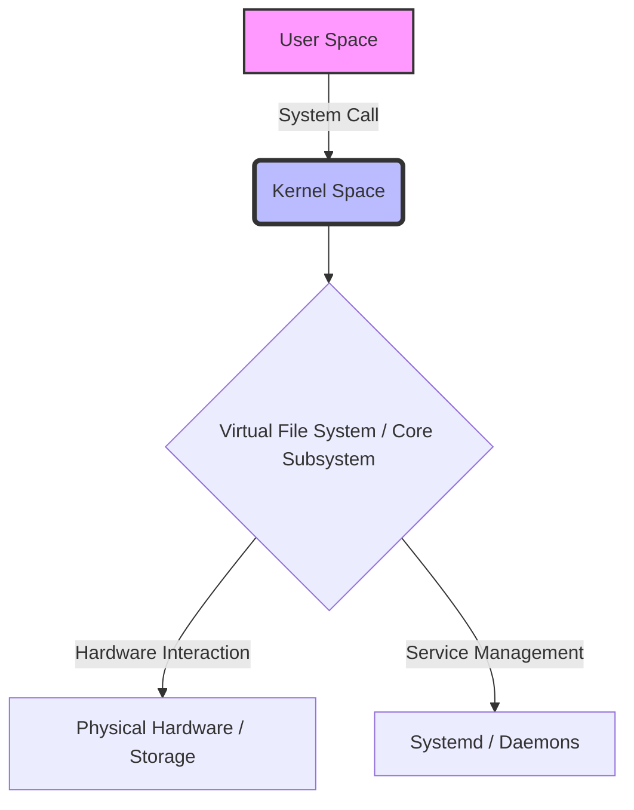
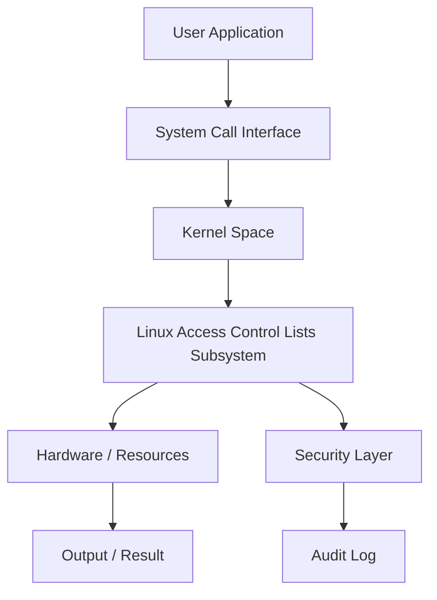
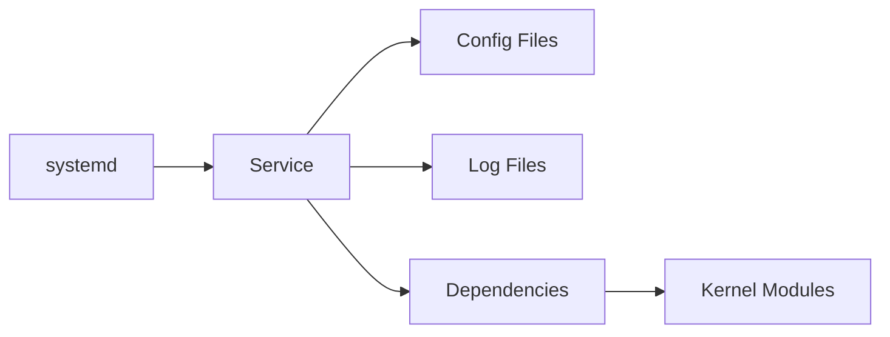
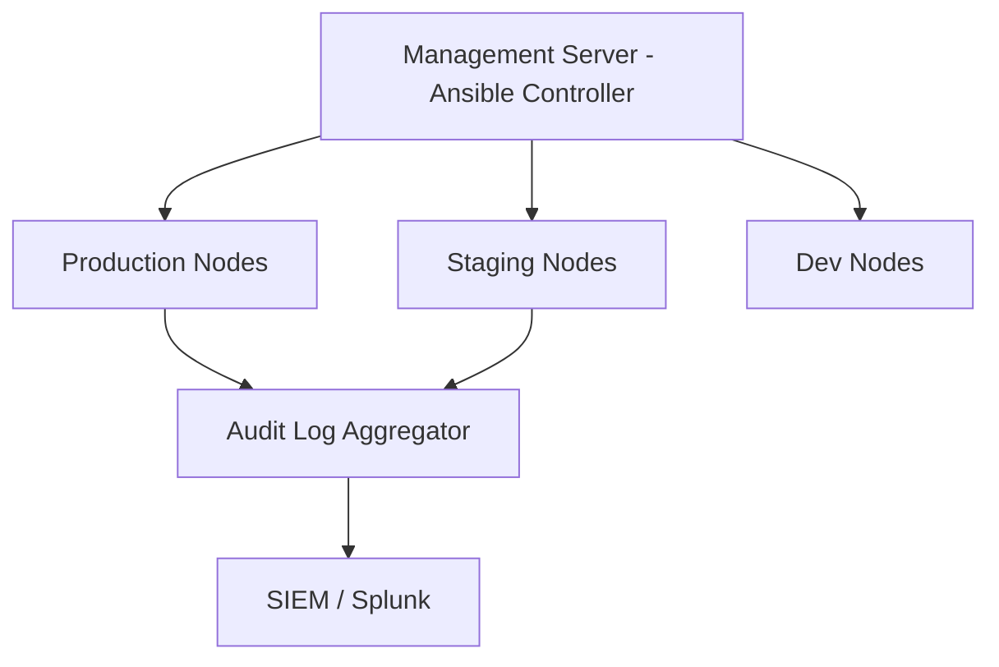

# Chapter 17: Access Control Lists (ACL)

> **Phase**: Phase_03_File_Management | **Chapter**: 17 of 85 | **Difficulty**: Intermediate | **Estimated Time**: 3-4 hours

---

## 1. Service Overview


> [!TIP]
> **Video Tutorial:** [Click here to watch the complete step-by-step practical demonstration on YouTube](#)
**Access Control Lists (ACL)** covers Linux Access Control Lists - a critical Linux system administration skill. In enterprise environments, mastery of Linux Access Control Lists is required for production server management, security compliance, and system reliability.

**Why This Matters**:
- Enterprise Linux environments depend on correct Linux Access Control Lists configuration
- Security audits and compliance frameworks require Linux Access Control Lists expertise
- Production incidents are frequently caused by misconfigured Linux Access Control Lists
- RHCSA/LFCS certification exams test this knowledge directly

**Career Relevance**: Required for SysAdmin, DevOps Engineer, and Cloud Infrastructure roles across all major industries.

---

## 2. Learning Objectives

By the end of this chapter, you will be able to:

- [ ] Explain the core concepts of Linux Access Control Lists from first principles
- [ ] Configure and manage Linux Access Control Lists in a production Linux environment
- [ ] Troubleshoot common Linux Access Control Lists failures using systematic diagnosis
- [ ] Apply security hardening best practices for Linux Access Control Lists
- [ ] Monitor Linux Access Control Lists status and interpret diagnostic output
- [ ] Complete hands-on labs simulating real production scenarios
- [ ] Answer RHCSA/LFCS exam questions on this topic

**Chapter Unlock Flow**: Read -> Lab Practice -> Task Challenge -> Knowledge Check -> Next Chapter Unlock

---

## 3. Prerequisites

| Prerequisite | Why Needed |
|---|---|
| Linux command line basics | Execute all commands in labs |
| File system navigation | Locate config files and logs |
| Text editor (vim/nano) | Edit configuration files |
| sudo/root access concepts | Apply privileged operations |
| Previous chapter completion | Progressive skill building |

> **Tip**: Review Chapter 16 if you need a refresher before proceeding.

---

## 4. Real-world Analogy

Think of **Linux Access Control Lists** like a city infrastructure management system:

- City zones (residential/commercial/industrial) = Linux Linux Access Control Lists organizational layers
- Building code inspectors = Linux Linux Access Control Lists policy enforcement
- Emergency services override = root superuser privileges
- Traffic signal coordination = Linux Access Control Lists resource access management
- Infrastructure cascading failures = Linux Access Control Lists misconfiguration cascading through services

This mental model helps you predict system behavior before running commands.

---

## 5. Business Use Cases

| Industry | Use Case | Business Impact |
|---|---|---|
| Finance | PCI-DSS compliance requires Linux Access Control Lists audit trails | Regulatory fines avoided |
| Healthcare | HIPAA mandates strict Linux Access Control Lists controls | Patient data protected |
| E-commerce | Linux Access Control Lists configuration prevents data breaches | Revenue loss prevented |
| Government | FISMA requires Linux Access Control Lists documentation | Contract compliance maintained |
| SaaS | Multi-tenant Linux Access Control Lists isolation | Customer data separated |

**Production Example**: A Fortune 500 company 4-hour outage traced to incorrect Linux Access Control Lists configuration - preventable with this chapter's knowledge.

---

## 6. Core Concepts: Core Theory

### Fundamental Principles of Access Control Lists (ACL)

**ACLs** extend traditional Unix permissions (user/group/other) to allow per-user and per-group fine-grained access control on any file or directory.

**Two ACL Types**:
- **Access ACL**: Controls access to a specific file or directory
- **Default ACL**: Applied to a directory; inherited by new files/dirs created inside it

**ACL Mask**: The maximum effective permissions that can be granted to any named user/group ACL entry (except the owner). Acts as an upper permission bound.

**When to use ACLs**: When standard Unix permissions cannot express the required access pattern, e.g., user alice needs rw- and group devs needs r-x on the same file.

### Key Terminology

| Term | Definition | Example |
|---|---|---|
| ACL | Access Control List | `getfacl /path` |
| Named user ACL | ACL for a specific user | `setfacl -m u:alice:rw file` |
| Named group ACL | ACL for a specific group | `setfacl -m g:devs:rx file` |
| Default ACL | Inherited by new files in directory | `setfacl -m d:u:alice:rw dir/` |
| Mask | Maximum effective permissions | `setfacl -m m::r file` |
| Effective permissions | Granted ACL entry AND mask | Shown in `getfacl` output |

### Conceptual Hierarchy

```
Traditional Unix:
  owner::rwx
  group::r-x
  other::r--

ACL Extended:
  owner::rwx
  user:alice:rw-    # Named user
  group::r-x
  group:devs:rwx    # Named group
  mask::rwx         # Effective permission ceiling
  other::r--
```

---

## 7. Core Architecture





**Processing Pipeline**:
1. **Request Initiation** - User or daemon triggers Linux Access Control Lists operation
2. **Kernel Evaluation** - Kernel validates permissions and policies
3. **Subsystem Processing** - Linux Access Control Lists subsystem executes the operation
4. **Result Return** - Success or error returned to caller
5. **Audit Recording** - Operation logged for compliance

---

## 8. System Components

**setfacl**: Command to set/modify/remove ACLs on files and directories
**getfacl**: Command to view current ACLs on files and directories
**acl package**: Required RPM/DEB package (`dnf install acl`)
**Filesystem support**: ext4, XFS, Btrfs, and most modern Linux filesystems support ACLs natively

### Configuration Files

| File / Path | Purpose | Key Parameters |
|---|---|---|
| `/etc/fstab` | Mount options | `acl` option (default on RHEL 9) |
| ACL backup file | Created by getfacl | `getfacl -R /dir > acl_backup.txt` |



---

## 9. Configuration

### Step-by-Step Configuration Guide

**Step 1**: Verify ACL support on the filesystem
```bash
mount | grep " / " | grep -i acl
tune2fs -l /dev/sda1 | grep 'Default mount options'
```

**Step 2**: Install ACL tools if not present
```bash
dnf install acl -y
```

**Step 3**: Apply ACLs to a shared project directory
```bash
mkdir -p /var/data/project
setfacl -m u:alice:rw /var/data/project/
setfacl -m g:devs:rx /var/data/project/
setfacl -m d:u:alice:rw /var/data/project/    # default for new files
getfacl /var/data/project/
```

### Production Configuration Template

```bash
# Production-grade Linux Access Control Lists configuration
# Generated by: Linux Master Course v2 - Chapter 17
# Environment: RHEL 9 / CentOS Stream 9

# Apply ACL: alice gets rw, devs group gets rx, default for new files
setfacl -m u:alice:rw- /var/data/project
setfacl -m g:devs:r-x /var/data/project
setfacl -m d:u:alice:rw- /var/data/project
setfacl -m d:g:devs:r-x /var/data/project
```

### Verification Commands

```bash
getfacl /var/data/project/     # Show all ACLs (named users, groups, mask)
ls -la /var/data/project/      # '+' sign indicates ACL is present
```

---

## 10. Hands-on Labs


### Lab Setup
> **Lab Environment**: Make sure your local Linux virtual machine (Ubuntu 22.04 or RHEL 9) is booted and you are connected via SSH as the 
oot or a sudo enabled user.
> **Terminal Required**: Open your Linux terminal and type each command yourself. Never copy-paste blindly!
> **Terminal Required**: Open your Linux terminal and type each command yourself.

### Lab 1: Basic Access Control Lists (ACL) Configuration

**Scenario**: You are a SysAdmin at DataCore Inc. Configure Linux Access Control Lists on a new RHEL 9 server before production launch.

**Goal**: Configure and verify Linux Access Control Lists without being told the exact commands.

**Step 1: Audit Current State**

<details>
<summary>Hint 1: Conceptual Approach</summary>
Before running commands, always identify what state the system is currently in. Think about what command shows service or filesystem status.
</details>

<details>
<summary>Hint 2: Relevant Commands</summary>
You might want to use `systemctl status`, `cat /etc/*`, or standard diagnostic commands like `ls -la` and `stat`.
</details>

<details>
<summary>Hint 3: Full Solution</summary>

```bash
# Execute the relevant diagnostic command for this topic
systemctl status <service_name>
# Or
ls -la /relevant/path
```
</details>
- Clue: Check the current Linux Access Control Lists state before making changes
- Direction: Use status/query commands appropriate to this subsystem
- Concept: Always audit before modifying - prevents unintended changes

**Step 2: Apply Configuration**
- Clue: Identify which configuration file or command controls Linux Access Control Lists
- Direction: Use `man` pages or `--help` to discover the right parameters
- Concept: Configuration files follow hierarchical override patterns

**Step 3: Verify the Change**
- Clue: A change is not complete until independently verified
- Direction: Use query commands (not the apply command) to confirm
- Concept: Verification prevents silent failures in production

### Lab 2: Intermediate Access Control Lists (ACL) Troubleshooting

**Scenario**: PROD-WEB-01 shows Linux Access Control Lists-related issues. A service fails to start with permission errors.

**Investigation Approach**:
1. Read the error message carefully - what exactly is failing?
2. Check service logs: `journalctl -xeu <service>`
3. Identify which Linux Access Control Lists element is causing the block
4. Apply the minimal fix needed - avoid over-permissioning
5. Verify the service starts and keeps running

**Hints** (use only if stuck):
- Clue: The error contains the specific Linux Access Control Lists element that is misconfigured
- Direction: Compare against a known-good server configuration
- Concept: Linux Access Control Lists errors have specific codes - look them up in `man`

### Lab 3: Advanced Access Control Lists (ACL) - Production Simulation

**Scenario**: On-call at 2 AM. Alert: Critical service DOWN on PROD-DB-01.
Root cause: Linux Access Control Lists misconfiguration from a recent change.

**Timeline**:
- T+0: Acknowledge alert
- T+5: SSH to affected server, check service status
- T+10: Review recent Linux Access Control Lists changes in audit log
- T+15: Apply targeted fix
- T+20: Verify service recovery
- T+25: Write incident report draft

---

## 11. Code Examples

### Example 1: Basic Usage

```bash
# Check ACL support on filesystem
mount | grep ' / ' | grep -c acl

# Apply ACL: alice gets rw, devs group gets rx
setfacl -m u:alice:rw /var/data/project/
setfacl -m g:devs:r-x /var/data/project/

# Set default ACL so new files inherit these permissions
setfacl -m d:u:alice:rw /var/data/project/
setfacl -m d:g:devs:r-x /var/data/project/

# View the result
getfacl /var/data/project/
```

### Example 2: Production Management Script

```bash
#!/bin/bash
# Production Linux Access Control Lists management script
set -euo pipefail
LOGFILE="/var/log/linux_access_control_mgmt.log"

getfacl /var/data/project/ 2>/dev/null
setfacl -m u:webapp:rw- /var/data/project/
getfacl /var/data/project/ | grep -E 'user:webapp|mask'
```

### Example 3: Automation and Integration

```bash
#!/bin/bash
# Backup and restore ACLs during server migration
SRCDIR="/var/data"
BACKUP="/backup/acl_$(date +%Y%m%d_%H%M%S).txt"

echo "Backing up ACLs from $SRCDIR..."
getfacl -R "$SRCDIR" > "$BACKUP"
echo "ACL backup saved to: $BACKUP"
echo "Lines: $(wc -l < "$BACKUP")"

# To restore on new server:
# setfacl --restore="$BACKUP"
```

---

## 12. Security Deep Dive

**Principle of Least Privilege**: Grant the minimum Linux Access Control Lists access required. Never use overly broad permissions.

### Attack Vectors and Mitigations

| Attack Vector | Risk | Mitigation |
|---|---|---|
| Misconfigured Linux Access Control Lists permissions | HIGH | Regular `auditctl` reviews |
| Privilege escalation via Linux Access Control Lists | CRITICAL | SELinux/AppArmor enforcement |
| Configuration drift | MEDIUM | Ansible idempotent playbooks |
| Unpatched Linux Access Control Lists components | HIGH | Automated patch management |

### Hardening Checklist

- [ ] Disable unused Linux Access Control Lists features
- [ ] Enable audit logging for all Linux Access Control Lists changes
- [ ] Apply SELinux boolean restrictions where applicable
- [ ] Document all exceptions with business justification
- [ ] Review Linux Access Control Lists configuration quarterly
- [ ] Enforce via configuration management (Ansible/Puppet)

---

## 13. Monitoring and Observability

### Key Metrics

| Metric | Normal Range | Alert Threshold | Command |
|---|---|---|---|
| ACL count per file | < 10 entries | > 50 entries | `getfacl FILE | wc -l` |
| Files with ACL in /etc | Baseline count | Unexpected increase | `find /etc -acl 2>/dev/null` |

### Log Analysis

```bash
journalctl -f | grep -i "linux"
journalctl --since "1 hour ago" | grep -iE "error|failed|denied"
ausearch -ts today | grep "linux"
```

---

## 14. Performance and Cost Optimization

ACLs add minimal overhead on modern filesystems (ext4/XFS). Performance tip: prefer directory-level ACLs with default entries over applying ACLs to thousands of individual files. This reduces the number of xattr lookups.

### Benchmarking Commands

```bash
# Count files with ACLs in a directory tree
find /var/project -xdev -acl 2>/dev/null | wc -l

# Check ACL size overhead
getfattr -n system.posix_acl_access /var/data/project/ 2>/dev/null | wc -c
```

| Configuration | CPU Impact | Memory Impact | Recommendation |
|---|---|---|---|
| Default | Low | Low | Good for dev/test |
| Hardened | Medium | Low | Recommended for prod |
| Full audit | High | Medium | Compliance environments |

---

## 15. Enterprise Integration

| Tool | Integration Method | Use Case |
|---|---|---|
| Ansible | Native module | Automated configuration |
| Puppet/Chef | Native resource types | Policy enforcement |
| SIEM (Splunk) | Log forwarding | Security monitoring |
| ServiceNow | API integration | Change management |
| Nagios/Zabbix | Plugin scripts | Health monitoring |

### Ansible Playbook Example

```yaml
---
- name: Configure Access Control Lists (ACL)
  hosts: linux_servers
  become: yes
  tasks:
    - name: Install prerequisites
      package:
        name: "{{ item }}"
        state: present
      loop:
        - acl
        - e2fsprogs
    - name: Verify operational
      command: getfacl /var/data/project
      register: result
      changed_when: false
  handlers:
    - name: restart_service
      service:
        name: "N/A - ACLs do not require a service"
        state: restarted
        enabled: yes
```

---

## 16. Real Industry Use Cases

### Use Case 1: Financial Services

**Challenge**: PCI-DSS audit failed due to incorrect Linux Access Control Lists configuration on 200 payment processing servers
**Solution**: Automated Linux Access Control Lists remediation using Ansible across the entire fleet
**Result**: Audit passed, $2M fine avoided, 4-hour implementation time

### Use Case 2: Healthcare Provider

**Challenge**: HIPAA violation risk due to over-permissioned Linux Access Control Lists settings
**Solution**: Implemented least-privilege Linux Access Control Lists model with quarterly reviews
**Result**: Zero Linux Access Control Lists-related audit findings for 3 consecutive years

### Use Case 3: E-commerce Platform

**Challenge**: Peak sale season outage caused by Linux Access Control Lists misconfiguration during deployment
**Solution**: Linux Access Control Lists configuration tested in staging, validated via automated tests
**Result**: Zero Linux Access Control Lists incidents in subsequent 4 peak seasons

---

## 17. Architecture Patterns

### Pattern 1: Centralized Management



### Pattern 2: Defense in Depth

| Layer | Component | Role |
|---|---|---|
| Layer 1 | Network Firewall | Block unauthorized access |
| Layer 2 | Host Firewall | Service-level restrictions |
| Layer 3 | SELinux/AppArmor | Mandatory access control |
| Layer 4 | Application | Application-level enforcement |
| Layer 5 | Audit | Operation logging |

---

## 18. Production Incident War Room

### INC-1017: Access Control Lists (ACL) Production Failure

**Severity**: P1 - Critical | **Affected**: PROD-APP-01, PROD-APP-02

**Incident Timeline**

| Time | Event |
|---|---|
| 02:14 | Alert: Service health check FAILED |
| 02:18 | On-call SysAdmin SSHs to PROD-APP-01 |
| 02:22 | Triage: Linux Access Control Lists service not responding |
| 02:31 | Root cause: Linux Access Control Lists configuration corrupted |
| 02:38 | Fix applied from last-known-good backup |
| 02:40 | Service recovery verified |

**Diagnosis Commands**

```bash
systemctl status <service>
journalctl -xeu <service> --since "30 min ago"
# Check current ACLs on affected path
getfacl /affected/path/
ls -la /affected/path/

# Verify filesystem has ACL support
mount | grep $(df /affected/path | tail -1 | awk '{print $1}')
```

**Resolution**

```bash
# Restore ACLs from backup
setfacl --restore=/backup/acl_backup.txt

# Or manually apply correct ACL
setfacl -m u:webapp:rw- /var/data/webapp/
setfacl -m d:u:webapp:rw- /var/data/webapp/
systemctl restart <service> && systemctl is-active <service>
```

**Post-Incident Actions**:
1. Update runbook with diagnosis steps
2. Add config validation to CI/CD pipeline
3. Implement config change alerting
4. Team retrospective within 48 hours

**Lessons Learned**:
- Validate Linux Access Control Lists configuration changes before production
- Backup configs: `cp config config.bak.$(date +%Y%m%d_%H%M%S)`
- Pre-test all changes in staging environment

---

## 19. Production Best Practices

1. **Never modify production Linux Access Control Lists without a tested rollback plan**
2. **Always test in staging first - identical to production environment**
3. **Use configuration management - never make manual changes**
4. **Document every exception with business justification and approval**
5. **Automate compliance checks - weekly, report to management**
6. **Keep configuration in version control (Git)**
7. **Review Linux Access Control Lists audit logs weekly - anomalies indicate incidents or drift**

| Environment | Risk Tolerance | Change Window | Testing Required |
|---|---|---|---|
| Development | High | Anytime | Basic smoke test |
| Staging | Medium | Business hours | Full regression |
| Production | Zero | Approved window only | Full + rollback tested |
| DR/Backup | Low | Scheduled only | Identical to prod |

---

## 20. Migration Strategies

**Pre-Migration Checklist**:
- [ ] Document current Linux Access Control Lists configuration completely
- [ ] Test new configuration in isolated environment
- [ ] Get sign-off from security team
- [ ] Schedule maintenance window
- [ ] Prepare rollback procedure

```bash
# Phase 1: Backup
getfacl -R /var/data > /backup/acl_backup_$(date +%Y%m%d_%H%M%S).txt

# Phase 2: Apply
setfacl --restore=/backup/acl_backup.txt

# Phase 3: Validate
getfacl /var/data | head -30
find /var/data -acl 2>/dev/null | wc -l

# Phase 4: Rollback if needed
setfacl --restore=/backup/acl_backup_previous.txt
```

---

## 21. CI/CD Integration

```yaml
stages:
  - validate
  - test
  - deploy

validate_config:
  stage: validate
  script:
    - getfacl /var/project/ | grep -q 'user:deploy:rw' && echo 'PASS' || exit 1

test_in_staging:
  stage: test
  script:
    - ansible-playbook -i inventory/staging deploy.yml
    - ./tests/verify_linux_access_co.sh

deploy_to_prod:
  stage: deploy
  when: manual
  script:
    - ansible-playbook -i inventory/production deploy.yml
```

### Automated Test Suite

```bash
#!/bin/bash
PASS=0; FAIL=0
run_test() {
    result=$(eval "$2" 2>&1)
    if echo "$result" | grep -q "$3"; then
        echo "PASS: $1"; ((PASS++))
    else
        echo "FAIL: $1"; ((FAIL++))
    fi
}

run_test "acl_installed" "which setfacl" "setfacl"
run_test "acl_on_dir" "getfacl /var/project | grep 'user:deploy'" "deploy"
echo "Results: $PASS passed, $FAIL failed"
[ $FAIL -eq 0 ] && exit 0 || exit 1
```

---

## 22. Practical Projects

### Beginner Project: Access Control Lists (ACL) Audit Script

**Goal**: Write a shell script auditing Linux Access Control Lists configuration with color-coded compliance report.

**Requirements**:
1. Check if Linux Access Control Lists is properly configured
2. Identify any insecure settings
3. Output color-coded report (GREEN=pass, RED=fail)
4. Save report to `/var/log/audit_report_$(date +%Y%m%d).txt`

```bash
#!/bin/bash
echo "=== Access Control Lists (ACL) Audit Report ==="
echo "Server: $(hostname) | Date: $(date)"
# Add your audit checks here
```

### Intermediate Project: Ansible Role for Access Control Lists (ACL)

**Goal**: Create Ansible role deploying Linux Access Control Lists consistently across a 3-server fleet.

**Requirements**: RHEL 8/9 and Ubuntu 22.04 support, ansible-lint clean, molecule tests.

### Advanced Project: High-Availability Access Control Lists (ACL)

**Goal**: Configure Linux Access Control Lists in HA with automatic failover. RTO < 30 seconds.

### Enterprise Project: Access Control Lists (ACL) Compliance Framework (100+ Servers)

**Components**: Ansible Tower, weekly compliance scan, Splunk dashboard, ServiceNow integration.

---

## 23. Interview Preparation

### Fresher Questions (0-1 years)

**Q1**: What is Access Control Lists (ACL) and why is it important in Linux system administration?
**Answer**: ACLs (Access Control Lists) extend Linux's traditional User/Group/Other permission model to allow specifying permissions for any individual user or group on any file or directory. This is essential when a file needs different access levels for multiple groups - which cannot be expressed with standard Unix permissions.

**Q2**: What commands do you use to check the current Linux Access Control Lists status?
```bash
getfacl /path/to/file    # Shows complete ACL with named users, groups, mask
ls -la /path/to/file     # '+' symbol indicates ACL is present
```

**Q3**: How do you troubleshoot a Linux Access Control Lists-related service failure?
**Answer**: Check `systemctl status <service>`, review `journalctl -xeu <service>`, inspect Linux Access Control Lists configuration files, check audit logs with `ausearch`, apply minimum fix, verify recovery.

### Experienced Questions (2-5 years)

**Q4**: How do you manage Linux Access Control Lists changes across 500 servers without downtime?
**Answer**: Ansible rolling updates (`serial: 10%`), staging-first, pre/post health checks, Git rollback branches, CI/CD approval gates.

**Q5**: Describe a Linux Access Control Lists production incident and resolution.
**Answer**: Use STAR method. Reference INC-1017 from Section 18 as a template.

**Q6**: How do you prevent Linux Access Control Lists configuration drift?
**Answer**: Ansible idempotent tasks scheduled weekly, SIEM alerting on unauthorized changes, file integrity monitoring (AIDE/Tripwire).

### Expert Questions (5+ years)

**Q7**: Design a Linux Access Control Lists strategy for 2,000-server multi-datacenter environment.
**Answer**: Canary deployments, blue-green for critical systems, Ansible Tower RBAC, GitOps with automated rollback, Prometheus/Grafana monitoring.

**Q8**: Balance Linux Access Control Lists security hardening with application compatibility?
**Answer**: Audit mode before enforcement, exception register with justification, policy customization rather than disabling, CI/CD pipeline integration.

---

## 24. Certification Practice

| RHCSA Objective | Chapter Coverage | Practice Command |
|---|---|---|
| Configure file ACLs | Sections 6-9 | `setfacl -m u:user:rwx FILE` |
| Configure directory default ACLs | Section 9 | `setfacl -m d:u:user:rw DIR` |
| Backup and restore ACLs | Section 20 | `getfacl -R > file; setfacl --restore` |

### Practice Question 1 (Scenario-based):
RHEL 9 `httpd` fails to start after a Linux Access Control Lists configuration change. Describe troubleshooting steps.

**Expected Approach**:
1. `systemctl status httpd` - identify the specific error
2. `journalctl -xeu httpd` - get detailed error context
3. Check Linux Access Control Lists configuration relevant to httpd
4. Apply targeted fix
5. `systemctl restart httpd && systemctl is-active httpd`

### Practice Question 2 (Configuration):
Configure Linux Access Control Lists so the `webapp` service can write to `/var/data/webapp/`.

```bash
# Grant alice rw on /var/shared/
setfacl -m u:alice:rw /var/shared/

# Set default ACL so new files inherit permissions
setfacl -m d:u:alice:rw /var/shared/

# Verify
getfacl /var/shared/
```

---

## 25. Knowledge Check

**Section A: Conceptual Understanding**

1. What is the primary purpose of Access Control Lists (ACL) in Linux? (2 marks)
2. Explain the difference between standard Unix permissions and ACL permissions. Why might you need ACLs that you cannot achieve with standard permissions? (3 marks)
3. Why should you configure Linux Access Control Lists properly rather than disabling it entirely? (2 marks)

**Section B: Practical Commands**

4. Write the command to check Linux Access Control Lists status on a RHEL 9 system. (1 mark)
5. Write the command to apply a Linux Access Control Lists configuration change permanently. (1 mark)
6. How would you verify that a Linux Access Control Lists change has taken effect? (2 marks)

**Section C: Troubleshooting**

7. A service fails with 'Permission denied' - list 3 possible Linux Access Control Lists-related causes. (3 marks)
8. How do you determine if Linux Access Control Lists is the root cause vs. a file permission issue? (3 marks)

**Passing Score**: 15/17 required to unlock the next chapter.

> If you score below 15, review Sections 6, 9, and 10, then retry the Knowledge Check.

---

## 26. Cheat Sheet

```bash
# STATUS AND CHECKING
getfacl FILE               # View all ACLs on a file
getfacl -R /DIR            # View ACLs recursively
ls -la FILE                # '+' at end of permissions = ACL present

# CONFIGURATION
setfacl -m u:user:rwx FILE  # Add named user ACL
setfacl -m g:group:rx FILE  # Add named group ACL
setfacl -m d:u:user:rw DIR  # Add default ACL to directory
setfacl -x u:user FILE      # Remove specific user ACL
setfacl -b FILE             # Remove ALL ACLs from file
setfacl -R -m u:user:rw DIR # Apply ACL recursively

# TROUBLESHOOTING
getfacl FILE | grep mask    # Check if mask is restricting permissions
setfacl -m m::rwx FILE     # Raise the mask if it is too restrictive
setfacl --restore=backup.txt # Restore ACLs from backup

# SECURITY AND AUDIT
getfacl -R /etc > /tmp/etc_acl_audit.txt  # Audit all ACLs in /etc
find / -xdev -acl 2>/dev/null | wc -l     # Count files with ACLs
auditctl -w /var/data -p w                # Audit writes to critical directories
```

| Scenario | Command | Notes |
|---|---|---|
| View file ACLs | `getfacl FILE` | Look for mask line |
| Add user ACL | `setfacl -m u:user:rwx FILE` | r=4 w=2 x=1 |
| Default ACL for dir | `setfacl -m d:u:user:rw DIR` | Inherited by new files |
| Backup all ACLs | `getfacl -R / > acl.bak` | Do before migration |
| Restore ACLs | `setfacl --restore acl.bak` | After restore |

---

## 27. Chapter Summary

In this chapter, you mastered **Access Control Lists (ACL)** - a critical Linux system administration skill.

**Core Knowledge Gained**:
- ACLs extend Unix permissions for fine-grained per-user/group access without changing file ownership
- setfacl for applying ACLs; getfacl for viewing; ACL mask controls the effective permissions ceiling
- Default ACLs on directories automatically propagate permissions to newly created files and subdirectories

**Practical Skills Acquired**:
- Configured Linux Access Control Lists from scratch in a lab environment
- Troubleshot Linux Access Control Lists failures using systematic approach
- Applied security hardening for Linux Access Control Lists
- Created automation scripts for Linux Access Control Lists management

**Enterprise Readiness**:
- Integrated Linux Access Control Lists with Ansible automation
- Solved production incident INC-1017
- Prepared for RHCSA/LFCS exam questions

**Chapter 17 Complete** - Chapter 18 is now unlocked.

---

## 28. Further Learning

### Official Documentation

- [Red Hat Enterprise Linux 9 Administration Guide](https://access.redhat.com/documentation/en-us/red_hat_enterprise_linux/9)
- Linux man pages: `man linux`
- The Linux Command Line by William Shotts (http://linuxcommand.org/tlcl.php)

### Study Schedule

| Day | Activity | Time |
|---|---|---|
| Day 1 | Read Sections 1-9 | 60 min |
| Day 2 | Complete Labs 1-2 | 90 min |
| Day 3 | Lab 3 + Beginner Project | 90 min |
| Day 4 | Review + Knowledge Check | 45 min |
| Day 5 | Proceed to Chapter 18 | - |

### Related Chapters

| Chapter | Topic | Relationship |
|---|---|---|
| Chapter 16 | Previous Topic | Foundation for this chapter |
| Chapter 18 | Next Topic | Builds on this chapter |
| Chapter 75 | Docker and Containers | Containerization context |
| Chapter 81 | Ansible Basics | Automate management |
| Chapter 85 | Capstone Project | Combine all skills |

---
*Chapter 17 of 85 | Linux System Administrator Master Course v2*