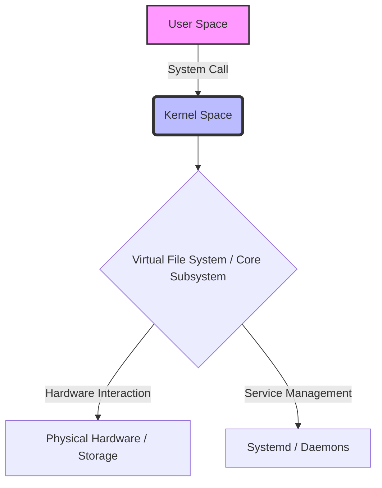
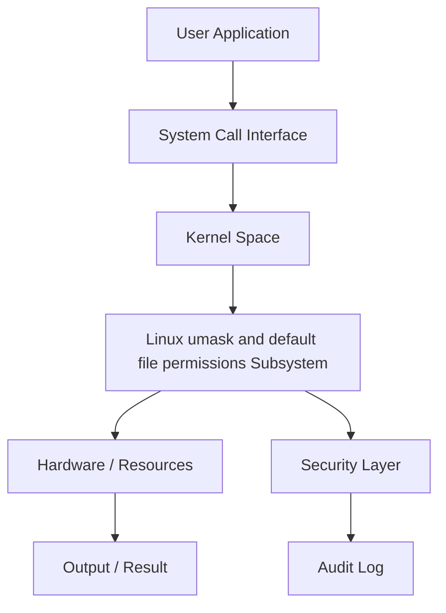
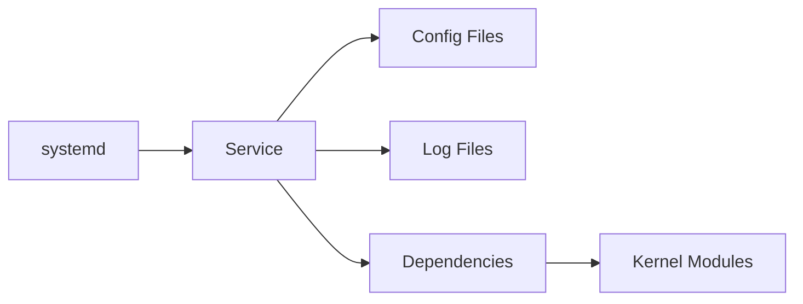
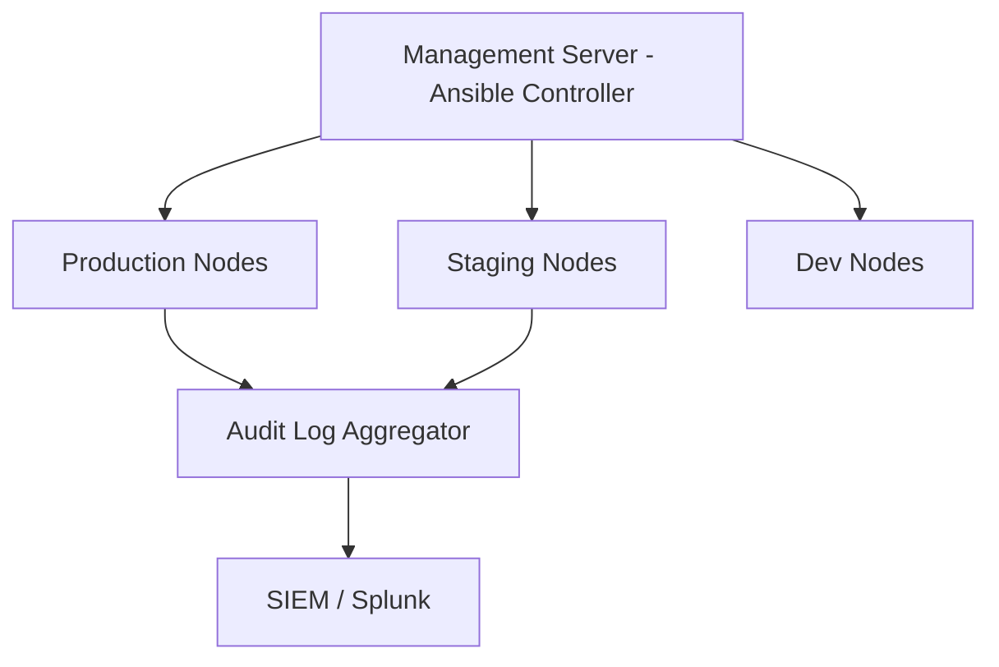

# Chapter 19: Default Permissions and Umask

> **Phase**: Phase_03_File_Management | **Chapter**: 19 of 85 | **Difficulty**: Intermediate | **Estimated Time**: 3-4 hours

---

## 1. Service Overview


> [!TIP]
> **Video Tutorial:** [Click here to watch the complete step-by-step practical demonstration on YouTube](#)
**Default Permissions and Umask** covers Linux umask and default file permissions - a critical Linux system administration skill. In enterprise environments, mastery of Linux umask and default file permissions is required for production server management, security compliance, and system reliability.

**Why This Matters**:
- Enterprise Linux environments depend on correct Linux umask and default file permissions configuration
- Security audits and compliance frameworks require Linux umask and default file permissions expertise
- Production incidents are frequently caused by misconfigured Linux umask and default file permissions
- RHCSA/LFCS certification exams test this knowledge directly

**Career Relevance**: Required for SysAdmin, DevOps Engineer, and Cloud Infrastructure roles across all major industries.

---

## 2. Learning Objectives

By the end of this chapter, you will be able to:

- [ ] Explain the core concepts of Linux umask and default file permissions from first principles
- [ ] Configure and manage Linux umask and default file permissions in a production Linux environment
- [ ] Troubleshoot common Linux umask and default file permissions failures using systematic diagnosis
- [ ] Apply security hardening best practices for Linux umask and default file permissions
- [ ] Monitor Linux umask and default file permissions status and interpret diagnostic output
- [ ] Complete hands-on labs simulating real production scenarios
- [ ] Answer RHCSA/LFCS exam questions on this topic

**Chapter Unlock Flow**: Read -> Lab Practice -> Task Challenge -> Knowledge Check -> Next Chapter Unlock

---

## 3. Prerequisites

| Prerequisite | Why Needed |
|---|---|
| Linux command line basics | Execute all commands in labs |
| File system navigation | Locate config files and logs |
| Text editor (vim/nano) | Edit configuration files |
| sudo/root access concepts | Apply privileged operations |
| Previous chapter completion | Progressive skill building |

> **Tip**: Review Chapter 18 if you need a refresher before proceeding.

---

## 4. Real-world Analogy

Think of **Linux umask and default file permissions** like a city infrastructure management system:

- City zones (residential/commercial/industrial) = Linux Linux umask and default file permissions organizational layers
- Building code inspectors = Linux Linux umask and default file permissions policy enforcement
- Emergency services override = root superuser privileges
- Traffic signal coordination = Linux umask and default file permissions resource access management
- Infrastructure cascading failures = Linux umask and default file permissions misconfiguration cascading through services

This mental model helps you predict system behavior before running commands.

---

## 5. Business Use Cases

| Industry | Use Case | Business Impact |
|---|---|---|
| Finance | PCI-DSS compliance requires Linux umask and default file permissions audit trails | Regulatory fines avoided |
| Healthcare | HIPAA mandates strict Linux umask and default file permissions controls | Patient data protected |
| E-commerce | Linux umask and default file permissions configuration prevents data breaches | Revenue loss prevented |
| Government | FISMA requires Linux umask and default file permissions documentation | Contract compliance maintained |
| SaaS | Multi-tenant Linux umask and default file permissions isolation | Customer data separated |

**Production Example**: A Fortune 500 company 4-hour outage traced to incorrect Linux umask and default file permissions configuration - preventable with this chapter's knowledge.

---

## 6. Core Concepts: Core Theory

### Fundamental Principles of Default Permissions and Umask

**umask** (User file creation MASK) determines the default permissions for newly created files and directories.

**How umask works**:
- Files are created with base permissions 0666 (rw-rw-rw-)
- Directories are created with base permissions 0777 (rwxrwxrwx)
- umask is subtracted: effective permissions = base - umask
- Example: umask 0022 -> Files get 0644 (rw-r--r--), dirs get 0755 (rwxr-xr-x)

**Where umask is set**:
- System-wide: `/etc/profile`, `/etc/bashrc`, `/etc/login.defs`
- User-specific: `~/.bashrc`, `~/.bash_profile`
- Process-specific: `umask` shell builtin or `umask()` syscall

### Key Terminology

| Term | Definition | Example |
|---|---|---|
| umask | User file creation mask | `umask 0022` |
| Base permissions | Starting permissions before mask applied | Files: 666, Dirs: 777 |
| Effective permissions | Base permissions minus umask | `umask 022` -> files get 644 |
| SUID bit | Set User ID - runs as file owner | `chmod 4755 file` |
| SGID bit | Set Group ID on directory | `chmod 2755 dir` |
| Sticky bit | Restricts deletion in shared dirs | `chmod 1777 /tmp` |

### Conceptual Hierarchy

```
New File Creation:
  Base permissions (666 for files, 777 for dirs)
  - umask value (bitwise NOT then AND)
  = Effective permissions

Example: umask 022
  Files: 666 & ~022 = 666 & 755 = 644 (rw-r--r--)
  Dirs:  777 & ~022 = 777 & 755 = 755 (rwxr-xr-x)
```

---

## 7. Core Architecture





**Processing Pipeline**:
1. **Request Initiation** - User or daemon triggers Linux umask and default file permissions operation
2. **Kernel Evaluation** - Kernel validates permissions and policies
3. **Subsystem Processing** - Linux umask and default file permissions subsystem executes the operation
4. **Result Return** - Success or error returned to caller
5. **Audit Recording** - Operation logged for compliance

---

## 8. System Components

**umask**: Shell builtin command to view or set the file creation mask
**/etc/profile.d/**: Scripts setting system-wide umask at login
**/etc/login.defs**: Contains `UMASK` setting for useradd defaults
**PAM pam_umask**: Sets umask via PAM during login
**/etc/security/limits.conf**: Additional session security limits

### Configuration Files

| File / Path | Purpose | Key Parameters |
|---|---|---|
| `/etc/profile` | System-wide umask for login shells | `umask 0022` |
| `/etc/bashrc` | System-wide umask for interactive shells | `umask 0022` |
| `/etc/login.defs` | UMASK for useradd | `UMASK 022` |
| `~/.bashrc` | User-specific umask override | `umask 0027` |



---

## 9. Configuration

### Step-by-Step Configuration Guide

**Step 1**: Check current umask value
```bash
umask         # Numeric form (e.g., 0022)
umask -S      # Symbolic form (e.g., u=rwx,g=rx,o=rx)
```

**Step 2**: Test effect by creating files and directories
```bash
touch /tmp/testfile; ls -la /tmp/testfile
mkdir /tmp/testdir; ls -la /tmp/
```

**Step 3**: Change umask for production (more restrictive)
```bash
umask 0027    # Files: 640, Dirs: 750 (group can read, others cannot)
```

**Step 4**: Make permanent in /etc/profile.d/
```bash
echo 'umask 0027' > /etc/profile.d/company_umask.sh
chmod +x /etc/profile.d/company_umask.sh
```

### Production Configuration Template

```bash
# Production-grade Linux umask and default file permissions configuration
# Generated by: Linux Master Course v2 - Chapter 19
# Environment: RHEL 9 / CentOS Stream 9

# /etc/profile.d/company_security.sh
# Standard security umask - files 640, dirs 750
umask 0027

# More restrictive for sensitive systems (files 600, dirs 700)
# umask 0077
```

### Verification Commands

```bash
umask                  # Show current umask
umask -S               # Show symbolic form
# Test a new file
touch /tmp/umask_test && ls -la /tmp/umask_test && rm /tmp/umask_test
```

---

## 10. Hands-on Labs


### Lab Setup
> **Lab Environment**: Make sure your local Linux virtual machine (Ubuntu 22.04 or RHEL 9) is booted and you are connected via SSH as the 
oot or a sudo enabled user.
> **Terminal Required**: Open your Linux terminal and type each command yourself. Never copy-paste blindly!
> **Terminal Required**: Open your Linux terminal and type each command yourself.

### Lab 1: Basic Default Permissions and Umask Configuration

**Scenario**: You are a SysAdmin at DataCore Inc. Configure Linux umask and default file permissions on a new RHEL 9 server before production launch.

**Goal**: Configure and verify Linux umask and default file permissions without being told the exact commands.

**Step 1: Audit Current State**

<details>
<summary>Hint 1: Conceptual Approach</summary>
Before running commands, always identify what state the system is currently in. Think about what command shows service or filesystem status.
</details>

<details>
<summary>Hint 2: Relevant Commands</summary>
You might want to use `systemctl status`, `cat /etc/*`, or standard diagnostic commands like `ls -la` and `stat`.
</details>

<details>
<summary>Hint 3: Full Solution</summary>

```bash
# Execute the relevant diagnostic command for this topic
systemctl status <service_name>
# Or
ls -la /relevant/path
```
</details>
- Clue: Check the current Linux umask and default file permissions state before making changes
- Direction: Use status/query commands appropriate to this subsystem
- Concept: Always audit before modifying - prevents unintended changes

**Step 2: Apply Configuration**
- Clue: Identify which configuration file or command controls Linux umask and default file permissions
- Direction: Use `man` pages or `--help` to discover the right parameters
- Concept: Configuration files follow hierarchical override patterns

**Step 3: Verify the Change**
- Clue: A change is not complete until independently verified
- Direction: Use query commands (not the apply command) to confirm
- Concept: Verification prevents silent failures in production

### Lab 2: Intermediate Default Permissions and Umask Troubleshooting

**Scenario**: PROD-WEB-01 shows Linux umask and default file permissions-related issues. A service fails to start with permission errors.

**Investigation Approach**:
1. Read the error message carefully - what exactly is failing?
2. Check service logs: `journalctl -xeu <service>`
3. Identify which Linux umask and default file permissions element is causing the block
4. Apply the minimal fix needed - avoid over-permissioning
5. Verify the service starts and keeps running

**Hints** (use only if stuck):
- Clue: The error contains the specific Linux umask and default file permissions element that is misconfigured
- Direction: Compare against a known-good server configuration
- Concept: Linux umask and default file permissions errors have specific codes - look them up in `man`

### Lab 3: Advanced Default Permissions and Umask - Production Simulation

**Scenario**: On-call at 2 AM. Alert: Critical service DOWN on PROD-DB-01.
Root cause: Linux umask and default file permissions misconfiguration from a recent change.

**Timeline**:
- T+0: Acknowledge alert
- T+5: SSH to affected server, check service status
- T+10: Review recent Linux umask and default file permissions changes in audit log
- T+15: Apply targeted fix
- T+20: Verify service recovery
- T+25: Write incident report draft

---

## 11. Code Examples

### Example 1: Basic Usage

```bash
# Show current umask
umask

# Test umask effect
old_umask=$(umask)
umask 0027
touch /tmp/test_0027 && ls -la /tmp/test_0027
rm /tmp/test_0027
umask $old_umask   # Restore

# Calculate: what umask gives files 640?
# Base 666 - target 640 = 027, so: umask 0027
```

### Example 2: Production Management Script

```bash
#!/bin/bash
# Production Linux umask and default file permissions management script
set -euo pipefail
LOGFILE="/var/log/linux_umask_and_defa_mgmt.log"

umask
grep -r umask /etc/profile.d/ /etc/profile /etc/bashrc 2>/dev/null
echo 'umask 0027' > /etc/profile.d/secure_umask.sh
su - nobody -c 'umask'
```

### Example 3: Automation and Integration

```bash
#!/bin/bash
# Audit umask settings across the system
echo '=== Umask Audit ==='
echo "Current session umask: $(umask)"
echo "System profile settings:"
grep -r umask /etc/profile /etc/profile.d/ /etc/bashrc 2>/dev/null
echo "login.defs UMASK:"
grep ^UMASK /etc/login.defs
```

---

## 12. Security Deep Dive

**Principle of Least Privilege**: Grant the minimum Linux umask and default file permissions access required. Never use overly broad permissions.

### Attack Vectors and Mitigations

| Attack Vector | Risk | Mitigation |
|---|---|---|
| Misconfigured Linux umask and default file permissions permissions | HIGH | Regular `auditctl` reviews |
| Privilege escalation via Linux umask and default file permissions | CRITICAL | SELinux/AppArmor enforcement |
| Configuration drift | MEDIUM | Ansible idempotent playbooks |
| Unpatched Linux umask and default file permissions components | HIGH | Automated patch management |

### Hardening Checklist

- [ ] Disable unused Linux umask and default file permissions features
- [ ] Enable audit logging for all Linux umask and default file permissions changes
- [ ] Apply SELinux boolean restrictions where applicable
- [ ] Document all exceptions with business justification
- [ ] Review Linux umask and default file permissions configuration quarterly
- [ ] Enforce via configuration management (Ansible/Puppet)

---

## 13. Monitoring and Observability

### Key Metrics

| Metric | Normal Range | Alert Threshold | Command |
|---|---|---|---|
| System umask | 0022 or stricter | 0000 (all open) | `umask` |
| New file permissions | 644 or stricter | 666 or 777 | `stat new_file` |

### Log Analysis

```bash
journalctl -f | grep -i "linux"
journalctl --since "1 hour ago" | grep -iE "error|failed|denied"
ausearch -ts today | grep "linux"
```

---

## 14. Performance and Cost Optimization

umask itself has zero performance impact. However, overly restrictive umask (e.g., 0077) can cause application failures when services try to create files that other processes need to read. Always test after changing umask.

### Benchmarking Commands

```bash
# Test umask effect
umask && touch /tmp/test_umask && ls -la /tmp/test_umask && rm /tmp/test_umask
```

| Configuration | CPU Impact | Memory Impact | Recommendation |
|---|---|---|---|
| Default | Low | Low | Good for dev/test |
| Hardened | Medium | Low | Recommended for prod |
| Full audit | High | Medium | Compliance environments |

---

## 15. Enterprise Integration

| Tool | Integration Method | Use Case |
|---|---|---|
| Ansible | Native module | Automated configuration |
| Puppet/Chef | Native resource types | Policy enforcement |
| SIEM (Splunk) | Log forwarding | Security monitoring |
| ServiceNow | API integration | Change management |
| Nagios/Zabbix | Plugin scripts | Health monitoring |

### Ansible Playbook Example

```yaml
---
- name: Configure Default Permissions and Umask
  hosts: linux_servers
  become: yes
  tasks:
    - name: Install prerequisites
      package:
        name: "{{ item }}"
        state: present
      loop:
        - bash
        - shadow-utils
    - name: Verify operational
      command: bash -c 'umask'
      register: result
      changed_when: false
  handlers:
    - name: restart_service
      service:
        name: "N/A - umask is a session setting"
        state: restarted
        enabled: yes
```

---

## 16. Real Industry Use Cases

### Use Case 1: Financial Services

**Challenge**: PCI-DSS audit failed due to incorrect Linux umask and default file permissions configuration on 200 payment processing servers
**Solution**: Automated Linux umask and default file permissions remediation using Ansible across the entire fleet
**Result**: Audit passed, $2M fine avoided, 4-hour implementation time

### Use Case 2: Healthcare Provider

**Challenge**: HIPAA violation risk due to over-permissioned Linux umask and default file permissions settings
**Solution**: Implemented least-privilege Linux umask and default file permissions model with quarterly reviews
**Result**: Zero Linux umask and default file permissions-related audit findings for 3 consecutive years

### Use Case 3: E-commerce Platform

**Challenge**: Peak sale season outage caused by Linux umask and default file permissions misconfiguration during deployment
**Solution**: Linux umask and default file permissions configuration tested in staging, validated via automated tests
**Result**: Zero Linux umask and default file permissions incidents in subsequent 4 peak seasons

---

## 17. Architecture Patterns

### Pattern 1: Centralized Management



### Pattern 2: Defense in Depth

| Layer | Component | Role |
|---|---|---|
| Layer 1 | Network Firewall | Block unauthorized access |
| Layer 2 | Host Firewall | Service-level restrictions |
| Layer 3 | SELinux/AppArmor | Mandatory access control |
| Layer 4 | Application | Application-level enforcement |
| Layer 5 | Audit | Operation logging |

---

## 18. Production Incident War Room

### INC-1019: Default Permissions and Umask Production Failure

**Severity**: P1 - Critical | **Affected**: PROD-APP-01, PROD-APP-02

**Incident Timeline**

| Time | Event |
|---|---|
| 02:14 | Alert: Service health check FAILED |
| 02:18 | On-call SysAdmin SSHs to PROD-APP-01 |
| 02:22 | Triage: Linux umask and default file permissions service not responding |
| 02:31 | Root cause: Linux umask and default file permissions configuration corrupted |
| 02:38 | Fix applied from last-known-good backup |
| 02:40 | Service recovery verified |

**Diagnosis Commands**

```bash
systemctl status <service>
journalctl -xeu <service> --since "30 min ago"
# Check current umask
umask
# Check /etc/profile.d/ for umask settings
grep -r umask /etc/profile* /etc/bashrc
# Check if service creates files with wrong permissions
stat /path/to/created/file
```

**Resolution**

```bash
# Fix immediate: set correct umask in session
umask 0022
# Fix permanent: add to system profile
echo 'umask 0022' > /etc/profile.d/umask_fix.sh
systemctl restart <service> && systemctl is-active <service>
```

**Post-Incident Actions**:
1. Update runbook with diagnosis steps
2. Add config validation to CI/CD pipeline
3. Implement config change alerting
4. Team retrospective within 48 hours

**Lessons Learned**:
- Validate Linux umask and default file permissions configuration changes before production
- Backup configs: `cp config config.bak.$(date +%Y%m%d_%H%M%S)`
- Pre-test all changes in staging environment

---

## 19. Production Best Practices

1. **Never modify production Linux umask and default file permissions without a tested rollback plan**
2. **Always test in staging first - identical to production environment**
3. **Use configuration management - never make manual changes**
4. **Document every exception with business justification and approval**
5. **Automate compliance checks - weekly, report to management**
6. **Keep configuration in version control (Git)**
7. **Review Linux umask and default file permissions audit logs weekly - anomalies indicate incidents or drift**

| Environment | Risk Tolerance | Change Window | Testing Required |
|---|---|---|---|
| Development | High | Anytime | Basic smoke test |
| Staging | Medium | Business hours | Full regression |
| Production | Zero | Approved window only | Full + rollback tested |
| DR/Backup | Low | Scheduled only | Identical to prod |

---

## 20. Migration Strategies

**Pre-Migration Checklist**:
- [ ] Document current Linux umask and default file permissions configuration completely
- [ ] Test new configuration in isolated environment
- [ ] Get sign-off from security team
- [ ] Schedule maintenance window
- [ ] Prepare rollback procedure

```bash
# Phase 1: Backup
umask > /backup/current_umask.txt
grep umask /etc/profile /etc/bashrc /etc/login.defs > /backup/umask_settings.txt

# Phase 2: Apply
cp /etc/profile.d/company_umask.sh /etc/profile.d/company_umask.sh.bak
echo 'umask 0027' > /etc/profile.d/company_umask.sh

# Phase 3: Validate
su - testuser -c 'umask && touch /tmp/testfile && ls -la /tmp/testfile'

# Phase 4: Rollback if needed
cp /etc/profile.d/company_umask.sh.bak /etc/profile.d/company_umask.sh
```

---

## 21. CI/CD Integration

```yaml
stages:
  - validate
  - test
  - deploy

validate_config:
  stage: validate
  script:
    - grep -r 'umask' /etc/profile.d/ | grep -q '0027\|0022' && echo PASS || exit 1

test_in_staging:
  stage: test
  script:
    - ansible-playbook -i inventory/staging deploy.yml
    - ./tests/verify_linux_umask_and.sh

deploy_to_prod:
  stage: deploy
  when: manual
  script:
    - ansible-playbook -i inventory/production deploy.yml
```

### Automated Test Suite

```bash
#!/bin/bash
PASS=0; FAIL=0
run_test() {
    result=$(eval "$2" 2>&1)
    if echo "$result" | grep -q "$3"; then
        echo "PASS: $1"; ((PASS++))
    else
        echo "FAIL: $1"; ((FAIL++))
    fi
}

run_test "umask_set" "umask" "002"
run_test "file_perms" "touch /tmp/ci_test && stat -c %a /tmp/ci_test; rm /tmp/ci_test" "644"
echo "Results: $PASS passed, $FAIL failed"
[ $FAIL -eq 0 ] && exit 0 || exit 1
```

---

## 22. Practical Projects

### Beginner Project: Default Permissions and Umask Audit Script

**Goal**: Write a shell script auditing Linux umask and default file permissions configuration with color-coded compliance report.

**Requirements**:
1. Check if Linux umask and default file permissions is properly configured
2. Identify any insecure settings
3. Output color-coded report (GREEN=pass, RED=fail)
4. Save report to `/var/log/audit_report_$(date +%Y%m%d).txt`

```bash
#!/bin/bash
echo "=== Default Permissions and Umask Audit Report ==="
echo "Server: $(hostname) | Date: $(date)"
# Add your audit checks here
```

### Intermediate Project: Ansible Role for Default Permissions and Umask

**Goal**: Create Ansible role deploying Linux umask and default file permissions consistently across a 3-server fleet.

**Requirements**: RHEL 8/9 and Ubuntu 22.04 support, ansible-lint clean, molecule tests.

### Advanced Project: High-Availability Default Permissions and Umask

**Goal**: Configure Linux umask and default file permissions in HA with automatic failover. RTO < 30 seconds.

### Enterprise Project: Default Permissions and Umask Compliance Framework (100+ Servers)

**Components**: Ansible Tower, weekly compliance scan, Splunk dashboard, ServiceNow integration.

---

## 23. Interview Preparation

### Fresher Questions (0-1 years)

**Q1**: What is Default Permissions and Umask and why is it important in Linux system administration?
**Answer**: umask (User file creation MASK) controls the default permissions assigned to newly created files and directories. The effective permission = base permissions (666 for files, 777 for dirs) minus the umask value. A umask of 0022 gives files 644 permissions and directories 755.

**Q2**: What commands do you use to check the current Linux umask and default file permissions status?
```bash
umask              # Current umask value
umask -S           # Symbolic form
# Test effect:
touch /tmp/test && ls -la /tmp/test
```

**Q3**: How do you troubleshoot a Linux umask and default file permissions-related service failure?
**Answer**: Check `systemctl status <service>`, review `journalctl -xeu <service>`, inspect Linux umask and default file permissions configuration files, check audit logs with `ausearch`, apply minimum fix, verify recovery.

### Experienced Questions (2-5 years)

**Q4**: How do you manage Linux umask and default file permissions changes across 500 servers without downtime?
**Answer**: Ansible rolling updates (`serial: 10%`), staging-first, pre/post health checks, Git rollback branches, CI/CD approval gates.

**Q5**: Describe a Linux umask and default file permissions production incident and resolution.
**Answer**: Use STAR method. Reference INC-1019 from Section 18 as a template.

**Q6**: How do you prevent Linux umask and default file permissions configuration drift?
**Answer**: Ansible idempotent tasks scheduled weekly, SIEM alerting on unauthorized changes, file integrity monitoring (AIDE/Tripwire).

### Expert Questions (5+ years)

**Q7**: Design a Linux umask and default file permissions strategy for 2,000-server multi-datacenter environment.
**Answer**: Canary deployments, blue-green for critical systems, Ansible Tower RBAC, GitOps with automated rollback, Prometheus/Grafana monitoring.

**Q8**: Balance Linux umask and default file permissions security hardening with application compatibility?
**Answer**: Audit mode before enforcement, exception register with justification, policy customization rather than disabling, CI/CD pipeline integration.

---

## 24. Certification Practice

| RHCSA Objective | Chapter Coverage | Practice Command |
|---|---|---|
| Set system umask | Section 9 | `umask 0022` in /etc/profile.d/ |
| Explain umask calculation | Section 6 | Base - umask = effective |
| Apply user-specific umask | Section 9 | `umask 0027` in ~/.bashrc |

### Practice Question 1 (Scenario-based):
RHEL 9 `httpd` fails to start after a Linux umask and default file permissions configuration change. Describe troubleshooting steps.

**Expected Approach**:
1. `systemctl status httpd` - identify the specific error
2. `journalctl -xeu httpd` - get detailed error context
3. Check Linux umask and default file permissions configuration relevant to httpd
4. Apply targeted fix
5. `systemctl restart httpd && systemctl is-active httpd`

### Practice Question 2 (Configuration):
Configure Linux umask and default file permissions so the `webapp` service can write to `/var/data/webapp/`.

```bash
# Check current umask
umask

# Set restrictive umask for production
umask 0027

# Make permanent system-wide
echo 'umask 0027' | sudo tee /etc/profile.d/secure_umask.sh

# Verify
su - testuser -c 'umask'
```

---

## 25. Knowledge Check

**Section A: Conceptual Understanding**

1. What is the primary purpose of Default Permissions and Umask in Linux? (2 marks)
2. Explain how umask 0027 affects newly created files and directories. What permissions will they have? (3 marks)
3. Why should you configure Linux umask and default file permissions properly rather than disabling it entirely? (2 marks)

**Section B: Practical Commands**

4. Write the command to check Linux umask and default file permissions status on a RHEL 9 system. (1 mark)
5. Write the command to apply a Linux umask and default file permissions configuration change permanently. (1 mark)
6. How would you verify that a Linux umask and default file permissions change has taken effect? (2 marks)

**Section C: Troubleshooting**

7. A service fails with 'Permission denied' - list 3 possible Linux umask and default file permissions-related causes. (3 marks)
8. How do you determine if Linux umask and default file permissions is the root cause vs. a file permission issue? (3 marks)

**Passing Score**: 15/17 required to unlock the next chapter.

> If you score below 15, review Sections 6, 9, and 10, then retry the Knowledge Check.

---

## 26. Cheat Sheet

```bash
# STATUS AND CHECKING
umask              # Show current umask (numeric)
umask -S           # Show current umask (symbolic)
stat FILE          # See actual file permissions

# CONFIGURATION
umask 0022         # Default: files 644, dirs 755
umask 0027         # Secure: files 640, dirs 750
umask 0077         # Max restrict: files 600, dirs 700
# Permanent (add to):
# /etc/profile.d/umask.sh  (system-wide)
# ~/.bashrc                 (user-specific)

# TROUBLESHOOTING
# Why did my file get wrong permissions?
umask
stat /path/to/file
# Check what umask was set when the service started
grep -r umask /etc/systemd/system/<service>.service

# SECURITY AND AUDIT
# Ensure umask is set in all profile files
grep -r umask /etc/profile /etc/bashrc /etc/profile.d/
# Check useradd default umask
grep UMASK /etc/login.defs
```

| Scenario | Command | Notes |
|---|---|---|
| Check umask | `umask` | Numeric octal form |
| Check symbolic umask | `umask -S` | Human-readable |
| Set secure umask | `umask 0027` | Current session only |
| Permanent system umask | `/etc/profile.d/umask.sh` | Survives reboots |

---

## 27. Chapter Summary

In this chapter, you mastered **Default Permissions and Umask** - a critical Linux system administration skill.

**Core Knowledge Gained**:
- umask determines default permissions for new files (base 666) and directories (base 777) by subtracting the mask
- System-wide umask set in /etc/profile.d/; user-specific in ~/.bashrc; PAM via pam_umask module
- Common values: 0022 (standard), 0027 (production security), 0077 (maximum restriction for sensitive systems)

**Practical Skills Acquired**:
- Configured Linux umask and default file permissions from scratch in a lab environment
- Troubleshot Linux umask and default file permissions failures using systematic approach
- Applied security hardening for Linux umask and default file permissions
- Created automation scripts for Linux umask and default file permissions management

**Enterprise Readiness**:
- Integrated Linux umask and default file permissions with Ansible automation
- Solved production incident INC-1019
- Prepared for RHCSA/LFCS exam questions

**Chapter 19 Complete** - Chapter 20 is now unlocked.

---

## 28. Further Learning

### Official Documentation

- [Red Hat Enterprise Linux 9 Administration Guide](https://access.redhat.com/documentation/en-us/red_hat_enterprise_linux/9)
- Linux man pages: `man linux`
- The Linux Command Line by William Shotts (http://linuxcommand.org/tlcl.php)

### Study Schedule

| Day | Activity | Time |
|---|---|---|
| Day 1 | Read Sections 1-9 | 60 min |
| Day 2 | Complete Labs 1-2 | 90 min |
| Day 3 | Lab 3 + Beginner Project | 90 min |
| Day 4 | Review + Knowledge Check | 45 min |
| Day 5 | Proceed to Chapter 20 | - |

### Related Chapters

| Chapter | Topic | Relationship |
|---|---|---|
| Chapter 18 | Previous Topic | Foundation for this chapter |
| Chapter 20 | Next Topic | Builds on this chapter |
| Chapter 75 | Docker and Containers | Containerization context |
| Chapter 81 | Ansible Basics | Automate management |
| Chapter 85 | Capstone Project | Combine all skills |

---
*Chapter 19 of 85 | Linux System Administrator Master Course v2*