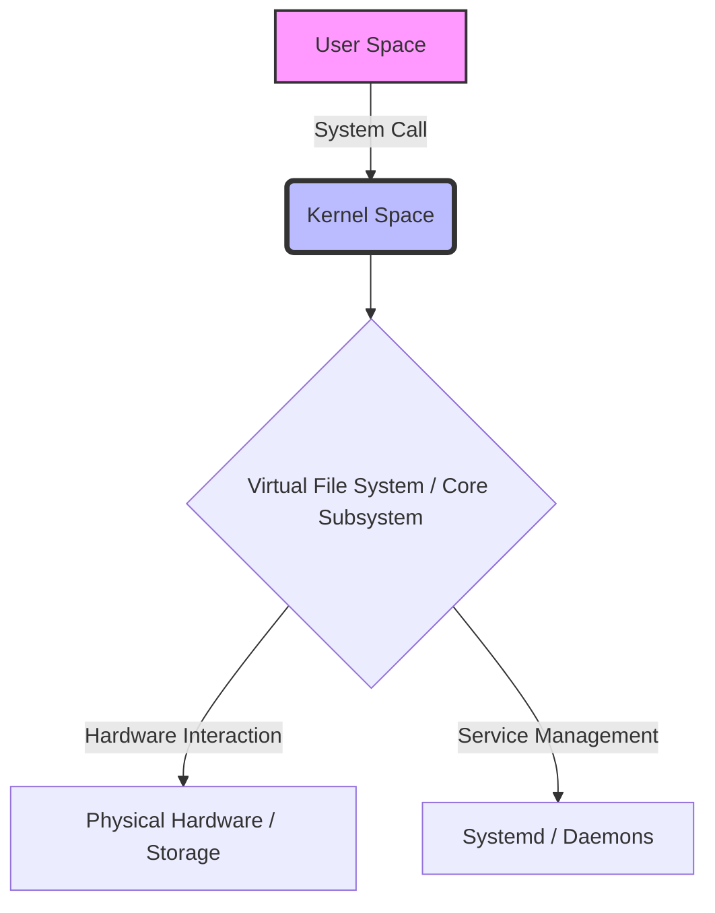
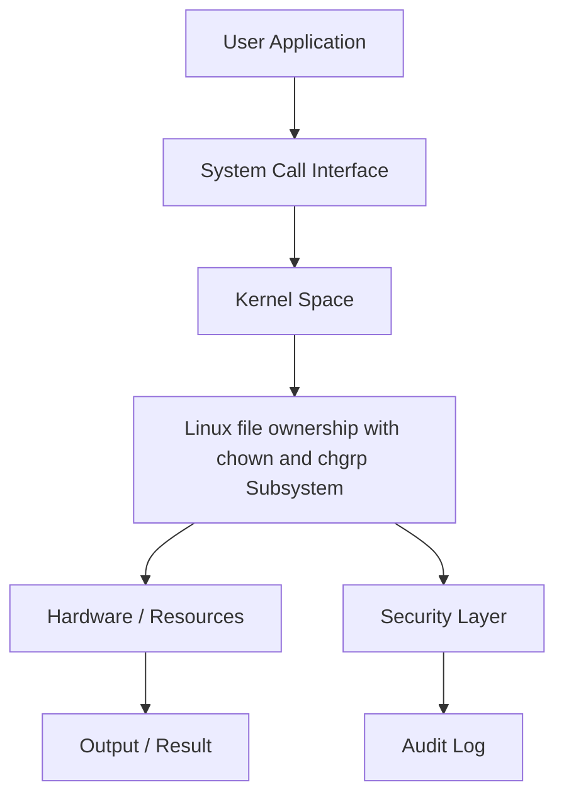
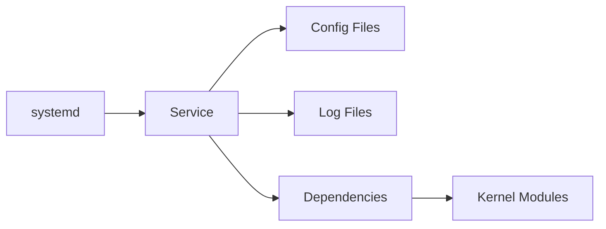
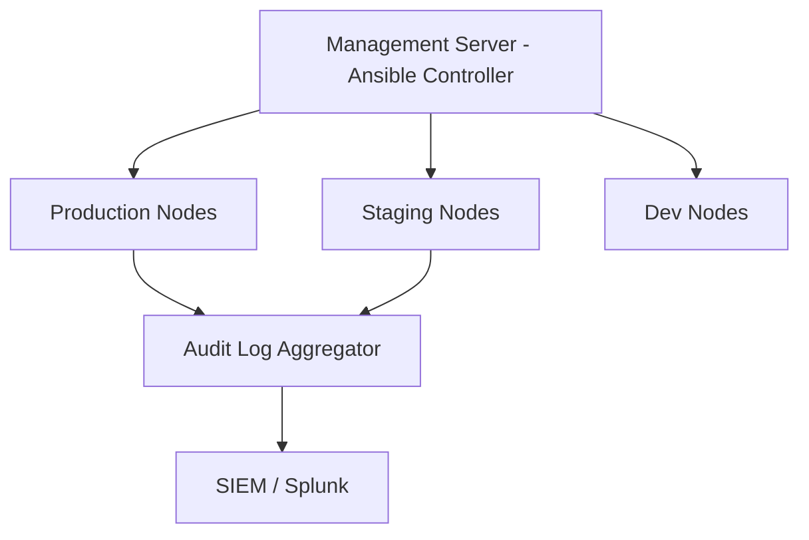

# Chapter 20: File Ownership: chown and chgrp

> **Phase**: Phase_03_File_Management | **Chapter**: 20 of 85 | **Difficulty**: Intermediate | **Estimated Time**: 3-4 hours

---

## 1. Service Overview


> [!TIP]
> **Video Tutorial:** [Click here to watch the complete step-by-step practical demonstration on YouTube](#)
**File Ownership: chown and chgrp** covers Linux file ownership with chown and chgrp - a critical Linux system administration skill. In enterprise environments, mastery of Linux file ownership with chown and chgrp is required for production server management, security compliance, and system reliability.

**Why This Matters**:
- Enterprise Linux environments depend on correct Linux file ownership with chown and chgrp configuration
- Security audits and compliance frameworks require Linux file ownership with chown and chgrp expertise
- Production incidents are frequently caused by misconfigured Linux file ownership with chown and chgrp
- RHCSA/LFCS certification exams test this knowledge directly

**Career Relevance**: Required for SysAdmin, DevOps Engineer, and Cloud Infrastructure roles across all major industries.

---

## 2. Learning Objectives

By the end of this chapter, you will be able to:

- [ ] Explain the core concepts of Linux file ownership with chown and chgrp from first principles
- [ ] Configure and manage Linux file ownership with chown and chgrp in a production Linux environment
- [ ] Troubleshoot common Linux file ownership with chown and chgrp failures using systematic diagnosis
- [ ] Apply security hardening best practices for Linux file ownership with chown and chgrp
- [ ] Monitor Linux file ownership with chown and chgrp status and interpret diagnostic output
- [ ] Complete hands-on labs simulating real production scenarios
- [ ] Answer RHCSA/LFCS exam questions on this topic

**Chapter Unlock Flow**: Read -> Lab Practice -> Task Challenge -> Knowledge Check -> Next Chapter Unlock

---

## 3. Prerequisites

| Prerequisite | Why Needed |
|---|---|
| Linux command line basics | Execute all commands in labs |
| File system navigation | Locate config files and logs |
| Text editor (vim/nano) | Edit configuration files |
| sudo/root access concepts | Apply privileged operations |
| Previous chapter completion | Progressive skill building |

> **Tip**: Review Chapter 19 if you need a refresher before proceeding.

---

## 4. Real-world Analogy

Think of **Linux file ownership with chown and chgrp** like a city infrastructure management system:

- City zones (residential/commercial/industrial) = Linux Linux file ownership with chown and chgrp organizational layers
- Building code inspectors = Linux Linux file ownership with chown and chgrp policy enforcement
- Emergency services override = root superuser privileges
- Traffic signal coordination = Linux file ownership with chown and chgrp resource access management
- Infrastructure cascading failures = Linux file ownership with chown and chgrp misconfiguration cascading through services

This mental model helps you predict system behavior before running commands.

---

## 5. Business Use Cases

| Industry | Use Case | Business Impact |
|---|---|---|
| Finance | PCI-DSS compliance requires Linux file ownership with chown and chgrp audit trails | Regulatory fines avoided |
| Healthcare | HIPAA mandates strict Linux file ownership with chown and chgrp controls | Patient data protected |
| E-commerce | Linux file ownership with chown and chgrp configuration prevents data breaches | Revenue loss prevented |
| Government | FISMA requires Linux file ownership with chown and chgrp documentation | Contract compliance maintained |
| SaaS | Multi-tenant Linux file ownership with chown and chgrp isolation | Customer data separated |

**Production Example**: A Fortune 500 company 4-hour outage traced to incorrect Linux file ownership with chown and chgrp configuration - preventable with this chapter's knowledge.

---

## 6. Core Concepts: Core Theory

### Fundamental Principles of File Ownership: chown and chgrp

**File Ownership** in Linux: Every file and directory has two ownership attributes:
1. **User Owner**: The user who owns the file (controls read/write/execute based on owner permissions)
2. **Group Owner**: The group that owns the file (members get group-level permissions)

**chown**: Changes user owner and optionally group owner of a file/directory
**chgrp**: Changes group owner only

**Root required**: Only root (or sudo) can change file ownership. A regular user can change group ownership to any group they belong to.

**Why it matters**: Wrong ownership causes service failures, security vulnerabilities, and audit compliance violations.

### Key Terminology

| Term | Definition | Example |
|---|---|---|
| User owner | The user who owns a file | `ls -l` shows owner in 3rd field |
| Group owner | The group that owns a file | `ls -l` shows group in 4th field |
| chown | Change owner (and optionally group) | `chown root:wheel file` |
| chgrp | Change group owner only | `chgrp devs file` |
| Effective UID | UID used for permission checks | `id` command |
| Setuid/Setgid | Special bits affecting ownership during execution | `chmod u+s file` |

### Conceptual Hierarchy

```
File Ownership Hierarchy:
  root (UID 0)     - can own any file, change any ownership
  Named User       - owns files they create
  Named Group      - group-level access control
  Supplementary Groups - user can belong to multiple groups
```

---

## 7. Core Architecture





**Processing Pipeline**:
1. **Request Initiation** - User or daemon triggers Linux file ownership with chown and chgrp operation
2. **Kernel Evaluation** - Kernel validates permissions and policies
3. **Subsystem Processing** - Linux file ownership with chown and chgrp subsystem executes the operation
4. **Result Return** - Success or error returned to caller
5. **Audit Recording** - Operation logged for compliance

---

## 8. System Components

**chown command**: `/usr/bin/chown` - change file user (and optionally group) ownership
**chgrp command**: `/usr/bin/chgrp` - change file group ownership
**/etc/passwd**: Maps UIDs to usernames
**/etc/group**: Maps GIDs to group names
**inode**: Stores UID/GID of file owner

### Configuration Files

| File / Path | Purpose | Key Parameters |
|---|---|---|
| `/etc/passwd` | UID to username mapping | Used by chown for name lookups |
| `/etc/group` | GID to group name mapping | Used by chgrp for name lookups |
| `/etc/shadow` | Password aging (affects ownership policies) | Security-sensitive |



---

## 9. Configuration

### Step-by-Step Configuration Guide

**Step 1**: Check current ownership
```bash
ls -la /var/www/html/
stat /var/www/html/index.html
```

**Step 2**: Change user and group ownership
```bash
chown apache:apache /var/www/html/
chown -R apache:apache /var/www/html/   # Recursive
```

**Step 3**: Change only group ownership
```bash
chgrp developers /var/data/project/
```

**Step 4**: Verify the change
```bash
ls -la /var/www/html/
stat /var/www/html/
```

### Production Configuration Template

```bash
# Production-grade Linux file ownership with chown and chgrp configuration
# Generated by: Linux Master Course v2 - Chapter 20
# Environment: RHEL 9 / CentOS Stream 9

# Standard web server ownership
chown -R apache:apache /var/www/html/

# Application deployment ownership
chown -R appuser:appgroup /opt/myapp/

# Shared directory (sgid to maintain group)
chown -R root:devteam /var/data/shared/
chmod g+s /var/data/shared/  # SGID preserves group for new files
```

### Verification Commands

```bash
ls -la /var/www/html/          # Show owner:group
stat /var/www/html/index.html  # Detailed ownership info
id apache                      # Verify user exists
```

---

## 10. Hands-on Labs


### Lab Setup
> **Lab Environment**: Make sure your local Linux virtual machine (Ubuntu 22.04 or RHEL 9) is booted and you are connected via SSH as the 
oot or a sudo enabled user.
> **Terminal Required**: Open your Linux terminal and type each command yourself. Never copy-paste blindly!
> **Terminal Required**: Open your Linux terminal and type each command yourself.

### Lab 1: Basic File Ownership: chown and chgrp Configuration

**Scenario**: You are a SysAdmin at DataCore Inc. Configure Linux file ownership with chown and chgrp on a new RHEL 9 server before production launch.

**Goal**: Configure and verify Linux file ownership with chown and chgrp without being told the exact commands.

**Step 1: Audit Current State**

<details>
<summary>Hint 1: Conceptual Approach</summary>
Before running commands, always identify what state the system is currently in. Think about what command shows service or filesystem status.
</details>

<details>
<summary>Hint 2: Relevant Commands</summary>
You might want to use `systemctl status`, `cat /etc/*`, or standard diagnostic commands like `ls -la` and `stat`.
</details>

<details>
<summary>Hint 3: Full Solution</summary>

```bash
# Execute the relevant diagnostic command for this topic
systemctl status <service_name>
# Or
ls -la /relevant/path
```
</details>
- Clue: Check the current Linux file ownership with chown and chgrp state before making changes
- Direction: Use status/query commands appropriate to this subsystem
- Concept: Always audit before modifying - prevents unintended changes

**Step 2: Apply Configuration**
- Clue: Identify which configuration file or command controls Linux file ownership with chown and chgrp
- Direction: Use `man` pages or `--help` to discover the right parameters
- Concept: Configuration files follow hierarchical override patterns

**Step 3: Verify the Change**
- Clue: A change is not complete until independently verified
- Direction: Use query commands (not the apply command) to confirm
- Concept: Verification prevents silent failures in production

### Lab 2: Intermediate File Ownership: chown and chgrp Troubleshooting

**Scenario**: PROD-WEB-01 shows Linux file ownership with chown and chgrp-related issues. A service fails to start with permission errors.

**Investigation Approach**:
1. Read the error message carefully - what exactly is failing?
2. Check service logs: `journalctl -xeu <service>`
3. Identify which Linux file ownership with chown and chgrp element is causing the block
4. Apply the minimal fix needed - avoid over-permissioning
5. Verify the service starts and keeps running

**Hints** (use only if stuck):
- Clue: The error contains the specific Linux file ownership with chown and chgrp element that is misconfigured
- Direction: Compare against a known-good server configuration
- Concept: Linux file ownership with chown and chgrp errors have specific codes - look them up in `man`

### Lab 3: Advanced File Ownership: chown and chgrp - Production Simulation

**Scenario**: On-call at 2 AM. Alert: Critical service DOWN on PROD-DB-01.
Root cause: Linux file ownership with chown and chgrp misconfiguration from a recent change.

**Timeline**:
- T+0: Acknowledge alert
- T+5: SSH to affected server, check service status
- T+10: Review recent Linux file ownership with chown and chgrp changes in audit log
- T+15: Apply targeted fix
- T+20: Verify service recovery
- T+25: Write incident report draft

---

## 11. Code Examples

### Example 1: Basic Usage

```bash
# Check current ownership
ls -la /var/www/html/

# Change user and group owner
chown apache:apache /var/www/html/index.html

# Recursive ownership change for web root
chown -R apache:apache /var/www/html/

# Change group only (e.g., for shared directory)
chgrp devteam /var/data/shared/
chmod g+s /var/data/shared/  # Maintain group for new files
```

### Example 2: Production Management Script

```bash
#!/bin/bash
# Production Linux file ownership with chown and chgrp management script
set -euo pipefail
LOGFILE="/var/log/linux_file_ownership_mgmt.log"

find /var/www -not -user apache 2>/dev/null | head -5
chown -R apache:apache /var/www/html/
stat -c '%U:%G' /var/www/html
```

### Example 3: Automation and Integration

```bash
#!/bin/bash
# Fix ownership across web applications
APPS=("/var/www/app1:www-data:www-data" "/var/www/app2:apache:apache" "/opt/myapp:appuser:appgroup")

for entry in "${APPS[@]}"; do
    IFS=':' read -r path user group <<< "$entry"
    echo "Fixing: $path -> $user:$group"
    chown -R "$user:$group" "$path"
    echo "Done: $(ls -ld $path | awk '{print $3,$4}')"
done
```

---

## 12. Security Deep Dive

**Principle of Least Privilege**: Grant the minimum Linux file ownership with chown and chgrp access required. Never use overly broad permissions.

### Attack Vectors and Mitigations

| Attack Vector | Risk | Mitigation |
|---|---|---|
| Misconfigured Linux file ownership with chown and chgrp permissions | HIGH | Regular `auditctl` reviews |
| Privilege escalation via Linux file ownership with chown and chgrp | CRITICAL | SELinux/AppArmor enforcement |
| Configuration drift | MEDIUM | Ansible idempotent playbooks |
| Unpatched Linux file ownership with chown and chgrp components | HIGH | Automated patch management |

### Hardening Checklist

- [ ] Disable unused Linux file ownership with chown and chgrp features
- [ ] Enable audit logging for all Linux file ownership with chown and chgrp changes
- [ ] Apply SELinux boolean restrictions where applicable
- [ ] Document all exceptions with business justification
- [ ] Review Linux file ownership with chown and chgrp configuration quarterly
- [ ] Enforce via configuration management (Ansible/Puppet)

---

## 13. Monitoring and Observability

### Key Metrics

| Metric | Normal Range | Alert Threshold | Command |
|---|---|---|---|
| Files with root ownership in /home | 0 | > 0 | `find /home -user root -type f` |
| World-writable files | 0 | > 0 | `find / -xdev -perm -o+w` |
| Orphaned files (no owner) | 0 | > 0 | `find / -xdev -nouser` |

### Log Analysis

```bash
journalctl -f | grep -i "linux"
journalctl --since "1 hour ago" | grep -iE "error|failed|denied"
ausearch -ts today | grep "linux"
```

---

## 14. Performance and Cost Optimization

**Recursive chown performance**: On large directory trees (millions of files), `chown -R` can take minutes. Use `find -exec chown` with parallel processing for large migrations. For NFS-mounted volumes, ownership changes may require NFS uid mapping configuration.

### Benchmarking Commands

```bash
# Time a recursive ownership change
time chown -R apache:apache /var/www/html/

# Find orphaned files efficiently
find / -xdev -nouser -o -nogroup 2>/dev/null
```

| Configuration | CPU Impact | Memory Impact | Recommendation |
|---|---|---|---|
| Default | Low | Low | Good for dev/test |
| Hardened | Medium | Low | Recommended for prod |
| Full audit | High | Medium | Compliance environments |

---

## 15. Enterprise Integration

| Tool | Integration Method | Use Case |
|---|---|---|
| Ansible | Native module | Automated configuration |
| Puppet/Chef | Native resource types | Policy enforcement |
| SIEM (Splunk) | Log forwarding | Security monitoring |
| ServiceNow | API integration | Change management |
| Nagios/Zabbix | Plugin scripts | Health monitoring |

### Ansible Playbook Example

```yaml
---
- name: Configure File Ownership: chown and chgrp
  hosts: linux_servers
  become: yes
  tasks:
    - name: Install prerequisites
      package:
        name: "{{ item }}"
        state: present
      loop:
        - coreutils
        - shadow-utils
    - name: Verify operational
      command: stat -c '%U:%G' /var/www/html
      register: result
      changed_when: false
  handlers:
    - name: restart_service
      service:
        name: "httpd"
        state: restarted
        enabled: yes
```

---

## 16. Real Industry Use Cases

### Use Case 1: Financial Services

**Challenge**: PCI-DSS audit failed due to incorrect Linux file ownership with chown and chgrp configuration on 200 payment processing servers
**Solution**: Automated Linux file ownership with chown and chgrp remediation using Ansible across the entire fleet
**Result**: Audit passed, $2M fine avoided, 4-hour implementation time

### Use Case 2: Healthcare Provider

**Challenge**: HIPAA violation risk due to over-permissioned Linux file ownership with chown and chgrp settings
**Solution**: Implemented least-privilege Linux file ownership with chown and chgrp model with quarterly reviews
**Result**: Zero Linux file ownership with chown and chgrp-related audit findings for 3 consecutive years

### Use Case 3: E-commerce Platform

**Challenge**: Peak sale season outage caused by Linux file ownership with chown and chgrp misconfiguration during deployment
**Solution**: Linux file ownership with chown and chgrp configuration tested in staging, validated via automated tests
**Result**: Zero Linux file ownership with chown and chgrp incidents in subsequent 4 peak seasons

---

## 17. Architecture Patterns

### Pattern 1: Centralized Management



### Pattern 2: Defense in Depth

| Layer | Component | Role |
|---|---|---|
| Layer 1 | Network Firewall | Block unauthorized access |
| Layer 2 | Host Firewall | Service-level restrictions |
| Layer 3 | SELinux/AppArmor | Mandatory access control |
| Layer 4 | Application | Application-level enforcement |
| Layer 5 | Audit | Operation logging |

---

## 18. Production Incident War Room

### INC-1020: File Ownership: chown and chgrp Production Failure

**Severity**: P1 - Critical | **Affected**: PROD-APP-01, PROD-APP-02

**Incident Timeline**

| Time | Event |
|---|---|
| 02:14 | Alert: Service health check FAILED |
| 02:18 | On-call SysAdmin SSHs to PROD-APP-01 |
| 02:22 | Triage: Linux file ownership with chown and chgrp service not responding |
| 02:31 | Root cause: Linux file ownership with chown and chgrp configuration corrupted |
| 02:38 | Fix applied from last-known-good backup |
| 02:40 | Service recovery verified |

**Diagnosis Commands**

```bash
systemctl status <service>
journalctl -xeu <service> --since "30 min ago"
# Check ownership of failing path
ls -la /failing/path/
stat /failing/path/

# Find files owned by wrong user
find /var/www -not -user apache -type f 2>/dev/null | head -20
```

**Resolution**

```bash
# Fix web server ownership
chown -R apache:apache /var/www/html/

# Fix application ownership
chown -R appuser:appgroup /opt/myapp/

# Verify service can access files
systemctl restart httpd && systemctl status httpd
systemctl restart <service> && systemctl is-active <service>
```

**Post-Incident Actions**:
1. Update runbook with diagnosis steps
2. Add config validation to CI/CD pipeline
3. Implement config change alerting
4. Team retrospective within 48 hours

**Lessons Learned**:
- Validate Linux file ownership with chown and chgrp configuration changes before production
- Backup configs: `cp config config.bak.$(date +%Y%m%d_%H%M%S)`
- Pre-test all changes in staging environment

---

## 19. Production Best Practices

1. **Never modify production Linux file ownership with chown and chgrp without a tested rollback plan**
2. **Always test in staging first - identical to production environment**
3. **Use configuration management - never make manual changes**
4. **Document every exception with business justification and approval**
5. **Automate compliance checks - weekly, report to management**
6. **Keep configuration in version control (Git)**
7. **Review Linux file ownership with chown and chgrp audit logs weekly - anomalies indicate incidents or drift**

| Environment | Risk Tolerance | Change Window | Testing Required |
|---|---|---|---|
| Development | High | Anytime | Basic smoke test |
| Staging | Medium | Business hours | Full regression |
| Production | Zero | Approved window only | Full + rollback tested |
| DR/Backup | Low | Scheduled only | Identical to prod |

---

## 20. Migration Strategies

**Pre-Migration Checklist**:
- [ ] Document current Linux file ownership with chown and chgrp configuration completely
- [ ] Test new configuration in isolated environment
- [ ] Get sign-off from security team
- [ ] Schedule maintenance window
- [ ] Prepare rollback procedure

```bash
# Phase 1: Backup
# Record current ownership
find /var/www -printf '%U %G %p\n' > /backup/ownership_$(date +%Y%m%d).txt

# Phase 2: Apply
# Apply ownership from Ansible
ansible-playbook -i inventory ownership_fix.yml

# Phase 3: Validate
stat -c '%U:%G' /var/www/html && ls -la /var/www/html/

# Phase 4: Rollback if needed
# Restore from recorded ownership
awk '{print $3}' /backup/ownership.txt | while read f; do chown $(awk -v f="$f" '$3==f {print $1":"$2}' /backup/ownership.txt) "$f"; done
```

---

## 21. CI/CD Integration

```yaml
stages:
  - validate
  - test
  - deploy

validate_config:
  stage: validate
  script:
    - stat -c '%U:%G' /var/www/html | grep -q 'apache:apache' && echo PASS || exit 1

test_in_staging:
  stage: test
  script:
    - ansible-playbook -i inventory/staging deploy.yml
    - ./tests/verify_linux_file_owne.sh

deploy_to_prod:
  stage: deploy
  when: manual
  script:
    - ansible-playbook -i inventory/production deploy.yml
```

### Automated Test Suite

```bash
#!/bin/bash
PASS=0; FAIL=0
run_test() {
    result=$(eval "$2" 2>&1)
    if echo "$result" | grep -q "$3"; then
        echo "PASS: $1"; ((PASS++))
    else
        echo "FAIL: $1"; ((FAIL++))
    fi
}

run_test "webroot_owner" "stat -c '%U' /var/www/html" "apache"
run_test "no_orphaned_files" "find /var/www -xdev -nouser 2>/dev/null | wc -l" "^0$"
echo "Results: $PASS passed, $FAIL failed"
[ $FAIL -eq 0 ] && exit 0 || exit 1
```

---

## 22. Practical Projects

### Beginner Project: File Ownership: chown and chgrp Audit Script

**Goal**: Write a shell script auditing Linux file ownership with chown and chgrp configuration with color-coded compliance report.

**Requirements**:
1. Check if Linux file ownership with chown and chgrp is properly configured
2. Identify any insecure settings
3. Output color-coded report (GREEN=pass, RED=fail)
4. Save report to `/var/log/audit_report_$(date +%Y%m%d).txt`

```bash
#!/bin/bash
echo "=== File Ownership: chown and chgrp Audit Report ==="
echo "Server: $(hostname) | Date: $(date)"
# Add your audit checks here
```

### Intermediate Project: Ansible Role for File Ownership: chown and chgrp

**Goal**: Create Ansible role deploying Linux file ownership with chown and chgrp consistently across a 3-server fleet.

**Requirements**: RHEL 8/9 and Ubuntu 22.04 support, ansible-lint clean, molecule tests.

### Advanced Project: High-Availability File Ownership: chown and chgrp

**Goal**: Configure Linux file ownership with chown and chgrp in HA with automatic failover. RTO < 30 seconds.

### Enterprise Project: File Ownership: chown and chgrp Compliance Framework (100+ Servers)

**Components**: Ansible Tower, weekly compliance scan, Splunk dashboard, ServiceNow integration.

---

## 23. Interview Preparation

### Fresher Questions (0-1 years)

**Q1**: What is File Ownership: chown and chgrp and why is it important in Linux system administration?
**Answer**: In Linux, every file has a user owner and a group owner. These determine which permission set applies: owner permissions apply to the owning user, group permissions apply to group members. chown changes the user owner (and optionally group), while chgrp changes only the group owner. Correct ownership is critical for services like Apache and MySQL to function correctly.

**Q2**: What commands do you use to check the current Linux file ownership with chown and chgrp status?
```bash
ls -la /path/to/file      # Shows owner and group
stat /path/to/file        # Detailed ownership with UID/GID
id username               # Show user's groups
```

**Q3**: How do you troubleshoot a Linux file ownership with chown and chgrp-related service failure?
**Answer**: Check `systemctl status <service>`, review `journalctl -xeu <service>`, inspect Linux file ownership with chown and chgrp configuration files, check audit logs with `ausearch`, apply minimum fix, verify recovery.

### Experienced Questions (2-5 years)

**Q4**: How do you manage Linux file ownership with chown and chgrp changes across 500 servers without downtime?
**Answer**: Ansible rolling updates (`serial: 10%`), staging-first, pre/post health checks, Git rollback branches, CI/CD approval gates.

**Q5**: Describe a Linux file ownership with chown and chgrp production incident and resolution.
**Answer**: Use STAR method. Reference INC-1020 from Section 18 as a template.

**Q6**: How do you prevent Linux file ownership with chown and chgrp configuration drift?
**Answer**: Ansible idempotent tasks scheduled weekly, SIEM alerting on unauthorized changes, file integrity monitoring (AIDE/Tripwire).

### Expert Questions (5+ years)

**Q7**: Design a Linux file ownership with chown and chgrp strategy for 2,000-server multi-datacenter environment.
**Answer**: Canary deployments, blue-green for critical systems, Ansible Tower RBAC, GitOps with automated rollback, Prometheus/Grafana monitoring.

**Q8**: Balance Linux file ownership with chown and chgrp security hardening with application compatibility?
**Answer**: Audit mode before enforcement, exception register with justification, policy customization rather than disabling, CI/CD pipeline integration.

---

## 24. Certification Practice

| RHCSA Objective | Chapter Coverage | Practice Command |
|---|---|---|
| Change file ownership | Section 9 | `chown user:group file` |
| Change group ownership | Section 9 | `chgrp group file` |
| Recursive ownership | Section 9 | `chown -R user:group dir/` |
| Find orphaned files | Section 10 | `find / -nouser -o -nogroup` |

### Practice Question 1 (Scenario-based):
RHEL 9 `httpd` fails to start after a Linux file ownership with chown and chgrp configuration change. Describe troubleshooting steps.

**Expected Approach**:
1. `systemctl status httpd` - identify the specific error
2. `journalctl -xeu httpd` - get detailed error context
3. Check Linux file ownership with chown and chgrp configuration relevant to httpd
4. Apply targeted fix
5. `systemctl restart httpd && systemctl is-active httpd`

### Practice Question 2 (Configuration):
Configure Linux file ownership with chown and chgrp so the `webapp` service can write to `/var/data/webapp/`.

```bash
# Change ownership to apache
chown -R apache:apache /var/www/html/

# Verify
ls -la /var/www/html/

# Set SGID to maintain group for new files
chmod g+s /var/www/html/
```

---

## 25. Knowledge Check

**Section A: Conceptual Understanding**

1. What is the primary purpose of File Ownership: chown and chgrp in Linux? (2 marks)
2. Explain the difference between chown and chgrp. When would you use SGID (setgid) on a directory? (3 marks)
3. Why should you configure Linux file ownership with chown and chgrp properly rather than disabling it entirely? (2 marks)

**Section B: Practical Commands**

4. Write the command to check Linux file ownership with chown and chgrp status on a RHEL 9 system. (1 mark)
5. Write the command to apply a Linux file ownership with chown and chgrp configuration change permanently. (1 mark)
6. How would you verify that a Linux file ownership with chown and chgrp change has taken effect? (2 marks)

**Section C: Troubleshooting**

7. A service fails with 'Permission denied' - list 3 possible Linux file ownership with chown and chgrp-related causes. (3 marks)
8. How do you determine if Linux file ownership with chown and chgrp is the root cause vs. a file permission issue? (3 marks)

**Passing Score**: 15/17 required to unlock the next chapter.

> If you score below 15, review Sections 6, 9, and 10, then retry the Knowledge Check.

---

## 26. Cheat Sheet

```bash
# STATUS AND CHECKING
ls -la FILE                  # Show owner and group
stat FILE                    # Detailed ownership info
id USERNAME                  # Show user's UID, GID, supplementary groups
find / -nouser 2>/dev/null   # Find files with no owner

# CONFIGURATION
chown USER FILE               # Change user owner
chown USER:GROUP FILE        # Change user and group owner
chown :GROUP FILE            # Change only group (same as chgrp)
chown -R USER:GROUP DIR/     # Recursive ownership change
chgrp GROUP FILE             # Change group owner only

# TROUBLESHOOTING
find / -nouser 2>/dev/null          # Orphaned files (no user)
find / -nogroup 2>/dev/null         # Files with no group
find /var/www -not -user apache -type f  # Wrong owner in web root

# SECURITY AND AUDIT
find / -xdev -perm -o+w 2>/dev/null | grep -v /proc  # World-writable
find / -xdev -perm -4000 2>/dev/null  # SUID files
find / -xdev -perm -2000 2>/dev/null  # SGID files
```

| Scenario | Command | Notes |
|---|---|---|
| Check file owner | `ls -la FILE` | 3rd and 4th columns |
| Change owner+group | `chown user:group FILE` | Requires root/sudo |
| Change group only | `chgrp group FILE` | User can if in group |
| Recursive change | `chown -R user:group DIR/` | All files in tree |
| Find orphaned files | `find / -nouser` | Post-user-deletion cleanup |

---

## 27. Chapter Summary

In this chapter, you mastered **File Ownership: chown and chgrp** - a critical Linux system administration skill.

**Core Knowledge Gained**:
- Every Linux file has a user owner and group owner stored in the inode; controls which permission set applies
- chown changes user (and optionally group) owner; chgrp changes group only; only root can change user ownership
- Practical uses: web server files owned by apache:apache, shared dirs with SGID to preserve group for new files

**Practical Skills Acquired**:
- Configured Linux file ownership with chown and chgrp from scratch in a lab environment
- Troubleshot Linux file ownership with chown and chgrp failures using systematic approach
- Applied security hardening for Linux file ownership with chown and chgrp
- Created automation scripts for Linux file ownership with chown and chgrp management

**Enterprise Readiness**:
- Integrated Linux file ownership with chown and chgrp with Ansible automation
- Solved production incident INC-1020
- Prepared for RHCSA/LFCS exam questions

**Chapter 20 Complete** - Chapter 21 is now unlocked.

---

## 28. Further Learning

### Official Documentation

- [Red Hat Enterprise Linux 9 Administration Guide](https://access.redhat.com/documentation/en-us/red_hat_enterprise_linux/9)
- Linux man pages: `man linux`
- The Linux Command Line by William Shotts (http://linuxcommand.org/tlcl.php)

### Study Schedule

| Day | Activity | Time |
|---|---|---|
| Day 1 | Read Sections 1-9 | 60 min |
| Day 2 | Complete Labs 1-2 | 90 min |
| Day 3 | Lab 3 + Beginner Project | 90 min |
| Day 4 | Review + Knowledge Check | 45 min |
| Day 5 | Proceed to Chapter 21 | - |

### Related Chapters

| Chapter | Topic | Relationship |
|---|---|---|
| Chapter 19 | Previous Topic | Foundation for this chapter |
| Chapter 21 | Next Topic | Builds on this chapter |
| Chapter 75 | Docker and Containers | Containerization context |
| Chapter 81 | Ansible Basics | Automate management |
| Chapter 85 | Capstone Project | Combine all skills |

---
*Chapter 20 of 85 | Linux System Administrator Master Course v2*