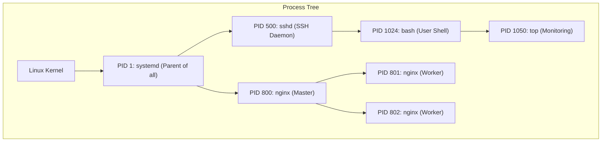

# CHAPTER 27 — PROCESS MANAGEMENT BASICS

---

## 1. Introduction

A Linux server isn't a static box of files; it is a dynamic engine running hundreds of tasks simultaneously. Every running program—from the web server responding to internet traffic, down to the bash shell you are currently typing in—is a **process**. The Linux kernel must allocate CPU time and RAM to each of these processes. Understanding how to view, monitor, and terminate processes is fundamental to keeping a server healthy.

When a developer complains that "the server is slow," the administrator's first reflex is to check the processes. They use tools like `top` and `ps` to find out if a runaway database query is consuming 100% of the CPU, or if a memory leak in a Java application has exhausted the RAM. Once identified, they use the `kill` command to terminate the rogue process and restore stability.

System availability directly equals revenue. If a web server process gets stuck in an infinite loop, customers cannot buy products. Monitoring processes and knowing how to safely restart or terminate them without rebooting the entire server is critical for maintaining the 99.99% uptime expected in enterprise environments.

---

## 2. Process Management Basics

### What is a Process?
A process is an executing instance of a program. When you run a command like `ls`, the kernel creates a new process, gives it a unique number called a **PID (Process ID)**, allocates memory for it, executes the command, and then terminates the process.

### The Process Hierarchy
Linux processes form a family tree.
- **PID 1 (`systemd`):** The very first process started by the kernel when the server boots. Every other process is a child (or grandchild) of PID 1.
- **Parent Process ID (PPID):** If Process A spawns Process B, Process A is the Parent, and its PID is recorded as Process B's PPID. If the parent dies unexpectedly, the child becomes an "orphan" and is usually adopted by PID 1.

### Static Viewing: `ps`
The `ps` (Process Status) command takes a snapshot of the currently running processes. Because Linux has a long history, `ps` accepts three types of flags: UNIX (dash `-e`), BSD (no dash `aux`), and GNU (double dash `--everyone`). The most common enterprise standard is `ps -ef` (System V) or `ps aux` (BSD).

### Real-time Monitoring: `top`
Unlike `ps` which takes a static photo, `top` provides a continuously updating, real-time video feed of the system's CPU and memory usage, sorted by the most resource-intensive processes.

### Terminating Processes: Signals
You do not actually "kill" a process directly. You use the `kill` command to send a **Signal** to the process. The process receives the signal and (usually) shuts itself down.
- **Signal 15 (SIGTERM):** The default. It politely asks the process to save its data, close its files, and exit gracefully.
- **Signal 9 (SIGKILL):** The nuclear option. It tells the Linux kernel to instantly destroy the process without giving the process any chance to save data. Used only when a process is frozen and ignores SIGTERM.

---

## 3. Production Architecture



---

## 4. Command-by-Command Explanation

### `ps -ef`
- **Purpose:** Displays a full-format listing of every process on the system.
- **Output Columns:** `UID`, `PID`, `PPID`, `C` (CPU usage), `STIME` (Start time), `TTY` (Terminal), `TIME` (Total CPU time used), `CMD` (Command executed).

### `ps aux`
- **Purpose:** Similar to `-ef`, but BSD style. It adds columns for `%CPU` and `%MEM`, making it excellent for performance troubleshooting.

### `top`
- **Purpose:** Interactive real-time process monitor.
- **Hotkeys inside `top`:**
  - `M`: Sort by Memory usage.
  - `P`: Sort by CPU usage.
  - `k`: Prompt to kill a PID.
  - `q`: Quit.

### `kill -9 1234`
- **Purpose:** Sends SIGKILL (Signal 9) to PID 1234, destroying it instantly.

### `pkill nginx`
- **Purpose:** Searches for all processes whose name matches "nginx" and sends a SIGTERM to them. Much faster than using `ps` to find the PID manually.

---

## 5. Real Production Examples

### Stopping a Runaway Web Server
The monitoring system alerts that Apache is consuming all memory. The admin uses `top` and sees dozens of `httpd` processes. Finding all the PIDs manually is too slow.
```bash
# Gracefully ask all Apache processes to stop
sudo pkill -15 httpd

# If they are totally frozen and ignore the polite request, force them
sudo pkill -9 httpd
```

### Forcing a Configuration Reload (SIGHUP)
You changed the SSH configuration in `/etc/ssh/sshd_config`. You don't want to restart the whole SSH daemon because it might disconnect active users. You send Signal 1 (SIGHUP - Hang Up), which tells the daemon to simply re-read its config file without dropping connections.
```bash
sudo kill -1 $(cat /var/run/sshd.pid)
# OR using modern systemd:
sudo systemctl reload sshd
```

---

## 6. Common Mistakes

1. **Reaching for `kill -9` immediately** — Junior admins often type `kill -9` out of habit. This is terrible practice. If you `kill -9` a MySQL database, it leaves transactions half-written, corrupting the database tables. Always use standard `kill` (SIGTERM -15) first. Only use `-9` if the process has been stuck for several minutes.
2. **Killing the wrong PID** — Typographical errors happen. Killing the wrong PID can take down the network interface or log you out of the server. Double-check the PID using `ps` before typing `kill`.
3. **Misreading `%CPU` in `top`** — If a server has 4 CPU cores, the maximum `%CPU` is technically 400%. If `top` shows a Java process using 150% CPU, it means it is fully utilizing 1.5 cores. It does not mean the server is overloaded if you have 8 cores available.

---

## 7. Best Practices

- Standard debugging flow:
  1. `top` (Identify the high-resource process).
  2. `ps -ef | grep <process>` (Get the exact PID and PPID).
  3. `kill <PID>` (Politely ask it to stop).
  4. Wait 30 seconds.
  5. `kill -9 <PID>` (Destroy it if it refused to stop).
- Install and use `htop` (if permitted by corporate policy). It provides a much more intuitive, colorized, interactive process tree compared to standard `top`.

---

## 8. Security Considerations

- **Process Isolation:** A normal user can only kill processes they own. If user `sachin` tries to kill a process owned by `root` or `apache`, the kernel will block it with "Operation not permitted."
- **Viewing Arguments:** In older Unix systems, running `ps -ef` might expose passwords if a script was executed like `mysql -u root -pSecretPass`. Modern administrators avoid passing passwords via command-line arguments to prevent them from showing up in `/proc` and `ps`.

---

## 9. Performance Considerations

- Polling processes takes minimal resources. However, running `top -d 0.1` (updating ten times a second) will cause the `top` program itself to consume a noticeable amount of CPU. The default 3-second update interval is ideal.

---

## 10. Troubleshooting Guide

| Symptom | Root Cause | Resolution |
|:---|:---|:---|
| Process ignores `kill PID` | Process is hung in a loop or ignoring SIGTERM | Run `kill -9 PID` to force kernel intervention |
| Process ignores `kill -9 PID` | Zombie Process or Uninterruptible Sleep (D state) | Process is stuck waiting on dead hardware (like a disconnected NFS drive). Only a server reboot will clear it. |
| Killed a process, but it immediately restarted | Respawning by Parent (like systemd) | Don't use `kill`. Use `systemctl stop service_name` instead. |

---

## 11. Practical Labs

**Lab 27.1:** Exploring `ps`
```bash
ps -ef | head -n 10
ps aux | sort -nrk 3 | head -n 5  # Show top 5 CPU consumers
```

**Lab 27.2:** Managing a Process
```bash
# Open a second terminal and run this infinite sleep
sleep 10000 &
# In your main terminal, find it
ps -ef | grep sleep
# Take note of the PID, then kill it
kill 12345
# Verify it's gone
ps -ef | grep sleep
```

**Lab 27.3:** Interactive `top`
1. Run `top`.
2. Press `M` (capital M) to sort by Memory.
3. Press `c` to toggle full command paths.
4. Press `q` to quit.

---

## 12. Mini Project

Simulate a runaway process and resolve it.
1. Run a CPU stress test in the background: `cat /dev/urandom > /dev/null &`
2. Open `top`. You should immediately see `cat` shooting to 100% CPU.
3. Take note of the PID from the `top` screen. Press `q` to exit `top`.
4. Run `kill -15 <PID>`.
5. Run `top` again to verify the CPU has returned to normal idle levels.
*(If you lost the PID, simply run `pkill cat`).*

---

## 13. Assignments

1. What is the PID of the first process started on a Linux system, and what is its name on modern RHEL/Ubuntu?
2. What is the difference between Signal 15 and Signal 9?
3. Which pseudo-filesystem does `ps` read its information from?

---

## 14. Interview Questions

### Basic
1. **Q: How do you find the PID of a specific process, like 'nginx'?**
   A: `ps -ef | grep nginx` or simply `pgrep nginx`.

2. **Q: What command gives you a real-time, constantly updating view of CPU and Memory usage?**
   A: `top` (or `htop`).

### Intermediate
3. **Q: You ran `kill 5555` to stop a Java application, but the process is still running. Why, and what is your next step?**
   A: By default, `kill` sends SIGTERM (Signal 15), which asks the application to shut down gracefully. The Java app might be frozen, processing a massive garbage collection, or explicitly programmed to ignore SIGTERM. My next step is to wait a few moments to see if it finishes saving data. If it doesn't, I will force it to terminate using `kill -9 5555` (SIGKILL).

4. **Q: What is a Zombie process, and how do you kill it?**
   A: A Zombie process (Status 'Z' in top/ps) is a process that has already finished executing, but its parent process hasn't read its exit status yet. Because it is already dead, it consumes no CPU or RAM, only an entry in the process table. You cannot `kill -9` a zombie because it is already dead. To clear it, you must kill its parent process (PPID).

### Scenario-Based
5. **Q: You notice a process called `backup.sh` is consuming high resources. You kill the PID. Five seconds later, you run `ps` and see `backup.sh` is running again with a brand new PID. You kill it again, and it comes back again. What is happening, and how do you stop it?**
   A: The process is being respawned automatically by a parent supervisory process. This could be `systemd`, `cron`, or a bash loop. If you keep killing the child, the parent will just keep creating new children. You must use `ps -ef` to identify the Parent PID (PPID), and either kill the parent, or gracefully stop the service using `systemctl stop` or commenting out the `cron` job.

---

## 15. Chapter Summary and Quick Revision Notes

- Every running command is a **Process** with a unique **PID**.
- `/proc/` is the RAM-based filesystem where process data lives.
- `ps -ef` (System V) or `ps aux` (BSD) takes a static snapshot of processes.
- `top` provides a real-time, interactive resource dashboard.
- **SIGTERM (15):** Graceful shutdown. The default for `kill`. Safe for databases.
- **SIGKILL (9):** Instant destruction. Bypasses the application. Dangerous for data.
- `kill <PID>` terminates by number. `pkill <name>` terminates by string match.

---

## 16. Cheat Sheet

| Command | Purpose |
|:---|:---|
| `ps -ef` | Show all processes with full format (PPID) |
| `ps aux` | Show all processes with %CPU and %MEM |
| `top` | Real-time interactive process monitor |
| `kill PID` | Send polite SIGTERM (Signal 15) |
| `kill -9 PID` | Send forceful SIGKILL (Signal 9) |
| `pkill name` | Kill all processes matching 'name' |
| `pgrep name` | Print PIDs of processes matching 'name' |
