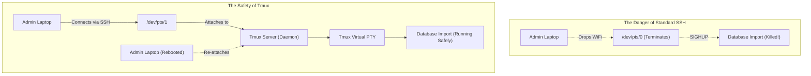

# CHAPTER 28 — BACKGROUND JOBS AND TERMINAL MULTIPLEXERS (TMUX/SCREEN)

---

## 1. Introduction

When you type a command in Linux (like running a large database export), that command runs in the **foreground**. It locks up your terminal window until it finishes. If the export takes 5 hours, you cannot use that terminal window for 5 hours. Worse, if your laptop loses WiFi connection or you accidentally close the SSH window, the Linux kernel detects the disconnection (SIGHUP) and immediately kills the 5-hour export, ruining all progress. 

Administrators use Background Jobs (`&`, `bg`, `fg`) to push long-running tasks out of the way, freeing up the terminal for other commands. To solve the disconnection problem, they use Terminal Multiplexers (`tmux` or `screen`) which create a persistent, virtual terminal session on the server. If their laptop dies, they simply reconnect to the server and re-attach to the `tmux` session, finding the 5-hour export still running safely exactly where they left it.

Operational safety and disaster prevention. Data migrations, software compiles, and massive file copies (`rsync`) routinely take hours or days to complete. A dropped VPN connection shouldn't cause a multi-million row database restore to fail halfway through, corrupting the database. Mastering `tmux` is an absolute requirement for executing critical, long-running production tasks.

---

## 2. Background Jobs And Terminal Multiplexers (Tmux/Screen)

### Shell Job Control
Every bash shell tracks its own child processes, known as "jobs".
- **Foreground:** The job has control of your keyboard (standard input).
- **Background:** The job is running on the CPU, but cannot accept keyboard input. It will still print output to your screen unless you redirect it.
- **Suspended (Stopped):** The job is frozen in RAM. It is not using the CPU and is not making progress.

### SIGHUP (Hangup Signal)
When an SSH session disconnects, the parent shell is killed. Before dying, the shell sends a SIGHUP (Signal 1) to all its child jobs, terminating them immediately.

### `nohup` (No Hang Up)
The `nohup` command tells a process to ignore SIGHUP signals.
If you run `nohup script.sh &`, the script runs in the background. If you close your terminal, the script survives because it ignores the hangup signal. Since it no longer has a terminal to print text to, `nohup` automatically redirects all output to a file called `nohup.out`.

### Terminal Multiplexers (`tmux` / `screen`)
While `nohup` is useful for simple scripts, it doesn't allow you to interact with the process later (you can't type passwords or respond to prompts).
`tmux` creates a pseudo-terminal (PTY) managed by a background server process. You attach your SSH session to `tmux`. If your SSH connection drops, your SSH session dies, but the `tmux` server and its virtual windows stay alive indefinitely. When you log back in, you re-attach to `tmux` and regain full interactive control.

---

## 3. Production Architecture



---

## 4. Command-by-Command Explanation

### Job Control Commands
- `command &`: Runs the command in the background immediately.
- `Ctrl + Z`: Suspends the current foreground command.
- `bg`: Moves the suspended command to the background to resume execution.
- `fg`: Brings a background or suspended job back to the foreground.
- `jobs`: Lists all active jobs in the current shell.

### `nohup`
- **Example:** `nohup tar -czf backup.tar.gz /var/www &`
- **Result:** Runs the compression in the background, immune to logouts. Output goes to `nohup.out`.

### `tmux` Basics
- `tmux`: Start a new session.
- `Ctrl+b, d`: Detach from the session (leaves everything running, returns to normal bash).
- `tmux ls`: List active sessions.
- `tmux attach -t 0`: Re-attach to session 0.
- `tmux new -s upgrade`: Start a new session named "upgrade".

---

## 5. Real Production Examples

### The "Oh No!" Moment (Suspending to Background)
An administrator runs `tar -czf backup.tar.gz /var/www` to back up the web directory. Ten seconds later, they realize it will take 45 minutes, and they need their terminal back *right now* to restart a crashed service.
Instead of cancelling the backup (`Ctrl+C`), they:
1. Press `Ctrl+Z` (Suspends the tar command).
2. Type `bg` (Resumes the tar command in the background).
3. The terminal is now free. They restart the service.

### Database Migrations with Tmux
A Senior DBA must export a 500GB PostgreSQL database and pipe it directly to a new server over SSH. This will take 12 hours.
1. `tmux new -s db_migrate`
2. `pg_dump mydatabase | ssh newserver "cat > /backup/db.sql"`
3. Press `Ctrl+b, d` to detach.
4. The DBA logs off, goes home, sleeps, comes into the office the next morning, logs in, and runs `tmux attach -t db_migrate` to see if the transfer completed.

---

## 6. Common Mistakes

1. **Forgetting you have a suspended job** — If you `Ctrl+Z` out of `vim`, edit another file, and try to log out, Bash will warn you: `There are stopped jobs.` If you ignore it and log out anyway, Bash sends a KILL signal to the suspended `vim` session, and you lose all unsaved changes. Always run `jobs` and `fg` to finish them.
2. **Confusing `nohup` with `&`** — Running `ping 8.8.8.8 &` puts it in the background, but if you close the terminal, it dies. You must use `nohup ping 8.8.8.8 &` to protect it from logouts.
3. **Nesting Tmux sessions** — Running `tmux` while you are *already inside* a `tmux` session creates massive confusion with the `Ctrl+b` hotkeys. If you detach, you don't know which layer you just detached from. Always verify if you are in tmux (`echo $TMUX`) before starting a new one.

---

## 7. Best Practices

- **Never** perform a critical, long-running operation (DB upgrade, OS patch, massive rsync) without using `tmux` or `screen`. SSH connections are fragile.
- Always name your tmux sessions (`tmux new -s <name>`). If you have 5 disconnected sessions named 0, 1, 2, 3, 4, you won't know which one holds the database backup.
- If your system doesn't have `tmux` installed, look for `screen`. It is older but universally available, functioning on the same exact principles (detach is `Ctrl+a, d`).

---

## 8. Security Considerations

- `tmux` sessions belong to the user who created them. If you create a `tmux` session as `root`, any other admin who logs in and elevates to `root` can run `tmux attach` and hijack your session. If you left a sensitive password on the screen, they will see it. Always exit or lock your `tmux` sessions when finished.

---

## 9. Performance Considerations

- Suspended jobs (`Ctrl+Z`) consume zero CPU cycles because the kernel pulls them off the run queue. However, they still hold all their allocated RAM. If you suspend a Java process using 16GB of RAM, that 16GB cannot be used by the rest of the system until the process is resumed or killed.

---

## 10. Troubleshooting Guide

| Symptom | Root Cause | Resolution |
|:---|:---|:---|
| Try to logout, get "There are stopped jobs" | A process is suspended via `Ctrl+Z` | Type `fg` to bring it forward, then quit it normally, or type `kill %1`. |
| `tmux: command not found` | Package not installed | Run `sudo dnf install tmux` or `sudo apt install tmux`. Fallback: type `screen`. |
| Typed `Ctrl+b, d` but nothing happens | You are not in a tmux session | You might be confusing the hotkey, or the SSH connection itself is frozen. |
| Background job prints garbage over your prompt | Job is still attached to stdout | Rerun it with redirection: `cmd > /dev/null 2>&1 &` |

---

## 11. Practical Labs

**Lab 28.1:** Job Control
```bash
# 1. Start a long process
sleep 300
# 2. Press Ctrl+Z to suspend it.
# 3. Type 'jobs' to see it stopped.
# 4. Type 'bg' to resume it in the background.
# 5. Type 'jobs' to see it running.
# 6. Type 'fg' to bring it back to foreground.
# 7. Press Ctrl+C to kill it.
```

**Lab 28.2:** Tmux Detach and Attach
```bash
tmux new -s test_session
# Notice the green status bar at the bottom.
top
# Now press Ctrl+b, let go, then press d
tmux ls
tmux attach -t test_session
# You are back in top! Press q to exit top, then type 'exit' to destroy the tmux session.
```

---

## 12. Mini Project

Simulate a resilient system update.
1. Log into your server.
2. Create a new tmux session named `patching`: `tmux new -s patching`.
3. Inside tmux, start a fake long-running command: `ping 8.8.8.8`.
4. Detach from tmux (`Ctrl+b, d`).
5. Completely disconnect from your server (close the terminal window or type `exit`).
6. Re-open your terminal and SSH back into the server.
7. Run `tmux ls` to verify the session survived.
8. Re-attach: `tmux a -t patching`.
9. Observe that the ping command is still running continuously, completely unaffected by your disconnection.

---

## 13. Assignments

1. Explain the difference between running a command with `&` and running a command with `nohup ... &`.
2. What key combination suspends a foreground job?
3. Why is running a database upgrade script directly in a standard SSH session dangerous?

---

## 14. Interview Questions

### Basic
1. **Q: How do you send a currently running command to the background so you can use your terminal again?**
   A: Press `Ctrl+Z` to suspend the job, then type `bg` to resume it in the background.

2. **Q: What is `tmux` used for?**
   A: It is a terminal multiplexer. It allows you to create persistent terminal sessions that survive SSH disconnections, and allows you to split a single SSH window into multiple panes.

### Intermediate
3. **Q: You started a 10-hour data transfer script an hour ago. You forgot to use `tmux` or `nohup`. Your shift is ending, and you need to close your laptop and go home. If you close your laptop, the transfer will die. Can you save it?**
   A: Yes. I can press `Ctrl+Z` to suspend the transfer. Then I can run `bg` to put it in the background. Finally, I can use the `disown -h %1` command. `disown` detaches the job from the current shell, making it immune to the SIGHUP signal when I log out, effectively converting it into a `nohup` job retroactively.

4. **Q: Where does `nohup` send the output (stdout/stderr) of a command by default?**
   A: It creates a file called `nohup.out` in the directory where the command was executed and appends all output to it.

### Scenario-Based
5. **Q: You SSH into a critical database server. You run `tmux attach` and suddenly you are looking at a root prompt with a half-written SQL `DROP TABLE` command on the screen. What happened?**
   A: Another administrator (or an attacker who compromised a root account) logged in earlier, started a `tmux` session as root, began typing a destructive command, and detached (or disconnected) without finishing. Because I also logged in as root and attached to the existing session, I hijacked their active terminal. This highlights the danger of leaving root `tmux` sessions active and unattended.

---

## 15. Chapter Summary and Quick Revision Notes

- **Foreground:** Locks the terminal.
- **Background (`&`):** Runs parallel to the terminal.
- **`Ctrl+Z`:** Suspends (freezes) a job.
- **`bg` / `fg`:** Moves jobs between background and foreground.
- **SIGHUP:** The signal sent to kill jobs when SSH disconnects.
- **`nohup`:** Protects background jobs from SIGHUP.
- **`tmux` / `screen`:** Creates virtual, persistent terminals. Absolutely mandatory for long-running administrative tasks to protect against network drops.

---

## 16. Cheat Sheet

| Command / Hotkey | Purpose |
|:---|:---|
| `cmd &` | Start `cmd` in background |
| `Ctrl+Z` | Suspend current job |
| `bg` | Resume suspended job in background |
| `fg %1` | Bring job #1 to foreground |
| `nohup cmd &` | Run job immune to disconnections |
| `tmux new -s ops` | Start named tmux session |
| `tmux a -t ops` | Attach to named session |
| `Ctrl+b, d` | (Inside tmux) Detach from session |
