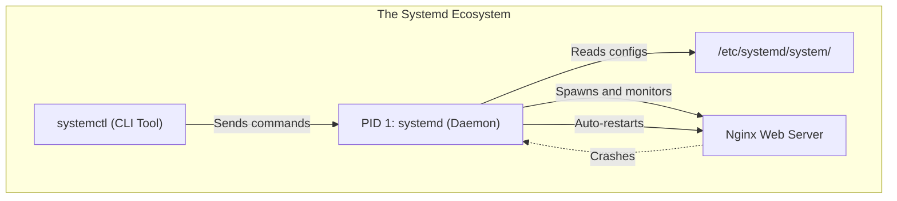

# CHAPTER 29 — SYSTEMD AND SYSTEMCTL FUNDAMENTALS

---

## 1. Introduction

When a Linux server boots, it needs to start the network, mount the hard drives, launch the firewall, and start the web server in a specific order. If the web server crashes later that day, something needs to automatically restart it. In modern Linux distributions (RHEL 7+, Ubuntu 15.04+), this massive responsibility is handled by **systemd**, the initialization system and service manager. It replaces the legacy SysVinit system, offering parallel startup, robust dependency management, and automated service recovery.

System administrators spend a massive portion of their day interacting with `systemd` via the `systemctl` command. They use it to start, stop, restart, and check the status of applications. They also write custom `systemd` unit files to ensure that their company's proprietary applications start automatically on boot and restart automatically if they crash.

High Availability (HA). If a critical microservice crashes at 3:00 AM, the company cannot wait for an administrator to wake up and type `./start.sh`. By wrapping the microservice in a `systemd` service unit, the OS guarantees it will automatically restart within milliseconds of a crash, ensuring zero downtime for customers.

---

## 2. Systemd And Systemctl Fundamentals

### Systemd as PID 1
When the Linux Kernel finishes loading into RAM, it launches exactly one process: `systemd` (assigned PID 1). `systemd` then takes over and launches every other process on the system. If `systemd` dies, the kernel panics and the server crashes.

### Systemd Units
`systemd` manages resources through "Units". There are many types, but the most common is the **Service Unit** (`.service`). A service unit file tells `systemd` exactly how to start, stop, and monitor an application.
*Unit files are stored in:*
- `/usr/lib/systemd/system/` (Package manager defaults - Do not edit).
- `/etc/systemd/system/` (Administrator custom configurations - Overrides defaults).

### Running State vs Enabled State
This is a critical distinction that trips up many beginners:
- **Running / Stopped (Current State):** Is the application running *right now*? Controlled by `systemctl start` and `systemctl stop`.
- **Enabled / Disabled (Boot State):** Will the application start *automatically* the next time the server reboots? Controlled by `systemctl enable` and `systemctl disable`.

### Restart vs Reload
- **Restart:** Completely kills the application and starts it fresh. This disrupts active users (e.g., dropping active database connections).
- **Reload:** Politely asks the application to re-read its configuration file without terminating the main process. Active connections are preserved. (Not all applications support this, but web servers like Nginx/Apache do).

---

## 3. Production Architecture



---

## 4. Command-by-Command Explanation

### `systemctl status httpd`
- **Purpose:** Shows whether Apache is running, enabled, its PID, memory usage, and the last 10 log messages.

### `systemctl start httpd`
- **Purpose:** Starts the Apache service immediately.

### `systemctl enable httpd`
- **Purpose:** Configures Apache to start automatically on the next server reboot.

### `systemctl enable --now httpd`
- **Purpose:** A massive time-saver. It Enables AND Starts the service simultaneously.

### `systemctl list-units --type=service --state=running`
- **Purpose:** Displays a table of all currently running services on the system.

### `systemctl daemon-reload`
- **Purpose:** If you manually create or edit a `.service` file using `vim`, `systemd` does not know about it. You must run this command to tell `systemd` to scan the disk for new/updated unit files.

---

## 5. Real Production Examples

### Deploying a Go/Node.js/Python Application
Modern microservices do not daemonize themselves like old C programs. They just run in the foreground. Administrators write a `systemd` wrapper to manage them in production.
```bash
sudo vim /etc/systemd/system/node-app.service
```
*(Content)*:
```ini
[Unit]
Description=Corporate Node App

[Service]
ExecStart=/usr/bin/node /var/www/node/app.js
Restart=on-failure
User=nodeuser
Environment=NODE_ENV=production

[Install]
WantedBy=multi-user.target
```
```bash
sudo systemctl daemon-reload
sudo systemctl enable --now node-app
```

### Masking Dangerous Services
Sometimes `systemctl disable` isn't enough. If another service depends on a disabled service, `systemd` will automatically start it anyway! To guarantee a service (like an insecure telnet daemon or unwanted firewall) NEVER starts, you `mask` it.
```bash
sudo systemctl mask firewalld
# This creates a symlink pointing to /dev/null, making it impossible to start.
```

---

## 6. Common Mistakes

1. **Forgetting `daemon-reload`** — If you edit a `.service` file and immediately type `systemctl restart app`, `systemd` will restart it using the *old* configuration stored in RAM. Always run `systemctl daemon-reload` after editing a unit file.
2. **Confusing Enable with Start** — An admin installs Apache (`dnf install httpd`), runs `systemctl start httpd`, and tests the website. It works. A week later, the server reboots for patching, and the website goes down because the admin forgot to run `systemctl enable httpd`.
3. **Using relative paths in ExecStart** — `ExecStart=python app.py` will fail. Systemd does not use a user's `$PATH` variable. You must use absolute paths for everything: `ExecStart=/usr/bin/python3 /opt/app/app.py`.

---

## 7. Best Practices

- Always use `enable --now` to combine enabling and starting into a single command.
- If a service fails to start, immediately run `systemctl status <service>` and `journalctl -xeu <service>` to see the exact error logs.
- Never run application services as root. Always define a `User=` directive in your custom `.service` files.

---

## 8. Security Considerations

- Systemd's `User=` directive allows privilege dropping. Systemd runs as root, binds to a low port (like 80 for web servers), and then seamlessly drops privileges to a normal user account to execute the application code. This prevents attackers from gaining root access if the application is exploited.

---

## 9. Performance Considerations

- Systemd significantly speeds up Linux boot times by starting unrelated services in parallel, rather than waiting for them to start sequentially one-by-one as SysVinit did.

---

## 10. Troubleshooting Guide

| Symptom | Root Cause | Resolution |
|:---|:---|:---|
| `Unit app.service could not be found` | Typo, or systemd needs reload | Check spelling in `/etc/systemd/system`, then run `systemctl daemon-reload` |
| Status shows `code=exited, status=203/EXEC` | Bad path or permissions | Verify `ExecStart` uses an absolute path and the file has `chmod +x` |
| `Failed to start: Unit is masked` | Service was masked administratively | Run `systemctl unmask servicename` |
| Status shows `active (exited)` | It's a oneshot script, not a daemon | This is normal for startup scripts (like applying firewall rules). It ran successfully and finished. |

---

## 11. Practical Labs

**Lab 29.1:** Service Investigation
```bash
systemctl status sshd
# Notice the path to the unit file.
systemctl cat sshd
# This prints the raw contents of the unit file to the screen without using vi.
```

**Lab 29.2:** State Manipulation (Requires a test service, e.g., chronyd or nginx)
```bash
sudo systemctl stop sshd
# DO NOT close your terminal, or you are locked out!
systemctl status sshd
sudo systemctl start sshd
```

**Lab 29.3:** Masking
```bash
sudo systemctl mask NetworkManager
sudo systemctl start NetworkManager  # Will fail
sudo systemctl unmask NetworkManager
```

---

## 12. Mini Project

Create a self-healing process.
1. Create a script `/tmp/crash.sh`:
   `#!/bin/bash`
   `sleep 30`
   `exit 1` (This simulates a crash).
2. `chmod +x /tmp/crash.sh`
3. Create `/etc/systemd/system/crasher.service`:
   `[Service]`
   `ExecStart=/tmp/crash.sh`
   `Restart=always`
   `RestartSec=2`
4. `sudo systemctl daemon-reload`
5. `sudo systemctl start crasher`
6. Run `systemctl status crasher` immediately. Notice it is running.
7. Wait 35 seconds. Run `systemctl status crasher` again. Notice it crashed, but systemd immediately restarted it, and it has a new PID!

---

## 13. Assignments

1. What is the difference between `systemctl restart` and `systemctl reload`?
2. What is the difference between the `running` state and the `enabled` state?
3. Why must you use absolute paths inside a `systemd` unit file?

---

## 14. Interview Questions

### Basic
1. **Q: What command do you use to ensure a web server automatically starts after a system reboot?**
   A: `systemctl enable httpd` (or `nginx`).

2. **Q: If you edit a custom service file in `/etc/systemd/system/`, what must you do before restarting the service?**
   A: You must run `systemctl daemon-reload` so systemd re-reads the disk and updates its internal cache.

### Intermediate
3. **Q: An administrator runs `systemctl disable iptables` to turn off an old firewall. However, after a reboot, `iptables` is running again. How is this possible, and how do you guarantee it never runs?**
   A: `disable` only removes the symlink for the default boot target. If another service that starts on boot has a dependency explicitly calling for `iptables`, systemd will start it anyway to satisfy the dependency. To guarantee it never runs, the administrator must use `systemctl mask iptables`, which links the unit to `/dev/null`.

4. **Q: You deploy a Python API. You write a systemd service file, but when you start it, it immediately fails with `status=203/EXEC`. What are the two most likely causes?**
   A: (1) The path provided in `ExecStart` is wrong, or a relative path was used instead of an absolute path. (2) The Python script lacks execution permissions (`chmod +x`), or the shebang (`#!/usr/bin/python3`) at the top of the script is missing/incorrect.

### Scenario-Based
5. **Q: You are managing a highly trafficked e-commerce site running Nginx. You updated the SSL certificates and need Nginx to use them. If you run `systemctl restart nginx`, active customers checking out will receive a "Connection Reset" error. How do you apply the certificates without dropping active customers?**
   A: I would use `systemctl reload nginx`. This sends a SIGHUP signal to the Nginx master process. Nginx will read the new certificates, spawn new worker processes for new incoming connections using the new certs, and allow existing worker processes to gracefully finish their current checkouts before shutting down. Zero downtime is achieved.

---

## 15. Chapter Summary and Quick Revision Notes

- `systemd` is PID 1, replacing SysVinit.
- `systemctl` is the primary CLI tool.
- **Enable/Disable:** Modifies boot behaviour (creates/deletes symlinks).
- **Start/Stop:** Modifies current running state.
- **Restart:** Kills and restarts (drops connections).
- **Reload:** Re-reads config gracefully (keeps connections).
- **daemon-reload:** Required after editing any `.service` file.
- Custom unit files belong in `/etc/systemd/system/`.

---

## 16. Cheat Sheet

| Command | Purpose |
|:---|:---|
| `systemctl start name` | Start service now |
| `systemctl stop name` | Stop service now |
| `systemctl enable name` | Start on boot |
| `systemctl disable name`| Do not start on boot |
| `systemctl enable --now name` | Start on boot AND Start now |
| `systemctl reload name` | Reload config gracefully |
| `systemctl status name` | Check health and view recent logs |
| `systemctl daemon-reload` | Re-read edited unit files |
| `systemctl mask name` | Forcefully block service from starting |
