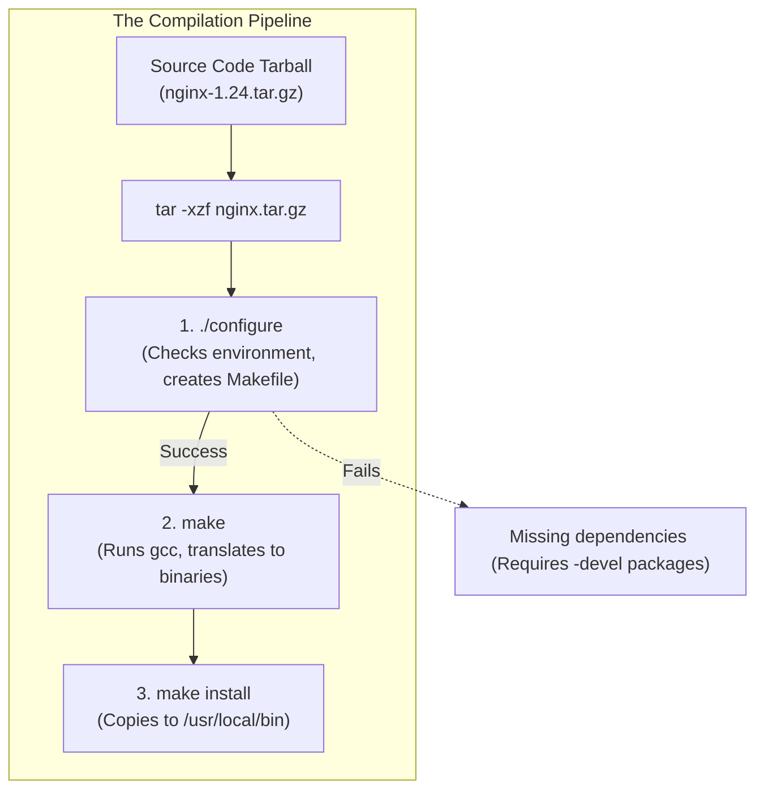

# CHAPTER 34 — COMPILING FROM SOURCE (GCC AND MAKE)

---

## 1. Introduction

Before package managers like `dnf` and `apt` existed, if you wanted to run software on Linux, you had to download the raw, human-readable source code (usually written in C or C++) and translate it into machine code (1s and 0s) that the CPU could execute. This translation process is called "compiling". While package managers handle 95% of software installation today, compiling from source remains a fundamental skill in the Linux ecosystem.

Administrators compile software when they need a highly customized installation. For example, if the default Nginx package from `apt` does not include a specific third-party module (like a custom firewall module), the administrator must download the Nginx source code, inject the module, and compile a custom binary themselves. They also compile software when the required application is too new or too obscure to be available in the official OS repositories.

Performance optimization and security patching. A generic `.rpm` or `.deb` package is compiled to run on the widest possible range of hardware, meaning it is not optimized for any specific CPU. High-Frequency Trading firms or Supercomputing centers compile their own software to squeeze every last ounce of performance out of their specific Intel/AMD processors. Furthermore, if a zero-day vulnerability is discovered, compiling a patch manually allows a company to secure its servers days or weeks before the official package manager releases an update.

---

## 2. Compiling From Source (Gcc And Make)

### The Compiler: GCC
GCC (GNU Compiler Collection) is the standard compiler for Linux. It takes `.c` source code files and translates them into executable binaries. While you *could* compile a massive program by running `gcc` manually on 5,000 individual files, it would take hours of typing.

### The Automator: Make
To solve the typing problem, developers write a `Makefile`. This file contains the exact `gcc` commands and the order they must be run. When you type `make`, the `make` utility reads the `Makefile` and executes thousands of `gcc` commands automatically. It is also smart enough to only recompile files that have changed since the last build, saving massive amounts of time.

### The Standard Three-Step Process
Almost all open-source C/C++ software follows this exact procedure:
1. **`./configure`**: A script that checks your server's hardware, OS, and installed libraries to ensure you have everything required to build the software. If successful, it generates the `Makefile` customized for your specific server.
2. **`make`**: Reads the `Makefile` and compiles the source code into binaries. This happens inside the local directory.
3. **`make install`**: Copies the finished binaries from the local directory into the system's execution paths (like `/usr/local/bin/`).

### The Problem of Dependencies
When compiling, you don't just need the libraries (`libssl.so`); you need the **development headers** (the `.h` files). Package managers split these. `openssl` provides the library to run software. `openssl-devel` (or `libssl-dev` on Ubuntu) provides the headers to *compile* software.

---

## 3. Production Architecture



---

## 4. Command-by-Command Explanation

### `dnf groupinstall "Development Tools"`
- **Purpose:** On RHEL/CentOS, this installs `gcc`, `make`, `git`, and dozens of other tools required for compiling software in one command. (On Ubuntu, use `apt install build-essential`).

### `./configure --prefix=/opt/myapp`
- **Purpose:** Checks the system. The `--prefix` flag tells the installer, "When I run `make install` later, do not scatter the files all over `/usr/local`. Put everything inside `/opt/myapp`." This makes uninstalling the software as easy as `rm -rf /opt/myapp`.

### `make -j 4`
- **Purpose:** Compiles the software. The `-j 4` flag tells `make` to use 4 CPU cores simultaneously (parallel jobs), drastically reducing compilation time for large projects.

### `sudo make install`
- **Purpose:** Moves the compiled files into system directories. (Requires `sudo` because normal users cannot write to `/usr/local/bin/`).

---

## 5. Real Production Examples

### Compiling Nginx with Custom Modules
An enterprise requires Nginx, but they also require the real-time RTMP video streaming module (which is not included in the standard `apt` package).
```bash
# 1. Download Nginx and the custom module source code
wget http://nginx.org/download/nginx-1.24.0.tar.gz
git clone https://github.com/arut/nginx-rtmp-module.git
tar -xzf nginx-1.24.0.tar.gz

# 2. Configure Nginx to include the custom module
cd nginx-1.24.0
./configure --add-module=../nginx-rtmp-module

# 3. Compile and Install
make
sudo make install
```

### Checking Dynamic Linking
A custom-compiled database daemon is crashing on startup with a cryptic error. The admin checks if the binary is missing any dynamically linked shared libraries.
```bash
ldd /usr/local/bin/custom_db
# Output:
#        linux-vdso.so.1 =>  (0x00007ffe34336000)
#        libpthread.so.0 => /lib64/libpthread.so.0 (0x00007f9c2a5a5000)
#        libz.so.1 => not found   <-- THIS IS THE PROBLEM
```
*Fix: The admin must install the `zlib` package using `dnf`.*

---

## 6. Common Mistakes

1. **Running `./configure` and `make` as root** — You should only use `sudo` for the very last step (`make install`). Compiling the code (`make`) involves executing thousands of lines of arbitrary third-party code. Running it as root is a massive security risk. Compile as a normal user; install as root.
2. **Forgetting to install Development Tools** — Trying to compile software on a bare-bones server without installing `gcc` and `make` first will fail instantly.
3. **Not managing compiled software** — When you compile software, the package manager (`dnf`/`apt`) knows nothing about it. If there is a security vulnerability in your compiled Nginx, running `dnf update` will NOT fix it. You are entirely responsible for subscribing to the mailing lists, downloading the new source code, and recompiling the patch manually.

---

## 7. Best Practices

- Use the `--prefix=/opt/<appname>` flag during `./configure`. This keeps the software perfectly isolated in its own folder instead of scattering thousands of files across `/usr/local/bin/`, `/usr/local/lib/`, and `/usr/local/share/`.
- Always read the `README` or `INSTALL` text files included in the source code folder before running `./configure`. They contain the exact list of dependency packages you need to install.
- Use `make -j $(nproc)` to automatically use all available CPU cores for compilation, turning a 30-minute compile into a 2-minute compile.

---

## 8. Security Considerations

- **Supply Chain Attacks:** When you download source code, you must verify its GPG signature or SHA-256 checksum against the developer's website. If a hacker compromises the download server and alters the source code, `make` will happily compile a backdoor directly into your new binary.

---

## 9. Performance Considerations

- Compiling a large project (like the Linux Kernel or MySQL) is one of the most CPU- and RAM-intensive tasks a server can perform. Never compile massive software on a production server during business hours, as the `gcc` processes will consume 100% of the CPU and potentially starve the live applications.

---

## 10. Troubleshooting Guide

| Symptom | Root Cause | Resolution |
|:---|:---|:---|
| `gcc: command not found` | Compiler not installed | RHEL: `dnf groupinstall "Development Tools"`. Ubuntu: `apt install build-essential` |
| `configure: error: library X not found` | Missing development headers | Install `X-devel` (RHEL) or `libX-dev` (Ubuntu) |
| `make: *** No targets specified` | `./configure` failed | Read the configure output to find out why it didn't generate the Makefile |
| Binary crashes with `cannot open shared object file` | Missing dynamic library | Run `ldd` on the binary to find the missing library, then install it via package manager |

---

## 11. Practical Labs

**Lab 34.1:** Compiling a simple C program
1. Create a file `hello.c`:
   ```c
   #include <stdio.h>
   int main() {
       printf("Hello, Enterprise Linux!\n");
       return 0;
   }
   ```
2. Compile it manually without `make`:
   `gcc -o hello hello.c`
3. Execute the resulting binary:
   `./hello`

**Lab 34.2:** Downloading and Extracting
```bash
wget http://ftp.gnu.org/gnu/hello/hello-2.10.tar.gz
tar -xzf hello-2.10.tar.gz
cd hello-2.10
```

**Lab 34.3:** The Three-Step Process
```bash
./configure
make
sudo make install
hello     # The command is now available system-wide
```

---

## 12. Mini Project

Resolve a dependency error during compilation.
1. Attempt to compile a tool that requires specific libraries (like `htop`).
2. Download the source: `wget https://github.com/htop-dev/htop/releases/download/3.2.2/htop-3.2.2.tar.xz`
3. Extract: `tar -xf htop-3.2.2.tar.xz && cd htop-3.2.2`
4. Run `./configure`. It will likely fail with: `error: missing ncursesw`.
5. Identify the missing package. (On RHEL: `sudo dnf install ncurses-devel`).
6. Re-run `./configure`. It succeeds.
7. Run `make`.
8. Run `sudo make install`.
9. You have successfully resolved a compilation dependency error.

---

## 13. Assignments

1. What are the three standard commands used to compile and install open-source software?
2. What is the difference between the package `openssl` and the package `openssl-devel`?
3. Why is it recommended to use the `--prefix=/opt/myapp` flag?

---

## 14. Interview Questions

### Basic
1. **Q: What command actually translates human-readable C code into an executable binary?**
   A: `gcc` (GNU Compiler Collection).

2. **Q: You download source code and see a file named `Makefile`. What command do you run to process this file?**
   A: `make`

### Intermediate
3. **Q: You run `./configure` on a source code directory, but it fails with the error "missing zlib library". You run `dnf install zlib`, which succeeds, but `./configure` still fails with the exact same error. Why?**
   A: To compile software, having the runtime library (`zlib`) is not enough. The compiler requires the development headers (`.h` files). You must install `zlib-devel` (on RHEL) or `zlib1g-dev` (on Ubuntu) for `./configure` to succeed.

4. **Q: What does `make install` actually do?**
   A: It does not compile code. It simply takes the finished binaries that were created in the local directory during the `make` step and copies them to the system-wide executable directories (usually `/usr/local/bin/`), sets the correct permissions, and occasionally copies man pages to `/usr/local/share/man/`.

### Scenario-Based
5. **Q: A legacy application compiled 5 years ago suddenly stopped working after a server OS upgrade. It throws an error: `error while loading shared libraries: libmysqlclient.so.18: cannot open shared object file: No such file or directory`. What happened and how do you fix it?**
   A: The application was dynamically linked against version 18 of the MySQL client library. During the OS upgrade, the package manager updated MySQL to a newer version (e.g., version 21) and deleted the old library file. The compiled application is hardcoded to look for version 18, so it crashes. To fix it, you have two options:
   1. The best option: Recompile the legacy application from source code against the new OS libraries.
   2. The workaround: Find and install a compatibility package (e.g., `mysql-libs-compat`) that places the old `libmysqlclient.so.18` file back on the server alongside the new versions.

---

## 15. Chapter Summary and Quick Revision Notes

- **`gcc`:** The compiler. Turns source code into binaries.
- **`make`:** The build automator. Reads `Makefile` to run `gcc` efficiently.
- **Prerequisites:** `dnf groupinstall "Development Tools"` or `apt install build-essential`.
- **Headers:** Compiling requires `-devel` or `-dev` packages, not just standard libraries.
- **Step 1:** `./configure` (Checks system, generates Makefile. Use `--prefix` for custom paths).
- **Step 2:** `make` (Compiles code locally. Use `-j` for parallel cores).
- **Step 3:** `sudo make install` (Copies files to `/usr/local/`).
- **`ldd`:** Checks which shared `.so` libraries a binary requires to run.

---

## 16. Cheat Sheet

| Command | Purpose |
|:---|:---|
| `./configure` | Prepare build environment |
| `./configure --prefix=/opt/app` | Prepare environment, install to custom path |
| `make` | Compile the source code |
| `make -j 4` | Compile using 4 CPU cores |
| `make clean` | Delete compiled files to start over |
| `sudo make install` | Copy binaries to system path |
| `ldd /path/to/binary` | Check dynamic library dependencies |
