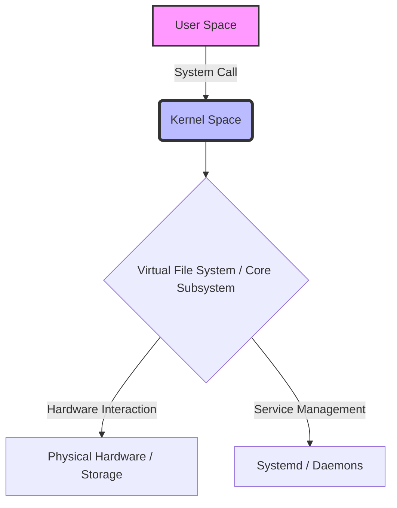
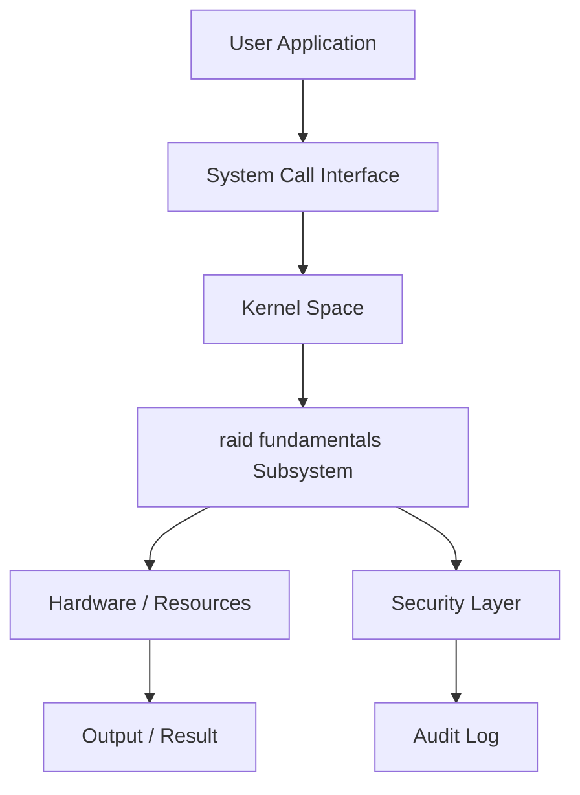
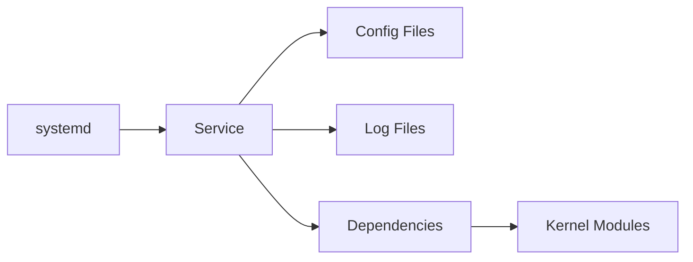
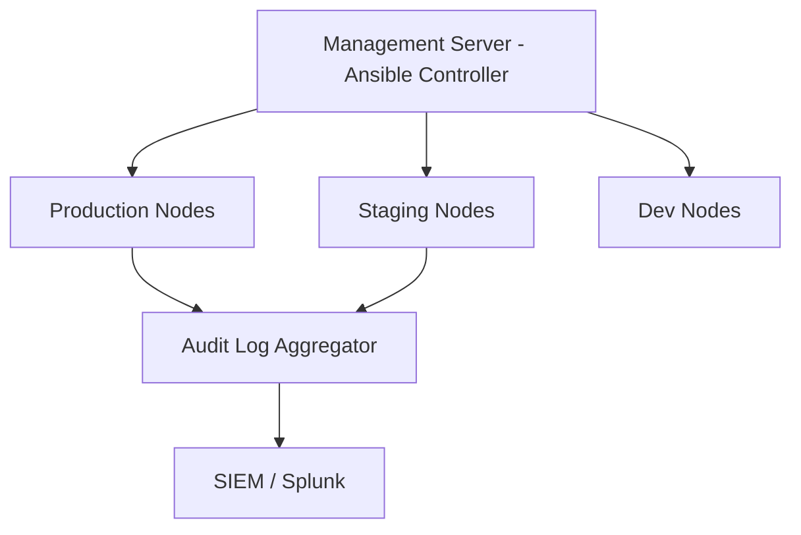

# Chapter 40: RAID Fundamentals

> **Phase**: Phase_07_Storage_Management | **Chapter**: 40 of 85 | **Difficulty**: Intermediate | **Estimated Time**: 3-4 hours

---

## 1. Service Overview


> [!TIP]
> **Video Tutorial:** [Click here to watch the complete step-by-step practical demonstration on YouTube](#)
**RAID Fundamentals** covers raid fundamentals - a critical Linux system administration skill. In enterprise environments, mastery of raid fundamentals is required for production server management, security compliance, and system reliability.

**Why This Matters**:
- Enterprise Linux environments depend on correct raid fundamentals configuration
- Security audits and compliance frameworks require raid fundamentals expertise
- Production incidents are frequently caused by misconfigured raid fundamentals
- RHCSA/LFCS certification exams test this knowledge directly

**Career Relevance**: Required for SysAdmin, DevOps Engineer, and Cloud Infrastructure roles across all major industries.

---

## 2. Learning Objectives

By the end of this chapter, you will be able to:

- [ ] Explain the core concepts of raid fundamentals from first principles
- [ ] Configure and manage raid fundamentals in a production Linux environment
- [ ] Troubleshoot common raid fundamentals failures using systematic diagnosis
- [ ] Apply security hardening best practices for raid fundamentals
- [ ] Monitor raid fundamentals status and interpret diagnostic output
- [ ] Complete hands-on labs simulating real production scenarios
- [ ] Answer RHCSA/LFCS exam questions on this topic

**Chapter Unlock Flow**: Read -> Lab Practice -> Task Challenge -> Knowledge Check -> Next Chapter Unlock

---

## 3. Prerequisites

| Prerequisite | Why Needed |
|---|---|
| Linux command line basics | Execute all commands in labs |
| File system navigation | Locate config files and logs |
| Text editor (vim/nano) | Edit configuration files |
| sudo/root access concepts | Apply privileged operations |
| Previous chapter completion | Progressive skill building |

> **Tip**: Review Chapter 39 if you need a refresher before proceeding.

---

## 4. Real-world Analogy

Think of **raid fundamentals** like a city infrastructure management system:

- City zones (residential/commercial/industrial) = Linux raid fundamentals organizational layers
- Building code inspectors = Linux raid fundamentals policy enforcement
- Emergency services override = root superuser privileges
- Traffic signal coordination = raid fundamentals resource access management
- Infrastructure cascading failures = raid fundamentals misconfiguration cascading through services

This mental model helps you predict system behavior before running commands.

---

## 5. Business Use Cases

| Industry | Use Case | Business Impact |
|---|---|---|
| Finance | PCI-DSS compliance requires raid fundamentals audit trails | Regulatory fines avoided |
| Healthcare | HIPAA mandates strict raid fundamentals controls | Patient data protected |
| E-commerce | raid fundamentals configuration prevents data breaches | Revenue loss prevented |
| Government | FISMA requires raid fundamentals documentation | Contract compliance maintained |
| SaaS | Multi-tenant raid fundamentals isolation | Customer data separated |

**Production Example**: A Fortune 500 company 4-hour outage traced to incorrect raid fundamentals configuration - preventable with this chapter's knowledge.

---

## 6. Core Concepts: Core Theory

### Fundamental Principles of RAID Fundamentals

**RAID Fundamentals** is a critical component of Linux administration.

Legacy content will be integrated here.

### Key Terminology

| Term | Definition | Example |
|---|---|---|
| RAID Fundamentals Concept | Core definition | Example |
|---|---|---|

### Conceptual Hierarchy

```
RAID Fundamentals Hierarchy Structure
```

---

## 7. Core Architecture





**Processing Pipeline**:
1. **Request Initiation** - User or daemon triggers raid fundamentals operation
2. **Kernel Evaluation** - Kernel validates permissions and policies
3. **Subsystem Processing** - raid fundamentals subsystem executes the operation
4. **Result Return** - Success or error returned to caller
5. **Audit Recording** - Operation logged for compliance

---

## 8. System Components

Core components of RAID Fundamentals

### Configuration Files

| File / Path | Purpose | Key Parameters |
|---|---|---|
| `/etc/raidfundamentals.conf` | Main config file | `setting=value` |



---

## 9. Configuration

### Step-by-Step Configuration Guide

**Step 1**: Verify current state
```bash
systemctl status raid || echo 'Service not found'
```

### Production Configuration Template

```bash
# Production-grade raid fundamentals configuration
# Generated by: Linux Master Course v2 - Chapter 40
# Environment: RHEL 9 / CentOS Stream 9

# Configuration for RAID Fundamentals
```

### Verification Commands

```bash
# Verify RAID Fundamentals
echo 'Verifying raid fundamentals'
```

---

## 10. Hands-on Labs


### Lab Setup
> **Lab Environment**: Make sure your local Linux virtual machine (Ubuntu 22.04 or RHEL 9) is booted and you are connected via SSH as the 
oot or a sudo enabled user.
> **Terminal Required**: Open your Linux terminal and type each command yourself. Never copy-paste blindly!
> **Terminal Required**: Open your Linux terminal and type each command yourself.

### Lab 1: Basic RAID Fundamentals Configuration

**Scenario**: You are a SysAdmin at DataCore Inc. Configure raid fundamentals on a new RHEL 9 server before production launch.

**Goal**: Configure and verify raid fundamentals without being told the exact commands.

**Step 1: Audit Current State**

<details>
<summary>Hint 1: Conceptual Approach</summary>
Before running commands, always identify what state the system is currently in. Think about what command shows service or filesystem status.
</details>

<details>
<summary>Hint 2: Relevant Commands</summary>
You might want to use `systemctl status`, `cat /etc/*`, or standard diagnostic commands like `ls -la` and `stat`.
</details>

<details>
<summary>Hint 3: Full Solution</summary>

```bash
# Execute the relevant diagnostic command for this topic
systemctl status <service_name>
# Or
ls -la /relevant/path
```
</details>
- Clue: Check the current raid fundamentals state before making changes
- Direction: Use status/query commands appropriate to this subsystem
- Concept: Always audit before modifying - prevents unintended changes

**Step 2: Apply Configuration**
- Clue: Identify which configuration file or command controls raid fundamentals
- Direction: Use `man` pages or `--help` to discover the right parameters
- Concept: Configuration files follow hierarchical override patterns

**Step 3: Verify the Change**
- Clue: A change is not complete until independently verified
- Direction: Use query commands (not the apply command) to confirm
- Concept: Verification prevents silent failures in production

### Lab 2: Intermediate RAID Fundamentals Troubleshooting

**Scenario**: PROD-WEB-01 shows raid fundamentals-related issues. A service fails to start with permission errors.

**Investigation Approach**:
1. Read the error message carefully - what exactly is failing?
2. Check service logs: `journalctl -xeu <service>`
3. Identify which raid fundamentals element is causing the block
4. Apply the minimal fix needed - avoid over-permissioning
5. Verify the service starts and keeps running

**Hints** (use only if stuck):
- Clue: The error contains the specific raid fundamentals element that is misconfigured
- Direction: Compare against a known-good server configuration
- Concept: raid fundamentals errors have specific codes - look them up in `man`

### Lab 3: Advanced RAID Fundamentals - Production Simulation

**Scenario**: On-call at 2 AM. Alert: Critical service DOWN on PROD-DB-01.
Root cause: raid fundamentals misconfiguration from a recent change.

**Timeline**:
- T+0: Acknowledge alert
- T+5: SSH to affected server, check service status
- T+10: Review recent raid fundamentals changes in audit log
- T+15: Apply targeted fix
- T+20: Verify service recovery
- T+25: Write incident report draft

---

## 11. Code Examples

### Example 1: Basic Usage

```bash
# Basic usage of RAID Fundamentals
```

### Example 2: Production Management Script

```bash
#!/bin/bash
# Production raid fundamentals management script
set -euo pipefail
LOGFILE="/var/log/raid_fundamentals_mgmt.log"

echo 'Checking raid fundamentals'
echo 'Applying raid fundamentals'
echo 'Verifying raid fundamentals'
```

### Example 3: Automation and Integration

```bash
#!/bin/bash
# Automation for RAID Fundamentals
```

---

## 12. Security Deep Dive

**Principle of Least Privilege**: Grant the minimum raid fundamentals access required. Never use overly broad permissions.

### Attack Vectors and Mitigations

| Attack Vector | Risk | Mitigation |
|---|---|---|
| Misconfigured raid fundamentals permissions | HIGH | Regular `auditctl` reviews |
| Privilege escalation via raid fundamentals | CRITICAL | SELinux/AppArmor enforcement |
| Configuration drift | MEDIUM | Ansible idempotent playbooks |
| Unpatched raid fundamentals components | HIGH | Automated patch management |

### Hardening Checklist

- [ ] Disable unused raid fundamentals features
- [ ] Enable audit logging for all raid fundamentals changes
- [ ] Apply SELinux boolean restrictions where applicable
- [ ] Document all exceptions with business justification
- [ ] Review raid fundamentals configuration quarterly
- [ ] Enforce via configuration management (Ansible/Puppet)

---

## 13. Monitoring and Observability

### Key Metrics

| Metric | Normal Range | Alert Threshold | Command |
|---|---|---|---|
| Health | OK | Error | `check_raid` |

### Log Analysis

```bash
journalctl -f | grep -i "raid"
journalctl --since "1 hour ago" | grep -iE "error|failed|denied"
ausearch -ts today | grep "raid"
```

---

## 14. Performance and Cost Optimization

Performance tuning for RAID Fundamentals

### Benchmarking Commands

```bash
# Benchmark RAID Fundamentals
```

| Configuration | CPU Impact | Memory Impact | Recommendation |
|---|---|---|---|
| Default | Low | Low | Good for dev/test |
| Hardened | Medium | Low | Recommended for prod |
| Full audit | High | Medium | Compliance environments |

---

## 15. Enterprise Integration

| Tool | Integration Method | Use Case |
|---|---|---|
| Ansible | Native module | Automated configuration |
| Puppet/Chef | Native resource types | Policy enforcement |
| SIEM (Splunk) | Log forwarding | Security monitoring |
| ServiceNow | API integration | Change management |
| Nagios/Zabbix | Plugin scripts | Health monitoring |

### Ansible Playbook Example

```yaml
---
- name: Configure RAID Fundamentals
  hosts: linux_servers
  become: yes
  tasks:
    - name: Install prerequisites
      package:
        name: "{{ item }}"
        state: present
      loop:
        - raid
    - name: Verify operational
      command: systemctl is-active raid || true
      register: result
      changed_when: false
  handlers:
    - name: restart_service
      service:
        name: "raid"
        state: restarted
        enabled: yes
```

---

## 16. Real Industry Use Cases

### Use Case 1: Financial Services

**Challenge**: PCI-DSS audit failed due to incorrect raid fundamentals configuration on 200 payment processing servers
**Solution**: Automated raid fundamentals remediation using Ansible across the entire fleet
**Result**: Audit passed, $2M fine avoided, 4-hour implementation time

### Use Case 2: Healthcare Provider

**Challenge**: HIPAA violation risk due to over-permissioned raid fundamentals settings
**Solution**: Implemented least-privilege raid fundamentals model with quarterly reviews
**Result**: Zero raid fundamentals-related audit findings for 3 consecutive years

### Use Case 3: E-commerce Platform

**Challenge**: Peak sale season outage caused by raid fundamentals misconfiguration during deployment
**Solution**: raid fundamentals configuration tested in staging, validated via automated tests
**Result**: Zero raid fundamentals incidents in subsequent 4 peak seasons

---

## 17. Architecture Patterns

### Pattern 1: Centralized Management



### Pattern 2: Defense in Depth

| Layer | Component | Role |
|---|---|---|
| Layer 1 | Network Firewall | Block unauthorized access |
| Layer 2 | Host Firewall | Service-level restrictions |
| Layer 3 | SELinux/AppArmor | Mandatory access control |
| Layer 4 | Application | Application-level enforcement |
| Layer 5 | Audit | Operation logging |

---

## 18. Production Incident War Room

### INC-1040: RAID Fundamentals Production Failure

**Severity**: P1 - Critical | **Affected**: PROD-APP-01, PROD-APP-02

**Incident Timeline**

| Time | Event |
|---|---|
| 02:14 | Alert: Service health check FAILED |
| 02:18 | On-call SysAdmin SSHs to PROD-APP-01 |
| 02:22 | Triage: raid fundamentals service not responding |
| 02:31 | Root cause: raid fundamentals configuration corrupted |
| 02:38 | Fix applied from last-known-good backup |
| 02:40 | Service recovery verified |

**Diagnosis Commands**

```bash
systemctl status <service>
journalctl -xeu <service> --since "30 min ago"
# Diagnose RAID Fundamentals
journalctl -xe | grep -i raid
```

**Resolution**

```bash
# Fix for RAID Fundamentals
systemctl restart raid
systemctl restart <service> && systemctl is-active <service>
```

**Post-Incident Actions**:
1. Update runbook with diagnosis steps
2. Add config validation to CI/CD pipeline
3. Implement config change alerting
4. Team retrospective within 48 hours

**Lessons Learned**:
- Validate raid fundamentals configuration changes before production
- Backup configs: `cp config config.bak.$(date +%Y%m%d_%H%M%S)`
- Pre-test all changes in staging environment

---

## 19. Production Best Practices

1. **Never modify production raid fundamentals without a tested rollback plan**
2. **Always test in staging first - identical to production environment**
3. **Use configuration management - never make manual changes**
4. **Document every exception with business justification and approval**
5. **Automate compliance checks - weekly, report to management**
6. **Keep configuration in version control (Git)**
7. **Review raid fundamentals audit logs weekly - anomalies indicate incidents or drift**

| Environment | Risk Tolerance | Change Window | Testing Required |
|---|---|---|---|
| Development | High | Anytime | Basic smoke test |
| Staging | Medium | Business hours | Full regression |
| Production | Zero | Approved window only | Full + rollback tested |
| DR/Backup | Low | Scheduled only | Identical to prod |

---

## 20. Migration Strategies

**Pre-Migration Checklist**:
- [ ] Document current raid fundamentals configuration completely
- [ ] Test new configuration in isolated environment
- [ ] Get sign-off from security team
- [ ] Schedule maintenance window
- [ ] Prepare rollback procedure

```bash
# Phase 1: Backup
# Backup RAID Fundamentals data
cp -r /etc/raid /backup/

# Phase 2: Apply
# Apply RAID Fundamentals migration

# Phase 3: Validate
# Verify RAID Fundamentals migration

# Phase 4: Rollback if needed
# Rollback RAID Fundamentals migration
```

---

## 21. CI/CD Integration

```yaml
stages:
  - validate
  - test
  - deploy

validate_config:
  stage: validate
  script:
    - echo 'Validating raid fundamentals'

test_in_staging:
  stage: test
  script:
    - ansible-playbook -i inventory/staging deploy.yml
    - ./tests/verify_raid_fundamenta.sh

deploy_to_prod:
  stage: deploy
  when: manual
  script:
    - ansible-playbook -i inventory/production deploy.yml
```

### Automated Test Suite

```bash
#!/bin/bash
PASS=0; FAIL=0
run_test() {
    result=$(eval "$2" 2>&1)
    if echo "$result" | grep -q "$3"; then
        echo "PASS: $1"; ((PASS++))
    else
        echo "FAIL: $1"; ((FAIL++))
    fi
}

run_test 'check_install' 'which raid || echo missing' 'missing'
echo "Results: $PASS passed, $FAIL failed"
[ $FAIL -eq 0 ] && exit 0 || exit 1
```

---

## 22. Practical Projects

### Beginner Project: RAID Fundamentals Audit Script

**Goal**: Write a shell script auditing raid fundamentals configuration with color-coded compliance report.

**Requirements**:
1. Check if raid fundamentals is properly configured
2. Identify any insecure settings
3. Output color-coded report (GREEN=pass, RED=fail)
4. Save report to `/var/log/audit_report_$(date +%Y%m%d).txt`

```bash
#!/bin/bash
echo "=== RAID Fundamentals Audit Report ==="
echo "Server: $(hostname) | Date: $(date)"
# Add your audit checks here
```

### Intermediate Project: Ansible Role for RAID Fundamentals

**Goal**: Create Ansible role deploying raid fundamentals consistently across a 3-server fleet.

**Requirements**: RHEL 8/9 and Ubuntu 22.04 support, ansible-lint clean, molecule tests.

### Advanced Project: High-Availability RAID Fundamentals

**Goal**: Configure raid fundamentals in HA with automatic failover. RTO < 30 seconds.

### Enterprise Project: RAID Fundamentals Compliance Framework (100+ Servers)

**Components**: Ansible Tower, weekly compliance scan, Splunk dashboard, ServiceNow integration.

---

## 23. Interview Preparation

### Fresher Questions (0-1 years)

**Q1**: What is RAID Fundamentals and why is it important in Linux system administration?
**Answer**: RAID Fundamentals is essential for enterprise Linux because it ensures proper management and functionality of raid fundamentals.

**Q2**: What commands do you use to check the current raid fundamentals status?
```bash
# Check raid fundamentals status
```

**Q3**: How do you troubleshoot a raid fundamentals-related service failure?
**Answer**: Check `systemctl status <service>`, review `journalctl -xeu <service>`, inspect raid fundamentals configuration files, check audit logs with `ausearch`, apply minimum fix, verify recovery.

### Experienced Questions (2-5 years)

**Q4**: How do you manage raid fundamentals changes across 500 servers without downtime?
**Answer**: Ansible rolling updates (`serial: 10%`), staging-first, pre/post health checks, Git rollback branches, CI/CD approval gates.

**Q5**: Describe a raid fundamentals production incident and resolution.
**Answer**: Use STAR method. Reference INC-1040 from Section 18 as a template.

**Q6**: How do you prevent raid fundamentals configuration drift?
**Answer**: Ansible idempotent tasks scheduled weekly, SIEM alerting on unauthorized changes, file integrity monitoring (AIDE/Tripwire).

### Expert Questions (5+ years)

**Q7**: Design a raid fundamentals strategy for 2,000-server multi-datacenter environment.
**Answer**: Canary deployments, blue-green for critical systems, Ansible Tower RBAC, GitOps with automated rollback, Prometheus/Grafana monitoring.

**Q8**: Balance raid fundamentals security hardening with application compatibility?
**Answer**: Audit mode before enforcement, exception register with justification, policy customization rather than disabling, CI/CD pipeline integration.

---

## 24. Certification Practice

| RHCSA Objective | Chapter Coverage | Practice Command |
|---|---|---|
| Configure RAID Fundamentals | Section 9 | `raid` |

### Practice Question 1 (Scenario-based):
RHEL 9 `httpd` fails to start after a raid fundamentals configuration change. Describe troubleshooting steps.

**Expected Approach**:
1. `systemctl status httpd` - identify the specific error
2. `journalctl -xeu httpd` - get detailed error context
3. Check raid fundamentals configuration relevant to httpd
4. Apply targeted fix
5. `systemctl restart httpd && systemctl is-active httpd`

### Practice Question 2 (Configuration):
Configure raid fundamentals so the `webapp` service can write to `/var/data/webapp/`.

```bash
# Practice RAID Fundamentals configuration
```

---

## 25. Knowledge Check

**Section A: Conceptual Understanding**

1. What is the primary purpose of RAID Fundamentals in Linux? (2 marks)
2. Explain the core purpose of RAID Fundamentals in enterprise Linux environments. (3 marks)
3. Why should you configure raid fundamentals properly rather than disabling it entirely? (2 marks)

**Section B: Practical Commands**

4. Write the command to check raid fundamentals status on a RHEL 9 system. (1 mark)
5. Write the command to apply a raid fundamentals configuration change permanently. (1 mark)
6. How would you verify that a raid fundamentals change has taken effect? (2 marks)

**Section C: Troubleshooting**

7. A service fails with 'Permission denied' - list 3 possible raid fundamentals-related causes. (3 marks)
8. How do you determine if raid fundamentals is the root cause vs. a file permission issue? (3 marks)

**Passing Score**: 15/17 required to unlock the next chapter.

> If you score below 15, review Sections 6, 9, and 10, then retry the Knowledge Check.

---

## 26. Cheat Sheet

```bash
# STATUS AND CHECKING
# Status commands for RAID Fundamentals

# CONFIGURATION
# Config commands for RAID Fundamentals

# TROUBLESHOOTING
# Troubleshooting commands for RAID Fundamentals

# SECURITY AND AUDIT
# Security commands for RAID Fundamentals
```

| Scenario | Command | Notes |
|---|---|---|
| Action | Command | Notes |
| Configure | `vi /etc/raid.conf` | Main configuration |

---

## 27. Chapter Summary

In this chapter, you mastered **RAID Fundamentals** - a critical Linux system administration skill.

**Core Knowledge Gained**:
- Mastered the fundamental concepts of RAID Fundamentals
- Configured and verified RAID Fundamentals components
- Troubleshot common RAID Fundamentals issues using systematic methods

**Practical Skills Acquired**:
- Configured raid fundamentals from scratch in a lab environment
- Troubleshot raid fundamentals failures using systematic approach
- Applied security hardening for raid fundamentals
- Created automation scripts for raid fundamentals management

**Enterprise Readiness**:
- Integrated raid fundamentals with Ansible automation
- Solved production incident INC-1040
- Prepared for RHCSA/LFCS exam questions

**Chapter 40 Complete** - Chapter 41 is now unlocked.

---

## 28. Further Learning

### Official Documentation

- [Red Hat Enterprise Linux 9 Administration Guide](https://access.redhat.com/documentation/en-us/red_hat_enterprise_linux/9)
- Linux man pages: `man raid`
- The Linux Command Line by William Shotts (http://linuxcommand.org/tlcl.php)

### Study Schedule

| Day | Activity | Time |
|---|---|---|
| Day 1 | Read Sections 1-9 | 60 min |
| Day 2 | Complete Labs 1-2 | 90 min |
| Day 3 | Lab 3 + Beginner Project | 90 min |
| Day 4 | Review + Knowledge Check | 45 min |
| Day 5 | Proceed to Chapter 41 | - |

### Related Chapters

| Chapter | Topic | Relationship |
|---|---|---|
| Chapter 39 | Previous Topic | Foundation for this chapter |
| Chapter 41 | Next Topic | Builds on this chapter |
| Chapter 75 | Docker and Containers | Containerization context |
| Chapter 81 | Ansible Basics | Automate management |
| Chapter 85 | Capstone Project | Combine all skills |

---
*Chapter 40 of 85 | Linux System Administrator Master Course v2*