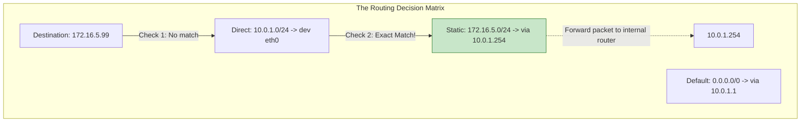

# CHAPTER 43 — ROUTING AND GATEWAYS

---

## 1. Introduction

A Linux server often sits at the intersection of multiple networks. It might have one network card (`eth0`) plugged into the public internet, and a second network card (`eth1`) plugged into a private, highly secure database network. When an application on the server tries to send data to a specific IP address, the Linux kernel must instantly decide which network card to send the data out of. This decision-making process is called **Routing**.

Linux servers don't just run applications; they can act as full-fledged routers. An administrator might configure a Linux machine to act as a VPN gateway, an internet firewall (using NAT), or a bridge between two isolated corporate departments. Understanding the routing table is essential for diagnosing why a server can reach the internet but cannot reach a server in the adjacent rack.

Traffic Isolation and Security. In a Payment Card Industry (PCI) compliant environment, credit card data must never touch the public internet. Companies use strict routing tables on their Linux servers to ensure that any traffic destined for the credit card database is forced out of a specific, private, encrypted interface (`eth1`), while standard web traffic goes out `eth0`. A routing mistake can lead to a massive data breach.

---

## 2. Routing And Gateways

### The Routing Table
The routing table is an ordered list of rules stored in the kernel's RAM. Every time a packet leaves the server, the kernel checks this list from top to bottom. It looks for the *most specific* match to the destination IP address.

### Directly Connected Networks
If you assign `10.0.1.50/24` to `eth0`, the kernel automatically adds a route saying, "The entire `10.0.1.0/24` network lives out of `eth0`." You don't have to configure this. If the server tries to ping `10.0.1.99`, it knows exactly where to send it.

### The Default Gateway (`0.0.0.0/0`)
What happens if the server tries to ping `8.8.8.8` (Google)? The kernel checks the table. `8.8.8.8` is not part of the `10.0.1.0/24` network. The kernel reaches the very bottom of the routing table, which is the "catch-all" rule. In networking, `0.0.0.0/0` means "literally any IP address on earth". The rule says: "If you don't know where it goes, send it to the router at `10.0.1.1` via `eth0`."

### Static Routes
Sometimes the Default Gateway isn't enough. Imagine a massive corporate network with a hidden HR database at `172.16.50.0/24`. Your normal internet router (`10.0.1.1`) doesn't know where that is. But you have a second, special internal router (`10.0.1.254`) that does. You must add a **Static Route** to your server: "If you want to talk to HR, send the packet to `.254`. For everything else, send it to `.1`."

---

## 3. Production Architecture



---

## 4. Command-by-Command Explanation

### `ip route show` (or `ip r`)
- **Purpose:** Displays the kernel's current routing table.

### `ip route add 172.16.5.0/24 via 10.0.1.254 dev eth0`
- **Purpose:** Adds a temporary static route. It tells the kernel: "To reach the 172 network, send the traffic out of the `eth0` network card, and hand it to the router at `10.0.1.254`." (This disappears on reboot).

### `ip route del 172.16.5.0/24`
- **Purpose:** Deletes the temporary route.

### `nmcli connection modify eth0 +ipv4.routes "172.16.5.0/24 10.0.1.254"`
- **Purpose:** Adds a *persistent* static route using NetworkManager. (Notice the `+` sign. If you omit the `+`, it will overwrite and delete all other static routes on the interface!).

### `sysctl -w net.ipv4.ip_forward=1`
- **Purpose:** Instantly enables IP forwarding in the kernel, turning the Linux server into a router.

---

## 5. Real Production Examples

### Diagnosing "Network Unreachable"
An administrator tries to ping a backup server (`172.16.0.50`), but gets `connect: Network is unreachable`.
1. The admin runs `ip route`.
2. They notice there is NO `default via` line at all.
3. Because the backup server's IP is not on the local subnet, and there is no Default Gateway to act as a catch-all, the kernel literally throws its hands up and says "I have no idea how to reach this network."
4. **Fix:** `nmcli con modify eth0 ipv4.gateway 192.168.1.1 && nmcli con up eth0`

### Building a Basic Linux Router
An administrator needs to bridge a test lab (`eth1` - `10.0.0.x`) to the main office (`eth0` - `192.168.1.x`).
```bash
# 1. Enable forwarding temporarily in RAM
sudo sysctl -w net.ipv4.ip_forward=1

# 2. Make it permanent across reboots
echo "net.ipv4.ip_forward=1" | sudo tee -a /etc/sysctl.conf

# Now, if a lab machine points its Default Gateway to this Linux server's eth1 IP, 
# the Linux server will seamlessly route the traffic out eth0 to the office.
```

---

## 6. Common Mistakes

1. **Forgetting the `+` in `nmcli`** — If you run `nmcli con modify eth0 ipv4.routes "..."` (without the `+`), it will delete every single other static route on the interface and replace them with this one. Always use `+ipv4.routes` to append.
2. **Adding a route to an unreachable Next Hop** — If your server is on `192.168.1.0/24`, and you try to add a static route `via 10.0.0.1`, the command will fail. The kernel will say, "I can't use 10.0.0.1 as a router, because I don't even know how to reach 10.0.0.1!" The "via" (Next Hop) IP *must* exist on your local subnet.
3. **Assuming ping proves routing** — A junior admin pings a server and it fails. They spend 3 hours checking routing tables. The routing tables are perfect. The destination server just has its firewall configured to drop ping (ICMP) packets.

---

## 7. Best Practices

- Use `ip route get <IP>` before adding a static route. It tells you exactly how the kernel is currently planning to handle the traffic. This often reveals that a route you thought was missing is actually being handled perfectly by a broader subnet rule.
- Keep static routes to an absolute minimum. If you have 50 static routes on a single Linux server, your network architecture is fundamentally flawed. Routing should be handled by actual routers (Cisco/Juniper), not by individual application servers.

---

## 8. Security Considerations

- **Source Routing / Spoofing:** Hackers can spoof IP addresses, sending packets that pretend to be from inside the corporate network. The kernel parameter `net.ipv4.conf.all.rp_filter = 1` (Reverse Path Filtering) forces the kernel to check if the incoming packet arrived on the interface it *expected* it to. If a packet claiming to be from the internal database arrives on the public internet interface (`eth0`), the kernel instantly drops it as a spoofing attack.

---

## 9. Performance Considerations

- **Routing Table Lookups:** A Linux server with 10 rules in its routing table processes packets in microseconds. A Linux server running BGP (Border Gateway Protocol) with the full internet routing table (900,000+ routes) requires massive amounts of RAM and specialized kernel tuning to look up destinations quickly. For standard servers, this is never an issue.

---

## 10. Troubleshooting Guide

| Symptom | Root Cause | Resolution |
|:---|:---|:---|
| Server cannot reach internet | Missing `default via` route | Add a default gateway |
| Traffic goes to wrong router | Subnet overlap / Wrong static route | Check `ip route`. Delete bad route. |
| Server receives packet but won't pass it to another network | IP Forwarding is disabled | Run `sysctl -w net.ipv4.ip_forward=1` |
| Route disappears after reboot | Added via `ip route add` | Re-add it using `nmcli` to make it persistent |

---

## 11. Practical Labs

**Lab 43.1:** Analyzing the Table
```bash
ip route
# Ask the kernel how it reaches Google
ip route get 8.8.8.8
```

**Lab 43.2:** Temporary Routing
*(Warning: Use dummy IPs so you don't break your SSH connection!)*
```bash
# Add a fake static route
sudo ip route add 10.99.99.0/24 via 192.168.1.1
ip route
# Ask the kernel how it will reach the fake network now
ip route get 10.99.99.50
# Delete it
sudo ip route del 10.99.99.0/24
```

**Lab 43.3:** Permanent Routing
```bash
sudo nmcli con modify "Wired connection 1" +ipv4.routes "10.99.99.0/24 192.168.1.1"
sudo nmcli con up "Wired connection 1"
ip route
# Clean up (Use the minus sign to remove it)
sudo nmcli con modify "Wired connection 1" -ipv4.routes "10.99.99.0/24 192.168.1.1"
sudo nmcli con up "Wired connection 1"
```

---

## 12. Mini Project

Isolate the Problem: Network vs Application.
Your web server (`10.0.1.10`) cannot pull data from the DB server (`10.0.2.50`).
1. **Layer 3 Check:** `ip route get 10.0.2.50`. Ensure it points to the correct gateway.
2. **Layer 3 Check:** `ping 10.0.2.50`. If it replies, your routing is perfect. The network is fine.
3. **Layer 4 Check:** `nc -vz 10.0.2.50 3306`. (Netcat checks if the specific port is open). If this fails, but ping works, then the router is forwarding the traffic perfectly, but a firewall is blocking the specific database port.
4. *Conclusion:* You don't need a static route. You need a firewall rule.

---

## 13. Assignments

1. What does the IP address `0.0.0.0/0` represent in a routing table?
2. If you want your Linux server to act as a router and forward packets between two networks, what kernel parameter must you change?
3. What is the difference in permanence between `ip route add` and `nmcli con modify +ipv4.routes`?

---

## 14. Interview Questions

### Basic
1. **Q: What command do you use to view the routing table?**
   A: `ip route` (or `ip route show`).

2. **Q: If a server has no default gateway configured, what happens when you try to `ping google.com`?**
   A: The kernel returns a "Network is unreachable" error because it has no rule telling it where to send packets destined for unknown networks.

### Intermediate
3. **Q: You have a server with a default gateway pointing to the internet. You have a second, internal router at `192.168.1.254` that connects to the `10.50.0.0/16` corporate network. How do you ensure corporate traffic goes to the internal router, while normal traffic goes to the internet?**
   A: I would add a static route specifically for the `10.50.0.0/16` subnet, pointing its "Next Hop" (via) to `192.168.1.254`. Because the routing table processes the most specific match first, corporate traffic will hit the static route, and all other traffic will fall through to the default gateway.

4. **Q: Why should you use `ip route get <IP>` when troubleshooting?**
   A: Complex servers might have dozens of routing rules, VPN tunnels, and virtual interfaces. Instead of manually reading and guessing which rule applies, `ip route get <IP>` asks the kernel to simulate the routing decision and output exactly which interface and gateway it will use for that specific IP.

### Scenario-Based
5. **Q: A junior administrator was asked to add a new static route to a production server using `nmcli`. They typed `nmcli con modify eth0 ipv4.routes "10.10.10.0/24 192.168.1.254"` and bounced the interface. Instantly, three other corporate subnets disconnected from the server. What did the junior admin do wrong?**
   A: The junior admin forgot to include the `+` sign before `ipv4.routes`. By omitting the `+`, the command acted as an overwrite, deleting all existing static routes attached to that interface and replacing them with only the new one. They should have typed `+ipv4.routes`.

---

## 15. Chapter Summary and Quick Revision Notes

- **Routing Table:** A list of rules telling the kernel where to send packets.
- **Default Gateway (`0.0.0.0/0`):** The catch-all rule for unknown destinations.
- **`ip route`:** Views the table.
- **`ip route add`:** Temporary static route (Lost on reboot).
- **`nmcli con modify ... +ipv4.routes`:** Persistent static route.
- **`ip route get <IP>`:** Tests the routing logic.
- **IP Forwarding:** Disabled by default. Must be enabled (`net.ipv4.ip_forward=1`) for a Linux machine to act as a router.

---

## 16. Cheat Sheet

| Command | Purpose |
|:---|:---|
| `ip route` | View the routing table |
| `ip route get 8.8.8.8` | Test which route will be used |
| `ip route add 10.5.0.0/16 via 192.168.1.1`| Add temporary route |
| `ip route del 10.5.0.0/16` | Delete temporary route |
| `nmcli con modify eth0 +ipv4.routes ...` | Add persistent route |
| `sysctl -w net.ipv4.ip_forward=1` | Enable IP Forwarding (Router mode) |
