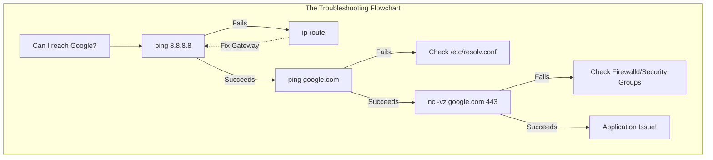

# CHAPTER 46 — NETWORK TROUBLESHOOTING

---

## 1. Introduction

A server is completely useless if it cannot communicate with the rest of the world. "The network is down" is the most common complaint in IT. However, the network is rarely actually down. Usually, a firewall rule is blocking a specific port, a routing table is misconfigured, an application is bound to the wrong IP, or DNS is failing. A Linux administrator must have a systematic approach and a specific set of tools to diagnose exactly where the communication breakdown is happening.

When an application developer says, "My code can't reach the database, the server is broken," the Linux administrator does not blindly reboot the server. They use tools like `ping`, `ss`, and `netcat` to systematically prove whether the issue is at the physical layer, the routing layer, the firewall layer, or if the developer's application is simply misconfigured.

Mean Time To Resolution (MTTR). When a production website goes offline, the company loses money every second. The faster an administrator can pinpoint the exact cause of the outage—"It's not the web server, the database firewall on Port 3306 was accidentally closed"—the faster they can fix it and restore service.

---

## 2. Network Troubleshooting

### The OSI Model Approach
Professional troubleshooting follows the OSI (Open Systems Interconnection) model, usually from the bottom up:
- **Layer 1 (Physical):** Is the cable plugged in? (`ip link` shows `state UP`).
- **Layer 2 (Data Link):** Are MAC addresses communicating? (Local network issues).
- **Layer 3 (Network):** Is the IP address correct? Is the Default Gateway routing packets? (`ping`, `ip route`).
- **Layer 4 (Transport):** Is the firewall blocking the TCP/UDP port? (`nc`, `firewall-cmd`).
- **Layer 7 (Application):** Is the Apache process actually running and listening? (`ss`, `systemctl status`).

### Listening Ports vs Established Connections
- **Listening:** The server has a process (like Nginx on Port 80) sitting idle, waiting for someone on the internet to connect to it.
- **Established:** A client has successfully connected to Port 80, and data is actively flowing between them right now.

---

## 3. Production Architecture



---

## 4. Command-by-Command Explanation

### `ping -c 4 8.8.8.8`
- **Purpose:** Sends 4 ICMP Echo Request packets to the destination and measures the time it takes to get a reply. Proves Layer 3 routing works.

### `traceroute google.com`
- **Purpose:** Maps the exact network path a packet takes through the internet. If routing fails halfway, this tells you exactly which ISP or router dropped the ball.

### `ss -tulpn`
- **Purpose:** The modern replacement for `netstat`. Lists all active listening sockets on the server.
  - `-t`: TCP connections
  - `-u`: UDP connections
  - `-l`: Listening ports only
  - `-p`: Show the process (PID) using the port
  - `-n`: Numeric output (shows IP `8.8.8.8` instead of trying to resolve it to a name, which makes the command run instantly).

### `nc -vz 10.0.1.50 3306`
- **Purpose:** Netcat. Tests if a specific TCP port is open on a remote server.
  - `-v`: Verbose output (tell me if it succeeded or failed).
  - `-z`: Zero-I/O mode. Connect to the port, and immediately disconnect without sending any data. (Used purely for scanning).

### `tcpdump -i eth0 port 80`
- **Purpose:** A packet sniffer. It intercepts and prints every single packet traveling across the `eth0` network card on Port 80 in real-time. Essential for deep analysis.

---

## 5. Real Production Examples

### The MTU / Jumbo Frame Issue
A server can send small text files perfectly, but when it tries to upload a 50MB PDF, the connection hangs and times out forever.
This happens when a router somewhere along the path has a lower Maximum Transmission Unit (MTU) than the server. The server sends a massive packet, and the router silently drops it because it's too big.
The admin tests this by sending a massive ping with the "Do Not Fragment" flag set:
```bash
ping -M do -s 1500 google.com
```
If this fails, but `ping -s 1400 google.com` succeeds, the admin knows there is an MTU bottleneck on the network.

### Analyzing Traffic with tcpdump
A web server is acting strangely. The administrator suspects a specific IP (`192.168.1.100`) is spamming the server. They run a packet capture to watch the raw traffic in real-time.
```bash
# Capture all traffic specifically involving that IP
sudo tcpdump -i eth0 host 192.168.1.100 -nn
```
*(The `-nn` flag prevents tcpdump from trying to resolve IP addresses and port numbers to human names, making it output 10x faster).*

---

## 6. Common Mistakes

1. **Relying entirely on Ping** — Ping uses the ICMP protocol. Many corporate firewalls and cloud environments (like AWS Security Groups) block ICMP entirely. If a server doesn't respond to ping, it might still be perfectly healthy and serving web pages on Port 80. Always verify with `nc` (Netcat) or `curl`.
2. **Confusing "Connection Refused" with "Connection Timeout"**
   - **Timeout:** The packet was silently dropped. This is almost ALWAYS a Firewall blocking the port.
   - **Refused:** The packet made it through the firewall, reached the server, but the server actively slapped it away because there is no application currently listening on that port. (The Apache service is stopped/crashed).
3. **Forgetting `sudo` with `ss`** — If you run `ss -tulpn` as a regular user, it will show the ports, but the "Process Name" column will be blank, making it very hard to see *what* is using the port.

---

## 7. Best Practices

- Always use the `-n` flag with network commands (`ss -n`, `tcpdump -n`, `traceroute -n`). DNS resolution takes time. If DNS is broken, running these tools without `-n` will cause them to hang for 30 seconds while they try to look up hostnames. `-n` gives you instant output.
- When troubleshooting, follow the OSI model rigidly. Do not jump to editing Apache configuration files if you haven't even verified that the server has a Default Gateway.

---

## 8. Security Considerations

- **Packet Sniffing:** `tcpdump` is an incredibly powerful tool. It literally captures the raw data flowing over the wire. If someone logs into a legacy FTP server (which does not use encryption), an administrator running `tcpdump` will see the plaintext username and password printed right on their screen. This is why root access is strictly guarded.

---

## 9. Performance Considerations

- Running `tcpdump` on a high-traffic production server (like a load balancer processing 50,000 requests a second) without strict filters will consume massive amounts of CPU and disk I/O, potentially crashing the server. Always use specific filters (like `port 22` or `host 10.0.0.5`) when capturing packets in production.

---

## 10. Troubleshooting Guide

| Output/Symptom | Meaning | Next Step |
|:---|:---|:---|
| `ping: connect: Network is unreachable` | Server has no route to the destination | Check `ip route` and Default Gateway |
| `ping` hangs / 100% packet loss | ICMP blocked by firewall, or server is dead | Try `nc` to see if a specific TCP port is open |
| `nc: Connection timed out` | Firewall is dropping packets | Check `firewall-cmd` on destination server |
| `nc: Connection refused` | No application is listening | Run `ss -tulpn` on destination server |
| `ss` shows application bound to `127.0.0.1` | App only accepts local traffic | Change app config to bind to `0.0.0.0` |

---

## 11. Practical Labs

**Lab 46.1:** Basic Connectivity and Sockets
```bash
ping -c 3 google.com
# See what ports your server is listening on
sudo ss -tulpn
```

**Lab 46.2:** Netcat Testing
```bash
# Test if Google has port 443 (HTTPS) open
nc -vz google.com 443
# Test if Google has port 22 (SSH) open (It should timeout or fail)
nc -vz google.com 22
```

**Lab 46.3:** Traceroute
```bash
# Trace the path your packets take to reach Google
traceroute google.com
```

---

## 12. Mini Project

The Tcpdump Verification.
1. Open a second SSH terminal to your server.
2. In Terminal 1, start capturing ICMP (ping) traffic:
   `sudo tcpdump -i eth0 icmp -nn`
3. In Terminal 2, ping Google:
   `ping -c 2 google.com`
4. Watch Terminal 1. You will see exactly 4 packets:
   - Your IP -> Google's IP (Echo Request)
   - Google's IP -> Your IP (Echo Reply)
   - Your IP -> Google's IP (Echo Request)
   - Google's IP -> Your IP (Echo Reply)
5. Press Ctrl+C in Terminal 1 to stop the capture. You have just proved at the packet level that routing is functioning perfectly.

---

## 13. Assignments

1. What is the difference between "Connection Refused" and "Connection Timed Out" when testing a port with `nc`?
2. What command has replaced `netstat` on modern Linux systems to view listening ports?
3. Why should you almost always use the `-n` flag when running tools like `ss` or `tcpdump`?

---

## 14. Interview Questions

### Basic
1. **Q: A user complains that a web server is down. What is the very first command you run to see if the server is still alive on the network?**
   A: `ping <IP_Address>`

2. **Q: What command do you use to see all the TCP ports that applications are currently listening on?**
   A: `sudo ss -tulpn` (or `netstat -tulpn`).

### Intermediate
3. **Q: You try to ping a remote server, and it fails. You want to know if the packet is leaving your network, or if it is getting dropped halfway across the internet by an ISP. What tool do you use?**
   A: `traceroute <IP>`. It will list every router hop along the path until the packet is dropped, allowing me to pinpoint the exact location of the failure.

4. **Q: A developer deployed a NodeJS app on Port 8080. You run `sudo ss -tulpn | grep 8080` and see: `tcp LISTEN 0 128 127.0.0.1:8080 0.0.0.0:*`. The developer says they cannot reach the app from their laptop. What is the problem?**
   A: The application is bound to `127.0.0.1` (localhost). This means it will only accept connections originating from the server itself. To allow external connections from a laptop, the developer must change the application's configuration to bind to `0.0.0.0` (all interfaces) or the specific IP of the external network card.

### Scenario-Based
5. **Q: Walk me through your exact troubleshooting process. A developer says "The database at 10.5.5.50 is broken, I can't connect."**
   A: I follow the OSI model:
   1. **Layer 3:** I run `ping 10.5.5.50`. If it replies, the server is online and routing works. If not, I check my local `ip route`.
   2. **Layer 4:** Assuming ping works, I run `nc -vz 10.5.5.50 3306`.
      - If it returns "Connection Timed Out", a firewall is dropping the packets. I need to log into the DB server and check `firewalld` or AWS Security Groups.
      - If it returns "Connection Refused", the firewall let the packet through, but the database isn't listening.
   3. **Layer 7:** If it was refused, I SSH into the database server and run `sudo ss -tulpn | grep 3306`. If it's empty, the database process crashed or was stopped. I check `systemctl status mysqld`.
   4. **Application:** If `nc` succeeded, then the network, firewall, and port are all perfect. The issue is likely bad credentials in the developer's application config file.

---

## 15. Chapter Summary and Quick Revision Notes

- **Troubleshooting requires a structured approach (OSI Model).**
- **Layer 3 (Routing):** Use `ping` and `traceroute`.
- **Layer 4 (Transport/Firewall):** Use `nc` (Netcat) to test specific ports.
- **Layer 7 (Application):** Use `ss -tulpn` to verify the application is listening.
- **`127.0.0.1` Binding:** A common error where an app only listens to itself.
- **Timeout vs Refused:** Timeout = Firewall block. Refused = App is dead.
- **`tcpdump`:** The ultimate source of truth. Captures raw packets on the wire.

---

## 16. Cheat Sheet

| Command | Purpose |
|:---|:---|
| `ping -c 4 8.8.8.8` | Test routing and latency |
| `traceroute google.com` | Trace path through routers |
| `sudo ss -tulpn` | List all listening ports and processes |
| `nc -vz 10.0.0.5 80` | Test if TCP Port 80 is open |
| `sudo tcpdump -i eth0 port 22` | Capture all SSH packets |
| `sudo tcpdump -i eth0 host 10.5.5.5`| Capture packets to/from specific IP |
