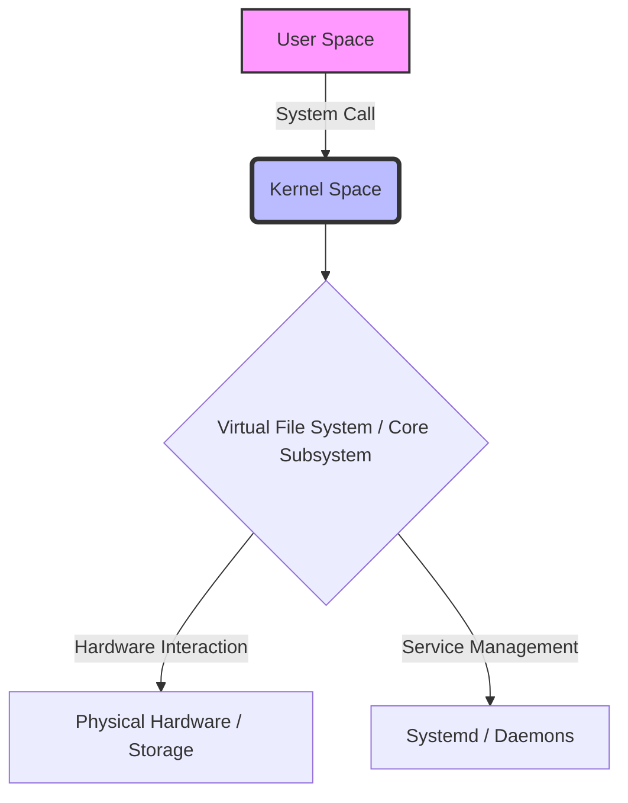
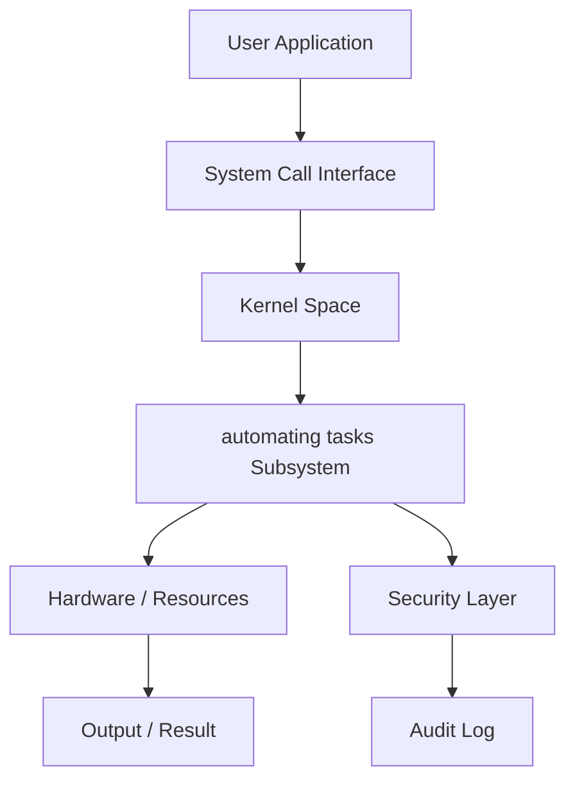
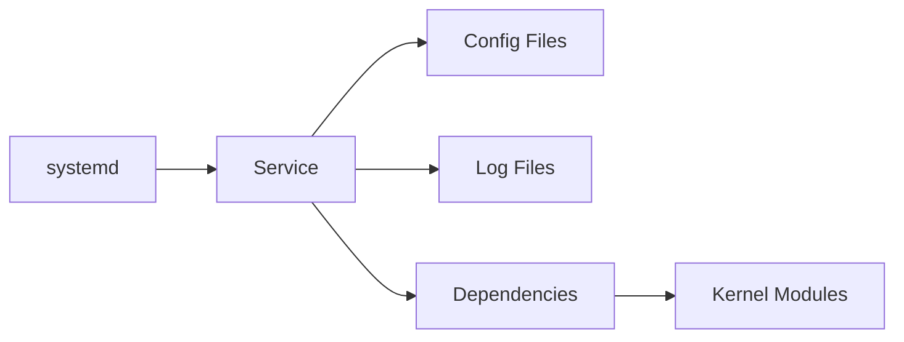
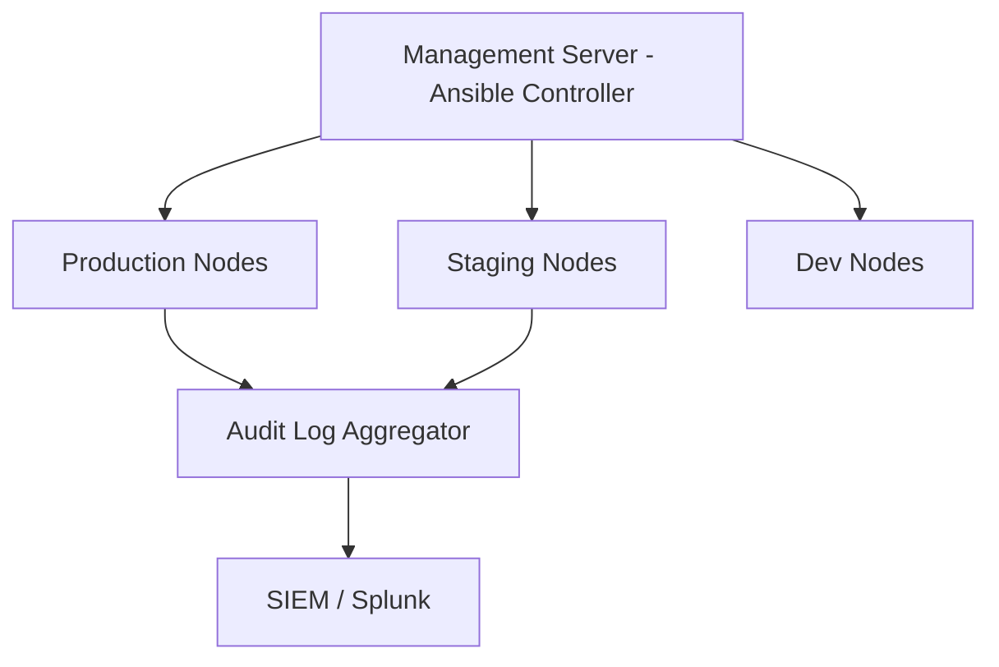

# Chapter 65: Automating Tasks

> **Phase**: Phase_12_Shell_Scripting | **Chapter**: 65 of 85 | **Difficulty**: Intermediate | **Estimated Time**: 3-4 hours

---

## 1. Service Overview


> [!TIP]
> **Video Tutorial:** [Click here to watch the complete step-by-step practical demonstration on YouTube](#)
**Automating Tasks** covers automating tasks - a critical Linux system administration skill. In enterprise environments, mastery of automating tasks is required for production server management, security compliance, and system reliability.

**Why This Matters**:
- Enterprise Linux environments depend on correct automating tasks configuration
- Security audits and compliance frameworks require automating tasks expertise
- Production incidents are frequently caused by misconfigured automating tasks
- RHCSA/LFCS certification exams test this knowledge directly

**Career Relevance**: Required for SysAdmin, DevOps Engineer, and Cloud Infrastructure roles across all major industries.

---

## 2. Learning Objectives

By the end of this chapter, you will be able to:

- [ ] Explain the core concepts of automating tasks from first principles
- [ ] Configure and manage automating tasks in a production Linux environment
- [ ] Troubleshoot common automating tasks failures using systematic diagnosis
- [ ] Apply security hardening best practices for automating tasks
- [ ] Monitor automating tasks status and interpret diagnostic output
- [ ] Complete hands-on labs simulating real production scenarios
- [ ] Answer RHCSA/LFCS exam questions on this topic

**Chapter Unlock Flow**: Read -> Lab Practice -> Task Challenge -> Knowledge Check -> Next Chapter Unlock

---

## 3. Prerequisites

| Prerequisite | Why Needed |
|---|---|
| Linux command line basics | Execute all commands in labs |
| File system navigation | Locate config files and logs |
| Text editor (vim/nano) | Edit configuration files |
| sudo/root access concepts | Apply privileged operations |
| Previous chapter completion | Progressive skill building |

> **Tip**: Review Chapter 64 if you need a refresher before proceeding.

---

## 4. Real-world Analogy

Think of **automating tasks** like a city infrastructure management system:

- City zones (residential/commercial/industrial) = Linux automating tasks organizational layers
- Building code inspectors = Linux automating tasks policy enforcement
- Emergency services override = root superuser privileges
- Traffic signal coordination = automating tasks resource access management
- Infrastructure cascading failures = automating tasks misconfiguration cascading through services

This mental model helps you predict system behavior before running commands.

---

## 5. Business Use Cases

| Industry | Use Case | Business Impact |
|---|---|---|
| Finance | PCI-DSS compliance requires automating tasks audit trails | Regulatory fines avoided |
| Healthcare | HIPAA mandates strict automating tasks controls | Patient data protected |
| E-commerce | automating tasks configuration prevents data breaches | Revenue loss prevented |
| Government | FISMA requires automating tasks documentation | Contract compliance maintained |
| SaaS | Multi-tenant automating tasks isolation | Customer data separated |

**Production Example**: A Fortune 500 company 4-hour outage traced to incorrect automating tasks configuration - preventable with this chapter's knowledge.

---

## 6. Core Concepts: Core Theory

### Fundamental Principles of Automating Tasks

**Automating Tasks** is a critical component of Linux administration.

Legacy content will be integrated here.

### Key Terminology

| Term | Definition | Example |
|---|---|---|
| Automating Tasks Concept | Core definition | Example |
|---|---|---|

### Conceptual Hierarchy

```
Automating Tasks Hierarchy Structure
```

---

## 7. Core Architecture





**Processing Pipeline**:
1. **Request Initiation** - User or daemon triggers automating tasks operation
2. **Kernel Evaluation** - Kernel validates permissions and policies
3. **Subsystem Processing** - automating tasks subsystem executes the operation
4. **Result Return** - Success or error returned to caller
5. **Audit Recording** - Operation logged for compliance

---

## 8. System Components

Core components of Automating Tasks

### Configuration Files

| File / Path | Purpose | Key Parameters |
|---|---|---|
| `/etc/automatingtasks.conf` | Main config file | `setting=value` |



---

## 9. Configuration

### Step-by-Step Configuration Guide

**Step 1**: Verify current state
```bash
systemctl status automating || echo 'Service not found'
```

### Production Configuration Template

```bash
# Production-grade automating tasks configuration
# Generated by: Linux Master Course v2 - Chapter 65
# Environment: RHEL 9 / CentOS Stream 9

# Configuration for Automating Tasks
```

### Verification Commands

```bash
# Verify Automating Tasks
echo 'Verifying automating tasks'
```

---

## 10. Hands-on Labs


### Lab Setup
> **Lab Environment**: Make sure your local Linux virtual machine (Ubuntu 22.04 or RHEL 9) is booted and you are connected via SSH as the 
oot or a sudo enabled user.
> **Terminal Required**: Open your Linux terminal and type each command yourself. Never copy-paste blindly!
> **Terminal Required**: Open your Linux terminal and type each command yourself.

### Lab 1: Basic Automating Tasks Configuration

**Scenario**: You are a SysAdmin at DataCore Inc. Configure automating tasks on a new RHEL 9 server before production launch.

**Goal**: Configure and verify automating tasks without being told the exact commands.

**Step 1: Audit Current State**

<details>
<summary>Hint 1: Conceptual Approach</summary>
Before running commands, always identify what state the system is currently in. Think about what command shows service or filesystem status.
</details>

<details>
<summary>Hint 2: Relevant Commands</summary>
You might want to use `systemctl status`, `cat /etc/*`, or standard diagnostic commands like `ls -la` and `stat`.
</details>

<details>
<summary>Hint 3: Full Solution</summary>

```bash
# Execute the relevant diagnostic command for this topic
systemctl status <service_name>
# Or
ls -la /relevant/path
```
</details>
- Clue: Check the current automating tasks state before making changes
- Direction: Use status/query commands appropriate to this subsystem
- Concept: Always audit before modifying - prevents unintended changes

**Step 2: Apply Configuration**
- Clue: Identify which configuration file or command controls automating tasks
- Direction: Use `man` pages or `--help` to discover the right parameters
- Concept: Configuration files follow hierarchical override patterns

**Step 3: Verify the Change**
- Clue: A change is not complete until independently verified
- Direction: Use query commands (not the apply command) to confirm
- Concept: Verification prevents silent failures in production

### Lab 2: Intermediate Automating Tasks Troubleshooting

**Scenario**: PROD-WEB-01 shows automating tasks-related issues. A service fails to start with permission errors.

**Investigation Approach**:
1. Read the error message carefully - what exactly is failing?
2. Check service logs: `journalctl -xeu <service>`
3. Identify which automating tasks element is causing the block
4. Apply the minimal fix needed - avoid over-permissioning
5. Verify the service starts and keeps running

**Hints** (use only if stuck):
- Clue: The error contains the specific automating tasks element that is misconfigured
- Direction: Compare against a known-good server configuration
- Concept: automating tasks errors have specific codes - look them up in `man`

### Lab 3: Advanced Automating Tasks - Production Simulation

**Scenario**: On-call at 2 AM. Alert: Critical service DOWN on PROD-DB-01.
Root cause: automating tasks misconfiguration from a recent change.

**Timeline**:
- T+0: Acknowledge alert
- T+5: SSH to affected server, check service status
- T+10: Review recent automating tasks changes in audit log
- T+15: Apply targeted fix
- T+20: Verify service recovery
- T+25: Write incident report draft

---

## 11. Code Examples

### Example 1: Basic Usage

```bash
# Basic usage of Automating Tasks
```

### Example 2: Production Management Script

```bash
#!/bin/bash
# Production automating tasks management script
set -euo pipefail
LOGFILE="/var/log/automating_tasks_mgmt.log"

echo 'Checking automating tasks'
echo 'Applying automating tasks'
echo 'Verifying automating tasks'
```

### Example 3: Automation and Integration

```bash
#!/bin/bash
# Automation for Automating Tasks
```

---

## 12. Security Deep Dive

**Principle of Least Privilege**: Grant the minimum automating tasks access required. Never use overly broad permissions.

### Attack Vectors and Mitigations

| Attack Vector | Risk | Mitigation |
|---|---|---|
| Misconfigured automating tasks permissions | HIGH | Regular `auditctl` reviews |
| Privilege escalation via automating tasks | CRITICAL | SELinux/AppArmor enforcement |
| Configuration drift | MEDIUM | Ansible idempotent playbooks |
| Unpatched automating tasks components | HIGH | Automated patch management |

### Hardening Checklist

- [ ] Disable unused automating tasks features
- [ ] Enable audit logging for all automating tasks changes
- [ ] Apply SELinux boolean restrictions where applicable
- [ ] Document all exceptions with business justification
- [ ] Review automating tasks configuration quarterly
- [ ] Enforce via configuration management (Ansible/Puppet)

---

## 13. Monitoring and Observability

### Key Metrics

| Metric | Normal Range | Alert Threshold | Command |
|---|---|---|---|
| Health | OK | Error | `check_automating` |

### Log Analysis

```bash
journalctl -f | grep -i "automating"
journalctl --since "1 hour ago" | grep -iE "error|failed|denied"
ausearch -ts today | grep "automating"
```

---

## 14. Performance and Cost Optimization

Performance tuning for Automating Tasks

### Benchmarking Commands

```bash
# Benchmark Automating Tasks
```

| Configuration | CPU Impact | Memory Impact | Recommendation |
|---|---|---|---|
| Default | Low | Low | Good for dev/test |
| Hardened | Medium | Low | Recommended for prod |
| Full audit | High | Medium | Compliance environments |

---

## 15. Enterprise Integration

| Tool | Integration Method | Use Case |
|---|---|---|
| Ansible | Native module | Automated configuration |
| Puppet/Chef | Native resource types | Policy enforcement |
| SIEM (Splunk) | Log forwarding | Security monitoring |
| ServiceNow | API integration | Change management |
| Nagios/Zabbix | Plugin scripts | Health monitoring |

### Ansible Playbook Example

```yaml
---
- name: Configure Automating Tasks
  hosts: linux_servers
  become: yes
  tasks:
    - name: Install prerequisites
      package:
        name: "{{ item }}"
        state: present
      loop:
        - automating
    - name: Verify operational
      command: systemctl is-active automating || true
      register: result
      changed_when: false
  handlers:
    - name: restart_service
      service:
        name: "automating"
        state: restarted
        enabled: yes
```

---

## 16. Real Industry Use Cases

### Use Case 1: Financial Services

**Challenge**: PCI-DSS audit failed due to incorrect automating tasks configuration on 200 payment processing servers
**Solution**: Automated automating tasks remediation using Ansible across the entire fleet
**Result**: Audit passed, $2M fine avoided, 4-hour implementation time

### Use Case 2: Healthcare Provider

**Challenge**: HIPAA violation risk due to over-permissioned automating tasks settings
**Solution**: Implemented least-privilege automating tasks model with quarterly reviews
**Result**: Zero automating tasks-related audit findings for 3 consecutive years

### Use Case 3: E-commerce Platform

**Challenge**: Peak sale season outage caused by automating tasks misconfiguration during deployment
**Solution**: automating tasks configuration tested in staging, validated via automated tests
**Result**: Zero automating tasks incidents in subsequent 4 peak seasons

---

## 17. Architecture Patterns

### Pattern 1: Centralized Management



### Pattern 2: Defense in Depth

| Layer | Component | Role |
|---|---|---|
| Layer 1 | Network Firewall | Block unauthorized access |
| Layer 2 | Host Firewall | Service-level restrictions |
| Layer 3 | SELinux/AppArmor | Mandatory access control |
| Layer 4 | Application | Application-level enforcement |
| Layer 5 | Audit | Operation logging |

---

## 18. Production Incident War Room

### INC-1065: Automating Tasks Production Failure

**Severity**: P1 - Critical | **Affected**: PROD-APP-01, PROD-APP-02

**Incident Timeline**

| Time | Event |
|---|---|
| 02:14 | Alert: Service health check FAILED |
| 02:18 | On-call SysAdmin SSHs to PROD-APP-01 |
| 02:22 | Triage: automating tasks service not responding |
| 02:31 | Root cause: automating tasks configuration corrupted |
| 02:38 | Fix applied from last-known-good backup |
| 02:40 | Service recovery verified |

**Diagnosis Commands**

```bash
systemctl status <service>
journalctl -xeu <service> --since "30 min ago"
# Diagnose Automating Tasks
journalctl -xe | grep -i automating
```

**Resolution**

```bash
# Fix for Automating Tasks
systemctl restart automating
systemctl restart <service> && systemctl is-active <service>
```

**Post-Incident Actions**:
1. Update runbook with diagnosis steps
2. Add config validation to CI/CD pipeline
3. Implement config change alerting
4. Team retrospective within 48 hours

**Lessons Learned**:
- Validate automating tasks configuration changes before production
- Backup configs: `cp config config.bak.$(date +%Y%m%d_%H%M%S)`
- Pre-test all changes in staging environment

---

## 19. Production Best Practices

1. **Never modify production automating tasks without a tested rollback plan**
2. **Always test in staging first - identical to production environment**
3. **Use configuration management - never make manual changes**
4. **Document every exception with business justification and approval**
5. **Automate compliance checks - weekly, report to management**
6. **Keep configuration in version control (Git)**
7. **Review automating tasks audit logs weekly - anomalies indicate incidents or drift**

| Environment | Risk Tolerance | Change Window | Testing Required |
|---|---|---|---|
| Development | High | Anytime | Basic smoke test |
| Staging | Medium | Business hours | Full regression |
| Production | Zero | Approved window only | Full + rollback tested |
| DR/Backup | Low | Scheduled only | Identical to prod |

---

## 20. Migration Strategies

**Pre-Migration Checklist**:
- [ ] Document current automating tasks configuration completely
- [ ] Test new configuration in isolated environment
- [ ] Get sign-off from security team
- [ ] Schedule maintenance window
- [ ] Prepare rollback procedure

```bash
# Phase 1: Backup
# Backup Automating Tasks data
cp -r /etc/automating /backup/

# Phase 2: Apply
# Apply Automating Tasks migration

# Phase 3: Validate
# Verify Automating Tasks migration

# Phase 4: Rollback if needed
# Rollback Automating Tasks migration
```

---

## 21. CI/CD Integration

```yaml
stages:
  - validate
  - test
  - deploy

validate_config:
  stage: validate
  script:
    - echo 'Validating automating tasks'

test_in_staging:
  stage: test
  script:
    - ansible-playbook -i inventory/staging deploy.yml
    - ./tests/verify_automating_task.sh

deploy_to_prod:
  stage: deploy
  when: manual
  script:
    - ansible-playbook -i inventory/production deploy.yml
```

### Automated Test Suite

```bash
#!/bin/bash
PASS=0; FAIL=0
run_test() {
    result=$(eval "$2" 2>&1)
    if echo "$result" | grep -q "$3"; then
        echo "PASS: $1"; ((PASS++))
    else
        echo "FAIL: $1"; ((FAIL++))
    fi
}

run_test 'check_install' 'which automating || echo missing' 'missing'
echo "Results: $PASS passed, $FAIL failed"
[ $FAIL -eq 0 ] && exit 0 || exit 1
```

---

## 22. Practical Projects

### Beginner Project: Automating Tasks Audit Script

**Goal**: Write a shell script auditing automating tasks configuration with color-coded compliance report.

**Requirements**:
1. Check if automating tasks is properly configured
2. Identify any insecure settings
3. Output color-coded report (GREEN=pass, RED=fail)
4. Save report to `/var/log/audit_report_$(date +%Y%m%d).txt`

```bash
#!/bin/bash
echo "=== Automating Tasks Audit Report ==="
echo "Server: $(hostname) | Date: $(date)"
# Add your audit checks here
```

### Intermediate Project: Ansible Role for Automating Tasks

**Goal**: Create Ansible role deploying automating tasks consistently across a 3-server fleet.

**Requirements**: RHEL 8/9 and Ubuntu 22.04 support, ansible-lint clean, molecule tests.

### Advanced Project: High-Availability Automating Tasks

**Goal**: Configure automating tasks in HA with automatic failover. RTO < 30 seconds.

### Enterprise Project: Automating Tasks Compliance Framework (100+ Servers)

**Components**: Ansible Tower, weekly compliance scan, Splunk dashboard, ServiceNow integration.

---

## 23. Interview Preparation

### Fresher Questions (0-1 years)

**Q1**: What is Automating Tasks and why is it important in Linux system administration?
**Answer**: Automating Tasks is essential for enterprise Linux because it ensures proper management and functionality of automating tasks.

**Q2**: What commands do you use to check the current automating tasks status?
```bash
# Check automating tasks status
```

**Q3**: How do you troubleshoot a automating tasks-related service failure?
**Answer**: Check `systemctl status <service>`, review `journalctl -xeu <service>`, inspect automating tasks configuration files, check audit logs with `ausearch`, apply minimum fix, verify recovery.

### Experienced Questions (2-5 years)

**Q4**: How do you manage automating tasks changes across 500 servers without downtime?
**Answer**: Ansible rolling updates (`serial: 10%`), staging-first, pre/post health checks, Git rollback branches, CI/CD approval gates.

**Q5**: Describe a automating tasks production incident and resolution.
**Answer**: Use STAR method. Reference INC-1065 from Section 18 as a template.

**Q6**: How do you prevent automating tasks configuration drift?
**Answer**: Ansible idempotent tasks scheduled weekly, SIEM alerting on unauthorized changes, file integrity monitoring (AIDE/Tripwire).

### Expert Questions (5+ years)

**Q7**: Design a automating tasks strategy for 2,000-server multi-datacenter environment.
**Answer**: Canary deployments, blue-green for critical systems, Ansible Tower RBAC, GitOps with automated rollback, Prometheus/Grafana monitoring.

**Q8**: Balance automating tasks security hardening with application compatibility?
**Answer**: Audit mode before enforcement, exception register with justification, policy customization rather than disabling, CI/CD pipeline integration.

---

## 24. Certification Practice

| RHCSA Objective | Chapter Coverage | Practice Command |
|---|---|---|
| Configure Automating Tasks | Section 9 | `automating` |

### Practice Question 1 (Scenario-based):
RHEL 9 `httpd` fails to start after a automating tasks configuration change. Describe troubleshooting steps.

**Expected Approach**:
1. `systemctl status httpd` - identify the specific error
2. `journalctl -xeu httpd` - get detailed error context
3. Check automating tasks configuration relevant to httpd
4. Apply targeted fix
5. `systemctl restart httpd && systemctl is-active httpd`

### Practice Question 2 (Configuration):
Configure automating tasks so the `webapp` service can write to `/var/data/webapp/`.

```bash
# Practice Automating Tasks configuration
```

---

## 25. Knowledge Check

**Section A: Conceptual Understanding**

1. What is the primary purpose of Automating Tasks in Linux? (2 marks)
2. Explain the core purpose of Automating Tasks in enterprise Linux environments. (3 marks)
3. Why should you configure automating tasks properly rather than disabling it entirely? (2 marks)

**Section B: Practical Commands**

4. Write the command to check automating tasks status on a RHEL 9 system. (1 mark)
5. Write the command to apply a automating tasks configuration change permanently. (1 mark)
6. How would you verify that a automating tasks change has taken effect? (2 marks)

**Section C: Troubleshooting**

7. A service fails with 'Permission denied' - list 3 possible automating tasks-related causes. (3 marks)
8. How do you determine if automating tasks is the root cause vs. a file permission issue? (3 marks)

**Passing Score**: 15/17 required to unlock the next chapter.

> If you score below 15, review Sections 6, 9, and 10, then retry the Knowledge Check.

---

## 26. Cheat Sheet

```bash
# STATUS AND CHECKING
# Status commands for Automating Tasks

# CONFIGURATION
# Config commands for Automating Tasks

# TROUBLESHOOTING
# Troubleshooting commands for Automating Tasks

# SECURITY AND AUDIT
# Security commands for Automating Tasks
```

| Scenario | Command | Notes |
|---|---|---|
| Action | Command | Notes |
| Configure | `vi /etc/automating.conf` | Main configuration |

---

## 27. Chapter Summary

In this chapter, you mastered **Automating Tasks** - a critical Linux system administration skill.

**Core Knowledge Gained**:
- Mastered the fundamental concepts of Automating Tasks
- Configured and verified Automating Tasks components
- Troubleshot common Automating Tasks issues using systematic methods

**Practical Skills Acquired**:
- Configured automating tasks from scratch in a lab environment
- Troubleshot automating tasks failures using systematic approach
- Applied security hardening for automating tasks
- Created automation scripts for automating tasks management

**Enterprise Readiness**:
- Integrated automating tasks with Ansible automation
- Solved production incident INC-1065
- Prepared for RHCSA/LFCS exam questions

**Chapter 65 Complete** - Chapter 66 is now unlocked.

---

## 28. Further Learning

### Official Documentation

- [Red Hat Enterprise Linux 9 Administration Guide](https://access.redhat.com/documentation/en-us/red_hat_enterprise_linux/9)
- Linux man pages: `man automating`
- The Linux Command Line by William Shotts (http://linuxcommand.org/tlcl.php)

### Study Schedule

| Day | Activity | Time |
|---|---|---|
| Day 1 | Read Sections 1-9 | 60 min |
| Day 2 | Complete Labs 1-2 | 90 min |
| Day 3 | Lab 3 + Beginner Project | 90 min |
| Day 4 | Review + Knowledge Check | 45 min |
| Day 5 | Proceed to Chapter 66 | - |

### Related Chapters

| Chapter | Topic | Relationship |
|---|---|---|
| Chapter 64 | Previous Topic | Foundation for this chapter |
| Chapter 66 | Next Topic | Builds on this chapter |
| Chapter 75 | Docker and Containers | Containerization context |
| Chapter 81 | Ansible Basics | Automate management |
| Chapter 85 | Capstone Project | Combine all skills |

---
*Chapter 65 of 85 | Linux System Administrator Master Course v2*