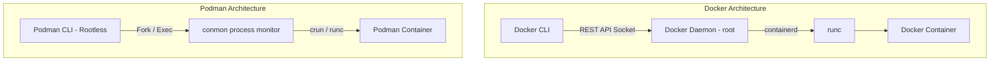
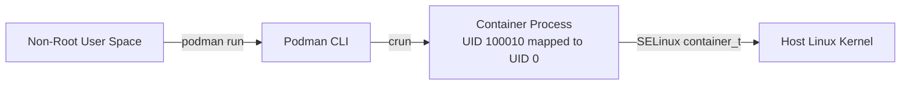

# Chapter 75: Docker & Podman Containerization Fundamentals

---

## 1. Service Overview


> [!TIP]
> **Video Tutorial:** [Click here to watch the complete step-by-step practical demonstration on YouTube](#)
### The Container Revolution: Docker & Podman
For decades, system administrators faced the classic developer excuse: *"The code works on my laptop, so it must be a production server issue."* Dependency mismatches (different Python, PHP, or glibc versions) caused frequent deployment failures. Containerization solved this permanently by packaging application code, runtime environments, system libraries, and configuration files into a self-contained, immutable unit called a **Container**.

### Docker vs. Podman — Daemon vs. Daemonless Engine
While Docker pioneered the container ecosystem using a centralized root-level daemon (`dockerd`), Red Hat Enterprise Linux (RHEL 8 & RHEL 9) adopted **Podman** as the default container engine.

- **Docker (Daemon Architecture)**: Uses a central `dockerd` service running as `root`. If the daemon crashes, all running containers crash.
- **Podman (Daemonless Architecture)**: Operates without a central daemon using a fork/exec process model. Containers run directly as child processes of the user, supporting **Rootless Containers** out of the box.

### Business Problem It Solves
- **Cost Reduction & Server Density**: Unlike Virtual Machines that require a full 20GB OS copy and dedicated RAM per VM, containers share the host Linux kernel. A single physical host can run hundreds of microservice containers, reducing cloud infrastructure costs by up to 70%.
- **Security Isolation**: Podman rootless containers execute without root privileges, eliminating host takeover risks if a container is compromised.

---

## 2. Learning Objectives
1. **Compare** Docker and Podman architectures (Daemon vs. Daemonless, Rootful vs. Rootless).
2. **Execute** container lifecycle operations using `podman` and `docker` CLI toolchains.
3. **Manage** container persistent storage via Volumes and network bindings.
4. **Deploy** multi-container groups using Podman Pods and generate Kubernetes YAML manifests (`podman generate kube`).

---

## 3. Prerequisites
- Completion of Chapters 01–15 (Systemd, Networking, Storage, Process Management).

---

## 4. Real-world Analogy
Think of server infrastructure evolution as commercial shipping:
- **Bare Metal / Virtual Machines**: Ordering individual cargo ships for every single box of goods. Each ship requires its own captain, engine room, and crew (Full Guest Operating System).
- **Docker Containers**: Standardized ISO shipping containers stacked efficiently on one big cargo ship (Host Linux Kernel). The ship's crane operator (**Docker Daemon**) handles all boxes.
- **Podman Containers**: Automated self-loading shipping containers (**Daemonless Fork/Exec**) that load themselves onto the ship without relying on a single crane operator. If one worker takes a break, the rest of the ship keeps running smoothly.

---

## 5. Business Use Cases

| Scenario | Recommended Engine | Rationale |
| :--- | :--- | :--- |
| **RHEL 8 / 9 Enterprise Server** | Podman | Native RHEL default, daemonless, integrated with systemd and rootless security |
| **Cross-Platform Developer Workstation** | Docker Desktop / Podman Desktop | Broad developer tooling, GUI interface, legacy CI pipeline compatibility |
| **High-Security Multi-Tenant Server** | Podman (Rootless) | Non-root user execution prevents container breakout from compromising host root |
| **Kubernetes Pod Testing** | Podman | Native support for Podman Pods and `podman generate kube` export |

---

## 6. Core Concepts: Core Theory

### Images vs. Containers
- **Image**: A read-only template built from layered filesystems (e.g. `registry.access.redhat.com/ubi9/ubi-minimal`).
- **Container**: A running, isolated process instantiated from an Image using Linux namespaces (`pid`, `net`, `mnt`, `ipc`, `uts`, `user`) and `cgroups`.

### Rootless Containers & SubUID Mapping
Podman rootless containers map the unprivileged user (e.g. UID 1001) to UID 0 *inside* the container namespace using `/etc/subuid` and `/etc/subgid`. On the host filesystem, the container process never gains true root privileges.

---

## 7. Internal Architecture



---

## 8. System Components
- `/etc/containers/registries.conf`: Configures trusted container image registries (Red Hat Quay, Docker Hub).
- `/etc/subuid` & `/etc/subgid`: Maps subordinate user and group IDs for rootless container execution.
- `conmon` (Container Monitor): Lightweight daemon monitoring individual Podman container execution and logging.

---

## 9. Configuration
Primary Podman registry configuration file (`/etc/containers/registries.conf`):

```ini
[registries.search]
registries = ['registry.access.redhat.com', 'docker.io']
```

---

## 10. Hands-on Labs


### Lab Setup
> **Lab Environment**: Make sure your local Linux virtual machine (Ubuntu 22.04 or RHEL 9) is booted and you are connected via SSH as the 
oot or a sudo enabled user.
> **Terminal Required**: Open your Linux terminal and type each command yourself. Never copy-paste blindly!
### Lab 1: Deploying a Rootless Web Container with Podman
Deploy an Nginx web server using Podman as a non-root user.

```bash
# 1. Verify subuid and subgid mapping for current user
cat /etc/subuid | grep $(whoami)

# 2. Run a rootless Nginx container on unprivileged port 8080
podman run -d --name my-web -p 8080:80 nginx:alpine

# 3. Inspect running container status
podman ps

# 4. Test web response
curl http://localhost:8080
```

### Lab 2: Managing Podman Pods & Exporting Kubernetes Manifests
Create a Podman Pod containing Nginx and Redis, then export a Kubernetes YAML file.

```bash
# 1. Create a Podman Pod with shared network namespace
podman pod create --name web-stack -p 8000:80

# 2. Launch Nginx container inside the Pod
podman run -d --pod web-stack --name web-app nginx:alpine

# 3. Export Pod definition to Kubernetes YAML
podman generate kube web-stack > pod-spec.yaml
cat pod-spec.yaml
```

#### Progressive Hint System
- **Level 1 (Clue)**: Use `podman run` with `-d` for background mode and `-p host:container` for port mapping.
- **Level 2 (Direction)**: Unprivileged users cannot bind ports below 1024 without sysctl adjustments; use port 8080 or 8000.
- **Level 3 (Concept)**: Podman Pods share the same network IP and localhost interface between containers, matching Kubernetes Pod specifications.

---


#### Progressive Hint System

<details>
<summary>Hint 1: Conceptual Approach</summary>
Before running commands, always identify what state the system is currently in. Think about what command shows service or filesystem status.
</details>

<details>
<summary>Hint 2: Relevant Commands</summary>
You might want to use `systemctl status`, `cat /etc/*`, or standard diagnostic commands like `ls -la` and `stat`.
</details>

<details>
<summary>Hint 3: Full Solution</summary>

```bash
# Execute the relevant diagnostic command for this topic
systemctl status <service_name>
# Or
ls -la /relevant/path
```
</details>

## 11. Code Examples

### Docker vs. Podman Command Comparison

| Operation | Docker Syntax | Podman Syntax |
| :--- | :--- | :--- |
| **Run Web Server** | `docker run -d -p 80:80 nginx` | `podman run -d -p 8080:80 nginx` |
| **List Containers** | `docker ps -a` | `podman ps -a` |
| **Inspect Logs** | `docker logs -f my-app` | `podman logs -f my-app` |
| **Execute Shell** | `docker exec -it my-app sh` | `podman exec -it my-app sh` |
| **Prune Stopped** | `docker system prune -a` | `podman system prune -a` |
| **Systemd Service**| `docker-compose` | `podman generate systemd --files` |

---

## 12. Security Deep Dive
- **SELinux Container Separation**: Podman automatically labels container processes with `container_t` and `container_file_t` SELinux contexts. If a process breaks out of namespaces, SELinux blocks host filesystem access.
- **Dropping Capabilities**: Further harden containers using `--cap-drop=ALL --cap-add=NET_BIND_SERVICE`.

---

## 13. Monitoring & Observability
- Live container resource usage: `podman stats`
- Inspect container metadata: `podman inspect my-web`

---

## 14. Performance & Cost Optimization
- Use minimal base images (`ubi-minimal`, `alpine`) to keep image sizes under 50MB and accelerate build pipelines.

---

## 15. Enterprise Integration
Integrates with Red Hat Quay, AWS ECR, and systemd user services for automatic container startup upon host reboot.

---

## 16. Real Industry Use Cases
1. **RHEL 9 Microservices Migration**: Replacing monolithic VMs with Podman rootless containers managed by systemd.

---

## 17. Architecture Patterns



---

## 18. Production Incident War Room

### Incident INC-1075: Rootless Podman Port Binding Failure (<1024)
- **Severity**: P2 / High | **Service Affected**: Web Application Gateway
- **Symptom**: `podman run -p 80:80 nginx` fails with `PermissionDenied: cannot bind to port 80`.
- **Root Cause Analysis**: Rootless Podman runs as an unprivileged user. Linux kernel security restricts non-root users from binding ports below 1024 (`net.ipv4.ip_unprivileged_port_start`).
- **Remediation Script**:
```bash
# Option A: Map to an unprivileged host port (>1024)
podman run -d -p 8080:80 nginx

# Option B: Lower unprivileged port threshold in sysctl (Requires root once)
echo "net.ipv4.ip_unprivileged_port_start=80" | sudo tee -a /etc/sysctl.d/99-podman.conf
sudo sysctl --system
```

---

## 19. Production Best Practices
- Prefer Podman over Docker on RHEL 8/9 for native enterprise support and rootless security.
- Never run containers as root unless hardware device access explicitly requires it.

---

## 20. Migration Strategies
Create a command alias in `~/.bashrc` to transition seamlessly from Docker to Podman:
```bash
alias docker=podman
```

---

## 21. CI/CD Integration
Run Podman inside GitLab CI or GitHub Actions pipelines without needing `docker.sock` volume mounts, eliminating Docker-in-Docker security risks.

---

## 22. Practical Projects
- **Beginner Project**: Deploy Nginx and MariaDB using Podman volumes.
- **Intermediate Project**: Create a multi-container Podman Pod and export Kubernetes YAML.
- **Advanced Project**: Generate systemd unit files (`podman generate systemd`) to manage container autostart.
- **Enterprise Project**: Build a rootless Podman deployment pipeline with Quay.io registry authentication.

---

## 23. Interview Preparation
#### Q1: What is the main architectural difference between Docker and Podman?
**Answer**: Docker relies on a centralized, root-privileged daemon process (`dockerd`) to manage containers via a REST API. Podman is daemonless, using a fork/exec model where containers run as direct child processes of the invoking user, enabling native rootless container execution.

---

## 24. Certification Practice
**Question**: Which Podman command generates a Kubernetes-compliant YAML manifest from a running container or pod?
- A) `podman export kube`
- B) `podman generate kube` **(Correct)**
- C) `podman k8s manifest`
- D) `podman convert yaml`

---

## 25. Knowledge Check
1. **Interactive Quiz**: Which file configures subordinate user ID mappings for rootless Podman? (`/etc/subuid`).

---

## 26. Cheat Sheet
| Command | Purpose |
| :--- | :--- |
| `podman run -d -p 8080:80 image` | Run detached container with port mapping |
| `podman ps -a` | List all containers |
| `podman pod create --name my-pod` | Create a Podman Pod |
| `podman generate kube my-pod` | Export Kubernetes YAML manifest |
| `podman stats` | Display live resource usage |

---

## 27. Chapter Summary
Podman delivers daemonless, rootless container execution on enterprise RHEL systems. Understanding Docker vs Podman CLI tools, volumes, pods, and Kubernetes YAML generation equips SysAdmins for modern cloud-native operations.

---

## 28. Further Learning
- [Podman Official Documentation](https://podman.io)
- [Red Hat Enterprise Linux Container Guide](https://access.redhat.com)
