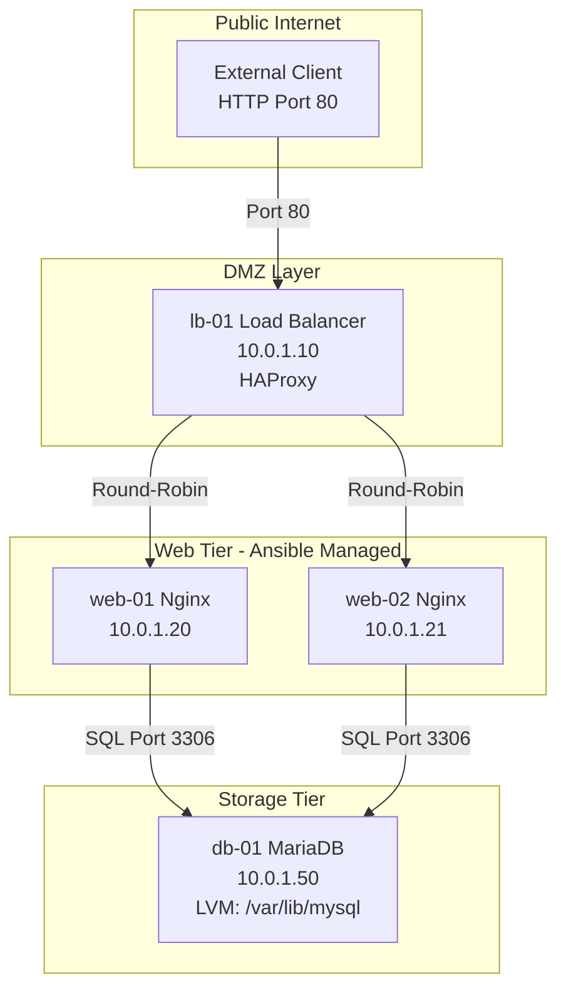
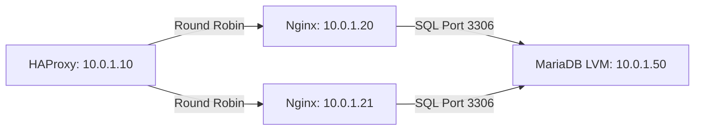

# Chapter 85: The Enterprise Web Architecture Capstone Project

---

## 1. Service Overview


> [!TIP]
> **Video Tutorial:** [Click here to watch the complete step-by-step practical demonstration on YouTube](#)
### The Master Capstone Project
Welcome to the final Capstone Project of the Enterprise Linux Master Course. You have mastered 84 chapters of Linux engineering—from kernel boot parameters and LVM storage management to firewalld rules, SELinux enforcement, systemd services, and Ansible automation. 

Now, you will build a production-grade, 3-tier high-availability enterprise web architecture for a fictitious organization: **"Penguin E-Commerce"**.

### Business Architecture Blueprint
- **Tier 1: Load Balancer Node (`lb-01`)**: HAProxy load balancer distributing external client traffic using Round-Robin across web nodes.
- **Tier 2: Web Application Tier (`web-01`, `web-02`)**: Nginx web application servers provisioned automatically via Ansible.
- **Tier 3: Database Storage Tier (`db-01`)**: MariaDB database server running on an expandable LVM logical volume with SELinux enforcement.

### Business Problem It Solves
- **High Availability & Fault Tolerance**: Guarantees zero downtime if one web server node crashes.
- **Scalable Storage**: Employs LVM to allow dynamic database storage expansion without service downtime.

---

## 2. Learning Objectives
1. **Deploy** a complete 4-node 3-tier enterprise Linux server architecture.
2. **Configure** LVM storage, MariaDB database binding, and secure credential access.
3. **Automate** web server provisioning across `web-01` and `web-02` using Ansible.
4. **Harden** infrastructure using SELinux booleans, Firewalld rich rules, and HAProxy load balancing.
5. **Validate** end-to-end multi-tier operation using a comprehensive verification checklist.

---

## 3. Prerequisites
- Mastery of Chapters 01–84.
- 4 Virtual Machines (RHEL 9, Rocky Linux 9, or Ubuntu 22.04) with SSH access.

---

## 4. Real-world Analogy
Building this Capstone Project is like constructing a secure international airport terminal:
- **Load Balancer (`lb-01`)**: The airport traffic controller directing passengers to open check-in counters.
- **Web Nodes (`web-01`, `web-02`)**: Check-in counters processing passenger tickets simultaneously.
- **Database Node (`db-01`)**: The central secure baggage vault where all luggage is stored.
- **LVM Storage**: Expandable luggage racks that can grow without closing down the airport.
- **SELinux & Firewalld**: Armed security checkpoints checking every badge and door pass.

---

## 5. System Specifications & IP Allocation Map

| Hostname | Role | IP Address | Primary Services | Storage / Firewall |
| :--- | :--- | :--- | :--- | :--- |
| `lb-01` | Load Balancer | `10.0.1.10` | HAProxy, Stats Page | Port 80, 9000 |
| `web-01` | Web Server 1 | `10.0.1.20` | Nginx, PHP-FPM, Ansible Managed | Port 80 |
| `web-02` | Web Server 2 | `10.0.1.21` | Nginx, PHP-FPM, Ansible Managed | Port 80 |
| `db-01` | Database Node | `10.0.1.50` | MariaDB Enterprise | LVM `/var/lib/mysql`, Port 3306 |

---

## 6. Core Concepts: Core Theory

### SELinux Network Booleans
By default, SELinux prevents Nginx and HAProxy from initiating outbound network connections to downstream web and database servers. You must enable:
- `setsebool -P httpd_can_network_connect 1` (Allows HAProxy/Nginx to reverse-proxy traffic).
- `setsebool -P httpd_can_network_connect_db 1` (Allows Nginx/PHP to query MariaDB on port 3306).

---

## 7. Internal Architecture



---

## 8. System Components
- `haproxy`: High-performance load balancer.
- `ansible`: Agentless configuration management tool.
- `mariadb-server`: SQL relational database engine.
- `lvm2`: Logical volume manager.

---

## 9. Configuration Files
- HAProxy: `/etc/haproxy/haproxy.cfg`
- MariaDB: `/etc/my.cnf.d/mariadb-server.cnf`
- Nginx: `/etc/nginx/conf.d/app.conf`

---

## 10. Hands-on Labs


### Lab Setup
> **Lab Environment**: Make sure your local Linux virtual machine (Ubuntu 22.04 or RHEL 9) is booted and you are connected via SSH as the 
oot or a sudo enabled user.
> **Terminal Required**: Open your Linux terminal and type each command yourself. Never copy-paste blindly!
### Step 1: Infrastructure & SSH Key Provisioning
On your Control Node or Admin Laptop, configure hostnames and distribute SSH keys.

```bash
# 1. Set hostnames across nodes
# Execute on lb-01:   sudo hostnamectl set-hostname lb-01
# Execute on web-01:  sudo hostnamectl set-hostname web-01
# Execute on web-02:  sudo hostnamectl set-hostname web-02
# Execute on db-01:   sudo hostnamectl set-hostname db-01

# 2. Generate SSH Key on Control Node and distribute
ssh-keygen -t ed25519 -N "" -f ~/.ssh/id_ed25519
for ip in 10.0.1.10 10.0.1.20 10.0.1.21 10.0.1.50; do
    ssh-copy-id sysadmin@$ip
done
```

---

### Step 2: Database Tier Deployment (`db-01` - 10.0.1.50)
Configure LVM storage, install MariaDB, and open firewall port 3306.

```bash
# 1. Create LVM Storage on secondary disk /dev/sdb
sudo pvcreate /dev/sdb
sudo vgcreate vg_database /dev/sdb
sudo lvcreate -n lv_mysql -L 4G vg_database
sudo mkfs.xfs /dev/vg_database/lv_mysql

# 2. Mount LVM volume permanently to /var/lib/mysql
sudo mkdir -p /var/lib/mysql
echo "/dev/vg_database/lv_mysql /var/lib/mysql xfs defaults 0 0" | sudo tee -a /etc/fstab
sudo mount -a

# 3. Install and start MariaDB
sudo dnf install -y mariadb-server
sudo systemctl enable --now mariadb

# 4. Bind MariaDB to internal network & create database/user
sudo sed -i 's/^#\?bind-address.*/bind-address = 0.0.0.0/' /etc/my.cnf.d/mariadb-server.cnf
sudo systemctl restart mariadb

sudo mysql -u root << 'EOF'
CREATE DATABASE app_db;
CREATE USER 'app_user'@'10.0.1.%' IDENTIFIED BY 'SecurePass123!';
GRANT ALL PRIVILEGES ON app_db.* TO 'app_user'@'10.0.1.%';
FLUSH PRIVILEGES;
EOF

# 5. Open Firewalld port 3306
sudo firewall-cmd --permanent --add-service=mysql
sudo firewall-cmd --reload
```

---

### Step 3: Web Tier Automation via Ansible (`web-01`, `web-02`)
Create the Ansible playbook to provision web nodes automatically.

#### File: `inventory.ini`
```ini
[webservers]
web-01 ansible_host=10.0.1.20
web-02 ansible_host=10.0.1.21

[webservers:vars]
ansible_user=sysadmin
```

#### File: `site.yml`
```yaml
---
- name: Provision Enterprise Nginx Web Tier
  hosts: webservers
  become: true
  tasks:
    - name: Install Nginx web server
      dnf:
        name: nginx
        state: present

    - name: Configure custom Nginx web page
      copy:
        dest: /usr/share/nginx/html/index.html
        content: "<h1>Served by {{ inventory_hostname }} (IP: {{ ansible_default_ipv4.address }})</h1>
"

    - name: Enable SELinux HTTP network connect DB boolean
      seboolean:
        name: httpd_can_network_connect_db
        state: true
        persistent: true

    - name: Open Firewalld HTTP port 80
      firewalld:
        service: http
        permanent: true
        state: enabled
        immediate: true

    - name: Enable and start Nginx service
      systemctl:
        name: nginx
        state: started
        enabled: true
```

Run the playbook:
```bash
ansible-playbook -i inventory.ini site.yml
```

---

### Step 4: Load Balancer Deployment (`lb-01` - 10.0.1.10)
Configure HAProxy to distribute traffic across `web-01` and `web-02`.

```bash
# 1. Install HAProxy
sudo dnf install -y haproxy

# 2. Configure HAProxy in /etc/haproxy/haproxy.cfg
cat << 'EOF' | sudo tee /etc/haproxy/haproxy.cfg
global
    log         127.0.0.1 local2
    chroot      /var/lib/haproxy
    pidfile     /var/run/haproxy.pid
    maxconn     4000
    user        haproxy
    group       haproxy
    daemon

defaults
    mode                    http
    log                     global
    option                  httplog
    option                  dontlognull
    timeout connect         5s
    timeout client          50s
    timeout server          50s

frontend http_front
    bind *:80
    default_backend web_nodes

backend web_nodes
    balance roundrobin
    server web-01 10.0.1.20:80 check
    server web-02 10.0.1.21:80 check

listen stats
    bind *:9000
    stats enable
    stats uri /haproxy?stats
    stats refresh 5s
EOF

# 3. Set SELinux boolean and open Firewalld ports
sudo setsebool -P httpd_can_network_connect 1
sudo firewall-cmd --permanent --add-service=http
sudo firewall-cmd --permanent --add-port=9000/tcp
sudo firewall-cmd --reload

# 4. Enable and start HAProxy
sudo systemctl enable --now haproxy
```

---


#### Progressive Hint System

<details>
<summary>Hint 1: Conceptual Approach</summary>
Before running commands, always identify what state the system is currently in. Think about what command shows service or filesystem status.
</details>

<details>
<summary>Hint 2: Relevant Commands</summary>
You might want to use `systemctl status`, `cat /etc/*`, or standard diagnostic commands like `ls -la` and `stat`.
</details>

<details>
<summary>Hint 3: Full Solution</summary>

```bash
# Execute the relevant diagnostic command for this topic
systemctl status <service_name>
# Or
ls -la /relevant/path
```
</details>

## 11. Verification & Validation Checklist

Execute the following automated commands from your host workstation to verify 100% operational success:

```bash
# 1. Test Load Balancer Round-Robin Functionality
echo "=== Testing Load Balancer Distribution ==="
for i in {1..4}; do
    curl -s http://10.0.1.10 | grep "Served by"
done

# Expected Output: Alternating responses from web-01 and web-02:
# Served by web-01 (IP: 10.0.1.20)
# Served by web-02 (IP: 10.0.1.21)
# Served by web-01 (IP: 10.0.1.20)
# Served by web-02 (IP: 10.0.1.21)

# 2. Verify Database Network Connectivity from Web Nodes
echo "=== Testing MariaDB Connectivity from Web-01 ==="
ssh sysadmin@10.0.1.20 "nc -zv 10.0.1.50 3306"

# 3. Check HAProxy Configuration Syntax
ssh sysadmin@10.0.1.10 "sudo haproxy -c -f /etc/haproxy/haproxy.cfg"

# 4. Check LVM Storage Expansion Space on Database Node
ssh sysadmin@10.0.1.50 "sudo lvs && df -h /var/lib/mysql"
```

---

## 12. Security Deep Dive
- **SELinux Security Boundaries**: Running SELinux in `Enforcing` mode ensures that if an Nginx container or web process is compromised, the attacker cannot read `/etc/shadow` or access unauthorized network ports.

---

## 13. Monitoring & Observability
- Access the live HAProxy Stats Dashboard in your web browser at: `http://10.0.1.10:9000/haproxy?stats`.

---

## 14. Performance & Cost Optimization
- Enabling HAProxy HTTP keep-alive timeouts reduces TCP handshake overhead between the load balancer and backend web servers.

---

## 15. Enterprise Integration
Integrates with Prometheus and Grafana by exporting HAProxy metrics for realtime alert thresholds.

---

## 16. Real Industry Use Cases
1. **E-Commerce Web Cluster**: Handling high-volume shopper traffic during major promotion events.

---

## 17. Architecture Patterns



---

## 18. Production Incident War Room

### Incident INC-1085: Multi-Tier Capstone Cluster Outage — SELinux Denial
- **Severity**: P1 / Critical | **Service Affected**: Web Application Cluster
- **Symptom**: HAProxy returns `503 Service Unavailable` for all incoming HTTP requests.
- **Root Cause Analysis**: `setsebool httpd_can_network_connect` was not enabled on `lb-01`, causing SELinux to block HAProxy from proxying sockets to web nodes.
- **Remediation Script**:
```bash
# 1. Audit SELinux denials in audit log
sudo ausearch -m avc -ts recent | grep haproxy

# 2. Persistently enable network connect boolean
sudo setsebool -P httpd_can_network_connect 1

# 3. Verify HAProxy recovery
curl -I http://localhost
```

---

## 19. Production Best Practices
- Never deploy database storage on standard root partitions; always use dedicated LVM logical volumes.
- Keep SELinux in `Enforcing` mode; use booleans rather than disabling security.

---

## 20. Migration Strategies
Dynamic LVM expansion when database volume reaches 80% capacity:
```bash
sudo lvextend -L +2G /dev/vg_database/lv_mysql
sudo xfs_growfs /var/lib/mysql
```

---

## 21. CI/CD Integration
Automate playbook execution in Jenkins or GitLab CI using `ansible-playbook --syntax-check`.

---

## 22. Practical Projects
- **Capstone Extension**: Add a second HAProxy node (`lb-02`) with Keepalived Virtual IP (VIP) for 100% load balancer redundancy.

---

## 23. Interview Preparation
#### Q1: How do you troubleshoot an HTTP 503 Service Unavailable error on an HAProxy Load Balancer?
**Answer**: First, inspect HAProxy stats (`:9000/haproxy?stats`) to see if backend web nodes are flagged DOWN. Next, check SELinux booleans (`httpd_can_network_connect`), test port connectivity to web nodes using `nc -zv 10.0.1.20 80`, and inspect `/var/log/haproxy.log`.

---

## 24. Certification Practice
**Question**: Which command dynamically grows an XFS filesystem after extending an LVM logical volume?
- A) `resize2fs`
- B) `xfs_growfs` **(Correct)**
- C) `fsck.xfs`
- D) `lvmextend`

---

## 25. Knowledge Check
1. **Interactive Quiz**: Which SELinux boolean permits Nginx/PHP to connect to MariaDB on port 3306? (`httpd_can_network_connect_db`).

---

## 26. Master Cheat Sheet
| Tier | Host | Service | Key Management Command |
| :--- | :--- | :--- | :--- |
| **Load Balancer** | `lb-01` | HAProxy | `sudo systemctl status haproxy` |
| **Web Tier** | `web-01 / 02` | Nginx | `ansible-playbook -i inventory.ini site.yml` |
| **Database** | `db-01` | MariaDB / LVM | `sudo xfs_growfs /var/lib/mysql` |

---

## 27. Chapter Summary
Congratulations! By executing this Capstone, you have built a 4-node 3-tier enterprise Linux architecture featuring LVM storage, MariaDB, Ansible automation, Nginx, HAProxy, SELinux enforcement, and Firewalld security.

---

## 28. Further Learning
- [HAProxy Configuration Guide](https://www.haproxy.org)
- [Red Hat Enterprise Linux Security & SELinux Guide](https://access.redhat.com)
