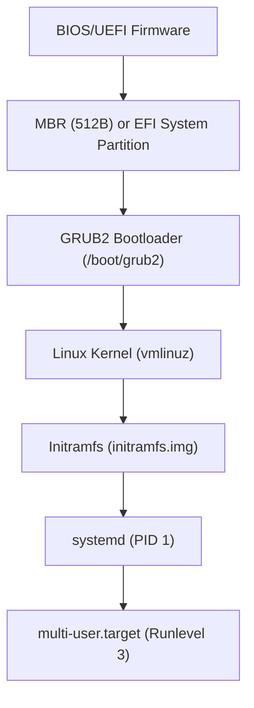
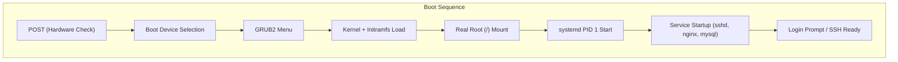
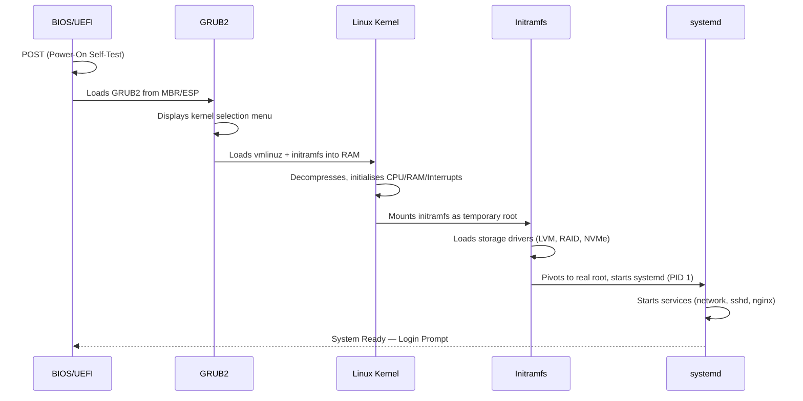

# CHAPTER 04 — LINUX BOOT PROCESS: FROM POWER ON TO LOGIN

---

## 1. Introduction

### Why This Topic Exists
When you press the power button on a Linux server, a precise six-stage sequence executes in under 30 seconds to bring the system from a powered-off state to a fully operational multi-user environment. Understanding this boot sequence is critical for diagnosing boot failures, recovering unbootable servers, configuring boot parameters, and managing system run levels.

### Why Linux Administrators Use It
In production environments, servers that fail to boot represent critical outages. An engineer who understands the boot process can identify whether a failure occurred at the BIOS/UEFI stage, the bootloader (GRUB2), the kernel, or the init system (systemd). This knowledge enables precise troubleshooting and recovery without waiting for vendor support.

### Why Companies Care About It
Server boot failures directly impact business continuity. A payment processing server that fails to boot after a kernel update during a maintenance window can cost the business thousands of dollars per minute of extended downtime. Engineers who can quickly diagnose and recover from boot failures reduce Mean Time to Recovery (MTTR).

---

## 2. Learning Objectives

By the end of this chapter, you will be able to:
- Describe the six stages of the Linux boot process in sequence.
- Explain the role of BIOS/UEFI, MBR/GPT, GRUB2, Kernel, Initramfs, and systemd.
- Configure GRUB2 boot parameters and recover from bootloader failures.
- Understand systemd targets and how they replaced legacy SysVinit runlevels.
- Boot into rescue mode and emergency mode for troubleshooting.
- Reset a lost root password using GRUB2 boot parameter editing.

---

## 3. Beginner-Friendly Explanation

Think of the Linux boot process like waking up and getting ready for work in the morning:

1. **Stage 1 — BIOS/UEFI (The Alarm Clock):** Your alarm clock rings. It performs a quick self-check: "Am I plugged in? Are my batteries working?" This is the Power-On Self-Test (POST).
2. **Stage 2 — MBR/GPT (The Nightstand Drawer):** You reach into your nightstand drawer to find the instructions for today's routine. This small storage area tells you which wardrobe (disk partition) contains your clothes (bootloader).
3. **Stage 3 — GRUB2 (The Morning Planner):** Your morning planner asks: "Which outfit do you want to wear today?" (Which kernel version do you want to boot?). You can choose your outfit or use the default.
4. **Stage 4 — Kernel Loading (Getting Dressed):** You put on your clothes (the kernel loads into memory). The kernel takes control of all your body functions (hardware).
5. **Stage 5 — Initramfs (Temporary Backpack):** You grab a temporary backpack containing just enough tools to get out the door — a minimal root filesystem that helps the kernel find the actual root partition.
6. **Stage 6 — systemd (Your Daily Routine Manager):** Your personal assistant starts all your daily tasks in the correct order: start the car (networking), open the office (SSH), turn on the lights (Apache), and announce "Ready for work!" (login prompt).

---

## 4. Core Theory

### 4.1 The Six Stages of Linux Boot Process

```text
POWER ON
   │
   ▼
┌────────────────────────────┐
│ Stage 1: BIOS / UEFI      │  Hardware initialisation, POST, find boot device
│ (Firmware)                 │
└─────────────┬──────────────┘
              │
              ▼
┌────────────────────────────┐
│ Stage 2: MBR / GPT        │  First 512 bytes (MBR) or EFI System Partition
│ (Boot Sector)              │  Locates and loads bootloader
└─────────────┬──────────────┘
              │
              ▼
┌────────────────────────────┐
│ Stage 3: GRUB2             │  Grand Unified Bootloader v2
│ (Bootloader)               │  Displays kernel menu, loads selected kernel
└─────────────┬──────────────┘
              │
              ▼
┌────────────────────────────┐
│ Stage 4: Linux Kernel      │  Decompresses into RAM, initialises hardware
│ (vmlinuz)                  │  drivers, mounts initramfs
└─────────────┬──────────────┘
              │
              ▼
┌────────────────────────────┐
│ Stage 5: Initramfs         │  Temporary root filesystem in RAM
│ (initramfs-*.img)          │  Loads storage drivers, finds real root (/)
└─────────────┬──────────────┘
              │
              ▼
┌────────────────────────────┐
│ Stage 6: systemd (PID 1)   │  First process. Starts services, mounts
│ (Init System)              │  filesystems, reaches target (multi-user/graphical)
└────────────────────────────┘
              │
              ▼
         LOGIN PROMPT
```

### 4.2 Stage Details

**Stage 1 — BIOS / UEFI:**
- BIOS (Basic Input/Output System) — Legacy firmware. Searches boot devices in configured order (HDD, CD, USB, Network).
- UEFI (Unified Extensible Firmware Interface) — Modern replacement. Supports GPT partitions, Secure Boot, faster initialisation.
- POST (Power-On Self-Test) checks CPU, RAM, and peripheral hardware.

**Stage 2 — MBR / GPT:**
- MBR (Master Boot Record) — First 512 bytes of the boot disk. Contains bootloader code (446 bytes) + partition table (64 bytes) + boot signature (2 bytes). Limited to 2TB disks and 4 primary partitions.
- GPT (GUID Partition Table) — Modern replacement. Supports disks >2TB, up to 128 partitions, and includes redundant backup headers.

**Stage 3 — GRUB2 (Grand Unified Bootloader v2):**
- Configuration file: `/boot/grub2/grub.cfg` (auto-generated — never edit directly).
- Editable defaults: `/etc/default/grub`.
- Displays boot menu with available kernel versions.
- Allows passing boot parameters to the kernel (e.g., `single`, `rd.break`).

**Stage 4 — Linux Kernel:**
- Compressed kernel image: `/boot/vmlinuz-<version>`.
- Decompresses into RAM, initialises core subsystems (memory, CPU scheduler, interrupts).
- Mounts the initramfs image as a temporary root filesystem.

**Stage 5 — Initramfs (Initial RAM Filesystem):**
- Image file: `/boot/initramfs-<version>.img`.
- Contains essential drivers (storage, LVM, RAID, filesystem) needed to find and mount the real root (`/`) partition.
- After mounting the real root, control is passed to `/sbin/init` (systemd).

**Stage 6 — systemd (PID 1):**
- The first user-space process (PID 1).
- Reads unit files and starts services in parallel based on dependency chains.
- Reaches a target (equivalent of old runlevels).

### 4.3 systemd Targets vs Legacy Runlevels

| Legacy Runlevel | systemd Target | Description |
|:---|:---|:---|
| 0 | `poweroff.target` | System shutdown |
| 1 / S | `rescue.target` | Single-user rescue mode (root shell, minimal services) |
| 2 | `multi-user.target` | Multi-user without networking (rare) |
| 3 | `multi-user.target` | Multi-user with networking (CLI — **Production Standard**) |
| 5 | `graphical.target` | Multi-user with networking and GUI desktop |
| 6 | `reboot.target` | System reboot |
| N/A | `emergency.target` | Minimal emergency shell (root FS mounted read-only) |

---

## 5. Internal Working

### GRUB2 Boot Parameter Passing
When GRUB2 loads the kernel, it passes parameters via the kernel command line. These parameters control kernel behaviour:

```text
linux /vmlinuz-5.14.0-362.el9.x86_64 root=UUID=abc-123 ro crashkernel=auto rhgb quiet
```

| Parameter | Meaning |
|:---|:---|
| `root=UUID=abc-123` | Root filesystem UUID to mount as `/` |
| `ro` | Mount root filesystem as read-only initially |
| `crashkernel=auto` | Reserve memory for crash dump kernel |
| `rhgb` | Red Hat Graphical Boot (graphical splash screen) |
| `quiet` | Suppress verbose kernel boot messages |

---

## 6. Production Architecture



---

## 7. Command-by-Command Explanation

### 7.1 `systemctl get-default`
- **Purpose:** Displays the default systemd target the system boots into.
- **Example:** `multi-user.target` (CLI) or `graphical.target` (GUI).

### 7.2 `systemctl set-default multi-user.target`
- **Purpose:** Changes the default boot target to CLI mode (no GUI).

### 7.3 `systemctl isolate rescue.target`
- **Purpose:** Immediately switches to single-user rescue mode (requires root password).

### 7.4 `grub2-mkconfig -o /boot/grub2/grub.cfg`
- **Purpose:** Regenerates GRUB2 configuration file after editing `/etc/default/grub`.

### 7.5 `journalctl -b`
- **Purpose:** Displays all log messages from the current boot session.

### 7.6 `systemd-analyze`
- **Purpose:** Shows total boot time breakdown (firmware, bootloader, kernel, userspace).

---

## 8. Syntax Breakdown

| Command | Purpose |
|:---|:---|
| `systemctl get-default` | Check current default boot target |
| `systemctl set-default <target>` | Set default boot target |
| `systemctl isolate <target>` | Switch to target immediately |
| `grub2-mkconfig -o <path>` | Regenerate GRUB config |
| `journalctl -b` | View current boot log |
| `systemd-analyze` | Boot time analysis |
| `systemd-analyze blame` | Slowest services during boot |

---

## 9. Parameter Explanation

| Parameter | Command | Description |
|:---|:---|:---|
| `-b` | `journalctl` | Show logs from current boot only |
| `-b -1` | `journalctl` | Show logs from previous boot |
| `blame` | `systemd-analyze` | Lists services sorted by startup time |
| `--no-pager` | `journalctl` | Output without paging (useful for scripts) |

---

## 10. Sample Output Analysis

```bash
$ systemd-analyze
Startup finished in 1.523s (firmware) + 1.012s (loader) + 2.341s (kernel) + 8.567s (userspace) = 13.443s
```

| Phase | Time | Meaning |
|:---|:---|:---|
| firmware | 1.523s | BIOS/UEFI POST and hardware initialisation |
| loader | 1.012s | GRUB2 bootloader |
| kernel | 2.341s | Kernel decompression and hardware driver init |
| userspace | 8.567s | systemd service startup |

---

## 11. Architecture Diagram



---

## 12. Workflow Diagram



---

## 13. Real Production Examples

### Root Password Recovery via GRUB2
**Scenario:** An engineer forgets the root password on a production server. No other user has sudo access.

**Recovery Procedure:**
1. Reboot the server and interrupt GRUB2 by pressing `e` at the boot menu.
2. Find the line starting with `linux` and append `rd.break` at the end.
3. Press `Ctrl + X` to boot.
4. The system drops into an initramfs emergency shell with root filesystem mounted read-only at `/sysroot`.
5. Remount as read-write and change password:
   ```bash
   mount -o remount,rw /sysroot
   chroot /sysroot
   passwd root
   touch /.autorelabel    # Required for SELinux relabelling
   exit
   reboot
   ```

### Boot Failure After Kernel Update
**Scenario:** After a `dnf update` that included a kernel upgrade, a RHEL 9 server fails to boot with a kernel panic.

**Recovery:** Reboot and select the previous working kernel from the GRUB2 menu. Then investigate the new kernel's compatibility with hardware drivers.

---

## 14. Common Mistakes

1. **Editing `/boot/grub2/grub.cfg` directly** — This file is auto-generated. Always edit `/etc/default/grub` and regenerate with `grub2-mkconfig`.
2. **Forgetting `touch /.autorelabel` after root password reset** — On SELinux-enabled systems, changing the password without relabelling causes login failures.
3. **Not testing kernel updates before production deployment** — Always test kernel updates on staging servers before applying to production.
4. **Confusing rescue mode with emergency mode** — Rescue mode mounts all filesystems and starts basic services. Emergency mode provides a minimal shell with root mounted read-only.

---

## 15. Best Practices

- Always keep at least two working kernels in GRUB2 (the current and previous version).
- Password-protect GRUB2 on servers with physical access to prevent unauthorised root password resets.
- Use `systemd-analyze blame` to identify and optimise slow-starting services.
- Document the boot configuration of every production server.

---

## 16. Security Considerations

- **GRUB2 Password Protection:** Without a GRUB2 password, anyone with physical or console access can reset the root password.
  ```bash
  grub2-setpassword    # Sets GRUB2 boot menu password
  ```
- **Secure Boot (UEFI):** Ensures only signed bootloaders and kernels can execute, preventing rootkit injection.
- **SELinux Relabelling:** After any root filesystem modification in rescue/emergency mode, ensure SELinux contexts are restored.

---

## 17. Performance Considerations

- Use `systemd-analyze blame` to identify the slowest services and disable unnecessary ones.
- Remove unused kernel modules from initramfs to reduce boot time: `dracut --force`.
- Consider `systemd-resolved` for faster DNS resolution during boot.

---

## 18. Troubleshooting Guide

| Symptom | Root Cause | Resolution |
|:---|:---|:---|
| Server stuck at "Booting from Hard Disk" | GRUB2 corrupted or missing | Boot from rescue ISO, reinstall GRUB2 |
| Kernel panic during boot | Incompatible kernel or missing initramfs | Select previous kernel in GRUB2 menu |
| System drops to emergency mode | `/etc/fstab` error (bad UUID or missing disk) | Fix fstab entry in emergency shell |
| Login prompt never appears | systemd service dependency failure | Check `journalctl -b` for failed services |
| Extremely slow boot (>60 seconds) | Service timeout waiting for network/device | Run `systemd-analyze blame` to identify |

---

## 19. Practical Labs

**Lab 4.1:** Check your current default boot target and boot time:
```bash
systemctl get-default
systemd-analyze
systemd-analyze blame | head -10
```

**Lab 4.2:** View the current boot log:
```bash
journalctl -b | head -50
journalctl -b -p err    # Errors only
```

**Lab 4.3:** Examine GRUB2 configuration (read-only):
```bash
cat /etc/default/grub
ls /boot/vmlinuz-*
ls /boot/initramfs-*
```

---

## 20. Mini Project

Document the complete boot process of your Linux server by capturing the output of `systemd-analyze`, `systemd-analyze blame`, `journalctl -b -p err`, and `cat /etc/default/grub`. Create a boot report saved as `~/boot_analysis.md`.

---

## 21. Assignments

1. Explain the difference between BIOS and UEFI.
2. What is the purpose of initramfs? Why can't the kernel directly mount the root filesystem?
3. Research and document the procedure to reset a lost root password on RHEL 9.

---

## 22. Interview Questions

### Basic
1. **Q: What are the six stages of the Linux boot process?**
   A: (1) BIOS/UEFI — hardware POST. (2) MBR/GPT — locates bootloader. (3) GRUB2 — selects and loads kernel. (4) Kernel — initialises hardware and mounts initramfs. (5) Initramfs — loads drivers, finds real root filesystem. (6) systemd — starts services and reaches default target.

### Intermediate
2. **Q: What is the difference between rescue mode and emergency mode?**
   A: Rescue mode (`rescue.target`) mounts all filesystems, starts basic services, and provides a root shell — useful for general troubleshooting. Emergency mode (`emergency.target`) provides a minimal root shell with the root filesystem mounted read-only — used when rescue mode itself fails (e.g., corrupt `/etc/fstab`).

3. **Q: How do you change the default boot target from graphical to command line?**
   A: `sudo systemctl set-default multi-user.target`

### Advanced
4. **Q: A server fails to boot after a kernel update. How do you recover?**
   A: (1) Reboot and press arrow keys to interrupt GRUB2 auto-boot. (2) Select the previous working kernel version from the GRUB2 menu. (3) Once booted, investigate the new kernel's compatibility. (4) If the new kernel is faulty, remove it: `sudo dnf remove kernel-5.14.0-xxx`. (5) Regenerate GRUB2: `sudo grub2-mkconfig -o /boot/grub2/grub.cfg`.

### Scenario-Based
5. **Q: A production server drops to emergency mode after rebooting. The screen shows "Failed to mount /data". What do you do?**
   A: (1) Enter root password at the emergency shell prompt. (2) Check `/etc/fstab` for the `/data` entry — likely a bad UUID or missing disk. (3) Comment out or fix the problematic line. (4) Run `systemctl daemon-reload`. (5) Test with `mount -a`. (6) Exit and `reboot`. (7) Investigate why the disk was missing (hardware failure, cloud volume detachment).

---

## 23. Chapter Summary and Quick Revision Notes

- Six boot stages: BIOS/UEFI → MBR/GPT → GRUB2 → Kernel → Initramfs → systemd.
- GRUB2 config: edit `/etc/default/grub`, regenerate with `grub2-mkconfig`.
- systemd targets replaced runlevels: `multi-user.target` = runlevel 3, `graphical.target` = runlevel 5.
- Root password reset: append `rd.break` in GRUB2, `chroot /sysroot`, `passwd root`, `touch /.autorelabel`.
- Boot troubleshooting: `journalctl -b`, `systemd-analyze blame`.

---

## 24. Cheat Sheet

| Command | Purpose |
|:---|:---|
| `systemctl get-default` | Show default boot target |
| `systemctl set-default multi-user.target` | Set CLI boot target |
| `systemctl isolate rescue.target` | Enter rescue mode now |
| `grub2-mkconfig -o /boot/grub2/grub.cfg` | Regenerate GRUB2 config |
| `journalctl -b` | View current boot log |
| `journalctl -b -p err` | View boot errors only |
| `systemd-analyze` | Boot time breakdown |
| `systemd-analyze blame` | Slowest boot services |
