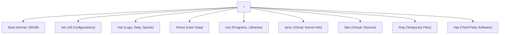
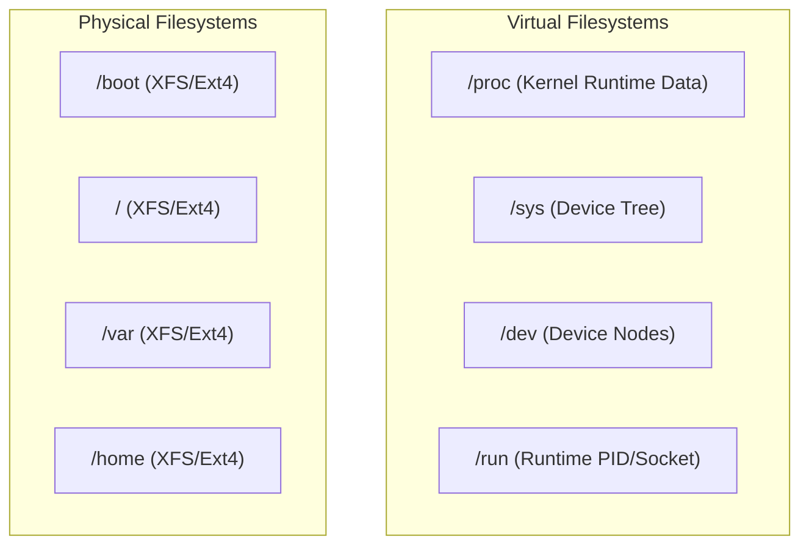
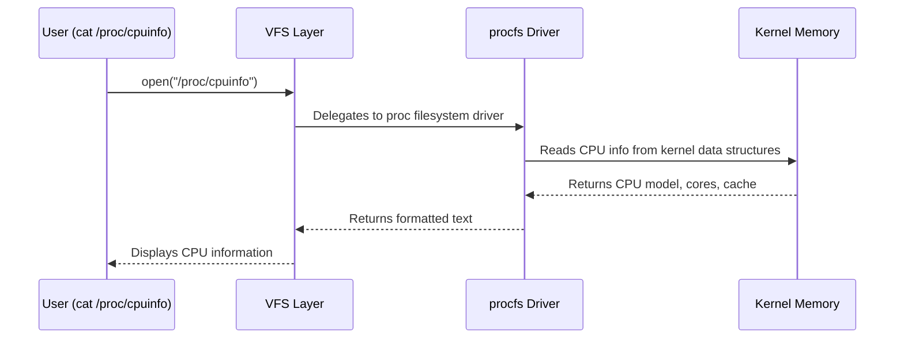

# CHAPTER 05 — FILESYSTEM HIERARCHY STANDARD (FHS)

---

## 1. Introduction

### Why This Topic Exists
Unlike Windows, which organises files across drive letters (`C:\`, `D:\`), Linux uses a single unified tree structure rooted at `/` (forward slash). Every file, directory, device, process, and network socket on a Linux system exists somewhere within this single tree. The layout is standardised by the **Filesystem Hierarchy Standard (FHS)**, maintained by the Linux Foundation, ensuring that administrators can navigate any Linux distribution without relearning directory structures.

### Why Linux Administrators Use It
When a web server returns a 500 error, the engineer knows to check `/var/log/httpd/error_log`. When configuring SSH, the file is at `/etc/ssh/sshd_config`. When investigating disk space, they check `/var` and `/tmp`. This standardised structure enables rapid troubleshooting across any Linux distribution.

### Why Companies Care About It
Compliance audits, security hardening, and infrastructure automation all depend on predictable file locations. Configuration management tools (Ansible, Puppet) assume standard directory paths. Security scanners audit specific directories for vulnerabilities.

---

## 2. Learning Objectives

By the end of this chapter, you will be able to:
- Navigate and explain the purpose of every major directory under `/`.
- Distinguish between static vs dynamic and persistent vs temporary directories.
- Understand virtual filesystems: `/proc`, `/sys`, `/dev`, and `/run`.
- Explain why `/var/log` fills up and how it impacts production servers.
- Locate configuration files, log files, binary executables, and library files.

---

## 3. Beginner-Friendly Explanation

Think of the Linux filesystem as a large corporate office building:

| Directory | Office Room Analogy |
|:---|:---|
| `/` | The building entrance (root lobby) — everything starts here |
| `/home` | Individual employee desks with personal files and drawers |
| `/root` | The CEO's private office (superuser's home directory) |
| `/etc` | The filing cabinet room containing all company policies and configuration documents |
| `/var` | The active records room — constantly changing logs, mail, print queues |
| `/tmp` | The sticky notes board — temporary items anyone can write, cleared regularly |
| `/bin` and `/usr/bin` | The toolbox room — essential tools everyone uses (ls, cp, grep, bash) |
| `/sbin` and `/usr/sbin` | The restricted maintenance toolkit — tools only the building manager uses (fdisk, iptables, systemctl) |
| `/dev` | The hardware connections room — doors to printers, disks, keyboards, mice |
| `/proc` | The live dashboard monitor — real-time stats about every running process, CPU, and memory |
| `/boot` | The electrical panel room — the components needed to power on the building (kernel, GRUB) |

---

## 4. Core Theory

### 4.1 Complete FHS Directory Reference

| Directory | Type | Persistence | Description |
|:---|:---|:---|:---|
| `/` | Physical | Persistent | Root of the entire filesystem tree |
| `/bin` → `/usr/bin` | Physical | Persistent | Essential user command binaries (ls, cp, cat, grep, bash) |
| `/sbin` → `/usr/sbin` | Physical | Persistent | System administration binaries (fdisk, iptables, systemctl) |
| `/boot` | Physical | Persistent | Kernel images (vmlinuz), initramfs, GRUB2 bootloader |
| `/dev` | Virtual | Dynamic | Device files (block devices, character devices, pseudo-terminals) |
| `/etc` | Physical | Persistent | System-wide configuration files (ALL config lives here) |
| `/home` | Physical | Persistent | User home directories (/home/sachin, /home/rahul) |
| `/root` | Physical | Persistent | Root user's home directory (NOT the same as `/`) |
| `/lib` → `/usr/lib` | Physical | Persistent | Shared libraries (.so files) used by binaries |
| `/lib64` → `/usr/lib64` | Physical | Persistent | 64-bit shared libraries |
| `/media` | Physical | Dynamic | Mount point for removable media (USB, CD-ROM) |
| `/mnt` | Physical | Dynamic | Temporary mount point for admin-mounted filesystems |
| `/opt` | Physical | Persistent | Optional third-party software (Oracle, Tomcat, custom apps) |
| `/proc` | Virtual | Dynamic | Kernel and process information pseudo-filesystem |
| `/run` | Virtual (tmpfs) | Dynamic | Runtime variable data (PID files, sockets) — cleared on reboot |
| `/srv` | Physical | Persistent | Data served by the system (web content, FTP files) |
| `/sys` | Virtual | Dynamic | Kernel device and driver information (sysfs) |
| `/tmp` | Physical/tmpfs | Temporary | Temporary files — may be cleared on reboot |
| `/usr` | Physical | Persistent | User programs, libraries, documentation, shared resources |
| `/var` | Physical | Persistent | Variable data — logs, spools, caches, databases |

### 4.2 Critical Production Directories Deep Dive

#### `/etc` — The Configuration Headquarters
Every system-wide configuration file lives under `/etc`:

| Path | Purpose |
|:---|:---|
| `/etc/hostname` | System hostname |
| `/etc/hosts` | Local DNS resolution |
| `/etc/resolv.conf` | DNS nameserver configuration |
| `/etc/fstab` | Filesystem mount table (controls what mounts at boot) |
| `/etc/passwd` | User account database |
| `/etc/shadow` | Encrypted password hashes |
| `/etc/group` | Group membership database |
| `/etc/ssh/sshd_config` | SSH server configuration |
| `/etc/sudoers` | Sudo privilege delegation rules |
| `/etc/yum.repos.d/` | DNF/YUM repository definitions |
| `/etc/systemd/system/` | Custom systemd unit files |
| `/etc/crontab` | System-wide cron job schedule |

#### `/var` — The Most Monitored Directory in Production
`/var` contains data that changes frequently during normal system operation:

| Path | Purpose |
|:---|:---|
| `/var/log/` | System and application logs (messages, secure, audit) |
| `/var/log/messages` | General system log (RHEL) |
| `/var/log/syslog` | General system log (Ubuntu) |
| `/var/log/secure` | Authentication logs (RHEL) |
| `/var/log/auth.log` | Authentication logs (Ubuntu) |
| `/var/log/httpd/` | Apache web server logs |
| `/var/log/nginx/` | Nginx web server logs |
| `/var/spool/` | Print and mail queue data |
| `/var/tmp/` | Temporary files preserved across reboots |
| `/var/lib/mysql/` | MySQL database data files |

#### `/proc` — The Live Kernel Dashboard
`/proc` is a **virtual filesystem** that does not exist on disk. It is generated dynamically by the kernel and provides real-time information:

| Path | Content |
|:---|:---|
| `/proc/cpuinfo` | CPU model, cores, speed, cache |
| `/proc/meminfo` | RAM total, free, available, cached, swap |
| `/proc/version` | Kernel version string |
| `/proc/filesystems` | Supported filesystem types |
| `/proc/mounts` | Currently mounted filesystems |
| `/proc/<PID>/` | Per-process directory (cmdline, status, fd, maps) |
| `/proc/sys/` | Tunable kernel parameters (sysctl) |

#### `/sys` — Hardware and Driver Information
`/sys` (sysfs) exposes kernel objects and their attributes related to devices, drivers, and hardware:

| Path | Content |
|:---|:---|
| `/sys/class/net/` | Network interfaces (eth0, ens33) |
| `/sys/block/` | Block storage devices (sda, nvme0n1) |
| `/sys/devices/` | Complete device tree |

---

## 5. Internal Working

The Linux filesystem is managed through the **Virtual Filesystem Switch (VFS)**, an abstraction layer in the kernel that provides a unified interface to different filesystem types:

```text
Application: cat /etc/hostname
       │
       ▼
   VFS Layer (Kernel) ──► "What filesystem type is /etc on?"
       │
       ├── XFS Driver    → Reads from XFS-formatted partition
       ├── Ext4 Driver   → Reads from Ext4-formatted partition
       ├── proc Driver   → Generates data from kernel memory (/proc)
       ├── sysfs Driver  → Generates data from device tree (/sys)
       └── tmpfs Driver  → Reads from RAM-backed filesystem (/tmp, /run)
```

---

## 6. Production Architecture



---

## 7. Command-by-Command Explanation

### 7.1 `ls /`
- **Purpose:** Lists all top-level directories in the root filesystem.

### 7.2 `du -sh /var/log/*`
- **Purpose:** Shows disk space used by each item in `/var/log`.

### 7.3 `cat /proc/meminfo | head -5`
- **Purpose:** Displays top 5 lines of kernel memory statistics.

### 7.4 `ls /dev/sd*`
- **Purpose:** Lists all SCSI/SATA block device files.

### 7.5 `findmnt`
- **Purpose:** Displays all mounted filesystems in a tree format.

---

## 8–10. Syntax, Parameters, and Output Analysis

```bash
$ findmnt /
TARGET SOURCE    FSTYPE OPTIONS
/      /dev/sda2 xfs    rw,relatime,attr2,inode64,logbufs=8
```

| Field | Meaning |
|:---|:---|
| TARGET | Mount point (`/`) |
| SOURCE | Block device (`/dev/sda2`) |
| FSTYPE | Filesystem type (`xfs`) |
| OPTIONS | Mount options (read-write, relatime) |

---

## 11. Architecture Diagram



---

## 12. Workflow Diagram



---

## 13. Real Production Examples

### Disk Full on /var Causing Service Failures
**Scenario:** A Nagios monitoring alert triggers: `/var partition 100% full`. Apache stops logging, MySQL refuses new connections, and cron jobs fail.

**Investigation:**
```bash
df -h /var
du -sh /var/log/* | sort -hr | head -5
```

**Root Cause:** `/var/log/httpd/access_log` grew to 45GB because `logrotate` was misconfigured.

**Resolution:**
```bash
sudo truncate -s 0 /var/log/httpd/access_log
sudo systemctl restart httpd
sudo vim /etc/logrotate.d/httpd    # Fix rotation config
```

---

## 14. Common Mistakes

1. **Storing application data in `/tmp`** — `/tmp` may be cleared on reboot or by `systemd-tmpfiles-clean`. Use `/var/lib/` or `/opt/` for persistent application data.
2. **Not creating separate partitions for `/var` and `/home`** — If logs fill `/var` on a single-partition system, the entire OS (including `/`) runs out of space.
3. **Confusing `/root` with `/`** — `/root` is the root user's home directory. `/` is the root of the filesystem tree.

---

## 15. Best Practices

- Create separate partitions for `/`, `/boot`, `/home`, `/var`, and `/tmp` in production.
- Monitor `/var/log` disk usage with automated alerts.
- Configure `logrotate` for all application and system logs.
- Never store production data in `/tmp`.

---

## 16. Security Considerations

- Mount `/tmp` with `noexec,nosuid,nodev` options to prevent execution of malicious scripts.
- Set `/home` partition with `nosuid` to prevent SUID exploitation.
- Restrict `/boot` permissions to prevent kernel tampering.

---

## 17. Performance Considerations

- Place `/var/lib/mysql` (database data) on high-IOPS NVMe storage.
- Use `tmpfs` for `/tmp` to serve temporary files from RAM instead of disk.
- Separate `/var/log` onto its own partition/LV to prevent log growth from affecting application performance.

---

## 18. Troubleshooting Guide

| Symptom | Root Cause | Resolution |
|:---|:---|:---|
| "No space left on device" but `df` shows space | Inode exhaustion (`df -i` shows 100%) | Delete millions of tiny files, often in `/var/spool` |
| Application cannot write logs | `/var` partition full | Identify large files with `du -sh /var/log/*`, truncate or rotate |
| System drops to emergency mode on boot | Bad `/etc/fstab` entry | Fix fstab in emergency shell, test with `mount -a` |

---

## 19. Practical Labs

**Lab 5.1:** Explore the root filesystem:
```bash
ls /
ls -la /etc/ | head -20
ls -la /var/log/
cat /proc/meminfo | head -5
ls /dev/sd*
```

**Lab 5.2:** Check disk usage of key directories:
```bash
df -hT
du -sh /var/log/* 2>/dev/null | sort -hr | head -10
```

---

## 20. Mini Project

Create a filesystem audit script `fs_audit.sh` that reports: disk usage of `/`, `/var`, `/home`, `/tmp`, and `/boot`; the 5 largest files in `/var/log`; and inode utilisation of all partitions. Save output to `~/fs_audit_report.txt`.

---

## 21. Assignments

1. List five directories under `/etc` and explain what configuration each one manages.
2. What is the difference between `/proc` and `/sys`? Are they physical filesystems?
3. Why should `/var` and `/home` be on separate partitions from `/` in production?

---

## 22. Interview Questions

### Basic
1. **Q: What is the root directory in Linux?**
   A: `/` (forward slash) — the top-level directory from which the entire filesystem tree branches. Every file and directory on the system exists under `/`.

2. **Q: Where are system log files stored in Linux?**
   A: `/var/log/` — for example, `/var/log/messages` (RHEL) or `/var/log/syslog` (Ubuntu).

### Intermediate
3. **Q: What is `/proc` and does it exist on disk?**
   A: `/proc` is a virtual pseudo-filesystem generated dynamically by the kernel. It does not exist on disk and consumes no disk space. It provides real-time information about running processes (`/proc/<PID>/`), CPU (`/proc/cpuinfo`), memory (`/proc/meminfo`), and tunable kernel parameters (`/proc/sys/`).

### Advanced
4. **Q: Explain the difference between `/bin`, `/sbin`, `/usr/bin`, and `/usr/sbin` in modern RHEL 9.**
   A: In RHEL 7 and earlier, `/bin` contained essential user commands and `/sbin` contained system administration commands. `/usr/bin` and `/usr/sbin` held non-essential commands. In RHEL 8+ and modern distributions, `/bin` is a symlink to `/usr/bin` and `/sbin` is a symlink to `/usr/sbin` — they have been merged into a unified `/usr` directory structure (UsrMerge).

### Scenario-Based
5. **Q: A server reports "No space left on device" when writing to `/var/log`, but `df -h` shows 20GB free on the partition. What could be wrong?**
   A: The filesystem has likely exhausted its available inodes (`df -i` will show 100% inode usage). This happens when millions of very small files consume all inode entries while leaving physical disk blocks free. Common cause: a mail queue creating millions of 0-byte files in `/var/spool/`. Resolution: delete the excessive small files, then verify with `df -i`.

---

## 23. Chapter Summary and Quick Revision Notes

- Linux uses a single tree rooted at `/` — no drive letters.
- `/etc` = all configuration. `/var/log` = all logs. `/home` = user data.
- `/proc` and `/sys` are virtual — generated by the kernel, not stored on disk.
- `/tmp` is temporary and may be cleared. Never store important data there.
- In modern distributions, `/bin` → `/usr/bin` and `/sbin` → `/usr/sbin` (merged).
- Always separate `/var`, `/home`, and `/tmp` onto their own partitions in production.

---

## 24. Cheat Sheet

| Directory | Purpose |
|:---|:---|
| `/etc` | All system configuration files |
| `/var/log` | System and application logs |
| `/home` | User home directories |
| `/root` | Root user's home directory |
| `/boot` | Kernel, initramfs, GRUB2 |
| `/proc` | Virtual: kernel & process info |
| `/sys` | Virtual: device & driver info |
| `/dev` | Virtual: device files |
| `/tmp` | Temporary files (may be cleared) |
| `/opt` | Third-party/optional software |
