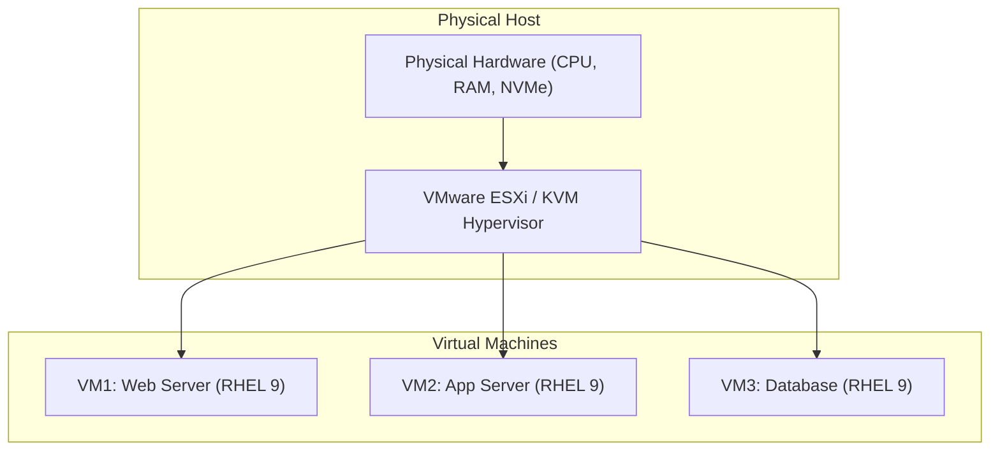
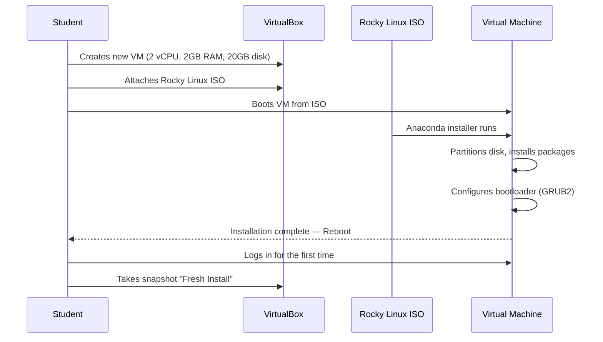

# CHAPTER 06 — INSTALLING LINUX ON VMWARE AND VIRTUALBOX

---

## 1. Introduction

### Why This Topic Exists
Before you can learn Linux, you need a Linux system to practise on. Virtualisation software allows you to install Linux inside your existing Windows or macOS computer without replacing your primary operating system. This is how 95% of learners and professionals first interact with Linux — through a virtual machine (VM) that runs alongside their desktop OS.

### Why Linux Administrators Use It
Production engineers use virtualisation platforms (VMware ESXi, KVM, Hyper-V) to run hundreds of Linux virtual machines on a single physical server. Understanding VM fundamentals — virtual CPUs, virtual RAM, virtual disks, virtual networks, and snapshots — prepares you for enterprise infrastructure and cloud computing (AWS EC2, Azure VMs, GCP Compute Engine are all virtual machines).

### Why Companies Care About It
Enterprise IT infrastructure has shifted from physical servers to virtualised fleets. Over 80% of enterprise workloads run on virtual machines or containers. Engineers must understand how to provision, snapshot, clone, and manage VMs.

---

## 2. Learning Objectives

By the end of this chapter, you will be able to:
- Install VMware Workstation Player or Oracle VirtualBox on Windows/macOS.
- Download RHEL 9 (Developer Subscription) or Rocky Linux 9 ISO images.
- Create a virtual machine with recommended specifications.
- Install Linux inside the VM with standard partitioning.
- Configure VM networking (NAT, Bridged, Host-Only).
- Take VM snapshots for safe experimentation.

---

## 3. Beginner-Friendly Explanation

Think of virtualisation like a simulator game:
- **Your Physical Computer (The Real Building):** Your actual Windows or Mac laptop with its real CPU, RAM, and hard drive.
- **Virtualisation Software (The Simulation Engine):** VMware or VirtualBox creates a "pretend computer" inside your real computer.
- **Virtual Machine (The Simulated Room):** A fully functional fake computer running inside a window on your desktop. It has its own CPU, RAM, disk, and network — but they are all virtual (borrowed from your real hardware).
- **ISO Image (The Installation DVD):** The Linux installer disc image that you "insert" into your virtual DVD drive.
- **Snapshot (Save Game):** A save point you can return to if something goes wrong during experimentation.

---

## 4. Core Theory

### 4.1 Virtualisation Software Options

| Software | Type | Cost | Platform | Best For |
|:---|:---|:---|:---|:---|
| **VMware Workstation Player** | Type 2 Hypervisor | Free (personal) | Windows, Linux | Students and personal learning |
| **VMware Workstation Pro** | Type 2 Hypervisor | Free (personal since 2024) | Windows, Linux | Power users needing snapshots, cloning |
| **Oracle VirtualBox** | Type 2 Hypervisor | Free (GPL) | Windows, macOS, Linux | Cross-platform learning |
| **VMware ESXi** | Type 1 Hypervisor | Enterprise License | Bare Metal | Production enterprise virtualisation |
| **KVM/QEMU** | Type 1 Hypervisor | Free (built into Linux kernel) | Linux only | Production Linux virtualisation |

### 4.2 Recommended VM Specifications for Learning

| Resource | Minimum | Recommended |
|:---|:---|:---|
| **Virtual CPUs** | 1 vCPU | 2 vCPUs |
| **RAM** | 1 GB | 2–4 GB |
| **Disk** | 10 GB | 20–40 GB (Thin Provisioned) |
| **Network** | NAT | NAT (default) or Bridged |
| **ISO Image** | Any Linux distribution ISO | Rocky Linux 9 Minimal or RHEL 9 |

### 4.3 VM Network Modes

| Mode | Description | Internet Access | Host-to-VM | VM-to-VM |
|:---|:---|:---|:---|:---|
| **NAT** | VM shares host's IP via translation | Yes | No (without port forward) | No |
| **Bridged** | VM gets its own IP on your physical network | Yes | Yes | Yes |
| **Host-Only** | Private network between host and VMs only | No | Yes | Yes |
| **Internal** | VMs only talk to each other | No | No | Yes |

### 4.4 Linux Installation Partitioning Schemes

**Standard Partitioning (Recommended for Learning):**

| Partition | Mount Point | Size | Filesystem |
|:---|:---|:---|:---|
| `/boot` | `/boot` | 1 GB | XFS or Ext4 |
| `swap` | — | 2 GB (or equal to RAM) | swap |
| `/` | `/` | Remaining space | XFS |

**Enterprise Production Partitioning (LVM):**

| Logical Volume | Mount Point | Size | Rationale |
|:---|:---|:---|:---|
| `/boot` | `/boot` | 1 GB | Outside LVM (GRUB2 requirement) |
| `swap` | — | Equal to RAM (up to 16 GB) | Swap space |
| `lv_root` | `/` | 20 GB | Root filesystem |
| `lv_var` | `/var` | 30 GB | Logs and variable data |
| `lv_home` | `/home` | 20 GB | User data |
| `lv_tmp` | `/tmp` | 5 GB | Temporary files (mounted noexec) |

---

## 5. Internal Working

When you create a virtual machine, the hypervisor:
1. Allocates a portion of the host's physical CPU time to the VM via hardware-assisted virtualisation (Intel VT-x / AMD-V).
2. Assigns a region of host RAM as the VM's physical memory.
3. Creates a virtual disk file (`.vmdk` for VMware, `.vdi` for VirtualBox) that acts as the VM's hard drive.
4. Emulates network interface cards, USB controllers, and display adapters.
5. The guest OS (Linux) boots inside this virtual hardware environment, unaware that it is running inside a VM.

---

## 6. Production Architecture



---

## 7. Step-by-Step Installation Guide

### Step 1: Download Software
- **VirtualBox:** Download from `https://www.virtualbox.org/`
- **Rocky Linux 9 ISO:** Download "Minimal" ISO from `https://rockylinux.org/download`

### Step 2: Create Virtual Machine
1. Open VirtualBox → Click "New".
2. Name: `rocky9-lab` | Type: Linux | Version: Red Hat (64-bit).
3. Memory: 2048 MB (2 GB).
4. Create virtual hard disk: 20 GB, VDI format, dynamically allocated.

### Step 3: Attach ISO and Boot
1. Settings → Storage → Empty CD → Choose disk file → Select Rocky Linux 9 ISO.
2. Settings → Network → Adapter 1 → NAT (default).
3. Start the VM.

### Step 4: Install Rocky Linux
1. Select "Install Rocky Linux 9".
2. Language: English → Continue.
3. Installation Destination: Select the 20 GB virtual disk → Automatic partitioning.
4. Network & Hostname: Toggle ethernet ON. Set hostname: `linux-lab`.
5. Root Password: Set a strong password.
6. Create User: Create a regular user with admin privileges.
7. Begin Installation → Wait for completion → Reboot.

### Step 5: First Login
After reboot, log in at the console with your username and password.

### Step 6: Take a Snapshot
In VirtualBox: Machine → Take Snapshot → Name: "Fresh Install". This creates a restore point.

---

## 8–10. (Syntax, Parameters, Output)

```bash
# After installation, verify your system:
$ uname -r
5.14.0-362.el9.x86_64

$ cat /etc/os-release | head -3
NAME="Rocky Linux"
VERSION="9.3 (Blue Onyx)"
ID="rocky"

$ ip a | grep "inet "
    inet 127.0.0.1/8 scope host lo
    inet 10.0.2.15/24 brd 10.0.2.255 scope global dynamic noprefixroute enp0s3
```

---

## 11. Architecture Diagram

```mermaid
graph TD
    subgraph Host OS (Windows/macOS)
        VBox["VirtualBox / VMware"]
    end

    subgraph Virtual Machine
        BIOS_VM["Virtual BIOS/UEFI"]
        Kernel["Linux Kernel (vmlinuz)"]
        Systemd["systemd (PID 1)"]
        Login["Login Shell (bash)"]
    end

    VBox --> BIOS_VM --> Kernel --> Systemd --> Login
```

---

## 12. Workflow Diagram



---

## 13. Real Production Examples

### Enterprise VM Provisioning
At Infosys, Wipro, or TCS, when a new project starts, infrastructure teams use VMware vSphere to provision 50+ Linux VMs in minutes using templates. A golden image VM template with RHEL 9 (pre-hardened, pre-configured with company standards) is cloned for each new server, dramatically reducing provisioning time from days to minutes.

---

## 14. Common Mistakes

1. **Downloading the wrong ISO** — Always download the "Minimal" or "DVD" ISO, not the "Boot" ISO (which requires internet to install packages).
2. **Allocating too little RAM** — 512 MB causes installation failures. Minimum 1 GB, recommended 2 GB.
3. **Forgetting to take a snapshot after installation** — Without a snapshot, you cannot easily undo mistakes during learning.
4. **Leaving network disconnected** — Toggle the network ON during installation to get automatic IP addressing.

---

## 15. Best Practices

- Always take a snapshot before making major changes (kernel updates, configuration changes).
- Use NAT networking for internet access during learning; switch to Bridged for multi-VM labs.
- Use "Minimal" installation for server labs — no GUI means lower resource usage and closer to production reality.
- Name your VMs descriptively: `rocky9-web`, `rocky9-db`, `ubuntu2204-dev`.

---

## 16. Security Considerations

- Set a strong root password during installation.
- Create a regular user with sudo privileges — avoid logging in as root.
- Enable the firewall during installation (default on RHEL/Rocky 9).

---

## 17. Performance Considerations

- Enable hardware virtualisation (VT-x/AMD-V) in your laptop's BIOS settings for significantly better VM performance.
- Use dynamically allocated disks to avoid consuming host disk space for unused VM capacity.
- Allocate at least 2 vCPUs for smoother operation during package installation and compilation.

---

## 18. Troubleshooting Guide

| Symptom | Root Cause | Resolution |
|:---|:---|:---|
| VM fails to boot, shows "VT-x is not available" | Hardware virtualisation disabled in BIOS | Enable VT-x (Intel) or SVM (AMD) in BIOS/UEFI settings |
| Installer shows blank screen | Incorrect VM version selected (32-bit vs 64-bit) | Recreate VM with correct OS type: Red Hat (64-bit) |
| No network connectivity after install | Network adapter not enabled during installation | Run `sudo nmcli con up enp0s3` |
| Cannot SSH from host to VM | NAT mode blocks inbound connections | Switch to Bridged networking or set up port forwarding |

---

## 19. Practical Labs

**Lab 6.1:** Install VirtualBox and create a VM with the specifications from Section 4.2.
**Lab 6.2:** Download Rocky Linux 9 Minimal ISO and install it in the VM.
**Lab 6.3:** After installation, verify: `uname -r`, `cat /etc/os-release`, `ip a`, `free -h`.
**Lab 6.4:** Take a VirtualBox snapshot named "Chapter 06 Complete".

---

## 20. Mini Project

Install TWO Linux VMs: one Rocky Linux 9 and one Ubuntu 22.04 Server. Configure both with Bridged networking. Verify they can ping each other. Document the IP addresses and OS versions of both.

---

## 21. Assignments

1. Explain the difference between Type 1 and Type 2 hypervisors with examples.
2. What are the advantages of using NAT vs Bridged networking for VMs?
3. Why is the "Minimal" installation preferred for server labs?

---

## 22. Interview Questions

### Basic
1. **Q: What virtualisation software have you used?**
   A: I have used VMware Workstation and VirtualBox for local development and testing environments, and VMware ESXi and KVM for production virtualisation. In cloud environments, I work with AWS EC2 instances, which are KVM-based virtual machines.

### Intermediate
2. **Q: What is the difference between a Type 1 and Type 2 hypervisor?**
   A: A Type 1 (bare-metal) hypervisor runs directly on physical hardware without a host OS (e.g., VMware ESXi, KVM, Microsoft Hyper-V). A Type 2 (hosted) hypervisor runs on top of a host OS as an application (e.g., VirtualBox, VMware Workstation). Type 1 offers better performance and is used in production.

### Scenario-Based
3. **Q: You need to set up a lab with 3 Linux VMs that can communicate with each other but should not be accessible from the corporate network. Which network mode do you use?**
   A: Host-Only or Internal networking. Host-Only creates a private network between the host and VMs. Internal creates a network only between VMs. Both isolate the VMs from the corporate network.

---

## 23. Chapter Summary and Quick Revision Notes

- Use VirtualBox (free) or VMware Workstation to run Linux on your desktop.
- Download a Minimal ISO (Rocky Linux 9 or RHEL 9 Developer).
- Recommended VM specs: 2 vCPU, 2 GB RAM, 20 GB disk.
- NAT for internet access, Bridged for network labs.
- Always take snapshots before experimenting.

---

## 24. Cheat Sheet

| Action | Method |
|:---|:---|
| Enable virtualisation | BIOS → VT-x (Intel) or SVM (AMD) |
| Create VM | VirtualBox → New → Name, Type, RAM, Disk |
| Attach ISO | Settings → Storage → CD → Choose ISO |
| Take snapshot | Machine → Take Snapshot |
| Restore snapshot | Machine → Snapshots → Restore |
| Check IP after install | `ip a` or `nmcli device show` |
