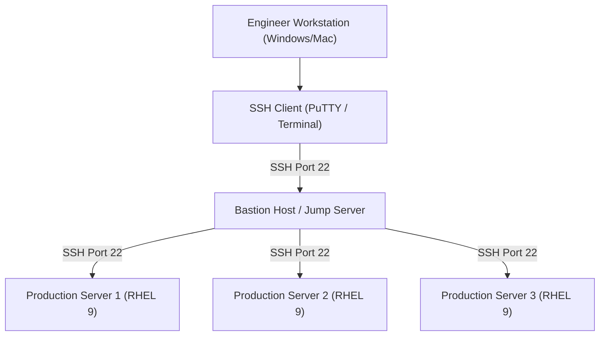
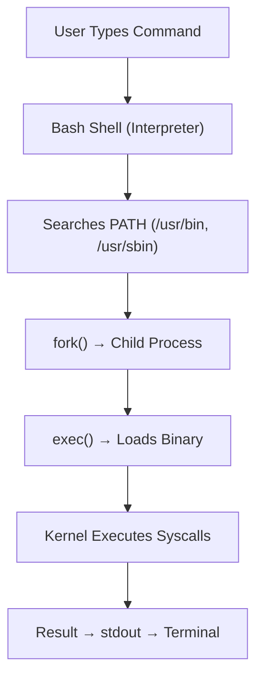
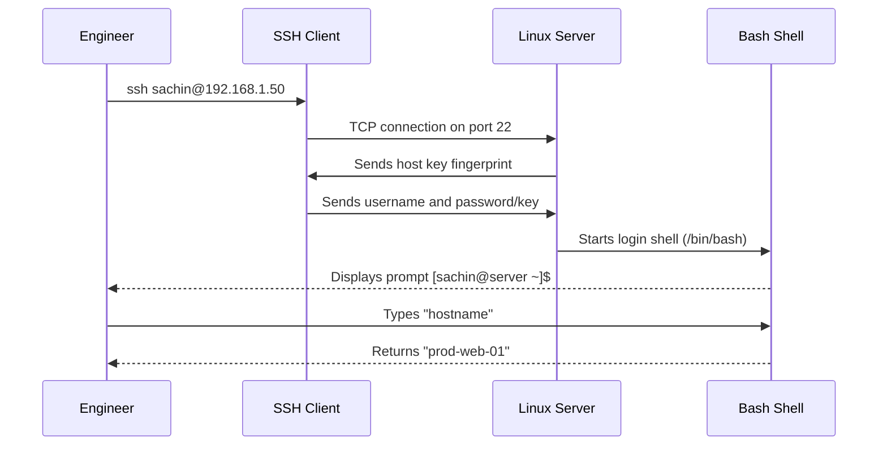

# CHAPTER 07 — FIRST LOGIN, DESKTOP VS SERVER, AND TERMINAL BASICS

---

## 1. Introduction

### Why This Topic Exists
Your first interaction with Linux will be through a terminal — a text-based interface where you type commands and the system responds with text output. Unlike Windows, where most administration is done through graphical interfaces, Linux servers in production run entirely without a GUI. The terminal is your primary tool as a Linux engineer.

### Why Linux Administrators Use It
Every production Linux server runs in headless mode (no monitor, no keyboard, no GUI). Engineers connect remotely via SSH (Secure Shell) from their workstations to manage servers. The terminal allows full system administration: installing software, managing users, configuring services, reading logs, and troubleshooting issues — all through typed commands.

### Why Companies Care About It
GUI-based administration does not scale. When you manage 500 servers, you cannot click through 500 graphical interfaces. The command line enables automation through scripts, configuration management tools (Ansible, Puppet), and infrastructure-as-code pipelines — all of which require terminal fluency.

---

## 2. Learning Objectives

By the end of this chapter, you will be able to:
- Understand the difference between Linux Desktop and Linux Server installations.
- Log in to a Linux system via local console and remote SSH.
- Navigate the terminal environment: understand the shell prompt, command structure, and keyboard shortcuts.
- Use essential first commands: `whoami`, `hostname`, `date`, `uptime`, `clear`, `exit`.
- Understand shells (bash, zsh, sh) and how commands are processed.
- Configure basic SSH client connection from Windows (PuTTY, Windows Terminal).

---

## 3. Beginner-Friendly Explanation

Think of the Linux terminal like a conversation with a very smart assistant:
- **You (the user)** type a question or instruction in plain text.
- **The shell (bash)** reads your instruction, understands it, and passes it to the operating system.
- **The operating system** performs the action and returns the result as text.
- **The terminal** displays the result on your screen.

Example conversation:
```
You:     "What is today's date?"
You type: date
Linux:    Sun Jul 26 13:30:00 UTC 2026
```

---

## 4. Core Theory

### 4.1 Linux Desktop vs Linux Server

| Aspect | Linux Desktop | Linux Server |
|:---|:---|:---|
| **GUI** | Yes (GNOME, KDE, XFCE) | No — headless CLI only |
| **Access Method** | Monitor + Keyboard | SSH (remote terminal) |
| **Installation Type** | "Server with GUI" or "Workstation" | "Minimal Install" |
| **Primary Users** | Developers, desktop users | System administrators, DevOps |
| **Resource Usage** | Higher (GUI consumes RAM and CPU) | Lower (all resources for services) |
| **Production Use** | Rare | Standard — 99% of production servers |

> **Production Standard:** Enterprise servers use Minimal Install (no GUI). All administration is performed via SSH terminal.

### 4.2 The Shell Prompt Anatomy

```text
[sachin@prod-web-01 ~]$
  │         │         │ │
  │         │         │ └── $ = Normal user (# = root user)
  │         │         └──── ~ = Current directory (home directory)
  │         └────────────── prod-web-01 = Hostname
  └──────────────────────── sachin = Username
```

### 4.3 Command Structure

```text
command  [options]  [arguments]
  │         │          │
  │         │          └── The target (file, directory, user)
  │         └──────────── Modifiers that change behaviour (-l, -a, --help)
  └────────────────────── The programme to execute (ls, cat, grep)
```

**Examples:**
- `ls` — Command only (list current directory).
- `ls -la` — Command + options (list all files in long format).
- `ls -la /etc` — Command + options + argument (list /etc in long format).

### 4.4 Linux Shells

| Shell | Path | Description |
|:---|:---|:---|
| **bash** | `/bin/bash` | Bourne Again Shell — default on RHEL, Ubuntu, Rocky. Most widely used. |
| **sh** | `/bin/sh` | Original Bourne Shell — minimal, POSIX-compliant. Symlink to bash or dash. |
| **zsh** | `/bin/zsh` | Z Shell — enhanced features, default on macOS. |
| **dash** | `/bin/dash` | Debian Almquist Shell — lightweight, used for system scripts on Debian/Ubuntu. |
| **fish** | `/usr/bin/fish` | Friendly Interactive Shell — user-friendly, auto-suggestions. |

Check your current shell: `echo $SHELL`

### 4.5 Essential Keyboard Shortcuts

| Shortcut | Action |
|:---|:---|
| `Ctrl + C` | Cancel/kill the currently running command |
| `Ctrl + D` | Logout from the current shell (same as `exit`) |
| `Ctrl + L` | Clear the terminal screen (same as `clear`) |
| `Ctrl + A` | Move cursor to beginning of the line |
| `Ctrl + E` | Move cursor to end of the line |
| `Ctrl + R` | Reverse search through command history |
| `Ctrl + W` | Delete the word before the cursor |
| `Ctrl + U` | Delete from cursor to beginning of line |
| `Tab` | Auto-complete commands, filenames, and paths |
| `Tab Tab` | Show all possible completions |
| `↑ / ↓` | Navigate through command history |

---

## 5. Internal Working

When you type a command like `ls -la /etc` and press Enter:

1. **Bash reads the input** from stdin (standard input).
2. **Bash tokenises** the input into: command=`ls`, options=`-la`, argument=`/etc`.
3. **Bash searches for the command** in the PATH directories (`/usr/bin/ls`).
4. **Bash calls `fork()`** to create a child process.
5. **The child process calls `exec()`** to replace itself with the `ls` binary.
6. **`ls` makes system calls** (`open()`, `read()`, `getdents()`) to the kernel to read directory contents.
7. **The kernel reads** the filesystem and returns directory entries.
8. **`ls` formats the output** and writes it to stdout (file descriptor 1 = terminal).
9. **The child process exits** and bash displays the prompt again.

---

## 6. Production Architecture



---

## 7. Command-by-Command Explanation

### 7.1 `whoami`
- **Purpose:** Displays the username of the currently logged-in user.
- **Output:** `sachin`

### 7.2 `hostname`
- **Purpose:** Displays the system hostname.
- **Output:** `prod-web-01`

### 7.3 `date`
- **Purpose:** Displays the current system date and time.
- **Output:** `Sun Jul 26 13:30:00 UTC 2026`

### 7.4 `uptime`
- **Purpose:** Shows how long the server has been running, number of logged-in users, and load average.
- **Output:** `13:30:00 up 45 days, 3:22, 2 users, load average: 0.15, 0.20, 0.18`

### 7.5 `clear`
- **Purpose:** Clears the terminal screen. Keyboard shortcut: `Ctrl + L`.

### 7.6 `exit`
- **Purpose:** Logs out of the current shell session. Keyboard shortcut: `Ctrl + D`.

### 7.7 `history`
- **Purpose:** Displays the list of previously executed commands.
- **`history | tail -10`:** Shows the last 10 commands.
- **`!50`:** Re-executes command number 50 from history.
- **`!!`:** Re-executes the last command.

### 7.8 `ssh user@hostname`
- **Purpose:** Connects to a remote Linux server via encrypted SSH protocol.
- **Example:** `ssh sachin@192.168.1.50`

---

## 8–10. Syntax, Parameters, Output Analysis

```bash
$ uptime
 13:30:00 up 45 days,  3:22,  2 users,  load average: 0.15, 0.20, 0.18
```

| Segment | Meaning |
|:---|:---|
| `13:30:00` | Current time |
| `up 45 days, 3:22` | Server has been running for 45 days and 3 hours |
| `2 users` | 2 users currently logged in |
| `load average: 0.15, 0.20, 0.18` | CPU load over 1, 5, and 15 minutes |

---

## 11. Architecture Diagram



---

## 12. Workflow Diagram



---

## 13. Real Production Examples

### Connecting to Production Servers via Bastion Host
In companies like TCS, Infosys, Capgemini, engineers connect to production servers through a **bastion host** (jump server):
```bash
# Direct SSH via bastion (ProxyJump)
ssh -J sachin@bastion.company.com sachin@prod-db-01.internal
```

### Verifying Server Identity After Login
After SSH login to any server, experienced engineers immediately verify they are on the correct server:
```bash
whoami          # Confirm user identity
hostname        # Confirm server name
cat /etc/os-release | head -2   # Confirm OS version
uptime          # Confirm server health
```

---

## 14. Common Mistakes

1. **Running commands as root when not necessary** — Always use a regular user account and elevate with `sudo` only when required.
2. **Ignoring Tab completion** — New users type full paths manually. Tab auto-completes and prevents typos.
3. **Not checking hostname before running destructive commands** — Always verify `hostname` before executing `rm -rf`, `shutdown`, or service restarts to avoid running commands on the wrong server.
4. **Pressing Ctrl+S accidentally** — This freezes the terminal output (XOFF flow control). Press `Ctrl+Q` to unfreeze.

---

## 15. Best Practices

- Always verify `whoami` and `hostname` after connecting to a server.
- Use `Ctrl+R` for reverse history search instead of retyping long commands.
- Configure SSH key-based authentication instead of password authentication.
- Set a meaningful PS1 prompt that includes username, hostname, and working directory.

---

## 16. Security Considerations

- Never share your SSH private key.
- Use SSH key-based authentication and disable password login in production.
- Configure `TMOUT` environment variable to auto-logout idle sessions.
- Use a bastion host for accessing production servers — never expose SSH directly to the internet.

---

## 17. Performance Considerations

- Minimal installation (no GUI) saves 500MB–1GB RAM on every server.
- SSH multiplexing reduces connection overhead when making multiple SSH connections to the same server.

---

## 18. Troubleshooting Guide

| Symptom | Root Cause | Resolution |
|:---|:---|:---|
| Terminal appears frozen | Accidentally pressed `Ctrl+S` | Press `Ctrl+Q` to unfreeze |
| `ssh: Connection refused` | SSH service not running or firewall blocking port 22 | Check `systemctl status sshd` and `firewall-cmd --list-all` |
| `Permission denied (publickey)` | Password auth disabled, key not configured | Add public key to `~/.ssh/authorized_keys` |
| Command returns `command not found` | Command not in PATH or not installed | Check `which <command>` or install with `dnf install` |

---

## 19. Practical Labs

**Lab 7.1:** Log in to your Linux VM and run these first commands:
```bash
whoami
hostname
date
uptime
echo $SHELL
history | tail -5
```

**Lab 7.2:** Practise keyboard shortcuts:
- Use `Ctrl+R` to search history for a previous command.
- Use `Tab` to auto-complete a file path.
- Use `Ctrl+L` to clear the screen.

---

## 20. Mini Project

Create a login verification script `~/login_check.sh`:
```bash
#!/bin/bash
echo "=== Server Login Verification ==="
echo "User:     $(whoami)"
echo "Hostname: $(hostname)"
echo "OS:       $(cat /etc/os-release | grep PRETTY_NAME | cut -d= -f2)"
echo "Kernel:   $(uname -r)"
echo "Uptime:   $(uptime -p)"
echo "IP:       $(hostname -I)"
echo "================================="
```

---

## 21. Assignments

1. What is the difference between `$` and `#` in the shell prompt?
2. List five keyboard shortcuts and explain what each one does.
3. Explain why production Linux servers do not have a GUI installed.

---

## 22. Interview Questions

### Basic
1. **Q: What is the default shell in RHEL and Ubuntu?**
   A: `bash` (Bourne Again Shell), located at `/bin/bash`.

2. **Q: How do you connect to a remote Linux server?**
   A: Using SSH (Secure Shell): `ssh username@server_ip_or_hostname`. SSH uses TCP port 22 with encrypted communication.

### Intermediate
3. **Q: What is a bastion host and why is it used?**
   A: A bastion host (jump server) is a hardened server that acts as the single entry point for SSH access to internal production servers. All SSH traffic passes through the bastion, which provides centralised logging, access control, and reduces the attack surface by not exposing production servers directly to the internet.

### Scenario-Based
4. **Q: You SSH into a server and your terminal freezes — no output, no response. What do you do?**
   A: First try `Ctrl+Q` (the terminal may have been frozen by accidental `Ctrl+S`). If that doesn't work, press `Enter` then `~.` (tilde-dot) to force-close the SSH connection. Then reconnect and check if the server is responsive.

---

## 23. Chapter Summary and Quick Revision Notes

- Production Linux servers run without a GUI — all admin is via SSH terminal.
- The shell prompt shows: `[user@hostname directory]$` (`#` for root).
- Command structure: `command [options] [arguments]`.
- Essential shortcuts: `Tab` (autocomplete), `Ctrl+C` (cancel), `Ctrl+R` (history search), `Ctrl+L` (clear).
- Always verify `whoami` and `hostname` before running commands.
- Use SSH keys, not passwords, for production server access.

---

## 24. Cheat Sheet

| Command | Purpose |
|:---|:---|
| `whoami` | Display current username |
| `hostname` | Display system hostname |
| `date` | Display current date and time |
| `uptime` | Display system uptime and load |
| `echo $SHELL` | Display current shell |
| `history` | Show command history |
| `clear` / `Ctrl+L` | Clear terminal screen |
| `exit` / `Ctrl+D` | Logout from current session |
| `ssh user@host` | Connect to remote server via SSH |
