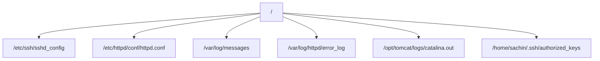
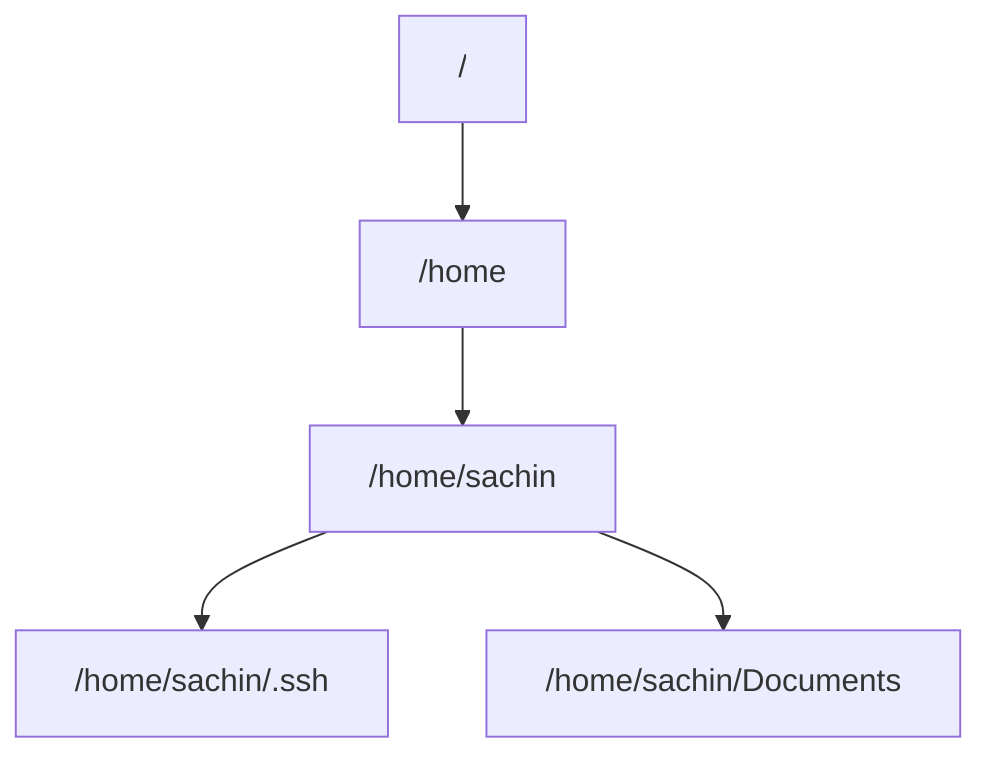
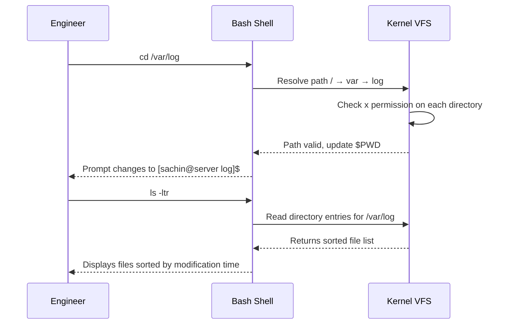

# CHAPTER 08 — NAVIGATING THE LINUX FILESYSTEM

---

## 1. Introduction

### Why This Topic Exists
Navigation is the most fundamental skill in Linux. Before you can read files, edit configurations, install software, or troubleshoot problems, you must know how to move through the directory tree. Every command you run operates relative to your current position in the filesystem, making navigation the first skill every Linux user must master.

### Why Linux Administrators Use It
Production engineers navigate between configuration directories (`/etc`), log directories (`/var/log`), application directories (`/opt`), and home directories (`/home`) hundreds of times per day. Fast, precise navigation using absolute and relative paths directly impacts troubleshooting speed during critical incidents.

### Why Companies Care About It
During a P1 production outage, every second matters. An engineer who navigates instinctively — jumping directly to `/var/log/httpd/error_log` or `/etc/ssh/sshd_config` — resolves incidents faster than one who fumbles through the directory tree.

---

## 2. Learning Objectives

By the end of this chapter, you will be able to:
- Understand and use absolute paths vs relative paths.
- Navigate using `cd`, `pwd`, `ls`, and `tree`.
- Use path shortcuts: `.` (current), `..` (parent), `~` (home), `-` (previous).
- List directory contents with detailed options (`ls -la`, `ls -ltr`, `ls -lhS`).
- Understand hidden files and dot-files (`.bashrc`, `.ssh`).

---

## 3. Beginner-Friendly Explanation

Think of the Linux filesystem as a large building with many floors and rooms:
- **`pwd` (Where am I?):** You look at the sign on the wall — "You are in Room 301, Floor 3" (`/home/sachin`).
- **`cd` (Walk to another room):** You walk down the hallway to a different room.
  - `cd /etc` — Walk directly to the Configuration Room on Floor 1 (absolute path).
  - `cd ..` — Walk one floor up to the parent directory.
  - `cd ~` — Take the express elevator directly home.
  - `cd -` — Go back to the last room you were in.
- **`ls` (Look around the room):** You look at the contents of the room you are in — files, folders, and their details.

---

## 4. Core Theory

### 4.1 Absolute Path vs Relative Path

| Concept | Absolute Path | Relative Path |
|:---|:---|:---|
| **Starts from** | Root `/` (always) | Current working directory |
| **Begins with** | `/` | No leading `/` |
| **Example** | `/var/log/messages` | `../log/messages` (from `/var/tmp`) |
| **When to use** | Scripts, crontabs, configs | Interactive navigation |
| **Reliability** | Always works regardless of CWD | Depends on current location |

> **Production Rule:** Always use **absolute paths** in scripts, crontabs, and configuration files. Relative paths may break if the working directory changes.

### 4.2 Path Shortcuts

| Shortcut | Meaning | Example |
|:---|:---|:---|
| `.` | Current directory | `cp file.txt ./backup/` |
| `..` | Parent directory (one level up) | `cd ..` |
| `~` | Home directory of current user | `cd ~` = `cd /home/sachin` |
| `~root` | Home directory of root user | `cd ~root` = `cd /root` |
| `-` | Previous working directory | `cd -` (toggle between two dirs) |
| `/` | Root of the filesystem | `cd /` |

### 4.3 Hidden Files (Dot Files)
Files and directories beginning with `.` (dot) are hidden by default. They are only visible with `ls -a`:

| Hidden File | Purpose |
|:---|:---|
| `~/.bashrc` | User-specific bash shell configuration |
| `~/.bash_profile` | Login shell configuration |
| `~/.bash_history` | Command history log |
| `~/.ssh/` | SSH keys and known hosts |
| `~/.vimrc` | Vim editor configuration |

---

## 5. Internal Working

When you run `cd /var/log`:
1. Bash resolves the path by walking the directory tree from `/` → `var` → `log`.
2. Each directory is an inode containing a table of filenames mapped to child inode numbers.
3. The kernel performs permission checks at each level (does the user have execute `x` permission on each directory?).
4. If all checks pass, bash updates its internal `$PWD` variable to `/var/log`.
5. If any directory lacks `x` permission, the kernel returns `Permission denied`.

---

## 6. Production Architecture

In production, engineers navigate a standard set of critical directories:



---

## 7. Command-by-Command Explanation

### 7.1 `pwd` — Print Working Directory
- **Purpose:** Displays the absolute path of your current location.
- **Example:**
  ```bash
  $ pwd
  /home/sachin
  ```

### 7.2 `cd` — Change Directory
- **Syntax:** `cd [path]`
- **Examples:**
  ```bash
  cd /var/log        # Absolute path
  cd ..              # Go up one level
  cd ~               # Go to home directory
  cd -               # Go to previous directory
  cd                 # Same as cd ~ (go home)
  ```

### 7.3 `ls` — List Directory Contents
- **Syntax:** `ls [options] [path]`
- **Key Options:**

  | Option | Purpose |
  |:---|:---|
  | `-l` | Long format (permissions, owner, size, date) |
  | `-a` | Show all files including hidden (dot files) |
  | `-h` | Human-readable file sizes (KB, MB, GB) |
  | `-t` | Sort by modification time (newest first) |
  | `-r` | Reverse sort order |
  | `-S` | Sort by file size (largest first) |
  | `-R` | Recursive listing (include subdirectories) |
  | `-d` | Show directory itself, not its contents |
  | `-i` | Show inode numbers |

- **Production Combinations:**
  ```bash
  ls -la           # All files, long format (most common)
  ls -ltr          # Long format, sorted by time, oldest first (log analysis)
  ls -lhS          # Long format, human-readable sizes, sorted by size
  ls -ld /etc      # Show directory properties (not contents)
  ```

### 7.4 `tree` — Display Directory Tree
- **Purpose:** Displays directory structure as a visual tree.
- **Installation:** `sudo dnf install -y tree`
- **Example:**
  ```bash
  $ tree /etc/ssh
  /etc/ssh
  ├── moduli
  ├── ssh_config
  ├── ssh_config.d
  ├── sshd_config
  └── sshd_config.d
      └── 50-redhat.conf
  ```

---

## 8. Syntax Breakdown

```bash
ls -ltr /var/log/
│   │││  └──────── Argument: directory to list
│   │││
│   ││└── r: reverse order
│   │└─── t: sort by modification time
│   └──── l: long format
└──────── Command: list directory contents
```

---

## 9. Parameter Explanation

| Parameter | Type | Description |
|:---|:---|:---|
| `-l` | Display modifier | Enables long listing with permissions, owner, group, size, date |
| `-a` | Filter modifier | Includes entries starting with `.` (hidden files) |
| `-h` | Format modifier | Converts byte sizes to human-readable (K, M, G) |
| `-t` | Sort modifier | Sorts output by modification timestamp |
| `-r` | Sort modifier | Reverses sort order (combine with `-t` for oldest-first) |
| `-S` | Sort modifier | Sorts output by file size (largest first) |

---

## 10. Sample Output Analysis

```bash
$ ls -la /etc/ssh/sshd_config
-rw-------. 1 root root 3907 Feb 14 10:30 /etc/ssh/sshd_config
```

| Field | Value | Meaning |
|:---|:---|:---|
| `-rw-------.` | Permissions | Regular file, owner read+write, no group/other access. `.` = SELinux context |
| `1` | Hard link count | One hard link to this inode |
| `root` | Owner | Owned by root user |
| `root` | Group | Owned by root group |
| `3907` | Size in bytes | 3,907 bytes (~4KB) |
| `Feb 14 10:30` | Modification time | Last modified on February 14th |
| `/etc/ssh/sshd_config` | Filename | Full path to the file |

---

## 11. Architecture Diagram



---

## 12. Workflow Diagram



---

## 13. Real Production Examples

### Quick Log Navigation During Incident
During a payment gateway outage at 2 AM:
```bash
cd /var/log/httpd          # Apache logs
ls -ltr                    # Latest modified file = most recent log
tail -100 error_log        # Check last 100 error lines
cd -                       # Go back to previous directory
cd /opt/tomcat/logs        # Application server logs
ls -ltr                    # Check catalina.out timestamp
```

---

## 14. Common Mistakes

1. **Typing `cd/etc` without a space** — Must be `cd /etc` (space between command and argument).
2. **Using relative paths in scripts** — Scripts may run from different directories. Always use absolute paths: `/var/log/app.log` not `../log/app.log`.
3. **Forgetting `ls -a` for hidden files** — Crucial SSH keys live in `~/.ssh/` which is invisible without `-a`.
4. **Not using `ls -ltr` for log analysis** — Default `ls` sorts alphabetically. Time-sorted listing shows the most recently modified files last (most relevant during troubleshooting).

---

## 15. Best Practices

- Use `ls -ltr` as your default listing command for log directories.
- Use `cd -` to toggle between two directories rapidly.
- Always use absolute paths in scripts, crontabs, and configuration files.
- Install and use `tree` for understanding unfamiliar directory structures.

---

## 16. Security Considerations

- Execute (`x`) permission on a directory is required to `cd` into it or access files within it.
- Read (`r`) permission on a directory is required to list its contents with `ls`.
- Home directories should be `700` (only the owner can access).

---

## 17. Performance Considerations

- Avoid `ls -R` on large directory trees (thousands of files) as it generates massive output.
- Use `find` or `locate` for searching large filesystems instead of recursive `ls`.

---

## 18. Troubleshooting Guide

| Symptom | Root Cause | Resolution |
|:---|:---|:---|
| `cd: /var/log: Permission denied` | User lacks `x` permission on directory | Use `sudo` or request access |
| `ls: cannot open directory: Permission denied` | User lacks `r` permission | Use `sudo ls` or check permissions |
| `cd: no such file or directory` | Path does not exist or typo | Verify with `ls /var/` to check available subdirectories |
| `pwd` shows unexpected location | Followed a symlink | Use `pwd -P` for physical path (resolves symlinks) |

---

## 19. Practical Labs

**Lab 8.1:** Navigate and explore:
```bash
pwd
cd /etc && ls | head -20
cd /var/log && ls -ltr | tail -10
cd ~ && pwd
cd - && pwd
```

**Lab 8.2:** Master `ls` options:
```bash
ls -la ~            # All files including hidden
ls -lhS /var/log    # Sorted by size, human-readable
ls -ld /etc         # Directory itself, not contents
ls -i /etc/passwd   # Show inode number
```

---

## 20. Mini Project

Create a navigation exercise script `nav_drill.sh` that prints: current directory, contents of `/etc` (first 10 items), five largest files in `/var/log`, and the total number of hidden files in your home directory.

---

## 21. Assignments

1. Explain the difference between absolute and relative paths with three examples each.
2. What does `ls -ltr` show and why is it the preferred command for log investigation?
3. What is the difference between `cd ~`, `cd`, and `cd $HOME`?

---

## 22. Interview Questions

### Basic
1. **Q: What is the difference between an absolute path and a relative path?**
   A: An absolute path starts from the root directory `/` and specifies the complete location (e.g., `/var/log/messages`). A relative path starts from the current working directory and uses `.` (current) and `..` (parent) references (e.g., `../log/messages`).

### Intermediate
2. **Q: What does `ls -ltr` do and when would you use it?**
   A: `ls -ltr` lists files in long format (`-l`), sorted by modification time (`-t`), in reverse order (`-r`) so the most recently modified file appears at the bottom. This is the standard command for investigating log directories during troubleshooting — the newest log entry is immediately visible at the bottom of the output.

### Advanced
3. **Q: A user can `ls` a directory but cannot `cd` into it. What permission is missing?**
   A: The directory has read (`r`) permission (allowing `ls` to list filenames) but lacks execute (`x`) permission. The `x` permission on a directory is required to traverse into it (`cd`) or access any files within it.

### Scenario-Based
4. **Q: You are troubleshooting an Apache error and need to quickly check the latest error log entry. What commands do you run?**
   A: `cd /var/log/httpd && ls -ltr` to identify the most recently modified log file, then `tail -50 error_log` to view the last 50 lines of the error log.

---

## 23. Chapter Summary and Quick Revision Notes

- `pwd` shows current location. `cd` changes location. `ls` lists contents.
- Absolute paths start with `/`. Relative paths start from current directory.
- Shortcuts: `~` (home), `..` (parent), `-` (previous), `.` (current).
- `ls -ltr` is the production standard for log investigation.
- Hidden files start with `.` and require `ls -a` to see.
- Always use absolute paths in scripts and crontabs.

---

## 24. Cheat Sheet

| Command | Purpose |
|:---|:---|
| `pwd` | Print current directory |
| `cd /path` | Change to absolute path |
| `cd ..` | Go up one directory |
| `cd ~` | Go to home directory |
| `cd -` | Go to previous directory |
| `ls -la` | List all files (including hidden) in long format |
| `ls -ltr` | List files sorted by time (oldest first) |
| `ls -lhS` | List files sorted by size (largest first) |
| `ls -ld /dir` | Show directory properties |
| `tree /path` | Display directory tree structure |
