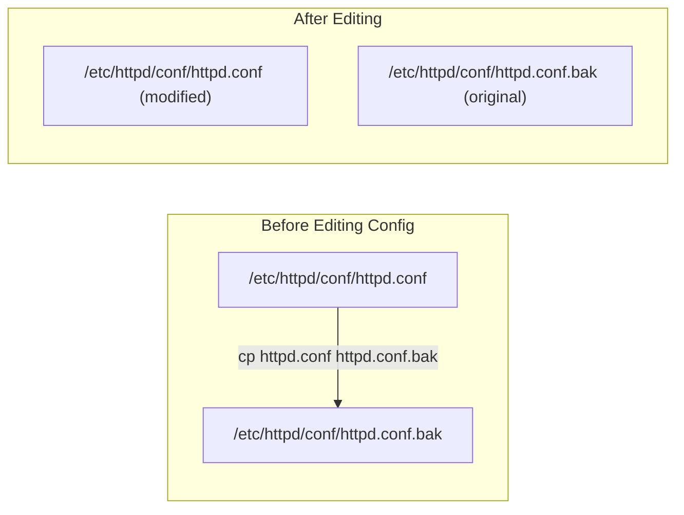
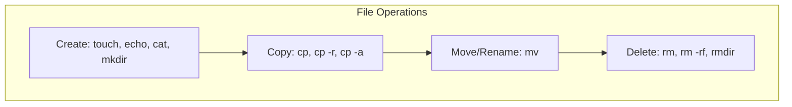
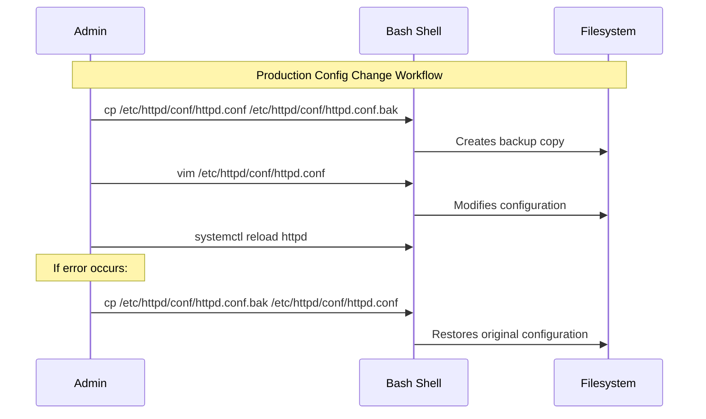

# CHAPTER 09 — FILE AND DIRECTORY OPERATIONS

---

## 1. Introduction

### Why This Topic Exists
After learning to navigate the filesystem, the next essential skill is creating, copying, moving, renaming, and deleting files and directories. These operations form the bread and butter of daily Linux administration — from creating configuration backups to deploying application files, organising log archives, and managing user data.

### Why Linux Administrators Use It
Every production task involves file operations: backing up a config file before editing (`cp sshd_config sshd_config.bak`), deploying application code to the correct directory (`cp -r app/ /opt/`), cleaning old logs (`rm -f *.log.gz`), and organising project files. Mastering these commands ensures accuracy and speed.

### Why Companies Care About It
A mistyped `rm -rf /` instead of `rm -rf ./temp/` has destroyed entire production servers. Companies expect engineers to handle file operations with precision, always creating backups before modifications, and never running destructive commands without verification.

---

## 2. Learning Objectives

By the end of this chapter, you will be able to:
- Create files using `touch`, `cat`, `echo`, and output redirection.
- Create directories using `mkdir` and `mkdir -p` (recursive).
- Copy files and directories using `cp` and `cp -r`.
- Move and rename files and directories using `mv`.
- Delete files and directories using `rm`, `rm -r`, `rm -rf`.
- Understand the critical safety rules for `rm -rf`.

---

## 3. Beginner-Friendly Explanation

Think of file operations like working with documents in an office:
- **`touch`** — Stamp today's date on a blank document (creates an empty file or updates timestamp).
- **`mkdir`** — Create a new folder in the filing cabinet.
- **`cp`** — Photocopy a document and place the copy elsewhere.
- **`mv`** — Move a document from one folder to another (or rename it by moving to the same folder with a new name).
- **`rm`** — Shred a document permanently. **There is no Recycle Bin in Linux. Deleted files are gone forever.**

---

## 4. Core Theory

### 4.1 Creating Files

| Command | Purpose | Example |
|:---|:---|:---|
| `touch filename` | Create an empty file (or update timestamp) | `touch report.txt` |
| `echo "text" > file` | Create file with content (overwrites) | `echo "Hello" > greeting.txt` |
| `echo "text" >> file` | Append text to existing file | `echo "World" >> greeting.txt` |
| `cat > file` | Create file by typing content (Ctrl+D to save) | `cat > notes.txt` |
| `> file` | Create an empty file (or truncate existing to 0 bytes) | `> access.log` |

### 4.2 Creating Directories

| Command | Purpose | Example |
|:---|:---|:---|
| `mkdir dirname` | Create a single directory | `mkdir projects` |
| `mkdir -p path/to/dir` | Create directory and all parent directories | `mkdir -p /opt/app/config/ssl` |
| `mkdir dir1 dir2 dir3` | Create multiple directories at once | `mkdir logs temp backup` |
| `mkdir -m 750 dirname` | Create directory with specific permissions | `mkdir -m 700 .ssh` |

### 4.3 Copying Files and Directories

| Command | Purpose | Example |
|:---|:---|:---|
| `cp source dest` | Copy a single file | `cp httpd.conf httpd.conf.bak` |
| `cp -r source/ dest/` | Copy directory recursively (with all contents) | `cp -r /etc/httpd/ /tmp/httpd_backup/` |
| `cp -p source dest` | Copy preserving permissions, ownership, timestamps | `cp -p app.war /opt/tomcat/webapps/` |
| `cp -a source/ dest/` | Archive copy (preserves everything: permissions, links, timestamps) | `cp -a /home/sachin/ /backup/` |
| `cp -i source dest` | Interactive — prompt before overwriting | `cp -i config.yml /etc/app/` |

### 4.4 Moving and Renaming

| Command | Purpose | Example |
|:---|:---|:---|
| `mv source dest` | Move a file to a new location | `mv report.txt /home/sachin/Documents/` |
| `mv oldname newname` | Rename a file (move within same directory) | `mv httpd.conf httpd.conf.old` |
| `mv dir1/ dir2/` | Move/rename a directory | `mv logs/ archive_logs/` |
| `mv -i source dest` | Interactive — prompt before overwriting | `mv -i file.txt /tmp/` |

### 4.5 Deleting Files and Directories

| Command | Purpose | Example |
|:---|:---|:---|
| `rm file` | Delete a single file | `rm old_report.txt` |
| `rm -f file` | Force delete (no prompt, no error if missing) | `rm -f core.dump` |
| `rm -r dir/` | Delete directory and all contents recursively | `rm -r old_project/` |
| `rm -rf dir/` | Force recursive delete (most dangerous command) | `rm -rf /tmp/build_artifacts/` |
| `rm -i file` | Interactive delete (prompt for confirmation) | `rm -i important.txt` |
| `rmdir dir` | Delete empty directory only | `rmdir empty_folder/` |

---

## 5. Internal Working

When you run `cp /etc/passwd /tmp/passwd_backup`:
1. The kernel opens `/etc/passwd` for reading (system call: `open()`).
2. Reads the file content into a kernel buffer (system call: `read()`).
3. Creates a new file `/tmp/passwd_backup` with a new inode number (system call: `creat()`).
4. Writes the buffer content into the new file (system call: `write()`).
5. The new file gets its own inode, its own data blocks — it is a completely independent copy.

When you run `mv file1 file2` **within the same filesystem**:
1. The kernel simply updates the directory entry — the filename changes, but the inode number remains the same.
2. No data is physically moved. This is why `mv` within the same partition is instantaneous regardless of file size.

When you run `mv` **across filesystems** (e.g., from `/home` to `/tmp` if they are on different partitions):
1. The kernel performs a `cp` (copy) followed by `rm` (delete original).
2. This takes time proportional to file size.

---

## 6. Production Architecture



---

## 7. Command-by-Command Explanation

### 7.1 `touch`
- **Purpose:** Creates empty files or updates the timestamp of existing files.
- **Syntax:** `touch [options] filename [filename2 ...]`
- **Create multiple files:** `touch file1.txt file2.txt file3.txt`
- **Update timestamp:** `touch -t 202601011200.00 file.txt` (sets timestamp to Jan 1, 2026 12:00)

### 7.2 `mkdir -p`
- **Purpose:** Creates a directory path including all missing parent directories.
- **Example:**
  ```bash
  mkdir -p /opt/myapp/v2/config/ssl/certs
  # Creates ALL directories in the path that don't already exist
  ```

### 7.3 `cp -a` (Archive Copy)
- **Purpose:** The most comprehensive copy option. Preserves permissions, ownership, timestamps, symlinks, and special files.
- **Use Case:** Backup operations, server migration.
- **Example:**
  ```bash
  sudo cp -a /etc/ /backup/etc_backup_$(date +%Y%m%d)/
  ```

---

## 8. Syntax Breakdown

```bash
cp -rp /opt/tomcat/ /backup/tomcat_bak/
│   ││  └──────────  └──────────────────── Destination path
│   ││  └──────────────────────────────── Source path
│   │└── p: preserve permissions, ownership, timestamps
│   └─── r: recursive (copy entire directory tree)
└──────── Command: copy
```

---

## 9. Parameter Explanation

| Command | Parameter | Description |
|:---|:---|:---|
| `cp` | `-r` | Recursive — copy directories and their contents |
| `cp` | `-p` | Preserve permissions, ownership, and timestamps |
| `cp` | `-a` | Archive — equivalent to `-rpd` (preserves everything) |
| `cp` | `-i` | Interactive — prompt before overwriting existing files |
| `cp` | `-v` | Verbose — show files being copied |
| `rm` | `-r` | Recursive — delete directories and their contents |
| `rm` | `-f` | Force — no prompts, no errors for missing files |
| `rm` | `-i` | Interactive — prompt for each file before deleting |
| `mkdir` | `-p` | Create parent directories as needed |
| `mkdir` | `-m` | Set permissions during creation |

---

## 10. Sample Output Analysis

```bash
$ ls -la /home/sachin/
total 32
drwx------. 4 sachin sachin 4096 Jul 26 10:00 .
drwxr-xr-x. 3 root   root   4096 Jul 20 09:00 ..
-rw-------. 1 sachin sachin  548 Jul 26 09:55 .bash_history
-rw-r--r--. 1 sachin sachin  220 Jul 20 09:00 .bash_profile
-rw-r--r--. 1 sachin sachin  140 Jul 20 09:00 .bashrc
drwxr-xr-x. 2 sachin sachin 4096 Jul 25 14:00 Documents
-rw-rw-r--. 1 sachin sachin 1024 Jul 26 10:00 report.txt
```

| Entry | Type | Meaning |
|:---|:---|:---|
| `.` | Directory | Current directory (`/home/sachin`) |
| `..` | Directory | Parent directory (`/home`) |
| `.bash_history` | Hidden file | Command history (dot-file) |
| `Documents` | Directory | Regular directory (starts with `d`) |
| `report.txt` | File | Regular file (starts with `-`) |

---

## 11. Architecture Diagram



---

## 12. Workflow Diagram



---

## 13. Real Production Examples

### Configuration Backup Before Change
**Every enterprise follows this rule:** Never edit a configuration file without creating a backup first.
```bash
# Standard backup naming convention
cp /etc/ssh/sshd_config /etc/ssh/sshd_config.bak.$(date +%Y%m%d_%H%M)
# Result: /etc/ssh/sshd_config.bak.20260726_1030
```

### Application Deployment
```bash
# Deploy new WAR file to Tomcat
sudo cp -p myapp.war /opt/tomcat/webapps/
sudo chown tomcat:tomcat /opt/tomcat/webapps/myapp.war
sudo systemctl restart tomcat
```

### Log Cleanup
```bash
# Remove compressed log files older than 90 days
find /var/log/ -name "*.gz" -mtime +90 -exec rm -f {} \;
```

---

## 14. Common Mistakes

1. **Running `rm -rf /` or `rm -rf /*`** — Destroys the entire system. Modern `rm` has `--preserve-root` protection by default, but older systems and Docker containers may not.
2. **Forgetting `-r` when copying directories** — `cp /etc/httpd /tmp/` fails without `-r`. Must use `cp -r /etc/httpd/ /tmp/`.
3. **Not creating backups before editing config files** — If the edited config has an error, there is no way to restore the original without a backup.
4. **Using `>` instead of `>>`** — `echo "new line" > file` **overwrites** the entire file. `echo "new line" >> file` **appends** to the file.
5. **Space errors in `rm` commands** — `rm -rf / tmp` has a space that makes it delete `/` (root) AND `tmp`. The intended command was `rm -rf /tmp`.

---

## 15. Best Practices

- **Always backup before modifying:** `cp file file.bak.$(date +%Y%m%d)`
- **Use `-i` flag** when working with critical files: `cp -i`, `mv -i`, `rm -i`.
- **Use `ls` to verify** before running `rm -rf`: `ls /path/to/delete` first.
- **Never use `rm -rf` with variables** unless you validate them: `rm -rf $DIR` is dangerous if `$DIR` is empty (becomes `rm -rf`).
- **Use `trash-cli`** in non-production environments for recoverable deletion.

---

## 16. Security Considerations

- Copied files get the permissions of the copying user unless `-p` or `-a` is used.
- Use `shred` instead of `rm` when deleting sensitive files (e.g., encryption keys): `shred -vfz -n 5 secret.key`.
- Set `alias rm='rm -i'` in user profiles to prevent accidental deletion.

---

## 17. Performance Considerations

- `mv` within the same filesystem is instantaneous (only renames the directory entry).
- `mv` across filesystems copies data then deletes — slow for large files.
- `cp -a` is faster than `tar` for simple directory copies on the same disk.
- For large file transfers across servers, use `rsync` instead of `cp` (supports resume and delta transfer).

---

## 18. Troubleshooting Guide

| Symptom | Root Cause | Resolution |
|:---|:---|:---|
| `cp: omitting directory` | Missing `-r` flag for directory copy | Use `cp -r source/ dest/` |
| `rm: cannot remove: Permission denied` | File owned by another user or immutable flag set | Use `sudo rm` or check `lsattr` for immutable flag |
| `mv: cannot move: Device or resource busy` | File is currently in use by a process | Identify process with `lsof /path/to/file` |
| `mkdir: cannot create: File exists` | Directory already exists | Use `mkdir -p` to ignore existing dirs |

---

## 19. Practical Labs

**Lab 9.1:** File creation:
```bash
touch file1.txt file2.txt file3.txt
echo "Hello Linux" > greeting.txt
cat greeting.txt
echo "Welcome to the course" >> greeting.txt
cat greeting.txt
```

**Lab 9.2:** Directory operations:
```bash
mkdir -p ~/projects/webapp/config/ssl
tree ~/projects
```

**Lab 9.3:** Copy, move, delete:
```bash
cp greeting.txt ~/projects/greeting_backup.txt
mv greeting.txt ~/projects/webapp/
ls ~/projects/webapp/
rm -i file1.txt file2.txt file3.txt
```

---

## 20. Mini Project

Create a directory structure simulating an enterprise project:
```bash
mkdir -p ~/enterprise_project/{config,scripts,logs,backup,data}
touch ~/enterprise_project/config/{app.conf,db.conf,ssl.conf}
touch ~/enterprise_project/scripts/{deploy.sh,backup.sh,monitor.sh}
touch ~/enterprise_project/logs/{access.log,error.log}
tree ~/enterprise_project
```

---

## 21. Assignments

1. What is the difference between `cp` and `cp -a`? When would you use each?
2. Explain what happens internally when you `mv` a file within the same filesystem vs across filesystems.
3. Why is `rm -rf $VAR` dangerous if `$VAR` is not set?

---

## 22. Interview Questions

### Basic
1. **Q: How do you create a directory along with its parent directories?**
   A: `mkdir -p /path/to/deep/directory` — The `-p` flag creates all missing parent directories.

2. **Q: What is the difference between `>` and `>>`?**
   A: `>` redirects output to a file and **overwrites** existing content. `>>` redirects output and **appends** to existing content.

### Intermediate
3. **Q: How do you take a backup of a configuration file before editing it?**
   A: `cp /etc/httpd/conf/httpd.conf /etc/httpd/conf/httpd.conf.bak.$(date +%Y%m%d)` — This creates a timestamped backup preserving the original.

4. **Q: What is the difference between `cp -r` and `cp -a`?**
   A: `cp -r` copies recursively but may change ownership and timestamps. `cp -a` is an archive copy that preserves everything: permissions, ownership, timestamps, symbolic links, and special files. `cp -a` is equivalent to `cp -rpd`.

### Scenario-Based
5. **Q: An engineer accidentally deleted `/etc/httpd/conf/httpd.conf`. How do you recover?**
   A: (1) Check if a `.bak` backup exists: `ls /etc/httpd/conf/httpd.conf*`. (2) If not, reinstall the package that owns it: `rpm -qf /etc/httpd/conf/httpd.conf` → `dnf reinstall httpd`. (3) If neither works, restore from the last backup or configuration management system (Ansible/Git).

---

## 23. Chapter Summary and Quick Revision Notes

- `touch` creates empty files. `mkdir -p` creates nested directories.
- `cp -a` is the best option for backups (preserves everything).
- `mv` within same filesystem is instant. `mv` across filesystems copies then deletes.
- `rm -rf` is permanent — no Recycle Bin. Always verify with `ls` first.
- **Golden Rule:** Always `cp file file.bak` before editing any config file.
- Never use `rm -rf` with unvalidated variables.

---

## 24. Cheat Sheet

| Command | Purpose |
|:---|:---|
| `touch file` | Create empty file or update timestamp |
| `mkdir -p path/to/dir` | Create directory with parents |
| `cp -a source dest` | Archive copy (preserves everything) |
| `cp file file.bak.$(date +%Y%m%d)` | Create timestamped backup |
| `mv oldname newname` | Rename or move |
| `rm -rf dir/` | Force-delete directory (DANGEROUS) |
| `rm -i file` | Interactive delete with confirmation |
| `> file` | Truncate file to zero bytes |
