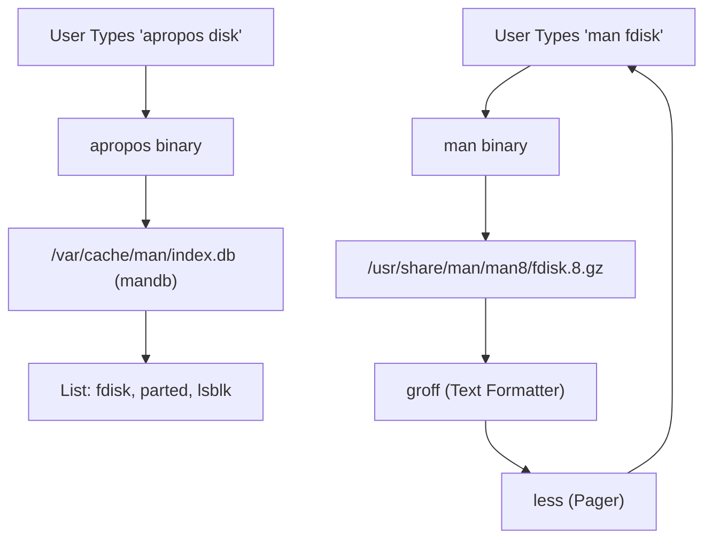
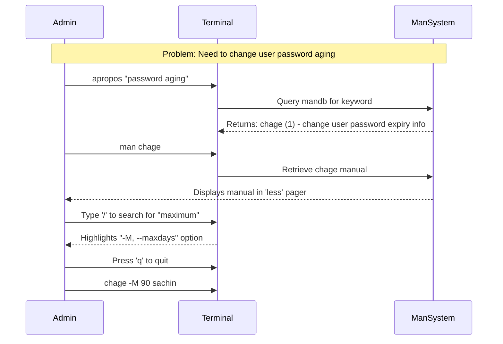

# CHAPTER 12 — HELP SYSTEM AND DOCUMENTATION

---

## 1. Introduction

### Why This Topic Exists
Linux has thousands of commands, each with dozens of optional parameters (flags). No engineer on earth, not even Linus Torvalds, has memorised them all. Fortunately, Linux is a self-documenting operating system. The manuals for every command, configuration file, and system call are built directly into the OS.

### Why Linux Administrators Use It
When an engineer encounters an unfamiliar command in a legacy script, or needs to find the exact flag to force `tar` to use a specific compression algorithm, they do not open a web browser. They consult the built-in manual pages (`man`). This is crucial in secure production environments (like banking or government data centres) where servers have no outbound internet access to Google or StackOverflow.

### Why Companies Care About It
Self-reliance. Companies hire engineers who can solve problems independently. An engineer who knows how to use `man`, `apropos`, and `--help` can adapt to any Linux distribution, figure out unfamiliar proprietary tools, and resolve issues without waiting for external help.

---

## 2. Learning Objectives

By the end of this chapter, you will be able to:
- Navigate and read the `man` (manual) pages.
- Understand the 9 sections of the Linux manual.
- Use `--help` for quick command syntax reference.
- Search for commands based on functionality using `apropos` and `whatis`.
- Use the `info` command for GNU-specific documentation.
- Update the manual page search database.

---

## 3. Beginner-Friendly Explanation

Think of the Linux Help System like a library inside your computer:
- **`--help` (The Cheat Sheet):** A quick, 1-page summary of how a tool works. Fast but lacks deep explanation.
- **`man` (The Instruction Manual):** The complete, highly detailed booklet for a specific tool. Tells you everything the tool can possibly do.
- **`whatis` (The Dictionary):** Gives you a one-sentence definition of a tool.
- **`apropos` (The Librarian):** You tell the librarian, "I need a tool that does X," and the librarian gives you a list of tools that match your description.

---

## 4. Core Theory

### 4.1 The `--help` Flag
Almost every Linux command supports the `--help` (or `-h`) flag. It outputs a concise summary of the command's syntax and its most common parameters directly to standard output.
- **Best for:** Quick syntax reminders when you already know what the command does.
- **Example:** `mkdir --help`

### 4.2 The `man` Command (Manual Pages)
The `man` command opens the system's manual pages using a pager (usually `less`). It provides exhaustive documentation including syntax, description, options, exit codes, and examples.
- **Navigation:** Uses standard `less` keybindings (`Space` to page down, `q` to quit, `/` to search).

### 4.3 The 9 Sections of the Manual
Linux manuals are divided into 9 sections because some names apply to multiple things (e.g., `passwd` is both a command and a configuration file).

| Section | Content | Example |
|:---|:---|:---|
| **1** | User Commands (Executables) | `ls`, `mkdir`, `cat` |
| **2** | System Calls (Kernel functions) | `open()`, `read()` |
| **3** | C Library Functions | `printf()` |
| **4** | Devices and Special Files | `/dev/null`, `/dev/sda` |
| **5** | Configuration Files and Formats | `/etc/passwd`, `/etc/fstab` |
| **6** | Games | `tetris` |
| **7** | Miscellaneous | `boot`, `hier` (FHS) |
| **8** | System Administration Commands | `fdisk`, `iptables`, `systemctl` |
| **9** | Kernel Routines (Non-standard) | Internal kernel documentation |

**How to specify a section:** `man 5 passwd` opens the manual for the `/etc/passwd` file, whereas `man 1 passwd` (or just `man passwd`) opens the manual for the command.

### 4.4 `whatis` and `apropos`
- **`whatis command`:** Searches the manual page names and returns a one-line description.
- **`apropos keyword`:** Searches both the names and the *descriptions* of all manual pages for a keyword. Used when you know what you want to do, but don't know the command name.

---

## 5. Internal Working

The manual pages are stored as compressed text files, typically located in `/usr/share/man/`.
When you run `man ls`, the `man` programme:
1. Searches its configured paths for a file named `ls.1.gz`.
2. Decompresses the file in memory.
3. Formats the text using the `groff` text formatting system.
4. Pipes the formatted text into a pager (`less`) for you to view.

Commands like `whatis` and `apropos` do not search the raw files (which would be too slow). They query a pre-compiled database called the `mandb`. If you install new software, you may need to update this database manually using the `mandb` command.

---

## 6. Production Architecture

In highly secure environments (air-gapped networks, PCI-DSS compliant zones, classified government networks), servers cannot connect to the internet. 

```mermaid
graph TD
    subgraph Air-Gapped Production Environment
        Admin["System Administrator"]
        Server["Production Server (No Internet)"]
        ManPages["Local /usr/share/man/"]
        Mandb["Local mandb Index"]
    end
    
    subgraph Internet (Blocked)
        Google["Google / StackOverflow"]
    end

    Admin -->|Needs help| Server
    Server -->|Queries| Mandb
    Mandb -->|Retrieves from| ManPages
    Admin -.-x|Firewall Block| Google
```
*The local `man` pages are the only source of truth available during isolated outages.*

---

## 7. Command-by-Command Explanation

### 7.1 `man ls`
- **Purpose:** Opens the manual page for the `ls` command.

### 7.2 `man 5 passwd`
- **Purpose:** Opens section 5 (Configuration Files) for `passwd`. Explains the structure of the `/etc/passwd` file (username, UID, GID, home dir, shell).

### 7.3 `apropos "partition"`
- **Purpose:** Searches all manual pages for the word "partition" and lists commands that handle disk partitioning (e.g., `fdisk`, `parted`, `gdisk`).

### 7.4 `whatis tar`
- **Purpose:** Returns a quick definition: `tar (1) - an archiving utility`.

### 7.5 `sudo mandb`
- **Purpose:** Rebuilds the manual page index database. Necessary if `apropos` or `whatis` returns "nothing appropriate" immediately after installing new software.

---

## 8. Syntax Breakdown

```bash
man -k "network status"
│   │  └────────────────── Keyword to search (must be quoted if multiple words)
│   └───────────────────── k flag (equivalent to running 'apropos')
└───────────────────────── Command: manual
```

---

## 9. Parameter Explanation

| Command | Parameter | Description |
|:---|:---|:---|
| `man` | `[section]` | Specify the manual section (1-8). E.g., `man 5 crontab` |
| `man` | `-k` | Search descriptions (identical to `apropos`) |
| `man` | `-f` | Short description (identical to `whatis`) |
| `apropos` | `-e` | Exact match search |

---

## 10. Sample Output Analysis

**Scenario:** We need to find a command to manage the firewall, but we forgot the name.
**Command:** `apropos firewall`

**Output:**
```text
firewall-cmd (1)     - firewalld command line client
firewalld (1)        - dynamic firewall daemon
iptables (8)         - administration tool for IPv4 packet filtering
nft (8)              - Administration tool over nftables
```

**Analysis:**
- The first column is the command name.
- The number in parentheses `(1)` or `(8)` is the manual section (1 = user command, 8 = admin command).
- The right side is the description found in the database.
- We can now run `man firewall-cmd` to learn how to use it.

---

## 11. Architecture Diagram



---

## 12. Workflow Diagram



---

## 13. Real Production Examples

### Air-Gapped Datacentre Troubleshooting
A junior engineer at a secure banking facility needs to modify the `/etc/fstab` file to mount an NFS drive but cannot remember the exact syntax for the mount options. Because mobile phones and internet access are banned on the data floor, they run:
```bash
man 5 fstab
# and
man nfs
```
This provides the exact configuration syntax directly from the local system, allowing them to complete the task without violating security protocols.

---

## 14. Common Mistakes

1. **Not knowing how to quit `man`** — Because `man` uses `less` as its pager, you must press `q` to quit. Beginners often press `Ctrl+C` or `Esc`.
2. **Ignoring manual sections** — Running `man passwd` shows how to change a password (Command). Running `man 5 passwd` shows the structure of the configuration file. If you don't specify section 5, you will never see the file structure documentation.
3. **Reading the entire man page** — Man pages for tools like `tar` or `rsync` are hundreds of pages long. Do not read them like a book. Press `/` and search for exactly what you need (e.g., `/extract`).

---

## 15. Best Practices

- Use `--help` for a 10-second syntax reminder.
- Use `man` when you need detailed parameter explanations or examples.
- Use `apropos` when you know the *concept* but not the *command name*.
- Inside `man`, type `/` followed by your keyword to search, and press `n` to jump to the next occurrence.

---

## 16. Security Considerations

- Man pages themselves are not a security risk, but attackers often use `apropos` or `man` during post-exploitation enumeration to discover what tools are available on a compromised server.
- Administrators can restrict access to section 8 (admin commands) documentation for unprivileged users in highly hardened environments, though this is rare.

---

## 17. Performance Considerations

- Running `mandb` to rebuild the index can cause a temporary spike in CPU and disk I/O. Do this during maintenance windows if the system has thousands of custom packages installed.

---

## 18. Troubleshooting Guide

| Symptom | Root Cause | Resolution |
|:---|:---|:---|
| `apropos: nothing appropriate` | mandb index is outdated or empty | Run `sudo mandb` to rebuild the database |
| `No manual entry for command` | Package installed without docs, or man pages stripped | Some minimal cloud images strip man pages to save space. Install `man-db` or `man-pages` package. |
| Text in man page is garbled | Terminal encoding issue | Run `export TERM=xterm-256color` or `reset` |

---

## 19. Practical Labs

**Lab 12.1:** Use the search tools:
```bash
whatis ls
apropos "network interface"
```

**Lab 12.2:** Explore manual sections:
```bash
man passwd      # Opens section 1 (the command)
man 5 passwd    # Opens section 5 (the file structure)
```
*(Press `q` to exit each).*

**Lab 12.3:** Search inside a manual page:
1. `man useradd`
2. Type `/home` and press Enter.
3. Press `n` multiple times to read about how `useradd` handles home directories.
4. Press `q` to exit.

---

## 20. Mini Project

You are on a server with no internet access. Your task is to find the command that displays the amount of free disk space, and figure out the exact flag to make the output "human-readable" (in Megabytes/Gigabytes).
1. Use `apropos` with a keyword like "disk space" or "file system".
2. Identify the command (`df`).
3. Use `man <command>` and search (`/human`) for the correct flag.
4. Execute the command to verify it works (`df -h`).

---

## 21. Assignments

1. What is the difference between `man 1 passwd` and `man 5 passwd`?
2. You need to download a file from the internet via the command line, but you don't know what tool to use. How would you use `apropos` to find out?
3. Inside a `man` page, what keystrokes are used to search forward and jump to the next result?

---

## 22. Interview Questions

### Basic
1. **Q: How do you exit a manual page?**
   A: Press `q` (quit).

2. **Q: You forgot the exact flag to make `ls` output human-readable sizes. Without internet, how do you find it?**
   A: Run `ls --help` for a quick summary, or `man ls` and search for `/human`. (The answer is `ls -h`).

### Intermediate
3. **Q: What is the purpose of the 9 manual sections? Name what sections 1, 5, and 8 are used for.**
   A: Sections resolve name conflicts (e.g., `passwd` command vs `/etc/passwd` file). Section 1 is User Commands, Section 5 is Configuration Files, and Section 8 is System Administration Commands.

4. **Q: What command helps you find other commands based on a keyword description?**
   A: `apropos <keyword>` (or `man -k <keyword>`).

### Scenario-Based
5. **Q: You are in an isolated PCI-compliant database zone with no internet. You need to archive some logs using `tar` but need to exclude a specific directory. You don't know the syntax. How do you find it quickly without reading the entire 50-page `tar` manual?**
   A: I would run `man tar`. Once inside the pager, I would press `/` to initiate a search, type `exclude`, and press Enter. I would press `n` to jump directly to the exact parameter (`--exclude=PATTERN`) and read its syntax example.

---

## 23. Chapter Summary and Quick Revision Notes

- Linux is self-documenting. No internet is required to learn command syntax.
- `--help` provides a quick cheat sheet.
- `man` provides exhaustive documentation. Uses `less` keybindings (arrows, `q` to quit, `/` to search).
- Section 1 = Commands. Section 5 = Config Files. Section 8 = Admin Commands.
- `apropos keyword` searches descriptions to find commands you don't know the name of.
- `whatis command` gives a one-line definition.

---

## 24. Cheat Sheet

| Command | Purpose |
|:---|:---|
| `command --help` | Quick syntax summary |
| `man command` | Open detailed manual |
| `man 5 file` | Open configuration file structure manual |
| `whatis command` | One-sentence definition |
| `apropos keyword` | Find commands matching a keyword |
| `sudo mandb` | Rebuild manual page search database |
| `q` | Quit manual page |
| `/keyword` | Search forward inside manual page |
| `n` / `N` | Next / Previous search result inside manual page |
