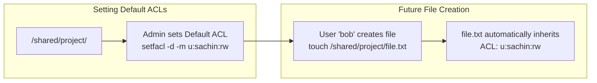
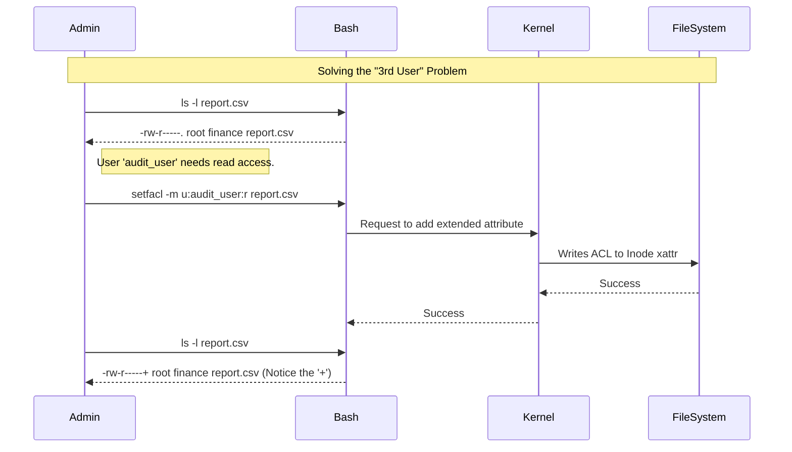

# CHAPTER 17 — ACCESS CONTROL LISTS (ACL)

---

## 1. Introduction

### Why This Topic Exists
Standard Linux permissions (`chmod`) have a massive limitation: a file can only have ONE owner and ONE group. If you have a file that needs to be read by User A, written to by User B, and executed by User C (who are all in different groups), standard permissions cannot handle it without creating messy, complex overlapping groups. Access Control Lists (ACLs) were introduced to solve this exact problem, allowing fine-grained permissions for specific users and groups on a single file.

### Why Linux Administrators Use It
In enterprise environments, cross-departmental collaboration is common. The Finance department and the HR department might need different levels of access to the same directory, while IT needs full access, and Marketing needs read-only access. Administrators use `setfacl` to apply these complex matrices without breaking standard file ownership.

### Why Companies Care About It
The Principle of Least Privilege states that users should only have exactly the access they need — no more, no less. Standard permissions often force administrators to grant broader access than necessary (like making a file world-readable) just to accommodate a single extra user. ACLs ensure strict compliance with security policies by enabling micro-targeted permissions.

---

## 2. Learning Objectives

By the end of this chapter, you will be able to:
- Identify if a file has an ACL applied (`ls -l` plus `+` sign).
- View ACLs on files and directories (`getfacl`).
- Set, modify, and remove ACLs for specific users and groups (`setfacl`).
- Configure Default ACLs on directories to ensure new files inherit specific permissions.
- Understand how the ACL Mask limits maximum allowed permissions.

---

## 3. Beginner-Friendly Explanation

Think of a VIP lounge at an airport:
- **Standard Permissions:** There is a bouncer with a simple list. If you are the Lounge Manager (Owner), or if you are a First Class Ticket Holder (Group), you can get in. Everyone else (Others) is blocked.
- **The Problem:** The CEO of the airline wants to get in, but he isn't the manager and doesn't have a ticket today. Under standard rules, you have to let *everyone* in (Others=Read) just to let the CEO in.
- **ACL (Access Control List):** The bouncer gets a tablet computer with a specific VIP list. "Allow CEO: Read/Write", "Allow Janitor: Read". Now, you can let specific individuals in without changing the main rules for the general public.

---

## 4. Core Theory

### 4.1 Identifying ACLs
When an ACL is applied to a file, the 10th character of the permissions string in `ls -l` changes from a dot (`.`) to a plus sign (`+`).
- **No ACL:** `-rw-r--r--. 1 root root ...`
- **Has ACL:** `-rw-r--r--+ 1 root root ...`

### 4.2 Viewing ACLs: `getfacl`
The `getfacl filename` command displays the complete permission structure, including the owner, group, standard permissions, and specific ACL entries.

### 4.3 Setting ACLs: `setfacl`
Syntax: `setfacl -m u:username:permissions filename`
- `-m`: Modify/Add the ACL.
- `-x`: Remove a specific ACL entry.
- `-b`: Remove ALL ACL entries (strip back to standard permissions).
- `u:`: User.
- `g:`: Group.
- `m:`: Mask.

*Example:* `setfacl -m u:sachin:rw report.txt` (Grants user sachin read/write access).

### 4.4 The ACL Mask
The mask defines the **maximum** allowable permissions for all ACL users and the standard group.
If you give user "sachin" `rwx` via ACL, but the mask is set to `r--`, sachin will only get `r--`. The mask acts as a safety ceiling.
*Example:* `setfacl -m m:r-- report.txt`

### 4.5 Default ACLs (Directory Inheritance)
By default, files created inside a directory do not inherit the directory's ACLs.
To force all new files inside a directory to inherit specific ACLs automatically, you use the **Default ACL** flag (`-d`).
*Example:* `setfacl -d -m g:finance:rw /shared/finance/`

---

## 5. Internal Working

ACLs are stored as **Extended Attributes (xattr)** in the filesystem's inode structure.
When a process attempts to access a file:
1. The kernel checks the Owner. If it matches, standard Owner permissions apply.
2. The kernel checks the ACL User entries. If a match is found, it applies that specific ACL (bounded by the mask).
3. The kernel checks the owning Group and any ACL Group entries.
4. Finally, if no match is found, it applies the standard Others permissions.

*Note: For ACLs to work, the underlying filesystem (Ext4, XFS) must be mounted with the `acl` option. On modern RHEL/Ubuntu systems, this is enabled by default.*

---

## 6. Production Architecture

```mermaid
graph TD
    subgraph /shared/data_lake/
        File["project_data.csv<br/>Owner: root (rw-)<br/>Group: data_eng (r--)"]
    end

    UserA["User: sachin (Data Scientist)"]
    UserB["User: david (Intern)"]
    GroupA["Group: auditors"]

    UserA -->|ACL: u:sachin:rw-| File
    UserB -->|Standard: Others (---)| File
    GroupA -->|ACL: g:auditors:r--| File
```

---

## 7. Command-by-Command Explanation

### 7.1 `getfacl file.txt`
- **Purpose:** Displays all standard and extended permissions for the file.

### 7.2 `setfacl -m u:john:rwx file.txt`
- **Purpose:** Grants the user `john` read, write, and execute permissions on `file.txt`.

### 7.3 `setfacl -m g:marketing:rx directory/`
- **Purpose:** Grants the group `marketing` read and execute (traverse) access to the directory.

### 7.4 `setfacl -x u:john file.txt`
- **Purpose:** Removes the specific ACL entry for `john`.

### 7.5 `setfacl -b file.txt`
- **Purpose:** Removes all ACLs from the file, returning it to standard `chmod` permissions.

### 7.6 `setfacl -R -m u:john:rx directory/`
- **Purpose:** Recursively applies the ACL to the directory and all existing files inside it.

---

## 8. Syntax Breakdown

```bash
setfacl -d -m g:developers:rw /opt/codebase/
│       │  │  │ │          │  │
│       │  │  │ │          │  └── Target directory
│       │  │  │ │          └───── Permissions to grant (Read, Write)
│       │  │  │ └──────────────── Target Group Name
│       │  │  └────────────────── g = Group (u = User)
│       │  └───────────────────── m = Modify the ACL
│       └──────────────────────── d = Default (apply to future files created here)
└──────────────────────────────── Command: Set File ACL
```

---

## 9. Parameter Explanation

| Command | Parameter | Description |
|:---|:---|:---|
| `setfacl` | `-m` | Modify the ACL of a file or directory |
| `setfacl` | `-x` | Remove a specific ACL entry |
| `setfacl` | `-b` | Remove all extended ACL entries |
| `setfacl` | `-d` | Set the Default ACL (directories only) |
| `setfacl` | `-R` | Apply operations to all files and directories recursively |

---

## 10. Sample Output Analysis

**Scenario:** We added an ACL for user `sachin` on a file owned by `root`.
**Command:** `getfacl secure_log.txt`

**Output:**
```text
# file: secure_log.txt
# owner: root
# group: root
user::rw-
user:sachin:r--
group::---
mask::r--
other::---
```

**Analysis:**
- `user::rw-` : The file owner (`root`) has read/write. (Notice the double colon, meaning the standard owner).
- `user:sachin:r--` : The specific user `sachin` has read access.
- `group::---` : The owning group (`root`) has no access.
- `mask::r--` : The maximum permission anyone (except the owner) can have is read.
- `other::---` : Everyone else has no access.

---

## 11. Architecture Diagram



---

## 12. Workflow Diagram



---

## 13. Real Production Examples

### Shared Departmental Folders
A company has a `/data/finance` directory. The `finance` group owns it (`rwx`). The `auditor` user needs read access to everything currently inside, AND everything created in the future.
```bash
# 1. Grant access to existing files recursively
setfacl -R -m u:auditor:rx /data/finance/

# 2. Set default ACL so future files automatically grant access
setfacl -d -m u:auditor:rx /data/finance/
```

### Safely Granting Log Access to Developers
Developers need to read Apache error logs (`/var/log/httpd/error_log`), which are owned by root. Instead of making the logs world-readable (`chmod 644`), the admin uses ACLs:
```bash
setfacl -m g:developers:r /var/log/httpd/error_log
```

---

## 14. Common Mistakes

1. **Ignoring the Mask** — You run `setfacl -m u:sachin:rwx file.txt`, but sachin still gets "Permission denied". Why? If you look at `getfacl`, the `mask::r--` is restricting effective permissions. You must update the mask: `setfacl -m m:rwx file.txt`.
2. **Missing `x` on Directories** — Just like standard permissions, if you grant a user `u:sachin:rw` via ACL on a directory, they cannot enter it. They need `u:sachin:rwx`.
3. **Using `chmod` after `setfacl`** — Running standard `chmod` on a file with ACLs recalculates the ACL mask, potentially breaking your carefully crafted ACL permissions.

---

## 15. Best Practices

- Always use standard permissions (`chmod`, `chown`) first. Only use ACLs when standard permissions cannot solve the problem.
- When creating shared departmental drives on Linux file servers (Samba/NFS), always use Default ACLs (`-d`) to ensure permissions remain consistent regardless of who creates new files.
- Document ACL usage. Because `ls -l` only shows a `+` sign, hidden ACLs can confuse other administrators troubleshooting access issues.

---

## 16. Security Considerations

- When copying files with `cp`, ACLs are **lost** by default. To copy a file and retain its ACLs, you must use `cp -p` (preserve) or `cp -a` (archive).
- When archiving with `tar`, you must use the `--acls` flag to preserve them, otherwise they are stripped during backup.

---

## 17. Performance Considerations

- Extensive use of ACLs increases inode size slightly and adds minor CPU overhead during permission checks, but on modern hardware, this is negligible.
- Running `setfacl -R` on millions of files causes high I/O and should be scheduled during maintenance windows.

---

## 18. Troubleshooting Guide

| Symptom | Root Cause | Resolution |
|:---|:---|:---|
| Granted ACL access, but user still denied | ACL Mask is too restrictive | Run `setfacl -m m:rwx file` to raise the ceiling |
| `setfacl: Operation not supported` | Filesystem not mounted with `acl` option | Edit `/etc/fstab`, add `acl` to mount options, and remount |
| New files in dir don't have ACLs | Default ACL not set on parent directory | Use `setfacl -d -m u:...` on the directory |
| ACLs disappeared after moving file | Target filesystem doesn't support ACLs | Ensure target partition supports and mounts ACLs |

---

## 19. Practical Labs

**Lab 17.1:** Creating and Viewing ACLs
```bash
touch acl_test.txt
ls -l acl_test.txt          # Notice no '+'
setfacl -m u:nobody:rw acl_test.txt
ls -l acl_test.txt          # Notice the '+' is now present
getfacl acl_test.txt
```

**Lab 17.2:** The Mask
```bash
setfacl -m m:r acl_test.txt
getfacl acl_test.txt        # Notice 'effective:r--' next to nobody
```

**Lab 17.3:** Removing ACLs
```bash
setfacl -x u:nobody acl_test.txt
getfacl acl_test.txt
setfacl -b acl_test.txt     # Strips everything back to normal
ls -l acl_test.txt          # The '+' is gone
```

---

## 20. Mini Project

Create a shared collaboration directory for your team.
1. `sudo mkdir /opt/collab`
2. `sudo chmod 770 /opt/collab`
3. Ensure user `sachin` (or your current user) and user `nobody` have full RWX access to all current and future files in this directory using ACLs.
   *Hint 1:* `sudo setfacl -m u:sachin:rwx,u:nobody:rwx /opt/collab`
   *Hint 2:* `sudo setfacl -d -m u:sachin:rwx,u:nobody:rwx /opt/collab`
4. `touch /opt/collab/test.txt`
5. `getfacl /opt/collab/test.txt` to verify `nobody` automatically inherited access.

---

## 21. Assignments

1. What character in `ls -l` indicates that a file has an ACL applied?
2. What is the difference between `-m` and `-d -m` in `setfacl`?
3. If an ACL grants a user `rwx`, but the ACL mask is set to `r--`, what are the effective permissions the user actually gets?

---

## 22. Interview Questions

### Basic
1. **Q: Why do we need ACLs when we already have standard Linux permissions?**
   A: Standard permissions only allow one Owner and one Group. If a file needs to be accessed by three different users who are in three different groups, standard permissions cannot do it without making the file world-readable. ACLs solve this by allowing fine-grained access for specific users and groups.

2. **Q: How do you check the ACLs on a file?**
   A: Use the `getfacl filename` command.

### Intermediate
3. **Q: You have a directory where three departments collaborate. Every time someone creates a new file, the other departments cannot read it because of default umask permissions. How do you fix this permanently?**
   A: I would configure Default ACLs on the directory using `setfacl -d -m g:group1:rw,g:group2:rw /shared/dir`. This ensures any new file created in the directory automatically inherits those specific group permissions, regardless of the creator's umask.

4. **Q: How do you completely remove all ACLs from a file and return it to normal?**
   A: `setfacl -b filename`

### Scenario-Based
5. **Q: You granted a developer read access to a log file using `setfacl -m u:devuser:r /var/log/app.log`. `getfacl` shows the rule is there, but the developer still gets "Permission Denied". What are the two most likely reasons?**
   A: (1) The developer lacks execute (`x`) permission on the parent directories (`/var` or `/var/log`), preventing them from traversing to the file. (2) The ACL Mask on the file is set to `---` (no access), which acts as a ceiling and restricts the effective permissions of the developer, overriding the specific ACL entry.

---

## 23. Chapter Summary and Quick Revision Notes

- ACLs (Access Control Lists) allow permissions for multiple specific users/groups.
- `ls -l` shows a `+` symbol at the end of the permission string if an ACL exists.
- `getfacl` displays ACLs; `setfacl` configures them.
- `setfacl -m u:user:perms` adds a user ACL.
- `setfacl -x` removes a specific entry. `setfacl -b` wipes all ACLs.
- The **Mask** (`m:`) defines the maximum allowed permissions for ACL entries.
- **Default ACLs** (`-d`) apply to directories so future files inherit permissions automatically.

---

## 24. Cheat Sheet

| Command | Purpose |
|:---|:---|
| `getfacl file` | View all ACLs |
| `setfacl -m u:sachin:rw file`| Grant user sachin read/write |
| `setfacl -m g:sales:r file` | Grant group sales read-only |
| `setfacl -x u:sachin file` | Remove sachin's ACL entry |
| `setfacl -b file` | Remove ALL ACL entries |
| `setfacl -d -m g:devs:rw dir/`| Set default ACL for future files in dir |
| `setfacl -R -m u:user:r dir/` | Recursively apply ACL to dir and contents |
