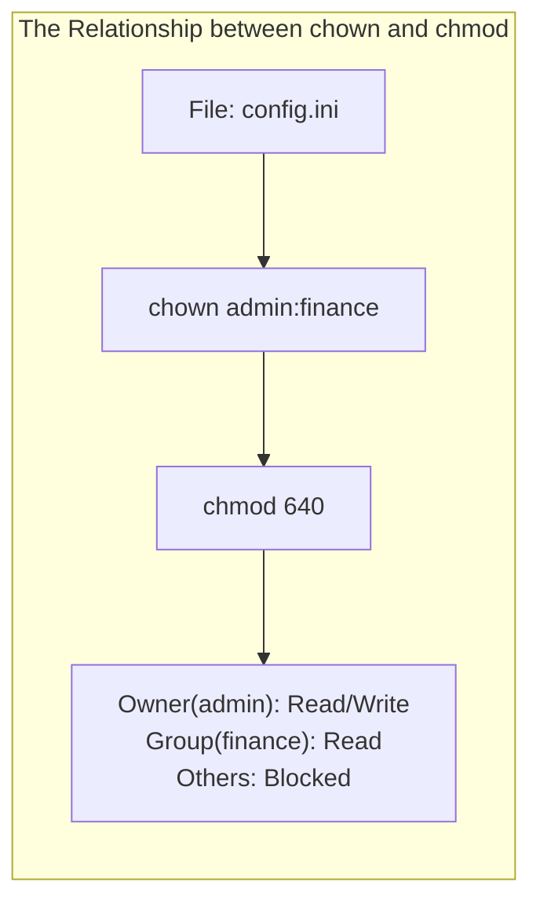
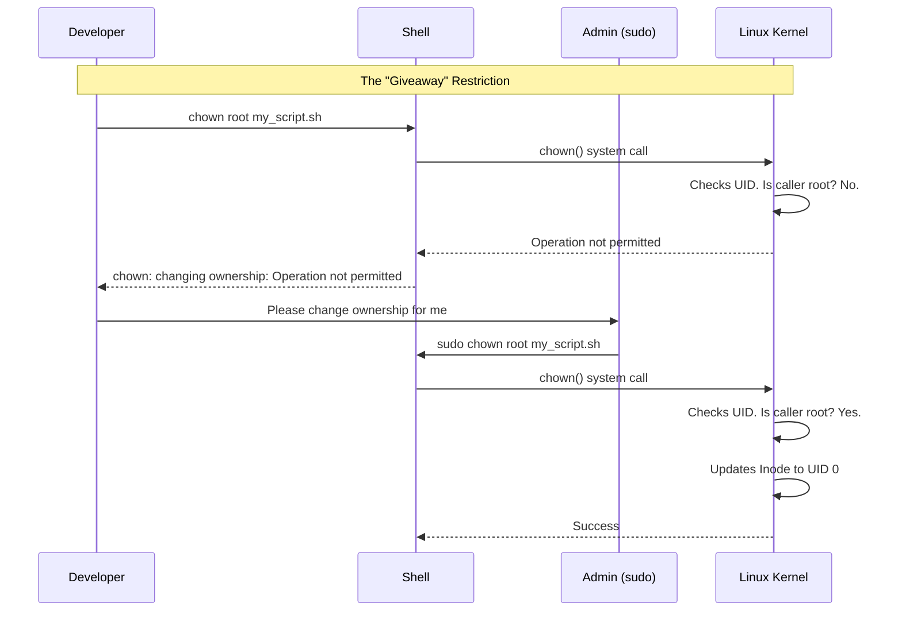

# CHAPTER 20 — FILE OWNERSHIP: CHOWN AND CHGRP

---

## 1. Introduction

### Why This Topic Exists
In Chapter 16, we learned how to assign Read, Write, and Execute permissions to the Owner, Group, and Others (`chmod`). However, `chmod` does not define *who* the Owner and Group are. Every file and directory in Linux belongs to exactly one user (the Owner) and one group. The `chown` (Change Owner) and `chgrp` (Change Group) commands allow administrators to transfer file ownership between users and groups.

### Why Linux Administrators Use It
When a developer writes a web application, the files belong to the developer. However, the Apache or Nginx web server runs as a different service account (e.g., `www-data` or `apache`). If the files are not transferred to the web server's ownership, the web server cannot read them, resulting in a "403 Forbidden" error. Administrators use `chown` to correct this.

### Why Companies Care About It
Security and compliance. If a user leaves the company, their files must be reassigned to their manager or a service account before the departing user's account is deleted. Running services as the `root` user is a massive security risk, so companies mandate that applications run as dedicated, unprivileged service accounts. Transferring file ownership to these accounts is a mandatory part of application deployment.

---

## 2. Learning Objectives

By the end of this chapter, you will be able to:
- Understand the relationship between User IDs (UID) and Group IDs (GID).
- Change file and directory ownership using `chown`.
- Change group ownership using `chgrp` or `chown`.
- Apply ownership changes recursively to entire directory trees (`-R`).
- Resolve "Operation not permitted" errors when trying to change ownership.

---

## 3. Beginner-Friendly Explanation

Think of a rental car:
- **`chmod` (The Keys):** Defines who can drive the car (Owner = full access, Others = no access).
- **`chown` (The Title/Deed):** Defines who actually owns the car.

If you buy a car, your name is on the title (You are the Owner). If you sell the car to Bob, you must sign the title over to Bob. This is what `chown` does — it legally transfers ownership of the file to a new user.

**Important Rule:** In Linux, a regular user cannot "give away" their files to someone else. If regular users could run `chown`, they could create malicious files and assign ownership to the CEO to frame them. Therefore, **only the root user can change file ownership.**

---

## 4. Core Theory

### 4.1 Users, Groups, and IDs
The kernel does not care about usernames like "sachin" or "root". It only cares about numbers.
- **UID (User ID):** e.g., root = 0, sachin = 1000.
- **GID (Group ID):** e.g., root = 0, finance = 1005.
When you run `chown sachin file.txt`, the command checks `/etc/passwd` to find sachin's UID, and then modifies the file's inode to record that UID.

### 4.2 The `chown` Command (Change Owner)
- **Syntax:** `chown [options] new_owner file`
- **Example:** `sudo chown apache index.html`

### 4.3 The `chgrp` Command (Change Group)
- **Syntax:** `chgrp [options] new_group file`
- **Example:** `sudo chgrp www-data index.html`

### 4.4 Combining Owner and Group Changes
The `chown` command can change both the owner and the group simultaneously using a colon `:` or a dot `.`.
- **Syntax:** `chown new_owner:new_group file`
- **Example:** `sudo chown apache:www-data index.html`

### 4.5 The Recursive Flag (`-R`)
When applying ownership to a folder (like a web directory), you usually want all files and folders inside it to change as well.
- **Example:** `sudo chown -R apache:apache /var/www/html/`

---

## 5. Internal Working

### Inode Modification
When `sudo chown user:group file` is executed:
1. The `chown` binary calls the `chown()` system call.
2. The kernel verifies that the process running the system call has `CAP_CHOWN` capability (usually restricted to UID 0 / root).
3. The kernel updates the UID and GID fields within the file's inode on the disk.
4. If the file has the SUID or SGID bits set, the kernel automatically strips them for security reasons (to prevent a user from accidentally creating an SUID binary owned by root).

---

## 6. Production Architecture

```mermaid
graph TD
    subgraph Web Server Deployment
        Dev["Developer (UID 1000)"]
        HTML["/var/www/html/index.html<br/>Owner: developer"]
        Admin["SysAdmin (root)"]
        WebSrv["Apache Service (UID 48)"]
        NewHTML["/var/www/html/index.html<br/>Owner: apache"]
    end

    Dev -->|Uploads code| HTML
    WebSrv -.->|403 Forbidden| HTML
    Admin -->|Runs: chown -R apache:apache| HTML
    HTML -->|Becomes| NewHTML
    WebSrv -->|200 OK (Can Read)| NewHTML
```

---

## 7. Command-by-Command Explanation

### 7.1 `chown root file.txt`
- **Purpose:** Changes the owner to `root`. Group remains unchanged.

### 7.2 `chown :finance file.txt`
- **Purpose:** Changes only the group to `finance`. Owner remains unchanged. (Identical to `chgrp finance file.txt`).

### 7.3 `chown sachin:finance file.txt`
- **Purpose:** Changes owner to `sachin` and group to `finance` simultaneously.

### 7.4 `chown -R sachin:finance /data/`
- **Purpose:** Changes owner and group for `/data/` and every file/directory nested inside it.

---

## 8. Syntax Breakdown

```bash
sudo chown -R tomcat:tomcat /opt/tomcat/webapps/
│    │     │  │      │      │
│    │     │  │      │      └── Target Directory
│    │     │  │      └───────── New Group
│    │     │  └──────────────── New Owner (separated by colon)
│    │     └─────────────────── Recursive Flag
│    └───────────────────────── Command: Change Owner
└────────────────────────────── Superuser privileges (required)
```

---

## 9. Parameter Explanation

| Command | Parameter | Description |
|:---|:---|:---|
| `chown` | `-R` | Recursively operate on files and directories |
| `chown` | `-v` | Verbose; print a message for every file changed |
| `chown` | `--reference=RFILE` | Copy ownership exactly from RFILE to target file |
| `chown` | `-c` | Like verbose, but only report files that actually changed |

---

## 10. Sample Output Analysis

**Scenario:** We need to fix the ownership of a web application directory.
**Command:** `sudo chown -vR apache:apache /var/www/webapp/`

**Output:**
```text
changed ownership of '/var/www/webapp/index.html' from sachin:sachin to apache:apache
changed ownership of '/var/www/webapp/config.php' from sachin:sachin to apache:apache
changed ownership of '/var/www/webapp/' from sachin:sachin to apache:apache
```

**Analysis:**
- The `-v` (verbose) flag shows exactly what the kernel did.
- The `-R` (recursive) flag ensured that the HTML file, the PHP file, and the parent directory itself were all updated.
- The files are now ready to be served by the Apache web daemon.

---

## 11. Architecture Diagram



---

## 12. Workflow Diagram



---

## 13. Real Production Examples

### Offboarding a Terminated Employee
When an employee leaves the company, their user account is locked or deleted. Before deletion, their project files must be transferred to their manager.
```bash
sudo chown -R manager_username /home/terminated_user/projects/
```

### Fixing Shared Directory Groups
A shared directory has files created by different users. The group ownership is fragmented. The admin forces all files to belong to the correct group.
```bash
sudo chgrp -R finance /shared/finance_data/
```

### Running Databases Securely
When installing PostgreSQL, the database files cannot be owned by root. They must be owned by the `postgres` user.
```bash
sudo chown -R postgres:postgres /var/lib/pgsql/data/
```

---

## 14. Common Mistakes

1. **Trying to `chown` as a normal user** — Beginners often try to run `chown` on files they own, trying to give them to someone else. This results in "Operation not permitted." Only `root` (via `sudo`) can change file ownership.
2. **Forgetting the `-R` flag** — Running `sudo chown apache /var/www/html` only changes the folder itself. The files inside remain owned by root. The web server will still throw 403 Forbidden errors when trying to read the files inside.
3. **Using `.` instead of `:` for group separation** — Older Unix systems used a dot (`chown user.group file`). While this still works on many Linux systems, it is deprecated because usernames can legally contain dots (e.g., `sachin.tendulkar`). Always use the colon (`user:group`).

---

## 15. Best Practices

- Always use the colon `:` separator (`user:group`).
- Verify ownership using `ls -l` immediately after running a recursive `chown` to ensure the intended outcome.
- Never run a web application, database, or application server as root. Create a dedicated service account, `chown` the application directory to that account, and configure systemd to run the service as that user.

---

## 16. Security Considerations

- **Stripping SUID/SGID:** If a file has the SUID bit set (`-rwsr-xr-x`), running `chown` on it will automatically remove the `s` bit (`-rwxr-xr-x`). This is a kernel-level security feature to prevent attackers from creating an SUID shell, changing its owner to root, and then executing it. If you `chown` an SUID file, you must re-apply the SUID bit afterward with `chmod`.

---

## 17. Performance Considerations

- Just like `chmod -R`, running `chown -R` on millions of small files (like a massive NFS share or cache directory) will cause very high disk I/O and can take minutes or hours. Perform these operations during maintenance windows.

---

## 18. Troubleshooting Guide

| Symptom | Root Cause | Resolution |
|:---|:---|:---|
| `chown: Operation not permitted` | Normal user trying to change ownership | Use `sudo chown` |
| `chown: invalid user` | The user or group does not exist in `/etc/passwd` | Create the user/group first, or check for typos |
| Web app still getting 403 Forbidden after `chown` | Forgot `-R`, or SELinux is blocking access | Run with `-R`. If SELinux is active, run `restorecon -Rv /dir` |

---

## 19. Practical Labs

**Lab 20.1:** The normal user restriction
```bash
touch my_file.txt
ls -l my_file.txt
chown root my_file.txt    # Notice this fails!
sudo chown root my_file.txt # This succeeds
ls -l my_file.txt
```

**Lab 20.2:** Changing User and Group
```bash
# Assuming your user is 'sachin'
sudo chown sachin:sachin my_file.txt
ls -l my_file.txt
```

**Lab 20.3:** Recursive Ownership
```bash
mkdir -p /tmp/webapp/logs
touch /tmp/webapp/index.html
sudo chown -R root:root /tmp/webapp
ls -laR /tmp/webapp
```

---

## 20. Mini Project

Simulate setting up a web server directory:
1. `sudo mkdir /var/www/myproject`
2. `sudo touch /var/www/myproject/index.html`
3. Check ownership (`ls -ld /var/www/myproject`). It is currently owned by root.
4. Assuming the `nobody` user exists (it does by default), assign the entire directory tree to `nobody:nobody` recursively.
5. Verify with `ls -laR /var/www/myproject`.

---

## 21. Assignments

1. Why does Linux prevent normal users from giving away their files to other users using `chown`?
2. What does the command `chown :finance report.pdf` do?
3. You need to change the owner to `nginx` and the group to `webadmins` for an entire directory tree. What is the exact command?

---

## 22. Interview Questions

### Basic
1. **Q: What is the difference between `chmod` and `chown`?**
   A: `chmod` changes the permissions (Read/Write/Execute). `chown` changes the actual Owner and Group of the file.

2. **Q: How do you change both the owner and the group of a file in a single command?**
   A: Use a colon to separate them: `chown newowner:newgroup filename`.

### Intermediate
3. **Q: Why does running `chown root script.sh` fail with "Operation not permitted" when you are logged in as the file's owner?**
   A: Because regular users are not allowed to change file ownership in Linux, even for files they own. This prevents users from malicious acts, like creating a massive file to fill the disk and then giving it to another user to bypass disk quotas. Only root (via `sudo`) can change file ownership.

4. **Q: What happens to the SUID bit on an executable file if you change the file's owner using `chown`?**
   A: The Linux kernel automatically strips the SUID (and SGID) bit for security reasons. You must re-apply the SUID bit using `chmod` after changing the ownership.

### Scenario-Based
5. **Q: You deployed a PHP web application to `/var/www/html/app/`. The web server (running as the `apache` user) needs to write uploaded images to `/var/www/html/app/uploads/`. The application is throwing "Write Denied" errors. How do you resolve this using `chown` and `chmod`?**
   A: The directory is likely owned by `root` or the developer. I would run `sudo chown -R apache:apache /var/www/html/app/uploads/` to give the web server ownership. Then, I would ensure the directory has standard write permissions by running `sudo chmod 755 /var/www/html/app/uploads/`.

---

## 23. Chapter Summary and Quick Revision Notes

- `chown` changes Owner. `chgrp` changes Group.
- **Only root** can change file ownership.
- Syntax: `chown user:group file`
- Use `-R` for recursive changes (directories).
- Always use the colon `:` separator, not the dot `.`.
- The kernel uses UIDs and GIDs internally, not names.
- `chown` will automatically strip SUID/SGID bits for security.

---

## 24. Cheat Sheet

| Command | Purpose |
|:---|:---|
| `sudo chown user file` | Change Owner |
| `sudo chgrp group file` | Change Group |
| `sudo chown :group file` | Change Group (alternative) |
| `sudo chown user:group file` | Change Owner and Group |
| `sudo chown -R u:g dir/` | Change recursively for directory tree |
| `sudo chown -v user file` | Change verbosely (shows what changed) |
