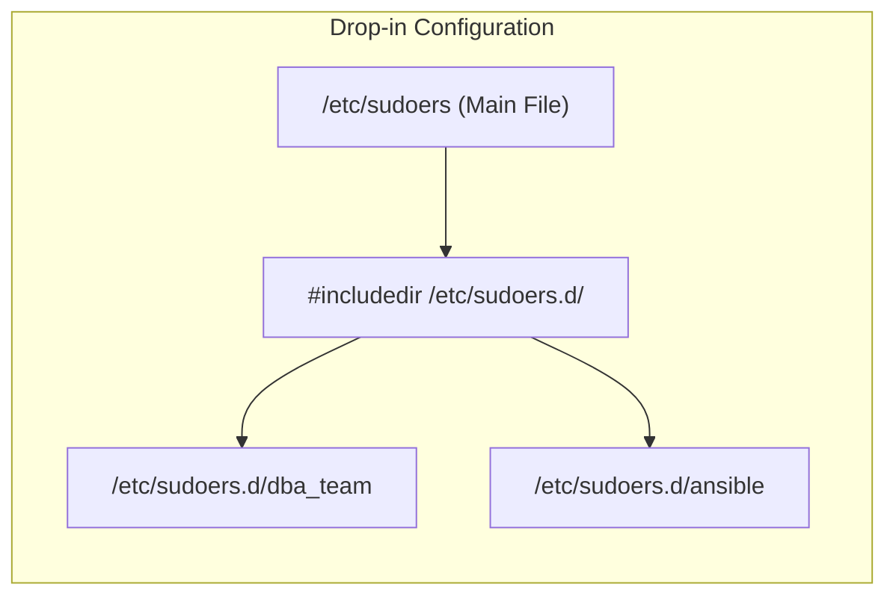

# CHAPTER 23 — SUDO AND PRIVILEGE ESCALATION

---

## 1. Introduction

### Why This Topic Exists
In Linux, the `root` user has absolute, unrestricted power. Logging in directly as `root` is extremely dangerous because a single typo (`rm -rf /`) can destroy the entire operating system, and there is no audit trail to show *who* actually caused the destruction if multiple admins share the root password. The `sudo` (SuperUser DO) command was created to allow normal users to execute specific commands as `root`, while logging every action they take.

### Why Linux Administrators Use It
System administrators use `sudo` to delegate authority. Instead of giving a Junior DBA the root password to restart the database, the Senior Admin configures `/etc/sudoers` to allow the Junior DBA to run exactly *one* command: `systemctl restart postgresql`. This enforces the Principle of Least Privilege.

### Why Companies Care About It
Compliance and Auditing (PCI-DSS, HIPAA, SOC2). If a company cannot prove exactly which human executed a privileged command at 2:00 AM on a Sunday, they will fail their security audit. `sudo` ties every root action directly to a specific user's identity and logs it to `/var/log/secure`, ensuring 100% non-repudiation.

---

## 2. Learning Objectives

By the end of this chapter, you will be able to:
- Understand the difference between `su` and `sudo`.
- Safely edit the sudoers file using `visudo`.
- Grant full root access to users and groups.
- Grant granular, command-specific access (e.g., only allow restarting a specific service).
- Configure passwordless `sudo` for automation scripts.
- Trace `sudo` executions in the system security logs.

---

## 3. Beginner-Friendly Explanation

Think of a bank vault:
- **`su` (Switch User):** The Bank Manager gives you the master key to the vault. You go inside alone. You can do whatever you want, and nobody knows exactly what you did because the log just says "The Master Key was used."
- **`sudo` (SuperUser DO):** You are not given the master key. Instead, you walk up to a heavily guarded door. You swipe *your own* ID card and type *your own* password. The guard checks a master list (`sudoers`). The list says, "Alice is allowed to open Safety Deposit Box #5." The guard opens it for you, and writes in a logbook: *"At 2:00 PM, Alice opened Box #5."*

`sudo` is secure, granular, and heavily audited.

---

## 4. Core Theory

### 4.1 `su` vs `sudo`

| Feature | `su` | `sudo` |
|:---|:---|:---|
| **Meaning** | Substitute User | SuperUser DO |
| **Password Required** | The **Target User's** password (e.g., root's password) | **Your own** password |
| **Granularity** | All or Nothing (Full shell) | Command-by-Command (Granular) |
| **Auditing** | Poor (Logs "root logged in") | Excellent (Logs exact command run by user) |

### 4.2 The `/etc/sudoers` File
This is the master configuration file that dictates who can do what.
**CRITICAL RULE:** Never edit this file directly with `vim` or `nano`. **Always use the `visudo` command.**
If you make a syntax error in `/etc/sudoers`, `sudo` will break system-wide, locking all administrators out of root access permanently (requiring a rescue disk to fix). `visudo` edits a temporary copy and syntax-checks it before saving.

### 4.3 Sudoers Syntax

```text
user  host=(runas_user:runas_group)  options: command
```

**Common Examples:**
- `root ALL=(ALL:ALL) ALL` (Root can run anything from any host as anyone)
- `%wheel ALL=(ALL) ALL` (Anyone in the `wheel` group has full sudo access)
- `sachin ALL=(root) /usr/bin/systemctl restart httpd` (Sachin can only restart Apache, nothing else)

### 4.4 Passwordless Sudo (`NOPASSWD`)
By default, `sudo` caches your password for 5-15 minutes so you don't have to type it repeatedly.
For automation scripts (like Ansible or Jenkins), typing a password is impossible. You can configure `NOPASSWD` to allow execution without a password prompt.
- `jenkins ALL=(ALL) NOPASSWD: ALL` (Jenkins can do anything without a password).

---

## 5. Internal Working

When user `sachin` types `sudo cat /etc/shadow`:
1. The `sudo` binary is executed. (It has the SUID bit set, so it runs as root).
2. `sudo` asks `sachin` for his own password to verify his identity.
3. `sudo` reads `/etc/sudoers` (and files in `/etc/sudoers.d/`).
4. It checks if `sachin` (or a group he is in) is explicitly allowed to run `/usr/bin/cat /etc/shadow`.
5. If allowed, `sudo` logs the action to `/var/log/secure` (or `/var/log/auth.log`).
6. `sudo` uses `execve()` to run the command as `root`.
7. If denied, `sudo` logs a security alert: "sachin is not in the sudoers file. This incident will be reported."

---

## 6. Production Architecture

```mermaid
graph TD
    subgraph Sudo Execution Flow
        User["User 'sachin'"]
        Command["sudo tail /var/log/messages"]
        Visudo["/etc/sudoers File"]
        AuthLog["/var/log/secure (Audit Trail)"]
        Kernel["Kernel (Executes as EUID 0)"]
    end

    User --> Command
    Command -->|Reads| Visudo
    Visudo -.->|Rule: sachin ALL=(ALL) ALL| Allowed
    Allowed -->|1. Logs Action| AuthLog
    Allowed -->|2. Executes| Kernel
```

---

## 7. Command-by-Command Explanation

### 7.1 `sudo command`
- **Purpose:** Executes a single command as root.
- **Example:** `sudo systemctl restart nginx`

### 7.2 `sudo -i` or `sudo su -`
- **Purpose:** Opens an interactive root shell with root's environment variables. Simulates a full root login.

### 7.3 `visudo`
- **Purpose:** Safely edits `/etc/sudoers`. Uses your default editor (usually `vi` or `nano`) but runs a strict syntax check on exit before committing the changes.

### 7.4 `sudo -l`
- **Purpose:** Lists the specific commands the current user is allowed to run via sudo.

---

## 8. Syntax Breakdown

```bash
alice   ALL=(root)  NOPASSWD: /usr/bin/systemctl restart httpd
│       │    │      │         │
│       │    │      │         └── The exact absolute path to the allowed command
│       │    │      └──────────── Tag: Do not prompt Alice for her password
│       │    └─────────────────── Run As: Alice can only run this as root
│       └──────────────────────── Host: Applies to all servers (if sudoers is shared via LDAP)
└──────────────────────────────── Target User
```

---

## 9. Parameter Explanation

| Command | Parameter | Description |
|:---|:---|:---|
| `sudo` | `-i` | Simulate initial login (loads root's `.bash_profile`) |
| `sudo` | `-u` | Run command as a specific user (e.g., `sudo -u postgres psql`) |
| `sudo` | `-l` | List allowed commands for current user |
| `sudo` | `-k` | Kill the cached password (forces prompt on next sudo command) |
| `visudo` | `-c` | Parse and check syntax of sudoers file without editing |

---

## 10. Sample Output Analysis

**Scenario:** We check our own sudo privileges.
**Command:** `sudo -l`

**Output:**
```text
Matching Defaults entries for sachin on prod-web-01:
    !visiblepw, always_set_home, match_mac_ext, always_query_group_plugin

User sachin may run the following commands on prod-web-01:
    (ALL) ALL
    (root) NOPASSWD: /usr/bin/cat /var/log/httpd/*
```

**Analysis:**
- Sachin has full admin rights (`(ALL) ALL`), meaning he can run any command as root, but he must type his password.
- He has a specific exception (`NOPASSWD`) allowing him to read Apache logs using `cat` without typing his password.

---

## 11. Architecture Diagram


*Modern systems avoid editing the main file. Instead, they drop isolated configuration files into `/etc/sudoers.d/`.*

---

## 12. Workflow Diagram

```mermaid
sequenceDiagram
    participant JuniorDev
    participant Sudo
    participant SecurityLog
    participant Kernel

    Note over JuniorDev,Kernel: Attempting an Unauthorized Action
    JuniorDev->>Sudo: sudo userdel -r admin
    Sudo->>Sudo: Checks /etc/sudoers
    Sudo->>Sudo: Rule says: JuniorDev only allowed to run 'systemctl'
    Sudo->>SecurityLog: WRITES: "JuniorDev : command not allowed ; TTY=pts/0 ; PWD=/home ; USER=root ; COMMAND=/usr/sbin/userdel -r admin"
    Sudo-->>JuniorDev: Sorry, user JuniorDev is not allowed to execute '/sbin/userdel' as root.
    Note right of SecurityLog: InfoSec team receives automated alert.
```

---

## 13. Real Production Examples

### The Sudo Drop-in Directory
In automated environments (AWS, Terraform, Ansible), configuration management tools do not parse and edit the complex `/etc/sudoers` file. Instead, they drop a small, simple file into `/etc/sudoers.d/`.
```bash
# Create a dedicated file for the DBA team
sudo visudo -f /etc/sudoers.d/dba_team

# Inside the file:
%dba_group ALL=(root) /usr/bin/systemctl restart postgresql, /usr/bin/tail -f /var/log/postgresql/*
```

### Impersonating Application Users
Engineers rarely log in as `root`. But what if you need to run a database backup script as the `postgres` user? You use `sudo -u`.
```bash
# Runs the pg_dump command exactly as if you were logged in as postgres
sudo -u postgres pg_dump my_database > backup.sql
```

---

## 14. Common Mistakes

1. **Editing `/etc/sudoers` with `vim`** — If you miss a comma or type a wrong character and save the file with `vim`, `sudo` will crash. If you are not already root, you are now permanently locked out of the system. ALWAYS use `visudo`.
2. **Using relative paths in sudoers** — Writing `sachin ALL=(root) systemctl` is a security risk. An attacker could create a malicious script named `systemctl` in their home directory, manipulate the `$PATH`, and execute it as root. Always use absolute paths: `/usr/bin/systemctl`.
3. **Granting `cat` access to everything** — `sachin ALL=(root) /usr/bin/cat` seems harmless (read-only). But it allows Sachin to read `/etc/shadow` (password hashes) or `/root/.ssh/id_rsa` (root's private SSH keys), leading to immediate system compromise.

---

## 15. Best Practices

- **Never share the root password.** Lock the root account (`passwd -l root`) and force everyone to use `sudo`.
- Use `/etc/sudoers.d/` for custom rules rather than editing the main `/etc/sudoers` file.
- Use Aliases in sudoers for clean configurations (e.g., `Cmnd_Alias WEBSERVICES = /usr/bin/systemctl restart httpd, /usr/bin/systemctl restart nginx`).
- Always use absolute paths for commands in sudoers.

---

## 16. Security Considerations

- **The Shell Escape Vulnerability:** If you grant a user `sudo` access to `vim` (`sudo vim /etc/hosts`), they can open the file, type `:!/bin/bash`, and instantly drop into a full interactive root shell, bypassing all restrictions. 
  - *Fix:* Use `sudoedit` instead, which copies the file, lets the user edit it as themselves, and then copies it back as root.
- **The "This incident will be reported" message:** When an unauthorised user runs `sudo`, an email is historically sent to the root user's local mailbox (`/var/mail/root`), and an entry is written to `/var/log/secure`. SIEM tools (like Splunk) actively monitor this log for insider threats.

---

## 17. Performance Considerations

- `sudo` adds a minuscule overhead (validating the configuration and writing to syslog). It has no impact on system performance.

---

## 18. Troubleshooting Guide

| Symptom | Root Cause | Resolution |
|:---|:---|:---|
| `user is not in the sudoers file` | User lacks permissions | Add user to the `wheel` (RHEL) or `sudo` (Ubuntu) group |
| `visudo: syntax error near line 50` | Typo in configuration | `visudo` prevents saving. Fix the typo it points out before quitting. |
| Prompted for password despite `NOPASSWD` | Order of operations in sudoers | Sudo processes rules top-to-bottom. If a generic `(ALL) ALL` rule appears *after* your `NOPASSWD` rule, it overrides it. Move `NOPASSWD` to the bottom. |

---

## 19. Practical Labs

**Lab 23.1:** Sudo basics
```bash
whoami
sudo whoami
sudo -i         # Become root interactively
whoami
exit            # Return to normal user
```

**Lab 23.2:** Auditing
```bash
sudo tail -n 5 /var/log/secure
# Look for lines mentioning "sudo" and your username
```

**Lab 23.3:** Drop-in Configuration (Safe method)
1. Run `sudo visudo -f /etc/sudoers.d/test_rule`
2. Add the line: `%users ALL=(root) NOPASSWD: /usr/bin/uptime`
3. Save and exit.
4. Run `sudo uptime`. It should execute without asking for a password.

---

## 20. Mini Project

Create a restricted Helpdesk role.
1. Create a user `helpdesk_user`.
2. Use `visudo -f /etc/sudoers.d/helpdesk` to create a rule.
3. Allow `helpdesk_user` to run EXACTLY two commands: `/usr/bin/systemctl restart network` and `/usr/bin/cat /var/log/messages`.
4. Switch to the user: `su - helpdesk_user`.
5. Run `sudo -l` to verify the restrictions.
6. Try to run `sudo useradd hacker`. It should fail and log a security violation.

---

## 21. Assignments

1. What is the fundamental security difference between `su root` and `sudo <command>` regarding auditing?
2. Why must you use `visudo` instead of `vi /etc/sudoers`?
3. What is the danger of granting `sudo` access to the `vi` or `vim` editor?

---

## 22. Interview Questions

### Basic
1. **Q: How do you grant a user full root access on a Red Hat system?**
   A: Add them to the `wheel` group using `usermod -aG wheel username`.

2. **Q: How do you view the sudo commands you are allowed to run?**
   A: `sudo -l`

### Intermediate
3. **Q: You wrote a line in sudoers: `john ALL=(root) NOPASSWD: ALL`. However, when John runs a command, it still asks for his password. Why?**
   A: The `/etc/sudoers` file is read from top to bottom. The last matching rule wins. If John belongs to the `wheel` group, and the `%wheel ALL=(ALL) ALL` rule is located *below* John's `NOPASSWD` rule in the file, the wheel rule overrides his specific rule. You must place specific/NOPASSWD rules at the very bottom of the file.

4. **Q: What is `/etc/sudoers.d/` used for?**
   A: It is a drop-in directory for sudo configuration fragments. It allows configuration management tools (like Ansible) to deploy specific sudo rules for specific applications without risking corruption of the main `/etc/sudoers` file.

### Scenario-Based
5. **Q: An application needs to run a backup script as root every night via cron. The script runs as the `appuser` account. How do you configure this without hardcoding the root password into the script?**
   A: I would use `visudo` to add a specific NOPASSWD rule for that user and that exact script.
   `appuser ALL=(root) NOPASSWD: /opt/scripts/backup.sh`
   Then, in the application's crontab, I would schedule it as:
   `0 2 * * * sudo /opt/scripts/backup.sh`

---

## 23. Chapter Summary and Quick Revision Notes

- `sudo` executes commands as root, requires your *own* password, and logs everything to `/var/log/secure`.
- Always use `visudo` to edit configurations. Never `vim /etc/sudoers`.
- Use `/etc/sudoers.d/` for modular, application-specific rules.
- Sudo rules are read Top-to-Bottom. The **last** matching rule wins.
- Absolute paths are mandatory in sudoers to prevent PATH manipulation exploits.
- Beware of "Shell Escapes" — do not grant sudo access to `vim`, `find`, `awk`, or `less` unless absolutely necessary, as they can spawn root shells.

---

## 24. Cheat Sheet

| Command | Purpose |
|:---|:---|
| `sudo -i` | Open interactive root shell |
| `sudo -u postgres cmd` | Run command as the 'postgres' user |
| `sudo -l` | List your allowed sudo commands |
| `sudo -k` | Clear cached password timestamp |
| `visudo` | Safely edit `/etc/sudoers` |
| `visudo -f /etc/sudoers.d/app` | Edit a drop-in configuration file |
| `user ALL=(ALL) NOPASSWD: ALL`| Sudoers syntax for no password |
