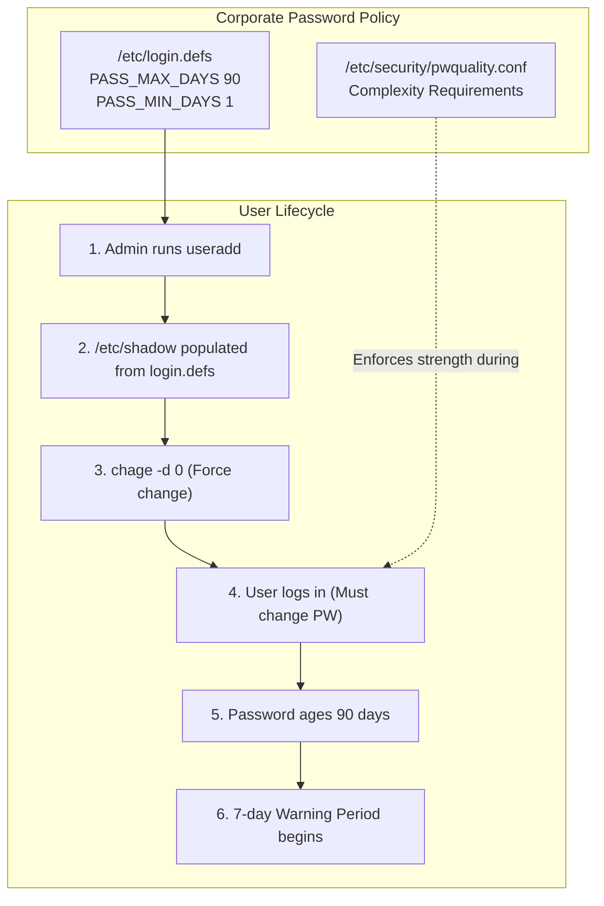
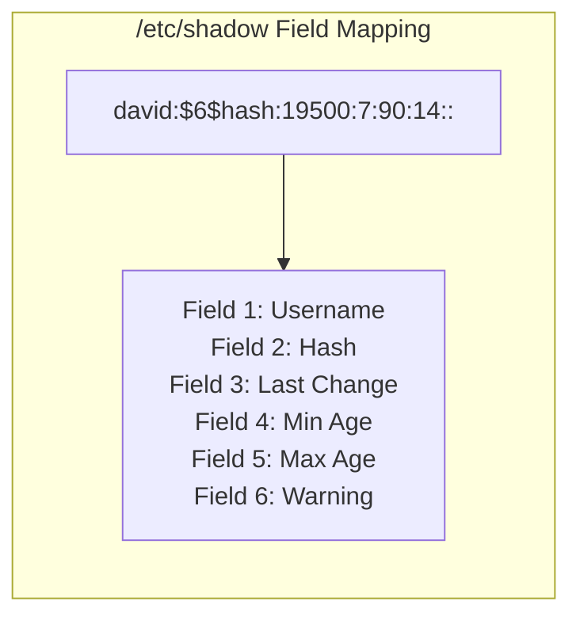
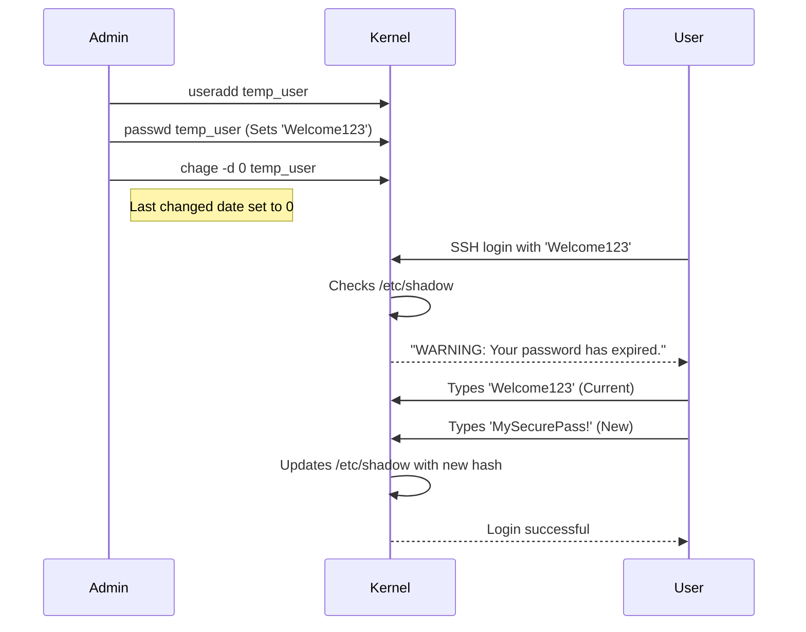

# CHAPTER 24 — PASSWORD MANAGEMENT AND AGING

---

## 1. Introduction

### Why This Topic Exists
A compromised password is the most common vector for system breaches. To mitigate this, enterprise environments enforce strict password policies. Users are required to change their passwords every 90 days, are prevented from changing them back immediately, and are warned before their passwords expire. In Linux, these policies — known as Password Aging — are managed through the `/etc/shadow` file and the `chage` command.

### Why Linux Administrators Use It
When a new employee is hired, the administrator creates an account with a temporary password (like `Welcome123`). To secure the account, the admin forces the password to expire immediately. When the employee logs in for the first time, the system halts the login process and forces them to choose a new, private password.

### Why Companies Care About It
Compliance frameworks (PCI-DSS, NIST 800-53, ISO 27001) legally mandate password lifecycle management. If an auditor discovers that a database administrator's password hasn't been changed in 3 years, or that users aren't locked out after password expiration, the company will fail the audit, potentially facing heavy fines.

---

## 2. Learning Objectives

By the end of this chapter, you will be able to:
- Understand the structure and encryption of the `/etc/shadow` file.
- View a user's password aging information (`chage -l`).
- Force a user to change their password on next login (`chage -d 0`).
- Configure maximum and minimum password age limits.
- Lock and unlock user accounts (`passwd -l`).
- Understand how `/etc/login.defs` sets system-wide default aging policies.

---

## 3. Beginner-Friendly Explanation

Think of Password Aging like a corporate ID badge:
- **Max Age (90 days):** Your badge expires every 90 days. You must go to security and get a new one, or you can't enter the building.
- **Min Age (7 days):** You can't get a new badge every single day just to cycle back to your favourite old badge. You must keep the current badge for at least 7 days.
- **Warning (7 days):** A week before your badge expires, the security turnstile starts beeping and telling you: "Your badge expires in X days, please renew it."
- **Inactivity (14 days):** If your badge expires, you have a 14-day grace period to renew it. After that, your account is permanently locked, and HR has to intervene.

---

## 4. Core Theory

### 4.1 The `/etc/shadow` File
The `/etc/shadow` file stores password hashes and aging metadata. It is strictly readable only by `root` (permissions `000` or `400`).
Format: `sachin:$6$xyz...:19500:7:90:7:14:19600:`

1. **Username:** `sachin`
2. **Password Hash:** Begins with `$6$` (SHA-512). A `!` or `*` here means the account is locked.
3. **Last Changed:** Days since Jan 1, 1970 (Epoch).
4. **Minimum Age:** Minimum days before password can be changed again.
5. **Maximum Age:** Maximum days the password is valid.
6. **Warning Period:** Days before expiration that the user is warned.
7. **Inactivity Period:** Grace period after expiration before the account locks.
8. **Account Expiration:** Absolute date (days since Epoch) the account is disabled.

### 4.2 The `chage` Command
The `chage` (Change Age) command allows administrators to modify the aging fields in `/etc/shadow` using human-readable dates rather than calculating "Days since 1970".

### 4.3 The `passwd` Command
Used primarily by users to change their own password, and by admins to set initial passwords, lock accounts (`-l`), or check status (`-S`).

### 4.4 Default Policies (`/etc/login.defs`)
When you run `useradd`, how does the system know to set the Max Age to 90 days instead of 99999? It reads the default settings from `/etc/login.defs`. Modifying this file changes the default policy for all *future* users created.

---

## 5. Internal Working

### Hashing vs Encryption
Linux does not encrypt passwords; it hashes them. Encryption is a two-way street (you can decrypt it if you have the key). Hashing is a one-way street. 
When you type a password at login:
1. The kernel takes your plaintext password.
2. It combines it with the "Salt" (random characters stored in `/etc/shadow` alongside the hash).
3. It runs it through the hashing algorithm (usually SHA-512).
4. It compares the resulting hash to the hash stored in `/etc/shadow`.
5. If they match exactly, you are authenticated. The kernel never knows your actual plaintext password.

---

## 6. Production Architecture



---

## 7. Command-by-Command Explanation

### 7.1 `chage -l sachin`
- **Purpose:** Lists all password aging information for the user in a readable format.

### 7.2 `chage -d 0 sachin`
- **Purpose:** Sets the "Last Password Change" date to `0`. This forces the user to change their password immediately upon their next login.

### 7.3 `chage -E 2026-12-31 contractor`
- **Purpose:** Sets an absolute Account Expiration date. On Jan 1, 2027, the account will be locked, regardless of password age. Crucial for temporary contractors.

### 7.4 `passwd -l sachin`
- **Purpose:** Locks the password. Prepends a `!` to the hash in `/etc/shadow`. The user cannot log in using a password. (Note: SSH Key login may still work depending on configuration).

### 7.5 `passwd -u sachin`
- **Purpose:** Unlocks the password.

---

## 8. Syntax Breakdown

```bash
sudo chage -M 90 -m 7 -W 14 sachin
│    │     │      │     │      │
│    │     │      │     │      └── Target User
│    │     │      │     └───────── Warning period (14 days before expiry)
│    │     │      └─────────────── Minimum age (must keep for 7 days)
│    │     └────────────────────── Maximum age (expires in 90 days)
│    └──────────────────────────── Command: Change password aging
└───────────────────────────────── Superuser privilege
```

---

## 9. Parameter Explanation

| Command | Parameter | Description |
|:---|:---|:---|
| `chage` | `-l` | List aging information |
| `chage` | `-m` | Set minimum password age (days) |
| `chage` | `-M` | Set maximum password age (days) |
| `chage` | `-W` | Set warning period (days) |
| `chage` | `-I` | Set inactivity period after expiration (days) |
| `chage` | `-d 0` | Force password change on next login |
| `chage` | `-E` | Set account expiration date (`YYYY-MM-DD`) |

---

## 10. Sample Output Analysis

**Scenario:** We check a new user's aging policy.
**Command:** `chage -l david`

**Output:**
```text
Last password change                                    : Jul 26, 2026
Password expires                                        : Oct 24, 2026
Password inactive                                       : never
Account expires                                         : never
Minimum number of days between password change          : 7
Maximum number of days between password change          : 90
Number of days of warning before password expires       : 14
```

**Analysis:**
- The password was set today (Jul 26).
- Due to the 90-day `PASS_MAX_DAYS` setting in `/etc/login.defs`, it expires on Oct 24.
- On Oct 10 (14 days prior), David will receive terminal warnings on login.
- He cannot change the password again until Aug 2 (Minimum age 7 days) to prevent him from rapidly cycling through passwords to reuse an old one.

---

## 11. Architecture Diagram



---

## 12. Workflow Diagram



---

## 13. Real Production Examples

### Onboarding Procedure
Every enterprise has an automated onboarding script. A portion of that script always forces a password change.
```bash
# Create user
useradd -c "New Employee" jdoe
# Generate random password
echo "TempP@ssw0rd!" | passwd --stdin jdoe
# Force change on next login
chage -d 0 jdoe
```

### Contractor Expiration
A 3rd-party vendor needs access to the server for exactly two weeks to install software. If the admin forgets to delete the account after two weeks, it becomes a security risk.
```bash
# The account automatically locks itself on August 10th
chage -E 2026-08-10 vendor_account
```

### Bypassing Aging for Service Accounts
Service accounts (like `oracle` or `mysql`) do not represent humans. Their passwords should never expire, otherwise the automated application will suddenly crash on day 91.
```bash
# Disable maximum age (set to 99999 days)
chage -M 99999 mysql
```

---

## 14. Common Mistakes

1. **Locking an account with `passwd -l` but leaving SSH keys active** — `passwd -l` only disables password-based logins. If the user has an SSH public key in `~/.ssh/authorized_keys`, they can still log in. To truly lock an account, use `usermod -e 1 username` (expire the account) or change their shell to `/sbin/nologin`.
2. **Editing `/etc/shadow` manually** — Never edit this file with `vim`. A misplaced colon will corrupt the authentication system. Always use `chage` or `usermod`.
3. **Forgetting Minimum Age** — If you force 90-day expirations but set Minimum Age to 0, users will write a script to change their password 5 times in one minute, cycling through the password history until they can reuse their old, favourite password.

---

## 15. Best Practices

- Always use `chage -d 0` when setting initial passwords for new users.
- Configure `/etc/login.defs` globally so you don't have to manually apply `chage` limits to every new user.
- Disable password expiration for non-human service accounts.
- Combine Password Aging with Password Complexity (managed via PAM, e.g., `pam_pwquality`) to ensure users choose strong, unguessable passwords.

---

## 16. Security Considerations

- **Hash Algorithms:** Modern Linux uses SHA-512 (indicated by `$6$` in the hash string). Older systems used MD5 (`$1$`), which is highly vulnerable to brute-force and rainbow table attacks. Ensure your system defaults to SHA-512 (or YESCRYPT on newer distros).
- **Audit Requirement:** Regulators (PCI-DSS) strictly check the `/etc/login.defs` file to ensure `PASS_MAX_DAYS` is set to 90 or less.

---

## 17. Performance Considerations

- Hashing algorithms are intentionally designed to be computationally expensive (slow) to defend against brute-force attacks. However, this only impacts the CPU for a fraction of a second during login. There is no ongoing performance impact.

---

## 18. Troubleshooting Guide

| Symptom | Root Cause | Resolution |
|:---|:---|:---|
| User cannot log in, password is correct | Account expired or locked | Admin checks `chage -l user`. If expired, unlock/reset. |
| User forced to change password, but new password rejected | Fails PAM complexity rules | User must choose a longer password with symbols/numbers. |
| Admin runs `passwd`, gets "Authentication token manipulation error" | `/etc/shadow` is immutable or filesystem is read-only | Check `lsattr /etc/shadow` for the `i` flag. |

---

## 19. Practical Labs

**Lab 24.1:** Viewing Defaults
```bash
cat /etc/login.defs | grep PASS
# Observe the default MAX, MIN, and WARN values
```

**Lab 24.2:** Password Expiration
```bash
sudo useradd chage_test
sudo passwd chage_test
sudo chage -l chage_test
sudo chage -d 0 chage_test
sudo chage -l chage_test
# Note the "Password must be changed" status.
```

**Lab 24.3:** Absolute Expiration
```bash
sudo chage -E "2026-12-31" chage_test
sudo chage -l chage_test
```

---

## 20. Mini Project

Implement a strict corporate password policy on a test account.
1. Create a user `finance_temp`.
2. Set their maximum password age to 30 days (`-M 30`).
3. Set a minimum age of 3 days (`-m 3`).
4. Set a warning period of 7 days (`-W 7`).
5. Ensure their account completely expires exactly 30 days from today (`-E YYYY-MM-DD`).
6. Verify all constraints using `chage -l finance_temp`.

---

## 21. Assignments

1. Explain the difference between Account Expiration (`-E`) and Password Expiration (`-M`).
2. Why is it important to set a Minimum Password Age (`-m`)?
3. Which file contains the system-wide default values for password aging?

---

## 22. Interview Questions

### Basic
1. **Q: How do you force a user to change their password the next time they log in?**
   A: Use the command `chage -d 0 username`.

2. **Q: Which file stores the actual encrypted passwords?**
   A: `/etc/shadow`.

### Intermediate
3. **Q: A contractor is hired for a 3-month project. How do you ensure their access is automatically revoked when the project ends, even if you forget to delete the account?**
   A: I would set an Account Expiration date using `chage -E YYYY-MM-DD username`. On that date, the account is completely locked.

4. **Q: You run `cat /etc/shadow` and see a `!` at the beginning of the second field (the password field) for a user. What does this mean?**
   A: It means the account is locked. The `!` invalidates the hash, so no typed password will ever mathematically match the string, preventing password-based login.

### Scenario-Based
5. **Q: A user's password expired on Friday. They were on vacation and returned on Wednesday. When they try to log in, instead of being prompted to change their password, they are completely locked out. Why did this happen?**
   A: This is due to the Password Inactivity period (the 7th field in `/etc/shadow`, configured via `chage -I`). If the inactivity period is set to a short duration (e.g., 3 days), the user has a 3-day grace period after expiration to log in and change their password. Because they waited 5 days, the grace period expired, and the account became permanently locked requiring administrator intervention.

---

## 23. Chapter Summary and Quick Revision Notes

- Password hashes and aging data are stored in `/etc/shadow`.
- Global defaults for new users are set in `/etc/login.defs`.
- `chage` is the primary tool for managing password lifecycles.
- `chage -d 0` forces a password change on next login.
- Max Age (`-M`): When the password expires.
- Min Age (`-m`): Prevents rapid password cycling.
- Expiry (`-E`): Absolute date the account is disabled.

---

## 24. Cheat Sheet

| Command | Purpose |
|:---|:---|
| `chage -l user` | View aging properties |
| `chage -d 0 user` | Force change on next login |
| `chage -M 90 user` | Set max password age (90 days) |
| `chage -m 7 user` | Set min password age (7 days) |
| `chage -W 14 user`| Set warning period (14 days) |
| `chage -E 2026-12-31 user`| Set absolute account expiry date |
| `passwd -l user` | Lock user password |
| `passwd -u user` | Unlock user password |
