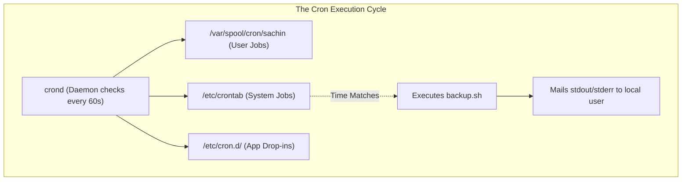
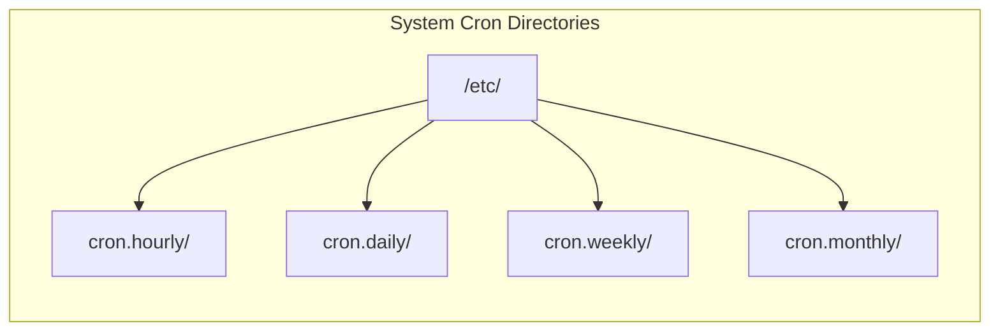
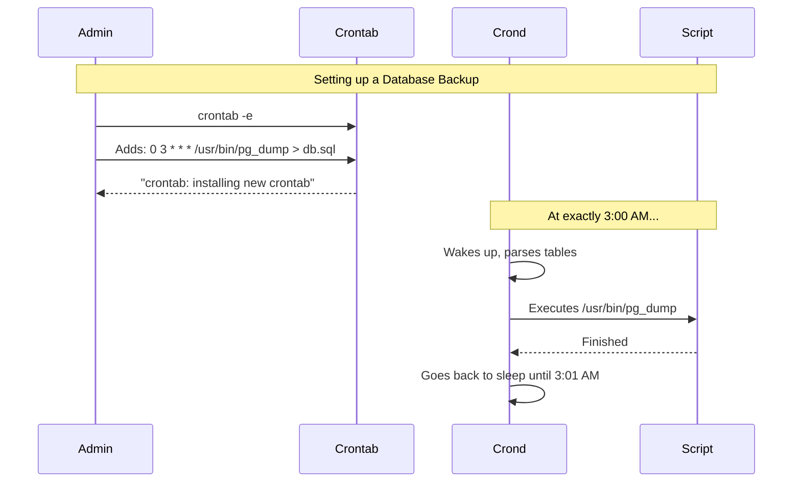

# CHAPTER 31 — TASK SCHEDULING (CRON AND AT)

---

## 1. Introduction

### Why This Topic Exists
System administration is largely about automation. If a database needs to be backed up every night at 2:00 AM, the administrator is not going to wake up at 2:00 AM to type the backup command manually. Linux includes built-in scheduling daemons—`crond` (for recurring tasks) and `atd` (for one-off tasks)—that execute scripts silently in the background at precisely the requested time.

### Why Linux Administrators Use It
Administrators use `cron` to automate everything: rotating log files so disks don't fill up, syncing data to offsite disaster recovery servers using `rsync`, running database integrity checks, and checking SSL certificate expiration dates. It is the heartbeat of server automation.

### Why Companies Care About It
Operational Reliability. If a critical daily financial report is generated by a human running a script, that human might get sick, go on holiday, or simply forget. By scheduling it in `cron`, the company guarantees the report will be generated and emailed to the executives at exactly 6:00 AM, 365 days a year, with zero human intervention.

---

## 2. Learning Objectives

By the end of this chapter, you will be able to:
- Understand the difference between `cron` (recurring) and `at` (one-off).
- Read and write the 5-field `cron` time syntax.
- Edit a user's crontab using `crontab -e`.
- Configure system-wide cron jobs in `/etc/crontab` and `/etc/cron.d/`.
- Schedule one-off jobs using the `at` command.
- Capture the output and errors of scheduled jobs.

---

## 3. Beginner-Friendly Explanation

Think of task scheduling like setting alarms on your phone:
- **`at` (The One-Off Alarm):** "Remind me to take the pizza out of the oven in 15 minutes." The alarm goes off once, and then it deletes itself. You never hear it again.
- **`cron` (The Recurring Alarm):** "Wake me up every Monday through Friday at 7:00 AM." This alarm is permanent. It will trigger every single week until you manually delete the alarm.

In Linux, instead of playing a ringtone, the alarm executes a bash script.

---

## 4. Core Theory

### 4.1 The `cron` Daemon
The `crond` service runs continuously in the background. Once every minute, it wakes up, checks all the `crontab` (Cron Table) files on the system, and checks if any scripts are scheduled to run at that exact minute. If there is a match, it spawns a subshell, executes the script, and goes back to sleep.

### 4.2 User Crontabs vs System Crontabs
- **User Crontabs:** Every user (including root) can have their own private crontab. Managed by typing `crontab -e`. The jobs run with the privileges of that specific user.
- **System Crontabs:** Located in `/etc/crontab` and `/etc/cron.d/`. These are managed by root and contain an extra field that specifies *which* user the script should run as. Used for system-wide tasks (like log rotation).

### 4.3 The 5-Field Cron Syntax
A standard user cron entry consists of 5 time fields followed by the command to execute:
```text
* * * * * command_to_execute
│ │ │ │ │
│ │ │ │ └── Day of Week (0 - 7) (0 and 7 = Sunday)
│ │ │ └──── Month (1 - 12)
│ │ └────── Day of Month (1 - 31)
│ └──────── Hour (0 - 23)
└────────── Minute (0 - 59)
```
- An asterisk (`*`) means "every". (e.g., `*` in the Hour field means "every hour").

### 4.4 The `at` Command
The `at` command queues a job for a specific time in the future. Once the job runs, it is removed from the queue. It is excellent for deferred execution (e.g., "Reboot the server tonight at 11:00 PM").

---

## 5. Internal Working

### The Environment Variable Trap
When `cron` executes a script, it **does not** load the user's `~/.bash_profile` or `~/.bashrc`. It runs in a severely restricted, non-interactive shell.
The default `$PATH` for a cron job is usually just `/usr/bin:/bin`. 
If your script relies on Java or a custom Python installation in `/opt/`, the script will run perfectly when you test it manually, but will fail with "command not found" when `cron` runs it. 
*Solution:* Always use **absolute paths** inside cron scripts (e.g., `/opt/java/bin/java -jar app.jar`).

---

## 6. Production Architecture



---

## 7. Command-by-Command Explanation

### 7.1 `crontab -e`
- **Purpose:** Opens the current user's crontab in the default text editor (usually `vi`). Saves the file safely to `/var/spool/cron/<user>` upon exit.

### 7.2 `crontab -l`
- **Purpose:** Lists the contents of the current user's crontab without editing it.

### 7.3 `at 23:00`
- **Purpose:** Opens an interactive prompt where you type the commands to execute at 11:00 PM. Press `Ctrl+D` to save and exit.

### 7.4 `atq`
- **Purpose:** Lists the pending (queued) jobs scheduled via `at`.

### 7.5 `atrm 3`
- **Purpose:** Removes job number 3 from the `at` queue so it will not execute.

---

## 8. Syntax Breakdown

```bash
0 2 * * 1-5 /opt/scripts/backup.sh > /var/log/backup.log 2>&1
│ │ │ │  │  │                        │
│ │ │ │  │  │                        └── Redirect all output to a log file
│ │ │ │  │  └─────────────────────────── Absolute path to the script
│ │ │ │  └────────────────────────────── Days: Monday through Friday
│ │ │ └───────────────────────────────── Month: Every month
│ │ └─────────────────────────────────── Day: Every day
│ └───────────────────────────────────── Hour: 2 AM
└─────────────────────────────────────── Minute: 0
```
*(Translation: Run the backup script at exactly 2:00 AM, Monday through Friday, every week of every month).*

---

## 9. Parameter Explanation

### Cron Time Operators
| Operator | Example | Description |
|:---|:---|:---|
| `*` (Asterisk) | `* * * * *` | Every single value (Every minute of every day) |
| `,` (Comma) | `0 8,17 * * *` | Specific list (8 AM and 5 PM) |
| `-` (Hyphen) | `0 9-17 * * 1-5` | Range (9 AM through 5 PM, Mon-Fri) |
| `/` (Slash) | `*/15 * * * *` | Step / Interval (Every 15 minutes) |

### Cron Shortcuts (Macros)
Modern cron allows you to replace the 5 numbers with readable macros:
- `@reboot` : Run exactly once when the server boots up.
- `@daily`  : Run at midnight every day (`0 0 * * *`).
- `@hourly` : Run at the top of every hour (`0 * * * *`).

---

## 10. Sample Output Analysis

**Scenario:** We want to view our scheduled `at` jobs.
**Command:** `atq`

**Output:**
```text
3       Tue Jul 27 02:00:00 2026 a root
4       Wed Jul 28 09:15:00 2026 a sachin
```

**Analysis:**
- **Job 3:** Scheduled for tomorrow at 2:00 AM, owned by `root`.
- **Job 4:** Scheduled for the day after tomorrow at 9:15 AM, owned by `sachin`.
- If root realizes Job 3 is a mistake, they can cancel it by running `atrm 3`.

---

## 11. Architecture Diagram


*Note: If you drop a script into `/etc/cron.daily/`, you do not need to write cron syntax. The OS automatically executes everything in that folder once a day.*

---

## 12. Workflow Diagram



---

## 13. Real Production Examples

### The Automatic Service Restart
Sometimes a legacy application has a memory leak and crashes every few days. The vendor is fixing it, but in the meantime, the admin forces a restart every Sunday at 3:00 AM to clear the memory.
```bash
sudo crontab -e
# Add the following line:
0 3 * * 0 /usr/bin/systemctl restart legacy_app
```

### Server Reboot Scheduling
A Senior Admin tells you to patch a server and reboot it. However, the maintenance window is at 2:00 AM. You don't want to wake up at 2:00 AM just to type `reboot`.
```bash
sudo at 02:00 tomorrow
warning: commands will be executed using /bin/sh
at> dnf update -y
at> reboot
at> <EOT>  # (Press Ctrl+D here)
job 5 at Tue Jul 27 02:00:00 2026
```

---

## 14. Common Mistakes

1. **Assuming `$PATH` exists** — An admin writes a script using `mysql ...` and it works in terminal. They put it in cron, and it fails. Cron doesn't know where `mysql` is. Always use `/usr/bin/mysql` in cron scripts.
2. **Missing Redirections (`>`)** — If a cron job generates output (like `echo "Backup done"`), cron attempts to email that output to the local user using the local MTA (Mail Transfer Agent). If no mail server is configured, the output is discarded and lost forever. Always redirect output to a log file: `>> /var/log/myjob.log 2>&1`.
3. **Using `%` in Crontab** — The `%` symbol is a special newline delimiter in cron syntax. If you try to use the date command like `date +%Y-%m-%d` directly inside the crontab file, it will crash the job. You must escape it (`\%`) or simply put the `date` command inside a bash script and call the script from cron.

---

## 15. Best Practices

- Always write your logic in a `.sh` bash script, test the script manually, and then configure `cron` to execute the `.sh` file. Do not write complex multi-line bash commands directly in the crontab file.
- Add `MAILTO="your.email@company.com"` at the top of your `crontab` file (if the server has SMTP configured) so that if a script errors out, the error is emailed directly to you.
- Use `crontab -l` to verify your syntax before closing the terminal.

---

## 16. Security Considerations

- **`/etc/cron.deny` and `/etc/cron.allow`:** By default, any user can create a cron job. If an attacker gains a low-level shell, they can use cron to establish persistence (e.g., spawn a reverse shell every 5 minutes). Administrators can restrict cron usage by placing usernames in `/etc/cron.deny`.

---

## 17. Performance Considerations

- **The "Thundering Herd" Problem:** If you configure 50 servers to run a massive database extraction at `0 0 * * *` (Midnight), all 50 servers will slam the database at the exact same millisecond, potentially taking down the entire network. Add jitter/randomness, or stagger the times (Server A at `0 0`, Server B at `5 0`, Server C at `10 0`).

---

## 18. Troubleshooting Guide

| Symptom | Root Cause | Resolution |
|:---|:---|:---|
| Cron job didn't run | Service is stopped | Check `systemctl status crond` |
| Job runs but fails | Missing PATH or Environment variables | Explicitly source profiles or use absolute paths inside the script |
| `crontab: command not found` | Cron package isn't installed | Run `sudo dnf install cronie` or `apt install cron` |
| Job runs at wrong time | Server timezone is wrong | Run `timedatectl` to check the server's time |

---

## 19. Practical Labs

**Lab 31.1:** Writing a cron job
1. Type `crontab -e`.
2. Add a job that runs every minute, appending the current date to a file:
   `* * * * * /usr/bin/date >> /tmp/cron_test.log`
3. Save and exit.
4. Wait 2 minutes.
5. Run `cat /tmp/cron_test.log`. You should see two timestamps.
6. Run `crontab -e` and delete the line so it doesn't run forever.

**Lab 31.2:** Queueing an `at` job
1. Type `at now + 2 minutes`.
2. Type `touch /tmp/at_test_file.txt`.
3. Press `Ctrl+D`.
4. Run `atq` to see the job queued.
5. Wait 2 minutes, then check if `/tmp/at_test_file.txt` exists.

---

## 20. Mini Project

Create a system health monitor.
1. Write a script `/opt/health.sh`:
   ```bash
   #!/bin/bash
   echo "--- $(date) ---" >> /var/log/health.log
   /usr/bin/uptime >> /var/log/health.log
   /usr/bin/df -h / >> /var/log/health.log
   ```
2. Make it executable: `sudo chmod +x /opt/health.sh`
3. Schedule it globally to run every 15 minutes.
   `sudo vim /etc/crontab`
   Add line: `*/15 * * * * root /opt/health.sh`
4. The system will now automatically log its CPU load and Disk space every 15 minutes, permanently.

---

## 21. Assignments

1. Translate this cron schedule into plain English: `0 12 * * 1,5`.
2. Why is it dangerous to write a cron job using relative paths (e.g., `python script.py`)?
3. How do you list the currently queued `at` jobs, and how do you delete one?

---

## 22. Interview Questions

### Basic
1. **Q: How do you edit the crontab for the user you are currently logged in as?**
   A: Use the `crontab -e` command.

2. **Q: What is the cron syntax to run a job at 5:30 AM every day?**
   A: `30 5 * * * /path/to/script`

### Intermediate
3. **Q: You have a script that runs fine from your terminal. You add it to cron, but it fails silently. You check the script, and it contains the line `cp file.txt ~/backup/`. What is the problem?**
   A: Cron runs in a non-interactive shell with a minimal environment. It might not resolve `~/` correctly for the intended user, and `cp` might not be in the minimal `$PATH`. Furthermore, `file.txt` is a relative path. The script must be updated to use absolute paths: `/usr/bin/cp /full/path/file.txt /full/path/backup/`.

4. **Q: What is the difference between `/etc/crontab` and the user crontab edited via `crontab -e`?**
   A: `/etc/crontab` is a system-wide file managed by root. It contains an extra (6th) field that specifies which user account the job should execute as. `crontab -e` manages a specific user's private cron file (stored in `/var/spool/cron/`), does not have the user field, and executes exclusively as the user who owns it.

### Scenario-Based
5. **Q: A Junior Admin scheduled a massive log archiving script to run using `* * * * * /opt/archive.sh`. Two hours later, the server crashes due to 100% CPU and RAM exhaustion. What did the Junior Admin do wrong?**
   A: The syntax `* * * * *` means the script runs *every single minute*. If the archiving script takes 5 minutes to complete, cron will start the second instance before the first one finishes. By minute 10, there are 10 heavy archiving processes running simultaneously, eventually crashing the server (a race condition / resource exhaustion). They should have used a lock file in the script, or scheduled it less frequently (e.g., `0 2 * * *` for once a day).

---

## 23. Chapter Summary and Quick Revision Notes

- `crond` executes recurring jobs. `atd` executes one-off deferred jobs.
- Cron syntax: `Minute Hour DayOfMonth Month DayOfWeek Command`
- **`*`** = every. **`*/5`** = every 5th. **`1-5`** = range. **`1,5`** = list.
- `crontab -e` edits your user file. `crontab -l` lists it.
- Cron has a minimal environment. Always use **Absolute Paths**.
- Redirect output (`> /path/to/log.txt 2>&1`) to avoid losing errors.

---

## 24. Cheat Sheet

| Time Syntax | Plain English |
|:---|:---|
| `* * * * *` | Every minute |
| `0 * * * *` | Every hour, on the hour |
| `30 14 * * *` | Every day at 2:30 PM |
| `0 0 * * 0` | Every Sunday at Midnight |
| `0 9-17 * * 1-5` | Every hour from 9 AM to 5 PM, Mon-Fri |
| `*/15 * * * *` | Every 15 minutes |
| `@reboot` | Run once on server startup |
