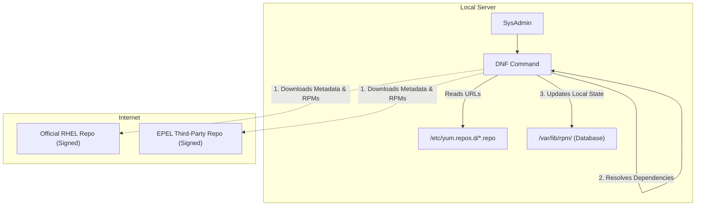
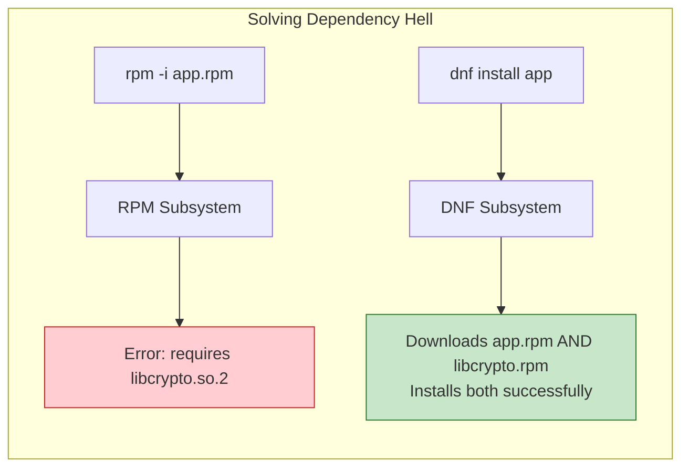
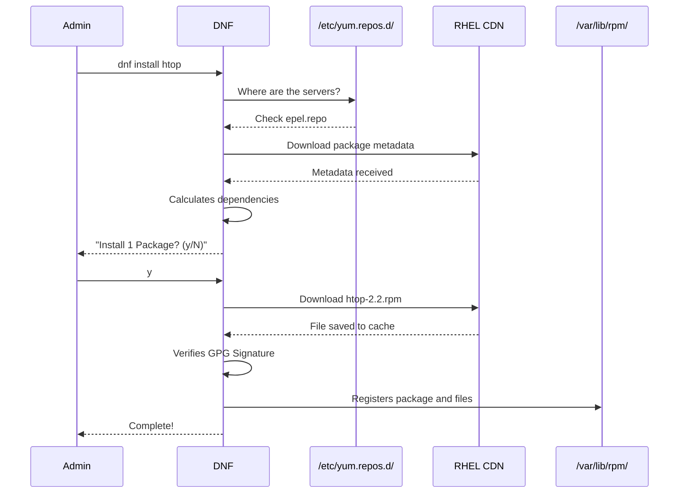

# CHAPTER 32 — PACKAGE MANAGEMENT: RPM AND DNF (RED HAT ECOSYSTEM)

---

## 1. Introduction

### Why This Topic Exists
When you want to install a web server on Windows, you download an `.exe` file, double-click it, and click "Next" until it finishes. On Linux, software is distributed as "Packages" (compressed archives containing the binaries, configuration files, and installation instructions). The Red Hat ecosystem (RHEL, CentOS, Rocky, Fedora) uses the **RPM** (Red Hat Package Manager) format. However, complex software rarely works alone; it requires other software to function (dependencies). Tools like **DNF** (Dandified YUM) exist to automatically find, download, and install those dependencies so the administrator doesn't have to do it manually.

### Why Linux Administrators Use It
System administrators use `dnf` every single day to install applications, apply critical security patches, and upgrade the operating system. They use `rpm` to inspect specific files, verify digital signatures (to ensure the software hasn't been tampered with), and query the local database to find out which package a particular file belongs to.

### Why Companies Care About It
Vulnerability Management. When a critical security flaw (like Heartbleed or Log4Shell) is announced, companies have hours, not days, to patch thousands of servers. DNF allows administrators to automate the deployment of security patches across massive fleets of servers instantaneously, ensuring compliance and preventing data breaches.

---

## 2. Learning Objectives

By the end of this chapter, you will be able to:
- Understand the difference between a low-level package manager (`rpm`) and a high-level package manager (`dnf`).
- Install, update, and remove software using `dnf`.
- Manage software repositories (`/etc/yum.repos.d/`).
- Query the local RPM database to find installed packages and their files.
- Understand dependency resolution and RPM GPG Keys.

---

## 3. Beginner-Friendly Explanation

Think of building a car from a kit:
- **RPM:** This is your wrench. You can use it to bolt a steering wheel to the dashboard. But if the steering wheel requires a specific steering column, and you don't have it, RPM simply throws an error and stops. It won't go to the store to buy the missing part for you.
- **DNF / YUM:** This is a Master Mechanic. You tell the mechanic, "Install the steering wheel." The mechanic sees that it requires a steering column, a specific set of bolts, and a mounting bracket. The mechanic automatically drives to the store (The Repository), buys all the missing parts (Dependencies), and installs them in the correct order.

---

## 4. Core Theory

### 4.1 RPM (Red Hat Package Manager)
RPM is the low-level tool. It directly manipulates `.rpm` files.
- It installs, erases, and queries packages.
- It maintains a local database (`/var/lib/rpm/`) of everything installed on the system.
- **Limitation:** It does *not* resolve dependencies over the network. If Package A needs Package B, `rpm -i PackageA.rpm` will simply fail with a "Failed dependencies" error.

### 4.2 YUM and DNF
YUM (Yellowdog Updater, Modified) was the standard high-level package manager for RHEL 5, 6, and 7.
DNF (Dandified YUM) is the modern, faster, memory-efficient replacement used in RHEL 8, 9, and Fedora. (In RHEL 8/9, typing `yum` simply redirects to `dnf`).
- DNF reads repository configuration files to know where to find software on the internet.
- It downloads the package, calculates the entire dependency tree, downloads all the required dependencies, and then uses RPM in the background to install them all in the correct order.

### 4.3 Repositories
A repository (repo) is a web server hosting thousands of `.rpm` files and a metadata index.
The configuration files telling DNF where to look are stored in `/etc/yum.repos.d/`. Each file ends in `.repo`.

### 4.4 GPG Signatures
To prevent Man-in-the-Middle attacks where a hacker intercepts your download and injects malware, all official RPM packages are digitally signed. Before installing, DNF checks the cryptographic signature using public GPG keys stored in `/etc/pki/rpm-gpg/`. If the signature doesn't match, DNF aborts the installation.

---

## 5. Internal Working

### The DNF Transaction
When you run `dnf install httpd`:
1. DNF downloads the latest metadata from the URLs in `/etc/yum.repos.d/`.
2. It searches the metadata for `httpd`.
3. It builds a dependency tree (e.g., `httpd` needs `httpd-tools`, which needs `apr-util`).
4. It compares the tree against the local RPM database to see what is already installed.
5. It presents a summary to the user and asks for confirmation (Y/n).
6. It downloads the missing `.rpm` files to a cache in `/var/cache/dnf/`.
7. It verifies the GPG signatures.
8. It hands the files to the RPM subsystem to execute the installation transaction.

---

## 6. Production Architecture



---

## 7. Command-by-Command Explanation

### 7.1 `dnf install httpd`
- **Purpose:** Installs the Apache web server and all its required dependencies.

### 7.2 `dnf update` (or `dnf upgrade`)
- **Purpose:** Updates all currently installed packages on the system to their latest available versions.

### 7.3 `dnf remove httpd`
- **Purpose:** Uninstalls Apache.

### 7.4 `dnf search nginx`
- **Purpose:** Searches the repository metadata for any package containing the word "nginx".

### 7.5 `rpm -qa`
- **Purpose:** Queries the local database and prints a list of absolutely every package installed on the system.

### 7.6 `rpm -ql httpd`
- **Purpose:** Queries a specific package (`httpd`) and lists every single file that package placed on the hard drive.

---

## 8. Syntax Breakdown

```bash
rpm -ivh https://example.com/software-1.0.x86_64.rpm
│   │││  │
│   │││  └── The target package (can be a local file or a URL)
│   ││└───── Hash marks: Print a progress bar (#####)
│   │└────── Verbose: Print extra information during install
│   └─────── Install: Install the package
└─────────── Command: RPM
```

---

## 9. Parameter Explanation

### DNF Commands
| Command | Purpose |
|:---|:---|
| `dnf install <pkg>` | Install a package |
| `dnf reinstall <pkg>` | Fix a corrupted installation without removing it |
| `dnf remove <pkg>` | Uninstall a package |
| `dnf update` | Upgrade all system packages |
| `dnf info <pkg>` | Show detailed description and version info |
| `dnf clean all` | Delete downloaded caches to free disk space or fix sync errors |
| `dnf repolist` | List all active repositories |

### RPM Commands (Querying)
| Command | Purpose |
|:---|:---|
| `rpm -qa` | Query All installed packages |
| `rpm -q <pkg>` | Check if a specific package is installed |
| `rpm -qi <pkg>` | Query Info about an installed package |
| `rpm -ql <pkg>` | Query List of files belonging to an installed package |
| `rpm -qf /path/to/file` | Query File: Find out WHICH package installed this specific file |

---

## 10. Sample Output Analysis

**Scenario:** We want to know where a specific configuration file came from. We run `rpm -qf /etc/ssh/sshd_config`.

**Output:**
```text
openssh-server-8.7p1-29.el9_2.x86_64
```

**Analysis:**
- The file `/etc/ssh/sshd_config` is not just a random text file; the RPM database knows it belongs to the `openssh-server` package.
- `8.7p1` is the upstream software version.
- `29.el9_2` is the Red Hat specific build number for Enterprise Linux 9.
- `x86_64` indicates this package was compiled for 64-bit Intel/AMD processors (not ARM).

---

## 11. Architecture Diagram



---

## 12. Workflow Diagram



---

## 13. Real Production Examples

### Deploying the EPEL Repository
Many popular tools (like `htop` or `nginx` on older RHEL) are not included in the strict base Red Hat repositories. Administrators must install the EPEL (Extra Packages for Enterprise Linux) repository, maintained by the Fedora project.
```bash
# This downloads the epel.repo file into /etc/yum.repos.d/
sudo dnf install epel-release -y

# Now htop is available
sudo dnf install htop -y
```

### Forensic Investigation
A hacker modified the `/etc/passwd` file, but the admin isn't sure which other core system files might have been tampered with. The admin can ask RPM to verify the checksums of installed files against the database.
```bash
# Verifies the coreutils package. If any binary (like /bin/ls) was 
# replaced with malware, RPM will flag the checksum mismatch.
rpm -V coreutils
```

### Fixing Corrupted Caches
Sometimes a DNF update gets interrupted by a network drop, leaving the metadata cache corrupted. Subsequent `dnf` commands throw XML parsing errors.
```bash
# Wipe the corrupted cache completely
sudo dnf clean all
# Rebuild the cache from scratch
sudo dnf makecache
```

---

## 14. Common Mistakes

1. **Using `rpm -i` for complex software** — Downloading an RPM from the internet and running `rpm -i file.rpm` often results in a massive chain of dependency errors ("Dependency hell"). Always use `dnf install ./file.rpm` instead. DNF will read the local RPM file, determine what it needs, and download the missing pieces from the internet automatically.
2. **Ignoring GPG Warnings** — If DNF says "Package is not signed", installing it is a massive risk. It means the software did not come from the official vendor and could contain malware.
3. **Interrupting `dnf update`** — Pressing `Ctrl+C` or losing SSH connection in the middle of a kernel update can severely corrupt the RPM database or leave the system unbootable. Always use `tmux` for large updates.

---

## 15. Best Practices

- Always run `dnf update` on freshly provisioned servers before installing your applications to ensure you have the latest security patches.
- Use the `-y` flag (`dnf install httpd -y`) in automation scripts (like bash or Ansible) to automatically answer "yes" to the confirmation prompt; otherwise, the script will hang forever waiting for user input.
- Familiarize yourself with `rpm -qf /path/to/file`. It is the fastest way to figure out what package provides a specific missing library or configuration file.

---

## 16. Security Considerations

- **Vulnerability Scanning:** Tools like Nessus or Qualys scan Linux servers by SSHing in and running `rpm -qa`. They compare the list of installed versions against a database of known CVEs (Common Vulnerabilities and Exposures). Keeping your packages updated is the primary defense against exploits.

---

## 17. Performance Considerations

- The RPM database (`/var/lib/rpm/`) can become corrupted if the server crashes during an installation. If `dnf` hangs indefinitely, you may need to rebuild the RPM database using the `rpmdb --rebuilddb` command.

---

## 18. Troubleshooting Guide

| Symptom | Root Cause | Resolution |
|:---|:---|:---|
| `No match for argument` | Package not in repos | Check spelling, or install the EPEL repository |
| DNF commands hang forever | Corrupt cache or bad repo URL | Run `dnf clean all`. Check `/etc/yum.repos.d/` for unreachable custom repos. |
| `rpm -i` fails with dependencies | Normal RPM limitation | Use `dnf install ./file.rpm` instead |
| Warning: BAD signature | Compromised or unsigned package | Do not install. Verify the source of the RPM. |

---

## 19. Practical Labs

**Lab 32.1:** Installing and Querying
```bash
sudo dnf install tree -y
rpm -q tree             # Verify it's installed
rpm -qi tree            # Read the package description
rpm -ql tree            # See exactly where the 'tree' binary was placed
```

**Lab 32.2:** Reverse Lookup
```bash
# Find out what package provides the 'passwd' command
which passwd            # Outputs: /usr/bin/passwd
rpm -qf /usr/bin/passwd # Outputs: passwd-0.80-3...
```

**Lab 32.3:** Removal
```bash
sudo dnf remove tree -y
tree                    # Should return command not found
```

---

## 20. Mini Project

Map out a service dependency manually.
1. Run `dnf info nginx`. Read the description.
2. We want to know exactly what Nginx requires to run. Run `rpm -qR nginx` (Query Requires). Note the long list of libraries (`libc.so`, `libcrypto.so`).
3. Now find out what package provides one of those libraries. Run `dnf provides "libcrypto.so*"`.
4. The output will show that the `openssl-libs` package provides that file.
5. This exercise demonstrates exactly what logic DNF is executing in the background in a fraction of a second when you type `dnf install nginx`.

---

## 21. Assignments

1. What is the fundamental difference in capability between `rpm` and `dnf`?
2. What directory contains the configuration files telling DNF where to download software from?
3. What is the exact command to find out which installed package provided the `/etc/hosts` file?

---

## 22. Interview Questions

### Basic
1. **Q: How do you completely update a Red Hat / CentOS system?**
   A: Run `dnf update -y` (or `yum update -y` on older systems).

2. **Q: How do you list all installed packages on an RPM-based system?**
   A: `rpm -qa`

### Intermediate
3. **Q: You download a custom application file named `custom_app.rpm`. When you run `rpm -ivh custom_app.rpm`, it fails with 15 missing dependency errors. How do you install it successfully?**
   A: Instead of using `rpm`, I should use `dnf install ./custom_app.rpm`. DNF will read the local RPM file, determine its dependencies, reach out to the configured online repositories to download the missing dependencies, and install everything together in a single transaction.

4. **Q: A developer says their script is failing because the `libmysqlclient.so.18` file is missing. You don't know what package contains this file. How do you find out?**
   A: I would use the command `dnf provides "*libmysqlclient.so.18*"`. DNF will search the repository metadata and return the exact name of the package (e.g., `mysql-libs`) that needs to be installed.

### Scenario-Based
5. **Q: You run `dnf install httpd`, but it fails immediately with an error saying "Cannot retrieve metalink for repository: epel". What is the problem and how do you troubleshoot it?**
   A: The server is failing to download the repository index from the internet. The root cause is almost always network-related. I would troubleshoot by:
   1. Checking basic internet connectivity (`ping 8.8.8.8`).
   2. Checking DNS resolution (`ping google.com`). If DNS fails, DNF cannot resolve the repository URL.
   3. Checking if a corporate proxy is blocking the connection.
   4. If the network is fine, I would run `dnf clean all` to clear any corrupted local cache data and try again.

---

## 23. Chapter Summary and Quick Revision Notes

- **RPM:** Low-level package manager. Cannot resolve dependencies over the network.
- **DNF / YUM:** High-level package manager. Resolves dependencies and downloads files from repositories.
- **Repositories:** Configured in `/etc/yum.repos.d/*.repo`.
- **GPG Signatures:** Ensure package integrity and prevent malware injection.
- **Querying:** `rpm -qf` (query file), `rpm -qa` (query all), `rpm -ql` (query list).
- Always use `tmux` when running massive system updates (`dnf update`) to protect against SSH disconnections.

---

## 24. Cheat Sheet

| Command | Purpose |
|:---|:---|
| `dnf install pkg` | Install package and dependencies |
| `dnf update` | Upgrade entire OS |
| `dnf search keyword` | Search for a package by name |
| `dnf provides "*filename*"`| Find which package contains a specific file |
| `rpm -qa` | List all installed packages |
| `rpm -ql pkg` | List all files inside a package |
| `rpm -qf /path/to/file` | Find which package installed this file |
