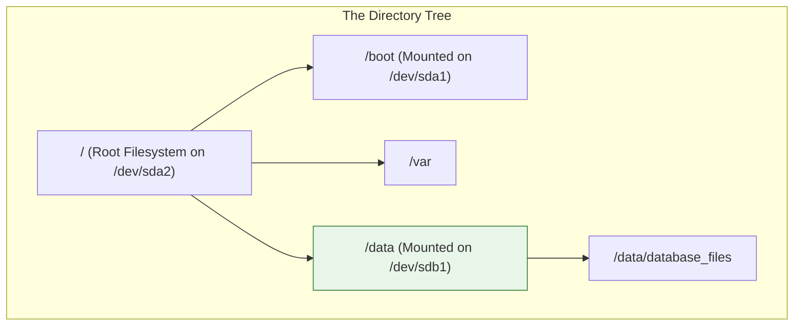
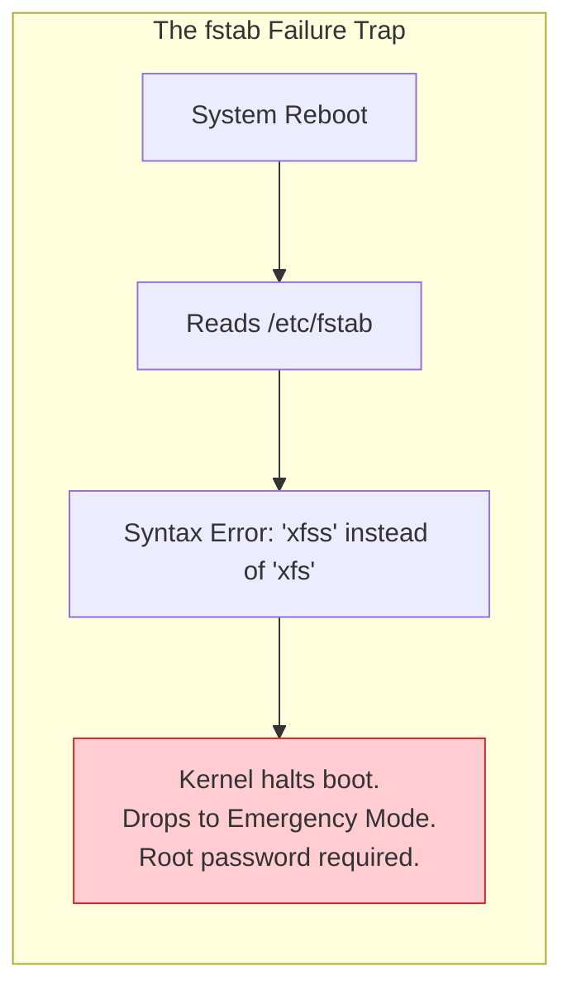
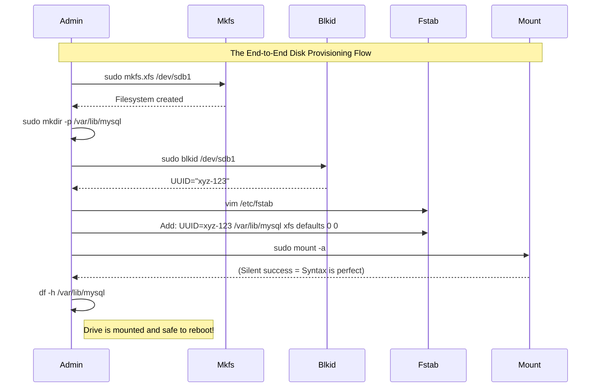

# CHAPTER 36 — FILESYSTEM CREATION AND MOUNTING

---

## 1. Introduction

### Why This Topic Exists
In the previous chapter, we partitioned a raw disk, drawing boundaries on the magnetic platter. However, Linux still cannot save a file like `document.txt` to it. The partition is just empty space. To store files, the partition must be formatted with a **Filesystem** (like ext4 or xfs), which creates the underlying data structures (Inodes and Superblocks) required to track files. Even after formatting, the drive is invisible until it is **Mounted**—attached to a specific folder in the Linux directory tree.

### Why Linux Administrators Use It
Windows automatically assigns a drive letter (`D:\`) when you plug in a USB stick. Linux does not do this on servers. An administrator must manually format the drive, create a directory (`/mnt/data`), and use the `mount` command to attach the drive to that directory. If they want the drive to survive a reboot, they must hardcode this configuration into a critical system file called `/etc/fstab`.

### Why Companies Care About It
Performance and Disaster Prevention. Different filesystems are optimized for different workloads. An administrator might format a database drive with `XFS` (optimized for massive files and fast recovery) while using `ext4` for the general OS. Furthermore, a single typo in the `/etc/fstab` file will cause a production server to crash during boot, entering "Emergency Mode" and causing complete downtime until manually fixed.

---

## 2. Learning Objectives

By the end of this chapter, you will be able to:
- Understand the differences between common Linux filesystems (`ext4`, `xfs`, `btrfs`).
- Format a partition with a filesystem using `mkfs`.
- Temporarily mount and unmount a filesystem using `mount` and `umount`.
- Find the UUID of a disk using `blkid`.
- Permanently mount a filesystem across reboots by editing `/etc/fstab`.
- Recover a system that failed to boot due to a bad `/etc/fstab` entry.

---

## 3. Beginner-Friendly Explanation

Think of a library:
- **The Partition:** An empty, newly built room in the library.
- **The Filesystem (`mkfs`):** Bringing in the empty bookshelves, labeling the aisles, and creating a blank index card catalog. You are preparing the room to hold books efficiently.
- **Mounting (`mount`):** Building a doorway that connects this new room to the rest of the library. Until you build the door, nobody can walk inside to put books on the shelves.
- **The `/etc/fstab` File:** The official architectural blueprint. If the library loses power (reboots), the construction crew reads this blueprint to remember exactly where the doorway is supposed to be rebuilt. If the blueprint is wrong, the library refuses to open.

---

## 4. Core Theory

### 4.1 Common Linux Filesystems
- **ext4 (Fourth Extended Filesystem):** The traditional, rock-solid standard for Ubuntu and older Linux distributions. Extremely reliable, supports max file sizes of 16TB.
- **xfs:** The default for modern Red Hat (RHEL 7/8/9). Designed by Silicon Graphics in the 90s, it excels at handling massive files, parallel I/O, and very fast crash recovery.
- **btrfs (B-Tree FS):** A next-generation filesystem (default on SUSE) that includes built-in snapshotting, compression, and RAID capabilities.

### 4.2 Formatting (`mkfs`)
The `mkfs` (Make Filesystem) command writes the filesystem metadata (the superblocks, the inode tables, the journal) onto the raw partition. **Warning:** This destroys all existing data on the partition.

### 4.3 The Mount Point
In Linux, there are no `C:\` or `D:\` drives. Everything stems from the single root directory `/`. To access a new hard drive (`/dev/sdb1`), you must create an empty folder (e.g., `/data`) and "mount" the drive there. Any files written inside `/data` are physically written to the second hard drive.

### 4.4 `/etc/fstab` (Filesystem Table)
The `mount` command is temporary; it forgets everything when the server reboots. To make a mount permanent, it must be added to `/etc/fstab`. 
Historically, admins used device names (like `/dev/sdb1`) in this file. However, if you add a new disk, the kernel might rename `/dev/sdb1` to `/dev/sdc1`, breaking the system. Today, admins use the **UUID** (Universally Unique Identifier)—a static, random string of characters permanently burned into the filesystem when `mkfs` is run.

---

## 5. Internal Working

### The Filesystem Journal
Modern filesystems (like ext4 and xfs) are "Journaling" filesystems.
If a server loses power while saving a large file, the filesystem could become corrupted. A journal acts like a scratchpad.
1. The filesystem writes its *intent* to save the file into the Journal.
2. It actually saves the file to the disk.
3. It crosses the entry off the Journal.
If power is lost at Step 2, upon reboot, the OS reads the Journal, sees an unfinished task, and cleanly rolls it back. This eliminates the need for 4-hour `fsck` (disk check) scans on every crash.

---

## 6. Production Architecture


*Because `/data` is an independent disk (`/dev/sdb1`), if the `/var` directory fills up 100% of the root disk, the database running in `/data` is entirely unaffected.*

---

## 7. Command-by-Command Explanation

### 7.1 `mkfs.xfs /dev/sdb1`
- **Purpose:** Formats the partition `/dev/sdb1` with the XFS filesystem. (Use `mkfs.ext4` for ext4).

### 7.2 `blkid`
- **Purpose:** Prints the Block ID attributes for all formatted partitions. This is how you find the UUID required for `/etc/fstab`.

### 7.3 `mount /dev/sdb1 /mnt/data`
- **Purpose:** Temporarily attaches the formatted partition to the empty directory `/mnt/data`.

### 7.4 `umount /mnt/data`
- **Purpose:** Safely detaches the filesystem. (Note the spelling: it is `umount`, not `unmount`).

### 7.5 `mount -a`
- **Purpose:** Reads the `/etc/fstab` file and attempts to mount every filesystem listed in it. Crucial for verifying that your fstab syntax is correct *before* you reboot.

---

## 8. Syntax Breakdown

**The `/etc/fstab` File**
Every line in `/etc/fstab` must have exactly 6 columns, separated by spaces or tabs:
```text
UUID=a1b2c3d4-5678 /data       xfs     defaults        0 0
│                  │           │       │               │ │
│                  │           │       │               │ └── Pass: (0=Skip fsck, 2=Check this drive)
│                  │           │       │               └──── Dump: (0=Don't backup, obsolete)
│                  │           │       └──────────────────── Options: (defaults = rw,suid,dev,exec,auto,nouser,async)
│                  │           └──────────────────────────── Type: The filesystem type
│                  └──────────────────────────────────────── Mount Point: The folder to attach to
└─────────────────────────────────────────────────────────── Device: The UUID (or /dev/sdb1)
```

---

## 9. Parameter Explanation

| Command | Parameter | Description |
|:---|:---|:---|
| `mkfs.ext4` | `-m 0` | By default, ext4 reserves 5% of the disk for root. `-m 0` changes this to 0%, freeing up space on non-OS data drives. |
| `mount` | `-o ro` | Mount the filesystem as Read-Only. (Great for forensics or protecting backups). |
| `mount` | `(no arguments)` | Prints a messy list of everything currently mounted on the system. |
| `umount`| `-l` (Lazy) | Unmounts the drive as soon as it is no longer busy (used if `umount` says "Device is busy"). |
| `df`    | `-h` | Disk Free: Shows mounted partitions, sizes, and available space in Human-readable format (GB/MB). |
| `du`    | `-sh /var/` | Disk Usage: Scans a specific folder and shows exactly how much space it is consuming. |

---

## 10. Sample Output Analysis

**Scenario:** We need to find the UUID of our new partition to add it to fstab.
**Command:** `blkid /dev/sdb1`

**Output:**
```text
/dev/sdb1: UUID="9f6d4d12-3a5c-4b99-8e21-0f1c2d3b4a56" BLOCK_SIZE="4096" TYPE="xfs" PARTUUID="1234abcd-01"
```

**Analysis:**
- **UUID:** `9f6d...` is the string we will copy into `/etc/fstab`.
- **TYPE:** `xfs`. This confirms the format was successful and tells us what to put in the 3rd column of fstab.
- **PARTUUID:** This is the UUID of the partition slot itself (GPT feature), distinct from the filesystem UUID. We usually ignore this and use the primary `UUID=`.

---

## 11. Architecture Diagram



---

## 12. Workflow Diagram



---

## 13. Real Production Examples

### Setting up an NFS Client
`/etc/fstab` isn't just for local hard drives; it is used to mount network drives (NAS) permanently.
```text
# Inside /etc/fstab
10.0.0.50:/exports/shared   /mnt/shared   nfs   defaults   0 0
```
*(If the network is down when the server boots, this will hang the boot sequence for 90 seconds while it tries to connect!)*

### The "No Exec" Security Mount
To increase security, an administrator creates a dedicated partition for `/tmp`. They want to prevent hackers from downloading and running malware in the `/tmp` folder. They modify `/etc/fstab` Options:
```text
UUID=xyz-123   /tmp   ext4   defaults,noexec,nosuid   0 0
```
Any script placed in `/tmp` will receive "Permission Denied" if someone tries to execute it, even if they have `chmod +x` permissions.

---

## 14. Common Mistakes

1. **Not running `mount -a`** — If you edit `/etc/fstab` and immediately reboot without running `mount -a` to test your work, and you made a typo, the server will crash on boot. Always run `mount -a`.
2. **Formatting the whole disk** — Running `mkfs.ext4 /dev/sdb` (without the '1') formats the raw disk without a partition table. While Linux will technically allow this and it will work, it is terrible practice and breaks many disk management tools. Always partition the disk first (`/dev/sdb1`).
3. **Mounting over existing data** — If `/var/www/` currently contains 50GB of website files, and you mount a new blank hard drive to `/var/www/`, the 50GB of files will "disappear". They are not deleted; they are just hidden underneath the new mount. Unmounting the drive will reveal them again. You must mount the drive temporarily, move the files onto it, and then mount it permanently.

---

## 15. Best Practices

- Always use `UUID=` instead of `/dev/sdX` in `/etc/fstab` to guarantee disk persistence regardless of which SATA port the drive is plugged into.
- Remember the `df -h` command. It is the fastest way to check which disks are running out of space.
- Use `xfs` for large databases and massive files. Use `ext4` for standard web servers and OS partitions.

---

## 16. Security Considerations

- **Emergency Mode Recovery:** If a server drops to Emergency Mode due to a bad `/etc/fstab` entry, the root filesystem is mounted as Read-Only. You cannot just open `vi` and fix the typo. You must first remount the root filesystem with write permissions:
  `mount -o remount,rw /`
  Then you can edit `/etc/fstab`, fix the typo, and run `systemctl reboot`.

---

## 17. Performance Considerations

- **`noatime` option:** By default, every time a file is *read* (not modified, just opened), the Linux kernel updates the file's Access Time (atime) metadata. On a busy web server reading thousands of small images per second, this causes a massive, unnecessary write-load on the disk. Mounting the disk with the `noatime` option in `/etc/fstab` (e.g., `defaults,noatime`) significantly boosts I/O performance.

---

## 18. Troubleshooting Guide

| Symptom | Root Cause | Resolution |
|:---|:---|:---|
| `mount: /mnt/data: special device /dev/sdb1 does not exist.` | Typo, or disk disconnected | Check `lsblk` |
| `mount: /mnt/data: wrong fs type, bad option, bad superblock` | Partition isn't formatted | Run `mkfs.xfs` on the partition |
| `umount: /mnt/data: target is busy` | A user or process is inside the folder | Run `lsof /mnt/data` to find the process using it. You cannot unmount a directory if your shell is currently `cd`'d into it. |
| Boot process hangs for 90 seconds, drops to Emergency shell | Bad `/etc/fstab` | Provide root password, remount `/` as read-write, fix fstab, reboot |

---

## 19. Practical Labs

**Lab 36.1:** Format and Mount
*(Assuming `/dev/sdb1` was created in the last chapter)*
1. `sudo mkfs.ext4 /dev/sdb1`
2. `sudo mkdir /mnt/testdrive`
3. `sudo mount /dev/sdb1 /mnt/testdrive`
4. `df -h /mnt/testdrive`
5. `sudo touch /mnt/testdrive/hello.txt`

**Lab 36.2:** Persistent Mount
1. `sudo blkid /dev/sdb1` (Copy the UUID)
2. `sudo umount /mnt/testdrive` (Unmount it)
3. `sudo vim /etc/fstab`
4. Add: `UUID="your-uuid"  /mnt/testdrive  ext4  defaults  0 0`
5. `sudo mount -a`
6. `df -h /mnt/testdrive` (It should be mounted again, permanently).

---

## 20. Mini Project

The Data Migration.
You have an application writing logs to `/var/log/app/`. The OS drive is filling up. You attach a new 100GB disk (`/dev/sdc1`). Move the logs seamlessly.
1. Format: `mkfs.xfs /dev/sdc1`
2. Temporarily mount it: `mkdir /mnt/temp && mount /dev/sdc1 /mnt/temp`
3. Stop the application so it stops writing logs.
4. Copy the existing data: `cp -a /var/log/app/* /mnt/temp/`
5. Unmount temporary: `umount /mnt/temp`
6. Delete old data to free OS space: `rm -rf /var/log/app/*`
7. Get UUID: `blkid /dev/sdc1`
8. Add to `/etc/fstab`: `UUID=... /var/log/app xfs defaults 0 0`
9. Test and mount: `mount -a`
10. Restart application. The app doesn't know anything changed, but the logs are now safely on the new 100GB disk.

---

## 21. Assignments

1. What command do you use to format a partition with the XFS filesystem?
2. Why is it dangerous to mount a new partition over a directory that already contains files?
3. What is the absolute most important command to run immediately after editing `/etc/fstab`?

---

## 22. Interview Questions

### Basic
1. **Q: How do you check how much free disk space is left on your server?**
   A: Use the `df -h` command (Disk Free, human-readable).

2. **Q: What file must be edited to make a mounted disk survive a server reboot?**
   A: `/etc/fstab`

### Intermediate
3. **Q: You try to unmount a USB drive using `umount /mnt/usb`, but the terminal says "Target is busy." How do you solve this?**
   A: The most common cause is that my own terminal session is currently inside that directory (e.g., I ran `cd /mnt/usb`). I need to `cd /` to step out of the directory. If it still says busy, another process is using a file on that drive. I can run `lsof +D /mnt/usb` or `fuser -m /mnt/usb` to identify the PID of the process holding it open, and then gracefully stop that process.

4. **Q: Why should you use UUIDs in `/etc/fstab` instead of device names like `/dev/sdb1`?**
   A: Device names (`/dev/sda`, `/dev/sdb`) are assigned by the kernel dynamically at boot time based on hardware discovery order. If a new storage controller is added, or a USB drive is left plugged in, what used to be `/dev/sdb` might suddenly become `/dev/sdc`. If `/etc/fstab` points to `/dev/sdb1`, it will mount the wrong drive or fail to boot. A UUID is permanently bound to the filesystem itself and never changes.

### Scenario-Based
5. **Q: A junior administrator made a mistake in `/etc/fstab`. The server was rebooted, and now it is stuck at the Emergency Mode console. You log in with the root password and try to edit `/etc/fstab` to fix the typo, but `vim` says the file is "Read-Only". How do you fix the server?**
   A: When a server fails to mount a disk in `/etc/fstab`, systemd drops into emergency mode and mounts the root filesystem `/` as read-only to protect it from corruption. To fix it, I must explicitly remount the root filesystem with read-write permissions by running:
   `mount -o remount,rw /`
   Once that command completes, I can open `vim /etc/fstab`, fix the typo, save the file, and type `exit` or `systemctl reboot` to continue the boot process normally.

---

## 23. Chapter Summary and Quick Revision Notes

- **`mkfs` (Make Filesystem):** Formats raw partitions (e.g., `mkfs.ext4`, `mkfs.xfs`).
- **`mount` / `umount`:** Temporarily attach/detach a filesystem to a directory.
- **`df -h`:** Check disk free space.
- **`du -sh`:** Check disk usage of a specific folder.
- **`blkid`:** View filesystem UUIDs.
- **`/etc/fstab`:** The file controlling persistent mounts across reboots.
- **Syntax:** `UUID=...  /mountpoint  fs_type  options  dump  pass`
- **`mount -a`:** ALWAYS run this after editing `/etc/fstab` to verify syntax and prevent a boot crash.

---

## 24. Cheat Sheet

| Command | Purpose |
|:---|:---|
| `mkfs.xfs /dev/sdb1` | Format partition as XFS |
| `blkid` | View UUIDs for fstab |
| `mount /dev/sdb1 /mnt/`| Temporarily mount drive |
| `umount /mnt/` | Unmount drive |
| `mount -a` | Test/Reload `/etc/fstab` |
| `df -h` | View free space on all mounts |
| `lsof /mnt/` | Find what process is blocking `umount` |
| `mount -o remount,rw /`| Make `/` writable in Emergency Mode |
